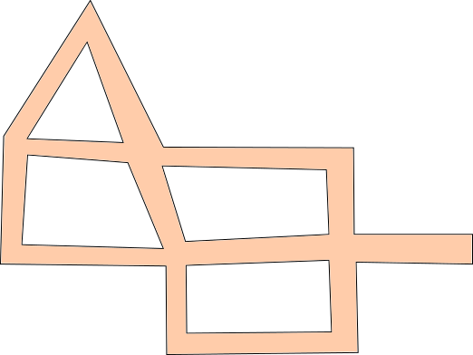
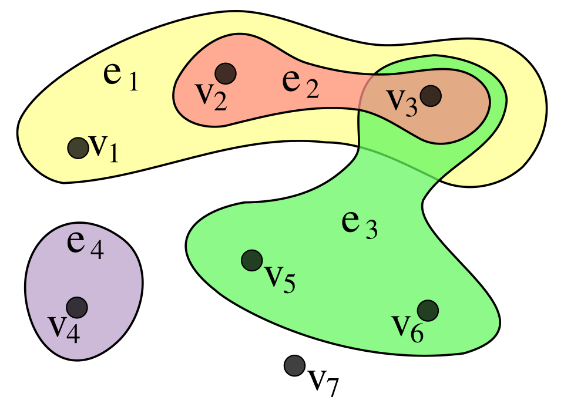
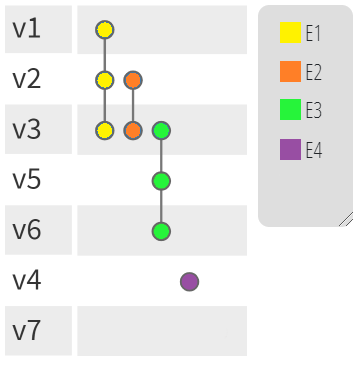

# Coberturas de Vértices

## Problema das Câmeras

:::: columns
::: {.column width="55%"}

Suponha um museu (ou galeria de arte) onde estão expostos diversos quadros muito valiosos. Para elaborar um sistema de monitoramento adequado, há disponíveis diversas câmeras de vigilância, que podem ser instaladas em entroncamentos de corredores do museu. Por simplicidade, assumimos que cada câmera permite a vigilância (em 360 graus) de todos os corredores a ela associados **até o próximo entroncamento**.

:::
::: {.column width="45%"}
{width=100%}


:::
::::

. . .

:::{.block-def}
[**Pergunta:**]{.label-qstn} Qual o menor número de câmeras que precisamos instalar (e onde elas devem estar) para que não haja nenhum corredor do museu descoberto?
:::

## Problema das Câmeras: Grafo Associado

Podemos a partir do mapa do museu, gerar um grafo associado:

:::: columns
::: {.column width="45%"}
{width=100%}

Mapa do museu
:::

::: {.column width="45%"}


<div id="grafo-galeria1" style="width: 100%; max-width: 450px; aspect-ratio: 1.05; margin: 0.35rem auto 0; border: 1px solid #d9d9d9; border-radius: 8px; background: #fcfcfc; overflow: hidden;"></div>

<div style="text-align: center;">Grafo associado</div>

<script src="https://unpkg.com/cytoscape@3.30.2/dist/cytoscape.min.js"></script>
<script>
(() => {
  const container = document.getElementById("grafo-galeria1");
  if (!container || typeof cytoscape === "undefined") return;

  const defaultNode = { color: "#23373b", borderColor: "#1a2a2d" };
  const coverNode = { color: "#1565c0", borderColor: "#0d47a1" };

  const nodes = [
    ["r1c2", 140, 40, defaultNode],
    ["r2c1", 60, 120, defaultNode],
    ["r2c2", 140, 120, defaultNode],
    ["r2c3", 220, 120, defaultNode],
    ["r3c1", 60, 190, defaultNode],
    ["r3c2", 140, 190, defaultNode],
    ["r3c3", 220, 190, defaultNode],
    ["r3c4", 280, 190, defaultNode],
    ["r4c2", 140, 250, defaultNode],
    ["r4c3", 220, 250, defaultNode]
  ];

  const edges = [
    ["r1c2", "r2c1"],
    ["r1c2", "r2c2"],
    ["r2c1", "r2c2"],
    ["r2c1", "r3c1"],
    ["r2c2", "r2c3"],
    ["r2c2", "r3c2"],
    ["r2c3", "r3c3"],
    ["r3c1", "r3c2"],
    ["r3c2", "r3c3"],
    ["r3c2", "r4c2"],
    ["r3c3", "r3c4"],
    ["r3c3", "r4c3"],
    ["r4c2", "r4c3"]
  ];

  const cy = cytoscape({
    container,
    elements: [
      ...nodes.map(([id, x, y, colors]) => ({
        data: { id, ...colors },
        position: { x, y }
      })),
      ...edges.map(([source, target], i) => ({
        data: { id: `e${i}`, source, target }
      }))
    ],
    style: [
      {
        selector: "node",
        style: {
          width: 18,
          height: 18,
          "background-color": "data(color)",
          "border-width": 2,
          "border-color": "data(borderColor)"
        }
      },
      {
        selector: "edge",
        style: {
          width: 3,
          "line-color": "#555555",
          "curve-style": "straight"
        }
      }
    ],
    layout: { name: "preset", fit: true, padding: 24 },
    userZoomingEnabled: false,
    userPanningEnabled: false,
    boxSelectionEnabled: false,
    autoungrabify: true
  });

  const fitGraph = () => {
    cy.resize();
    cy.fit(undefined, 24);
  };

  fitGraph();

  if (typeof ResizeObserver !== "undefined") {
    const resizeObserver = new ResizeObserver(fitGraph);
    resizeObserver.observe(container);
  }
})();
</script>

:::
::::

## Cobertura de Vértices

:::{.block-def}
[**Def.**]{.label-def} Seja $G = (V,E)$ um grafo simples. Uma [**cobertura de vértices**]{style="color:#2e75b6"} é um subconjunto $X \subseteq V$ tal que, para toda aresta $\{x,y\} \in E$,

$$x \in X \quad \text{ou}\quad  y \in X.$$
:::

. . .

[**Ex.**]{.label-exmp} Abaixo temos em [azul]{style="color:#2e75b6"} uma [cobertura de vértices]{style="color:#2e75b6"} para o grafo do museu.

<div id="grafo-galeria2" style="width: 100%; max-width: 450px; aspect-ratio: 1.05; margin: 0.35rem auto 0; border: 1px solid #d9d9d9; border-radius: 8px; background: #fcfcfc; overflow: hidden;"></div>

<div style="text-align: center;">Grafo associado</div>

<script src="https://unpkg.com/cytoscape@3.30.2/dist/cytoscape.min.js"></script>
<script>
(() => {
  const container = document.getElementById("grafo-galeria2");
  if (!container || typeof cytoscape === "undefined") return;

  const defaultNode = { color: "#23373b", borderColor: "#1a2a2d" };
  const coverNode = { color: "#1565c0", borderColor: "#0d47a1" };

  const nodes = [
    ["r1c2", 140, 40, coverNode],
    ["r2c1", 60, 120, coverNode],
    ["r2c2", 140, 120, defaultNode],
    ["r2c3", 220, 120, coverNode],
    ["r3c1", 60, 190, defaultNode],
    ["r3c2", 140, 190, coverNode],
    ["r3c3", 220, 190, defaultNode],
    ["r3c4", 280, 190, coverNode],
    ["r4c2", 140, 250, defaultNode],
    ["r4c3", 220, 250, coverNode]
  ];

  const edges = [
    ["r1c2", "r2c1"],
    ["r1c2", "r2c2"],
    ["r2c1", "r2c2"],
    ["r2c1", "r3c1"],
    ["r2c2", "r2c3"],
    ["r2c2", "r3c2"],
    ["r2c3", "r3c3"],
    ["r3c1", "r3c2"],
    ["r3c2", "r3c3"],
    ["r3c2", "r4c2"],
    ["r3c3", "r3c4"],
    ["r3c3", "r4c3"],
    ["r4c2", "r4c3"]
  ];

  const cy = cytoscape({
    container,
    elements: [
      ...nodes.map(([id, x, y, colors]) => ({
        data: { id, ...colors },
        position: { x, y }
      })),
      ...edges.map(([source, target], i) => ({
        data: { id: `e${i}`, source, target }
      }))
    ],
    style: [
      {
        selector: "node",
        style: {
          width: 18,
          height: 18,
          "background-color": "data(color)",
          "border-width": 2,
          "border-color": "data(borderColor)"
        }
      },
      {
        selector: "edge",
        style: {
          width: 3,
          "line-color": "#555555",
          "curve-style": "straight"
        }
      }
    ],
    layout: { name: "preset", fit: true, padding: 24 },
    userZoomingEnabled: false,
    userPanningEnabled: false,
    boxSelectionEnabled: false,
    autoungrabify: true
  });

  const fitGraph = () => {
    cy.resize();
    cy.fit(undefined, 24);
  };

  fitGraph();

  if (typeof ResizeObserver !== "undefined") {
    const resizeObserver = new ResizeObserver(fitGraph);
    resizeObserver.observe(container);
  }
})();
</script>

## Cobertura de Vértices Mínima

:::{.block-def}
[**Def.**]{.label-def} Uma [**cobertura de vértices**]{style="color:#2e75b6"} $X$ de um grafo simples $G$ é [mínima]{style="color:red"} sss para toda [cobertura de vértices]{style="color:#2e75b6"} $Y$ de $G$, $|X| \leq |Y|$.


[**Not.**]{.label-notn} Denotamos $\textcolor{#2e75b6}{\beta}(G) = |X|$ a cardinalidade de uma [**cobertura de vértices mínima**]{style="color:#2e75b6"} $X$ de $G$.
:::

. . .

[**Exemplo.**]{.label-exmp} No caso do museu, temos abaixo ([em azul]{style="color:#2e75b6"}) uma [cobertura mínima]{style="color:#2e75b6"} com 5 nodos (note que há outras coberturas mínimas possíveis).

<div id="grafo-galeria3" style="width: 75%; aspect-ratio: 2.2; margin: 0.35rem auto 0; border: 1px solid #d9d9d9; border-radius: 8px; background: #fcfcfc; resize: both; overflow: hidden;"></div>

<script src="https://unpkg.com/cytoscape@3.30.2/dist/cytoscape.min.js"></script>
<script>
(() => {
  const container = document.getElementById("grafo-galeria3");
  if (!container || typeof cytoscape === "undefined") return;

  const defaultNode = { color: "#23373b", borderColor: "#1a2a2d" };
  const coverNode = { color: "#1565c0", borderColor: "#0d47a1" };

  const nodes = [
    ["r1c2", 140, 40, coverNode],
    ["r2c1", 60, 120, defaultNode],
    ["r2c2", 140, 120, coverNode],
    ["r2c3", 220, 120, defaultNode],
    ["r3c1", 60, 190, coverNode],
    ["r3c2", 140, 190, defaultNode],
    ["r3c3", 220, 190, coverNode],
    ["r3c4", 280, 190, defaultNode],
    ["r4c2", 140, 250, coverNode],
    ["r4c3", 220, 250, defaultNode]
  ];

  const edges = [
    ["r1c2", "r2c1"],
    ["r1c2", "r2c2"],
    ["r2c1", "r2c2"],
    ["r2c1", "r3c1"],
    ["r2c2", "r2c3"],
    ["r2c2", "r3c2"],
    ["r2c3", "r3c3"],
    ["r3c1", "r3c2"],
    ["r3c2", "r3c3"],
    ["r3c2", "r4c2"],
    ["r3c3", "r3c4"],
    ["r3c3", "r4c3"],
    ["r4c2", "r4c3"]
  ];

  const cy = cytoscape({
    container,
    elements: [
      ...nodes.map(([id, x, y, colors]) => ({
        data: { id, ...colors },
        position: { x, y }
      })),
      ...edges.map(([source, target], i) => ({
        data: { id: `e${i}`, source, target }
      }))
    ],
    style: [
      {
        selector: "node",
        style: {
          width: 18,
          height: 18,
          "background-color": "data(color)",
          "border-width": 2,
          "border-color": "data(borderColor)"
        }
      },
      {
        selector: "edge",
        style: {
          width: 3,
          "line-color": "#555555",
          "curve-style": "straight"
        }
      }
    ],
    layout: { name: "preset", fit: true, padding: 24 },
    userZoomingEnabled: false,
    userPanningEnabled: false,
    boxSelectionEnabled: false,
    autoungrabify: true
  });

  const fitGraph = () => { cy.resize(); cy.fit(undefined, 24); };
  
  if (typeof Reveal !== 'undefined') {
    Reveal.on('slidechanged', event => {
      if (container.closest('section') === event.currentSlide) {
        setTimeout(fitGraph, 10);
      }
    });
    Reveal.on('ready', event => {
       if (container.closest('section') === event.currentSlide) {
        setTimeout(fitGraph, 10);
      }
    });
  }
  
  if (typeof ResizeObserver !== "undefined") {
    new ResizeObserver(fitGraph).observe(container);
  }
  
  setTimeout(fitGraph, 100);
})();
</script>

$\quad \textcolor{#2e75b6}{\beta}(G) = 5$

## Cobertura de Vértices: Algoritmos

- Determinar para um grafo de entrada $G$ uma [cobertura mínima]{style="color:#2e75b6"} é o problema da [**Cobertura Mínima de Vértices (CMV)**]{style="color:#2e75b6"}, em inglês *minimum vertex cover (MVC)*.

<br>

- **Algoritmo ingênuo (ineficiente):** Gerar progressivamente todos os subconjuntos de vértices (ordenados por tamanho) e testar se todas as arestas estão cobertas.

<br>

. . .

- *CMV* é um problema conhecidamente [NP-difícil]{.alert-text}, para o qual habitualmente são utilizadas heurísticas.

<br>

- Outras disciplinas detalharão algoritmos e heurísticas para esse problema.

## Exercício

Determine uma [cobertura de vértices mínima]{style="color:#2e75b6"} e parâmetro $\textcolor{#2e75b6}{\beta}$ do seguinte grafo:

<br>

<div id="grafo-exercicio-cmv" data-scale="1.75" style="max-width: 100%; margin: 0.35rem auto 0; border: 1px solid #d9d9d9; border-radius: 8px; background: #fcfcfc; overflow: hidden;"></div>

<script src="https://unpkg.com/cytoscape@3.30.2/dist/cytoscape.min.js"></script>
<script>
(() => {
  const container = document.getElementById("grafo-exercicio-cmv");
  if (!container || typeof cytoscape === "undefined") return;

  const graphScale = Number(container.dataset.scale) || 1;
  const graphPadding = 64;
  const nodeSize = 18 * graphScale;
  const nodeBorderWidth = 2 * graphScale;
  const edgeWidth = 3 * graphScale;
  const curvedEdgeDistance = 56 * graphScale;

  const palette = [
    { color: "#23373b", borderColor: "#1a2a2d" },
    { color: "#1565c0", borderColor: "#0d47a1" },
    { color: "#c62828", borderColor: "#8e1b1b" },
    { color: "#2e7d32", borderColor: "#1b5e20" },
    { color: "#f9a825", borderColor: "#c17900" }
  ];

  const nodes = [
    ["r1c2", 160, 40],
    ["r1c3", 260, 40],
    ["r1c4", 360, 40],
    ["r2c1", 60, 120],
    ["r2c2", 160, 120],
    ["r2c3", 260, 120],
    ["r2c4", 360, 120],
    ["r3c2", 160, 210],
    ["r3c3", 260, 210],
    ["r3c4", 360, 210],
    ["r4c1", 60, 300],
    ["r4c2", 160, 300],
    ["r4c3", 260, 300],
    ["r4c4", 360, 300]
  ];

  const xs = nodes.map(([, x]) => x);
  const ys = nodes.map(([, , y]) => y);
  const minX = Math.min(...xs);
  const maxX = Math.max(...xs);
  const minY = Math.min(...ys);
  const maxY = Math.max(...ys);

  container.style.width = `${(maxX - minX + 2 * graphPadding) * graphScale}px`;
  container.style.height = `${(maxY - minY + 2 * graphPadding) * graphScale}px`;

  const edges = [
    ["r1c2", "r2c2"],
    ["r1c2", "r2c3"],
    ["r1c3", "r2c3"],
    ["r1c4", "r2c4"],
    ["r2c1", "r1c2"],
    ["r2c1", "r1c4"],
    ["r2c2", "r3c3"],
    ["r2c4", "r2c3"],
    ["r3c2", "r2c3"],
    ["r3c3", "r4c4"],
    ["r3c3", "r3c4"],
    ["r3c4", "r4c4"],
    ["r4c1", "r4c4", "curved"],
    ["r4c2", "r3c2"],
    ["r4c4", "r4c3"]
  ];

  const cy = cytoscape({
    container,
    elements: [
      ...nodes.map(([id, x, y]) => ({
        data: { id, colorIndex: 0, ...palette[0] },
        position: {
          x: (x - minX + graphPadding) * graphScale,
          y: (y - minY + graphPadding) * graphScale
        }
      })),
      ...edges.map(([source, target, curve], i) => ({
        data: { id: `ex${i}`, source, target },
        classes: curve || ""
      }))
    ],
    style: [
      {
        selector: "node",
        style: {
          width: nodeSize,
          height: nodeSize,
          "background-color": "data(color)",
          "border-width": nodeBorderWidth,
          "border-color": "data(borderColor)",
          "cursor": "pointer"
        }
      },
      {
        selector: "edge",
        style: {
          width: edgeWidth,
          "line-color": "#555555",
          "curve-style": "straight"
        }
      },
      {
        selector: "edge.curved",
        style: {
          "curve-style": "unbundled-bezier",
          "control-point-distances": curvedEdgeDistance,
          "control-point-weights": 0.5
        }
      }
    ],
    layout: { name: "preset", fit: false },
    userZoomingEnabled: false,
    userPanningEnabled: false,
    boxSelectionEnabled: false,
    autoungrabify: true
  });

  cy.on("tap", "node", (event) => {
    const node = event.target;
    const colorIndex = (node.data("colorIndex") + 1) % palette.length;
    node.data({ colorIndex, ...palette[colorIndex] });
  });
})();
</script>

# Conjunto Independente

## Maior Conjunto Independente

Lembremos que um [**conjunto independente**]{style="color:#c40000"} de um grafo simples $G=(V,E)$ é um subconjunto de vértices $X \subseteq V$ tal que, para quaisquer dois nodos $x,y \in X$, não há aresta entre eles ($\{x,y\} \notin E$).

> [**Notação.**]{.label-notn} Denotamos $\textcolor{#c40000}{\alpha}(G)$ o tamanho do [conjunto independente]{style="color:#c40000"} máximo (de maior tamanho) de $G$. Também chamado *número de estabilidade* de $G$.

. . .

[**Exemplo.**]{.label-exmp} Para o grafo do museu, [em vermelho]{style="color:#c40000"} temos um [conjunto independente]{style="color:#c40000"} máximo.


:::: {.columns style='display: flex; align-items: center;'}

::: {.column width="50%"}
<div id="grafo-galeria4" style="width: 75%; aspect-ratio: 1.05; margin: 0.35rem auto 0; border: 1px solid #d9d9d9; border-radius: 8px; background: #fcfcfc; overflow: hidden;"></div>

<script src="https://unpkg.com/cytoscape@3.30.2/dist/cytoscape.min.js"></script>
<script>
(() => {
  const container = document.getElementById("grafo-galeria4");
  if (!container || typeof cytoscape === "undefined") return;

  const defaultNode = { color: "#23373b", borderColor: "#1a2a2d" };
  const coverNode = { color: "#1565c0", borderColor: "#0d47a1" };
  const independentNode = { color: "#c40000", borderColor: "#800000ff" };

  const nodes = [
    ["r1c2", 140, 40, independentNode],
    ["r2c1", 60, 120, defaultNode],
    ["r2c2", 140, 120, defaultNode],
    ["r2c3", 220, 120, independentNode],
    ["r3c1", 60, 190, independentNode],
    ["r3c2", 140, 190, defaultNode],
    ["r3c3", 220, 190, defaultNode],
    ["r3c4", 280, 190, independentNode],
    ["r4c2", 140, 250, independentNode],
    ["r4c3", 220, 250, defaultNode]
  ];

  const edges = [
    ["r1c2", "r2c1"],
    ["r1c2", "r2c2"],
    ["r2c1", "r2c2"],
    ["r2c1", "r3c1"],
    ["r2c2", "r2c3"],
    ["r2c2", "r3c2"],
    ["r2c3", "r3c3"],
    ["r3c1", "r3c2"],
    ["r3c2", "r3c3"],
    ["r3c2", "r4c2"],
    ["r3c3", "r3c4"],
    ["r3c3", "r4c3"],
    ["r4c2", "r4c3"]
  ];

  const cy = cytoscape({
    container,
    elements: [
      ...nodes.map(([id, x, y, colors]) => ({
        data: { id, ...colors },
        position: { x, y }
      })),
      ...edges.map(([source, target], i) => ({
        data: { id: `e${i}`, source, target }
      }))
    ],
    style: [
      {
        selector: "node",
        style: {
          width: 18,
          height: 18,
          "background-color": "data(color)",
          "border-width": 2,
          "border-color": "data(borderColor)"
        }
      },
      {
        selector: "edge",
        style: {
          width: 3,
          "line-color": "#555555",
          "curve-style": "straight"
        }
      }
    ],
    layout: { name: "preset", fit: true, padding: 24 },
    userZoomingEnabled: false,
    userPanningEnabled: false,
    boxSelectionEnabled: false,
    autoungrabify: true
  });

  const fitGraph = () => {
    cy.resize();
    cy.fit(undefined, 24);
  };

  fitGraph();

  if (typeof ResizeObserver !== "undefined") {
    const resizeObserver = new ResizeObserver(fitGraph);
    resizeObserver.observe(container);
  }
})();
</script>
:::

::: {.column width="50%"}


$\quad \textcolor{#c40000}{\alpha}(G) = 5$

<br>

[**P.**]{.label-qstn} Dado um grafo simples $G$, existe alguma relação entre $\textcolor{#c40000}{\alpha}(G)$ e $\textcolor{#2e75b6}{\beta}(G)$?

:::

::::


## Relação entre $\textcolor{#c40000}{\alpha}(G)$ e $\textcolor{#2e75b6}{\beta}(G)$

Seja $G=(V,E)$ um grafo simples.

<br>

:::{.block-def}
[**Obs.**]{.label-rmk} Se $X \subseteq V$ for uma [cobertura de vértices]{style="color:#2e75b6"}, então $V-X$ é um [conjunto independente]{style="color:#c40000"}.

[**Obs.**]{.label-rmk} Se $Y \subseteq V$ for um [conjunto independente]{style="color:#c40000"}, então $V-Y$ é uma [cobertura de vértices]{style="color:#2e75b6"}.
:::

. . .

<br>

:::{.block-lem}
[**Lema.**]{.label-lem}

$$\textcolor{#c40000}{\alpha}(G) + \textcolor{#2e75b6}{\beta}(G) = |V|$$
:::

<!-- Shared museum graph renderer -->
<script src="https://unpkg.com/cytoscape@3.30.2/dist/cytoscape.min.js"></script>
<script>
window.renderedGraphs = window.renderedGraphs || new Set();

function renderMuseuGraph(containerId) {
  const container = document.getElementById(containerId);
  if (!container || typeof cytoscape === "undefined") return;

  const coverNode = { color: "#1565c0", borderColor: "#0d47a1" };
  const independentNode = { color: "#c40000", borderColor: "#800000ff" };

  const nodes = [
    ["r1c2", 140, 40, independentNode],
    ["r2c1", 60, 120, coverNode],
    ["r2c2", 140, 120, coverNode],
    ["r2c3", 220, 120, independentNode],
    ["r3c1", 60, 190, independentNode],
    ["r3c2", 140, 190, coverNode],
    ["r3c3", 220, 190, coverNode],
    ["r3c4", 280, 190, independentNode],
    ["r4c2", 140, 250, independentNode],
    ["r4c3", 220, 250, coverNode]
  ];

  const edges = [
    ["r1c2", "r2c1"], ["r1c2", "r2c2"],
    ["r2c1", "r2c2"], ["r2c1", "r3c1"],
    ["r2c2", "r2c3"], ["r2c2", "r3c2"],
    ["r2c3", "r3c3"], ["r3c1", "r3c2"],
    ["r3c2", "r3c3"], ["r3c2", "r4c2"],
    ["r3c3", "r3c4"], ["r3c3", "r4c3"],
    ["r4c2", "r4c3"]
  ];

  const cy = cytoscape({
    container,
    elements: [
      ...nodes.map(([id, x, y, colors]) => ({
        data: { id, ...colors },
        position: { x, y }
      })),
      ...edges.map(([source, target], i) => ({
        data: { id: `e${i}`, source, target }
      }))
    ],
    style: [
      {
        selector: "node",
        style: {
          width: 18, height: 18,
          "background-color": "data(color)",
          "border-width": 2,
          "border-color": "data(borderColor)"
        }
      },
      {
        selector: "edge",
        style: {
          width: 3,
          "line-color": "#555555",
          "curve-style": "straight"
        }
      }
    ],
    layout: { name: "preset", fit: true, padding: 24 },
    userZoomingEnabled: false,
    userPanningEnabled: false,
    boxSelectionEnabled: false,
    autoungrabify: true
  });

  const fitGraph = () => { cy.resize(); cy.fit(undefined, 24); };
  
  // Need to fit when container becomes visible in Reveal.js
  if (typeof Reveal !== 'undefined') {
    Reveal.on('slidechanged', event => {
      if (container.closest('section') === event.currentSlide) {
        setTimeout(fitGraph, 10);
      }
    });
    Reveal.on('ready', event => {
       if (container.closest('section') === event.currentSlide) {
        setTimeout(fitGraph, 10);
      }
    });
  }
  
  if (typeof ResizeObserver !== "undefined") {
    new ResizeObserver(fitGraph).observe(container);
  }
  
  // Attempt initial fit
  setTimeout(fitGraph, 100);
}
</script>

## Relação entre $\textcolor{#c40000}{\alpha}(G)$ e $\textcolor{#2e75b6}{\beta}(G)$

:::: {.columns style='display: flex; align-items: center;'}

::: {.column width="60%"}
Seja $\textcolor{#c40000}{S} \subseteq V$ um [conjunto independente]{style="color:#c40000"} de tamanho $\textcolor{#c40000}{\alpha}(G)$.

:::{.incremental}
- $\textcolor{#2e75b6}{V - S}$ tem tamanho $|V| - \textcolor{#c40000}{\alpha}(G)$.
- Considere uma aresta arbitrária $\{u,v\} \in E$.
- $\textcolor{#c40000}{S}$ é [conjunto independente]{style="color:#c40000"}
    - $\Rightarrow$ ou $u \notin \textcolor{#c40000}{S}$, ou $v \notin \textcolor{#c40000}{S}$, ou ambos.
    - $\Rightarrow$ ou $u \in \textcolor{#2e75b6}{V - S}$, ou $v \in \textcolor{#2e75b6}{V - S}$, ou ambos.
- Portanto, $\textcolor{#2e75b6}{V - S}$ cobre a aresta $\{u,v\}$.
:::
:::

::: {.column width="40%"}
<div id="grafo-prova-alpha" style="width: 100%; aspect-ratio: 1.05; margin: 0.35rem auto 0; border: 1px solid #d9d9d9; border-radius: 8px; background: #fcfcfc; overflow: hidden;"></div>
<script>renderMuseuGraph("grafo-prova-alpha");</script>
:::

::::

## Relação entre $\textcolor{#c40000}{\alpha}(G)$ e $\textcolor{#2e75b6}{\beta}(G)$

:::: {.columns style='display: flex; align-items: center;'}

::: {.column width="60%"}
Seja $\textcolor{#2e75b6}{C} \subseteq V$ uma [cobertura de vértices]{style="color:#2e75b6"} de tamanho $\textcolor{#2e75b6}{\beta}(G)$.

:::{.incremental}
- $\textcolor{#c40000}{V - C}$ tem tamanho $|V| - \textcolor{#2e75b6}{\beta}(G)$.
- Considere uma aresta arbitrária $\{u,v\} \in E$.
- $\textcolor{#2e75b6}{C}$ é uma [cobertura de vértices]{style="color:#2e75b6"}
    - $\Rightarrow$ ou $u \in \textcolor{#2e75b6}{C}$, ou $v \in \textcolor{#2e75b6}{C}$, ou ambos.
    - $\Rightarrow$ ou $u \notin \textcolor{#c40000}{V - C}$, ou $v \notin \textcolor{#c40000}{V - C}$, ou ambos.
- Portanto, $\textcolor{#c40000}{V - C}$ é [conjunto independente]{style="color:#c40000"}.
:::
:::

::: {.column width="40%"}
<div id="grafo-prova-beta" style="width: 100%; aspect-ratio: 1.05; margin: 0.35rem auto 0; border: 1px solid #d9d9d9; border-radius: 8px; background: #fcfcfc; overflow: hidden;"></div>
<script>renderMuseuGraph("grafo-prova-beta");</script>
:::

::::

## Relação entre $\textcolor{#c40000}{\alpha}(G)$ e $\chi(G)$

Seja $G=(V,E)$ um grafo simples.

<br>

[**Obs.**]{.label-rmk} Uma coloração de vértices de G corresponde a uma partição dos seus vértices em [subconjuntos independentes]{style="color:#c40000"}. O número mínimo de cores necessárias numa coloração de vértices é o número cromático $\chi(G)$.

:::{.block-lem}
[**Lema.**]{.label-lem}

$$
\chi(G) \geq \frac{|V|}{\textcolor{#c40000}{\alpha}(G)}
$$
:::

[**Prova.**]{.label-prf}

- Um grafo pode ser colorido com $\chi(G)$ cores. Cada uma dessas cores forma um [conjunto independente]{style="color:#c40000"}. 
- Como o tamanho máximo de qualquer [conjunto independente]{style="color:#c40000"} é $\textcolor{#c40000}{\alpha}(G)$, cada uma das $\chi(G)$ pode colorir no máximo $\textcolor{#c40000}{\alpha}(G)$ nodos.

## $\textcolor{#c40000}{\alpha}(G)$ e Grafos de Intervalo

{width=80%}

> [Visualização](https://brunogrisci.github.io/schedulingalgorithms)

# Emparelhamentos

## Emparelhamentos

> [**Def.**]{.label-def} Seja $G=(V,E)$ um grafo simples. Um **emparelhamento** de $G$ é um subconjunto $A \subseteq E$ onde, para todas arestas $e_1,e_2 \in A$, temos que $e_1$ e $e_2$ não são *adjacentes* (isto é, não possuem nenhum vértice em comum).

<br>

[**Obs.**]{.label-rmk} Um emparelhamento também é chamado *acoplamento*, *conjunto independente de arestas* ou *casamento*. Em inglês, usa-se a expressão *matching*.

. . .

[**Ex.**]{.label-exmp} Emparelhamento [(em azul)]{style="color:blue"} contendo três arestas.

<br>

<div id="grafo-emparelhamento1" style="width: 600px; max-width: 100%; aspect-ratio: 2.8; margin: 0.5rem auto; border: 1px solid #d9d9d9; border-radius: 8px; background: #fcfcfc; resize: both; overflow: hidden;"></div>

<script src="https://unpkg.com/cytoscape@3.30.2/dist/cytoscape.min.js"></script>
<script>
(() => {
  const container = document.getElementById("grafo-emparelhamento1");
  if (!container || typeof cytoscape === "undefined") return;

  const defaultNode = { color: "#23373b", borderColor: "#1a2a2d" };
  const blueEdge = { lineColor: "#1565c0", width: 5 };
  const defaultEdge = { lineColor: "#555555", width: 3 };

  const nodes = [
    ["r1c1", 50, 50], ["r1c2", 150, 50], ["r1c3", 250, 50], ["r1c4", 350, 50],
    ["r2c1", 50, 150], ["r2c2", 150, 150], ["r2c3", 250, 150], ["r2c4", 350, 150]
  ];

  const edges = [
    ["e1", "r1c1", "r2c1", defaultEdge],
    ["e2", "r1c1", "r1c2", blueEdge],
    ["e3", "r1c2", "r2c2", defaultEdge],
    ["e4", "r1c3", "r2c3", defaultEdge],
    ["e5", "r1c3", "r1c4", blueEdge],
    ["e6", "r1c4", "r2c4", defaultEdge],
    ["e7", "r2c1", "r2c2", defaultEdge],
    ["e8", "r2c2", "r2c3", blueEdge],
    ["e9", "r2c3", "r2c4", defaultEdge]
  ];

  const cy = cytoscape({
    container,
    elements: [
      ...nodes.map(([id, x, y]) => ({
        data: { id, ...defaultNode },
        position: { x, y }
      })),
      ...edges.map(([id, source, target, style]) => ({
        data: { id, source, target, lineColor: style.lineColor, width: style.width }
      }))
    ],
    style: [
      {
        selector: "node",
        style: {
          width: 18, height: 18,
          "background-color": "data(color)",
          "border-width": 2,
          "border-color": "data(borderColor)"
        }
      },
      {
        selector: "edge",
        style: {
          width: "data(width)",
          "line-color": "data(lineColor)",
          "curve-style": "straight"
        }
      }
    ],
    layout: { name: "preset", fit: true, padding: 32 },
    userZoomingEnabled: false,
    userPanningEnabled: false,
    boxSelectionEnabled: false,
    autoungrabify: true
  });

  const fitGraph = () => { cy.resize(); cy.fit(undefined, 32); };
  
  if (typeof Reveal !== 'undefined') {
    Reveal.on('slidechanged', event => {
      if (container.closest('section') === event.currentSlide) {
        setTimeout(fitGraph, 10);
      }
    });
    Reveal.on('ready', event => {
       if (container.closest('section') === event.currentSlide) {
        setTimeout(fitGraph, 10);
      }
    });
  }
  
  if (typeof ResizeObserver !== "undefined") {
    new ResizeObserver(fitGraph).observe(container);
  }
  
  setTimeout(fitGraph, 100);
})();
</script>


## Emparelhamentos Perfeitos

> [**Def.**]{.label-def} Se um emparelhamento $A$ de $G$ incidir sobre todos os vértices do grafo, dizemos que $A$ é um **emparelhamento perfeito**.

. . .

[**Obs.**]{.label-rmk} Só é possível haver emparelhamentos perfeitos quando $|V|$ for par.

<br> 

. . .

[**Not.**]{.label-notn} Denotamos $\textcolor{#c40000}{\alpha'}(G)$ o tamanho do emparelhamento máximo (de maior tamanho) do grafo $G$.

<br> 

. . .

[**Obs.**]{.label-rmk} Note que o maior emparelhamento pode não ser perfeito.

<br>

. . .

[**Ex.**]{.label-exmp} Emparelhamento perfeito e máximo [(em azul)]{style="color:blue"}:

<div id="grafo-emparelhamento2" style="width: 600px; max-width: 100%; aspect-ratio: 2.8; margin: 0.5rem auto; border: 1px solid #d9d9d9; border-radius: 8px; background: #fcfcfc; resize: both; overflow: hidden;"></div>

<script src="https://unpkg.com/cytoscape@3.30.2/dist/cytoscape.min.js"></script>
<script>
(() => {
  const container = document.getElementById("grafo-emparelhamento2");
  if (!container || typeof cytoscape === "undefined") return;

  const defaultNode = { color: "#23373b", borderColor: "#1a2a2d" };
  const blueEdge = { lineColor: "#1565c0", width: 5 };
  const defaultEdge = { lineColor: "#555555", width: 3 };

  const nodes = [
    ["r1c1", 50, 50], ["r1c2", 150, 50], ["r1c3", 250, 50], ["r1c4", 350, 50],
    ["r2c1", 50, 150], ["r2c2", 150, 150], ["r2c3", 250, 150], ["r2c4", 350, 150]
  ];

  const edges = [
    ["e1", "r1c1", "r2c1", blueEdge],
    ["e2", "r1c1", "r1c2", defaultEdge],
    ["e3", "r1c2", "r2c2", blueEdge],
    ["e4", "r1c3", "r2c3", defaultEdge],
    ["e5", "r1c3", "r1c4", blueEdge],
    ["e6", "r1c4", "r2c4", defaultEdge],
    ["e7", "r2c1", "r2c2", defaultEdge],
    ["e8", "r2c2", "r2c3", defaultEdge],
    ["e9", "r2c3", "r2c4", blueEdge]
  ];

  const cy = cytoscape({
    container,
    elements: [
      ...nodes.map(([id, x, y]) => ({
        data: { id, ...defaultNode },
        position: { x, y }
      })),
      ...edges.map(([id, source, target, style]) => ({
        data: { id, source, target, lineColor: style.lineColor, width: style.width }
      }))
    ],
    style: [
      {
        selector: "node",
        style: {
          width: 18, height: 18,
          "background-color": "data(color)",
          "border-width": 2,
          "border-color": "data(borderColor)"
        }
      },
      {
        selector: "edge",
        style: {
          width: "data(width)",
          "line-color": "data(lineColor)",
          "curve-style": "straight"
        }
      }
    ],
    layout: { name: "preset", fit: true, padding: 32 },
    userZoomingEnabled: false,
    userPanningEnabled: false,
    boxSelectionEnabled: false,
    autoungrabify: true
  });

  const fitGraph = () => { cy.resize(); cy.fit(undefined, 32); };
  
  if (typeof Reveal !== 'undefined') {
    Reveal.on('slidechanged', event => {
      if (container.closest('section') === event.currentSlide) {
        setTimeout(fitGraph, 10);
      }
    });
    Reveal.on('ready', event => {
       if (container.closest('section') === event.currentSlide) {
        setTimeout(fitGraph, 10);
      }
    });
  }
  
  if (typeof ResizeObserver !== "undefined") {
    new ResizeObserver(fitGraph).observe(container);
  }
  
  setTimeout(fitGraph, 100);
})();
</script>

## Emparelhamentos e Conjuntos Independentes{.small}


:::{.block-def}
[**Def.**]{.label-def} Seja $G=(V,E)$ um grafo simples. Denotamos **grafo linha de $G$** o grafo simples $L(G)=(V',E')$ onde


- $V' = E$
- $\{e_1,e_2\} \in E'$ sss as arestas $e_1$ e $e_2$ compartilham exatamente um vértice.
:::

[**Exemplo:**]{.label-exmp} 

::::{.columns}
::: {.column width="40%"}
<div style="text-align: center; font-weight: bold; margin-bottom: 0.5rem; font-size: 1.0em;">$G =$</div>
<div id="grafo-linha-g" style="width: 75%; aspect-ratio: 1.5; margin: 0 auto; border: 1px solid #d9d9d9; border-radius: 8px; background: #fcfcfc; overflow: hidden;"></div>
:::
::: {.column width="40%"}
<div style="text-align: center; font-weight: bold; margin-bottom: 0.5rem; font-size: 1.0em;">$L(G) =$</div>
<div id="grafo-linha-lg" style="width: 75%; aspect-ratio: 1.5; margin: 0 auto; border: 1px solid #d9d9d9; border-radius: 8px; background: #fcfcfc; overflow: hidden;"></div>
:::
::::

<script src="https://unpkg.com/cytoscape@3.30.2/dist/cytoscape.min.js"></script>
<script>
(() => {
  const setupResize = (cy, container) => {
    const fitGraph = () => { cy.resize(); cy.fit(undefined, 24); };
    if (typeof Reveal !== 'undefined') {
      Reveal.on('slidechanged', event => { if (container.closest('section') === event.currentSlide) setTimeout(fitGraph, 10); });
      Reveal.on('ready', event => { if (container.closest('section') === event.currentSlide) setTimeout(fitGraph, 10); });
    }
    if (typeof ResizeObserver !== "undefined") {
      new ResizeObserver(fitGraph).observe(container);
    }
    setTimeout(fitGraph, 100);
  };

  // Render G
  const containerG = document.getElementById("grafo-linha-g");
  if (containerG && typeof cytoscape !== "undefined") {
    const cyG = cytoscape({
      container: containerG,
      elements: [
        { data: { id: "v1" }, position: { x: 50, y: 50 } },
        { data: { id: "v2" }, position: { x: 150, y: 50 } },
        { data: { id: "v3" }, position: { x: 250, y: 50 } },
        { data: { id: "v4" }, position: { x: 50, y: 150 } },
        { data: { id: "v5" }, position: { x: 150, y: 150 } },
        { data: { id: "v6" }, position: { x: 250, y: 150 } },
        { data: { id: "c", source: "v1", target: "v4", label: "c" } },
        { data: { id: "d", source: "v1", target: "v2", label: "d" } },
        { data: { id: "a", source: "v1", target: "v5", label: "a" } },
        { data: { id: "b", source: "v2", target: "v3", label: "b" } },
        { data: { id: "e", source: "v4", target: "v5", label: "e" } }
      ],
      style: [
        { selector: 'node', style: { width: 14, height: 14, 'background-color': '#23373b' } },
        { selector: 'edge', style: { 
            width: 3, 'line-color': '#555', 'curve-style': 'straight', 
            label: 'data(label)', 'font-size': 18, 
            'text-margin-y': -14, 'text-background-opacity': 1, 
            'text-background-color': '#fcfcfc', 'text-background-padding': 2,
            'color': '#1565c0', 'font-family': 'monospace', 'font-weight': 'bold'
        } }
      ],
      layout: { name: "preset", fit: true, padding: 24 },
      userZoomingEnabled: false, userPanningEnabled: false, boxSelectionEnabled: false
    });
    setupResize(cyG, containerG);
  }

  // Render L(G)
  const containerLG = document.getElementById("grafo-linha-lg");
  if (containerLG && typeof cytoscape !== "undefined") {
    const cyLG = cytoscape({
      container: containerLG,
      elements: [
        { data: { id: "c" }, position: { x: 50, y: 50 } },
        { data: { id: "d" }, position: { x: 150, y: 50 } },
        { data: { id: "b" }, position: { x: 250, y: 50 } },
        { data: { id: "e" }, position: { x: 50, y: 150 } },
        { data: { id: "a" }, position: { x: 150, y: 150 } },
        { data: { id: "e1", source: "c", target: "e" } },
        { data: { id: "e2", source: "c", target: "d" } },
        { data: { id: "e3", source: "c", target: "a" } },
        { data: { id: "e4", source: "d", target: "b" } },
        { data: { id: "e5", source: "d", target: "a" } },
        { data: { id: "e6", source: "e", target: "a" } }
      ],
      style: [
        { selector: 'node', style: { 
            width: 28, height: 28, 'background-color': '#e3f2fd', 
            'border-color': '#1565c0', 'border-width': 2, 
            label: 'data(id)', 'text-valign': 'center', 'text-halign': 'center', 
            'font-size': 16, 'font-weight': 'bold', 'color': '#0d47a1', 'font-family': 'monospace'
        } },
        { selector: 'edge', style: { width: 3, 'line-color': '#555', 'curve-style': 'straight' } }
      ],
      layout: { name: "preset", fit: true, padding: 24 },
      userZoomingEnabled: false, userPanningEnabled: false, boxSelectionEnabled: false
    });
    setupResize(cyLG, containerLG);
  }
})();
</script>

:::{.block-lem}
[**Lema.**]{.label-lem} Como cada emparelhamento em $G$ é um [conjunto independente]{style="color:#c40000"} em $L(G)$, temos
$$\textcolor{#c40000}{\alpha'}(G) = \textcolor{#c40000}{\alpha}(L(G)).$$
:::

## Exercício

Determine um **emparelhamento máximo** para o seguinte grafo:

<div id="grafo-exercicio-emp-max" data-scale="1.5" style="max-width: 100%; margin: 0.35rem auto 0; border: 1px solid #d9d9d9; border-radius: 8px; background: #fcfcfc; overflow: hidden;"></div>

<script src="https://unpkg.com/cytoscape@3.30.2/dist/cytoscape.min.js"></script>
<script>
(() => {
  const container = document.getElementById("grafo-exercicio-emp-max");
  if (!container || typeof cytoscape === "undefined") return;

  const graphScale = Number(container.dataset.scale) || 1;
  const graphPadding = 64;
  const nodeSize = 18 * graphScale;
  const nodeBorderWidth = 2 * graphScale;
  const edgeWidth = 3 * graphScale;
  const curvedEdgeDistance = 56 * graphScale;

  const palette = [
    { color: "#23373b", borderColor: "#1a2a2d" },
    { color: "#1565c0", borderColor: "#0d47a1" },
    { color: "#c62828", borderColor: "#8e1b1b" },
    { color: "#2e7d32", borderColor: "#1b5e20" },
    { color: "#f9a825", borderColor: "#c17900" }
  ];

  const nodes = [
    ["r1c2", 160, 40],
    ["r1c3", 260, 40],
    ["r1c4", 360, 40],
    ["r2c1", 60, 120],
    ["r2c2", 160, 120],
    ["r2c3", 260, 120],
    ["r2c4", 360, 120],
    ["r3c2", 160, 210],
    ["r3c3", 260, 210],
    ["r3c4", 360, 210],
    ["r4c1", 60, 300],
    ["r4c2", 160, 300],
    ["r4c3", 260, 300],
    ["r4c4", 360, 300]
  ];

  const xs = nodes.map(([, x]) => x);
  const ys = nodes.map(([, , y]) => y);
  const minX = Math.min(...xs);
  const maxX = Math.max(...xs);
  const minY = Math.min(...ys);
  const maxY = Math.max(...ys);

  container.style.width = `${(maxX - minX + 2 * graphPadding) * graphScale}px`;
  container.style.height = `${(maxY - minY + 2 * graphPadding) * graphScale}px`;

  const edges = [
    ["r1c2", "r2c2"],
    ["r1c2", "r2c3"],
    ["r1c3", "r2c3"],
    ["r1c4", "r2c4"],
    ["r2c1", "r1c2"],
    ["r2c1", "r1c4"],
    ["r2c2", "r3c3"],
    ["r2c4", "r2c3"],
    ["r3c2", "r2c3"],
    ["r3c3", "r4c4"],
    ["r3c3", "r3c4"],
    ["r3c4", "r4c4"],
    ["r4c1", "r4c4", "curved"],
    ["r4c2", "r3c2"],
    ["r4c4", "r4c3"]
  ];

  const cy = cytoscape({
    container,
    elements: [
      ...nodes.map(([id, x, y]) => ({
        data: { id, colorIndex: 0, ...palette[0] },
        position: {
          x: (x - minX + graphPadding) * graphScale,
          y: (y - minY + graphPadding) * graphScale
        }
      })),
      ...edges.map(([source, target, curve], i) => ({
        data: { id: `ex${i}`, source, target },
        classes: curve || ""
      }))
    ],
    style: [
      {
        selector: "node",
        style: {
          width: nodeSize,
          height: nodeSize,
          "background-color": "data(color)",
          "border-width": nodeBorderWidth,
          "border-color": "data(borderColor)",
          "cursor": "pointer"
        }
      },
      {
        selector: "edge",
        style: {
          width: edgeWidth,
          "line-color": "#555555",
          "curve-style": "straight",
          "cursor": "pointer"
        }
      },
      {
        selector: "edge.curved",
        style: {
          "curve-style": "unbundled-bezier",
          "control-point-distances": curvedEdgeDistance,
          "control-point-weights": 0.5
        }
      },
      {
        selector: "edge.blue",
        style: {
          "line-color": "#1565c0",
          width: 5 * graphScale
        }
      }
    ],
    layout: { name: "preset", fit: false },
    userZoomingEnabled: false,
    userPanningEnabled: false,
    boxSelectionEnabled: false,
    autoungrabify: true
  });

  cy.on("tap", "node", (event) => {
    const node = event.target;
    const colorIndex = (node.data("colorIndex") + 1) % palette.length;
    node.data({ colorIndex, ...palette[colorIndex] });
  });

  cy.on("tap", "edge", (event) => {
    event.target.toggleClass("blue");
  });
})();
</script>

[P.]{.label-qstn} O emparelhamento encontrado é perfeito?

## Algoritmos para Emparelhamentos


[Obs.]{.label-rmk} A forma mais comum de encontrar um emparelhamento máximo é começar com um emparelhamento qualquer $M$ e procurar **caminhos aumentantes** (caminho que permite aumentar o tamanho do emparelhamento atual). 

Pelo lema de Berge, $M$ é máximo sss não existe caminho aumentante em relação a $M$.

<br>

:::{.small}
| Caso | Ideia/algoritmo | Complexidade |
|:-----|:----------------|:-----|
| Grafo bipartido, sem pesos | Redução para fluxo máximo; caminhos aumentantes um a um | $O(\lvert V\rvert\lvert E\rvert)$ |
| Grafo bipartido, sem pesos | Hopcroft--Karp: encontra vários caminhos aumentantes por fase | $O(\sqrt{\lvert V\rvert}\,\lvert E\rvert)$ |
| Grafo geral, sem pesos | Edmonds: algoritmo dos *blossoms*, contraindo ciclos ímpares | $O(\lvert V\rvert^2\lvert E\rvert)$ |
| Grafo geral, sem pesos | Micali--Vazirani: versão mais eficiente, porém mais complexa | $O(\sqrt{\lvert V\rvert}\,\lvert E\rvert)$ |
:::

<br>

[Obs.]{.label-rmk} Encontrar um emparelhamento **maximal** é mais simples: um algoritmo guloso basta. Porém, maximal não significa máximo; em geral é apenas uma $2$-aproximação para o tamanho ótimo.


# Grafos e Intratabilidade

## Grafos e Intratabilidade


> [**Obs.**]{.label-rmk} Alguns problemas em grafos possuem algoritmos eficientes, como busca em largura, busca em profundidade, caminhos mínimos, árvores geradoras mínimas e emparelhamentos em vários casos.

. . .

- Mas muitos problemas naturais em grafos parecem ser **muito mais difíceis**.

. . .

- Exemplo: em vez de perguntar apenas se dois vértices estão conectados, podemos perguntar:

> **Existe um ciclo simples que visita todos os vértices exatamente uma vez?**

. . .

- Esse é o problema do **ciclo Hamiltoniano**, um exemplo clássico de problema difícil em grafos.


## Classes de Complexidade

```{=html}
<div style="text-align: center; margin: 2rem auto; width: 100%; max-width: 600px;">
<svg viewBox="0 0 400 300" style="width: 100%; height: auto; font-family: sans-serif;" xmlns="http://www.w3.org/2000/svg">
  <!-- Universo de problemas -->
  <ellipse cx="200" cy="150" rx="190" ry="140" fill="#fcfcfc" stroke="#d9d9d9" stroke-width="2" />
  <text x="200" y="45" font-size="16" font-weight="bold" fill="#555555" text-anchor="middle">Universo de Problemas</text>

  <!-- Problemas computáveis -->
  <ellipse cx="200" cy="165" rx="150" ry="105" fill="#e3f2fd" stroke="#90caf9" stroke-width="2" />
  <text x="200" y="100" font-size="15" font-weight="bold" fill="#1565c0" text-anchor="middle">Problemas Computáveis</text>

  <!-- Problemas decidíveis -->
  <ellipse cx="200" cy="180" rx="100" ry="60" fill="#bbdefb" stroke="#64b5f6" stroke-width="2" />
  <text x="200" y="185" font-size="15" font-weight="bold" fill="#0d47a1" text-anchor="middle">Problemas Decidíveis</text>
</svg>
</div>
```

> Ao falar de classes de complexidade, nós categorizamos as classes dos **problemas decidíveis**, isto é, problemas para os quais existem algoritmos que respondem corretamente perguntas de SIM ou NÃO.

## Classes de Complexidade

```{=html}
<div style="text-align: center; margin: 2rem auto; width: 100%; max-width: 600px;">
<svg viewBox="0 0 500 300" style="width: 100%; height: auto; font-family: sans-serif;" xmlns="http://www.w3.org/2000/svg">
  <!-- NP -->
  <circle cx="180" cy="150" r="140" fill="#e3f2fd" stroke="#90caf9" stroke-width="2" />
  <text x="110" y="75" font-size="20" font-weight="bold" fill="#1565c0" text-anchor="middle">NP</text>

  <!-- P -->
  <circle cx="110" cy="180" r="55" fill="#bbdefb" stroke="#64b5f6" stroke-width="2" />
  <text x="110" y="186" font-size="18" font-weight="bold" fill="#0d47a1" text-anchor="middle">P</text>

  <!-- NP-Difícil -->
  <circle cx="320" cy="150" r="140" fill="#fce4ec" stroke="#f48fb1" stroke-width="2" fill-opacity="0.8" />
  <text x="390" y="75" font-size="20" font-weight="bold" fill="#c2185b" text-anchor="middle">NP-Difícil</text>

  <!-- NP-Completo -->
  <text x="250" y="156" font-size="16" font-weight="bold" fill="#4a148c" text-anchor="middle">NP-Completo</text>
</svg>
</div>
```

```{=html}
<div style="text-align: center; margin: 1rem auto; width: 100%; max-width: 500px;">
<div style="font-weight: bold; margin-bottom: 0.5rem; color: #555; font-size: 1.1em;">E se P = NP?</div>
<svg viewBox="0 0 500 300" style="width: 100%; height: auto; font-family: sans-serif;" xmlns="http://www.w3.org/2000/svg">
  <!-- NP-Difícil -->
  <circle cx="250" cy="150" r="140" fill="#fce4ec" stroke="#f48fb1" stroke-width="2" />
  <text x="250" y="65" font-size="20" font-weight="bold" fill="#c2185b" text-anchor="middle">NP-Difícil</text>

  <!-- P = NP = NP-Completo -->
  <circle cx="250" cy="190" r="85" fill="#e3f2fd" stroke="#90caf9" stroke-width="2" />
  <text x="250" y="180" font-size="20" font-weight="bold" fill="#1565c0" text-anchor="middle">P = NP</text>
  <text x="250" y="205" font-size="18" font-weight="bold" fill="#4a148c" text-anchor="middle">= NP-Completo</text>
</svg>
</div>
```

## Sutilezas

Se sabe:

- Que o problema do caminho mais curto está em **P**.
- Que o problema da 4-coloração está em **P**.

. . .

Ainda não se sabe:

- O problema do caminho mais longo está em **P**?
- O problema da 3-coloração está em **P**?

. . .

Parecem perguntas bem diferentes:

  - Mas as duas têm respostas idênticas.
  - Responder sim é o mesmo que dizer **P** = **NP**.

> Contudo, conjecturamos que a resposta seja [não]{.alert-text}!

--- 




## Classe NP-completo

- Informalmente, um problema está em **NP** quando, se alguém nos entregar uma solução candidata, conseguimos **verificar rapidamente** se ela está correta.

. . .

- Um problema é **NP-completo** quando:

  - está em **NP**;
  - é [tão difícil quanto]{.alert-text} qualquer outro problema em **NP**.

. . .

- Ou seja, se descobríssemos um algoritmo eficiente (polinomial) para **um** problema NP-completo, então todos os problemas em NP teriam algoritmos eficientes.

. . .

- Até hoje, não se sabe se isso é possível. Essa é a famosa pergunta:

> $$P = NP\text{?}$$

## Prêmio Millennium

```{=html}
<iframe width="100%" height="100%" src="https://pt.wikipedia.org/wiki/Problemas_do_Pr%C3%A9mio_Millennium
" title="Prêmio Millennium"></iframe>
```

## Por Que NP-completo é Importante?


- Problemas **NP-completos** aparecem naturalmente em otimização, planejamento, escalonamento, redes, bioinformática, inteligência artificial e teoria dos grafos.

. . .

- Na prática, saber que um problema é NP-completo sugere que talvez não exista um algoritmo eficiente para resolvê-lo exatamente em todos os casos.

. . .

- Por isso, costuma-se usar:

  - algoritmos aproximados;
  - heurísticas;
  - algoritmos exponenciais otimizados;
  - restrições do problema que sejam mais fáceis.

. . .

- Existem ainda classes de problemas possivelmente mais difíceis, como **PSPACE-completo** e **EXPTIME-completo**, estudadas em disciplinas de teoria da computação e complexidade.


## Problemas NP-completos em Grafos

[Obs.]{.label-rmk} Vários problemas clássicos de grafos são **NP-completos** quando escritos como problemas de decisão.


- **Clique:** existe um conjunto de $k$ vértices todos conectados entre si?
- **Conjunto independente:** existe um conjunto de $k$ vértices sem arestas entre eles?
- **Cobertura por vértices:** existe um conjunto de $k$ vértices que toca todas as arestas?
- **Coloração:** é possível colorir os vértices com $k$ cores sem conflito?
- **Caminho/Ciclo Hamiltoniano:** existe um caminho/ciclo que passa por todos os vértices uma vez?
- **Conjunto dominante:** existe um conjunto de $k$ vértices que domina todo o grafo?


## Reduções: Traduzindo Problemas Difíceis

> [**Obs.**]{.label-rmk} Uma **redução polinomial** é uma forma eficiente de transformar instâncias de um problema em instâncias de outro.

. . .

- Como todos os problemas **NP-completos** são, em certo sentido, igualmente difíceis, eles podem ser traduzidos uns nos outros por reduções polinomiais.

. . .

<br>
Exemplo intuitivo:

> **resolver CLIQUE eficientemente** $\Rightarrow$ **resolver outros problemas NP-completos eficientemente**

. . .

<br>

Assim, **NP-completude** é uma linguagem comum para explicar por que muitos problemas diferentes parecem compartilhar a mesma barreira de dificuldade.


# Além de Grafos

## Hipergrafos


- Um **hipergrafo** é uma generalização de um grafo.

. . .

- Em um grafo comum, cada aresta conecta exatamente **dois** vértices.

. . .

- Em um hipergrafo, uma **hiperaresta** pode conectar **qualquer quantidade** de vértices.

. . .

- Formalmente, um hipergrafo não direcionado pode ser escrito como $H = (V,E)$, onde $V$ é o conjunto de vértices e cada hiperaresta $e \in E$ é um subconjunto de $V$:

$$e \subseteq V.$$

. . .

Assim, grafos comuns são um caso particular de hipergrafos em que toda aresta tem tamanho $2$.


## Exemplos de Hipergrafos

:::: columns
::: {.column width="48%"}
{width=90%}
:::
::: {.column width="48%"}
{width=75%}
:::
::::

Saiba mais: <https://en.wikipedia.org/wiki/Hypergraph>

#

::: {style="text-align: center; margin-top: 15vh;"}
[?]{style="font-size: 5em; color: #d10000; font-weight: 700;"}
:::
