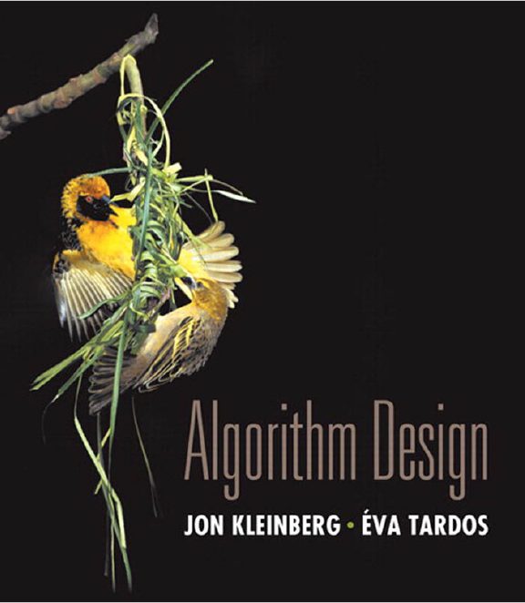
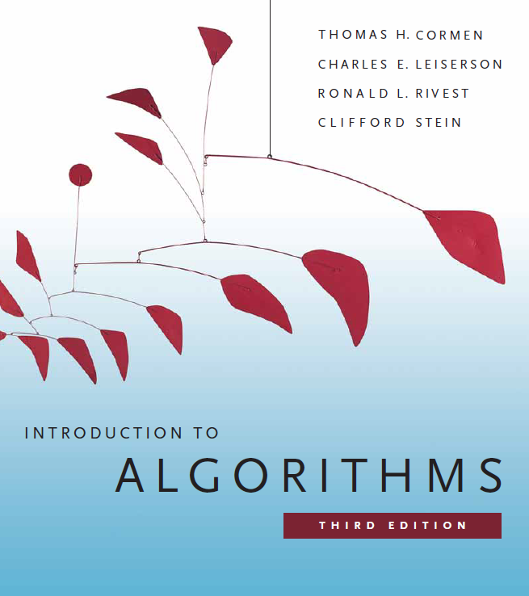
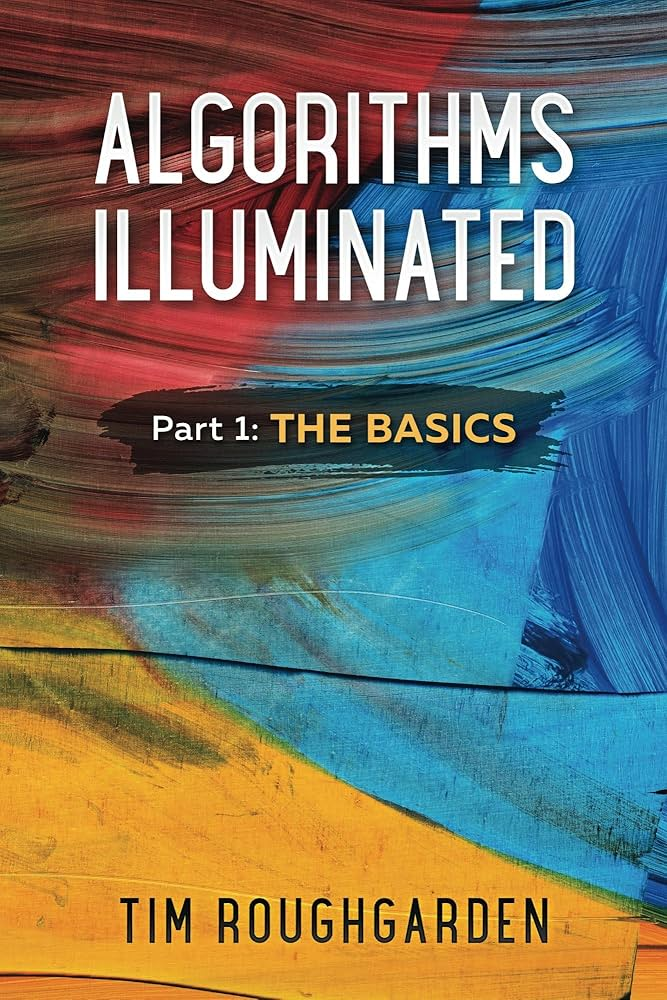
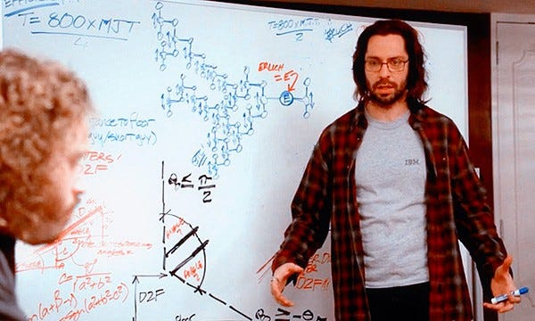
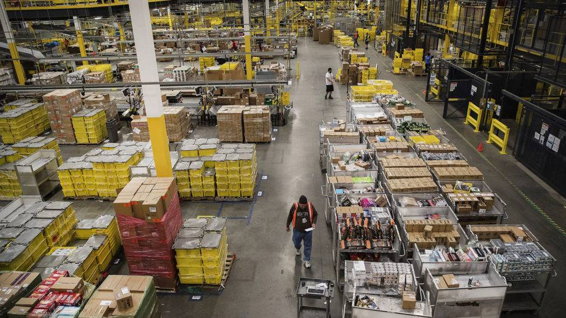
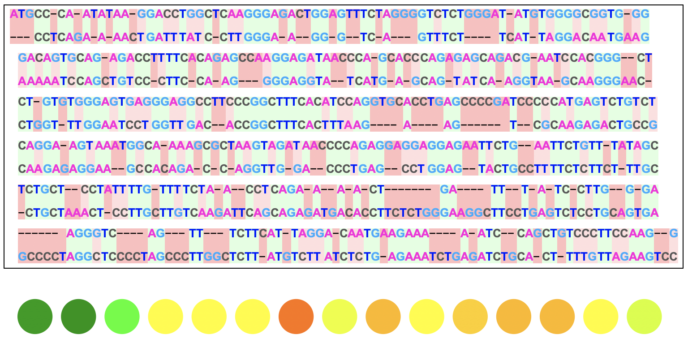
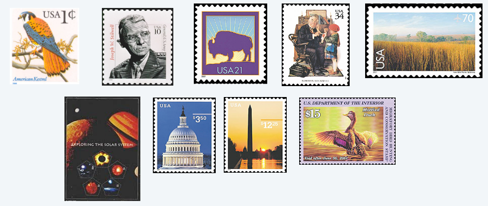

# Apresentação da Disciplina

## Dados Gerais

- **Disciplina:** INF05027 -- Projeto e Análise de Algoritmos I
  
- **Professor:** Lucas Nunes Alegre

- **Carga horária:** 60h (50 em sala de aula, 10 em atividades autônomas)

- **Créditos:** 4

## Sobre o Professor

**Lucas Nunes Alegre:**

- **E-mail:** <lnalegre@inf.ufrgs.br>


- **Site:** <https://lucasalegre.github.io/>


- **Presencial:** Sala 233, prédio 43424 (segundo andar)

. . .

:::: columns
::: {.column width="58%"}
**Interesses:**

::: {.incremental}
- Aprendizado por Reforço.
- Inteligência Artificial.
- Aprendizado de Máquina
- Robótica.
- Análise de Redes.
:::
:::
::: {.column width="42%"}
{width=100%}
:::
::::

## Motivação

As mudanças no currículo vão na seguinte direção:

- Aprofundar a forma de se estudar algoritmos (sempre com análise de **correção** e **custos**)

. . .

- Integração natural de **teoria** e **prática**

. . .

- Reorganizar a exposição de tópicos de forma a seguir as referências da literatura mundial da área

. . .

Desta forma, *PAA1* + *PAA2* no novo currículo cobrem conteúdos que eram vistos de forma não integrada em:
- **Teoria dos Grafos e Análise Combinatória**
- **Complexidade de Algoritmos**
- **Classificação e Pesquisa de Dados**

## Bibliografia

:::: columns
::: {.column width="62%"}
**Bibliografia:**

- **Algorithm Design. Kleinberg, Jon; Tardos, Éva.**
- Algoritmos: Teoria e Prática. Cormen, Thomas H. et. al.
- Algorithms Illuminated (Parts 1, 2, 3). Tim Roughgarden.

<br>

**Moodle:**  
<https://moodle.ufrgs.br/>

- Toda a comunicação oficial.
:::
::: {.column width="38%"}
{width=30%}

{width=30%}

{width=30%}
:::
::::

. . .

## Página da Disciplina

<https://lucasalegre.github.io/paa1>

```{=html}
<iframe width="100%" height="85%" src="https://lucasalegre.github.io/paa1" frameborder="0" allowfullscreen title="PAA1"></iframe>
```

## Repositório - Github

**GitHub:**  

<https://github.com/BrunoGrisci/projeto-e-analise-de-algoritmos>


- Diversidade de autores e lingugagens de programação.
- Disponibilização de códigos, demos, exemplos.

## Avaliação

**Atividades Avaliadas:**

- **Prova 1** ($3.5$pts) - Análise assintótica, teoria dos grafos, algoritmos simples sobre grafos
- **Prova 2** ($3.5$pts) - Algoritmos gulosos, algoritmos gulosos sobre grafos, estruturas de dados avançadas
- **Laboratórios** ($2$pt)
- Atividade(s) autônoma(s) ($1$pt)

$$
NF = 0.35 \times P1 + 0.35 \times P2 + 0.2 \times Lab + 0.1 \times Aut
$$

Conceito definido a partir de $NF$ da forma tradicional: A $(\geq9)$, B $(\geq7.5)$, C $(\geq6)$, D$(<6)$, FF (menos de 75\% de frequência).

## Laboratórios

- **4** laboratórios ao longo do semestre
- Atividades avaliadas ($0.5$ pontos cada)
- Entrega individual, mas discussão e consulta liberadas
- **Presencial!**
- Implementação de algoritmos/análise na prática
- Ambientes de desafios
	- LeetCode: <https://leetcode.com/>
	- beecrowd: <https://beecrowd.com/>
	- $\cdots$
- Linguagem de programação livre (dentro dos limites das ferramentas)
- Recomendação: **Python**

## Python

- [De C para Python](https://colab.research.google.com/drive/1NTX2_Xdrp_uBE72-WmnId2fL5lTmG1Ha?usp=sharing): [https://colab.research.google.com/drive/1NTX2_Xdrp_uBE72-WmnId2fL5lTmG1Ha?usp=sharing](https://colab.research.google.com/drive/1NTX2_Xdrp_uBE72-WmnId2fL5lTmG1Ha?usp=sharing)

. . .

- É **fortemente** sugerido aprender Python para esta disciplina.
  - Algoritmos em aula serão apresentados em **pseudocódigo** e/ou **Python**
  - "Mas eu não gosto de Python..." - 2ª opção: **C++**

. . .

- Programar é como tocar um instrumento: é necessário **praticar toda semana**!

. . .

- Exercícios e materiais de programação sugeridos na página da disciplina: [Programação](https://lucasalegre.github.io/paa1/programacao)

## Atividade de Recuperação

**Exame de Recuperação**

- Prova sobre todo o conteúdo
- Final do semestre

Nova nota final recalculada seguindo a seguinte fórmula:

$$
NE = 0.2 \times NF + 0.8 \times EXAME
$$

## Conteúdo

**Análise de Algoritmos**

- Correção de algoritmos
- Análise assintótica do custo computacional de algoritmos

. . .

**Grafos: conceitos e algoritmos fundamentais**

- Grafos: definição a representações computacionais
- Principais conceitos e algoritmos sobre grafos: busca, componentes, distância.

. . .

**Estratégia gulosa de projeto de algoritmos:**

- Escalonamento e particionamento de intervalos

. . .

**Algoritmos gulosos para grafos e estruturas de dados avançadas:**

- Árvore geradora de custo mínimo (Prim, Kruskal, union-find)
- Distância em grafos com pesos (Dijkstra, priority queues)

## Contexto no Currículo

[**Antes:**]{.bold-emph}

- INF01202 -- ALGORITMOS E PROGRAMAÇÃO - CIC
- INF05008 -- PENSAMENTO COMPUTACIONAL N
- INF01203 -- ESTRUTURAS DE DADOS
- MAT01375 -- MATEMÁTICA DISCRETA B

[**Depois:**]{.bold-emph}

- INF05028 -- PROJETO E ANÁLISE DE ALGORITMOS II
- INF05501 -- TEORIA DA COMPUTAÇÃO II
- INF01048 -- INTELIGÊNCIA ARTIFICIAL
- INF05010 -- OTIMIZAÇÃO COMBINATÓRIA

[**Na verdade**]{.bold-emph}

- O estudo dos algoritmos permeia a totalidade da ciência da computação e áreas relacionadas.

## Motivação: Programação Competitiva

**Laboratório de Programação Competitiva - LPC:**

- <https://www.inf.ufrgs.br/maratona/>
- <https://www.instagram.com/lpcufrgs>

{width=75%}

## Motivação: Entrevista Técnica

{width=75%}

## Motivação: Entrevista Técnica

E-mail Entrevista **Google**:

- Algorithm Complexity: If you struggle with basic big-O complexity analysis, then you are almost guaranteed not to get hired.
- Sorting: Know how to sort.
- Hashtables: Arguably the single most important data structure known to mankind.
- Trees: Know about trees; basic tree construction, traversal and manipulation algorithms.
- Graphs: Graphs are really important at Google.
- Other data structures: You should especially know about the most famous classes of NP-complete problems, . . . Find out what NP-complete means.
- Mathematics, Operating Systems, Coding.
- Final Tips: ***Get your algorithms straight.

## Motivação: Resolver Problemas

| | |
|---|---|
| {width=100%} | {width=100% } |
| {width=100%} | {width=100%} |

## Professor, mas e a IA?

::: {.incremental}
- **IA ajuda, mas não substitui prática:** é como aprender um idioma, você precisa *treinar* para ganhar fluência.

- **IA não é antagonista:** eu pesquiso IA e usei como ferramenta ao longo da disciplina.

- **Mas você precisa saber conferir:** sem base, você não detecta erros, suposições ruins e respostas “convincentes” porém incorretas.

- **A disciplina não é só “programar”:** é aprender a *modelar problemas*, escolher abordagens e justificar decisões.

- **Cautela** com quem vende IA como solução para tudo (aprenderam antes de haver IA).


- **Generalização para problemas novos:** IA tende a ir bem em soluções canônicas, mas e quando o problema é inédito ou exige uma ideia nova?


- **Fundamentos que não mudam:** corretude, complexidade, limites e trade-offs valem com ou sem IA.

- **Metodologia transferível:** o que você aprende aqui serve para outras áreas (ciência de dados, bio, redes, sistemas, etc.).

- **E sim, também é divertido!**
:::

## Projeto e Análise de Algoritmos

**Projeto:** técnicas para construção

- Busca exaustiva (backtracking).
- Estratégia Gulosa (greedy).
- Divisão e Conquista. *(PAA2...)*
- Programação Dinâmica. *(PAA2...)*
- Modelagem e Otimização. *(Otimização Combinatória...)*

. . .

**Análise:** verificação da qualidade do algoritmo

- Correção
- Custo (em tempo)
- Custo (em espaço)

**Algoritmos:** processos computacionais

# Problema do Troco (Coin Changing)

## Problema do Troco (Coin Changing)

> [**Objetivo.**]{.label-def} Dadas denominações de moedas (ex.: $\{1, 5, 10, 25, 100\}$),
pagar um valor usando o **menor número de moedas**.

{width=45%}

<https://brunogrisci.github.io/cashiers>

## Problema do Troco (Coin Changing)

> [**Objetivo.**]{.label-def} Dadas denominações de moedas (ex.: $\{1, 5, 10, 25, 100\}$),
pagar um dado valor usando o **menor número de moedas**.

. . .

<br>

**Algoritmo do caixa (guloso).**
Repetidamente escolha a **maior** moeda que **não excede** o valor restante.

. . .

<br>

[**Exemplos (ideia)**]{.label-exmp}

- 34\textcent: pegue 25, depois 5, depois 1,1,1,1.
- 2,89: escolha sempre a maior moeda possível e continue no restante.

## Escrevendo Pseudocódigo

- Não existe um formato universal rígido de pseudocódigo.
- O objetivo principal é a **clareza**: permitir que qualquer pessoa compreenda a lógica e possa implementá-la em qualquer linguagem.

. . .

<br>

[**Elementos Essenciais & Boas Práticas**]{.label-def}

- **Nome claro:** identificador descritivo para o algoritmo (ex.: `CashiersAlgorithm`).
- **Entrada (Input):** quais são os dados que o algoritmo recebe e suas precondições.
- **Saída (Output):** o que o algoritmo produz ou retorna ao final.
- **Nível de abstração:** foco no fluxo lógico e controle, sem se prender a detalhes sintáticos de linguagens específicas.

## Algoritmo do Caixa: Pseudocódigo


```pseudocode
#| html-line-number: true
#| html-no-end: true

\begin{algorithmic}
\Procedure{CashiersAlgorithm}{$x,\ c_1, \ldots, c_n$}
  \State Ordene as moedas: $0 < c_1 < c_2 < \cdots < c_n$
  \State $S \leftarrow [\;]$
  \While{$x > 0$}
    \State $k \leftarrow$ maior índice tal que $c_k \leq x$
    \If{não existe tal $k$}
      \Return ``sem solução''
    \Else
      \State $x \leftarrow x - c_k$
      \State adicione $k$ ao final de $S$
    \EndIf
  \EndWhile
  \Return $S$
\EndProcedure
\end{algorithmic}
```

## O algoritmo do caixa é ótimo?

> [**Pergunta.**]{.label-qstn} O algoritmo do caixa é ótimo para as moedas dos EUA $\{1,5,10,25,100\}$?

1. Sim, algoritmos gulosos são sempre ótimos.
2. Sim, para qualquer conjunto $c_1 < \cdots < c_n$, desde que $c_1=1$.
3. Sim, por propriedades especiais das denominações dos EUA.
4. Não.

## O algoritmo do caixa é ótimo?

> [**Pergunta.**]{.label-qstn} O algoritmo do caixa é ótimo para as moedas dos EUA $\{1,5,10,25,100\}$?

1. Sim, algoritmos gulosos são sempre ótimos.
2. Sim, para qualquer conjunto $c_1 < \cdots < c_n$, desde que $c_1=1$.
3. **Sim, por propriedades especiais das denominações dos EUA.**
4. Não.

*Discussão:* (A) é falsa em geral; (B) também é falsa; (C) é a correta nesse caso.

## O guloso é ótimo para qualquer sistema de moedas?

. . .

**Resposta curta: [não]{.alert}.**

. . .

**Contraexemplo (selo/“postage”):**
denominações $1, 10, 21, 34, 70, 100, 350, 1225, 1500$.

{width=60%}

. . .

- Guloso para 140\textcent: $100 + 34 + 1+1+1+1+1+1$ (8 moedas).
- Ótimo: $70 + 70$ (2 moedas).

. . .

**Pode falhar até em viabilidade se $c_1>1$:**
denominações $7,8,9$.

- Guloso para 15\textcent: escolhe 9 e fica preso (não completa).
- Ótimo: $7 + 8$.

## Propriedades de uma solução ótima (moedas dos EUA)

Para denominações $\{1,5,10,25,100\}$, qualquer solução ótima satisfaz:

. . .

:::{.incremental}
- [**(P1)**]{.bold-emph} número de pennies $P \le 4$.  
	Prova por troca: substitua 5 pennies por 1 nickel.
- [**(P2)**]{.bold-emph} número de nickels $N \le 1$.
- [**(P3)**]{.bold-emph} número de dimes $D \le 2$.
- [**(P4)**]{.bold-emph} número de quarters $Q \le 3$.
- [**(P5)**]{.bold-emph} $N + D \le 2$.  
	Se $N=1$ e $D=2$, substitua por 1 quarter.
:::

. . .

**Consequência chave:**

$$
P + 5N + 10D + 25Q \le 99.
$$

(Isto limita o quanto dá para “fazer troco” sem usar moedas de 1 dólar.)

## Otimalidade do algoritmo do caixa (moedas dos EUA)

> [**Teorema.**]{.label-thm} O algoritmo do caixa é **ótimo** para $\{1,5,10,25,100\}$.

. . .

[**Ideia da prova (indução no valor $x$):**]{.label-prf}

:::{.incremental}
- Considere $c_k \le x < c_{k+1}$. O guloso escolhe $c_k$.
- Mostra-se que **qualquer solução ótima** também precisa usar $c_k$: caso contrário, teria de compor $x$ só com $c_1,\dots,c_{k-1}$, mas isso é impossível por limites como $P\le4$, $N\le1$, $N+D\le2$, $Q\le3$.
- Então o problema reduz a $x - c_k$, resolvido otimalmente pelo guloso (hipótese de indução).
:::

. . .

**Intuição:** a prova é um “argumento de troca” + indução.

## Solução ótima única (incluindo moedas de 1 dólar)

> [**Proposição.**]{.label-thm} O algoritmo do caixa produz a **única** solução ótima para $\{1,5,10,25,100\}$.

[**Esboço (caso das moedas de 1 dólar):**]{.label-prf}

- Para um valor $x.yy$, o guloso escolhe $x$ moedas de 1 dólar.
- Suponha, por contradição, que exista solução ótima com menos de $x$ dólares.
- Então o restante em $\{1,5,10,25\}$ precisa somar $\ge 100$\textcent, isto é, $P + 5N + 10D + 25Q \ge 100$, contradizendo o limite $\le 99$.
- Argumentos análogos justificam as escolhas gulosas para quarters, dimes e nickels.

# Implementação do Algoritmo do Caixa (Python)

## Implementação do algoritmo do caixa (Python) {.scrollable .live-code-slide}

[Github: Implementação](https://github.com/BrunoGrisci/projeto-e-analise-de-algoritmos/blob/main/paa1/troco.py)

```{pyodide}

from typing import List

def greedy_troco(valor: float, moedas: List[int]):
    """Algoritmo guloso para o problema do troco."""
    return {}


moedas = [1, 5, 10, 25, 50, 100]

valor = 13.42
troco = greedy_troco(valor, moedas)
print(troco)
```

## Implementação do algoritmo do caixa (Python) {.live-code-slide}

[Github: Implementação](https://github.com/BrunoGrisci/projeto-e-analise-de-algoritmos/blob/main/paa1/troco.py)

```{pyodide}
#| caption: "Implementação do algoritmo do caixa (Python)"
from typing import List

def greedy_troco(valor: float, moedas: List[int]):
    """Algoritmo guloso para o problema do troco."""
    moedas = sorted(moedas, reverse=True)
    troco = {m : 0 for m in moedas}
    valor *= 100
    while valor != 0:
        sem_solucao = True
        for m in moedas:
            if m <= valor:
                troco[m] += 1
                valor -= m
                sem_solucao = False
                break
        if sem_solucao:
            print("Sem solução!")
            return troco
    return troco


moedas = [1, 5, 10, 25, 50, 100]

valor = 13.42
troco = greedy_troco(valor, moedas)
print(troco)
```

## Concluindo


- Neste primeiro mês, vamos abordar a base para a **análise de correção e de custos de algoritmos**, em particular a **notação assintótica**.

. . .

- Daqui para a frente, a ideia é saber desenvolver algoritmos tendo uma compreensão profunda sobre:
  - **por que ele funciona (corretude)** e
  - seu respectivo **custo** (em tempo e espaço).

#

::: {style="text-align: center; margin-top: 15vh;"}
[?]{style="font-size: 5em; color: #d10000; font-weight: 700;"}
:::
