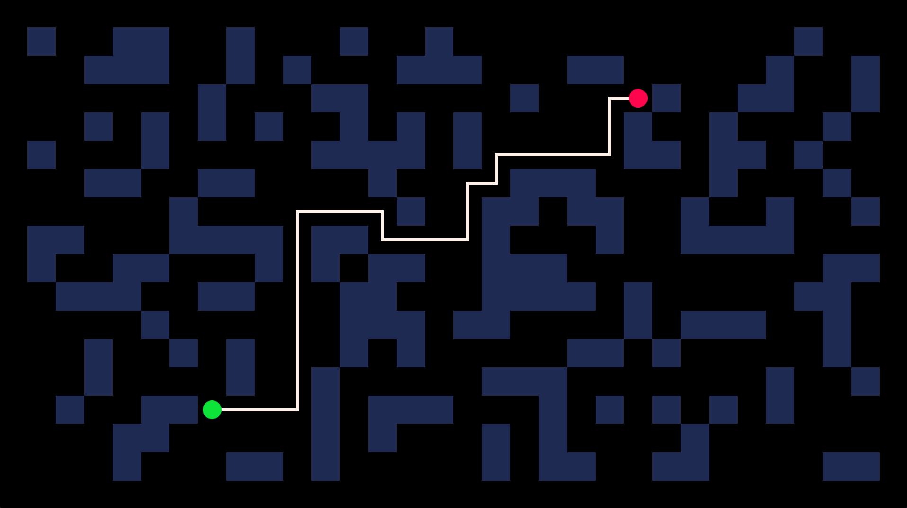
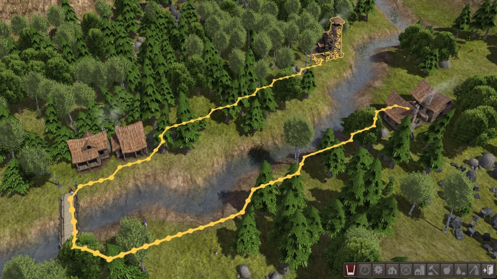

# Busca em Grafos

## Pathfinding

{width=100%}

## Pathfinding

{width=100%}

## Algoritmos de Busca em Grafos

Problemas de **busca em grafos**: 

> **Conectividade:** Dado um Grafo $G$ e um nó $v$, descobrir todos os [nós alcançáveis a partir de $v$]{.red}.

. . .

> **Caminho Mais Curto:** Dado um Grafo $G$ e um nó $v$, descobrir o [caminho mais curto a partir de $v$ para todos os outros nós]{.red}.

. . .

Existem duas estratégias principais para algoritmos de busca em grafos:

- busca em profundidade / **depth-first search (DFS)**
- busca em largura / **breadth-first search (BFS)**

## Buscas em Grafos (Conceitualmente)

:::: columns
::: {.column width="40%"}

$G1 =$

```{=html}
<div style="display: flex; justify-content: center; margin-top: 10px;">
  <div id="grafo-g1-conceit" style="width: 100%; max-width: 300px; height: 260px; position: relative;"></div>
</div>
<script>window.renderG1 && window.renderG1("grafo-g1-conceit");</script>
```

:::
::: {.column width="60%"}
1. Buscar em largura (a partir de $B$)

<br>

2. Buscar em profundidade (a partir de $B$)

<br>

[**Pergunta:**]{.label-qstn} em que **ordem** os vértices serão alcançados em cada uma das estratégias?

<br>

[**Pergunta:**]{.label-qstn} como podemos avaliar o [custo]{.red} desses procedimentos?
:::
::::

## Custos em Grafos

Um grafo simples $G=(V,E)$ possui dois parâmetros naturais:

- $|V|= n$ (número de vértices)
- $|E| = m$ (número de arestas)

. . .

Esses parâmetros ($n$ e $m$) fazem parte da análise, e dependendo pode não ser muito claro como se relacionam. 

Por exemplo, qual seria o melhor custo assintótico: $O(m^2)$ ou $O(n^2)$?

. . .

Observe que há algumas relações já vistas entre $n$ e $m$:

- $m \leq {n \choose 2} \leq n^2$ (em grafos simples)
- $m \geq n-1$ (em grafos conexos)

## Custo das Representações de Grafos e Dígrafos

:::: columns
::: {.column width="50%"}
**Matriz de adjacência**

$$
\begin{array}{l|ccccccc}
  & A & B & C & D & E & F & G\\
\hline
A & 0 & 1 & 0 & 0 & 1 & 0 & 0\\
B & 0 & 0 & 0 & 0 & 1 & 1 & 0\\
C & 0 & 0 & 0 & 1 & 0 & 0 & 0\\
D & 0 & 0 & 0 & 0 & 0 & 0 & 0\\
E & 0 & 0 & 1 & 0 & 0 & 1 & 0\\
F & 0 & 0 & 0 & 1 & 0 & 0 & 1\\
G & 0 & 0 & 0 & 0 & 0 & 0 & 0\\
\end{array}
$$

```{=html}
<div style="display: flex; justify-content: center; margin-top: 5px;">
  <div id="grafo-g1-custo" style="width: 100%; max-width: 260px; height: 220px; position: relative;"></div>
</div>
<script>window.renderG1 && window.renderG1("grafo-g1-custo");</script>
```

:::
::: {.column width="50%"}
**Lista de adjacência (Python)**

```python
## Grafo como dicionario
g1 = { 'A' : ['B', 'E'],
       'B' : ['E', 'F'],
       'C' : ['D'],
       'D' : [],
       'E' : ['C','F'],
       'F' : ['D','G'],
       'G' : [] }
```

- Como $m \leq n^2$, o custo $O(m+n)$ nunca é pior que $O(n^2)$, sendo muito melhor para grafos *esparsos*.

- Listas são mais eficientes para implementar **buscas** pelo grafo.
:::
::::

## Complexidade: Matriz vs. Lista de Adjacência

Seja $n = |V|$ e $m = |E|$.

. . .

| **Operação** | **Matriz** | **Lista** |
|:---|:---:|:---:|
| Espaço | $O(n^2)$ | $O(n + m)$ |
| Verificar aresta $(u,v)$ | $O(1)$ | $O(\deg(u))$ |
| Listar vizinhos de $v$ | $O(n)$ | $O(\deg(v))$ |
| Inserir aresta | $O(1)$ | $O(1)$ |
| Remover aresta | $O(1)$ | $O(\deg(u))$ |


## Algoritmo Genérico de Busca em Grafos

**Algoritmo Genérico de Busca**

:::{.incremental}
- Dado um grafo $G = (V, E)$ e um vértice fonte $s$
- Marca $s$ como **explorado** e todos os outros vértices como [não explorados]{style="color:red;"}
- Enquanto for possível:
  - Escolhe uma aresta $e = (u, v)$, onde $u$ já foi explorado e $v$ ainda não foi explorado.
  - Marca $v$ como explorado.
:::

## Algoritmo Genérico de Busca

```pseudocode
#| html-line-number: true
#| html-no-end: true

\begin{algorithmic}
\Procedure{Busca-Genérica}{$G : \text{Grafo}, s : \text{Nodo}$}
  \State Marca $s$ como explorado
  \While{existir vértice $v$ não explorado}
    \State Escolhe aresta $(u,v)$ onde $u$ foi explorado e $v$ ainda não foi explorado
    \State Marca $v$ como explorado
  \EndWhile
\EndProcedure
\end{algorithmic}
```

## {data-background-iframe="https://visualgo.net/en/dfsbfs" data-background-interactive="true" .hide-header}

## Correção do Algoritmo Genérico

> [**Afirmação:**]{.label-thm} Ao fim do **Algoritmo Genérico**, um vértice $v$ é **marcado como explorado**, **se e somente se**, **existe um caminho** entre $s$ e $v$.

[**Prova ($\Rightarrow$):**]{.red} Assuma que o vértice $v$ é marcado explorado. Faremos indução no número de iterações.

::: {.incremental}
- **Caso base:** $P(0)$ = $s$ explorado, e $s$ tem um caminho para si mesmo.
- **Hipótese indutiva:** Assuma $P(n)$, ou seja, todos os nodos explorados até a iteração $n$ possuem caminho a partir de $s$.
- **Faremos $P(n) \to P(n+1)$:** 
  - Na iteração $n+1$, um nodo $v$ é explorado via aresta $(u,v)$, onde $u$ já estava explorado.
  - Pela hipótese, $u$ tem caminho a partir de $s$.
  - Concatenando o caminho $s \to u$ com $(u,v)$, obtemos um caminho de $s$ para $v$.
:::

## Correção do Algoritmo Genérico (Cont.)

> [**Afirmação:**]{.label-thm} Ao fim do **Algoritmo Genérico**, um vértice $v$ é **marcado como explorado**, **se e somente se**, **existe um caminho** entre $s$ e $v$.

[**Prova ($\Rightarrow$):**]{.red} Assuma que existe um caminho entre $s$ e $v$.

::: {.incremental}
- Por [contradição]{.red}, assumimos que $v$ [não termina marcado como explorado]{.red}.
- Como $s$ foi explorado logo de cara e o caminho termina em $v$ (não explorado), deve existir alguma aresta $e = (a, b)$ no caminho $s \to v$ na qual $a$ é explorado e $b$ não é explorado.
- Mas se há aresta $e$ obedecendo esse critério, o laço de busca do **Algoritmo Genérico** poderia tê-la escolhido, o que implica que o algoritmo ainda não teria terminado! 
- [Contradição.]{style="color:red;"}
$\blacksquare$
:::


# Busca em Profundidade (DFS)

## Visualização

[Visualização: BFS vs. DFS - https://www.youtube.com/shorts/1-elk8F8_UM](https://www.youtube.com/shorts/1-elk8F8_UM)

[BFS](https://www.youtube.com/watch?v=umHJzlKFGlU&list=PLLUEUvJhgJJDz7C7Nf8j_vmyEwvLNY-eX&index=4)

[BFS vs. DFS](https://www.youtube.com/watch?v=1tYtjRSWkVk&list=PLLUEUvJhgJJDz7C7Nf8j_vmyEwvLNY-eX&index=6)

## Busca em Profundidade (Iterativa)

**Busca em profundidade (DFS)** pode ser implementada de forma **iterativa**:

- Utilizamos uma **pilha** para registrar nodos a serem visitados
- Marcamos nodos como **visitados após a inserção na pilha**
- A pilha inicia com o nodo inicial da busca
- O laço principal roda **enquanto a pilha não é vazia**
- Dentro do corpo do laço, removemos o nodo da pilha e o processamos
- Para cada vizinho não visitado do nodo atual, fazemos a sua **inserção na pilha e o marcamos como visitado**

## Busca em Profundidade (DFS)

```pseudocode
#| html-line-number: true
#| html-no-end: true

\begin{algorithmic}
\Procedure{DFS}{$G, s$}
  \State Marca $s$ como visitado
  \State $S \gets [s]$ \Comment{Pilha (LIFO)}
  \While{$S$ não vazia}
    \State $v \gets S.\text{pop}()$
    \For{cada $(v, w) \in E$}
      \If{$w$ não visitado}
        \State Marca $w$ como visitado
        \State Adiciona $w$ a $S$
      \EndIf
    \EndFor
  \EndWhile
\EndProcedure
\end{algorithmic}
```

## Busca em Profundidade (Iterativa) em Python

```pyodide
g1 = { 'A' : ['B', 'E'],
       'B' : ['E', 'F'],
       'C' : ['D'],
       'D' : [],
       'E' : ['C','F'],
       'F' : ['D','G'],
       'G' : [] }

## Busca em profundidade (DFS, iterativo)
def dfs_iter(g, s):   # g e um grafo, s e um nodo
  visited = {i : False for i in g.keys()}

  p = [s];                 # inicia pilha p com s
  visited[s] = True        # registra que s foi visitado

  while len(p) > 0:     # enquanto ha elementos em p
    h = p.pop(0)      # extrai cabeca de p em h
    print(h)          # faca algo com h
    for i in g[h]:          # para vizinhos de h
      if not visited[i]:   # se vizinho nao visitado
        p.insert(0, i)       # insere na cabeca da pilha
        visited[i] = True     # marca como visitado
  
dfs_iter(g1, "A")
```

## Busca em Profundidade (Iterativa): Exemplo

:::: columns
::: {.column width="45%"}

```{=html}
<div style="display: flex; justify-content: center; margin-top: 10px;">
  <div id="grafo-g1-dfs-iter" style="width: 100%; max-width: 280px; height: 240px; position: relative;"></div>
</div>
<script>window.renderG1 && window.renderG1("grafo-g1-dfs-iter");</script>
```

```python
## Grafo como dicionario
g1 = { 'A' : ['B', 'E'],
       'B' : ['E', 'F'],
       'C' : ['D'],
       'D' : [],
       'E' : ['C','F'],
       'F' : ['D','G'],
       'G' : [] }
```

:::
::: {.column width="55%"}
Resultado de `dfs_iter(g1,'A')`:

A
E
F
G
D
C
B

:::
::::

## Busca em Profundidade (Recursiva)

**Busca em profundidade (DFS)** pode ser implementada de forma bem simples por meio de **recursão**:

- Utilizamos uma **vetor global** para registrar nodos que já foram visitados, inicializado com false
- A rotina principal recebe um grafo e um nó de partida
- Após processar o nó, marca ele como visitado
- Para cada vizinho não visitado do nó atual, fazemos uma chamada recursiva para explorá-lo

## Busca em Profundidade (Recursiva) em Python

```pyodide
g1 = { 'A' : ['B', 'E'],
       'B' : ['E', 'F'],
       'C' : ['D'],
       'D' : [],
       'E' : ['C','F'],
       'F' : ['D','G'],
       'G' : [] }

def init_visitados(g):
    """Dicionário mapeando todo nodo para False (não-visitado)."""
    return {n : False for n in g.keys()}

def dfs_rec(g, s, visitados):
    """Busca em profundidade a partir de um nodo s (versão recursiva)."""
    visitados[s] = True
    print(s)
    for v in g[s]:
        if not visitados[v]:
            dfs_rec(g, v, visitados)

## Chamada de teste (DFS recursivo)
dfs_rec(g1, 'A', init_visitados(g1))
```

## Busca em Profundidade (Recursiva): Exemplo

:::: columns
::: {.column width="45%"}

```{=html}
<div style="display: flex; justify-content: center; margin-top: 10px;">
  <div id="grafo-g1-dfs-rec" style="width: 100%; max-width: 280px; height: 240px; position: relative;"></div>
</div>
<script>window.renderG1 && window.renderG1("grafo-g1-dfs-rec");</script>
```

```python
## Grafo como dicionario
g1 = { 'A' : ['B', 'E'],
       'B' : ['E', 'F'],
       'C' : ['D'],
       'D' : [],
       'E' : ['C','F'],
       'F' : ['D','G'],
       'G' : [] }
```

:::
::: {.column width="55%"}
Resultado de `dfs(g1,'A')`:

A
B
E
C
D
F
G

**Pergunta:** Você consegue justificar por que os nodos são visitados em ordem distinta da versão iterativa?
:::
::::

# Busca em Largura (BFS)

## Busca em Largura (Níveis)

**Breadth-First Search (BFS)**: Explora a partir de $s$ todos os vértices adicionando vértices em camadas.

<br>

**BFS (Camadas)**:

:::{.incremental}
- $L_0 = \{s\}$
- $L_1 =$ todos vértices adjacentes a $s$
- $L_2 =$ todos vértices que não pertencem a $L_0$ ou $L_1$ e que possuem uma aresta que conecta a um vértice em $L_1$
- $L_{i+1} =$ todos vértices que não pertencem a camadas anteriores e que possuem uma aresta que conecta a um vértice em $L_i$
:::

## Busca em Largura (Níveis)

:::: columns
::: {.column width="45%"}
- Busca em largura pode ser pensada como uma busca em **níveis**.
- Um nodo no $n$-ésimo nível está há uma distância de $n$ arestas da origem.

```{=html}
<div style="display: flex; justify-content: center; margin-top: 10px;">
  <div id="grafo-g1-niveis" style="width: 100%; max-width: 280px; height: 240px; position: relative;"></div>
</div>
<script>window.renderG1 && window.renderG1("grafo-g1-niveis");</script>
```

:::
::: {.column width="55%"}
No grafo de exemplo, temos os seguintes níveis (a partir de 'A'):

- $0$: A
- $1$: B, E
- $2$: C, F
- $3$: D, G
:::
::::

## Busca em Largura (Iterativa)

- BFS também pode ser implementado de uma forma bastante simples utilizando uma **fila**.

- O código é **essencialmente idêntico à versão iterativa de DFS**, só mudando a **estrutura de dados**:
  - **Pilha / LIFO** (inserção na frente, remoção na frente): DFS
  - **Fila / FIFO** (inserção atrás, remoção na frente): BFS

## Busca em Largura (BFS)

```pseudocode
#| html-line-number: true
#| html-no-end: true

\begin{algorithmic}
\Procedure{BFS}{$G, s$}
  \State Marca $s$ como explorado
  \State $Q \gets [s]$ \Comment{Fila (FIFO)}
  \While{$Q$ não vazio}
    \State $v \gets Q.\text{pop}()$
    \For{cada $(v, w) \in E$}
      \If{$w$ não explorado}
        \State Marca $w$ como explorado
        \State Adiciona $w$ a $Q$
      \EndIf
    \EndFor
  \EndWhile
\EndProcedure
\end{algorithmic}
```

## Busca em Largura (Iterativa) em Python

```pyodide
## Busca em largura (BFS, iterativo)
from collections import deque

g1 = { 'A' : ['B', 'E'],
       'B' : ['E', 'F'],
       'C' : ['D'],
       'D' : [],
       'E' : ['C','F'],
       'F' : ['D','G'],
       'G' : [] }

def bfs_iter(g, s): # g um grafo, s um nodo
  visited = {i : False for i in g.keys()}

  queue = deque([s])   # inicia lista unitaria com s
  visited[s] = True    # registra que s foi visitado

  while len(queue) > 0:    # enquanto ha elementos em l
    h = queue.popleft()    # extrai cabeca da lista em h
    print(h)           # faca algo com h
    for i in g[h]:          # para vizinhos de h
      if not visited[i]:    # se vizinho nao visitado
        queue.append(i)       # insere no final da lista
        visited[i] = True     # marca como visitado

bfs_iter(g1, "A")
```

## Busca em Largura (Iterativa): Exemplo

:::: columns
::: {.column width="45%"}

```{=html}
<div style="display: flex; justify-content: center; margin-top: 10px;">
  <div id="grafo-g1-bfs-iter" style="width: 100%; max-width: 280px; height: 240px; position: relative;"></div>
</div>
<script>window.renderG1 && window.renderG1("grafo-g1-bfs-iter");</script>
```

```python
## Grafo como dicionario
g1 = { 'A' : ['B', 'E'],
       'B' : ['E', 'F'],
       'C' : ['D'],
       'D' : [],
       'E' : ['C','F'],
       'F' : ['D','G'],
       'G' : [] }
```

:::
::: {.column width="55%"}
Resultado de `bfs_iter(g1, 'A')`:

A
B
E
F
C
D
G
:::
::::


## Árvore Associada à Busca

Dada uma busca (DFS ou BFS) em $G$ a partir de um nó $v$, podemos construir uma **árvore** associada a essa busca, onde cada nó aponta para o elemento que o descobriu (seu antecessor direto). 

:::: columns
::: {.column width="33%"}
**Dígrafo de Exemplo:**
```{=html}
<div style="display: flex; justify-content: center;">
  <div id="grafo-arvore-busca-original" style="width: 100%; height: 250px; position: relative;"></div>
</div>
<script>window.renderG1 && window.renderG1("grafo-arvore-busca-original");</script>
```
:::

::: {.column width="33%"}
**Saída `dfs_iter_tree(g1, 'A')`:**
```text
A
E
F
G
D
C
B
```
:::

::: {.column width="33%"}
**Árvore de Busca:**
```{=html}
<div style="display: flex; justify-content: center;">
  <div id="grafo-arvore-busca-vermelha" style="width: 100%; height: 250px; position: relative;"></div>
</div>
<script>
  (() => {
    const container = document.getElementById("grafo-arvore-busca-vermelha");
    if (!container || typeof cytoscape === 'undefined') return;

    const cy = cytoscape({
      container: container,
      elements: [
        { data: { id: "A" }, position: { x: 260, y: 20 } },
        { data: { id: "C" }, position: { x: 60, y: 100 } },
        { data: { id: "E" }, position: { x: 200, y: 100 } },
        { data: { id: "B" }, position: { x: 340, y: 100 } },
        { data: { id: "D" }, position: { x: 140, y: 180 } },
        { data: { id: "F" }, position: { x: 280, y: 180 } },
        { data: { id: "G" }, position: { x: 280, y: 260 } },
        
        { data: { id: "e1", source: "A", target: "B" }, classes: "tree" },
        { data: { id: "e2", source: "A", target: "E" }, classes: "tree" },
        { data: { id: "e3", source: "B", target: "E" } },
        { data: { id: "e4", source: "B", target: "F" } },
        { data: { id: "e5", source: "C", target: "D" } },
        { data: { id: "e6", source: "E", target: "C" }, classes: "tree" },
        { data: { id: "e7", source: "E", target: "F" }, classes: "tree" },
        { data: { id: "e8", source: "F", target: "D" }, classes: "tree" },
        { data: { id: "e9", source: "F", target: "G" }, classes: "tree" }
      ],
      style: [
        {
          selector: "node",
          style: {
            label: "data(id)",
            width: 40, height: 40,
            "background-color": "#23373b", color: "#ffffff",
            "font-size": 18, "font-weight": "bold",
            "text-valign": "center", "text-halign": "center",
            "border-width": 2.5, "border-color": "#152224"
          }
        },
        {
          selector: "edge",
          style: {
            width: 3.5,
            "line-color": "#cbd5e1",
            "target-arrow-color": "#cbd5e1",
            "target-arrow-shape": "triangle",
            "arrow-scale": 1.25,
            "curve-style": "bezier",
            "control-point-step-size": 30
          }
        },
        {
          selector: "edge.tree",
          style: {
            "line-color": "#dc2626",
            "target-arrow-color": "#dc2626",
            width: 4.5
          }
        }
      ],
      layout: { name: "preset", fit: true, padding: 18 },
      userZoomingEnabled: false, userPanningEnabled: false,
      boxSelectionEnabled: false, autoungrabify: false
    });
    window.setupCyResize && window.setupCyResize(cy, container, 18);
  })();
</script>
```
:::
::::

- Isso é facilmente implementado com um dicionário auxiliar `parent`, preenchido ao inserirmos um nó na estrutura. 
- A raiz da árvore é o nó de origem.

## Árvore de busca (DFS iterativa)

Veja a modificação do algoritmo DFS iterativo para construir e retornar a árvore:

```pyodide
from collections import deque

def dfs_iter_tree(g, v):
  """Árvore de Busca de DFS. Retorna dicionarário mapeando cada nodo a seu nodo pai na busca."""
  parent  = {i : i for i in g.keys()}   # arvore de antecessor
  visited = {i : False for i in g.keys()}
  p = [v]               
  visited[v] = True
  
  while len(p) > 0:     
    h = p.pop(0)      
    for i in g[h]:          
      if not visited[i]:   
        p.insert(0,i)       
        parent[i] = h   # marca h como antecessor de i
        visited[i] = True     

  return parent  # devolve a arvore

g1 = { 'A' : ['B', 'E'], 'B' : ['E', 'F'], 'C' : ['D'], 'D' : [], 
       'E' : ['C','F'], 'F' : ['D','G'], 'G' : [] }
print(dfs_iter_tree(g1, 'A'))
```

## Propriedades da Busca em Largura (BFS)

> [**Propriedade dos Níveis:**]{.label-thm} Seja $T$ a árvore resultante da BFS para o grafo $G = (V, E)$ e $(x, y)$ uma aresta qualquer de $G$:
>
> - Então, os níveis de $x$ e $y$ na árvore de busca diferem [no máximo por 1]{style="color:red;"}.

. . .

Isto ocorre porque, se a diferença fosse maior (ex: $y$ dois ou mais níveis abaixo de $x$), no momento em que a BFS visitou os vizinhos de $x$, o vértice $y$ teria sido colocado na fila logo no nível abaixo de $x$, limitando a diferença de nível a no máximo 1.

```{=html}
<div style="display: flex; justify-content: center; margin-top: 20px;">
<svg viewBox="0 0 500 280" style="width: 100%; max-width: 500px; font-family: sans-serif;" xmlns="http://www.w3.org/2000/svg">
  <!-- Fundos para os níveis -->
  <rect x="10" y="10" width="480" height="60" rx="10" fill="#e2e8f0" opacity="0.6"/>
  <text x="30" y="45" font-size="16" font-weight="bold" fill="#475569">Nível i</text>

  <rect x="10" y="90" width="480" height="60" rx="10" fill="#e2e8f0" opacity="0.6"/>
  <text x="30" y="125" font-size="16" font-weight="bold" fill="#475569">Nível i+1</text>

  <rect x="10" y="170" width="480" height="60" rx="10" fill="#fecaca" opacity="0.6"/>
  <text x="30" y="205" font-size="16" font-weight="bold" fill="#b91c1c">Nível i+2</text>
  
  <text x="30" y="255" font-size="14" font-style="italic" fill="#b91c1c">Contradição: y deveria estar no nível i+1!</text>

  <!-- Arestas da árvore (BFS) -->
  <path d="M 250 60 L 200 100" stroke="#64748b" stroke-width="3"/>
  <path d="M 250 60 L 300 100" stroke="#64748b" stroke-width="3"/>
  <path d="M 200 140 L 170 180" stroke="#64748b" stroke-width="3"/>
  
  <!-- Aresta problemática (x, y) -->
  <path d="M 250 60 Q 380 130 310 180" fill="none" stroke="#ef4444" stroke-width="4" stroke-dasharray="8,6"/>
  
  <!-- Texto da aresta -->
  <text x="375" y="130" font-size="14" font-weight="bold" fill="#ef4444" text-anchor="middle">Aresta (x, y)</text>
  <text x="375" y="150" font-size="12" fill="#ef4444" text-anchor="middle">impossível na BFS</text>

  <!-- Vértices -->
  <!-- x -->
  <circle cx="250" cy="40" r="20" fill="#23373b" stroke="#0f172a" stroke-width="2"/>
  <text x="250" y="46" font-size="18" font-weight="bold" fill="#ffffff" text-anchor="middle">x</text>

  <!-- outros em i+1 -->
  <circle cx="200" cy="120" r="20" fill="#23373b" stroke="#0f172a" stroke-width="2"/>
  <circle cx="300" cy="120" r="20" fill="#23373b" stroke="#0f172a" stroke-width="2"/>

  <!-- y -->
  <circle cx="310" cy="200" r="20" fill="#23373b" stroke="#0f172a" stroke-width="2"/>
  <text x="310" y="206" font-size="18" font-weight="bold" fill="#ffffff" text-anchor="middle">y</text>

  <!-- outro em i+2 -->
  <circle cx="170" cy="200" r="20" fill="#23373b" stroke="#0f172a" stroke-width="2"/>

</svg>
</div>
```

# Complexidade Assintótica das Buscas em Grafos

## Complexidade da Busca em Largura (BFS)

> [**Afirmação:**]{.label-thm} O algoritmo BFS tem tempo de execução $O(n + m)$.

**Detalhes da Prova:**

::: {.incremental}
- Há no máximo $n$ camadas de busca (uma por nodo).
- Cada vértice aparece em no máximo uma camada, sendo visitado (removido da fila) exatamente uma vez.
  - Custo $O(n)$ para visitar todos os vértices.
- Quando visitamos um vértice $u$, iteramos sobre todos os seus vizinhos, o que requer tempo $O(deg(u))$.
  - O total de vezes que processamos arestas ao longo do algoritmo é exatamente:
  $$ \sum_{v \in V} deg(v) = 2m = O(m) $$
- Somando os dois custos, temos $O(n + m)$.
:::

## Complexidade da Busca em Largura (BFS)

```pseudocode
#| html-line-number: true
#| html-no-end: true

\begin{algorithmic}
\Procedure{BFS}{$G, s$}
  \State Marca $s$ como explorado \Comment{$O(1)$}
  \State $Q \gets [s]$ \Comment{Fila (FIFO) - $O(1)$}
  \While{$Q$ não vazio} \Comment{Laço executa $n$ vezes no total}
    \State $v \gets Q.\text{pop}()$ \Comment{$O(1)$}
    \For{cada vizinho $w$ de $v$} \Comment{Itera $deg(v)$ vezes por nó, totalizando $O(m)$}
      \If{$w$ não explorado} \Comment{$O(1)$}
        \State Marca $w$ como explorado \Comment{$O(1)$}
        \State Adiciona $w$ a $Q$ \Comment{$O(1)$}
      \EndIf
    \EndFor
  \EndWhile
\EndProcedure
\end{algorithmic}
```


## Análise Assintótica das Buscas em Grafos

- As versões iterativas de BFS e DFS utilizando filas e pilhas (respectivamente) possuem custo assintótico $O(n+m)$.
- Abaixo usaremos *estrutura* para mencionar a pilha ou fila utilizada:

Detalhamento:

::: {.incremental}
- Há um processo de iniciação do vetor/dicionário de visitados $O(n)$
- A estrutura é inicializada com um elemento inicial, e o laço principal finaliza com a estrutura vazia
- A cada passada pelo corpo do laço principal, removemos um elemento da estrutura e, ao final, adicionamos elementos
- O número de elementos adicionados à estrutura corresponde ao número de arestas dos vértices percorridos na busca: no pior caso, $O(m)$
:::

## Pergunta Conceitual

Considere um grafo com **quantidade infinita de nós** (mas [nenhum nó com grau infinito]{.red}).

<br>

[P.]{.label-qstn} Qual a diferença de comportamento da DFS e BFS nesse caso?


# Implementação: Python

Ver Github da disciplina: [https://github.com/BrunoGrisci/projeto-e-analise-de-algoritmos/blob/main/paa1/graph_search.ipynb](https://github.com/BrunoGrisci/projeto-e-analise-de-algoritmos/blob/main/paa1/graph_search.ipynb)

#

::: {style="text-align: center; margin-top: 15vh;"}
[?]{style="font-size: 5em; color: #d10000; font-weight: 700;"}
:::
