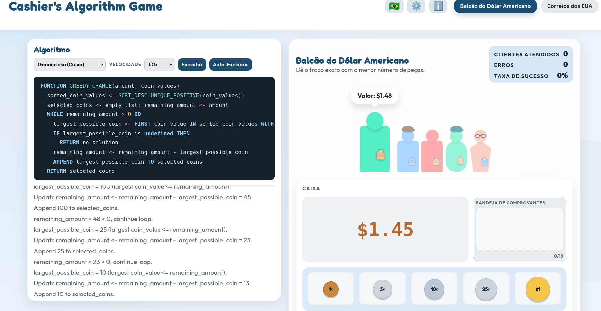
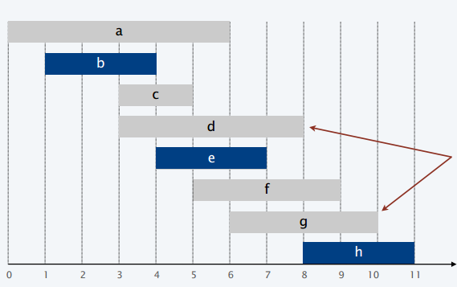
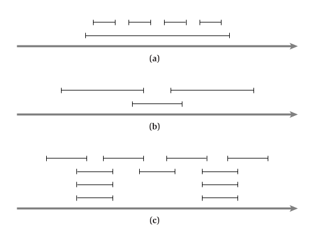
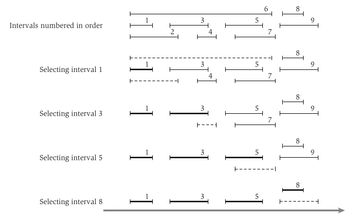
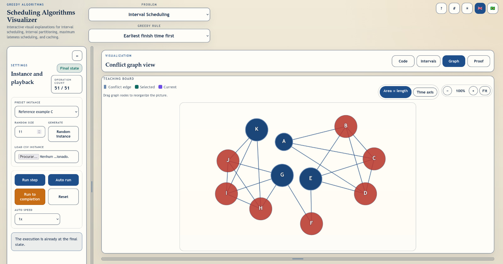
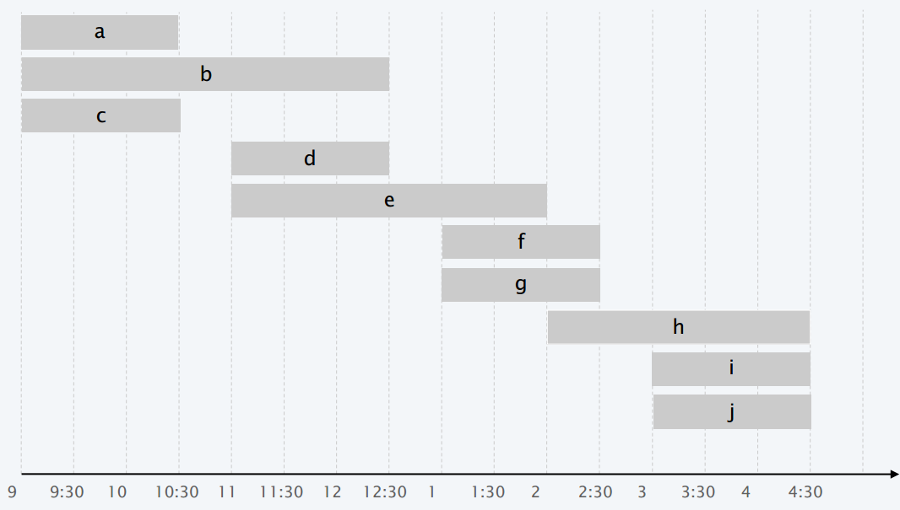
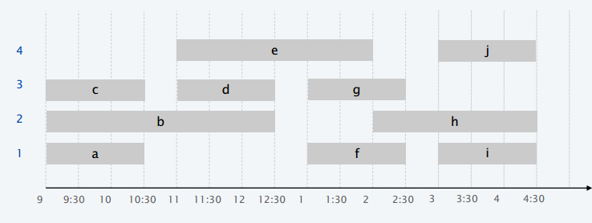
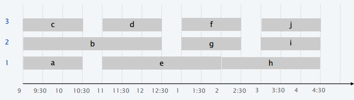
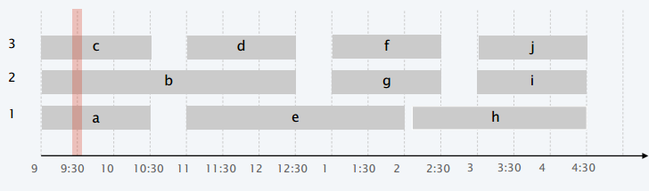
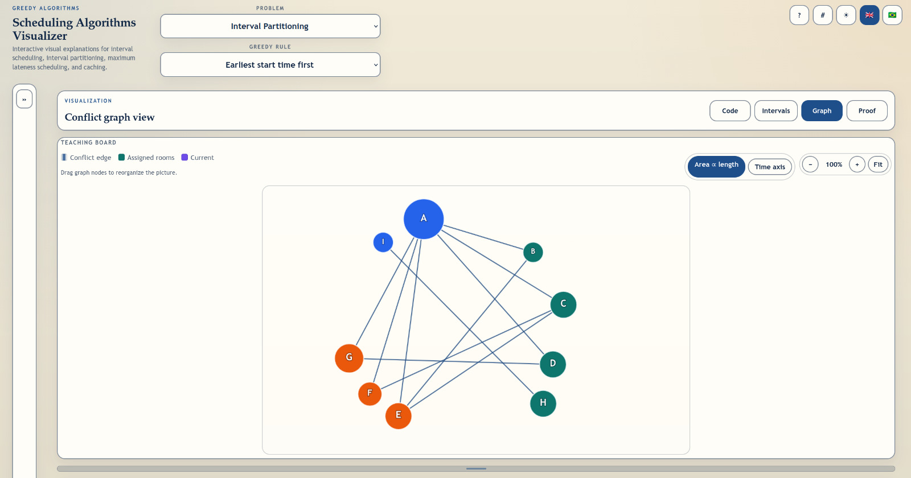

# Algoritmos Gulosos

## Algoritmos Gulosos


> "Embora a gula seja considerada um dos sete pecados capitais, acontece que algoritmos gulosos frequentemente tem uma performance muito boa."
>
> — Stuart Russell

## 

```{=html}
<iframe width="560" height="315" src="https://www.youtube.com/embed/VVxYOQS6ggk" frameborder="0" allowfullscreen></iframe>
<div style="display:flex; justify-content:center; align-items:center; height:80vh;">
  <iframe width="95%" height="95%" src="https://www.youtube.com/embed/VVxYOQS6ggk" frameborder="0" allowfullscreen></iframe>
</div>
```

## Algoritmos Gulosos

**Ideia Geral:**

- Realizamos uma **sequência de passos**.
- A cada passo, fazemos uma **escolha**.

. . .

**Premissa dos Algoritmos Gulosos:**

- A escolha é aquela que parece ser a **melhor no momento (miópica)**.
- Essa escolha é denominada **escolha gulosa**.
- É feita de acordo com um **critério guloso**.

{width=30% fig-align="center"}

## Algoritmos Gulosos

> [**Definição.**]{.label-def} Um **algoritmo guloso** é aquele que constrói a **solução global** para o problema a partir de **decisões locais ótimas**.

. . .

> [**Observação.**]{.label-rmk} Quando um algoritmo guloso resolve um problema otimamente, isso implica em algo fundamental sobre a estrutura do problema.

. . .

**Divisão e Conquista vs. Algoritmos Gulosos:**


| | **Divisão e Conquista** | **Algoritmos Gulosos** |
|---|---|---|
| Propor Algoritmos | [Difícil]{.alert} | [Fácil]{.bold-emph} |
| Análise de Complexidade | [Difícil]{.alert} | [Fácil]{.bold-emph} |
| Corretude | [Fácil]{.bold-emph} | [Difícil Demonstrar]{.alert} |

. . .

> [**Observação.**]{.label-rmk} A maioria das estratégias gulosas não são [corretas]{.alert} (não garantem a solução ótima).

## Provas de Corretude

**Ficar à Frente:**

- Mostra que após cada passo do algoritmo guloso, a solução atual é tão boa quanto qualquer outra solução.

. . .

**Argumento da Troca:**

- Transforma gradualmente qualquer solução para a encontrada pelo algoritmo guloso sem piorar a qualidade da solução.

. . .

**O que Funcionar:**

- Prova por Indução, Estrutural, Contradição.

## Problema do Troco (Coin Changing)

> [**Objetivo.**]{.label-def} Dadas denominações de moedas (ex.: $\{1, 5, 10, 25, 100\}$),
pagar um valor usando o [menor número de moedas]{.alert}.

{width=60%}

<https://brunogrisci.github.io/cashiers>


# Escalonamento de Intervalos

## Escalonamento de Intervalos

Considere $n$ atividades que devem ser executadas:

- Palestras, processos em um servidor, aulas, etc.

. . .

- Cada tarefa $j$ inicia em ${\color{blue}{s}}_j$ e termina em ${\color{red}{f}}_j$.
- Assim, ela deve ser realizada no intervalo $[{\color{blue}{s}}_j, {\color{red}{f}}_j)$.

. . .

> [**Definição.**]{.label-def} Duas tarefas são [compatíveis]{.alert} se elas não se sobrepõem.

**Objetivo:** Encontrar o subconjunto máximo de tarefas compatíveis.

## Escalonamento de Intervalos

**Entrada:** Conjunto de $n$ tarefas com tempos de início (${\color{blue}{s}}_j$) e fim (${\color{red}{f}}_j$).

. . .

**Objetivo:** Encontrar um subconjunto de tarefas [mutualmente compatíveis]{.alert} com [tamanho máximo]{.alert}.

. . .

{width=50%}

<https://brunogrisci.github.io/schedulingalgorithms>

## Escalonamento de Intervalos

**Abordagem Gulosa:**

- Considera as tarefas de acordo com alguma **ordem (critério guloso)**.
- Seleciona a tarefa atual se ela é compatível.

. . .

**P.** Qual ordem?

. . .

1. Inicia mais Cedo: Considera as tarefas por ordem de ${\color{blue}{s}}_j$.
2. Termina mais Cedo: Considera as tarefas por ordem de ${\color{red}{f}}_j$.
3. Menor Intervalo: Considera as tarefas por ordem de ${\color{red}{f}}_j - {\color{blue}{s}}_j$.
4. Menos Conflitos: Considera as tarefas por ordem de $c_j$ (número de conflitos).

. . .

**P.** Alguma funciona?

. . .

Vejamos como essas estratégias funcionam sobre as seguintes instâncias:

## Escalonamento de Intervalos: Estratégias vs Instâncias

Possíveis estratégias gulosas: 1) **Inicia mais cedo**; 2) **Termina mais cedo**; 3) **Menor intervalo**; 4) **Menor número de conflitos**.

{width=70%}

## Algoritmo TerminaMaisCedo

**P.** Algoritmo e Complexidade?

. . .

> [**Afirmação.**]{.label-rmk} O algoritmo pode ser implementado em $O(n\log n)$.

. . .

- Ordena as tarefas por ${\color{red}{f}}_j$ em $O(n\log n)$.
- Adiciona tarefa $j$ se ${\color{blue}{s}}_j \geq {\color{red}{f}}_{j'}$ onde $j'$ é a última tarefa adicionada.

. . .

```pseudocode
#| html-line-number: true
#| html-no-end: true

\begin{algorithmic}
\Procedure{TerminaMaisCedo}{$\{{\color{blue}{s}}_1, {\color{red}{f}}_1\}, \dots, \{{\color{blue}{s}}_n, {\color{red}{f}}_n\}$}
  \State \texttt{Sort}$(\{{\color{blue}{s}}_1, {\color{red}{f}}_1\}, \dots, \{{\color{blue}{s}}_n, {\color{red}{f}}_n\})$ \Comment{Em ordem crescente de ${\color{red}{f}}_j$}
  \State $A \leftarrow \emptyset$
  \For{$j = 1$ \textbf{to} $n$}
    \If{$j$ é compatível com $A$}
      \State $A \leftarrow A \cup \{j\}$
    \EndIf
  \EndFor
  \Return $A$
\EndProcedure
\end{algorithmic}
```

## Algoritmo TerminaMaisCedo: Execução

{width=70%}

## TerminaMaisCedo é Correto?

**P.** Como podemos mostrar que a estratégia `TerminaMaisCedo` gera um resultado correto?

::: {.incremental}
- Seja $A = [i_1, i_2, \dots, i_k]$ a sequência ordenada de intervalos do algoritmo.

- Seja $O = [j_1, j_2, \dots, j_m]$ a sequência ordenada de intervalos em uma solução ótima.

- Precisamos mostrar $k = m$ (a seleção do algoritmo é do mesmo tamanho que uma solução ótima).

- Note que tanto $A$ quanto $O$ são **compatíveis** (nenhum par de intervalos está em conflito).
:::

## Lema sobre TerminaMaisCedo

Seja $A = [i_1, i_2, \dots, i_k]$ a sequência ordenada de intervalos selecionados pelo **algoritmo**.

Seja $O = [j_1, j_2, \dots, j_m]$ a sequência ordenada de intervalos em uma [solução ótima]{.alert}.

. . .

> [**Lema.**]{.label-thm} Para todos os índices $r \leq k$, temos ${\color{red}{f}}(i_r) \leq {\color{red}{f}}(j_r)$.

. . .

[**Prova.**]{.label-prf} Por indução em $r$:

::: {.incremental}
- Se $r=1$ é trivial, pois o algoritmo escolhe primeiro o intervalo de menor ${\color{red}{f}}$.
- Se $r>1$, por hipótese indutiva temos ${\color{red}{f}}(i_{r-1}) \leq {\color{red}{f}}(j_{r-1})$ e precisamos mostrar que ${\color{red}{f}}(i_r) \leq {\color{red}{f}}(j_r)$.
- Isso "falharia" somente se ${\color{red}{f}}(i_{r}) > {\color{red}{f}}(j_r)$. Porém é possível a falha?
- A hipótese indutiva e a não sobreposição dos intervalos em $O$ garantem que $j_r$ seria válido para a escolha no momento que $i_r$ foi escolhido.
- Como $i_r$ foi escolhido sobre $j_r$, isso garante ${\color{red}{f}}(i_r) \leq {\color{red}{f}}(j_r)$.
:::

## TerminaMaisCedo é Correto

> [**Afirmação.**]{.label-rmk} O algoritmo `TerminaMaisCedo` é ótimo.

. . .

[**Prova.**]{.label-prf} Assume que o algoritmo não é ótimo (e mostra uma [contradição]{.alert}).

::: {.incremental}
- Neste caso, $|A| < |O|$ ($m > k$).
- Pelo lema anterior com $r = k$, temos ${\color{red}{f}}(i_k) \leq {\color{red}{f}}(j_k)$.
- Como $O$ é compatível e $m > k$, temos o intervalo $j_{k+1} \in O$ tal que ${\color{red}{f}}(j_k) < {\color{blue}{s}}(j_{k+1})$.
- Logo, $j_{k+1}$ [não está em conflito]{.alert} com $i_k$, e estaria na lista de potenciais escolhas do algoritmo guloso.
- Contudo, o algoritmo guloso parou em $i_k$, sendo sua **condição de parada** a lista de escolhas não conflituosas estar **vazia** (CONTRADIÇÃO). $\blacksquare$
:::

## Argumento do "Sempre Fica à Frente"

**Ideia:** Mostra que, a cada passo, a *solução gulosa é pelo menos tão boa quanto qualquer outra solução viável (inclusive a ótima)* até aquele ponto.

. . .

**Como funciona:**

- Compara a solução gulosa com uma solução ótima passo a passo.
- Demonstra que, em cada etapa, a gulosa está "na frente" ou "empatada" com a ótima.

. . .

**Uso Típico:** Funciona bem quando a solução se constrói incrementalmente e cada passo pode ser comparado diretamente.

## Grafo do Escalonamento de Intervalos

{width=70%}

<https://brunogrisci.github.io/schedulingalgorithms>

## Escalonamento de Intervalos: Extensões

- **Online:** Na versão estudada, o algoritmo tem acesso a toda a lista de tarefas antes de fazer a seleção. Mas e se o algoritmo precisasse tomar decisões sem acesso a essa lista completa? Ou num cenário em que novas tarefas podem surgir ou desaparecer enquanto o algoritmo executa?

. . .

- **Weighted:** O objetivo até então é maximizar o número de tarefas atendidas. Mas e se cada tarefa tivesse um valor diferente e o objetivo fosse maximizar a soma dos valores das tarefas realizadas?


# Particionamento de Intervalos

## Particionamento de Intervalos

> [**Definição.**]{.label-def}

- Aula $j$ inicia em ${\color{blue}{s}}_j$ e termina em ${\color{red}{f}}_j$.
- O objetivo é encontrar o [número mínimo de salas]{.alert} para atribuir as aulas tal que duas aulas não ocorram na mesma sala ao mesmo tempo.

. . .

{width=50%}

**P.** Uma solução?

## Particionamento de Intervalos

> [**Definição.**]{.label-def}

- Aula $j$ inicia em ${\color{blue}{s}}_j$ e termina em ${\color{red}{f}}_j$.
- O objetivo é encontrar o número mínimo de salas para atribuir as aulas tal que duas aulas não ocorram na mesma sala ao mesmo tempo.

{width=50%}

**P.** Uma solução melhor?

## Particionamento de Intervalos

> [**Definição.**]{.label-def}

- Aula $j$ inicia em ${\color{blue}{s}}_j$ e termina em ${\color{red}{f}}_j$.
- O objetivo é encontrar o número mínimo de salas para atribuir as aulas tal que duas aulas não ocorram na mesma sala ao mesmo tempo.

{width=60%}

**P.** Uma solução melhor?

## Particionamento de Intervalos

**Abordagem Gulosa:** Considera as aulas em alguma ordem natural. Atribui cada aula para uma sala disponível, seleciona uma nova sala se nenhuma está disponível.

. . .

**P.** Qual ordem?

. . .

1. Inicia mais Cedo: Considera as aulas por ordem de ${\color{blue}{s}}_j$.
2. Termina mais Cedo: Considera as aulas por ordem de ${\color{red}{f}}_j$.
3. Menor Intervalo: Considera as aulas por ordem de ${\color{red}{f}}_j - {\color{blue}{s}}_j$.
4. Menos Conflitos: Considera as aulas por ordem de $c_j$ (número de conflitos).

. . .

**P.** Alguma funciona?

<https://brunogrisci.github.io/schedulingalgorithms>

## Particionamento de Intervalos

```pseudocode
#| html-line-number: true
#| html-no-end: true

\begin{algorithmic}
\Procedure{IniciaMaisCedo}{$\{{\color{blue}{s}}_1, {\color{red}{f}}_1\}, \dots, \{{\color{blue}{s}}_n, {\color{red}{f}}_n\}$}
  \State \texttt{Sort}$(\{{\color{blue}{s}}_1, {\color{red}{f}}_1\}, \dots, \{{\color{blue}{s}}_n, {\color{red}{f}}_n\})$ \Comment{Em ordem crescente de ${\color{blue}{s}}_j$}
  \State $d \leftarrow 0$ \Comment{Número de salas}
  \For{$j = 1$ \textbf{to} $n$}
    \If{$j$ é compatível com alguma sala}
      \State Atribui $j$ para qualquer sala compatível
    \Else
      \State Aloca uma nova sala $d + 1$
      \State Atribui $j$ para sala $d + 1$
      \State $d \leftarrow d + 1$
    \EndIf
  \EndFor
  \Return $d$
\EndProcedure
\end{algorithmic}
```

. . .

> [**Afirmação.**]{.label-rmk} O algoritmo pode ser implementado em $O(n\log n)$.

## Análise Particionamento de Intervalos

> [**Definição.**]{.label-def} A [profundidade]{.alert} do conjunto é o intervalo com maior número de conflitos.

. . .

> [**Observação.**]{.label-rmk} O número de salas $\geq$ profundidade.

. . .

**P.** O número de salas deve ser igual à profundidade?

. . .

{width=90%}

## Análise Particionamento de Intervalos

> [**Afirmação.**]{.label-rmk} O algoritmo `IniciaMaisCedo` é ótimo.

. . .

[**Prova.**]{.label-prf}
Por contradição, assuma que o algoritmo não é ótimo: ele retorna $d$ mas deveria retornar $f < d$ (número de salas mínimo).

::: {.incremental}
- A sala $d$ é alocada porque alguma aula, $j$ por exemplo, é incompatível com as aulas atribuídas às demais $d-1$ salas.
- Todas as aulas alocadas nas $d-1$ salas terminam *depois* do início de $j$.
- Assim, temos $d$ aulas [com sobreposição]{.alert} em ${\color{blue}{s}}_j + \epsilon$.
- Como $d$ seria a *profundidade do conjunto*, todas as soluções precisam usar $d$ ou mais salas (CONTRADIÇÃO com a existência de uma solução que usa $f < d$ salas). $\blacksquare$
:::

## Grafo do Particionamento de Intervalos

{width=70%}

<https://brunogrisci.github.io/schedulingalgorithms>

## Algoritmos em Python

<https://github.com/BrunoGrisci/projeto-e-analise-de-algoritmos/blob/main/paa1/scheduling.ipynb>

#

::: {style="text-align: center; margin-top: 15vh;"}
[?]{style="font-size: 5em; color: #d10000; font-weight: 700;"}
:::

