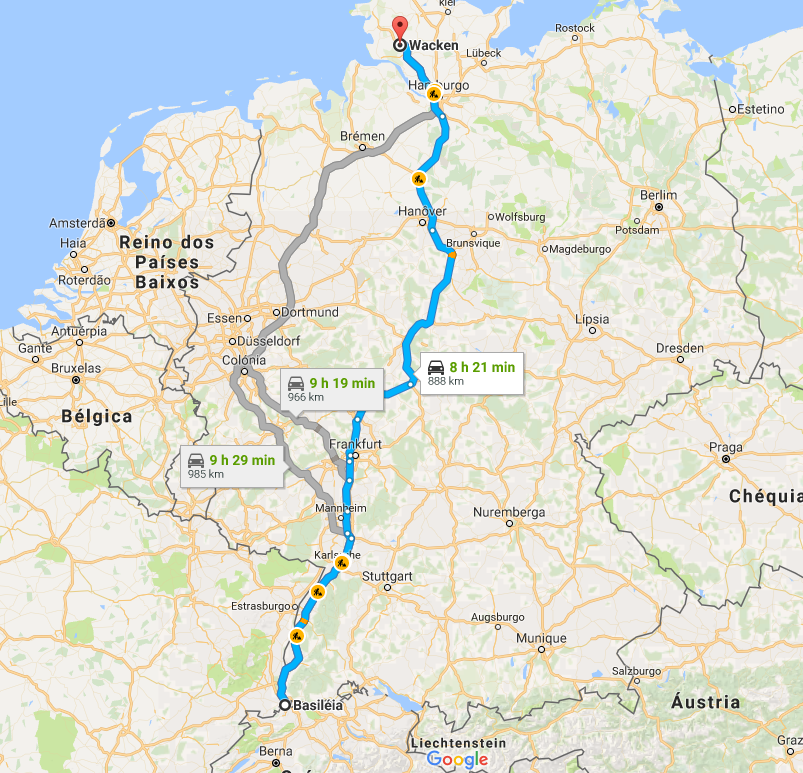
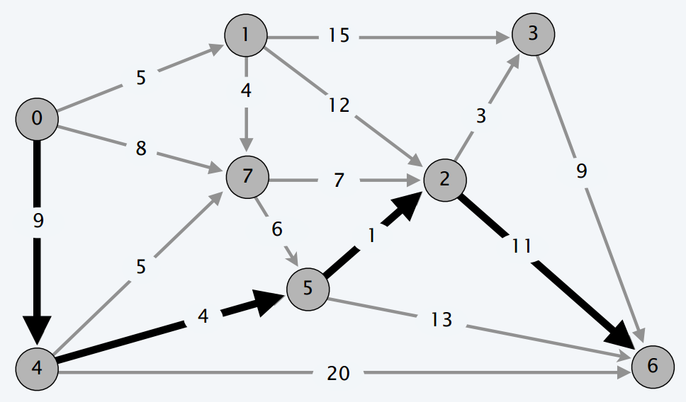
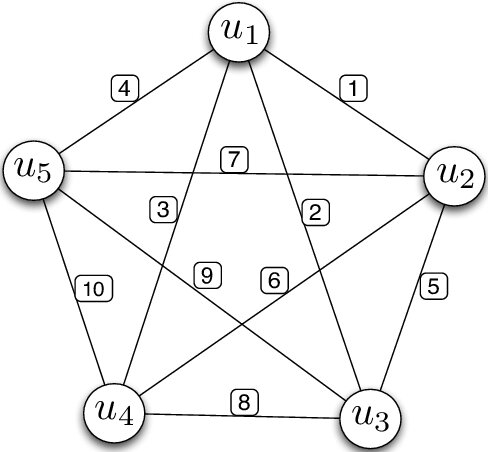
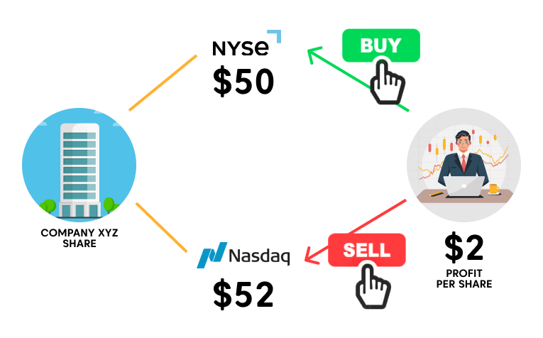
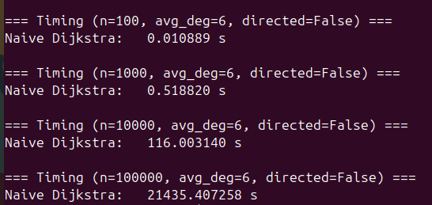

# Caminho Mínimo com Origem Única

## Problema do Caminho Mínimo com Origem Única

{width=70% fig-align="center"}

## Caminho Mínimo com Origem Única

> [Problema do Caminho Mínimo com Origem Única]{.label-def}

> **Entrada:** 
>
> - Um grafo direcionado $G=(V,E)$
>   - Cada arco tem um custo não negativo $l_e$ para $e\in E$.
> - Vértice de **origem** $s$.

> **Saída:** Para cada $v\in V$:
> 
> - $L(v)=$ custo do menor caminho entre $s-v$ em $G$ (distância).

**Importante:**

- $l_e \geq 0, \forall e\in E$.
- Assumiremos representação por **lista de adjacência**.


## Caminho Mínimo com Origem Única

{width=90% fig-align="center"}

[**P.**]{.label-qstn} Custo do caminho $0-6$? [$25.$]{.fragment}

[**P.**]{.label-qstn} Custo do caminho $0-7$? [$8.$]{.fragment}

## Caminho Mínimo com Origem Única

**Algoritmo ingênuo:** calcula todos os caminhos e seus respectivos pesos totais, buscando o menor peso total.

{width=40% fig-align="center"}

Quantos caminhos entre dois nodos específicos num $K_n$?

. . .

$$
\boxed{\displaystyle \sum_{k=0}^{n-2} \binom{n-2}{k} k! = \sum_{k=0}^{n-2}\frac{(n-2)!}{(n-2-k)!} = (n-2)! \sum_{i=0}^{n-2} \frac{1}{i!} \;\approx\; e \cdot (n - 2)!}
$$

## Problema do Caminho Mínimo com Origem Única

Como visto anteriormente para grafos [não]{.alert} valorados:

```pseudocode
#| html-line-number: true
#| html-no-end: true

\begin{algorithmic}
\Procedure{BuscaLargura}{$G=(V,E), s$}
  \State \textbf{Entrada:} Um grafo $G=(V,E)$ e um vértice inicial $s$
  \State \textbf{Saída:} Distâncias $d[v]$ de $s$ até cada $v \in V$
  \State Inicialize $d[v] \gets \infty$ para todo $v \in V$
  \State $d[s] \gets 0$
  \State $Q \gets \{s\}$ \Comment{Fila (FIFO) inicializada com $s$}
  \While{$Q \neq \emptyset$}
    \State $v \gets Q.pop()$
    \For{$(v,w) \in E$}
      \If{$d[w] = \infty$}
        \State $d[w] \gets d[v] + 1$
        \State Adiciona $w$ a $Q$
      \EndIf
    \EndFor
  \EndWhile
\EndProcedure
\end{algorithmic}
```

Custo: $O(m+n)$.

## Problema do Caminho Mínimo com Origem Única

**Entrada:** um grafo $G=(V,E)$ com $m=|E|$ e $n=|V|$:

- Cada arco tem um custo não negativo $l_e$ para $e\in E$.

<br>

[P.]{.label-qstn} É possível usar Busca em Largura?

. . .

**Ideia:** substituir todo arco por arcos de tamanho $1$ e usar BFS.

```{=html}
<svg viewBox="0 0 650 80" style="display:block; margin:0 auto; width:26em; max-width:100%; height:auto;" xmlns="http://www.w3.org/2000/svg" role="img" aria-label="Arco de S para T com custo 3 substituído por três arcos de custo 1 passando por v e w">
<defs><marker id="mbfs" viewBox="0 0 10 10" refX="9" refY="5" markerWidth="7" markerHeight="7" orient="auto-start-reverse"><path d="M0,0 L10,5 L0,10 z" fill="#555555"/></marker></defs>
<line x1="47.0" y1="50.0" x2="153.0" y2="50.0" stroke="#555555" stroke-width="2.5" marker-end="url(#mbfs)"/>
<text x="100.0" y="30.0" font-size="17" text-anchor="middle" dominant-baseline="middle" fill="#c40000" font-family="KaTeX_Main, 'Times New Roman', serif" stroke="#ffffff" stroke-width="4" paint-order="stroke">3</text>
<line x1="347.0" y1="50.0" x2="413.0" y2="50.0" stroke="#555555" stroke-width="2.5" marker-end="url(#mbfs)"/>
<text x="380.0" y="30.0" font-size="17" text-anchor="middle" dominant-baseline="middle" fill="#c40000" font-family="KaTeX_Main, 'Times New Roman', serif" stroke="#ffffff" stroke-width="4" paint-order="stroke">1</text>
<line x1="447.0" y1="50.0" x2="513.0" y2="50.0" stroke="#555555" stroke-width="2.5" marker-end="url(#mbfs)"/>
<text x="480.0" y="30.0" font-size="17" text-anchor="middle" dominant-baseline="middle" fill="#c40000" font-family="KaTeX_Main, 'Times New Roman', serif" stroke="#ffffff" stroke-width="4" paint-order="stroke">1</text>
<line x1="547.0" y1="50.0" x2="603.0" y2="50.0" stroke="#555555" stroke-width="2.5" marker-end="url(#mbfs)"/>
<text x="575.0" y="30.0" font-size="17" text-anchor="middle" dominant-baseline="middle" fill="#c40000" font-family="KaTeX_Main, 'Times New Roman', serif" stroke="#ffffff" stroke-width="4" paint-order="stroke">1</text>
<circle cx="30" cy="50" r="17" fill="#23373b" stroke="#152224" stroke-width="2"/>
<text x="30" y="50" font-size="16" font-weight="bold" text-anchor="middle" dominant-baseline="central" fill="#ffffff" font-family="KaTeX_Math, 'Times New Roman', serif" font-style="italic">S</text>
<circle cx="170" cy="50" r="17" fill="#23373b" stroke="#152224" stroke-width="2"/>
<text x="170" y="50" font-size="16" font-weight="bold" text-anchor="middle" dominant-baseline="central" fill="#ffffff" font-family="KaTeX_Math, 'Times New Roman', serif" font-style="italic">T</text>
<circle cx="330" cy="50" r="17" fill="#23373b" stroke="#152224" stroke-width="2"/>
<text x="330" y="50" font-size="16" font-weight="bold" text-anchor="middle" dominant-baseline="central" fill="#ffffff" font-family="KaTeX_Math, 'Times New Roman', serif" font-style="italic">S</text>
<circle cx="430" cy="50" r="17" fill="#23373b" stroke="#152224" stroke-width="2"/>
<text x="430" y="50" font-size="16" font-weight="bold" text-anchor="middle" dominant-baseline="central" fill="#ffffff" font-family="KaTeX_Math, 'Times New Roman', serif" font-style="italic">v</text>
<circle cx="530" cy="50" r="17" fill="#23373b" stroke="#152224" stroke-width="2"/>
<text x="530" y="50" font-size="16" font-weight="bold" text-anchor="middle" dominant-baseline="central" fill="#ffffff" font-family="KaTeX_Math, 'Times New Roman', serif" font-style="italic">w</text>
<circle cx="620" cy="50" r="17" fill="#23373b" stroke="#152224" stroke-width="2"/>
<text x="620" y="50" font-size="16" font-weight="bold" text-anchor="middle" dominant-baseline="central" fill="#ffffff" font-family="KaTeX_Math, 'Times New Roman', serif" font-style="italic">T</text>
<text x="250" y="50" font-size="30" text-anchor="middle" dominant-baseline="central" fill="#23373b">⟹</text>
</svg>
```

. . .

[**R.**]{.label-ansr} O grafo pode crescer muito, e.g., peso $10^{10}$.

# Algoritmo de Dijkstra (1959)

## Algoritmo de Dijkstra: Exemplo

[**Exemplo:**]{.label-exmp}

**Entrada:** o grafo $G$ abaixo, com pesos $l_e \geq 0$ nas arestas, e o vértice de origem $s = S$ ([em azul]{style="color:#1565c0"}).

```{=html}
<svg viewBox="0 0 500 220" style="display:block; margin:0 auto; width:17em; max-width:100%; height:auto;" xmlns="http://www.w3.org/2000/svg" role="img" aria-label="Grafo não direcionado com vértices S, A, B, C, D, E e F; F é isolado">
<defs><marker id="mex" viewBox="0 0 10 10" refX="9" refY="5" markerWidth="7" markerHeight="7" orient="auto-start-reverse"><path d="M0,0 L10,5 L0,10 z" fill="#555555"/></marker></defs>
<line x1="52.0" y1="98.0" x2="98.0" y2="52.0" stroke="#555555" stroke-width="2.5"/>
<text x="63.0" y="63.0" font-size="17" text-anchor="middle" dominant-baseline="middle" fill="#c40000" font-family="KaTeX_Main, 'Times New Roman', serif" stroke="#ffffff" stroke-width="4" paint-order="stroke">1</text>
<line x1="52.0" y1="122.0" x2="98.0" y2="168.0" stroke="#555555" stroke-width="2.5"/>
<text x="63.0" y="157.0" font-size="17" text-anchor="middle" dominant-baseline="middle" fill="#c40000" font-family="KaTeX_Main, 'Times New Roman', serif" stroke="#ffffff" stroke-width="4" paint-order="stroke">3</text>
<line x1="127.0" y1="40.0" x2="233.0" y2="40.0" stroke="#555555" stroke-width="2.5"/>
<text x="180.0" y="26.0" font-size="17" text-anchor="middle" dominant-baseline="middle" fill="#c40000" font-family="KaTeX_Main, 'Times New Roman', serif" stroke="#ffffff" stroke-width="4" paint-order="stroke">5</text>
<line x1="122.0" y1="52.0" x2="238.0" y2="168.0" stroke="#555555" stroke-width="2.5"/>
<text x="164.0" y="72.0" font-size="17" text-anchor="middle" dominant-baseline="middle" fill="#c40000" font-family="KaTeX_Main, 'Times New Roman', serif" stroke="#ffffff" stroke-width="4" paint-order="stroke">4</text>
<line x1="122.0" y1="168.0" x2="238.0" y2="52.0" stroke="#555555" stroke-width="2.5"/>
<text x="164.0" y="148.0" font-size="17" text-anchor="middle" dominant-baseline="middle" fill="#c40000" font-family="KaTeX_Main, 'Times New Roman', serif" stroke="#ffffff" stroke-width="4" paint-order="stroke">4</text>
<line x1="127.0" y1="180.0" x2="233.0" y2="180.0" stroke="#555555" stroke-width="2.5"/>
<text x="180.0" y="194.0" font-size="17" text-anchor="middle" dominant-baseline="middle" fill="#c40000" font-family="KaTeX_Main, 'Times New Roman', serif" stroke="#ffffff" stroke-width="4" paint-order="stroke">1</text>
<line x1="262.0" y1="52.0" x2="308.0" y2="98.0" stroke="#555555" stroke-width="2.5"/>
<text x="297.0" y="63.0" font-size="17" text-anchor="middle" dominant-baseline="middle" fill="#c40000" font-family="KaTeX_Main, 'Times New Roman', serif" stroke="#ffffff" stroke-width="4" paint-order="stroke">2</text>
<line x1="262.0" y1="168.0" x2="308.0" y2="122.0" stroke="#555555" stroke-width="2.5"/>
<text x="297.0" y="157.0" font-size="17" text-anchor="middle" dominant-baseline="middle" fill="#c40000" font-family="KaTeX_Main, 'Times New Roman', serif" stroke="#ffffff" stroke-width="4" paint-order="stroke">6</text>
<circle cx="40" cy="110" r="17" fill="#1565c0" stroke="#0d47a1" stroke-width="2"/>
<text x="40" y="110" font-size="16" font-weight="bold" text-anchor="middle" dominant-baseline="central" fill="#ffffff" font-family="KaTeX_Math, 'Times New Roman', serif" font-style="italic">S</text>
<circle cx="110" cy="40" r="17" fill="#23373b" stroke="#152224" stroke-width="2"/>
<text x="110" y="40" font-size="16" font-weight="bold" text-anchor="middle" dominant-baseline="central" fill="#ffffff" font-family="KaTeX_Math, 'Times New Roman', serif" font-style="italic">A</text>
<circle cx="110" cy="180" r="17" fill="#23373b" stroke="#152224" stroke-width="2"/>
<text x="110" y="180" font-size="16" font-weight="bold" text-anchor="middle" dominant-baseline="central" fill="#ffffff" font-family="KaTeX_Math, 'Times New Roman', serif" font-style="italic">B</text>
<circle cx="250" cy="40" r="17" fill="#23373b" stroke="#152224" stroke-width="2"/>
<text x="250" y="40" font-size="16" font-weight="bold" text-anchor="middle" dominant-baseline="central" fill="#ffffff" font-family="KaTeX_Math, 'Times New Roman', serif" font-style="italic">D</text>
<circle cx="250" cy="180" r="17" fill="#23373b" stroke="#152224" stroke-width="2"/>
<text x="250" y="180" font-size="16" font-weight="bold" text-anchor="middle" dominant-baseline="central" fill="#ffffff" font-family="KaTeX_Math, 'Times New Roman', serif" font-style="italic">C</text>
<circle cx="320" cy="110" r="17" fill="#23373b" stroke="#152224" stroke-width="2"/>
<text x="320" y="110" font-size="16" font-weight="bold" text-anchor="middle" dominant-baseline="central" fill="#ffffff" font-family="KaTeX_Math, 'Times New Roman', serif" font-style="italic">E</text>
<circle cx="460" cy="110" r="17" fill="#23373b" stroke="#152224" stroke-width="2"/>
<text x="460" y="110" font-size="16" font-weight="bold" text-anchor="middle" dominant-baseline="central" fill="#ffffff" font-family="KaTeX_Math, 'Times New Roman', serif" font-style="italic">F</text>
</svg>
```

. . .

**Saída:** para cada $v \in V$, a distância $d(S,v)$ do menor caminho de $S$ até $v$ (caminho entre parênteses):

:::: columns
::: {.column width="50%"}
- $d(S,S)=\ 0 \quad (S)$
- $d(S,A)=\ 1 \quad (SA)$
- $d(S,B)=\ 3 \quad (SB)$
- $d(S,C)=\ 4 \quad (SBC)$
:::
::: {.column width="50%"}
- $d(S,D)=\ 6 \quad (SAD)$
- $d(S,E)=\ 8 \quad (SADE)$
- $d(S,F)=\ \infty$
:::
::::

## Algoritmo de Dijkstra: Pseudocódigo

```pseudocode
#| html-line-number: true
#| html-no-end: true

\begin{algorithmic}
\Procedure{Dijkstra}{$G=(V,E,w), s$}
  \State \textbf{Entrada:} Um grafo com pesos não-negativos $(V, E, w)$ e um nodo $s \in V$
  \State \textbf{Saída:} Uma tabela $\textcolor{#9e0300}{\text{dist}}$ associando cada $v \in V$ à sua distância $d(s,v)$
  \State // Inicialização
  \State $\textcolor{#2e75b6}{X} \gets \{s\}$
  \State $\textcolor{#9e0300}{\text{dist}}(s) \gets 0$
  \State $\textcolor{#9e0300}{\text{dist}}(v) \gets +\infty$ para todo $v \neq s$
  \State // Laço principal
  \While{existe uma aresta $(v, w)$ tal que $v \in \textcolor{#2e75b6}{X}$ e $w \notin \textcolor{#2e75b6}{X}$}
    \State $(v^*, w^*) \gets$ tal aresta que minimiza $\textcolor{#9e0300}{\text{dist}}(v) + \ell_{vw}$
    \State Adicione $w^*$ a $\textcolor{#2e75b6}{X}$
    \State $\textcolor{#9e0300}{\text{dist}}(w^*) \gets \textcolor{#9e0300}{\text{dist}}(v^*) + \ell_{v^*w^*}$
  \EndWhile
  \State \textbf{Retorne} $\textcolor{#9e0300}{\text{dist}}$
\EndProcedure
\end{algorithmic}
```

## Algoritmo de Dijkstra

```{=html}
<svg viewBox="0 0 820 450" style="display:block; margin:0 auto; width:32em; max-width:100%; height:auto;" xmlns="http://www.w3.org/2000/svg" role="img" aria-label="Fronteira do algoritmo de Dijkstra: vértices processados X, com a origem s, e vértices ainda não processados V − X; as arestas de X para V − X são as candidatas para (v*, w*)">
<defs>
<marker id="fin" viewBox="0 0 10 10" refX="9" refY="5" markerWidth="7" markerHeight="7" orient="auto"><path d="M0,0 L10,5 L0,10 z" fill="#9aa5ad"/></marker>
<marker id="fcand" viewBox="0 0 10 10" refX="9" refY="5" markerWidth="7" markerHeight="7" orient="auto"><path d="M0,0 L10,5 L0,10 z" fill="#eb811b"/></marker>
<marker id="fback" viewBox="0 0 10 10" refX="9" refY="5" markerWidth="7" markerHeight="7" orient="auto"><path d="M0,0 L10,5 L0,10 z" fill="#9aa5ad"/></marker>
</defs>
<ellipse cx="200" cy="235" rx="175" ry="165" fill="#e3eef8" stroke="#2e75b6" stroke-width="2.5"/>
<ellipse cx="620" cy="235" rx="170" ry="165" fill="#f5f7f9" stroke="#9aa5ad" stroke-width="2.5"/>
<text x="200" y="40" font-size="21" text-anchor="middle" fill="#1f5a8f" font-weight="600">processados</text>
<text x="620" y="40" font-size="21" text-anchor="middle" fill="#23373b" font-weight="600">ainda não processados</text>
<text x="120" y="130" font-size="40" text-anchor="middle" fill="#2e75b6" font-family="KaTeX_Math, 'Times New Roman', serif" font-style="italic">X</text>
<text x="650" y="128" font-size="36" text-anchor="middle" fill="#23373b" font-family="KaTeX_Math, 'Times New Roman', serif"><tspan font-style="italic">V</tspan> − <tspan font-style="italic">X</tspan></text>
<line x1="111.3" y1="218.7" x2="192.3" y2="137.7" stroke="#9aa5ad" stroke-width="2.5" marker-end="url(#fin)"/>
<line x1="112.7" y1="249.7" x2="201.2" y2="323.5" stroke="#9aa5ad" stroke-width="2.5" marker-end="url(#fin)"/>
<line x1="216.7" y1="137.3" x2="287.6" y2="212.0" stroke="#9aa5ad" stroke-width="2.5" marker-end="url(#fin)"/>
<line x1="225.4" y1="321.5" x2="289.0" y2="239.2" stroke="#9aa5ad" stroke-width="2.5" marker-end="url(#fin)"/>
<line x1="541.0" y1="135.7" x2="663.0" y2="179.0" stroke="#9aa5ad" stroke-width="2.5" marker-end="url(#fin)"/>
<line x1="531.0" y1="239.2" x2="663.1" y2="191.2" stroke="#9aa5ad" stroke-width="2.5" marker-end="url(#fin)"/>
<line x1="556.7" y1="341.9" x2="682.3" y2="318.3" stroke="#9aa5ad" stroke-width="2.5" marker-end="url(#fin)"/>
<line x1="682.6" y1="201.8" x2="697.3" y2="297.2" stroke="#9aa5ad" stroke-width="2.5" marker-end="url(#fin)"/>
<line x1="222.0" y1="125.3" x2="507.0" y2="129.7" stroke="#eb811b" stroke-width="4" marker-end="url(#fcand)"/>
<line x1="316.9" y1="226.6" x2="497.1" y2="243.3" stroke="#eb811b" stroke-width="4" marker-end="url(#fcand)"/>
<line x1="232.0" y1="335.5" x2="522.0" y2="344.4" stroke="#eb811b" stroke-width="4" marker-end="url(#fcand)"/>
<line x1="524.8" y1="337.4" x2="316.1" y2="233.0" stroke="#9aa5ad" stroke-width="2.5" stroke-dasharray="7 5" marker-end="url(#fback)"/>
<path d="M410,70 C375,160 445,310 410,410" fill="none" stroke="#b31313" stroke-width="3" stroke-dasharray="11 8"/>
<text x="410" y="56" font-size="19" text-anchor="middle" fill="#b31313" font-weight="600">fronteira</text>
<circle cx="95" cy="235" r="21" fill="#2e75b6" stroke="#1f5a8f" stroke-width="2"/>
<text x="95" y="235" font-size="22" text-anchor="middle" dominant-baseline="central" fill="#ffffff" font-family="KaTeX_Math, 'Times New Roman', serif" font-style="italic">s</text>
<circle cx="205" cy="125" r="15" fill="#2e75b6" stroke="#1f5a8f" stroke-width="2"/>
<circle cx="215" cy="335" r="15" fill="#2e75b6" stroke="#1f5a8f" stroke-width="2"/>
<circle cx="300" cy="225" r="15" fill="#2e75b6" stroke="#1f5a8f" stroke-width="2"/>
<circle cx="525" cy="130" r="15" fill="#ffffff" stroke="#23373b" stroke-width="2.5"/>
<circle cx="515" cy="245" r="15" fill="#ffffff" stroke="#23373b" stroke-width="2.5"/>
<circle cx="540" cy="345" r="15" fill="#ffffff" stroke="#23373b" stroke-width="2.5"/>
<circle cx="680" cy="185" r="15" fill="#ffffff" stroke="#23373b" stroke-width="2.5"/>
<circle cx="700" cy="315" r="15" fill="#ffffff" stroke="#23373b" stroke-width="2.5"/>
<line x1="40" y1="430" x2="72" y2="430" stroke="#eb811b" stroke-width="4"/>
<text x="82" y="436" font-size="18" fill="#eb811b" font-weight="600">candidatas para (<tspan font-family="KaTeX_Math, 'Times New Roman', serif" font-style="italic">v</tspan>*, <tspan font-family="KaTeX_Math, 'Times New Roman', serif" font-style="italic">w</tspan>*)</text>
<line x1="478" y1="430" x2="510" y2="430" stroke="#9aa5ad" stroke-width="2.5" stroke-dasharray="7 5"/>
<text x="520" y="436" font-size="18" fill="#6b777d">de <tspan font-family="KaTeX_Math, 'Times New Roman', serif" font-style="italic">V</tspan> − <tspan font-family="KaTeX_Math, 'Times New Roman', serif" font-style="italic">X</tspan> para <tspan font-family="KaTeX_Math, 'Times New Roman', serif" font-style="italic">X</tspan>: não é candidata</text>
</svg>
```

## Algoritmo de Dijkstra: Execução

```{=html}
<svg viewBox="15 15 470 190" style="display:block; margin:0 auto; width:24em; max-width:100%; height:auto;" xmlns="http://www.w3.org/2000/svg" role="img" aria-label="Grafo não direcionado com vértices S, A, B, C, D, E e F; F é isolado">
<defs><marker id="mexs" viewBox="0 0 10 10" refX="9" refY="5" markerWidth="7" markerHeight="7" orient="auto-start-reverse"><path d="M0,0 L10,5 L0,10 z" fill="#555555"/></marker></defs>
<line x1="52.0" y1="98.0" x2="98.0" y2="52.0" stroke="#555555" stroke-width="2.5"/>
<text x="63.0" y="63.0" font-size="17" text-anchor="middle" dominant-baseline="middle" fill="#c40000" font-family="KaTeX_Main, 'Times New Roman', serif" stroke="#ffffff" stroke-width="4" paint-order="stroke">1</text>
<line x1="52.0" y1="122.0" x2="98.0" y2="168.0" stroke="#555555" stroke-width="2.5"/>
<text x="63.0" y="157.0" font-size="17" text-anchor="middle" dominant-baseline="middle" fill="#c40000" font-family="KaTeX_Main, 'Times New Roman', serif" stroke="#ffffff" stroke-width="4" paint-order="stroke">3</text>
<line x1="127.0" y1="40.0" x2="233.0" y2="40.0" stroke="#555555" stroke-width="2.5"/>
<text x="180.0" y="26.0" font-size="17" text-anchor="middle" dominant-baseline="middle" fill="#c40000" font-family="KaTeX_Main, 'Times New Roman', serif" stroke="#ffffff" stroke-width="4" paint-order="stroke">5</text>
<line x1="122.0" y1="52.0" x2="238.0" y2="168.0" stroke="#555555" stroke-width="2.5"/>
<text x="164.0" y="72.0" font-size="17" text-anchor="middle" dominant-baseline="middle" fill="#c40000" font-family="KaTeX_Main, 'Times New Roman', serif" stroke="#ffffff" stroke-width="4" paint-order="stroke">4</text>
<line x1="122.0" y1="168.0" x2="238.0" y2="52.0" stroke="#555555" stroke-width="2.5"/>
<text x="164.0" y="148.0" font-size="17" text-anchor="middle" dominant-baseline="middle" fill="#c40000" font-family="KaTeX_Main, 'Times New Roman', serif" stroke="#ffffff" stroke-width="4" paint-order="stroke">4</text>
<line x1="127.0" y1="180.0" x2="233.0" y2="180.0" stroke="#555555" stroke-width="2.5"/>
<text x="180.0" y="194.0" font-size="17" text-anchor="middle" dominant-baseline="middle" fill="#c40000" font-family="KaTeX_Main, 'Times New Roman', serif" stroke="#ffffff" stroke-width="4" paint-order="stroke">1</text>
<line x1="262.0" y1="52.0" x2="308.0" y2="98.0" stroke="#555555" stroke-width="2.5"/>
<text x="297.0" y="63.0" font-size="17" text-anchor="middle" dominant-baseline="middle" fill="#c40000" font-family="KaTeX_Main, 'Times New Roman', serif" stroke="#ffffff" stroke-width="4" paint-order="stroke">2</text>
<line x1="262.0" y1="168.0" x2="308.0" y2="122.0" stroke="#555555" stroke-width="2.5"/>
<text x="297.0" y="157.0" font-size="17" text-anchor="middle" dominant-baseline="middle" fill="#c40000" font-family="KaTeX_Main, 'Times New Roman', serif" stroke="#ffffff" stroke-width="4" paint-order="stroke">6</text>
<circle cx="40" cy="110" r="17" fill="#23373b" stroke="#152224" stroke-width="2"/>
<text x="40" y="110" font-size="16" font-weight="bold" text-anchor="middle" dominant-baseline="central" fill="#ffffff" font-family="KaTeX_Math, 'Times New Roman', serif" font-style="italic">S</text>
<circle cx="110" cy="40" r="17" fill="#23373b" stroke="#152224" stroke-width="2"/>
<text x="110" y="40" font-size="16" font-weight="bold" text-anchor="middle" dominant-baseline="central" fill="#ffffff" font-family="KaTeX_Math, 'Times New Roman', serif" font-style="italic">A</text>
<circle cx="110" cy="180" r="17" fill="#23373b" stroke="#152224" stroke-width="2"/>
<text x="110" y="180" font-size="16" font-weight="bold" text-anchor="middle" dominant-baseline="central" fill="#ffffff" font-family="KaTeX_Math, 'Times New Roman', serif" font-style="italic">B</text>
<circle cx="250" cy="40" r="17" fill="#23373b" stroke="#152224" stroke-width="2"/>
<text x="250" y="40" font-size="16" font-weight="bold" text-anchor="middle" dominant-baseline="central" fill="#ffffff" font-family="KaTeX_Math, 'Times New Roman', serif" font-style="italic">D</text>
<circle cx="250" cy="180" r="17" fill="#23373b" stroke="#152224" stroke-width="2"/>
<text x="250" y="180" font-size="16" font-weight="bold" text-anchor="middle" dominant-baseline="central" fill="#ffffff" font-family="KaTeX_Math, 'Times New Roman', serif" font-style="italic">C</text>
<circle cx="320" cy="110" r="17" fill="#23373b" stroke="#152224" stroke-width="2"/>
<text x="320" y="110" font-size="16" font-weight="bold" text-anchor="middle" dominant-baseline="central" fill="#ffffff" font-family="KaTeX_Math, 'Times New Roman', serif" font-style="italic">E</text>
<circle cx="460" cy="110" r="17" fill="#23373b" stroke="#152224" stroke-width="2"/>
<text x="460" y="110" font-size="16" font-weight="bold" text-anchor="middle" dominant-baseline="central" fill="#ffffff" font-family="KaTeX_Math, 'Times New Roman', serif" font-style="italic">F</text>
</svg>
```

<br>

:::: {style="display:flex; justify-content:center; gap:0.5em; font-size:0.62em;"}
::: {}
$$
\begin{array}{|ll|}
\hline
\mathbf{dist_0} & \\
\color{blue}S & \color{blue}0 \\
A & 1 \\
B & 3 \\
C & \infty \\
D & \infty \\
E & \infty \\
F & \infty \\
\hline
\color{blue}\mathbf{X_0} & \\
\color{blue}\{S\} & \\
\hline
\color{red}\text{min:} & A \\
\hline
\end{array}
$$
:::
::: {.fragment}
$$
\begin{array}{|ll|}
\hline
\mathbf{dist_1} & \\
\color{blue}S & \color{blue}0 \\
\color{blue}A & \color{blue}1 \\
B & 3 \\
C & 5 \\
D & 6 \\
E & \infty \\
F & \infty \\
\hline
\color{blue}\mathbf{X_1} & \\
\color{blue}\{S,A\} & \\
\hline
\color{red}\text{min:} & B \\
\hline
\end{array}
$$
:::
::: {.fragment}
$$
\begin{array}{|ll|}
\hline
\mathbf{dist_2} & \\
\color{blue}S & \color{blue}0 \\
\color{blue}A & \color{blue}1 \\
\color{blue}B & \color{blue}3 \\
C & 4 \\
D & 6 \\
E & \infty \\
F & \infty \\
\hline
\color{blue}\mathbf{X_2} & \\
\color{blue}\{S,A,B\} & \\
\hline
\color{red}\text{min:} & C \\
\hline
\end{array}
$$
:::
::: {.fragment}
$$
\begin{array}{|ll|}
\hline
\mathbf{dist_3} & \\
\color{blue}S & \color{blue}0 \\
\color{blue}A & \color{blue}1 \\
\color{blue}B & \color{blue}3 \\
\color{blue}C & \color{blue}4 \\
D & 6 \\
E & 10 \\
F & \infty \\
\hline
\color{blue}\mathbf{X_3} & \\
\color{blue}\{S,A,B,C\} & \\
\hline
\color{red}\text{min:} & D \\
\hline
\end{array}
$$
:::
::: {.fragment}
$$
\begin{array}{|ll|}
\hline
\mathbf{dist_4} & \\
\color{blue}S & \color{blue}0 \\
\color{blue}A & \color{blue}1 \\
\color{blue}B & \color{blue}3 \\
\color{blue}C & \color{blue}4 \\
\color{blue}D & \color{blue}6 \\
E & 10 \\
F & \infty \\
\hline
\color{blue}\mathbf{X_4} & \\
\color{blue}\{S,A,B,C,D\} & \\
\hline
\color{red}\text{min:} & E \\
\hline
\end{array}
$$
:::
::: {.fragment}
$$
\begin{array}{|ll|}
\hline
\mathbf{dist_5} & \\
\color{blue}S & \color{blue}0 \\
\color{blue}A & \color{blue}1 \\
\color{blue}B & \color{blue}3 \\
\color{blue}C & \color{blue}4 \\
\color{blue}D & \color{blue}6 \\
\color{blue}E & \color{blue}8 \\
F & \infty \\
\hline
\color{blue}\mathbf{X_5} & \\
\color{blue}\{S,A,B,C,D,E\} & \\
\hline
\color{red}\text{para!} & \\
\hline
\end{array}
$$
:::
::::

## Visualização do Algoritmo de Dijkstra

```{=html}
<iframe id="dijkstra-viz" src="https://lucasalegre.github.io/dijkstra-visualizer/" title="Visualização do algoritmo de Dijkstra" style="display:block; width:100%; height:595px; border:1px solid #dde3e7; border-radius:8px;" allow="fullscreen" allowfullscreen></iframe>
<div style="display:flex; justify-content:space-between; align-items:center; margin-top:0.35em; font-size:0.6em;">
  <a href="https://lucasalegre.github.io/dijkstra-visualizer/" target="_blank" data-preview-link="false">lucasalegre.github.io/dijkstra-visualizer</a>
  <button type="button" onclick="const f = document.getElementById('dijkstra-viz'); (f.requestFullscreen || f.webkitRequestFullscreen).call(f);" style="font: inherit; padding: 0.25em 0.8em; border: 1px solid #2e75b6; border-radius: 6px; background: #2e75b6; color: #fff; cursor: pointer;">⛶ Tela cheia</button>
</div>
```

## Algoritmo de Dijkstra: Limitações

- Uma **restrição** importante ao algoritmo de Dijkstra é o fato de que os grafos necessariamente precisam possuir [pesos não-negativos]{.alert}.

<br>

[Exemplo:]{.label-exmp}

```{=html}
<svg viewBox="0 0 966 224" style="display:block; margin:0 auto; width:36em; max-width:100%; height:auto;" xmlns="http://www.w3.org/2000/svg" role="img" aria-label="Três grafos G1, G2 e G3 com vértices A a F e arcos com pesos arbitrários, incluindo pesos negativos">
<defs><marker id="mneg" viewBox="0 0 10 10" refX="10" refY="5" markerWidth="15" markerHeight="15" markerUnits="userSpaceOnUse" orient="auto-start-reverse"><path d="M0,0 L10,5 L0,10 z" fill="#555555"/></marker></defs>
<text x="153" y="26" font-size="26" text-anchor="middle" fill="#23373b" font-family="KaTeX_Math, 'Times New Roman', serif" font-style="italic">G<tspan dy="6" font-size="18" font-style="normal" font-family="KaTeX_Main, 'Times New Roman', serif">1</tspan></text>
<line x1="61.0" y1="75.0" x2="133.0" y2="75.0" stroke="#555555" stroke-width="2.5" marker-end="url(#mneg)"/>
<text x="97.0" y="58.0" font-size="21" text-anchor="middle" dominant-baseline="central" fill="#c40000" font-family="KaTeX_Main, 'Times New Roman', serif" stroke="#ffffff" stroke-width="5" paint-order="stroke">8</text>
<line x1="153.0" y1="95.0" x2="153.0" y2="155.0" stroke="#555555" stroke-width="2.5" marker-end="url(#mneg)" marker-start="url(#mneg)"/>
<text x="180.0" y="125.0" font-size="21" text-anchor="middle" dominant-baseline="central" fill="#c40000" font-family="KaTeX_Main, 'Times New Roman', serif" stroke="#ffffff" stroke-width="5" paint-order="stroke">2</text>
<line x1="138.1" y1="88.3" x2="55.9" y2="161.7" stroke="#555555" stroke-width="2.5" marker-end="url(#mneg)"/>
<text x="82.3" y="108.6" font-size="21" text-anchor="middle" dominant-baseline="central" fill="#c40000" font-family="KaTeX_Main, 'Times New Roman', serif" stroke="#ffffff" stroke-width="5" paint-order="stroke">−2</text>
<line x1="61.0" y1="175.0" x2="133.0" y2="175.0" stroke="#555555" stroke-width="2.5" marker-end="url(#mneg)" marker-start="url(#mneg)"/>
<text x="97.0" y="192.0" font-size="21" text-anchor="middle" dominant-baseline="central" fill="#c40000" font-family="KaTeX_Main, 'Times New Roman', serif" stroke="#ffffff" stroke-width="5" paint-order="stroke">2</text>
<line x1="173.0" y1="175.0" x2="245.0" y2="175.0" stroke="#555555" stroke-width="2.5" marker-end="url(#mneg)"/>
<text x="209.0" y="192.0" font-size="21" text-anchor="middle" dominant-baseline="central" fill="#c40000" font-family="KaTeX_Main, 'Times New Roman', serif" stroke="#ffffff" stroke-width="5" paint-order="stroke">2</text>
<circle cx="41" cy="75" r="19" fill="#23373b" stroke="#152224" stroke-width="2"/>
<text x="41" y="75" font-size="20" font-weight="bold" text-anchor="middle" dominant-baseline="central" fill="#ffffff" font-family="KaTeX_Math, 'Times New Roman', serif" font-style="italic">A</text>
<circle cx="153" cy="75" r="19" fill="#23373b" stroke="#152224" stroke-width="2"/>
<text x="153" y="75" font-size="20" font-weight="bold" text-anchor="middle" dominant-baseline="central" fill="#ffffff" font-family="KaTeX_Math, 'Times New Roman', serif" font-style="italic">B</text>
<circle cx="265" cy="75" r="19" fill="#23373b" stroke="#152224" stroke-width="2"/>
<text x="265" y="75" font-size="20" font-weight="bold" text-anchor="middle" dominant-baseline="central" fill="#ffffff" font-family="KaTeX_Math, 'Times New Roman', serif" font-style="italic">C</text>
<circle cx="41" cy="175" r="19" fill="#23373b" stroke="#152224" stroke-width="2"/>
<text x="41" y="175" font-size="20" font-weight="bold" text-anchor="middle" dominant-baseline="central" fill="#ffffff" font-family="KaTeX_Math, 'Times New Roman', serif" font-style="italic">D</text>
<circle cx="153" cy="175" r="19" fill="#23373b" stroke="#152224" stroke-width="2"/>
<text x="153" y="175" font-size="20" font-weight="bold" text-anchor="middle" dominant-baseline="central" fill="#ffffff" font-family="KaTeX_Math, 'Times New Roman', serif" font-style="italic">E</text>
<circle cx="265" cy="175" r="19" fill="#23373b" stroke="#152224" stroke-width="2"/>
<text x="265" y="175" font-size="20" font-weight="bold" text-anchor="middle" dominant-baseline="central" fill="#ffffff" font-family="KaTeX_Math, 'Times New Roman', serif" font-style="italic">F</text>
<text x="483" y="26" font-size="26" text-anchor="middle" fill="#23373b" font-family="KaTeX_Math, 'Times New Roman', serif" font-style="italic">G<tspan dy="6" font-size="18" font-style="normal" font-family="KaTeX_Main, 'Times New Roman', serif">2</tspan></text>
<line x1="391.0" y1="75.0" x2="463.0" y2="75.0" stroke="#555555" stroke-width="2.5" marker-end="url(#mneg)"/>
<text x="427.0" y="58.0" font-size="21" text-anchor="middle" dominant-baseline="central" fill="#c40000" font-family="KaTeX_Main, 'Times New Roman', serif" stroke="#ffffff" stroke-width="5" paint-order="stroke">8</text>
<line x1="483.0" y1="95.0" x2="483.0" y2="155.0" stroke="#555555" stroke-width="2.5" marker-end="url(#mneg)" marker-start="url(#mneg)"/>
<text x="510.0" y="125.0" font-size="21" text-anchor="middle" dominant-baseline="central" fill="#c40000" font-family="KaTeX_Main, 'Times New Roman', serif" stroke="#ffffff" stroke-width="5" paint-order="stroke">2</text>
<line x1="385.9" y1="161.7" x2="468.1" y2="88.3" stroke="#555555" stroke-width="2.5" marker-end="url(#mneg)" marker-start="url(#mneg)"/>
<text x="412.3" y="108.6" font-size="21" text-anchor="middle" dominant-baseline="central" fill="#c40000" font-family="KaTeX_Main, 'Times New Roman', serif" stroke="#ffffff" stroke-width="5" paint-order="stroke">4</text>
<line x1="391.0" y1="175.0" x2="463.0" y2="175.0" stroke="#555555" stroke-width="2.5" marker-end="url(#mneg)"/>
<text x="427.0" y="192.0" font-size="21" text-anchor="middle" dominant-baseline="central" fill="#c40000" font-family="KaTeX_Main, 'Times New Roman', serif" stroke="#ffffff" stroke-width="5" paint-order="stroke">−5</text>
<line x1="503.0" y1="175.0" x2="575.0" y2="175.0" stroke="#555555" stroke-width="2.5" marker-end="url(#mneg)"/>
<text x="539.0" y="192.0" font-size="21" text-anchor="middle" dominant-baseline="central" fill="#c40000" font-family="KaTeX_Main, 'Times New Roman', serif" stroke="#ffffff" stroke-width="5" paint-order="stroke">2</text>
<circle cx="371" cy="75" r="19" fill="#23373b" stroke="#152224" stroke-width="2"/>
<text x="371" y="75" font-size="20" font-weight="bold" text-anchor="middle" dominant-baseline="central" fill="#ffffff" font-family="KaTeX_Math, 'Times New Roman', serif" font-style="italic">A</text>
<circle cx="483" cy="75" r="19" fill="#23373b" stroke="#152224" stroke-width="2"/>
<text x="483" y="75" font-size="20" font-weight="bold" text-anchor="middle" dominant-baseline="central" fill="#ffffff" font-family="KaTeX_Math, 'Times New Roman', serif" font-style="italic">B</text>
<circle cx="595" cy="75" r="19" fill="#23373b" stroke="#152224" stroke-width="2"/>
<text x="595" y="75" font-size="20" font-weight="bold" text-anchor="middle" dominant-baseline="central" fill="#ffffff" font-family="KaTeX_Math, 'Times New Roman', serif" font-style="italic">C</text>
<circle cx="371" cy="175" r="19" fill="#23373b" stroke="#152224" stroke-width="2"/>
<text x="371" y="175" font-size="20" font-weight="bold" text-anchor="middle" dominant-baseline="central" fill="#ffffff" font-family="KaTeX_Math, 'Times New Roman', serif" font-style="italic">D</text>
<circle cx="483" cy="175" r="19" fill="#23373b" stroke="#152224" stroke-width="2"/>
<text x="483" y="175" font-size="20" font-weight="bold" text-anchor="middle" dominant-baseline="central" fill="#ffffff" font-family="KaTeX_Math, 'Times New Roman', serif" font-style="italic">E</text>
<circle cx="595" cy="175" r="19" fill="#23373b" stroke="#152224" stroke-width="2"/>
<text x="595" y="175" font-size="20" font-weight="bold" text-anchor="middle" dominant-baseline="central" fill="#ffffff" font-family="KaTeX_Math, 'Times New Roman', serif" font-style="italic">F</text>
<text x="813" y="26" font-size="26" text-anchor="middle" fill="#23373b" font-family="KaTeX_Math, 'Times New Roman', serif" font-style="italic">G<tspan dy="6" font-size="18" font-style="normal" font-family="KaTeX_Main, 'Times New Roman', serif">3</tspan></text>
<line x1="793.0" y1="75.0" x2="721.0" y2="75.0" stroke="#555555" stroke-width="2.5" marker-end="url(#mneg)"/>
<text x="757.0" y="58.0" font-size="21" text-anchor="middle" dominant-baseline="central" fill="#c40000" font-family="KaTeX_Main, 'Times New Roman', serif" stroke="#ffffff" stroke-width="5" paint-order="stroke">8</text>
<line x1="813.0" y1="155.0" x2="813.0" y2="95.0" stroke="#555555" stroke-width="2.5" marker-end="url(#mneg)"/>
<text x="840.0" y="125.0" font-size="21" text-anchor="middle" dominant-baseline="central" fill="#c40000" font-family="KaTeX_Main, 'Times New Roman', serif" stroke="#ffffff" stroke-width="5" paint-order="stroke">2</text>
<line x1="701.0" y1="95.0" x2="701.0" y2="155.0" stroke="#555555" stroke-width="2.5" marker-end="url(#mneg)"/>
<text x="736.0" y="125.0" font-size="21" text-anchor="middle" dominant-baseline="central" fill="#c40000" font-family="KaTeX_Main, 'Times New Roman', serif" stroke="#ffffff" stroke-width="5" paint-order="stroke">−30</text>
<line x1="721.0" y1="175.0" x2="793.0" y2="175.0" stroke="#555555" stroke-width="2.5" marker-end="url(#mneg)"/>
<text x="757.0" y="192.0" font-size="21" text-anchor="middle" dominant-baseline="central" fill="#c40000" font-family="KaTeX_Main, 'Times New Roman', serif" stroke="#ffffff" stroke-width="5" paint-order="stroke">10</text>
<line x1="833.0" y1="175.0" x2="905.0" y2="175.0" stroke="#555555" stroke-width="2.5" marker-end="url(#mneg)"/>
<text x="869.0" y="192.0" font-size="21" text-anchor="middle" dominant-baseline="central" fill="#c40000" font-family="KaTeX_Main, 'Times New Roman', serif" stroke="#ffffff" stroke-width="5" paint-order="stroke">2</text>
<circle cx="701" cy="75" r="19" fill="#23373b" stroke="#152224" stroke-width="2"/>
<text x="701" y="75" font-size="20" font-weight="bold" text-anchor="middle" dominant-baseline="central" fill="#ffffff" font-family="KaTeX_Math, 'Times New Roman', serif" font-style="italic">A</text>
<circle cx="813" cy="75" r="19" fill="#23373b" stroke="#152224" stroke-width="2"/>
<text x="813" y="75" font-size="20" font-weight="bold" text-anchor="middle" dominant-baseline="central" fill="#ffffff" font-family="KaTeX_Math, 'Times New Roman', serif" font-style="italic">B</text>
<circle cx="925" cy="75" r="19" fill="#23373b" stroke="#152224" stroke-width="2"/>
<text x="925" y="75" font-size="20" font-weight="bold" text-anchor="middle" dominant-baseline="central" fill="#ffffff" font-family="KaTeX_Math, 'Times New Roman', serif" font-style="italic">C</text>
<circle cx="701" cy="175" r="19" fill="#23373b" stroke="#152224" stroke-width="2"/>
<text x="701" y="175" font-size="20" font-weight="bold" text-anchor="middle" dominant-baseline="central" fill="#ffffff" font-family="KaTeX_Math, 'Times New Roman', serif" font-style="italic">D</text>
<circle cx="813" cy="175" r="19" fill="#23373b" stroke="#152224" stroke-width="2"/>
<text x="813" y="175" font-size="20" font-weight="bold" text-anchor="middle" dominant-baseline="central" fill="#ffffff" font-family="KaTeX_Math, 'Times New Roman', serif" font-style="italic">E</text>
<circle cx="925" cy="175" r="19" fill="#23373b" stroke="#152224" stroke-width="2"/>
<text x="925" y="175" font-size="20" font-weight="bold" text-anchor="middle" dominant-baseline="central" fill="#ffffff" font-family="KaTeX_Math, 'Times New Roman', serif" font-style="italic">F</text>
</svg>
```

Responda:

:::{.incremental}
- Qual a distância entre $A$ e $F$?
- O que o algoritmo de Dijkstra apontaria como menor distância se fosse aplicado?
- Por que o algoritmo de Dijkstra não funciona em alguns desses grafos?
::: 

<!-- Exercício: pesquise sobre os algoritmos de menor caminho conhecidos como Bellman-Ford e Johnson. -->

## Algoritmo de Dijkstra: Limitações

[P.]{.label-qstn} Como reduzir o problema do caminho mínimo com custos negativos para o mesmo problema com custos não negativos?

```{=html}
<svg viewBox="0 0 320 165" style="display:block; margin:0 auto; width:12em; max-width:100%; height:auto;" xmlns="http://www.w3.org/2000/svg" role="img" aria-label="Grafo com arcos S para V de custo 1, V para T de custo −5 e S para T de custo −2">
<defs><marker id="mtri1" viewBox="0 0 10 10" refX="9" refY="5" markerWidth="7" markerHeight="7" orient="auto-start-reverse"><path d="M0,0 L10,5 L0,10 z" fill="#555555"/></marker></defs>
<line x1="53.6" y1="119.8" x2="146.4" y2="50.2" stroke="#555555" stroke-width="2.5" marker-end="url(#mtri1)"/>
<text x="86.0" y="73.0" font-size="17" text-anchor="middle" dominant-baseline="middle" fill="#c40000" font-family="KaTeX_Main, 'Times New Roman', serif" stroke="#ffffff" stroke-width="4" paint-order="stroke">1</text>
<line x1="173.6" y1="50.2" x2="266.4" y2="119.8" stroke="#555555" stroke-width="2.5" marker-end="url(#mtri1)"/>
<text x="234.0" y="73.0" font-size="17" text-anchor="middle" dominant-baseline="middle" fill="#c40000" font-family="KaTeX_Main, 'Times New Roman', serif" stroke="#ffffff" stroke-width="4" paint-order="stroke">−5</text>
<line x1="57.0" y1="130.0" x2="263.0" y2="130.0" stroke="#555555" stroke-width="2.5" marker-end="url(#mtri1)"/>
<text x="160.0" y="144.0" font-size="17" text-anchor="middle" dominant-baseline="middle" fill="#c40000" font-family="KaTeX_Main, 'Times New Roman', serif" stroke="#ffffff" stroke-width="4" paint-order="stroke">−2</text>
<circle cx="40" cy="130" r="17" fill="#23373b" stroke="#152224" stroke-width="2"/>
<text x="40" y="130" font-size="16" font-weight="bold" text-anchor="middle" dominant-baseline="central" fill="#ffffff" font-family="KaTeX_Math, 'Times New Roman', serif" font-style="italic">S</text>
<circle cx="160" cy="40" r="17" fill="#23373b" stroke="#152224" stroke-width="2"/>
<text x="160" y="40" font-size="16" font-weight="bold" text-anchor="middle" dominant-baseline="central" fill="#ffffff" font-family="KaTeX_Math, 'Times New Roman', serif" font-style="italic">V</text>
<circle cx="280" cy="130" r="17" fill="#23373b" stroke="#152224" stroke-width="2"/>
<text x="280" y="130" font-size="16" font-weight="bold" text-anchor="middle" dominant-baseline="central" fill="#ffffff" font-family="KaTeX_Math, 'Times New Roman', serif" font-style="italic">T</text>
</svg>
```

. . .

- Ideia: Adiciona uma **constante grande** aos arcos.

```{=html}
<svg viewBox="0 0 320 165" style="display:block; margin:0 auto; width:12em; max-width:100%; height:auto;" xmlns="http://www.w3.org/2000/svg" role="img" aria-label="Grafo com arcos S para V de custo 6, V para T de custo 0 e S para T de custo 3">
<defs><marker id="mtri2" viewBox="0 0 10 10" refX="9" refY="5" markerWidth="7" markerHeight="7" orient="auto-start-reverse"><path d="M0,0 L10,5 L0,10 z" fill="#555555"/></marker></defs>
<line x1="53.6" y1="119.8" x2="146.4" y2="50.2" stroke="#555555" stroke-width="2.5" marker-end="url(#mtri2)"/>
<text x="86.0" y="73.0" font-size="17" text-anchor="middle" dominant-baseline="middle" fill="#c40000" font-family="KaTeX_Main, 'Times New Roman', serif" stroke="#ffffff" stroke-width="4" paint-order="stroke">6</text>
<line x1="173.6" y1="50.2" x2="266.4" y2="119.8" stroke="#555555" stroke-width="2.5" marker-end="url(#mtri2)"/>
<text x="234.0" y="73.0" font-size="17" text-anchor="middle" dominant-baseline="middle" fill="#c40000" font-family="KaTeX_Main, 'Times New Roman', serif" stroke="#ffffff" stroke-width="4" paint-order="stroke">0</text>
<line x1="57.0" y1="130.0" x2="263.0" y2="130.0" stroke="#555555" stroke-width="2.5" marker-end="url(#mtri2)"/>
<text x="160.0" y="144.0" font-size="17" text-anchor="middle" dominant-baseline="middle" fill="#c40000" font-family="KaTeX_Main, 'Times New Roman', serif" stroke="#ffffff" stroke-width="4" paint-order="stroke">3</text>
<circle cx="40" cy="130" r="17" fill="#23373b" stroke="#152224" stroke-width="2"/>
<text x="40" y="130" font-size="16" font-weight="bold" text-anchor="middle" dominant-baseline="central" fill="#ffffff" font-family="KaTeX_Math, 'Times New Roman', serif" font-style="italic">S</text>
<circle cx="160" cy="40" r="17" fill="#23373b" stroke="#152224" stroke-width="2"/>
<text x="160" y="40" font-size="16" font-weight="bold" text-anchor="middle" dominant-baseline="central" fill="#ffffff" font-family="KaTeX_Math, 'Times New Roman', serif" font-style="italic">V</text>
<circle cx="280" cy="130" r="17" fill="#23373b" stroke="#152224" stroke-width="2"/>
<text x="280" y="130" font-size="16" font-weight="bold" text-anchor="middle" dominant-baseline="central" fill="#ffffff" font-family="KaTeX_Math, 'Times New Roman', serif" font-style="italic">T</text>
</svg>
```

. . .

[**Observação $1$.**]{.label-rmk} Não preserva os caminhos mínimos.

[**Observação $2$.**]{.label-rmk} Dijkstra também [não funciona]{.alert} no exemplo.

## Algoritmo de Dijkstra: Limitações

{width=100% fig-align="center"}

# Corretude do Algoritmo de Dijkstra

## Corretude do Algoritmo de Dijkstra

> [**Teorema.**]{.label-thm} Para todo grafo direcionado com arcos de custos não negativos, o algoritmo de **Dijkstra** computa **todos os caminhos mínimos à partir da origem**.

[$d[v]=L(v), \forall v\in V$]{style="font-size:1.2em"}, onde:

- $d[v]$ o que o algoritmo computa.
- $L(v)$ o real menor caminho de $s$ até $v$.

<br>

[**Prova.**]{.label-prf} Por indução no número de iterações do algoritmo.

## Corretude: Caso Base e Hipótese

> [**Invariante.**]{.label-lem} Ao fim de cada iteração, $d[v] = L(v)$ para todo $v \in \textcolor{#2e75b6}{X}$.

. . .

**Caso base.** Antes do laço, $\textcolor{#2e75b6}{X} = \{s\}$ e $d[s] = 0 = L(s)$ (pesos $\geq 0$).

. . .

**Hipótese de indução (HI).** No início da iteração, $d[v] = L(v)$ $\forall v \in \textcolor{#2e75b6}{X}$.

. . .

<br>

**Iteração atual.** O algoritmo escolhe o arco da fronteira $(\textcolor{#3a7a10}{v^*}, \textcolor{#3a7a10}{w^*})$ que minimiza $d[v] + \ell_{vw}$ e faz $d[\textcolor{#3a7a10}{w^*}] = d[\textcolor{#3a7a10}{v^*}] + \ell_{\textcolor{#3a7a10}{v^*}\textcolor{#3a7a10}{w^*}}$.

```{=html}
<svg viewBox="0 0 780 295" style="display:block; margin:0 auto; width:25em; max-width:100%; height:auto;" xmlns="http://www.w3.org/2000/svg" role="img" aria-label="Caminho P estrela: caminho mínimo de s até v estrela dentro de X seguido do arco de v estrela para w estrela">
<defs><marker id="c1-g" viewBox="0 0 10 10" refX="10" refY="5" markerWidth="14" markerHeight="14" markerUnits="userSpaceOnUse" orient="auto"><path d="M0,0 L10,5 L0,10 z" fill="#555555"/></marker><marker id="c1-o" viewBox="0 0 10 10" refX="10" refY="5" markerWidth="14" markerHeight="14" markerUnits="userSpaceOnUse" orient="auto"><path d="M0,0 L10,5 L0,10 z" fill="#eb811b"/></marker><marker id="c1-v" viewBox="0 0 10 10" refX="10" refY="5" markerWidth="14" markerHeight="14" markerUnits="userSpaceOnUse" orient="auto"><path d="M0,0 L10,5 L0,10 z" fill="#3a7a10"/></marker></defs>
<rect x="20" y="70" width="520" height="150" rx="40" fill="#e3eef8" stroke="#2e75b6" stroke-width="2"/>
<text x="48" y="108" font-size="30" fill="#2e75b6" font-family="KaTeX_Math, 'Times New Roman', serif" font-style="italic">X</text>
<path d="M92,160 C160,60 220,60 270,140 S380,215 446,140" fill="none" stroke="#3a7a10" stroke-width="3.5" marker-end="url(#c1-v)"/>
<line x1="497" y1="128" x2="643" y2="170" stroke="#3a7a10" stroke-width="4.5" marker-end="url(#c1-v)"/>
<text x="590" y="126" font-size="27" text-anchor="middle" fill="#3a7a10" font-family="KaTeX_Math, 'Times New Roman', serif" font-style="italic">ℓ<tspan dy="7" font-size="16">v*w*</tspan></text>
<circle cx="70" cy="160" r="22" fill="#2e75b6" stroke="#1f5a8f" stroke-width="2.5"/><text x="70" y="160" font-size="23" text-anchor="middle" dominant-baseline="central" fill="#ffffff" font-family="KaTeX_Math, 'Times New Roman', serif" font-style="italic">s</text>
<circle cx="470" cy="120" r="27" fill="none" stroke="#3a7a10" stroke-width="4"/><circle cx="470" cy="120" r="22" fill="#2e75b6" stroke="#1f5a8f" stroke-width="2.5"/><text x="470" y="120" font-size="23" text-anchor="middle" dominant-baseline="central" fill="#ffffff" font-family="KaTeX_Math, 'Times New Roman', serif" font-style="italic">v*</text>
<circle cx="670" cy="178" r="27" fill="none" stroke="#3a7a10" stroke-width="4"/><circle cx="670" cy="178" r="22" fill="#ffffff" stroke="#23373b" stroke-width="2.5"/><text x="670" y="178" font-size="23" text-anchor="middle" dominant-baseline="central" fill="#23373b" font-family="KaTeX_Math, 'Times New Roman', serif" font-style="italic">w*</text>
<path d="M70,58 V48 H470 V58 M270.0,48 V38" fill="none" stroke="#6b777d" stroke-width="2"/>
<text x="300" y="26" font-size="25" text-anchor="middle" fill="#23373b">caminho mínimo de <tspan font-family="KaTeX_Math, 'Times New Roman', serif" font-style="italic">s</tspan> a <tspan font-family="KaTeX_Math, 'Times New Roman', serif" font-style="italic">v</tspan><tspan font-family="KaTeX_Main, 'Times New Roman', serif">*</tspan>: custo <tspan font-family="KaTeX_Math, 'Times New Roman', serif" font-style="italic">L</tspan>(<tspan font-family="KaTeX_Math, 'Times New Roman', serif" font-style="italic">v</tspan><tspan font-family="KaTeX_Main, 'Times New Roman', serif">*</tspan>) = <tspan font-family="KaTeX_Math, 'Times New Roman', serif" font-style="italic">d</tspan>[<tspan font-family="KaTeX_Math, 'Times New Roman', serif" font-style="italic">v</tspan><tspan font-family="KaTeX_Main, 'Times New Roman', serif">*</tspan>] (HI)</text>
<path d="M70,234 V244 H670 V234 M370.0,244 V254" fill="none" stroke="#6b777d" stroke-width="2"/>
<text x="370" y="284" font-size="25" text-anchor="middle" fill="#3a7a10">caminho <tspan font-family="KaTeX_Math, 'Times New Roman', serif" font-style="italic">P</tspan><tspan font-family="KaTeX_Main, 'Times New Roman', serif">*</tspan> de <tspan font-family="KaTeX_Math, 'Times New Roman', serif" font-style="italic">s</tspan> a <tspan font-family="KaTeX_Math, 'Times New Roman', serif" font-style="italic">w</tspan><tspan font-family="KaTeX_Main, 'Times New Roman', serif">*</tspan>: custo <tspan font-family="KaTeX_Math, 'Times New Roman', serif" font-style="italic">d</tspan>[<tspan font-family="KaTeX_Math, 'Times New Roman', serif" font-style="italic">v</tspan><tspan font-family="KaTeX_Main, 'Times New Roman', serif">*</tspan>] + <tspan font-family="KaTeX_Math, 'Times New Roman', serif" font-style="italic">ℓ</tspan><tspan dy="6" font-size="15"><tspan font-family="KaTeX_Math, 'Times New Roman', serif" font-style="italic">v</tspan>*<tspan font-family="KaTeX_Math, 'Times New Roman', serif" font-style="italic">w</tspan>*</tspan><tspan dy="-6"> = </tspan><tspan font-family="KaTeX_Math, 'Times New Roman', serif" font-style="italic">d</tspan>[<tspan font-family="KaTeX_Math, 'Times New Roman', serif" font-style="italic">w</tspan><tspan font-family="KaTeX_Main, 'Times New Roman', serif">*</tspan>]</text>
</svg>
```

. . .

Como $\textcolor{#3a7a10}{P^*}$ é um caminho de custo $d[\textcolor{#3a7a10}{w^*}]$, já sabemos que $L(\textcolor{#3a7a10}{w^*}) \leq d[\textcolor{#3a7a10}{w^*}]$.

**Falta mostrar:** nenhum caminho de $s$ a $\textcolor{#3a7a10}{w^*}$ custa menos que $d[\textcolor{#3a7a10}{w^*}]$.

## Corretude: Passo de Indução

[**Por contradição.**]{.label-prf} Suponha que existe um caminho $\textcolor{#d9690b}{P}$ de $s$ a $\textcolor{#3a7a10}{w^*}$ com $\text{custo}(\textcolor{#d9690b}{P}) < d[\textcolor{#3a7a10}{w^*}]$.

- Como $\textcolor{#d9690b}{P}$ sai de $s \in \textcolor{#2e75b6}{X}$ e chega em $\textcolor{#3a7a10}{w^*} \notin \textcolor{#2e75b6}{X}$, ele **cruza a fronteira**.
- Seja $(\textcolor{#d9690b}{y}, \textcolor{#d9690b}{z})$ o **primeiro** arco de $\textcolor{#d9690b}{P}$ com $\textcolor{#d9690b}{y} \in \textcolor{#2e75b6}{X}$ e $\textcolor{#d9690b}{z} \notin \textcolor{#2e75b6}{X}$:

```{=html}
<svg viewBox="0 0 820 300" style="display:block; margin:0 auto; width:27em; max-width:100%; height:auto;" xmlns="http://www.w3.org/2000/svg" role="img" aria-label="Dois caminhos de s até w estrela: em verde, o caminho do algoritmo por v estrela; em laranja, o caminho hipotético P, que cruza a fronteira pelo arco de y para z">
<defs><marker id="c2-g" viewBox="0 0 10 10" refX="10" refY="5" markerWidth="14" markerHeight="14" markerUnits="userSpaceOnUse" orient="auto"><path d="M0,0 L10,5 L0,10 z" fill="#555555"/></marker><marker id="c2-o" viewBox="0 0 10 10" refX="10" refY="5" markerWidth="14" markerHeight="14" markerUnits="userSpaceOnUse" orient="auto"><path d="M0,0 L10,5 L0,10 z" fill="#eb811b"/></marker><marker id="c2-v" viewBox="0 0 10 10" refX="10" refY="5" markerWidth="14" markerHeight="14" markerUnits="userSpaceOnUse" orient="auto"><path d="M0,0 L10,5 L0,10 z" fill="#3a7a10"/></marker></defs>
<rect x="15" y="22" width="385" height="230" rx="40" fill="#e3eef8" stroke="#2e75b6" stroke-width="2"/>
<rect x="440" y="22" width="365" height="230" rx="40" fill="#f5f7f9" stroke="#9aa5ad" stroke-width="2"/>
<text x="38" y="60" font-size="28" fill="#2e75b6" font-family="KaTeX_Math, 'Times New Roman', serif" font-style="italic">X</text>
<text x="782" y="60" font-size="26" text-anchor="end" fill="#23373b" font-family="KaTeX_Math, 'Times New Roman', serif"><tspan font-style="italic">V</tspan> − <tspan font-style="italic">X</tspan></text>
<path d="M420,14 C400,100 440,180 420,258" fill="none" stroke="#b31313" stroke-width="3" stroke-dasharray="10 7"/>
<path d="M88,137 C140,60 220,110 276,82" fill="none" stroke="#3a7a10" stroke-width="3.5" marker-end="url(#c2-v)"/>
<line x1="327" y1="79" x2="693" y2="127" stroke="#3a7a10" stroke-width="4.5" marker-end="url(#c2-v)"/>
<text x="540" y="88" font-size="25" text-anchor="middle" fill="#3a7a10" font-family="KaTeX_Math, 'Times New Roman', serif" font-style="italic">ℓ<tspan dy="7" font-size="17">v*w*</tspan></text>
<path d="M86,166 C130,250 220,185 276,210" fill="none" stroke="#eb811b" stroke-width="3.5" marker-end="url(#c2-o)"/>
<text x="175" y="238" font-size="22" text-anchor="middle" fill="#d9690b">custo ≥ <tspan font-family="KaTeX_Math, 'Times New Roman', serif" font-style="italic">L</tspan>(<tspan font-family="KaTeX_Math, 'Times New Roman', serif" font-style="italic">y</tspan>)</text>
<line x1="327" y1="216" x2="500" y2="223" stroke="#eb811b" stroke-width="4.5" marker-end="url(#c2-o)"/>
<text x="470" y="250" font-size="25" text-anchor="middle" fill="#d9690b" font-family="KaTeX_Math, 'Times New Roman', serif" font-style="italic">ℓ<tspan dy="7" font-size="17">yz</tspan></text>
<path d="M548,206 C578,150 640,190 696,149" fill="none" stroke="#eb811b" stroke-width="3.5" marker-end="url(#c2-o)"/>
<text x="668" y="200" font-size="22" text-anchor="middle" fill="#d9690b">custo ≥ 0</text>
<circle cx="70" cy="150" r="22" fill="#2e75b6" stroke="#1f5a8f" stroke-width="2.5"/><text x="70" y="150" font-size="23" text-anchor="middle" dominant-baseline="central" fill="#ffffff" font-family="KaTeX_Math, 'Times New Roman', serif" font-style="italic">s</text>
<circle cx="300" cy="75" r="27" fill="none" stroke="#3a7a10" stroke-width="4"/><circle cx="300" cy="75" r="22" fill="#2e75b6" stroke="#1f5a8f" stroke-width="2.5"/><text x="300" y="75" font-size="23" text-anchor="middle" dominant-baseline="central" fill="#ffffff" font-family="KaTeX_Math, 'Times New Roman', serif" font-style="italic">v*</text>
<circle cx="300" cy="215" r="27" fill="none" stroke="#eb811b" stroke-width="4"/><circle cx="300" cy="215" r="22" fill="#2e75b6" stroke="#1f5a8f" stroke-width="2.5"/><text x="300" y="215" font-size="23" text-anchor="middle" dominant-baseline="central" fill="#ffffff" font-family="KaTeX_Math, 'Times New Roman', serif" font-style="italic">y</text>
<circle cx="528" cy="225" r="27" fill="none" stroke="#eb811b" stroke-width="4"/><circle cx="528" cy="225" r="22" fill="#ffffff" stroke="#23373b" stroke-width="2.5"/><text x="528" y="225" font-size="23" text-anchor="middle" dominant-baseline="central" fill="#23373b" font-family="KaTeX_Math, 'Times New Roman', serif" font-style="italic">z</text>
<circle cx="720" cy="130" r="27" fill="none" stroke="#3a7a10" stroke-width="4"/><circle cx="720" cy="130" r="22" fill="#ffffff" stroke="#23373b" stroke-width="2.5"/><text x="720" y="130" font-size="23" text-anchor="middle" dominant-baseline="central" fill="#23373b" font-family="KaTeX_Math, 'Times New Roman', serif" font-style="italic">w*</text>
<line x1="40" y1="285" x2="76" y2="285" stroke="#3a7a10" stroke-width="4.5"/>
<text x="86" y="292" font-size="21" fill="#3a7a10"><tspan font-family="KaTeX_Math, 'Times New Roman', serif" font-style="italic">P</tspan><tspan font-family="KaTeX_Main, 'Times New Roman', serif">*</tspan> (algoritmo): custo <tspan font-family="KaTeX_Math, 'Times New Roman', serif" font-style="italic">d</tspan>[<tspan font-family="KaTeX_Math, 'Times New Roman', serif" font-style="italic">w</tspan><tspan font-family="KaTeX_Main, 'Times New Roman', serif">*</tspan>]</text>
<line x1="440" y1="285" x2="476" y2="285" stroke="#eb811b" stroke-width="4.5"/>
<text x="486" y="292" font-size="21" fill="#d9690b"><tspan font-family="KaTeX_Math, 'Times New Roman', serif" font-style="italic">P</tspan> (hipotético): custo &lt; <tspan font-family="KaTeX_Math, 'Times New Roman', serif" font-style="italic">d</tspan>[<tspan font-family="KaTeX_Math, 'Times New Roman', serif" font-style="italic">w</tspan><tspan font-family="KaTeX_Main, 'Times New Roman', serif">*</tspan>]</text>
</svg>
```

```{=html}
<div style="width:fit-content; margin:0.2em auto 0.5em;">
  <div class="fragment" style="display:grid; grid-template-columns:4.8em 8.9em auto; column-gap:0.5em; white-space:nowrap; align-items:baseline; margin:0.12em 0;"><span style="text-align:right;"><span class="math inline">\text{custo}(\textcolor{#d9690b}{P})</span></span><span><span class="math inline">\geq L(\textcolor{#d9690b}{y}) + \ell_{\textcolor{#d9690b}{y}\textcolor{#d9690b}{z}} + 0</span></span><span style="color:#6b777d; font-size:0.85em;">(definição de <span class="math inline">L</span> e pesos <span class="math inline">\geq 0</span>)</span></div>
  <div class="fragment" style="display:grid; grid-template-columns:4.8em 8.9em auto; column-gap:0.5em; white-space:nowrap; align-items:baseline; margin:0.12em 0;"><span style="text-align:right;"></span><span><span class="math inline">= d[\textcolor{#d9690b}{y}] + \ell_{\textcolor{#d9690b}{y}\textcolor{#d9690b}{z}}</span></span><span style="color:#6b777d; font-size:0.85em;">(HI, pois <span class="math inline">\textcolor{#d9690b}{y} \in \textcolor{#2e75b6}{X}</span>)</span></div>
  <div class="fragment" style="display:grid; grid-template-columns:4.8em 8.9em auto; column-gap:0.5em; white-space:nowrap; align-items:baseline; margin:0.12em 0;"><span style="text-align:right;"></span><span><span class="math inline">\geq d[\textcolor{#3a7a10}{v^*}] + \ell_{\textcolor{#3a7a10}{v^*}\textcolor{#3a7a10}{w^*}}</span></span><span style="color:#6b777d; font-size:0.85em;">(<span class="math inline">(\textcolor{#d9690b}{y}, \textcolor{#d9690b}{z})</span> é arco da fronteira e <span class="math inline">(\textcolor{#3a7a10}{v^*}, \textcolor{#3a7a10}{w^*})</span> é o mínimo)</span></div>
  <div class="fragment" style="display:grid; grid-template-columns:4.8em 8.9em auto; column-gap:0.5em; white-space:nowrap; align-items:baseline; margin:0.12em 0;"><span style="text-align:right;"></span><span><span class="math inline">= d[\textcolor{#3a7a10}{w^*}]</span></span><span style="color:#6b777d; font-size:0.85em;">(definição de <span class="math inline">d[\textcolor{#3a7a10}{w^*}]</span> no algoritmo)</span></div>
</div>
```

. . .

[**Contradição!**]{.alert} Então nenhum caminho é mais curto: $d[\textcolor{#3a7a10}{w^*}] = L(\textcolor{#3a7a10}{w^*})$ e o invariante vale para $\textcolor{#2e75b6}{X} \cup \{\textcolor{#3a7a10}{w^*}\}$.

## Corretude: Conclusão

**Término.** Cada iteração adiciona um vértice a $\textcolor{#2e75b6}{X}$, então o laço executa no máximo $n - 1$ vezes.

. . .

Ao final, pelo **invariante**, $d[v] = L(v)$ para todo $v \in \textcolor{#2e75b6}{X}$. E os vértices fora de $\textcolor{#2e75b6}{X}$?

. . .

:::: {.columns style="display: flex; align-items: center;"}
::: {.column width="60%" .incremental}
- Se $\textcolor{#2e75b6}{X} = V$, não sobrou nenhum vértice.
- Se $\textcolor{#2e75b6}{X} \neq V$, o laço parou porque **nenhum arco sai de $\textcolor{#2e75b6}{X}$**. Todo caminho de $s$ até $v \notin \textcolor{#2e75b6}{X}$ teria que cruzar a fronteira, então $v$ é inalcançável: $L(v) = +\infty = d[v]$.
:::
::: {.column width="40%"}
```{=html}
<svg viewBox="0 0 520 330" style="display:block; margin:0 auto; width:100%; max-width:15em; height:auto;" xmlns="http://www.w3.org/2000/svg" role="img" aria-label="Fim do laço com X diferente de V: nenhum arco sai de X, só há arcos de V menos X para X; os vértices fora de X são inalcançáveis">
<defs><marker id="mconc" viewBox="0 0 10 10" refX="10" refY="5" markerWidth="13" markerHeight="13" markerUnits="userSpaceOnUse" orient="auto"><path d="M0,0 L10,5 L0,10 z" fill="#555555"/></marker></defs>
<rect x="12" y="30" width="228" height="245" rx="36" fill="#e3eef8" stroke="#2e75b6" stroke-width="2"/>
<rect x="282" y="30" width="226" height="245" rx="36" fill="#f5f7f9" stroke="#9aa5ad" stroke-width="2"/>
<text x="34" y="66" font-size="28" fill="#2e75b6" font-family="KaTeX_Math, 'Times New Roman', serif" font-style="italic">X</text>
<text x="488" y="66" font-size="26" text-anchor="end" fill="#23373b" font-family="KaTeX_Math, 'Times New Roman', serif"><tspan font-style="italic">V</tspan> − <tspan font-style="italic">X</tspan></text>
<path d="M261,22 C245,110 277,190 261,285" fill="none" stroke="#b31313" stroke-width="3" stroke-dasharray="10 7"/>
<text x="130" y="258" font-size="21" text-anchor="middle" fill="#1f5a8f"><tspan font-family="KaTeX_Math, 'Times New Roman', serif" font-style="italic">d</tspan> = <tspan font-family="KaTeX_Math, 'Times New Roman', serif" font-style="italic">L</tspan> (invariante)</text>
<text x="400" y="258" font-size="21" text-anchor="middle" fill="#23373b"><tspan font-family="KaTeX_Math, 'Times New Roman', serif" font-style="italic">d</tspan> = <tspan font-family="KaTeX_Math, 'Times New Roman', serif" font-style="italic">L</tspan> = +∞</text>
<text x="260" y="316" font-size="21" text-anchor="middle" fill="#b31313" font-weight="600">nenhum arco sai de <tspan font-family="KaTeX_Math, 'Times New Roman', serif" font-style="italic" font-weight="normal">X</tspan></text>
<line x1="88.1" y1="139.3" x2="161.9" y2="95.7" stroke="#555555" stroke-width="2.5" marker-end="url(#mconc)"/>
<line x1="87.7" y1="161.3" x2="162.3" y2="208.7" stroke="#555555" stroke-width="2.5" marker-end="url(#mconc)"/>
<line x1="180.0" y1="106.0" x2="180.0" y2="199.0" stroke="#555555" stroke-width="2.5" marker-end="url(#mconc)"/>
<line x1="369.1" y1="110.6" x2="435.9" y2="184.4" stroke="#555555" stroke-width="2.5" marker-end="url(#mconc)"/>
<line x1="429.1" y1="201.6" x2="200.9" y2="218.4" stroke="#555555" stroke-width="2.5" stroke-dasharray="7 5" marker-end="url(#mconc)"/>
<line x1="334.0" y1="93.8" x2="201.0" y2="86.2" stroke="#555555" stroke-width="2.5" stroke-dasharray="7 5" marker-end="url(#mconc)"/>
<circle cx="70" cy="150" r="20" fill="#2e75b6" stroke="#1f5a8f" stroke-width="2.5"/>
<text x="70" y="150" font-size="23" text-anchor="middle" dominant-baseline="central" fill="#ffffff" font-family="KaTeX_Math, 'Times New Roman', serif" font-style="italic">s</text>
<circle cx="180" cy="85" r="20" fill="#2e75b6" stroke="#1f5a8f" stroke-width="2.5"/>
<circle cx="180" cy="220" r="20" fill="#2e75b6" stroke="#1f5a8f" stroke-width="2.5"/>
<circle cx="355" cy="95" r="20" fill="#ffffff" stroke="#23373b" stroke-width="2.5"/>
<circle cx="450" cy="200" r="20" fill="#ffffff" stroke="#23373b" stroke-width="2.5"/>
</svg>
```
:::
::::

. . .

> [**Conclusão.**]{.label-thm} $d[v] = L(v)$ para **todo** $v \in V$: o algoritmo de Dijkstra computa todas as distâncias mínimas a partir de $s$. $\blacksquare$

# Análise do Algoritmo de Dijkstra

## Análise do Algoritmo de Dijkstra

```pseudocode
#| html-line-number: true
#| html-no-end: true

\begin{algorithmic}
\Procedure{Dijkstra}{$G=(V,E,w), s$}
  \State \textbf{Entrada:} Um grafo com pesos não-negativos $(V, E, w)$ e um nodo $s \in V$
  \State \textbf{Saída:} Uma tabela $\textcolor{#9e0300}{\text{dist}}$ associando cada $v \in V$ à sua distância $d(s,v)$
  \State // Inicialização
  \State $\textcolor{#2e75b6}{X} \gets \{s\}$
  \State $\textcolor{#9e0300}{\text{dist}}(s) \gets 0$
  \State $\textcolor{#9e0300}{\text{dist}}(v) \gets +\infty$ para todo $v \neq s$
  \State // Laço principal
  \While{existe uma aresta $(v, w)$ tal que $v \in \textcolor{#2e75b6}{X}$ e $w \notin \textcolor{#2e75b6}{X}$}
    \State $(v^*, w^*) \gets$ tal aresta que minimiza $\textcolor{#9e0300}{\text{dist}}(v) + \ell_{vw}$
    \State Adicione $w^*$ a $\textcolor{#2e75b6}{X}$
    \State $\textcolor{#9e0300}{\text{dist}}(w^*) \gets \textcolor{#9e0300}{\text{dist}}(v^*) + \ell_{v^*w^*}$
  \EndWhile
  \State \textbf{Retorne} $\textcolor{#9e0300}{\text{dist}}$
\EndProcedure
\end{algorithmic}
```

[**P.**]{.label-qstn} Qual o tempo de execução?

## Análise do Algoritmo de Dijkstra

> **Ideia Principal**
>
> Uma implementação direta mantém, para cada vértice, uma variável booleana indicando se ele pertence ao conjunto $\textcolor{#2e75b6}{X}$.
>
> A cada iteração:
>
> - Percorrem-se todas as arestas $(v, w)$, com $v \in \textcolor{#2e75b6}{X}$ e $w \notin \textcolor{#2e75b6}{X}$;
> - Calcula-se o **valor de Dijkstra** $\textcolor{#9e0300}{\text{dist}}(v) + \ell_{vw}$ em tempo constante por aresta;
> - Escolhe-se a aresta com o menor valor e adiciona-se seu vértice destino a $\textcolor{#2e75b6}{X}$.

> **Análise de Complexidade**
>
> São no máximo $n - 1$ iterações, cada uma percorrendo $m$ arestas:
> $$
> T(n, m) = \mathcal{O}(n) \times \mathcal{O}(m) = \mathcal{O}(mn)
> $$

## Análise de Complexidade

{width=75% fig-align="center"}

Python 3.12.3, Ubuntu 24.04.2 LTS, Intel® Core™ i7-4810MQ × 8

# Naive Dijkstra em Python

## Naive Dijkstra em Python

```pyodide
from typing import Dict, List, Tuple, Optional
import heapq
import random
import time

# Grafos Valorados
# Dicionário mapeando cada nodo para uma lista de pares (vizinho, peso da aresta)
# Não pode haver arestas negativas!

G1 = {
    'S': [('A', 1), ('B', 3)],
    'A': [('S', 1), ('D', 5), ('C', 4)],
    'B': [('S', 3), ('D', 4), ('C', 1)],
    'C': [('B', 1), ('A', 4), ('E', 6)],
    'D': [('A', 5), ('B', 4), ('E', 2)],
    'E': [('D', 2), ('C', 6)],
    'F': [],
}

def dijkstra_naive(graph: Dict, source: str) -> Tuple[Dict, Dict]:
    """
    Dijkstra O(|V||E|) sem fila de prioridades.

    Parâmetros:
      graph: dicionário (lista de adjacência) representando grafo valorado com arestas não-negativas.
      source: nó de origem.

    Retorna:
      dist: dicionário com a menor distância da origem para cada nó.
            Para nós inalcançáveis, distância = float('inf').
    """

    # Inicialização
    processado = {v: False for v in graph.keys()}
    dist = {v: float('inf') for v in graph.keys()}

    dist[source] = 0  # Origem começa com distância zero

    # Lista de arestas (u, v, peso)
    arestas = []
    for u, vizinhos in graph.items():
        for v in vizinhos:
            arestas.append((u, v[0], v[1]))

    # Laço principal
    num_processados = 0
    while num_processados < len(graph):
        # Escolhe o nó não processado com menor distância
        u = None
        menor_dist = float('inf')
        for v in graph.keys():
            if not processado[v] and dist[v] < menor_dist:
                menor_dist = dist[v]
                u = v
        if u is None:
            break         # Se não encontrou nenhum alcançável, termina

        processado[u] = True
        num_processados += 1

        # Relaxamento das arestas saindo de u
        for (origem, destino, peso) in arestas:
            if origem == u and not processado[destino]:
                if dist[u] + peso < dist[destino]:
                    dist[destino] = dist[u] + peso

    return dist

dijkstra_naive(G1, 'S')  # Executa o algoritmo de Dijkstra no grafo G1 a partir do nó 'S'
```  

# Além do Algoritmo de Dijkstra

## Edsger W. Dijkstra

:::: columns
::: {.column width="35%"}
{width=90%}
:::
::: {.column width="65%"}
- Prêmio Turing em 1972.
- Primeira implementação de ALGOL 60.
- Programação Estruturada ("Go To statement considered harmful" (1968)).
- Semáforos para controle de múltiplos processos, $\dots$
:::
::::

<br>

"In their capacity as a tool, computers will be but a ripple on the surface of our culture. In their capacity as intellectual challenge, they are without precedent in the cultural history of mankind."


## Além de Dijkstra

:::{.incremental}
- **Algoritmo de Bellman-Ford:** resolve o problema para grafos com um vértice de origem e arestas que podem ter **pesos negativos**. 
  - $\mathcal{O}(mn)$
  
- **Algoritmo de Floyd-Warshall:** determina a distância entre **todos os pares de vértices** de um grafo com arestas que podem ter pesos negativos (mas não ciclo negativos). 
  - $\mathcal{O}(n^2)$
  
- **Algoritmo de Johnson:** determina a distância entre **todos os pares de vértices de um grafo em grafos esparsos**. Pode haver arestas negativas, mas não ciclos negativos.
  -  $\mathcal{O}(n^2 \log n + mn)$
  
- **Caminhos mínimos em DAGs:** grafo acíclico dirigido.''
  
- **Algoritmo $A^*$:** um algoritmo de **busca heurística** que calcula o caminho mínimo com um vértice de origem. 
  - $\mathcal{O}(m \log n)$
:::

## Próxima Aula

- Vimos uma versão ingênua do algoritmo de Dijkstra, com complexidade $\mathcal{O}(mn)$.
- Na próxima aula, veremos uma versão mais **eficiente** do algoritmo de Dijkstra, com complexidade $\mathcal{O}(m \log n)$,  filas de prioridade (*heaps*).

#

::: {style="text-align: center; margin-top: 15vh;"}
[?]{style="font-size: 5em; color: #d10000; font-weight: 700;"}
:::
