# Melhorando o Algoritmo de Dijkstra

## Escolhendo a Estrutura de Dados Certa

As estruturas de dados estão em quase todos os programas. Saber **quando e como usá-las** é essencial para quem deseja projetar algoritmos eficientes. O objetivo de uma estrutura de dados é **organizar a informação** para que o acesso e a manipulação sejam rápidos e úteis.

> **Exemplos**
>
> - **Fila (Queue)**: usada na **Busca em Largura (BFS)** <br>
>   Organiza os elementos em ordem sequencial, onde inserir no final e remover no início custam $\mathcal{O}(1)$.
>
> - **Pilha (Stack)**: usada na **Busca em Profundidade (DFS)** <br>
>   Permite inserir e remover do topo em tempo constante $\mathcal{O}(1)$.

A escolha da estrutura certa é metade do caminho para um bom algoritmo.

## Escolhendo a Estrutura de Dados Certa

<br><br>

::: {style="text-align:center;"}
> [**Princípio da Parcimônia**]{style="font-size:1.2em"}
>
> Escolha a estrutura de dados mais simples que suporte todas as operações necessárias da sua aplicação.
:::

## Análise do Algoritmo de Dijkstra

```pseudocode
#| html-line-number: true
#| html-no-end: true

\begin{algorithmic}
\Procedure{Dijkstra}{$G=(V,E,w), s$}
  \State \textbf{Entrada:} Um grafo com pesos não-negativos $(V, E, w)$ e um nodo $s \in V$
  \State \textbf{Saída:} Uma tabela $\text{dist}$ associando cada $v \in V$ à sua distância $d(s,v)$
  \State // Inicialização
  \State $X \gets \{s\}$
  \State $\text{dist}(s) \gets 0$
  \State $\text{dist}(v) \gets +\infty$ para todo $v \neq s$
  \State // Laço principal
  \While{existe uma aresta $(v, w)$ tal que $v \in X$ e $w \notin X$}
    \State $(v^*, w^*) \gets$ tal aresta que minimiza $\text{dist}(v) + \ell_{vw}$
    \State Adicione $w^*$ a $X$
    \State $\text{dist}(w^*) \gets \text{dist}(v^*) + \ell_{v^*w^*}$
  \EndWhile
  \State \textbf{Retorne} $\text{dist}$
\EndProcedure
\end{algorithmic}
```

[**P.**]{.label-qstn} Qual o tempo de execução? $\mathcal{O}(mn)$.

## Heaps e Fila de Prioridade

Quais as operações que precisamos?

. . .

| **Operação** | **Tempo de Execução** |
|:-------------|:---------------------:|
| Inserir (`Insert`) | $\mathcal{O}(\log n)$ |
| Extrair Mínimo (`ExtractMin`) | $\mathcal{O}(\log n)$ |
| Encontrar Mínimo (`FindMin`) | $\mathcal{O}(1)$ |
| Heapificar (`Heapify`) | $\mathcal{O}(n)$ |
| Remover (`Delete`) | $\mathcal{O}(\log n)$ |

<br>

::: {.small}
Também é possível implementar um heap para encontrar o maior valor de forma análoga.
:::

## O que Armazenar no Heap?

> **Ideia Intuitiva**
>
> Uma primeira ideia seria armazenar as **arestas** do grafo no heap, substituindo as buscas de mínimo por chamadas a `ExtractMin`. Essa abordagem funciona, mas há uma versão mais **simples e eficiente**: armazenar os **vértices**.

<br>

- Embora o *score* de Dijkstra seja definido para arestas, o que realmente nos importa é **qual vértice será processado em seguida**.
- Podemos, então, usar o heap para manter diretamente o próximo vértice a ser escolhido.

<br>

::: {style="text-align:center;"}
*Em vez de buscar a melhor aresta, buscamos diretamente o melhor vértice.*
:::

## Invariante Mantido pelo Heap

> **Invariante**
>
> A **chave** (`key`) de um vértice $w \in V - X$ é o menor *score de Dijkstra* de uma aresta com início $v \in X$ e fim $w$, ou $+\infty$ se nenhuma aresta assim existir.

$$
\text{key}(w) =
\min_{(v, w) \in E,\; v \in X}
\underbrace{\big\{\, \text{dist}(v) + \ell_{vw} \,\big\}}_{\text{score de Dijkstra}}
$$

$\text{dist}(v)$ é a distância do caminho mais curto de $v$ computada em uma iteração anterior do algoritmo.

<br>

::: {style="text-align:center;"}
*O heap mantém esse invariante durante toda a execução,*

*garantindo que o vértice extraído sempre tenha a menor distância atual.*
:::

## Invariante Mantido pelo Heap

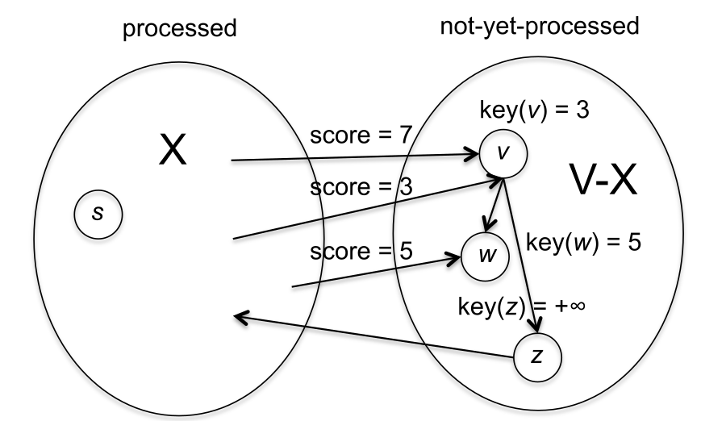{width=75% fig-align="center"}

## Atualização da Fronteira em Dijkstra

> **Mudança da Fronteira**
>
> A cada iteração, um vértice $v$ é movido de $V - X$ para $X$, alterando a **fronteira**:
>
> - Arestas de $X$ para $v$ deixam de cruzar a fronteira.
> - Arestas de $v$ para vértices em $V - X$ passam a cruzar a fronteira.

<br>

> **Consequência**
>
> O **invariante** exige que, para cada $w \in V - X$,
> $$
> \text{key}(w) =
> \min_{(u,w) \in E,\; u \in X}
> \underbrace{\big\{\, \text{dist}(u) + \ell_{uw} \,\big\}}_{\text{\footnotesize score de Dijkstra}}
> $$
> Novas arestas cruzando a fronteira podem reduzir o valor da chave de alguns vértices $w$.

## Atualização da Fronteira em Dijkstra

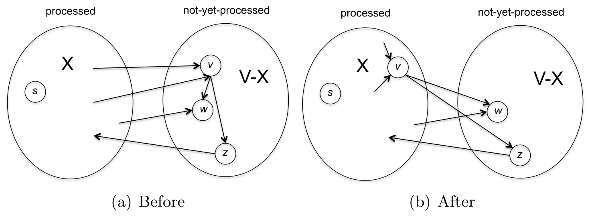{width=100% fig-align="center"}

## Atualização das Chaves no Heap

> **Quando um vértice $w^*$ entra em $X$**
>
> - As novas arestas cruzando a fronteira partem de $w^*$.
> - Basta percorrer a lista de adjacência de $w^*$ e verificar cada aresta $(w^*, y)$.
> - Para cada $y \in V - X$:
> $$
> \text{key}(y) \gets
> \min\{\text{key}(y),\; \text{dist}(w^*) + \ell_{w^*y}\}
> $$

<br>

> **Como diminuir uma chave no heap?**
>
> - Remova o elemento com `Delete`;
> - Atualize seu valor de `key`;
> - Reinsira com `Insert`.

## Algoritmo de Dijkstra com Fila de Prioridade

```pseudocode
#| html-line-number: true
#| html-no-end: true

\begin{algorithmic}
\Procedure{DijkstraHeap}{$G=(V,E), s, \ell$}
  \State \textbf{Entrada:} Grafo dirigido $G = (V, E)$ em representação por listas de adjacência, um vértice $s \in V$, e pesos $\ell_e \geq 0$ para cada $e \in E$
  \State \textbf{Pós-condição:} Para todo vértice $v$, o valor $\text{dist}(v)$ é a distância $d(s, v)$
  \State $X \gets \emptyset$, $H \gets$ heap vazio
  \State $\text{key}(s) \gets 0$
  \For{cada $v \neq s$}
    \State $\text{key}(v) \gets +\infty$
  \EndFor
  \State $\text{Heapify}(V)$
  \While{$H$ não está vazio}
    \State $w^* \gets \text{ExtractMin}(H)$
    \State Adicione $w^*$ a $X$
    \State $\text{dist}(w^*) \gets \text{key}(w^*)$
    \For{cada aresta $(w^*, y)$}
      \State Delete $y$ de $H$
      \State $\text{key}(y) \gets \min\{\text{key}(y), \text{dist}(w^*) + \ell_{w^*y}\}$
      \State Insira $y$ em $H$
    \EndFor
  \EndWhile
  \State \textbf{Retorne} $\text{dist}$
\EndProcedure
\end{algorithmic}
```

## Custo das Operações no Heap

> **Observação Importante**
>
> Quase todo o trabalho na versão com heap do algoritmo de Dijkstra é feito por **operações de heap**. Cada operação custa $\mathcal{O}(\log n)$, onde $n$ é o número de vértices. O heap nunca contém mais do que $n - 1$ elementos.

<br>

- Linhas 6 a 8 executam $n - 1$ vezes (uma por vértice, exceto $s$);
- Linhas 13 a 15 podem ser executadas até $n - 1$ vezes por iteração, uma por aresta de saída de $w^*$;
- Isso parece levar a um total quadrático de operações em grafos densos.

::: {style="text-align:center;"}
*Mas podemos analisar isso de forma mais precisa...*
:::

## Contagem de Operações e Complexidade Final

> **Responsabilidade por Arestas**
>
> Cada aresta $(v, w)$ é processada no máximo uma vez: quando $v$ é extraído do heap e movido de $V - X$ para $X$.
>
> - Linhas 13 a 15 são executadas no máximo uma vez por aresta;
> - Total: $2m$ operações de heap (no máximo).

<br>

> **Complexidade Total**
>
> $$
> \text{Número total de operações de heap: } \mathcal{O}(m + n)
> $$
> $$
> \text{Custo por operação: } \mathcal{O}(\log n)
> $$
> $$
> \Rightarrow \text{Tempo total: } \boxed{\mathcal{O}((m + n)\log n)}
> $$

*Mais rápido que $\mathcal{O}(mn)$ da implementação direta!*

## Análise de Complexidade

{width=75% fig-align="center"}

Python 3.12.3, Ubuntu 24.04.2 LTS, Intel® Core™ i7-4810MQ × 8

# Heaps

## Heaps como Árvores

> **Conceito**
>
> Um **heap** pode ser visto como uma **árvore binária enraizada**, em que cada nó possui 0, 1 ou 2 filhos, e **cada nível é preenchido o máximo possível**.

> **Organização dos Níveis**
>
> - Quando o número de elementos é uma unidade a menos que uma potência de 2, **todos os níveis estão completos**.
> - Caso contrário, apenas o **último nível** pode estar incompleto, preenchido da **esquerda para a direita**.

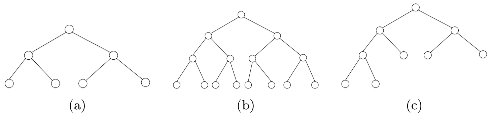{width=85% fig-align="center"}

## Heaps como Árvores

> **A Propriedade dos Heaps**
>
> Para cada objeto $x$, a **chave** de $x$ é menor ou igual às **chaves** dos seus **filhos**.

:::: columns
::: {.column width="50%"}
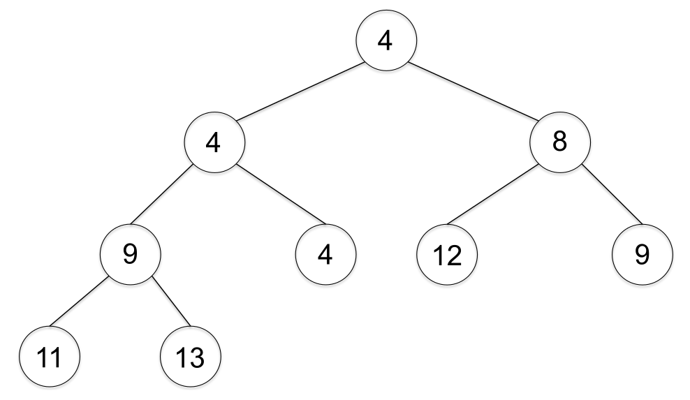{width=90%}
:::
::: {.column width="50%"}
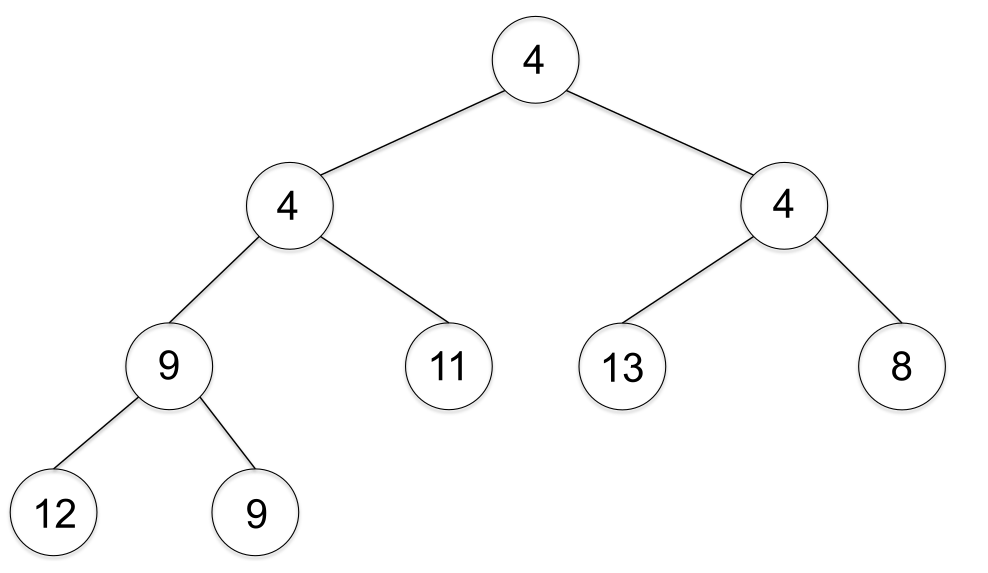{width=90%}
:::
::::

## Heaps como Vetores

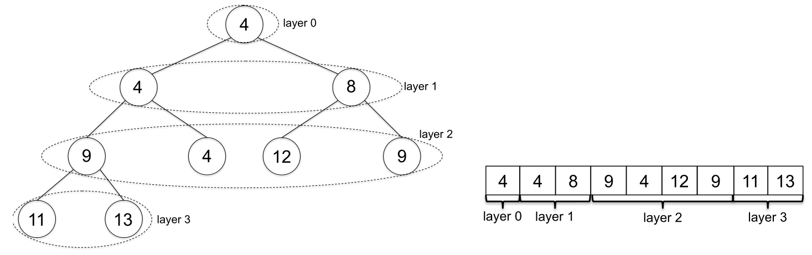{width=100% fig-align="center"}

| **Elemento** | **Posição no Vetor (começando em 1)** |
|:-------------|:--------------------------------------|
| Pai de $i$ | $\lfloor i/2 \rfloor$ (para $i \geq 2$) |
| Filho esquerdo de $i$ | $2i$ (se $2i \leq n$) |
| Filho direito de $i$ | $2i + 1$ (se $2i + 1 \leq n$) |

## Desafio: Manter o Heap Correto e Completo

> **O Desafio**
>
> Ao inserir ou remover um elemento, é preciso:
>
> 1. Manter a **árvore completa** (ou o mais cheia possível);
> 2. Preservar a **propriedade de heap**, corrigindo violações quando surgirem.

<br>

> **Estratégia Geral**
>
> *Mantenha a árvore cheia da forma mais óbvia e depois conserte locais que violam a propriedade de heap.*

## Implementando `Insert`

> **Operação `Insert`**
>
> Dado um heap $H$ e um novo elemento $x$, adicione $x$ a $H$ respeitando essas duas regras.
>
> 1. Adicione o novo objeto ao final do heap e aumente o tamanho do heap.
> 2. Repetidamente troque o novo objeto pelo seu pai até a propriedade de heap ser restaurada.

## `Insert`: Exemplo

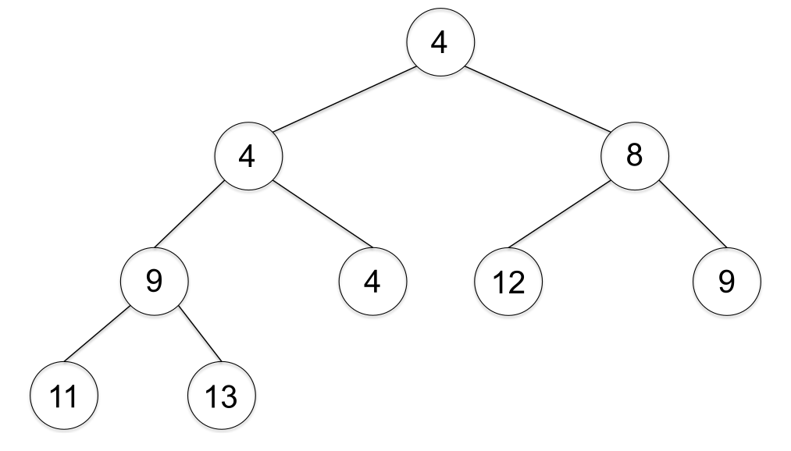{width=100% fig-align="center"}

## `Insert`: Exemplo

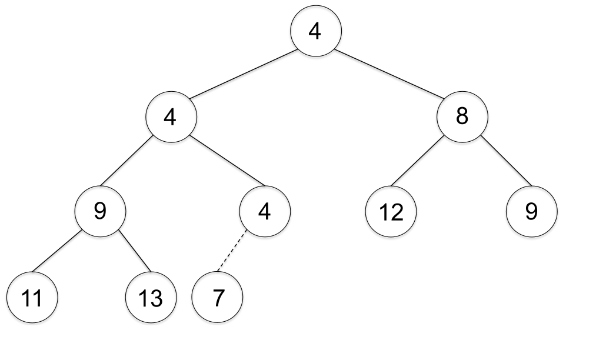{width=100% fig-align="center"}

## `Insert`: Exemplo

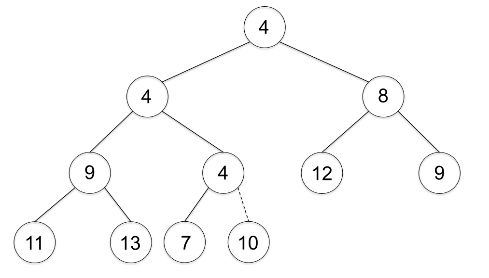{width=100% fig-align="center"}

## `Insert`: Exemplo

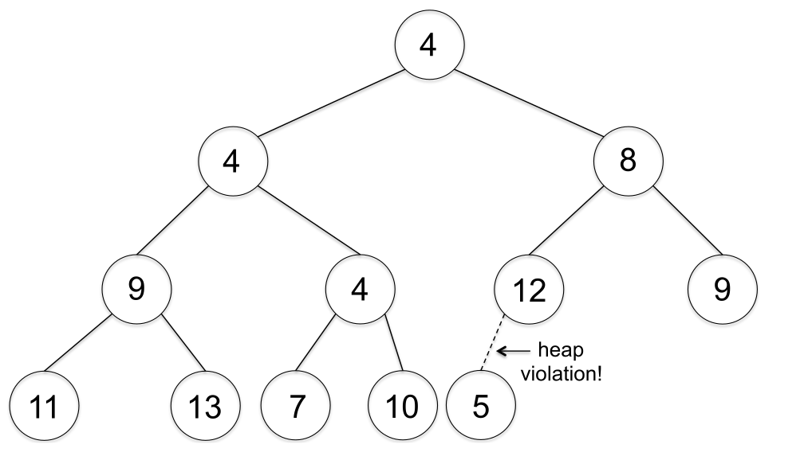{width=100% fig-align="center"}

## `Insert`: Exemplo

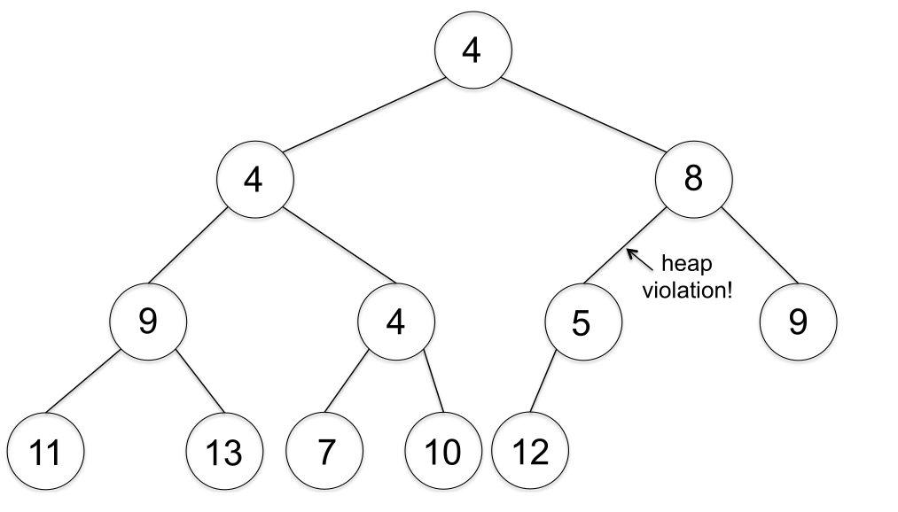{width=100% fig-align="center"}

## `Insert`: Exemplo

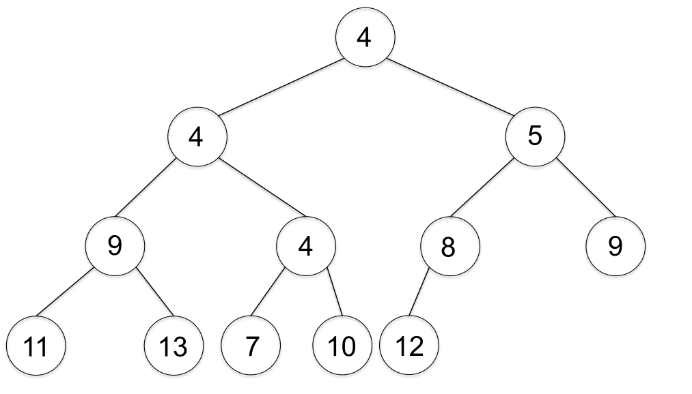{width=100% fig-align="center"}

## Operações `Insert` e `SiftUp` em um Heap

```pseudocode
#| html-line-number: true
#| html-no-end: true

\begin{algorithmic}
\Procedure{Insert}{$H, x$}
  \State \textbf{Entrada:} Heap $H$ e novo elemento $x$
  \State \textbf{Saída:} Heap $H$ com $x$ inserido, mantendo a propriedade de heap
  \State Adicione $x$ ao final do vetor que representa $H$
  \State $\texttt{i} \gets$ posição de $x$
  \State \texttt{SiftUp}($H, i$)
\EndProcedure
\end{algorithmic}
```

```pseudocode
#| html-line-number: true
#| html-no-end: true

\begin{algorithmic}
\Procedure{SiftUp}{$H, i$}
  \State \textbf{Entrada:} Heap $H$ e posição $i$ de um elemento potencialmente fora de lugar
  \While{$i > 1$ e $H[i] < H[\lfloor i/2 \rfloor]$}
    \State Troque $H[i]$ e $H[\lfloor i/2 \rfloor]$
    \State $i \gets \lfloor i/2 \rfloor$
  \EndWhile
\EndProcedure
\end{algorithmic}
```

*Cada troca reduz o índice pela metade, garantindo tempo total* $\mathcal{O}(\log n)$.

*Cada troca pode empurrar a violação da propriedade de heap para cima. Por que não para baixo?*

## Implementando `ExtractMin`

> **Operação `ExtractMin`**
>
> Dado um heap $H$, remova e devolva de $H$ um objeto com a menor **chave**.

> **O Mínimo**
>
> A raiz de um heap é sempre o elemento mínimo. Ao removê-la, precisamos **restaurar as propriedades**:
>
> - A árvore deve continuar **binária completa**;
> - A **propriedade de heap** deve ser mantida.

> **Estratégia**
>
> Assim como na operação `Insert`, seguimos o método mais direto:
>
> - Pegamos o **último nó** da árvore;
> - Colocamos seu valor na **posição da raiz** (substituindo o antigo mínimo);
> - Em seguida, corrigimos possíveis violações da propriedade de heap.

## `ExtractMin`: Exemplo

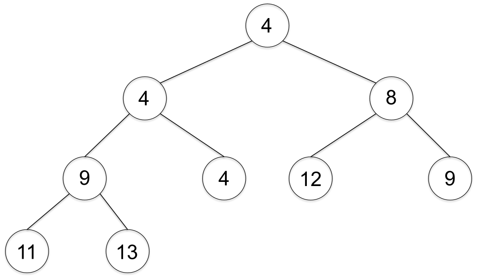{width=100% fig-align="center"}

## `ExtractMin`: Exemplo

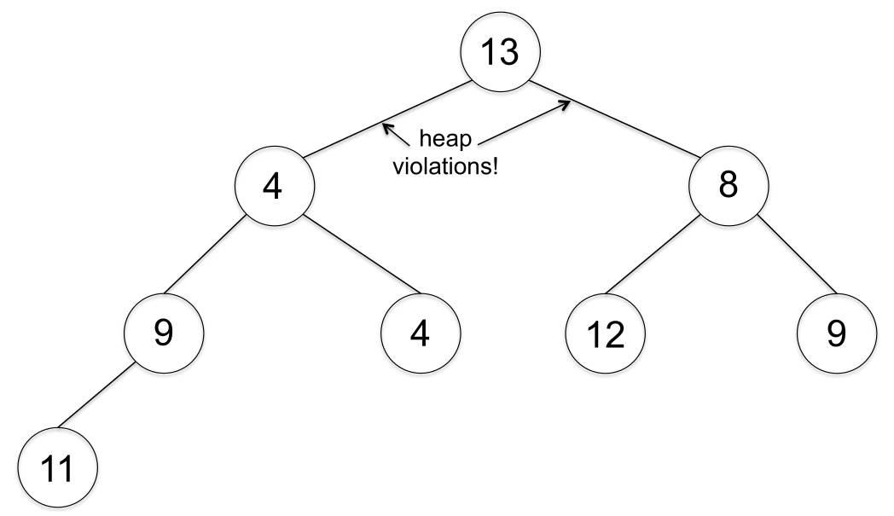{width=100% fig-align="center"}

Duas violações. Qual escolher? [Sempre trocar com o menor valor!]{.fragment}

## `ExtractMin`: Exemplo

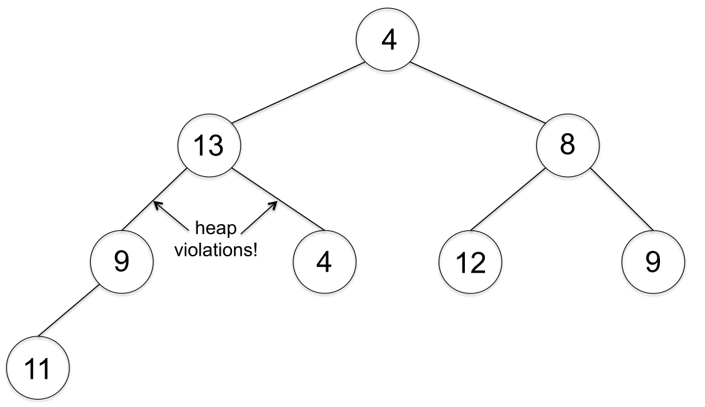{width=100% fig-align="center"}

## `ExtractMin`: Exemplo

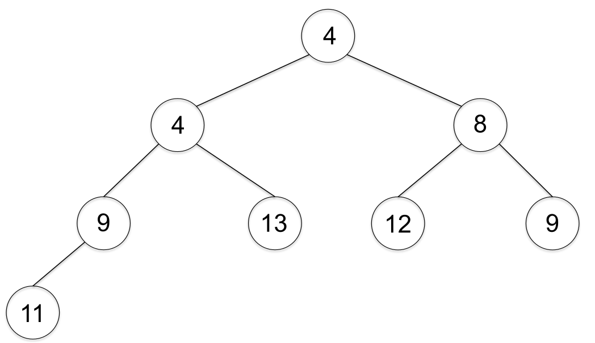{width=100% fig-align="center"}

## Operações `ExtractMin` e `SiftDown` em um Heap

```pseudocode
#| html-line-number: true
#| html-no-end: true

\begin{algorithmic}
\Procedure{ExtractMin}{$H$}
  \State \textbf{Entrada:} Heap $H$
  \State \textbf{Saída:} Elemento mínimo removido e heap atualizado
  \State $min \gets H[1]$ \Comment{a raiz contém o menor elemento}
  \State $H[1] \gets H[\text{tamanho}(H)]$
  \State Remova o último elemento do vetor de $H$
  \State \texttt{SiftDown}($H, 1$)
  \State \textbf{retorne} $min$
\EndProcedure
\end{algorithmic}
```

## Operações `ExtractMin` e `SiftDown` em um Heap

`SiftDown` — min-heap, índices a partir de 1:

```pseudocode
#| html-line-number: true
#| html-no-end: true

\begin{algorithmic}
\Procedure{SiftDown}{$H, i$}
  \State $n \gets \text{tamanho}(H)$
  \While{$2i \le n$}
    \State $m \gets 2i$ \Comment{filho esquerdo}
    \If{$m+1 \le n$ \textbf{e} $H[m+1] < H[m]$}
      \State $m \gets m+1$ \Comment{escolhe o menor filho}
    \EndIf
    \If{$H[i] \le H[m]$}
      \State \textbf{break}
    \EndIf
    \State Troque $H[i]$ e $H[m]$
    \State $i \gets m$
  \EndWhile
\EndProcedure
\end{algorithmic}
```

::: {.small}
*Cada troca reduz o nível da árvore, garantindo tempo total* $\mathcal{O}(\log n)$.

*Durante o `SiftDown`, no máximo dois pares pai–filho violam a propriedade de heap; cada troca empurra o nó uma camada para baixo até que ele alcance o último nível (ou antes), e os demais pares permanecem válidos, garantindo término e corretude.*
:::

# HeapSort

## Ordenando Vetores com Heaps

```pseudocode
#| html-line-number: true
#| html-no-end: true

\begin{algorithmic}
\Procedure{SelectionSort}{$A$}
  \State $n \gets \text{length}(A)$
  \For{$i \gets 1$ \textbf{to} $n$}
    \State $m \gets i$
    \For{$j \gets i$ \textbf{to} $n$}
      \If{$A[j] < A[m]$}
        \State $m \gets j$
      \EndIf
    \EndFor
    \State \Call{Swap}{$A, i, m$}
  \EndFor
\EndProcedure
\end{algorithmic}
```

```pseudocode
#| html-line-number: true
#| html-no-end: true

\begin{algorithmic}
\Procedure{Swap}{$A, x, y$}
  \State $tmp \gets A[x]$
  \State $A[x] \gets A[y]$
  \State $A[y] \gets tmp$
\EndProcedure
\end{algorithmic}
```

Tempo: $\Theta(n^2)$

## Ordenando Vetores com Heaps

```pseudocode
#| html-line-number: true
#| html-no-end: true

\begin{algorithmic}
\Procedure{HeapSort}{$A$}
  \State \textbf{Entrada:} Vetor $A$ com $n$ inteiros distintos
  \State \textbf{Saída:} Vetor $B$ com os mesmos inteiros, ordenados em ordem crescente
  \State $H \gets$ heap vazio
  \For{$i \gets 1$ \textbf{to} $n$}
    \State \texttt{Insert} $A[i]$ em $H$
  \EndFor
  \For{$i \gets 1$ \textbf{to} $n$}
    \State $B[i] \gets$ \texttt{ExtractMin} de $H$
  \EndFor
\EndProcedure
\end{algorithmic}
```

> **Complexidade**
>
> O trabalho do **HeapSort** se resume a $2n$ operações sobre um heap de no máximo $n$ elementos. Cada operação custa $\mathcal{O}(\log n)$, resultando em tempo total $\mathcal{O}(n \log n)$. Além disso, o vetor $B$ não seria necessário e as linhas 4 a 5 poderiam ser substituídas por `Heapify`.

## Desafio: Entendendo o Heapify

> **O que o HeapSort faz?**
>
> O HeapSort ordena um vetor inserindo seus elementos em um *heap* e removendo-os em ordem crescente.

> **Lembrando...**
>
> - **Heapify** transforma um vetor qualquer (não ordenado) em um heap válido.
> - Cada operação de heap (`Insert`, `ExtractMin`) custa $\mathcal{O}(\log n)$.
> - O **HeapSort** completo tem complexidade $\mathcal{O}(n \log n)$.

> [**Desafio**]{.label-prf}
>
> Se o **HeapSort** é $\mathcal{O}(n \log n)$, como o **Heapify** pode ser $\mathcal{O}(n)$?

# Mais

## Além de Dijkstra

{width=90% fig-align="center"}

::: {.small}
6 de agosto de 2025: <https://www.quantamagazine.org/new-method-is-the-fastest-way-to-find-the-best-routes-20250806/>
:::

## Além de Dijkstra

{width=90% fig-align="center"}

::: {.small}
<https://arxiv.org/pdf/2504.17033>
:::

#

::: {style="text-align: center; margin-top: 15vh;"}
[?]{style="font-size: 5em; color: #d10000; font-weight: 700;"}
:::
