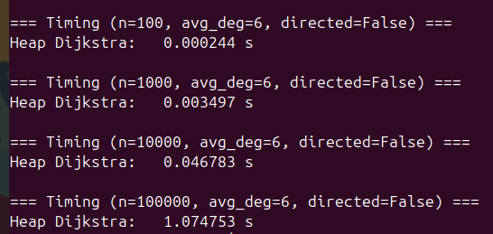
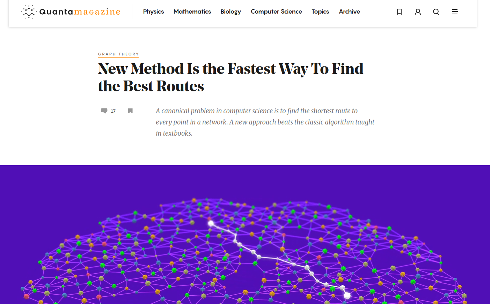
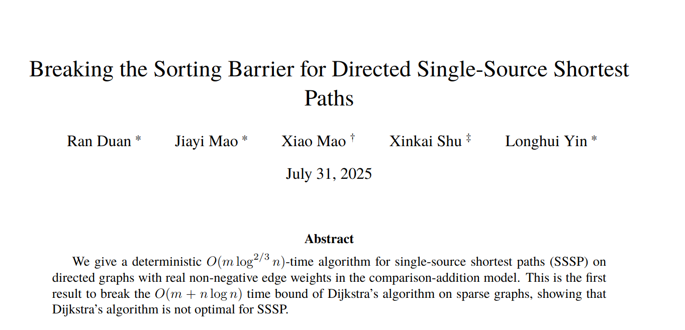

# Melhorando o Algoritmo de Dijkstra

## Dijkstra

What is the shortest way to travel from Rotterdam to Groningen, in general: from given city to given city. It is the algorithm for the shortest path, which I designed in about twenty minutes. One morning I was shopping in Amsterdam with my young fiancée, and tired, we sat down on the café terrace to drink a cup of coffee and I was just thinking about whether I could do this, and I then designed the algorithm for the shortest path. As I said, it was a twenty-minute invention. In fact, it was published in '59, three years later. The publication is still readable, it is, in fact, quite nice. One of the reasons that it is so nice was that I designed it without pencil and paper. I learned later that one of the advantages of designing without pencil and paper is that you are almost forced to avoid all avoidable complexities. Eventually, that algorithm became to my great amazement, one of the cornerstones of my fame.

— Edsger Dijkstra, in an interview with Philip L. Frana, Communications of the ACM, 2001[5]

[https://en.wikipedia.org/wiki/Dijkstra%27s_algorithm](https://en.wikipedia.org/wiki/Dijkstra%27s_algorithm)

## Escolhendo a Estrutura de Dados Certa

- O objetivo de uma estrutura de dados é **organizar a informação** para que o acesso e a manipulação sejam **eficientes**.

. . .

> **Exemplos**
>
> - **Fila (Queue)**: usada na **Busca em Largura (BFS)** <br>
>   Organiza os elementos em ordem sequencial, onde inserir no final e remover no início custam $\mathcal{O}(1)$.
>
> - **Pilha (Stack)**: usada na **Busca em Profundidade (DFS)** <br>
>   Permite inserir e remover do topo em tempo constante $\mathcal{O}(1)$.

. . .

> A escolha da estrutura certa é metade do caminho para um bom algoritmo.

## Escolhendo a Estrutura de Dados Certa

<br><br>

::: {style="text-align:center;"}
> [**Princípio da Parcimônia**]{style="font-size:1.2em"}
>
> Escolha a estrutura de dados mais simples que suporte todas as operações necessárias da sua aplicação.
:::

## Visualização do Algoritmo de Dijkstra

```{=html}
<iframe id="dijkstra-viz" src="https://lucasalegre.github.io/dijkstra-visualizer/" title="Visualização do algoritmo de Dijkstra" style="display:block; width:100%; height:595px; border:1px solid #dde3e7; border-radius:8px;" allow="fullscreen" allowfullscreen></iframe>
<div style="display:flex; justify-content:space-between; align-items:center; margin-top:0.35em; font-size:0.6em;">
  <a href="https://lucasalegre.github.io/dijkstra-visualizer/" target="_blank" data-preview-link="false">lucasalegre.github.io/dijkstra-visualizer</a>
  <button type="button" onclick="const f = document.getElementById('dijkstra-viz'); (f.requestFullscreen || f.webkitRequestFullscreen).call(f);" style="font: inherit; padding: 0.25em 0.8em; border: 1px solid #2e75b6; border-radius: 6px; background: #2e75b6; color: #fff; cursor: pointer;">⛶ Tela cheia</button>
</div>
```

## Análise do Algoritmo de Dijkstra

```pseudocode
#| html-line-number: true
#| html-no-end: true

\begin{algorithmic}
\Procedure{Dijkstra}{$G=(V,E,w), s$}
  \State \textbf{Entrada:} Um grafo com pesos não-negativos $(V, E, w)$ e um nodo $s \in V$
  \State \textbf{Saída:} Uma tabela $\text{dist}$ associando cada $v \in V$ à sua distância $d(s,v)$
  \State // Inicialização
  \State $X \gets \{s\}$
  \State $\text{dist}(s) \gets 0$
  \State $\text{dist}(v) \gets +\infty$ para todo $v \neq s$
  \State // Laço principal
  \While{existe uma aresta $(v, w)$ tal que $v \in X$ e $w \notin X$}
    \State $(v^*, w^*) \gets$ tal aresta que minimiza $\text{dist}(v) + \ell_{vw}$
    \State Adicione $w^*$ a $X$
    \State $\text{dist}(w^*) \gets \text{dist}(v^*) + \ell_{v^*w^*}$
  \EndWhile
  \State \textbf{Retorne} $\text{dist}$
\EndProcedure
\end{algorithmic}
```

[**P.**]{.label-qstn} Qual o tempo de execução? 

. . .  

$\mathcal{O}(mn)$.

## Otimizando o Algoritmo de Dijkstra

::: {.incremental .timeline}
- **1959:** Dijkstra publica o algoritmo em um artigo de três páginas (*A note on two problems in connexion with graphs*). A versão original faz uma busca linear pelo próximo vértice, sem heap: $\mathcal{O}(n^2)$.
- **1964:** J. W. J. Williams introduz o **heap binário**, junto com o **HeapSort**.
- **Anos 1970:** heaps passam a ser usados como fila de prioridade no Dijkstra (incluindo os *d-heaps* de Donald Johnson, 1977), reduzindo o tempo para $\mathcal{O}(m \log n)$.
:::

<style>
.reveal .timeline li + li { margin-top: 2em; }
</style>

## Heaps e Fila de Prioridade

[P.]{.label-qstn} Quais as operações que precisamos?

. . .

| **Operação** | **Tempo de Execução** |
|:-------------|:---------------------:|
| Inserir (`Insert`) | $\mathcal{O}(\log n)$ |
| Extrair Mínimo (`ExtractMin`) | $\mathcal{O}(\log n)$ |
| Encontrar Mínimo (`FindMin`) | $\mathcal{O}(1)$ |
| Heapificar (`Heapify`) | $\mathcal{O}(n)$ |
| Remover (`Delete`) | $\mathcal{O}(\log n)$ |

<br>

- A versão de **Dijkstra** que veremos usa apenas **`Insert`** e **`ExtractMin`**.

::: {.small}
> Também é possível implementar um heap para encontrar o **maior valor** de forma análoga.
:::

## O que Armazenar no Heap?

> **Ideia Intuitiva**
>
> Uma primeira ideia seria armazenar as **arestas** do grafo no heap, substituindo as buscas de mínimo por chamadas a `ExtractMin`. Essa abordagem funciona, mas há uma versão mais **simples e eficiente**: armazenar os **vértices**.

:::{.incremental .timeline}
- Embora o *score* de Dijkstra seja definido para arestas, o que realmente nos importa é **qual vértice será processado em seguida**.
- O heap guarda **pares** $(d, v)$: o vértice $v$ com a distância $d$ conhecida até ele, usada como **chave**.
- O heap começa **apenas com** $(0, s)$. Um vértice só entra no heap quando é **alcançado** por uma aresta saindo de um vértice processado.
- Um mesmo vértice pode aparecer **mais de uma vez** no heap, com distâncias diferentes. Só a menor importa.
:::

## Invariante Mantido pelo Heap

> **Invariante**
>
> Para $w \in V - X$, $\text{dist}(w)$ é uma **estimativa**: o menor *score de Dijkstra* de uma aresta com início $v \in X$ e fim $w$, ou $+\infty$ se nenhuma aresta assim existir.
> $$
> \text{dist}(w) =
> \min_{(v, w) \in E,\; v \in X}
> \underbrace{\big\{\, \text{dist}(v) + \ell_{vw} \,\big\}}_{\text{score de Dijkstra}}
> $$
> Para $v \in X$, $\text{dist}(v)$ já é a distância final $d(s, v)$, computada em uma iteração anterior.

> **Conteúdo do Heap**
>
> - Se $\text{dist}(w) < +\infty$, o heap contém o par $(\text{dist}(w), w)$.
> - O heap também pode conter **pares obsoletos** $(d, w)$: com $w \in X$, ou com $d > \text{dist}(w)$.

::: {style="text-align:center;"}
*Pares obsoletos de $w \in V - X$ têm $d > \text{dist}(w)$ e não saem antes do par válido de $w$.*

*Logo, o primeiro par válido extraído é o vértice de $V - X$ com menor $\text{dist}$.*
:::

## Invariante Mantido pelo Heap

```{=html}
<svg viewBox="0 0 720 420" style="display:block; margin:0 auto; width:26em; max-width:100%; height:auto;" xmlns="http://www.w3.org/2000/svg" role="img" aria-label="Invariante: arestas de X para V − X com scores 7 e 3 chegando em u e score 5 chegando em w; dist(u) = 3, dist(w) = 5 e dist(z) = +∞, pois nenhuma aresta de X chega em z">
<defs><marker id="inv-g" viewBox="0 0 10 10" refX="10" refY="5" markerWidth="14" markerHeight="14" markerUnits="userSpaceOnUse" orient="auto"><path d="M0,0 L10,5 L0,10 z" fill="#9aa5ad"/></marker><marker id="inv-o" viewBox="0 0 10 10" refX="10" refY="5" markerWidth="14" markerHeight="14" markerUnits="userSpaceOnUse" orient="auto"><path d="M0,0 L10,5 L0,10 z" fill="#eb811b"/></marker></defs>
<ellipse cx="165" cy="235" rx="150" ry="160" fill="#e3eef8" stroke="#2e75b6" stroke-width="2.5"/>
<ellipse cx="520" cy="235" rx="180" ry="160" fill="#f5f7f9" stroke="#9aa5ad" stroke-width="2.5"/>
<text x="165" y="44" font-size="21" text-anchor="middle" fill="#1f5a8f" font-weight="600">processados</text>
<text x="520" y="44" font-size="21" text-anchor="middle" fill="#23373b" font-weight="600">ainda não processados</text>
<text x="75" y="140" font-size="40" text-anchor="middle" fill="#2e75b6" font-family="KaTeX_Math, 'Times New Roman', serif" font-style="italic">X</text>
<text x="635" y="180" font-size="34" text-anchor="middle" fill="#23373b" font-family="KaTeX_Math, 'Times New Roman', serif"><tspan font-style="italic">V</tspan> − <tspan font-style="italic">X</tspan></text>
<line x1="190" y1="110.6" x2="402" y2="119.3" stroke="#eb811b" stroke-width="4" marker-end="url(#inv-o)"/>
<line x1="218.1" y1="232.7" x2="404.3" y2="128.8" stroke="#eb811b" stroke-width="4" marker-end="url(#inv-o)"/>
<line x1="219.5" y1="316.1" x2="522.6" y2="234.7" stroke="#eb811b" stroke-width="4" marker-end="url(#inv-o)"/>
<line x1="433.3" y1="132.2" x2="526.7" y2="217.8" stroke="#9aa5ad" stroke-width="2.5" marker-end="url(#inv-g)"/>
<line x1="423.2" y1="137.7" x2="456.8" y2="322.3" stroke="#9aa5ad" stroke-width="2.5" marker-end="url(#inv-g)"/>
<line x1="442" y1="341.2" x2="150" y2="360" stroke="#9aa5ad" stroke-width="2.5" stroke-dasharray="7 5" marker-end="url(#inv-g)"/>
<path d="M328,70 C303,160 353,310 328,400" fill="none" stroke="#b31313" stroke-width="3" stroke-dasharray="11 8"/>
<rect x="218" y="99.9" width="104" height="28" rx="14" fill="#ffffff" stroke="#eb811b" stroke-width="2"/>
<text x="270" y="113.9" font-size="18" text-anchor="middle" dominant-baseline="central" fill="#d9690b" font-weight="600">score = 7</text>
<rect x="218" y="189.7" width="104" height="28" rx="14" fill="#ffffff" stroke="#eb811b" stroke-width="2"/>
<text x="270" y="203.7" font-size="18" text-anchor="middle" dominant-baseline="central" fill="#d9690b" font-weight="600">score = 3</text>
<rect x="218" y="288.5" width="104" height="28" rx="14" fill="#ffffff" stroke="#eb811b" stroke-width="2"/>
<text x="270" y="302.5" font-size="18" text-anchor="middle" dominant-baseline="central" fill="#d9690b" font-weight="600">score = 5</text>
<circle cx="70" cy="245" r="21" fill="#2e75b6" stroke="#1f5a8f" stroke-width="2"/>
<text x="70" y="245" font-size="22" text-anchor="middle" dominant-baseline="central" fill="#ffffff" font-family="KaTeX_Math, 'Times New Roman', serif" font-style="italic">s</text>
<circle cx="175" cy="110" r="15" fill="#2e75b6" stroke="#1f5a8f" stroke-width="2"/>
<circle cx="205" cy="240" r="15" fill="#2e75b6" stroke="#1f5a8f" stroke-width="2"/>
<circle cx="205" cy="320" r="15" fill="#2e75b6" stroke="#1f5a8f" stroke-width="2"/>
<circle cx="420" cy="120" r="18" fill="#ffffff" stroke="#23373b" stroke-width="2.5"/>
<text x="420" y="120" font-size="22" text-anchor="middle" dominant-baseline="central" fill="#23373b" font-family="KaTeX_Math, 'Times New Roman', serif" font-style="italic">u</text>
<circle cx="540" cy="230" r="18" fill="#ffffff" stroke="#23373b" stroke-width="2.5"/>
<text x="540" y="230" font-size="22" text-anchor="middle" dominant-baseline="central" fill="#23373b" font-family="KaTeX_Math, 'Times New Roman', serif" font-style="italic">w</text>
<circle cx="460" cy="340" r="18" fill="#ffffff" stroke="#23373b" stroke-width="2.5"/>
<text x="460" y="340" font-size="22" text-anchor="middle" dominant-baseline="central" fill="#23373b" font-family="KaTeX_Math, 'Times New Roman', serif" font-style="italic">z</text>
<text x="448" y="112" font-size="20" fill="#23373b" stroke="#f5f7f9" stroke-width="5" paint-order="stroke">dist(<tspan font-family="KaTeX_Math, 'Times New Roman', serif" font-style="italic">u</tspan>) = 3</text>
<text x="568" y="236" font-size="20" fill="#23373b" stroke="#f5f7f9" stroke-width="5" paint-order="stroke">dist(<tspan font-family="KaTeX_Math, 'Times New Roman', serif" font-style="italic">w</tspan>) = 5</text>
<text x="488" y="346" font-size="20" fill="#23373b" stroke="#f5f7f9" stroke-width="5" paint-order="stroke">dist(<tspan font-family="KaTeX_Math, 'Times New Roman', serif" font-style="italic">z</tspan>) = +∞</text>
</svg>
```

Um heap possível: $H = \{(3, u),\ (5, w),\ \textcolor{#9aa5ad}{(7, u)}\}$. O par $(7, u)$ é **obsoleto** se foi inserido antes de descobrirmos o score $3$. Como $\text{dist}(z) = +\infty$, $z$ ainda não está no heap.

## Atualização da Fronteira em Dijkstra

> **Mudança da Fronteira**
>
> A cada iteração, um vértice $u$ é movido de $V - X$ para $X$, alterando a **fronteira**:
>
> - Arestas de $X$ para $u$ deixam de cruzar a fronteira.
> - Arestas de $u$ para vértices em $V - X$ passam a cruzar a fronteira.

<br>

> **Consequência**
>
> O **invariante** exige que, para cada $w \in V - X$,
> $$
> \text{dist}(w) =
> \min_{(v,w) \in E,\; v \in X}
> \underbrace{\big\{\, \text{dist}(v) + \ell_{vw} \,\big\}}_{\text{\footnotesize score de Dijkstra}}
> $$
> As novas arestas que cruzam a fronteira (saindo de $u$) podem **reduzir** $\text{dist}(w)$ de alguns vértices $w$.

## Atualização da Fronteira em Dijkstra

```{=html}
<svg viewBox="0 0 1460 530" style="display:block; margin:0 auto; width:100%; max-width:100%; height:auto;" xmlns="http://www.w3.org/2000/svg" role="img" aria-label="Fronteira antes e depois de mover u de V − X para X: as arestas de X para u deixam de cruzar a fronteira e as arestas de u para w e z passam a cruzá-la">
<defs><marker id="cb-g" viewBox="0 0 10 10" refX="10" refY="5" markerWidth="14" markerHeight="14" markerUnits="userSpaceOnUse" orient="auto"><path d="M0,0 L10,5 L0,10 z" fill="#9aa5ad"/></marker><marker id="cb-o" viewBox="0 0 10 10" refX="10" refY="5" markerWidth="14" markerHeight="14" markerUnits="userSpaceOnUse" orient="auto"><path d="M0,0 L10,5 L0,10 z" fill="#eb811b"/></marker></defs>
<ellipse cx="165" cy="235" rx="150" ry="160" fill="#e3eef8" stroke="#2e75b6" stroke-width="2.5"/>
<ellipse cx="520" cy="235" rx="180" ry="160" fill="#f5f7f9" stroke="#9aa5ad" stroke-width="2.5"/>
<text x="165" y="44" font-size="25.2" text-anchor="middle" fill="#1f5a8f" font-weight="600">processados</text>
<text x="520" y="44" font-size="25.2" text-anchor="middle" fill="#23373b" font-weight="600">ainda não processados</text>
<text x="75" y="140" font-size="40" text-anchor="middle" fill="#2e75b6" font-family="KaTeX_Math, 'Times New Roman', serif" font-style="italic">X</text>
<text x="635" y="180" font-size="34" text-anchor="middle" fill="#23373b" font-family="KaTeX_Math, 'Times New Roman', serif"><tspan font-style="italic">V</tspan> − <tspan font-style="italic">X</tspan></text>
<line x1="190" y1="110.6" x2="402" y2="119.3" stroke="#eb811b" stroke-width="4" marker-end="url(#cb-o)"/>
<line x1="218.1" y1="232.7" x2="404.3" y2="128.8" stroke="#eb811b" stroke-width="4" marker-end="url(#cb-o)"/>
<line x1="219.5" y1="316.1" x2="522.6" y2="234.7" stroke="#eb811b" stroke-width="4" marker-end="url(#cb-o)"/>
<line x1="433.3" y1="132.2" x2="526.7" y2="217.8" stroke="#9aa5ad" stroke-width="2.5" marker-end="url(#cb-g)"/>
<line x1="423.2" y1="137.7" x2="456.8" y2="322.3" stroke="#9aa5ad" stroke-width="2.5" marker-end="url(#cb-g)"/>
<line x1="442" y1="341.2" x2="150" y2="360" stroke="#9aa5ad" stroke-width="2.5" stroke-dasharray="7 5" marker-end="url(#cb-g)"/>
<path d="M328,70 C303,160 353,310 328,400" fill="none" stroke="#b31313" stroke-width="3" stroke-dasharray="11 8"/>
<circle cx="70" cy="245" r="21" fill="#2e75b6" stroke="#1f5a8f" stroke-width="2"/>
<text x="70" y="245" font-size="22" text-anchor="middle" dominant-baseline="central" fill="#ffffff" font-family="KaTeX_Math, 'Times New Roman', serif" font-style="italic">s</text>
<circle cx="175" cy="110" r="15" fill="#2e75b6" stroke="#1f5a8f" stroke-width="2"/>
<circle cx="205" cy="240" r="15" fill="#2e75b6" stroke="#1f5a8f" stroke-width="2"/>
<circle cx="205" cy="320" r="15" fill="#2e75b6" stroke="#1f5a8f" stroke-width="2"/>
<circle cx="420" cy="120" r="18" fill="#ffffff" stroke="#23373b" stroke-width="2.5"/>
<text x="420" y="120" font-size="22" text-anchor="middle" dominant-baseline="central" fill="#23373b" font-family="KaTeX_Math, 'Times New Roman', serif" font-style="italic">u</text>
<circle cx="540" cy="230" r="18" fill="#ffffff" stroke="#23373b" stroke-width="2.5"/>
<text x="540" y="230" font-size="22" text-anchor="middle" dominant-baseline="central" fill="#23373b" font-family="KaTeX_Math, 'Times New Roman', serif" font-style="italic">w</text>
<circle cx="460" cy="340" r="18" fill="#ffffff" stroke="#23373b" stroke-width="2.5"/>
<text x="460" y="340" font-size="22" text-anchor="middle" dominant-baseline="central" fill="#23373b" font-family="KaTeX_Math, 'Times New Roman', serif" font-style="italic">z</text>
<text x="360" y="445" font-size="28.8" text-anchor="middle" fill="#23373b" font-family="KaTeX_Main, 'Times New Roman', serif">(a) Antes</text>
<ellipse cx="905" cy="235" rx="150" ry="160" fill="#e3eef8" stroke="#2e75b6" stroke-width="2.5"/>
<ellipse cx="1260" cy="235" rx="180" ry="160" fill="#f5f7f9" stroke="#9aa5ad" stroke-width="2.5"/>
<text x="905" y="44" font-size="25.2" text-anchor="middle" fill="#1f5a8f" font-weight="600">processados</text>
<text x="1260" y="44" font-size="25.2" text-anchor="middle" fill="#23373b" font-weight="600">ainda não processados</text>
<text x="815" y="140" font-size="40" text-anchor="middle" fill="#2e75b6" font-family="KaTeX_Math, 'Times New Roman', serif" font-style="italic">X</text>
<text x="1375" y="180" font-size="34" text-anchor="middle" fill="#23373b" font-family="KaTeX_Math, 'Times New Roman', serif"><tspan font-style="italic">V</tspan> − <tspan font-style="italic">X</tspan></text>
<line x1="927.5" y1="118.3" x2="975" y2="150" stroke="#9aa5ad" stroke-width="2.5" marker-end="url(#cb-g)"/>
<line x1="952.4" y1="226.9" x2="981.2" y2="175.7" stroke="#9aa5ad" stroke-width="2.5" marker-end="url(#cb-g)"/>
<line x1="1007.5" y1="164.2" x2="1262.5" y2="225.8" stroke="#eb811b" stroke-width="4" marker-end="url(#cb-o)"/>
<line x1="1003.7" y1="171.7" x2="1186.3" y2="328.3" stroke="#eb811b" stroke-width="4" marker-end="url(#cb-o)"/>
<line x1="959.5" y1="316.1" x2="1262.6" y2="234.7" stroke="#eb811b" stroke-width="4" marker-end="url(#cb-o)"/>
<line x1="1182" y1="341.2" x2="890" y2="360" stroke="#9aa5ad" stroke-width="2.5" stroke-dasharray="7 5" marker-end="url(#cb-g)"/>
<path d="M1068,70 C1043,160 1093,310 1068,400" fill="none" stroke="#b31313" stroke-width="3" stroke-dasharray="11 8"/>
<circle cx="810" cy="245" r="21" fill="#2e75b6" stroke="#1f5a8f" stroke-width="2"/>
<text x="810" y="245" font-size="22" text-anchor="middle" dominant-baseline="central" fill="#ffffff" font-family="KaTeX_Math, 'Times New Roman', serif" font-style="italic">s</text>
<circle cx="915" cy="110" r="15" fill="#2e75b6" stroke="#1f5a8f" stroke-width="2"/>
<circle cx="945" cy="240" r="15" fill="#2e75b6" stroke="#1f5a8f" stroke-width="2"/>
<circle cx="945" cy="320" r="15" fill="#2e75b6" stroke="#1f5a8f" stroke-width="2"/>
<circle cx="990" cy="160" r="23" fill="none" stroke="#3a7a10" stroke-width="4"/>
<circle cx="990" cy="160" r="18" fill="#2e75b6" stroke="#1f5a8f" stroke-width="2.5"/>
<text x="990" y="160" font-size="22" text-anchor="middle" dominant-baseline="central" fill="#ffffff" font-family="KaTeX_Math, 'Times New Roman', serif" font-style="italic">u</text>
<circle cx="1280" cy="230" r="18" fill="#ffffff" stroke="#23373b" stroke-width="2.5"/>
<text x="1280" y="230" font-size="22" text-anchor="middle" dominant-baseline="central" fill="#23373b" font-family="KaTeX_Math, 'Times New Roman', serif" font-style="italic">w</text>
<circle cx="1200" cy="340" r="18" fill="#ffffff" stroke="#23373b" stroke-width="2.5"/>
<text x="1200" y="340" font-size="22" text-anchor="middle" dominant-baseline="central" fill="#23373b" font-family="KaTeX_Math, 'Times New Roman', serif" font-style="italic">z</text>
<text x="1100" y="445" font-size="28.8" text-anchor="middle" fill="#23373b" font-family="KaTeX_Main, 'Times New Roman', serif">(b) Depois</text>
<line x1="380" y1="505" x2="420" y2="505" stroke="#eb811b" stroke-width="4"/>
<text x="432" y="513" font-size="25" fill="#d9690b" font-weight="600">cruzam a fronteira</text>
<circle cx="790" cy="505" r="12" fill="none" stroke="#3a7a10" stroke-width="4"/>
<text x="814" y="513" font-size="25" fill="#3a7a10" font-weight="600">vértice <tspan font-family="KaTeX_Math, 'Times New Roman', serif" font-style="italic" font-weight="normal">u</tspan> movido para <tspan font-family="KaTeX_Math, 'Times New Roman', serif" font-style="italic" font-weight="normal">X</tspan></text>
</svg>
```

## Atualização das Distâncias no Heap

> **Quando um vértice $u$ entra em $X$**
>
> - As novas arestas cruzando a fronteira partem de $u$.
> - Basta percorrer a lista de adjacência de $u$ e, para cada aresta $(u, v)$:
> $$
> \text{se } \text{dist}(u) + \ell_{uv} < \text{dist}(v): \quad \text{dist}(v) \gets \text{dist}(u) + \ell_{uv}
> $$
> - Se $v \in X$, o teste sempre falha: $\text{dist}(v)$ já é a menor distância possível.

> **Como diminuir a distância de $v$ no heap?**
>
> - Remover o par antigo com `Delete` exige saber **onde** $v$ está no vetor do heap (um mapa auxiliar vértice → posição).
> - **Mais simples:** apenas **insira** o novo par $(\text{dist}(v), v)$ com `Insert`. O par antigo de $v$ continua no heap, mas fica **obsoleto**.
> - Ao extrair um par $(d, u)$ com $u \in X$, basta **descartá-lo**.

## Algoritmo de Dijkstra com Fila de Prioridade

```pseudocode
#| html-line-number: true
#| html-no-end: true

\begin{algorithmic}
\Procedure{DijkstraHeap}{$G=(V,E), s, \ell$}
  \State \textbf{Entrada:} Grafo dirigido $G = (V, E)$ em representação por listas de adjacência, um vértice $s \in V$, e pesos $\ell_e \geq 0$ para cada $e \in E$
  \State \textbf{Pós-condição:} Para todo vértice $v$, o valor $\text{dist}(v)$ é a distância $d(s, v)$
  \State $X \gets \emptyset$
  \State $\text{dist}(v) \gets +\infty$ para todo $v \in V$
  \State $\text{dist}(s) \gets 0$
  \State $H \gets$ heap contendo apenas o par $(0, s)$
  \While{$H$ não está vazio}
    \State $(d, u) \gets \text{ExtractMin}(H)$
    \If{$u \in X$}
      \State \textbf{continue} \Comment{par obsoleto: $u$ já foi processado}
    \EndIf
    \State Adicione $u$ a $X$ \Comment{$d = \text{dist}(u)$}
    \For{cada aresta $(u, v) \in E$}
      \If{$d + \ell_{uv} < \text{dist}(v)$}
        \State $\text{dist}(v) \gets d + \ell_{uv}$
        \State $\text{Insert}(H, (\text{dist}(v), v))$
      \EndIf
    \EndFor
  \EndWhile
  \State \textbf{Retorne} $\text{dist}$
\EndProcedure
\end{algorithmic}
```

::: {.small}
Na primeira vez que $u$ é extraído, $d = \text{dist}(u)$: cada nova inserção de $u$ tem distância menor que as anteriores, então o par mais recente é o primeiro a sair.
:::

## Algoritmo de Dijkstra com Fila de Prioridade: Execução

```{=html}
<svg viewBox="15 15 470 190" style="display:block; margin:0 auto; width:15em; max-width:100%; height:auto;" xmlns="http://www.w3.org/2000/svg" role="img" aria-label="Grafo não direcionado com vértices S, A, B, C, D, E e F; F é isolado">
<line x1="52.0" y1="98.0" x2="98.0" y2="52.0" stroke="#555555" stroke-width="2.5"/>
<text x="63.0" y="63.0" font-size="17" text-anchor="middle" dominant-baseline="middle" fill="#c40000" font-family="KaTeX_Main, 'Times New Roman', serif" stroke="#ffffff" stroke-width="4" paint-order="stroke">1</text>
<line x1="52.0" y1="122.0" x2="98.0" y2="168.0" stroke="#555555" stroke-width="2.5"/>
<text x="63.0" y="157.0" font-size="17" text-anchor="middle" dominant-baseline="middle" fill="#c40000" font-family="KaTeX_Main, 'Times New Roman', serif" stroke="#ffffff" stroke-width="4" paint-order="stroke">3</text>
<line x1="127.0" y1="40.0" x2="233.0" y2="40.0" stroke="#555555" stroke-width="2.5"/>
<text x="180.0" y="26.0" font-size="17" text-anchor="middle" dominant-baseline="middle" fill="#c40000" font-family="KaTeX_Main, 'Times New Roman', serif" stroke="#ffffff" stroke-width="4" paint-order="stroke">5</text>
<line x1="122.0" y1="52.0" x2="238.0" y2="168.0" stroke="#555555" stroke-width="2.5"/>
<text x="164.0" y="72.0" font-size="17" text-anchor="middle" dominant-baseline="middle" fill="#c40000" font-family="KaTeX_Main, 'Times New Roman', serif" stroke="#ffffff" stroke-width="4" paint-order="stroke">4</text>
<line x1="122.0" y1="168.0" x2="238.0" y2="52.0" stroke="#555555" stroke-width="2.5"/>
<text x="164.0" y="148.0" font-size="17" text-anchor="middle" dominant-baseline="middle" fill="#c40000" font-family="KaTeX_Main, 'Times New Roman', serif" stroke="#ffffff" stroke-width="4" paint-order="stroke">4</text>
<line x1="127.0" y1="180.0" x2="233.0" y2="180.0" stroke="#555555" stroke-width="2.5"/>
<text x="180.0" y="194.0" font-size="17" text-anchor="middle" dominant-baseline="middle" fill="#c40000" font-family="KaTeX_Main, 'Times New Roman', serif" stroke="#ffffff" stroke-width="4" paint-order="stroke">1</text>
<line x1="262.0" y1="52.0" x2="308.0" y2="98.0" stroke="#555555" stroke-width="2.5"/>
<text x="297.0" y="63.0" font-size="17" text-anchor="middle" dominant-baseline="middle" fill="#c40000" font-family="KaTeX_Main, 'Times New Roman', serif" stroke="#ffffff" stroke-width="4" paint-order="stroke">2</text>
<line x1="262.0" y1="168.0" x2="308.0" y2="122.0" stroke="#555555" stroke-width="2.5"/>
<text x="297.0" y="157.0" font-size="17" text-anchor="middle" dominant-baseline="middle" fill="#c40000" font-family="KaTeX_Main, 'Times New Roman', serif" stroke="#ffffff" stroke-width="4" paint-order="stroke">6</text>
<circle cx="40" cy="110" r="17" fill="#1565c0" stroke="#0d47a1" stroke-width="2"/>
<text x="40" y="110" font-size="16" font-weight="bold" text-anchor="middle" dominant-baseline="central" fill="#ffffff" font-family="KaTeX_Math, 'Times New Roman', serif" font-style="italic">S</text>
<circle cx="110" cy="40" r="17" fill="#23373b" stroke="#152224" stroke-width="2"/>
<text x="110" y="40" font-size="16" font-weight="bold" text-anchor="middle" dominant-baseline="central" fill="#ffffff" font-family="KaTeX_Math, 'Times New Roman', serif" font-style="italic">A</text>
<circle cx="110" cy="180" r="17" fill="#23373b" stroke="#152224" stroke-width="2"/>
<text x="110" y="180" font-size="16" font-weight="bold" text-anchor="middle" dominant-baseline="central" fill="#ffffff" font-family="KaTeX_Math, 'Times New Roman', serif" font-style="italic">B</text>
<circle cx="250" cy="40" r="17" fill="#23373b" stroke="#152224" stroke-width="2"/>
<text x="250" y="40" font-size="16" font-weight="bold" text-anchor="middle" dominant-baseline="central" fill="#ffffff" font-family="KaTeX_Math, 'Times New Roman', serif" font-style="italic">D</text>
<circle cx="250" cy="180" r="17" fill="#23373b" stroke="#152224" stroke-width="2"/>
<text x="250" y="180" font-size="16" font-weight="bold" text-anchor="middle" dominant-baseline="central" fill="#ffffff" font-family="KaTeX_Math, 'Times New Roman', serif" font-style="italic">C</text>
<circle cx="320" cy="110" r="17" fill="#23373b" stroke="#152224" stroke-width="2"/>
<text x="320" y="110" font-size="16" font-weight="bold" text-anchor="middle" dominant-baseline="central" fill="#ffffff" font-family="KaTeX_Math, 'Times New Roman', serif" font-style="italic">E</text>
<circle cx="460" cy="110" r="17" fill="#23373b" stroke="#152224" stroke-width="2"/>
<text x="460" y="110" font-size="16" font-weight="bold" text-anchor="middle" dominant-baseline="central" fill="#ffffff" font-family="KaTeX_Math, 'Times New Roman', serif" font-style="italic">F</text>
</svg>
```

::: {style="font-size:0.6em;"}
| **`ExtractMin`** | **Ação** | **$H$ ao fim da iteração** |
|:----------------:|:---------|:---------------------------|
| — | inicialização: $\text{dist}(S) = 0$ | $(0, S)$ |
| $(0, S)$ | processa $S$: $\text{dist}(A) = 1$, $\text{dist}(B) = 3$ | $(1, A),\ (3, B)$ |
| $(1, A)$ | processa $A$: $\text{dist}(D) = 6$, $\text{dist}(C) = 5$ | $(3, B),\ (5, C),\ (6, D)$ |
| $(3, B)$ | processa $B$: $\text{dist}(C) = 4$ | $(4, C),\ \textcolor{#9aa5ad}{(5, C)},\ (6, D)$ |
| $(4, C)$ | processa $C$: $\text{dist}(E) = 10$ | $\textcolor{#9aa5ad}{(5, C)},\ (6, D),\ (10, E)$ |
| $\textcolor{#9aa5ad}{(5, C)}$ | [obsoleto: $C \in X$, descarta]{style="color:#b31313"} | $(6, D),\ (10, E)$ |
| $(6, D)$ | processa $D$: $\text{dist}(E) = 8$ | $(8, E),\ \textcolor{#9aa5ad}{(10, E)}$ |
| $(8, E)$ | processa $E$: nenhuma melhora | $\textcolor{#9aa5ad}{(10, E)}$ |
| $\textcolor{#9aa5ad}{(10, E)}$ | [obsoleto: $E \in X$, descarta]{style="color:#b31313"} | $\emptyset$ |
:::

$F$ nunca entra no heap: $\text{dist}(F) = +\infty$.

## Custo das Operações no Heap

> **Observação Importante**
>
> Quase todo o trabalho na versão com heap do algoritmo de Dijkstra é feito por **operações de heap** (`Insert` e `ExtractMin`). Cada operação custa $\mathcal{O}(\log k)$, onde $k$ é o número de pares no heap.

<br>

- Um mesmo vértice pode estar no heap **várias vezes**: $k$ pode ser maior que $n$!
- A linha 15 (`Insert`) executa sempre que alguma distância diminui;
- A linha 8 (`ExtractMin`) executa uma vez para cada par inserido, inclusive os obsoletos.

::: {style="text-align:center;"}
*Quantas inserções podem acontecer no total?*
:::

## Contagem de Operações e Complexidade Final

> **Responsabilidade por Arestas**
>
> Cada aresta $(u, v)$ é examinada **uma única vez**: quando $u$ é processado (linhas 12 a 15). Pares obsoletos são descartados sem percorrer arestas (linhas 9 e 10).
>
> - Cada aresta gera no máximo um `Insert`: no máximo $m + 1$ pares no heap, contando $(0, s)$;
> - Cada par é extraído no máximo uma vez: no máximo $m + 1$ chamadas de `ExtractMin`.

> **Complexidade Total**
>
> $$
> \text{Operações de heap: } \mathcal{O}(m) \qquad \text{Custo por operação: } \mathcal{O}(\log m) = \mathcal{O}(\log n)
> $$
> $$
> \text{pois } m \le n^2 \Rightarrow \log m \le 2 \log n
> $$
> $$
> \Rightarrow \text{Tempo total (com a inicialização em } \mathcal{O}(n)\text{): } \boxed{\mathcal{O}((m + n)\log n)}
> $$

*Mais rápido que $\mathcal{O}(mn)$ da implementação direta!*

## Análise de Complexidade

{width=75% fig-align="center"}

Python 3.12.3, Ubuntu 24.04.2 LTS, Intel® Core™ i7-4810MQ × 8

## Análise de Complexidade

{width=75% fig-align="center"}

Python 3.12.3, Ubuntu 24.04.2 LTS, Intel® Core™ i7-4810MQ × 8

# Implementação em Python

## Implementação em Python

```pyodide
from typing import Dict, List, Tuple, Optional
import heapq
import random
import time

G1 = {
    'S': [('A', 1), ('B', 3)],
    'A': [('S', 1), ('D', 5), ('C', 4)],
    'B': [('S', 3), ('D', 4), ('C', 1)],
    'C': [('B', 1), ('A', 4), ('E', 6)],
    'D': [('A', 5), ('B', 4), ('E', 2)],
    'E': [('D', 2), ('C', 6)],
    'F': [],
}

def dijkstra(graph: Dict, source: str) -> Dict:
    """
    Dijkstra O((|E| + |V|) log |V|) com heap binário.

    Parâmetros:
      graph: dicionário (lista de adjacência) representando grafo valorado com arestas não-negativas.
      source: nó de origem.

    Retorna:
      dist: dicionário com a menor distância da origem para cada nó.
            Para nós inalcançáveis, distância = float('inf').
    """

    # Inicialização
    processado = {v: False for v in graph.keys()}
    dist = {v: float('inf') for v in graph.keys()}

    dist[source] = 0  # Origem começa com distância zero

    fila = [(0.0, source)]

    while fila:  # enquanto fila não for vazia
        du, u = heapq.heappop(fila)  # extrai nodo com menor distância na fila
    
        if processado[u]:
            continue
        processado[u] = True

        for v, wv in graph[u]:    # para cada vizinho v de u
            novo_dv = du + wv     # distância até u mais peso da aresta u-v
            if novo_dv < dist[v]: # se distância menor que a atual
                dist[v] = novo_dv
                heapq.heappush(fila, (novo_dv, v))  # coloca v na fila com sua distância atual da origem

    return dist

dijkstra(G1, 'S')
```


# Heaps

## Heaps como Árvores

> **Conceito**
>
> Um **heap** pode ser visto como uma **árvore binária enraizada**, em que cada nó possui 0, 1 ou 2 filhos, e **cada nível é preenchido o máximo possível**.

> **Organização dos Níveis**
>
> - Quando o número de elementos é uma unidade a menos que uma potência de 2, **todos os níveis estão completos**.
> - Caso contrário, apenas o **último nível** pode estar incompleto, preenchido da **esquerda para a direita**.

```{=html}
<svg viewBox="0 0 1200 290" style="display:block; margin:0 auto; width:34em; max-width:100%; height:auto;" xmlns="http://www.w3.org/2000/svg" role="img" aria-label="Três árvores binárias: (a) com 7 nós e (b) com 15 nós, com todos os níveis completos; (c) com 9 nós, com o último nível incompleto preenchido da esquerda para a direita">
<line x1="150" y1="24" x2="75" y2="86" stroke="#555555" stroke-width="2.5"/>
<line x1="150" y1="24" x2="225" y2="86" stroke="#555555" stroke-width="2.5"/>
<line x1="75" y1="86" x2="37.5" y2="148" stroke="#555555" stroke-width="2.5"/>
<line x1="75" y1="86" x2="112.5" y2="148" stroke="#555555" stroke-width="2.5"/>
<line x1="225" y1="86" x2="187.5" y2="148" stroke="#555555" stroke-width="2.5"/>
<line x1="225" y1="86" x2="262.5" y2="148" stroke="#555555" stroke-width="2.5"/>
<circle cx="150" cy="24" r="12" fill="#23373b" stroke="#152224" stroke-width="2"/>
<circle cx="75" cy="86" r="12" fill="#23373b" stroke="#152224" stroke-width="2"/>
<circle cx="225" cy="86" r="12" fill="#23373b" stroke="#152224" stroke-width="2"/>
<circle cx="37.5" cy="148" r="12" fill="#23373b" stroke="#152224" stroke-width="2"/>
<circle cx="112.5" cy="148" r="12" fill="#23373b" stroke="#152224" stroke-width="2"/>
<circle cx="187.5" cy="148" r="12" fill="#23373b" stroke="#152224" stroke-width="2"/>
<circle cx="262.5" cy="148" r="12" fill="#23373b" stroke="#152224" stroke-width="2"/>
<text x="150" y="276" font-size="26" text-anchor="middle" fill="#23373b" font-family="KaTeX_Main, 'Times New Roman', serif">(a) <tspan font-family="KaTeX_Math, 'Times New Roman', serif" font-style="italic">n</tspan> = 7</text>
<line x1="560" y1="24" x2="450" y2="86" stroke="#555555" stroke-width="2.5"/>
<line x1="560" y1="24" x2="670" y2="86" stroke="#555555" stroke-width="2.5"/>
<line x1="450" y1="86" x2="395" y2="148" stroke="#555555" stroke-width="2.5"/>
<line x1="450" y1="86" x2="505" y2="148" stroke="#555555" stroke-width="2.5"/>
<line x1="670" y1="86" x2="615" y2="148" stroke="#555555" stroke-width="2.5"/>
<line x1="670" y1="86" x2="725" y2="148" stroke="#555555" stroke-width="2.5"/>
<line x1="395" y1="148" x2="367.5" y2="210" stroke="#555555" stroke-width="2.5"/>
<line x1="395" y1="148" x2="422.5" y2="210" stroke="#555555" stroke-width="2.5"/>
<line x1="505" y1="148" x2="477.5" y2="210" stroke="#555555" stroke-width="2.5"/>
<line x1="505" y1="148" x2="532.5" y2="210" stroke="#555555" stroke-width="2.5"/>
<line x1="615" y1="148" x2="587.5" y2="210" stroke="#555555" stroke-width="2.5"/>
<line x1="615" y1="148" x2="642.5" y2="210" stroke="#555555" stroke-width="2.5"/>
<line x1="725" y1="148" x2="697.5" y2="210" stroke="#555555" stroke-width="2.5"/>
<line x1="725" y1="148" x2="752.5" y2="210" stroke="#555555" stroke-width="2.5"/>
<circle cx="560" cy="24" r="12" fill="#23373b" stroke="#152224" stroke-width="2"/>
<circle cx="450" cy="86" r="12" fill="#23373b" stroke="#152224" stroke-width="2"/>
<circle cx="670" cy="86" r="12" fill="#23373b" stroke="#152224" stroke-width="2"/>
<circle cx="395" cy="148" r="12" fill="#23373b" stroke="#152224" stroke-width="2"/>
<circle cx="505" cy="148" r="12" fill="#23373b" stroke="#152224" stroke-width="2"/>
<circle cx="615" cy="148" r="12" fill="#23373b" stroke="#152224" stroke-width="2"/>
<circle cx="725" cy="148" r="12" fill="#23373b" stroke="#152224" stroke-width="2"/>
<circle cx="367.5" cy="210" r="12" fill="#23373b" stroke="#152224" stroke-width="2"/>
<circle cx="422.5" cy="210" r="12" fill="#23373b" stroke="#152224" stroke-width="2"/>
<circle cx="477.5" cy="210" r="12" fill="#23373b" stroke="#152224" stroke-width="2"/>
<circle cx="532.5" cy="210" r="12" fill="#23373b" stroke="#152224" stroke-width="2"/>
<circle cx="587.5" cy="210" r="12" fill="#23373b" stroke="#152224" stroke-width="2"/>
<circle cx="642.5" cy="210" r="12" fill="#23373b" stroke="#152224" stroke-width="2"/>
<circle cx="697.5" cy="210" r="12" fill="#23373b" stroke="#152224" stroke-width="2"/>
<circle cx="752.5" cy="210" r="12" fill="#23373b" stroke="#152224" stroke-width="2"/>
<text x="560" y="276" font-size="26" text-anchor="middle" fill="#23373b" font-family="KaTeX_Main, 'Times New Roman', serif">(b) <tspan font-family="KaTeX_Math, 'Times New Roman', serif" font-style="italic">n</tspan> = 15</text>
<line x1="962.5" y1="148" x2="938.8" y2="210" stroke="#9aa5ad" stroke-width="2" stroke-dasharray="5 5"/>
<line x1="962.5" y1="148" x2="986.2" y2="210" stroke="#9aa5ad" stroke-width="2" stroke-dasharray="5 5"/>
<line x1="1057.5" y1="148" x2="1033.8" y2="210" stroke="#9aa5ad" stroke-width="2" stroke-dasharray="5 5"/>
<line x1="1057.5" y1="148" x2="1081.2" y2="210" stroke="#9aa5ad" stroke-width="2" stroke-dasharray="5 5"/>
<line x1="1152.5" y1="148" x2="1128.8" y2="210" stroke="#9aa5ad" stroke-width="2" stroke-dasharray="5 5"/>
<line x1="1152.5" y1="148" x2="1176.2" y2="210" stroke="#9aa5ad" stroke-width="2" stroke-dasharray="5 5"/>
<line x1="1010" y1="24" x2="915" y2="86" stroke="#555555" stroke-width="2.5"/>
<line x1="1010" y1="24" x2="1105" y2="86" stroke="#555555" stroke-width="2.5"/>
<line x1="915" y1="86" x2="867.5" y2="148" stroke="#555555" stroke-width="2.5"/>
<line x1="915" y1="86" x2="962.5" y2="148" stroke="#555555" stroke-width="2.5"/>
<line x1="1105" y1="86" x2="1057.5" y2="148" stroke="#555555" stroke-width="2.5"/>
<line x1="1105" y1="86" x2="1152.5" y2="148" stroke="#555555" stroke-width="2.5"/>
<line x1="867.5" y1="148" x2="843.8" y2="210" stroke="#555555" stroke-width="2.5"/>
<line x1="867.5" y1="148" x2="891.2" y2="210" stroke="#555555" stroke-width="2.5"/>
<circle cx="938.8" cy="210" r="12" fill="#ffffff" stroke="#9aa5ad" stroke-width="2" stroke-dasharray="4 3"/>
<circle cx="986.2" cy="210" r="12" fill="#ffffff" stroke="#9aa5ad" stroke-width="2" stroke-dasharray="4 3"/>
<circle cx="1033.8" cy="210" r="12" fill="#ffffff" stroke="#9aa5ad" stroke-width="2" stroke-dasharray="4 3"/>
<circle cx="1081.2" cy="210" r="12" fill="#ffffff" stroke="#9aa5ad" stroke-width="2" stroke-dasharray="4 3"/>
<circle cx="1128.8" cy="210" r="12" fill="#ffffff" stroke="#9aa5ad" stroke-width="2" stroke-dasharray="4 3"/>
<circle cx="1176.2" cy="210" r="12" fill="#ffffff" stroke="#9aa5ad" stroke-width="2" stroke-dasharray="4 3"/>
<circle cx="1010" cy="24" r="12" fill="#23373b" stroke="#152224" stroke-width="2"/>
<circle cx="915" cy="86" r="12" fill="#23373b" stroke="#152224" stroke-width="2"/>
<circle cx="1105" cy="86" r="12" fill="#23373b" stroke="#152224" stroke-width="2"/>
<circle cx="867.5" cy="148" r="12" fill="#23373b" stroke="#152224" stroke-width="2"/>
<circle cx="962.5" cy="148" r="12" fill="#23373b" stroke="#152224" stroke-width="2"/>
<circle cx="1057.5" cy="148" r="12" fill="#23373b" stroke="#152224" stroke-width="2"/>
<circle cx="1152.5" cy="148" r="12" fill="#23373b" stroke="#152224" stroke-width="2"/>
<circle cx="843.8" cy="210" r="12" fill="#23373b" stroke="#152224" stroke-width="2"/>
<circle cx="891.2" cy="210" r="12" fill="#23373b" stroke="#152224" stroke-width="2"/>
<text x="1010" y="276" font-size="26" text-anchor="middle" fill="#23373b" font-family="KaTeX_Main, 'Times New Roman', serif">(c) <tspan font-family="KaTeX_Math, 'Times New Roman', serif" font-style="italic">n</tspan> = 9</text>
</svg>
```

## Heaps como Árvores

> **A Propriedade dos Heaps**
>
> Para cada objeto $x$, a **chave** de $x$ é menor ou igual às **chaves** dos seus **filhos**.

:::: columns
::: {.column width="50%"}
```{=html}
<svg viewBox="0 0 800 345" style="display:block; margin:0 auto; width:100%; max-width:100%; height:auto;" xmlns="http://www.w3.org/2000/svg" role="img" aria-label="Heap com chaves 4; 4, 8; 9, 4, 12, 9; 11, 13">
<line x1="400" y1="40" x2="200" y2="130" stroke="#555555" stroke-width="2.5"/>
<line x1="400" y1="40" x2="600" y2="130" stroke="#555555" stroke-width="2.5"/>
<line x1="200" y1="130" x2="100" y2="220" stroke="#555555" stroke-width="2.5"/>
<line x1="200" y1="130" x2="300" y2="220" stroke="#555555" stroke-width="2.5"/>
<line x1="600" y1="130" x2="500" y2="220" stroke="#555555" stroke-width="2.5"/>
<line x1="600" y1="130" x2="700" y2="220" stroke="#555555" stroke-width="2.5"/>
<line x1="100" y1="220" x2="50" y2="310" stroke="#555555" stroke-width="2.5"/>
<line x1="100" y1="220" x2="150" y2="310" stroke="#555555" stroke-width="2.5"/>
<circle cx="400" cy="40" r="26" fill="#23373b" stroke="#152224" stroke-width="2"/>
<text x="400" y="40" font-size="24" font-weight="bold" text-anchor="middle" dominant-baseline="central" fill="#ffffff" font-family="KaTeX_Main, 'Times New Roman', serif">4</text>
<circle cx="200" cy="130" r="26" fill="#23373b" stroke="#152224" stroke-width="2"/>
<text x="200" y="130" font-size="24" font-weight="bold" text-anchor="middle" dominant-baseline="central" fill="#ffffff" font-family="KaTeX_Main, 'Times New Roman', serif">4</text>
<circle cx="600" cy="130" r="26" fill="#23373b" stroke="#152224" stroke-width="2"/>
<text x="600" y="130" font-size="24" font-weight="bold" text-anchor="middle" dominant-baseline="central" fill="#ffffff" font-family="KaTeX_Main, 'Times New Roman', serif">8</text>
<circle cx="100" cy="220" r="26" fill="#23373b" stroke="#152224" stroke-width="2"/>
<text x="100" y="220" font-size="24" font-weight="bold" text-anchor="middle" dominant-baseline="central" fill="#ffffff" font-family="KaTeX_Main, 'Times New Roman', serif">9</text>
<circle cx="300" cy="220" r="26" fill="#23373b" stroke="#152224" stroke-width="2"/>
<text x="300" y="220" font-size="24" font-weight="bold" text-anchor="middle" dominant-baseline="central" fill="#ffffff" font-family="KaTeX_Main, 'Times New Roman', serif">4</text>
<circle cx="500" cy="220" r="26" fill="#23373b" stroke="#152224" stroke-width="2"/>
<text x="500" y="220" font-size="24" font-weight="bold" text-anchor="middle" dominant-baseline="central" fill="#ffffff" font-family="KaTeX_Main, 'Times New Roman', serif">12</text>
<circle cx="700" cy="220" r="26" fill="#23373b" stroke="#152224" stroke-width="2"/>
<text x="700" y="220" font-size="24" font-weight="bold" text-anchor="middle" dominant-baseline="central" fill="#ffffff" font-family="KaTeX_Main, 'Times New Roman', serif">9</text>
<circle cx="50" cy="310" r="26" fill="#23373b" stroke="#152224" stroke-width="2"/>
<text x="50" y="310" font-size="24" font-weight="bold" text-anchor="middle" dominant-baseline="central" fill="#ffffff" font-family="KaTeX_Main, 'Times New Roman', serif">11</text>
<circle cx="150" cy="310" r="26" fill="#23373b" stroke="#152224" stroke-width="2"/>
<text x="150" y="310" font-size="24" font-weight="bold" text-anchor="middle" dominant-baseline="central" fill="#ffffff" font-family="KaTeX_Main, 'Times New Roman', serif">13</text>
</svg>
```
:::
::: {.column width="50%"}
```{=html}
<svg viewBox="0 0 800 345" style="display:block; margin:0 auto; width:100%; max-width:100%; height:auto;" xmlns="http://www.w3.org/2000/svg" role="img" aria-label="Heap com chaves 4; 4, 4; 9, 11, 13, 8; 12, 9">
<line x1="400" y1="40" x2="200" y2="130" stroke="#555555" stroke-width="2.5"/>
<line x1="400" y1="40" x2="600" y2="130" stroke="#555555" stroke-width="2.5"/>
<line x1="200" y1="130" x2="100" y2="220" stroke="#555555" stroke-width="2.5"/>
<line x1="200" y1="130" x2="300" y2="220" stroke="#555555" stroke-width="2.5"/>
<line x1="600" y1="130" x2="500" y2="220" stroke="#555555" stroke-width="2.5"/>
<line x1="600" y1="130" x2="700" y2="220" stroke="#555555" stroke-width="2.5"/>
<line x1="100" y1="220" x2="50" y2="310" stroke="#555555" stroke-width="2.5"/>
<line x1="100" y1="220" x2="150" y2="310" stroke="#555555" stroke-width="2.5"/>
<circle cx="400" cy="40" r="26" fill="#23373b" stroke="#152224" stroke-width="2"/>
<text x="400" y="40" font-size="24" font-weight="bold" text-anchor="middle" dominant-baseline="central" fill="#ffffff" font-family="KaTeX_Main, 'Times New Roman', serif">4</text>
<circle cx="200" cy="130" r="26" fill="#23373b" stroke="#152224" stroke-width="2"/>
<text x="200" y="130" font-size="24" font-weight="bold" text-anchor="middle" dominant-baseline="central" fill="#ffffff" font-family="KaTeX_Main, 'Times New Roman', serif">4</text>
<circle cx="600" cy="130" r="26" fill="#23373b" stroke="#152224" stroke-width="2"/>
<text x="600" y="130" font-size="24" font-weight="bold" text-anchor="middle" dominant-baseline="central" fill="#ffffff" font-family="KaTeX_Main, 'Times New Roman', serif">4</text>
<circle cx="100" cy="220" r="26" fill="#23373b" stroke="#152224" stroke-width="2"/>
<text x="100" y="220" font-size="24" font-weight="bold" text-anchor="middle" dominant-baseline="central" fill="#ffffff" font-family="KaTeX_Main, 'Times New Roman', serif">9</text>
<circle cx="300" cy="220" r="26" fill="#23373b" stroke="#152224" stroke-width="2"/>
<text x="300" y="220" font-size="24" font-weight="bold" text-anchor="middle" dominant-baseline="central" fill="#ffffff" font-family="KaTeX_Main, 'Times New Roman', serif">11</text>
<circle cx="500" cy="220" r="26" fill="#23373b" stroke="#152224" stroke-width="2"/>
<text x="500" y="220" font-size="24" font-weight="bold" text-anchor="middle" dominant-baseline="central" fill="#ffffff" font-family="KaTeX_Main, 'Times New Roman', serif">13</text>
<circle cx="700" cy="220" r="26" fill="#23373b" stroke="#152224" stroke-width="2"/>
<text x="700" y="220" font-size="24" font-weight="bold" text-anchor="middle" dominant-baseline="central" fill="#ffffff" font-family="KaTeX_Main, 'Times New Roman', serif">8</text>
<circle cx="50" cy="310" r="26" fill="#23373b" stroke="#152224" stroke-width="2"/>
<text x="50" y="310" font-size="24" font-weight="bold" text-anchor="middle" dominant-baseline="central" fill="#ffffff" font-family="KaTeX_Main, 'Times New Roman', serif">12</text>
<circle cx="150" cy="310" r="26" fill="#23373b" stroke="#152224" stroke-width="2"/>
<text x="150" y="310" font-size="24" font-weight="bold" text-anchor="middle" dominant-baseline="central" fill="#ffffff" font-family="KaTeX_Main, 'Times New Roman', serif">9</text>
</svg>
```
:::
::::

## Heaps como Vetores

```{=html}
<svg viewBox="0 0 1210 345" style="display:block; margin:0 auto; width:100%; max-width:100%; height:auto;" xmlns="http://www.w3.org/2000/svg" role="img" aria-label="Heap 4, 4, 8, 9, 4, 12, 9, 11, 13 como árvore, com os níveis 0 a 3 destacados, e o mesmo heap armazenado em um vetor, nível após nível">
<ellipse cx="290" cy="42" rx="51" ry="37" fill="none" stroke="#9aa5ad" stroke-width="2" stroke-dasharray="6 5"/>
<text x="351" y="48" font-size="20" fill="#6b777d">nível 0</text>
<ellipse cx="290" cy="130" rx="191" ry="37" fill="none" stroke="#9aa5ad" stroke-width="2" stroke-dasharray="6 5"/>
<text x="491" y="136" font-size="20" fill="#6b777d">nível 1</text>
<ellipse cx="290" cy="218" rx="261" ry="37" fill="none" stroke="#9aa5ad" stroke-width="2" stroke-dasharray="6 5"/>
<text x="561" y="224" font-size="20" fill="#6b777d">nível 2</text>
<ellipse cx="80" cy="306" rx="86" ry="37" fill="none" stroke="#9aa5ad" stroke-width="2" stroke-dasharray="6 5"/>
<text x="176" y="312" font-size="20" fill="#6b777d">nível 3</text>
<line x1="290" y1="42" x2="150" y2="130" stroke="#555555" stroke-width="2.5"/>
<line x1="290" y1="42" x2="430" y2="130" stroke="#555555" stroke-width="2.5"/>
<line x1="150" y1="130" x2="80" y2="218" stroke="#555555" stroke-width="2.5"/>
<line x1="150" y1="130" x2="220" y2="218" stroke="#555555" stroke-width="2.5"/>
<line x1="430" y1="130" x2="360" y2="218" stroke="#555555" stroke-width="2.5"/>
<line x1="430" y1="130" x2="500" y2="218" stroke="#555555" stroke-width="2.5"/>
<line x1="80" y1="218" x2="45" y2="306" stroke="#555555" stroke-width="2.5"/>
<line x1="80" y1="218" x2="115" y2="306" stroke="#555555" stroke-width="2.5"/>
<circle cx="290" cy="42" r="25" fill="#23373b" stroke="#152224" stroke-width="2"/>
<text x="290" y="42" font-size="23" font-weight="bold" text-anchor="middle" dominant-baseline="central" fill="#ffffff" font-family="KaTeX_Main, 'Times New Roman', serif">4</text>
<circle cx="150" cy="130" r="25" fill="#23373b" stroke="#152224" stroke-width="2"/>
<text x="150" y="130" font-size="23" font-weight="bold" text-anchor="middle" dominant-baseline="central" fill="#ffffff" font-family="KaTeX_Main, 'Times New Roman', serif">4</text>
<circle cx="430" cy="130" r="25" fill="#23373b" stroke="#152224" stroke-width="2"/>
<text x="430" y="130" font-size="23" font-weight="bold" text-anchor="middle" dominant-baseline="central" fill="#ffffff" font-family="KaTeX_Main, 'Times New Roman', serif">8</text>
<circle cx="80" cy="218" r="25" fill="#23373b" stroke="#152224" stroke-width="2"/>
<text x="80" y="218" font-size="23" font-weight="bold" text-anchor="middle" dominant-baseline="central" fill="#ffffff" font-family="KaTeX_Main, 'Times New Roman', serif">9</text>
<circle cx="220" cy="218" r="25" fill="#23373b" stroke="#152224" stroke-width="2"/>
<text x="220" y="218" font-size="23" font-weight="bold" text-anchor="middle" dominant-baseline="central" fill="#ffffff" font-family="KaTeX_Main, 'Times New Roman', serif">4</text>
<circle cx="360" cy="218" r="25" fill="#23373b" stroke="#152224" stroke-width="2"/>
<text x="360" y="218" font-size="23" font-weight="bold" text-anchor="middle" dominant-baseline="central" fill="#ffffff" font-family="KaTeX_Main, 'Times New Roman', serif">12</text>
<circle cx="500" cy="218" r="25" fill="#23373b" stroke="#152224" stroke-width="2"/>
<text x="500" y="218" font-size="23" font-weight="bold" text-anchor="middle" dominant-baseline="central" fill="#ffffff" font-family="KaTeX_Main, 'Times New Roman', serif">9</text>
<circle cx="45" cy="306" r="25" fill="#23373b" stroke="#152224" stroke-width="2"/>
<text x="45" y="306" font-size="23" font-weight="bold" text-anchor="middle" dominant-baseline="central" fill="#ffffff" font-family="KaTeX_Main, 'Times New Roman', serif">11</text>
<circle cx="115" cy="306" r="25" fill="#23373b" stroke="#152224" stroke-width="2"/>
<text x="115" y="306" font-size="23" font-weight="bold" text-anchor="middle" dominant-baseline="central" fill="#ffffff" font-family="KaTeX_Main, 'Times New Roman', serif">13</text>
<text x="686" y="186.0" font-size="28" text-anchor="end" fill="#23373b"><tspan font-family="KaTeX_Math, 'Times New Roman', serif" font-style="italic">H</tspan></text>
<rect x="700" y="150" width="56" height="56" fill="#ffffff" stroke="#23373b" stroke-width="2"/>
<text x="728" y="178" font-size="24" text-anchor="middle" dominant-baseline="central" fill="#23373b" font-family="KaTeX_Main, 'Times New Roman', serif">4</text>
<text x="728" y="138" font-size="17" text-anchor="middle" fill="#6b777d" font-family="KaTeX_Main, 'Times New Roman', serif">1</text>
<rect x="756" y="150" width="56" height="56" fill="#ffffff" stroke="#23373b" stroke-width="2"/>
<text x="784" y="178" font-size="24" text-anchor="middle" dominant-baseline="central" fill="#23373b" font-family="KaTeX_Main, 'Times New Roman', serif">4</text>
<text x="784" y="138" font-size="17" text-anchor="middle" fill="#6b777d" font-family="KaTeX_Main, 'Times New Roman', serif">2</text>
<rect x="812" y="150" width="56" height="56" fill="#ffffff" stroke="#23373b" stroke-width="2"/>
<text x="840" y="178" font-size="24" text-anchor="middle" dominant-baseline="central" fill="#23373b" font-family="KaTeX_Main, 'Times New Roman', serif">8</text>
<text x="840" y="138" font-size="17" text-anchor="middle" fill="#6b777d" font-family="KaTeX_Main, 'Times New Roman', serif">3</text>
<rect x="868" y="150" width="56" height="56" fill="#ffffff" stroke="#23373b" stroke-width="2"/>
<text x="896" y="178" font-size="24" text-anchor="middle" dominant-baseline="central" fill="#23373b" font-family="KaTeX_Main, 'Times New Roman', serif">9</text>
<text x="896" y="138" font-size="17" text-anchor="middle" fill="#6b777d" font-family="KaTeX_Main, 'Times New Roman', serif">4</text>
<rect x="924" y="150" width="56" height="56" fill="#ffffff" stroke="#23373b" stroke-width="2"/>
<text x="952" y="178" font-size="24" text-anchor="middle" dominant-baseline="central" fill="#23373b" font-family="KaTeX_Main, 'Times New Roman', serif">4</text>
<text x="952" y="138" font-size="17" text-anchor="middle" fill="#6b777d" font-family="KaTeX_Main, 'Times New Roman', serif">5</text>
<rect x="980" y="150" width="56" height="56" fill="#ffffff" stroke="#23373b" stroke-width="2"/>
<text x="1008" y="178" font-size="24" text-anchor="middle" dominant-baseline="central" fill="#23373b" font-family="KaTeX_Main, 'Times New Roman', serif">12</text>
<text x="1008" y="138" font-size="17" text-anchor="middle" fill="#6b777d" font-family="KaTeX_Main, 'Times New Roman', serif">6</text>
<rect x="1036" y="150" width="56" height="56" fill="#ffffff" stroke="#23373b" stroke-width="2"/>
<text x="1064" y="178" font-size="24" text-anchor="middle" dominant-baseline="central" fill="#23373b" font-family="KaTeX_Main, 'Times New Roman', serif">9</text>
<text x="1064" y="138" font-size="17" text-anchor="middle" fill="#6b777d" font-family="KaTeX_Main, 'Times New Roman', serif">7</text>
<rect x="1092" y="150" width="56" height="56" fill="#ffffff" stroke="#23373b" stroke-width="2"/>
<text x="1120" y="178" font-size="24" text-anchor="middle" dominant-baseline="central" fill="#23373b" font-family="KaTeX_Main, 'Times New Roman', serif">11</text>
<text x="1120" y="138" font-size="17" text-anchor="middle" fill="#6b777d" font-family="KaTeX_Main, 'Times New Roman', serif">8</text>
<rect x="1148" y="150" width="56" height="56" fill="#ffffff" stroke="#23373b" stroke-width="2"/>
<text x="1176" y="178" font-size="24" text-anchor="middle" dominant-baseline="central" fill="#23373b" font-family="KaTeX_Main, 'Times New Roman', serif">13</text>
<text x="1176" y="138" font-size="17" text-anchor="middle" fill="#6b777d" font-family="KaTeX_Main, 'Times New Roman', serif">9</text>
<path d="M704,216 V226 H752 V216 M728,226 V236" fill="none" stroke="#6b777d" stroke-width="2"/>
<text x="728" y="260" font-size="19" text-anchor="middle" fill="#6b777d">nível 0</text>
<path d="M760,216 V226 H864 V216 M812,226 V236" fill="none" stroke="#6b777d" stroke-width="2"/>
<text x="812" y="260" font-size="19" text-anchor="middle" fill="#6b777d">nível 1</text>
<path d="M872,216 V226 H1088 V216 M980,226 V236" fill="none" stroke="#6b777d" stroke-width="2"/>
<text x="980" y="260" font-size="19" text-anchor="middle" fill="#6b777d">nível 2</text>
<path d="M1096,216 V226 H1200 V216 M1148,226 V236" fill="none" stroke="#6b777d" stroke-width="2"/>
<text x="1148" y="260" font-size="19" text-anchor="middle" fill="#6b777d">nível 3</text>
</svg>
```

| **Elemento** | **Posição no Vetor (começando em 1)** |
|:-------------|:--------------------------------------|
| Pai de $i$ | $\lfloor i/2 \rfloor$ (para $i \geq 2$) |
| Filho esquerdo de $i$ | $2i$ (se $2i \leq n$) |
| Filho direito de $i$ | $2i + 1$ (se $2i + 1 \leq n$) |

## Desafio: Manter o Heap Correto e Completo

> **O Desafio**
>
> Ao inserir ou remover um elemento, é preciso:
>
> 1. Manter a **árvore completa** (ou o mais cheia possível);
> 2. Preservar a **propriedade de heap**, corrigindo violações quando surgirem.

<br>

> **Estratégia Geral**
>
> *Mantenha a árvore cheia da forma mais óbvia e depois conserte locais que violam a propriedade de heap.*

## Implementando `Insert`

> **Operação `Insert`**
>
> Dado um heap $H$ e um novo elemento $x$, adicione $x$ a $H$ respeitando essas duas regras.
>
> 1. Adicione o novo objeto ao final do heap e aumente o tamanho do heap.
> 2. Repetidamente troque o novo objeto pelo seu pai até a propriedade de heap ser restaurada.

## `Insert`: Exemplo

```{=html}
<svg viewBox="0 0 800 345" style="display:block; margin:0 auto; width:30em; max-width:100%; height:auto;" xmlns="http://www.w3.org/2000/svg" role="img" aria-label="Insert: heap inicial 4; 4, 8; 9, 4, 12, 9; 11, 13">
<line x1="400" y1="40" x2="200" y2="130" stroke="#555555" stroke-width="2.5"/>
<line x1="400" y1="40" x2="600" y2="130" stroke="#555555" stroke-width="2.5"/>
<line x1="200" y1="130" x2="100" y2="220" stroke="#555555" stroke-width="2.5"/>
<line x1="200" y1="130" x2="300" y2="220" stroke="#555555" stroke-width="2.5"/>
<line x1="600" y1="130" x2="500" y2="220" stroke="#555555" stroke-width="2.5"/>
<line x1="600" y1="130" x2="700" y2="220" stroke="#555555" stroke-width="2.5"/>
<line x1="100" y1="220" x2="50" y2="310" stroke="#555555" stroke-width="2.5"/>
<line x1="100" y1="220" x2="150" y2="310" stroke="#555555" stroke-width="2.5"/>
<circle cx="400" cy="40" r="26" fill="#23373b" stroke="#152224" stroke-width="2"/>
<text x="400" y="40" font-size="24" font-weight="bold" text-anchor="middle" dominant-baseline="central" fill="#ffffff" font-family="KaTeX_Main, 'Times New Roman', serif">4</text>
<circle cx="200" cy="130" r="26" fill="#23373b" stroke="#152224" stroke-width="2"/>
<text x="200" y="130" font-size="24" font-weight="bold" text-anchor="middle" dominant-baseline="central" fill="#ffffff" font-family="KaTeX_Main, 'Times New Roman', serif">4</text>
<circle cx="600" cy="130" r="26" fill="#23373b" stroke="#152224" stroke-width="2"/>
<text x="600" y="130" font-size="24" font-weight="bold" text-anchor="middle" dominant-baseline="central" fill="#ffffff" font-family="KaTeX_Main, 'Times New Roman', serif">8</text>
<circle cx="100" cy="220" r="26" fill="#23373b" stroke="#152224" stroke-width="2"/>
<text x="100" y="220" font-size="24" font-weight="bold" text-anchor="middle" dominant-baseline="central" fill="#ffffff" font-family="KaTeX_Main, 'Times New Roman', serif">9</text>
<circle cx="300" cy="220" r="26" fill="#23373b" stroke="#152224" stroke-width="2"/>
<text x="300" y="220" font-size="24" font-weight="bold" text-anchor="middle" dominant-baseline="central" fill="#ffffff" font-family="KaTeX_Main, 'Times New Roman', serif">4</text>
<circle cx="500" cy="220" r="26" fill="#23373b" stroke="#152224" stroke-width="2"/>
<text x="500" y="220" font-size="24" font-weight="bold" text-anchor="middle" dominant-baseline="central" fill="#ffffff" font-family="KaTeX_Main, 'Times New Roman', serif">12</text>
<circle cx="700" cy="220" r="26" fill="#23373b" stroke="#152224" stroke-width="2"/>
<text x="700" y="220" font-size="24" font-weight="bold" text-anchor="middle" dominant-baseline="central" fill="#ffffff" font-family="KaTeX_Main, 'Times New Roman', serif">9</text>
<circle cx="50" cy="310" r="26" fill="#23373b" stroke="#152224" stroke-width="2"/>
<text x="50" y="310" font-size="24" font-weight="bold" text-anchor="middle" dominant-baseline="central" fill="#ffffff" font-family="KaTeX_Main, 'Times New Roman', serif">11</text>
<circle cx="150" cy="310" r="26" fill="#23373b" stroke="#152224" stroke-width="2"/>
<text x="150" y="310" font-size="24" font-weight="bold" text-anchor="middle" dominant-baseline="central" fill="#ffffff" font-family="KaTeX_Main, 'Times New Roman', serif">13</text>
</svg>
```

## `Insert`: Exemplo

```{=html}
<svg viewBox="0 0 800 345" style="display:block; margin:0 auto; width:30em; max-width:100%; height:auto;" xmlns="http://www.w3.org/2000/svg" role="img" aria-label="Insert: 7 é adicionado ao final, como filho do 4; não há violação">
<line x1="400" y1="40" x2="200" y2="130" stroke="#555555" stroke-width="2.5"/>
<line x1="400" y1="40" x2="600" y2="130" stroke="#555555" stroke-width="2.5"/>
<line x1="200" y1="130" x2="100" y2="220" stroke="#555555" stroke-width="2.5"/>
<line x1="200" y1="130" x2="300" y2="220" stroke="#555555" stroke-width="2.5"/>
<line x1="600" y1="130" x2="500" y2="220" stroke="#555555" stroke-width="2.5"/>
<line x1="600" y1="130" x2="700" y2="220" stroke="#555555" stroke-width="2.5"/>
<line x1="100" y1="220" x2="50" y2="310" stroke="#555555" stroke-width="2.5"/>
<line x1="100" y1="220" x2="150" y2="310" stroke="#555555" stroke-width="2.5"/>
<line x1="300" y1="220" x2="250" y2="310" stroke="#555555" stroke-width="2.5" stroke-dasharray="7 5"/>
<circle cx="400" cy="40" r="26" fill="#23373b" stroke="#152224" stroke-width="2"/>
<text x="400" y="40" font-size="24" font-weight="bold" text-anchor="middle" dominant-baseline="central" fill="#ffffff" font-family="KaTeX_Main, 'Times New Roman', serif">4</text>
<circle cx="200" cy="130" r="26" fill="#23373b" stroke="#152224" stroke-width="2"/>
<text x="200" y="130" font-size="24" font-weight="bold" text-anchor="middle" dominant-baseline="central" fill="#ffffff" font-family="KaTeX_Main, 'Times New Roman', serif">4</text>
<circle cx="600" cy="130" r="26" fill="#23373b" stroke="#152224" stroke-width="2"/>
<text x="600" y="130" font-size="24" font-weight="bold" text-anchor="middle" dominant-baseline="central" fill="#ffffff" font-family="KaTeX_Main, 'Times New Roman', serif">8</text>
<circle cx="100" cy="220" r="26" fill="#23373b" stroke="#152224" stroke-width="2"/>
<text x="100" y="220" font-size="24" font-weight="bold" text-anchor="middle" dominant-baseline="central" fill="#ffffff" font-family="KaTeX_Main, 'Times New Roman', serif">9</text>
<circle cx="300" cy="220" r="26" fill="#23373b" stroke="#152224" stroke-width="2"/>
<text x="300" y="220" font-size="24" font-weight="bold" text-anchor="middle" dominant-baseline="central" fill="#ffffff" font-family="KaTeX_Main, 'Times New Roman', serif">4</text>
<circle cx="500" cy="220" r="26" fill="#23373b" stroke="#152224" stroke-width="2"/>
<text x="500" y="220" font-size="24" font-weight="bold" text-anchor="middle" dominant-baseline="central" fill="#ffffff" font-family="KaTeX_Main, 'Times New Roman', serif">12</text>
<circle cx="700" cy="220" r="26" fill="#23373b" stroke="#152224" stroke-width="2"/>
<text x="700" y="220" font-size="24" font-weight="bold" text-anchor="middle" dominant-baseline="central" fill="#ffffff" font-family="KaTeX_Main, 'Times New Roman', serif">9</text>
<circle cx="50" cy="310" r="26" fill="#23373b" stroke="#152224" stroke-width="2"/>
<text x="50" y="310" font-size="24" font-weight="bold" text-anchor="middle" dominant-baseline="central" fill="#ffffff" font-family="KaTeX_Main, 'Times New Roman', serif">11</text>
<circle cx="150" cy="310" r="26" fill="#23373b" stroke="#152224" stroke-width="2"/>
<text x="150" y="310" font-size="24" font-weight="bold" text-anchor="middle" dominant-baseline="central" fill="#ffffff" font-family="KaTeX_Main, 'Times New Roman', serif">13</text>
<circle cx="250" cy="310" r="26" fill="#eb811b" stroke="#b8600f" stroke-width="2"/>
<text x="250" y="310" font-size="24" font-weight="bold" text-anchor="middle" dominant-baseline="central" fill="#ffffff" font-family="KaTeX_Main, 'Times New Roman', serif">7</text>
</svg>
```

## `Insert`: Exemplo

```{=html}
<svg viewBox="0 0 800 345" style="display:block; margin:0 auto; width:30em; max-width:100%; height:auto;" xmlns="http://www.w3.org/2000/svg" role="img" aria-label="Insert: 10 é adicionado ao final, como filho do 4; não há violação">
<line x1="400" y1="40" x2="200" y2="130" stroke="#555555" stroke-width="2.5"/>
<line x1="400" y1="40" x2="600" y2="130" stroke="#555555" stroke-width="2.5"/>
<line x1="200" y1="130" x2="100" y2="220" stroke="#555555" stroke-width="2.5"/>
<line x1="200" y1="130" x2="300" y2="220" stroke="#555555" stroke-width="2.5"/>
<line x1="600" y1="130" x2="500" y2="220" stroke="#555555" stroke-width="2.5"/>
<line x1="600" y1="130" x2="700" y2="220" stroke="#555555" stroke-width="2.5"/>
<line x1="100" y1="220" x2="50" y2="310" stroke="#555555" stroke-width="2.5"/>
<line x1="100" y1="220" x2="150" y2="310" stroke="#555555" stroke-width="2.5"/>
<line x1="300" y1="220" x2="250" y2="310" stroke="#555555" stroke-width="2.5"/>
<line x1="300" y1="220" x2="350" y2="310" stroke="#555555" stroke-width="2.5" stroke-dasharray="7 5"/>
<circle cx="400" cy="40" r="26" fill="#23373b" stroke="#152224" stroke-width="2"/>
<text x="400" y="40" font-size="24" font-weight="bold" text-anchor="middle" dominant-baseline="central" fill="#ffffff" font-family="KaTeX_Main, 'Times New Roman', serif">4</text>
<circle cx="200" cy="130" r="26" fill="#23373b" stroke="#152224" stroke-width="2"/>
<text x="200" y="130" font-size="24" font-weight="bold" text-anchor="middle" dominant-baseline="central" fill="#ffffff" font-family="KaTeX_Main, 'Times New Roman', serif">4</text>
<circle cx="600" cy="130" r="26" fill="#23373b" stroke="#152224" stroke-width="2"/>
<text x="600" y="130" font-size="24" font-weight="bold" text-anchor="middle" dominant-baseline="central" fill="#ffffff" font-family="KaTeX_Main, 'Times New Roman', serif">8</text>
<circle cx="100" cy="220" r="26" fill="#23373b" stroke="#152224" stroke-width="2"/>
<text x="100" y="220" font-size="24" font-weight="bold" text-anchor="middle" dominant-baseline="central" fill="#ffffff" font-family="KaTeX_Main, 'Times New Roman', serif">9</text>
<circle cx="300" cy="220" r="26" fill="#23373b" stroke="#152224" stroke-width="2"/>
<text x="300" y="220" font-size="24" font-weight="bold" text-anchor="middle" dominant-baseline="central" fill="#ffffff" font-family="KaTeX_Main, 'Times New Roman', serif">4</text>
<circle cx="500" cy="220" r="26" fill="#23373b" stroke="#152224" stroke-width="2"/>
<text x="500" y="220" font-size="24" font-weight="bold" text-anchor="middle" dominant-baseline="central" fill="#ffffff" font-family="KaTeX_Main, 'Times New Roman', serif">12</text>
<circle cx="700" cy="220" r="26" fill="#23373b" stroke="#152224" stroke-width="2"/>
<text x="700" y="220" font-size="24" font-weight="bold" text-anchor="middle" dominant-baseline="central" fill="#ffffff" font-family="KaTeX_Main, 'Times New Roman', serif">9</text>
<circle cx="50" cy="310" r="26" fill="#23373b" stroke="#152224" stroke-width="2"/>
<text x="50" y="310" font-size="24" font-weight="bold" text-anchor="middle" dominant-baseline="central" fill="#ffffff" font-family="KaTeX_Main, 'Times New Roman', serif">11</text>
<circle cx="150" cy="310" r="26" fill="#23373b" stroke="#152224" stroke-width="2"/>
<text x="150" y="310" font-size="24" font-weight="bold" text-anchor="middle" dominant-baseline="central" fill="#ffffff" font-family="KaTeX_Main, 'Times New Roman', serif">13</text>
<circle cx="250" cy="310" r="26" fill="#23373b" stroke="#152224" stroke-width="2"/>
<text x="250" y="310" font-size="24" font-weight="bold" text-anchor="middle" dominant-baseline="central" fill="#ffffff" font-family="KaTeX_Main, 'Times New Roman', serif">7</text>
<circle cx="350" cy="310" r="26" fill="#eb811b" stroke="#b8600f" stroke-width="2"/>
<text x="350" y="310" font-size="24" font-weight="bold" text-anchor="middle" dominant-baseline="central" fill="#ffffff" font-family="KaTeX_Main, 'Times New Roman', serif">10</text>
</svg>
```

## `Insert`: Exemplo

```{=html}
<svg viewBox="0 0 800 345" style="display:block; margin:0 auto; width:30em; max-width:100%; height:auto;" xmlns="http://www.w3.org/2000/svg" role="img" aria-label="Insert: 5 é adicionado ao final, como filho do 12; violação da propriedade de heap">
<line x1="400" y1="40" x2="200" y2="130" stroke="#555555" stroke-width="2.5"/>
<line x1="400" y1="40" x2="600" y2="130" stroke="#555555" stroke-width="2.5"/>
<line x1="200" y1="130" x2="100" y2="220" stroke="#555555" stroke-width="2.5"/>
<line x1="200" y1="130" x2="300" y2="220" stroke="#555555" stroke-width="2.5"/>
<line x1="600" y1="130" x2="500" y2="220" stroke="#555555" stroke-width="2.5"/>
<line x1="600" y1="130" x2="700" y2="220" stroke="#555555" stroke-width="2.5"/>
<line x1="100" y1="220" x2="50" y2="310" stroke="#555555" stroke-width="2.5"/>
<line x1="100" y1="220" x2="150" y2="310" stroke="#555555" stroke-width="2.5"/>
<line x1="300" y1="220" x2="250" y2="310" stroke="#555555" stroke-width="2.5"/>
<line x1="300" y1="220" x2="350" y2="310" stroke="#555555" stroke-width="2.5"/>
<line x1="500" y1="220" x2="450" y2="310" stroke="#b31313" stroke-width="4" stroke-dasharray="9 6"/>
<text x="492" y="272" font-size="21" text-anchor="start" fill="#b31313" font-weight="600" stroke="#ffffff" stroke-width="5" paint-order="stroke">violação!</text>
<circle cx="400" cy="40" r="26" fill="#23373b" stroke="#152224" stroke-width="2"/>
<text x="400" y="40" font-size="24" font-weight="bold" text-anchor="middle" dominant-baseline="central" fill="#ffffff" font-family="KaTeX_Main, 'Times New Roman', serif">4</text>
<circle cx="200" cy="130" r="26" fill="#23373b" stroke="#152224" stroke-width="2"/>
<text x="200" y="130" font-size="24" font-weight="bold" text-anchor="middle" dominant-baseline="central" fill="#ffffff" font-family="KaTeX_Main, 'Times New Roman', serif">4</text>
<circle cx="600" cy="130" r="26" fill="#23373b" stroke="#152224" stroke-width="2"/>
<text x="600" y="130" font-size="24" font-weight="bold" text-anchor="middle" dominant-baseline="central" fill="#ffffff" font-family="KaTeX_Main, 'Times New Roman', serif">8</text>
<circle cx="100" cy="220" r="26" fill="#23373b" stroke="#152224" stroke-width="2"/>
<text x="100" y="220" font-size="24" font-weight="bold" text-anchor="middle" dominant-baseline="central" fill="#ffffff" font-family="KaTeX_Main, 'Times New Roman', serif">9</text>
<circle cx="300" cy="220" r="26" fill="#23373b" stroke="#152224" stroke-width="2"/>
<text x="300" y="220" font-size="24" font-weight="bold" text-anchor="middle" dominant-baseline="central" fill="#ffffff" font-family="KaTeX_Main, 'Times New Roman', serif">4</text>
<circle cx="500" cy="220" r="26" fill="#23373b" stroke="#152224" stroke-width="2"/>
<text x="500" y="220" font-size="24" font-weight="bold" text-anchor="middle" dominant-baseline="central" fill="#ffffff" font-family="KaTeX_Main, 'Times New Roman', serif">12</text>
<circle cx="700" cy="220" r="26" fill="#23373b" stroke="#152224" stroke-width="2"/>
<text x="700" y="220" font-size="24" font-weight="bold" text-anchor="middle" dominant-baseline="central" fill="#ffffff" font-family="KaTeX_Main, 'Times New Roman', serif">9</text>
<circle cx="50" cy="310" r="26" fill="#23373b" stroke="#152224" stroke-width="2"/>
<text x="50" y="310" font-size="24" font-weight="bold" text-anchor="middle" dominant-baseline="central" fill="#ffffff" font-family="KaTeX_Main, 'Times New Roman', serif">11</text>
<circle cx="150" cy="310" r="26" fill="#23373b" stroke="#152224" stroke-width="2"/>
<text x="150" y="310" font-size="24" font-weight="bold" text-anchor="middle" dominant-baseline="central" fill="#ffffff" font-family="KaTeX_Main, 'Times New Roman', serif">13</text>
<circle cx="250" cy="310" r="26" fill="#23373b" stroke="#152224" stroke-width="2"/>
<text x="250" y="310" font-size="24" font-weight="bold" text-anchor="middle" dominant-baseline="central" fill="#ffffff" font-family="KaTeX_Main, 'Times New Roman', serif">7</text>
<circle cx="350" cy="310" r="26" fill="#23373b" stroke="#152224" stroke-width="2"/>
<text x="350" y="310" font-size="24" font-weight="bold" text-anchor="middle" dominant-baseline="central" fill="#ffffff" font-family="KaTeX_Main, 'Times New Roman', serif">10</text>
<circle cx="450" cy="310" r="26" fill="#eb811b" stroke="#b8600f" stroke-width="2"/>
<text x="450" y="310" font-size="24" font-weight="bold" text-anchor="middle" dominant-baseline="central" fill="#ffffff" font-family="KaTeX_Main, 'Times New Roman', serif">5</text>
</svg>
```

## `Insert`: Exemplo

```{=html}
<svg viewBox="0 0 800 345" style="display:block; margin:0 auto; width:30em; max-width:100%; height:auto;" xmlns="http://www.w3.org/2000/svg" role="img" aria-label="Insert: 5 troca de lugar com 12 e agora é filho do 8; nova violação">
<line x1="400" y1="40" x2="200" y2="130" stroke="#555555" stroke-width="2.5"/>
<line x1="400" y1="40" x2="600" y2="130" stroke="#555555" stroke-width="2.5"/>
<line x1="200" y1="130" x2="100" y2="220" stroke="#555555" stroke-width="2.5"/>
<line x1="200" y1="130" x2="300" y2="220" stroke="#555555" stroke-width="2.5"/>
<line x1="600" y1="130" x2="500" y2="220" stroke="#b31313" stroke-width="4" stroke-dasharray="9 6"/>
<line x1="600" y1="130" x2="700" y2="220" stroke="#555555" stroke-width="2.5"/>
<line x1="100" y1="220" x2="50" y2="310" stroke="#555555" stroke-width="2.5"/>
<line x1="100" y1="220" x2="150" y2="310" stroke="#555555" stroke-width="2.5"/>
<line x1="300" y1="220" x2="250" y2="310" stroke="#555555" stroke-width="2.5"/>
<line x1="300" y1="220" x2="350" y2="310" stroke="#555555" stroke-width="2.5"/>
<line x1="500" y1="220" x2="450" y2="310" stroke="#555555" stroke-width="2.5"/>
<text x="536" y="172" font-size="21" text-anchor="end" fill="#b31313" font-weight="600" stroke="#ffffff" stroke-width="5" paint-order="stroke">violação!</text>
<circle cx="400" cy="40" r="26" fill="#23373b" stroke="#152224" stroke-width="2"/>
<text x="400" y="40" font-size="24" font-weight="bold" text-anchor="middle" dominant-baseline="central" fill="#ffffff" font-family="KaTeX_Main, 'Times New Roman', serif">4</text>
<circle cx="200" cy="130" r="26" fill="#23373b" stroke="#152224" stroke-width="2"/>
<text x="200" y="130" font-size="24" font-weight="bold" text-anchor="middle" dominant-baseline="central" fill="#ffffff" font-family="KaTeX_Main, 'Times New Roman', serif">4</text>
<circle cx="600" cy="130" r="26" fill="#23373b" stroke="#152224" stroke-width="2"/>
<text x="600" y="130" font-size="24" font-weight="bold" text-anchor="middle" dominant-baseline="central" fill="#ffffff" font-family="KaTeX_Main, 'Times New Roman', serif">8</text>
<circle cx="100" cy="220" r="26" fill="#23373b" stroke="#152224" stroke-width="2"/>
<text x="100" y="220" font-size="24" font-weight="bold" text-anchor="middle" dominant-baseline="central" fill="#ffffff" font-family="KaTeX_Main, 'Times New Roman', serif">9</text>
<circle cx="300" cy="220" r="26" fill="#23373b" stroke="#152224" stroke-width="2"/>
<text x="300" y="220" font-size="24" font-weight="bold" text-anchor="middle" dominant-baseline="central" fill="#ffffff" font-family="KaTeX_Main, 'Times New Roman', serif">4</text>
<circle cx="500" cy="220" r="26" fill="#eb811b" stroke="#b8600f" stroke-width="2"/>
<text x="500" y="220" font-size="24" font-weight="bold" text-anchor="middle" dominant-baseline="central" fill="#ffffff" font-family="KaTeX_Main, 'Times New Roman', serif">5</text>
<circle cx="700" cy="220" r="26" fill="#23373b" stroke="#152224" stroke-width="2"/>
<text x="700" y="220" font-size="24" font-weight="bold" text-anchor="middle" dominant-baseline="central" fill="#ffffff" font-family="KaTeX_Main, 'Times New Roman', serif">9</text>
<circle cx="50" cy="310" r="26" fill="#23373b" stroke="#152224" stroke-width="2"/>
<text x="50" y="310" font-size="24" font-weight="bold" text-anchor="middle" dominant-baseline="central" fill="#ffffff" font-family="KaTeX_Main, 'Times New Roman', serif">11</text>
<circle cx="150" cy="310" r="26" fill="#23373b" stroke="#152224" stroke-width="2"/>
<text x="150" y="310" font-size="24" font-weight="bold" text-anchor="middle" dominant-baseline="central" fill="#ffffff" font-family="KaTeX_Main, 'Times New Roman', serif">13</text>
<circle cx="250" cy="310" r="26" fill="#23373b" stroke="#152224" stroke-width="2"/>
<text x="250" y="310" font-size="24" font-weight="bold" text-anchor="middle" dominant-baseline="central" fill="#ffffff" font-family="KaTeX_Main, 'Times New Roman', serif">7</text>
<circle cx="350" cy="310" r="26" fill="#23373b" stroke="#152224" stroke-width="2"/>
<text x="350" y="310" font-size="24" font-weight="bold" text-anchor="middle" dominant-baseline="central" fill="#ffffff" font-family="KaTeX_Main, 'Times New Roman', serif">10</text>
<circle cx="450" cy="310" r="26" fill="#23373b" stroke="#152224" stroke-width="2"/>
<text x="450" y="310" font-size="24" font-weight="bold" text-anchor="middle" dominant-baseline="central" fill="#ffffff" font-family="KaTeX_Main, 'Times New Roman', serif">12</text>
</svg>
```

## `Insert`: Exemplo

```{=html}
<svg viewBox="0 0 800 345" style="display:block; margin:0 auto; width:30em; max-width:100%; height:auto;" xmlns="http://www.w3.org/2000/svg" role="img" aria-label="Insert: 5 troca de lugar com 8; como 4 ≤ 5, a propriedade de heap foi restaurada">
<line x1="400" y1="40" x2="200" y2="130" stroke="#555555" stroke-width="2.5"/>
<line x1="400" y1="40" x2="600" y2="130" stroke="#555555" stroke-width="2.5"/>
<line x1="200" y1="130" x2="100" y2="220" stroke="#555555" stroke-width="2.5"/>
<line x1="200" y1="130" x2="300" y2="220" stroke="#555555" stroke-width="2.5"/>
<line x1="600" y1="130" x2="500" y2="220" stroke="#555555" stroke-width="2.5"/>
<line x1="600" y1="130" x2="700" y2="220" stroke="#555555" stroke-width="2.5"/>
<line x1="100" y1="220" x2="50" y2="310" stroke="#555555" stroke-width="2.5"/>
<line x1="100" y1="220" x2="150" y2="310" stroke="#555555" stroke-width="2.5"/>
<line x1="300" y1="220" x2="250" y2="310" stroke="#555555" stroke-width="2.5"/>
<line x1="300" y1="220" x2="350" y2="310" stroke="#555555" stroke-width="2.5"/>
<line x1="500" y1="220" x2="450" y2="310" stroke="#555555" stroke-width="2.5"/>
<circle cx="400" cy="40" r="26" fill="#23373b" stroke="#152224" stroke-width="2"/>
<text x="400" y="40" font-size="24" font-weight="bold" text-anchor="middle" dominant-baseline="central" fill="#ffffff" font-family="KaTeX_Main, 'Times New Roman', serif">4</text>
<circle cx="200" cy="130" r="26" fill="#23373b" stroke="#152224" stroke-width="2"/>
<text x="200" y="130" font-size="24" font-weight="bold" text-anchor="middle" dominant-baseline="central" fill="#ffffff" font-family="KaTeX_Main, 'Times New Roman', serif">4</text>
<circle cx="600" cy="130" r="26" fill="#eb811b" stroke="#b8600f" stroke-width="2"/>
<text x="600" y="130" font-size="24" font-weight="bold" text-anchor="middle" dominant-baseline="central" fill="#ffffff" font-family="KaTeX_Main, 'Times New Roman', serif">5</text>
<circle cx="100" cy="220" r="26" fill="#23373b" stroke="#152224" stroke-width="2"/>
<text x="100" y="220" font-size="24" font-weight="bold" text-anchor="middle" dominant-baseline="central" fill="#ffffff" font-family="KaTeX_Main, 'Times New Roman', serif">9</text>
<circle cx="300" cy="220" r="26" fill="#23373b" stroke="#152224" stroke-width="2"/>
<text x="300" y="220" font-size="24" font-weight="bold" text-anchor="middle" dominant-baseline="central" fill="#ffffff" font-family="KaTeX_Main, 'Times New Roman', serif">4</text>
<circle cx="500" cy="220" r="26" fill="#23373b" stroke="#152224" stroke-width="2"/>
<text x="500" y="220" font-size="24" font-weight="bold" text-anchor="middle" dominant-baseline="central" fill="#ffffff" font-family="KaTeX_Main, 'Times New Roman', serif">8</text>
<circle cx="700" cy="220" r="26" fill="#23373b" stroke="#152224" stroke-width="2"/>
<text x="700" y="220" font-size="24" font-weight="bold" text-anchor="middle" dominant-baseline="central" fill="#ffffff" font-family="KaTeX_Main, 'Times New Roman', serif">9</text>
<circle cx="50" cy="310" r="26" fill="#23373b" stroke="#152224" stroke-width="2"/>
<text x="50" y="310" font-size="24" font-weight="bold" text-anchor="middle" dominant-baseline="central" fill="#ffffff" font-family="KaTeX_Main, 'Times New Roman', serif">11</text>
<circle cx="150" cy="310" r="26" fill="#23373b" stroke="#152224" stroke-width="2"/>
<text x="150" y="310" font-size="24" font-weight="bold" text-anchor="middle" dominant-baseline="central" fill="#ffffff" font-family="KaTeX_Main, 'Times New Roman', serif">13</text>
<circle cx="250" cy="310" r="26" fill="#23373b" stroke="#152224" stroke-width="2"/>
<text x="250" y="310" font-size="24" font-weight="bold" text-anchor="middle" dominant-baseline="central" fill="#ffffff" font-family="KaTeX_Main, 'Times New Roman', serif">7</text>
<circle cx="350" cy="310" r="26" fill="#23373b" stroke="#152224" stroke-width="2"/>
<text x="350" y="310" font-size="24" font-weight="bold" text-anchor="middle" dominant-baseline="central" fill="#ffffff" font-family="KaTeX_Main, 'Times New Roman', serif">10</text>
<circle cx="450" cy="310" r="26" fill="#23373b" stroke="#152224" stroke-width="2"/>
<text x="450" y="310" font-size="24" font-weight="bold" text-anchor="middle" dominant-baseline="central" fill="#ffffff" font-family="KaTeX_Main, 'Times New Roman', serif">12</text>
</svg>
```

## Operações `Insert` e `SiftUp` em um Heap

```pseudocode
#| html-line-number: true
#| html-no-end: true

\begin{algorithmic}
\Procedure{Insert}{$H, x$}
  \State \textbf{Entrada:} Heap $H$ e novo elemento $x$
  \State \textbf{Saída:} Heap $H$ com $x$ inserido, mantendo a propriedade de heap
  \State Adicione $x$ ao final do vetor que representa $H$
  \State $\texttt{i} \gets$ posição de $x$
  \State \texttt{SiftUp}($H, i$)
\EndProcedure
\end{algorithmic}
```

```pseudocode
#| html-line-number: true
#| html-no-end: true

\begin{algorithmic}
\Procedure{SiftUp}{$H, i$}
  \State \textbf{Entrada:} Heap $H$ e posição $i$ de um elemento potencialmente fora de lugar
  \While{$i > 1$ e $H[i] < H[\lfloor i/2 \rfloor]$}
    \State Troque $H[i]$ e $H[\lfloor i/2 \rfloor]$
    \State $i \gets \lfloor i/2 \rfloor$
  \EndWhile
\EndProcedure
\end{algorithmic}
```

*Cada troca reduz o índice pela metade, garantindo tempo total* $\mathcal{O}(\log n)$.

*Cada troca pode empurrar a violação da propriedade de heap para cima. Por que não para baixo?*

## Implementando `ExtractMin`

> **Operação `ExtractMin`**
>
> Dado um heap $H$, remova e devolva de $H$ um objeto com a menor **chave**.

> **O Mínimo**
>
> A raiz de um heap é sempre o elemento mínimo. Ao removê-la, precisamos **restaurar as propriedades**:
>
> - A árvore deve continuar **binária completa**;
> - A **propriedade de heap** deve ser mantida.

> **Estratégia**
>
> Assim como na operação `Insert`, seguimos o método mais direto:
>
> - Pegamos o **último nó** da árvore;
> - Colocamos seu valor na **posição da raiz** (substituindo o antigo mínimo);
> - Em seguida, corrigimos possíveis violações da propriedade de heap.

## `ExtractMin`: Exemplo

```{=html}
<svg viewBox="0 0 800 345" style="display:block; margin:0 auto; width:30em; max-width:100%; height:auto;" xmlns="http://www.w3.org/2000/svg" role="img" aria-label="ExtractMin: a raiz 4 é o mínimo; 13 é o último elemento">
<line x1="400" y1="40" x2="200" y2="130" stroke="#555555" stroke-width="2.5"/>
<line x1="400" y1="40" x2="600" y2="130" stroke="#555555" stroke-width="2.5"/>
<line x1="200" y1="130" x2="100" y2="220" stroke="#555555" stroke-width="2.5"/>
<line x1="200" y1="130" x2="300" y2="220" stroke="#555555" stroke-width="2.5"/>
<line x1="600" y1="130" x2="500" y2="220" stroke="#555555" stroke-width="2.5"/>
<line x1="600" y1="130" x2="700" y2="220" stroke="#555555" stroke-width="2.5"/>
<line x1="100" y1="220" x2="50" y2="310" stroke="#555555" stroke-width="2.5"/>
<line x1="100" y1="220" x2="150" y2="310" stroke="#555555" stroke-width="2.5"/>
<text x="440" y="47" font-size="21" text-anchor="start" fill="#b31313" font-weight="600" stroke="#ffffff" stroke-width="5" paint-order="stroke">mínimo</text>
<text x="184" y="317" font-size="21" text-anchor="start" fill="#d9690b" font-weight="600" stroke="#ffffff" stroke-width="5" paint-order="stroke">último</text>
<circle cx="400" cy="40" r="26" fill="#23373b" stroke="#152224" stroke-width="2"/>
<text x="400" y="40" font-size="24" font-weight="bold" text-anchor="middle" dominant-baseline="central" fill="#ffffff" font-family="KaTeX_Main, 'Times New Roman', serif">4</text>
<circle cx="200" cy="130" r="26" fill="#23373b" stroke="#152224" stroke-width="2"/>
<text x="200" y="130" font-size="24" font-weight="bold" text-anchor="middle" dominant-baseline="central" fill="#ffffff" font-family="KaTeX_Main, 'Times New Roman', serif">4</text>
<circle cx="600" cy="130" r="26" fill="#23373b" stroke="#152224" stroke-width="2"/>
<text x="600" y="130" font-size="24" font-weight="bold" text-anchor="middle" dominant-baseline="central" fill="#ffffff" font-family="KaTeX_Main, 'Times New Roman', serif">8</text>
<circle cx="100" cy="220" r="26" fill="#23373b" stroke="#152224" stroke-width="2"/>
<text x="100" y="220" font-size="24" font-weight="bold" text-anchor="middle" dominant-baseline="central" fill="#ffffff" font-family="KaTeX_Main, 'Times New Roman', serif">9</text>
<circle cx="300" cy="220" r="26" fill="#23373b" stroke="#152224" stroke-width="2"/>
<text x="300" y="220" font-size="24" font-weight="bold" text-anchor="middle" dominant-baseline="central" fill="#ffffff" font-family="KaTeX_Main, 'Times New Roman', serif">4</text>
<circle cx="500" cy="220" r="26" fill="#23373b" stroke="#152224" stroke-width="2"/>
<text x="500" y="220" font-size="24" font-weight="bold" text-anchor="middle" dominant-baseline="central" fill="#ffffff" font-family="KaTeX_Main, 'Times New Roman', serif">12</text>
<circle cx="700" cy="220" r="26" fill="#23373b" stroke="#152224" stroke-width="2"/>
<text x="700" y="220" font-size="24" font-weight="bold" text-anchor="middle" dominant-baseline="central" fill="#ffffff" font-family="KaTeX_Main, 'Times New Roman', serif">9</text>
<circle cx="50" cy="310" r="26" fill="#23373b" stroke="#152224" stroke-width="2"/>
<text x="50" y="310" font-size="24" font-weight="bold" text-anchor="middle" dominant-baseline="central" fill="#ffffff" font-family="KaTeX_Main, 'Times New Roman', serif">11</text>
<circle cx="150" cy="310" r="26" fill="#eb811b" stroke="#b8600f" stroke-width="2"/>
<text x="150" y="310" font-size="24" font-weight="bold" text-anchor="middle" dominant-baseline="central" fill="#ffffff" font-family="KaTeX_Main, 'Times New Roman', serif">13</text>
</svg>
```

## `ExtractMin`: Exemplo

```{=html}
<svg viewBox="0 0 800 345" style="display:block; margin:0 auto; width:30em; max-width:100%; height:auto;" xmlns="http://www.w3.org/2000/svg" role="img" aria-label="ExtractMin: 13 vai para a raiz; violações com os filhos 4 e 8">
<line x1="400" y1="40" x2="200" y2="130" stroke="#b31313" stroke-width="4" stroke-dasharray="9 6"/>
<line x1="400" y1="40" x2="600" y2="130" stroke="#b31313" stroke-width="4" stroke-dasharray="9 6"/>
<line x1="200" y1="130" x2="100" y2="220" stroke="#555555" stroke-width="2.5"/>
<line x1="200" y1="130" x2="300" y2="220" stroke="#555555" stroke-width="2.5"/>
<line x1="600" y1="130" x2="500" y2="220" stroke="#555555" stroke-width="2.5"/>
<line x1="600" y1="130" x2="700" y2="220" stroke="#555555" stroke-width="2.5"/>
<line x1="100" y1="220" x2="50" y2="310" stroke="#555555" stroke-width="2.5"/>
<text x="400" y="112" font-size="21" text-anchor="middle" fill="#b31313" font-weight="600" stroke="#ffffff" stroke-width="5" paint-order="stroke">violações!</text>
<circle cx="400" cy="40" r="26" fill="#eb811b" stroke="#b8600f" stroke-width="2"/>
<text x="400" y="40" font-size="24" font-weight="bold" text-anchor="middle" dominant-baseline="central" fill="#ffffff" font-family="KaTeX_Main, 'Times New Roman', serif">13</text>
<circle cx="200" cy="130" r="26" fill="#23373b" stroke="#152224" stroke-width="2"/>
<text x="200" y="130" font-size="24" font-weight="bold" text-anchor="middle" dominant-baseline="central" fill="#ffffff" font-family="KaTeX_Main, 'Times New Roman', serif">4</text>
<circle cx="600" cy="130" r="26" fill="#23373b" stroke="#152224" stroke-width="2"/>
<text x="600" y="130" font-size="24" font-weight="bold" text-anchor="middle" dominant-baseline="central" fill="#ffffff" font-family="KaTeX_Main, 'Times New Roman', serif">8</text>
<circle cx="100" cy="220" r="26" fill="#23373b" stroke="#152224" stroke-width="2"/>
<text x="100" y="220" font-size="24" font-weight="bold" text-anchor="middle" dominant-baseline="central" fill="#ffffff" font-family="KaTeX_Main, 'Times New Roman', serif">9</text>
<circle cx="300" cy="220" r="26" fill="#23373b" stroke="#152224" stroke-width="2"/>
<text x="300" y="220" font-size="24" font-weight="bold" text-anchor="middle" dominant-baseline="central" fill="#ffffff" font-family="KaTeX_Main, 'Times New Roman', serif">4</text>
<circle cx="500" cy="220" r="26" fill="#23373b" stroke="#152224" stroke-width="2"/>
<text x="500" y="220" font-size="24" font-weight="bold" text-anchor="middle" dominant-baseline="central" fill="#ffffff" font-family="KaTeX_Main, 'Times New Roman', serif">12</text>
<circle cx="700" cy="220" r="26" fill="#23373b" stroke="#152224" stroke-width="2"/>
<text x="700" y="220" font-size="24" font-weight="bold" text-anchor="middle" dominant-baseline="central" fill="#ffffff" font-family="KaTeX_Main, 'Times New Roman', serif">9</text>
<circle cx="50" cy="310" r="26" fill="#23373b" stroke="#152224" stroke-width="2"/>
<text x="50" y="310" font-size="24" font-weight="bold" text-anchor="middle" dominant-baseline="central" fill="#ffffff" font-family="KaTeX_Main, 'Times New Roman', serif">11</text>
</svg>
```

Duas violações. Qual escolher? [Sempre trocar com o menor valor!]{.fragment}

## `ExtractMin`: Exemplo

```{=html}
<svg viewBox="0 0 800 345" style="display:block; margin:0 auto; width:30em; max-width:100%; height:auto;" xmlns="http://www.w3.org/2000/svg" role="img" aria-label="ExtractMin: 13 troca com o menor filho, 4; violações com os filhos 9 e 4">
<line x1="400" y1="40" x2="200" y2="130" stroke="#555555" stroke-width="2.5"/>
<line x1="400" y1="40" x2="600" y2="130" stroke="#555555" stroke-width="2.5"/>
<line x1="200" y1="130" x2="100" y2="220" stroke="#b31313" stroke-width="4" stroke-dasharray="9 6"/>
<line x1="200" y1="130" x2="300" y2="220" stroke="#b31313" stroke-width="4" stroke-dasharray="9 6"/>
<line x1="600" y1="130" x2="500" y2="220" stroke="#555555" stroke-width="2.5"/>
<line x1="600" y1="130" x2="700" y2="220" stroke="#555555" stroke-width="2.5"/>
<line x1="100" y1="220" x2="50" y2="310" stroke="#555555" stroke-width="2.5"/>
<text x="200" y="214" font-size="21" text-anchor="middle" fill="#b31313" font-weight="600" stroke="#ffffff" stroke-width="5" paint-order="stroke">violações!</text>
<circle cx="400" cy="40" r="26" fill="#23373b" stroke="#152224" stroke-width="2"/>
<text x="400" y="40" font-size="24" font-weight="bold" text-anchor="middle" dominant-baseline="central" fill="#ffffff" font-family="KaTeX_Main, 'Times New Roman', serif">4</text>
<circle cx="200" cy="130" r="26" fill="#eb811b" stroke="#b8600f" stroke-width="2"/>
<text x="200" y="130" font-size="24" font-weight="bold" text-anchor="middle" dominant-baseline="central" fill="#ffffff" font-family="KaTeX_Main, 'Times New Roman', serif">13</text>
<circle cx="600" cy="130" r="26" fill="#23373b" stroke="#152224" stroke-width="2"/>
<text x="600" y="130" font-size="24" font-weight="bold" text-anchor="middle" dominant-baseline="central" fill="#ffffff" font-family="KaTeX_Main, 'Times New Roman', serif">8</text>
<circle cx="100" cy="220" r="26" fill="#23373b" stroke="#152224" stroke-width="2"/>
<text x="100" y="220" font-size="24" font-weight="bold" text-anchor="middle" dominant-baseline="central" fill="#ffffff" font-family="KaTeX_Main, 'Times New Roman', serif">9</text>
<circle cx="300" cy="220" r="26" fill="#23373b" stroke="#152224" stroke-width="2"/>
<text x="300" y="220" font-size="24" font-weight="bold" text-anchor="middle" dominant-baseline="central" fill="#ffffff" font-family="KaTeX_Main, 'Times New Roman', serif">4</text>
<circle cx="500" cy="220" r="26" fill="#23373b" stroke="#152224" stroke-width="2"/>
<text x="500" y="220" font-size="24" font-weight="bold" text-anchor="middle" dominant-baseline="central" fill="#ffffff" font-family="KaTeX_Main, 'Times New Roman', serif">12</text>
<circle cx="700" cy="220" r="26" fill="#23373b" stroke="#152224" stroke-width="2"/>
<text x="700" y="220" font-size="24" font-weight="bold" text-anchor="middle" dominant-baseline="central" fill="#ffffff" font-family="KaTeX_Main, 'Times New Roman', serif">9</text>
<circle cx="50" cy="310" r="26" fill="#23373b" stroke="#152224" stroke-width="2"/>
<text x="50" y="310" font-size="24" font-weight="bold" text-anchor="middle" dominant-baseline="central" fill="#ffffff" font-family="KaTeX_Main, 'Times New Roman', serif">11</text>
</svg>
```

## `ExtractMin`: Exemplo

```{=html}
<svg viewBox="0 0 800 345" style="display:block; margin:0 auto; width:30em; max-width:100%; height:auto;" xmlns="http://www.w3.org/2000/svg" role="img" aria-label="ExtractMin: 13 troca com o menor filho, 4, e vira folha; heap restaurado">
<line x1="400" y1="40" x2="200" y2="130" stroke="#555555" stroke-width="2.5"/>
<line x1="400" y1="40" x2="600" y2="130" stroke="#555555" stroke-width="2.5"/>
<line x1="200" y1="130" x2="100" y2="220" stroke="#555555" stroke-width="2.5"/>
<line x1="200" y1="130" x2="300" y2="220" stroke="#555555" stroke-width="2.5"/>
<line x1="600" y1="130" x2="500" y2="220" stroke="#555555" stroke-width="2.5"/>
<line x1="600" y1="130" x2="700" y2="220" stroke="#555555" stroke-width="2.5"/>
<line x1="100" y1="220" x2="50" y2="310" stroke="#555555" stroke-width="2.5"/>
<circle cx="400" cy="40" r="26" fill="#23373b" stroke="#152224" stroke-width="2"/>
<text x="400" y="40" font-size="24" font-weight="bold" text-anchor="middle" dominant-baseline="central" fill="#ffffff" font-family="KaTeX_Main, 'Times New Roman', serif">4</text>
<circle cx="200" cy="130" r="26" fill="#23373b" stroke="#152224" stroke-width="2"/>
<text x="200" y="130" font-size="24" font-weight="bold" text-anchor="middle" dominant-baseline="central" fill="#ffffff" font-family="KaTeX_Main, 'Times New Roman', serif">4</text>
<circle cx="600" cy="130" r="26" fill="#23373b" stroke="#152224" stroke-width="2"/>
<text x="600" y="130" font-size="24" font-weight="bold" text-anchor="middle" dominant-baseline="central" fill="#ffffff" font-family="KaTeX_Main, 'Times New Roman', serif">8</text>
<circle cx="100" cy="220" r="26" fill="#23373b" stroke="#152224" stroke-width="2"/>
<text x="100" y="220" font-size="24" font-weight="bold" text-anchor="middle" dominant-baseline="central" fill="#ffffff" font-family="KaTeX_Main, 'Times New Roman', serif">9</text>
<circle cx="300" cy="220" r="26" fill="#eb811b" stroke="#b8600f" stroke-width="2"/>
<text x="300" y="220" font-size="24" font-weight="bold" text-anchor="middle" dominant-baseline="central" fill="#ffffff" font-family="KaTeX_Main, 'Times New Roman', serif">13</text>
<circle cx="500" cy="220" r="26" fill="#23373b" stroke="#152224" stroke-width="2"/>
<text x="500" y="220" font-size="24" font-weight="bold" text-anchor="middle" dominant-baseline="central" fill="#ffffff" font-family="KaTeX_Main, 'Times New Roman', serif">12</text>
<circle cx="700" cy="220" r="26" fill="#23373b" stroke="#152224" stroke-width="2"/>
<text x="700" y="220" font-size="24" font-weight="bold" text-anchor="middle" dominant-baseline="central" fill="#ffffff" font-family="KaTeX_Main, 'Times New Roman', serif">9</text>
<circle cx="50" cy="310" r="26" fill="#23373b" stroke="#152224" stroke-width="2"/>
<text x="50" y="310" font-size="24" font-weight="bold" text-anchor="middle" dominant-baseline="central" fill="#ffffff" font-family="KaTeX_Main, 'Times New Roman', serif">11</text>
</svg>
```

## Operações `ExtractMin` e `SiftDown` em um Heap

```pseudocode
#| html-line-number: true
#| html-no-end: true

\begin{algorithmic}
\Procedure{ExtractMin}{$H$}
  \State \textbf{Entrada:} Heap $H$
  \State \textbf{Saída:} Elemento mínimo removido e heap atualizado
  \State $min \gets H[1]$ \Comment{a raiz contém o menor elemento}
  \State $H[1] \gets H[\text{tamanho}(H)]$
  \State Remova o último elemento do vetor de $H$
  \State \texttt{SiftDown}($H, 1$)
  \State \textbf{retorne} $min$
\EndProcedure
\end{algorithmic}
```

## Operações `ExtractMin` e `SiftDown` em um Heap

`SiftDown` — min-heap, índices a partir de 1:

```pseudocode
#| html-line-number: true
#| html-no-end: true

\begin{algorithmic}
\Procedure{SiftDown}{$H, i$}
  \State $n \gets \text{tamanho}(H)$
  \While{$2i \le n$}
    \State $m \gets 2i$ \Comment{filho esquerdo}
    \If{$m+1 \le n$ \textbf{e} $H[m+1] < H[m]$}
      \State $m \gets m+1$ \Comment{escolhe o menor filho}
    \EndIf
    \If{$H[i] \le H[m]$}
      \State \textbf{break}
    \EndIf
    \State Troque $H[i]$ e $H[m]$
    \State $i \gets m$
  \EndWhile
\EndProcedure
\end{algorithmic}
```

::: {.small}
*Cada troca reduz o nível da árvore, garantindo tempo total* $\mathcal{O}(\log n)$.

*Durante o `SiftDown`, no máximo dois pares pai–filho violam a propriedade de heap; cada troca empurra o nó uma camada para baixo até que ele alcance o último nível (ou antes), e os demais pares permanecem válidos, garantindo término e corretude.*
:::

# HeapSort

## Ordenando Vetores com Heaps

```pseudocode
#| html-line-number: true
#| html-no-end: true

\begin{algorithmic}
\Procedure{SelectionSort}{$A$}
  \State $n \gets \text{length}(A)$
  \For{$i \gets 1$ \textbf{to} $n$}
    \State $m \gets i$
    \For{$j \gets i$ \textbf{to} $n$}
      \If{$A[j] < A[m]$}
        \State $m \gets j$
      \EndIf
    \EndFor
    \State \Call{Swap}{$A, i, m$}
  \EndFor
\EndProcedure
\end{algorithmic}
```

```pseudocode
#| html-line-number: true
#| html-no-end: true

\begin{algorithmic}
\Procedure{Swap}{$A, x, y$}
  \State $tmp \gets A[x]$
  \State $A[x] \gets A[y]$
  \State $A[y] \gets tmp$
\EndProcedure
\end{algorithmic}
```

Tempo: $\Theta(n^2)$

## Ordenando Vetores com Heaps

```pseudocode
#| html-line-number: true
#| html-no-end: true

\begin{algorithmic}
\Procedure{HeapSort}{$A$}
  \State \textbf{Entrada:} Vetor $A$ com $n$ inteiros distintos
  \State \textbf{Saída:} Vetor $B$ com os mesmos inteiros, ordenados em ordem crescente
  \State $H \gets$ heap vazio
  \For{$i \gets 1$ \textbf{to} $n$}
    \State \texttt{Insert} $A[i]$ em $H$
  \EndFor
  \For{$i \gets 1$ \textbf{to} $n$}
    \State $B[i] \gets$ \texttt{ExtractMin} de $H$
  \EndFor
\EndProcedure
\end{algorithmic}
```

> **Complexidade**
>
> O trabalho do **HeapSort** se resume a $2n$ operações sobre um heap de no máximo $n$ elementos. Cada operação custa $\mathcal{O}(\log n)$, resultando em tempo total $\mathcal{O}(n \log n)$. Além disso, o vetor $B$ não seria necessário e as linhas 4 a 5 poderiam ser substituídas por `Heapify`.

## Desafio: Entendendo o Heapify

> **O que o HeapSort faz?**
>
> O HeapSort ordena um vetor inserindo seus elementos em um *heap* e removendo-os em ordem crescente.

> **Lembrando...**
>
> - **Heapify** transforma um vetor qualquer (não ordenado) em um heap válido.
> - Cada operação de heap (`Insert`, `ExtractMin`) custa $\mathcal{O}(\log n)$.
> - O **HeapSort** completo tem complexidade $\mathcal{O}(n \log n)$.

> [**Desafio**]{.label-prf}
>
> Se o **HeapSort** é $\mathcal{O}(n \log n)$, como o **Heapify** pode ser $\mathcal{O}(n)$?

# Implementação em Python

Ver: [https://github.com/BrunoGrisci/projeto-e-analise-de-algoritmos/blob/main/paa1/dijkstra.ipynb](https://github.com/BrunoGrisci/projeto-e-analise-de-algoritmos/blob/main/paa1/dijkstra.ipynb)

# Mais

## Além de Dijkstra

:::{.incremental}
- **Algoritmo de Bellman-Ford:** resolve o problema para grafos com um vértice de origem e arestas que podem ter **pesos negativos**. 
  - $\mathcal{O}(mn)$
  
- **Algoritmo de Floyd-Warshall:** determina a distância entre **todos os pares de vértices** de um grafo com arestas que podem ter pesos negativos (mas não ciclo negativos). 
  - $\mathcal{O}(n^2)$
  
- **Algoritmo de Johnson:** determina a distância entre **todos os pares de vértices de um grafo em grafos esparsos**. Pode haver arestas negativas, mas não ciclos negativos.
  -  $\mathcal{O}(n^2 \log n + mn)$
  
- **Caminhos mínimos em DAGs:** grafo acíclico dirigido.''
  
- **Algoritmo $A^*$:** um algoritmo de **busca heurística** que calcula o caminho mínimo com um vértice de origem. 
  - $\mathcal{O}(m \log n)$
:::

## Além de Dijkstra

{width=90% fig-align="center"}

::: {.small}
6 de agosto de 2025: <https://www.quantamagazine.org/new-method-is-the-fastest-way-to-find-the-best-routes-20250806/>
:::

## Além de Dijkstra

{width=90% fig-align="center"}

::: {.small}
<https://arxiv.org/pdf/2504.17033>
:::

#

::: {style="text-align: center; margin-top: 15vh;"}
[?]{style="font-size: 5em; color: #d10000; font-weight: 700;"}
:::
