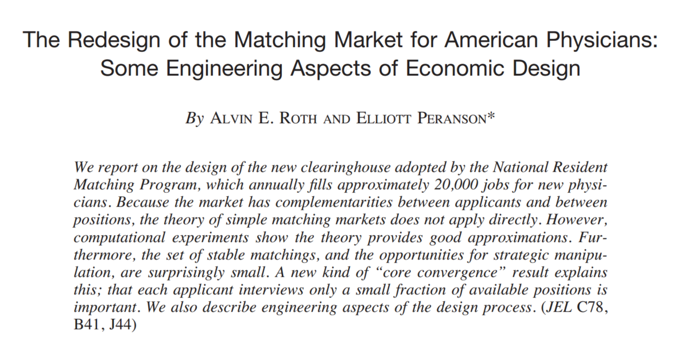

# Emparelhamento Estável

## Emparelhamento entre Hospitais e Médicos

> [**Objetivo:**]{.label-def} Dado um conjunto de preferências entre hospitais e estudantes de medicina, definir um processo de admissão **autoimposto**.

::: {style="text-align: center"}
{width=30%}
{width=30%}
:::

. . .

**Par Instável:** estudante $e$ e hospital $h$ são instáveis se:

- $e$ prefere $h$ ao seu hospital atribuído; e
- $h$ prefere $e$ a um dos seus estudantes aprovados.

. . .

**Emparelhamento Estável:**

- Interesse próprio força a atribuição e previne acordos unilaterais.

. . .

**Exemplo:** Empresas e estudantes.

## Problema de Emparelhamento Estável

**Objetivo:** Dado um conjunto de $n$ hospitais e um conjunto de $n$ estudantes, encontrar uma atribuição adequada.

- Participantes ranqueiam membros do grupo oposto.
- Cada hospital lista estudantes em ordem de preferência da melhor para a pior.
- Cada estudante lista hospitais em ordem de preferência do melhor para o pior.

[**Exemplo de Instância (3 hospitais, 3 estudantes):**]{.label-exmp}

:::: {.columns}
::: {.column width="45%"}
**Preferências dos Hospitais:**

- $h_1 \colon e_1 \succ e_2 \succ e_3$
- $h_2 \colon e_2 \succ e_1 \succ e_3$
- $h_3 \colon e_1 \succ e_2 \succ e_3$
:::

::: {.column width="45%"}
**Preferências dos Estudantes:**

- $e_1 \colon h_2 \succ h_1 \succ h_3$
- $e_2 \colon h_1 \succ h_2 \succ h_3$
- $e_3 \colon h_1 \succ h_2 \succ h_3$
:::
::::

## Emparelhamento Perfeito

> [**Def.**]{.label-def} Um **emparelhamento** $S$ é um conjunto ordenado de pares $h$-$e$ com $h \in H$ e $e \in E$ tal que cada hospital $h \in H$ e cada estudante $e \in E$ aparece no máximo em um par de $S$.

. . .

> [**Def.**]{.label-def} Um emparelhamento $S$ é **perfeito** se $|S|=|H|=|E|=n$.

. . .

<br>

[**Exemplo de Emparelhamento Perfeito:**]{.label-exmp}

- $H = \{h_1, h_2, h_3\}$ e $E = \{e_1, e_2, e_3\}$
- $S = \{(h_1, e_2), (h_2, e_1), (h_3, e_3)\}$

## Par Instável

> [**Def.**]{.label-def} Dado um emparelhamento perfeito $S$, um hospital $h$ e uma estudante $e$ são um **par instável** se:
>
> - $h$ prefere $e$ a seu parceiro atual; e
> - $e$ prefere $h$ a seu parceiro atual.

. . .

> [**Obs.**]{.label-rmk} Um par instável $(h, e)$ pode melhorar seus parceiros com uma ação conjunta.

[Exemplo:]{.label-exmp}

:::: {.columns}
::: {.column width="45%"}
**Preferências:**

- $h_1 \colon e_1 \succ e_2$
- $h_2 \colon e_1 \succ e_2$
- $e_1 \colon h_1 \succ h_2$
- $e_2 \colon h_1 \succ h_2$
:::
::: {.column width="55%"}
**Emparelhamentos:**

- $\{(h_1, e_1), (h_2, e_2)\}$ é **estável**
- $\{(h_1, e_2), (h_2, e_1)\}$ é **instável** \
(pois $h_1$ e $e_1$ formam um par instável)
:::
::::

## Problema de Emparelhamento Estável

> [**Def.**]{.label-def} Um **emparelhamento estável** é um emparelhamento perfeito sem pares instáveis.

. . .

**Problema:** Dadas listas de preferências de $n$ hospitais e $n$ estudantes, encontrar um emparelhamento estável (se existir).

- Natural, desejável, condição autoimposta.
- Interesse próprio previne qualquer hospital-estudante trocar de pares.

## Problema de Emparelhamento Estável

[**P:**]{.label-qstn} Emparelhamentos estáveis sempre existem?

. . .

**Problema:** Colega de Quarto Estável.

- $2n$ pessoas.
- Cada pessoa ranqueia outras pessoas de $1$ até $2n-1$.
- Atribuir pares de colegas de quarto sem pares instáveis.
- Emparelhamentos estáveis nem sempre existem.
- Note que nesse caso não há a separação em dois grupos isolados.

## Problema de Emparelhamento Estável

[**P:**]{.label-qstn} Emparelhamentos estáveis sempre existem?

. . .

|     | 1ª | 2ª | 3ª |
|-----|----|----|-----|
| A   | B  | C  | D  |
| B   | C  | A  | D  |
| C   | A  | B  | D  |
| D   | A  | B  | C  |

**Observações sobre instabilidades:**

- A–B, C–D $\Rightarrow$ B–C instável
- A–C, B–D $\Rightarrow$ A–B instável
- A–D, B–C $\Rightarrow$ A–C instável

**Conclusão:** Não existe emparelhamento perfeito que seja estável neste exemplo.

. . .

**P:** Como encontrar um emparelhamento estável?

# Algoritmo Gale-Shapley

## Algoritmo Gale-Shapley

Algoritmo intuitivo que **garante** encontrar um emparelhamento estável.

```pseudocode
#| html-line-number: true
#| html-no-end: true

\begin{algorithmic}
\Procedure{Gale-Shapley}{$H, E$}
\State Inicialize $S \gets \emptyset$, e todos os hospitais e estudantes como livres
\While{existe um hospital livre $h$ que ainda não propôs a todo estudante}
    \State Escolha um tal hospital $h$
    \State Seja $e$ o estudante de maior preferência de $h$ ao qual $h$ ainda não propôs
    \If{$e$ está livre}
        \State $S \gets S \cup \{(h, e)\}$
    \Else
        \State $e$ está atualmente emparelhado com $h'$
        \If{$e$ prefere $h'$ a $h$}
            \State $h$ continua livre
        \Else
            \State $S \gets S \setminus \{(h', e)\}$
            \State $S \gets S \cup \{(h, e)\}$
            \State $h'$ fica livre
        \EndIf
    \EndIf
\EndWhile
\State \Return $S$
\EndProcedure
\end{algorithmic}
```

## {data-background-iframe="https://brunogrisci.github.io/stablematching" data-background-interactive="true" .hide-header}

# Análise de Gale-Shapley

## Algoritmo Gale-Shapley

O que mostrar?

. . .

**Item 1:** Emparelhamento perfeito.

. . .

**Item 2:** Sem pares instáveis.

. . .

**Item 3:** Algoritmo G-S termina.

. . .

**Item 4:** Justiça.

## Prova de Corretude: Emparelhamento Perfeito

> [**Afirmação.**]{.label-thm} No Algoritmo G-S, todos os hospitais e estudantes são emparelhados.

. . .

> [**Prova.**]{.label-prf} Prova por contradição.

::: {.incremental}
- Suponha para o efeito de contradição que o hospital $h$ não está pareado quando o algoritmo termina.
- $h$ foi rejeitado por todos os estudantes na sua lista.
- Então todos os estudantes têm um par ao fim do algoritmo que elas preferem a $h$.
- Mas o número de hospitais e estudantes é o mesmo. Então, todo hospital possui um par, inclusive $h$, o que gera uma **contradição**. $\blacksquare$
:::

## Algoritmo Gale-Shapley

O que mostrar?

**Item 1:** ~~Emparelhamento perfeito.~~

. . .

**Item 2:** Sem pares instáveis.

. . .

**Item 3:** Algoritmo G-S termina.

. . .

**Item 4:** Justiça.

## Prova de Corretude: Emparelhamento Estável

> [**Afirmação.**]{.label-thm} No Algoritmo G-S, não existem pares instáveis.

. . .

> [**Prova.**]{.label-prf} $S$ é perfeito. Suponha para o efeito de contradição que o par $(h, e) \in S$ é instável.

. . .

- **Caso 1:** $h$ nunca propôs a $e$.
    - $h$ prefere seu par atual a $e$.
    - $(h, e)$ é estável.

. . .

- **Caso 2:** $h$ propôs a $e$.
    - $e$ rejeitou $h$ (imediatamente ou depois).
    - $e$ prefere seu par atual a $h$.
    - $(h, e)$ é estável.
- Em ambos os casos, o par $(h, e)$ é estável. $\blacksquare$

## Algoritmo Gale-Shapley

O que mostrar?

**Item 1:** ~~Emparelhamento perfeito.~~

**Item 2:** ~~Sem pares instáveis.~~

. . .

**Item 3:** Algoritmo G-S termina.

. . .

**Item 4:** Justiça.

## Prova de Corretude: Terminação

> [**Obs.**]{.label-rmk} Hospitais propõem para estudantes em ordem decrescente de preferência (**apenas piora**).

. . .

> [**Obs.**]{.label-rmk} Assim que uma estudante é proposta, ela nunca fica sozinha, ela apenas troca a proposta atual por uma proposta melhor (**apenas melhora**).

. . .

**P:** Como provar que o algoritmo termina?

. . .

**P:** Como medir progresso? . . . Número de indivíduos livres? . . . Número de pares? . . . Número de propostas realizadas?

## Prova de Corretude: Terminação

> [**Afirmação.**]{.label-thm} O algoritmo termina no máximo após $n^2$ iterações do loop.

> [**Prova.**]{.label-prf} A cada iteração do loop um hospital propõe para uma nova estudante. Existem apenas $n^2$ possíveis propostas. $\blacksquare$

. . .

:::: columns
::: {.column width="49%"}
**Hospitais**

| | 1ª | 2ª | 3ª | 4ª | 5ª |
|---|---|---|---|---|---|
| V | A | B | C | D | E |
| W | B | C | D | A | E |
| X | C | D | A | B | E |
| Y | D | A | B | C | E |
| Z | A | B | C | D | E |
:::

::: {.column width="49%"}
**Estudantes**

| | 1ª | 2ª | 3ª | 4ª | 5ª |
|---|---|---|---|---|---|
| A | W | X | Y | Z | V |
| B | X | Y | Z | V | W |
| C | Y | Z | V | W | X |
| D | Z | V | W | X | Y |
| E | V | W | X | Y | Z |
:::
::::

**Exemplo:** Pior caso.

## Pior Caso

> [**Afirmação.**]{.label-thm} O algoritmo realiza no máximo $n(n-1)+1$ propostas.

> [**Prova.**]{.label-prf}

::: {.incremental}

* Uma estudante, ao receber uma proposta, nunca mais volta a ficar livre.
* O algoritmo termina no exato momento em que o último estudante livre é comprometida.
* No pior caso, antes dessa última proposta, os outros $(n-1)$ estudantes já receberam propostas de todos os $n$ hospitais.
* Isso totaliza $n(n-1)$ propostas feitas a essas estudantes.
* A proposta seguinte é feita à estudante restante e encerra o algoritmo.
* Portanto, o número máximo de propostas é
$$\underbrace{n}_{\text{hospitais}} \underbrace{(n-1)}_{\text{rejeições}} + \underbrace{1}_{\text{final sem rejeição}}  = n^2 - n + 1.$$
$\blacksquare$
:::

## Resumo

> [**Teorema.**]{.label-thm} [Gale-Shapley 1962] O algoritmo Gale-Shapley garante encontrar um emparelhamento estável para qualquer **instância** do Problema de Emparelhamento Estável.

. . .

<br>

> [**P:**]{.label-qstn} Se existem múltiplos emparelhamentos estáveis, qual o algoritmo G-S irá retornar? A ordem das propostas importa?

## Algoritmo Gale-Shapley

O que mostrar?

**Item 1:** ~~Emparelhamento perfeito.~~

. . .

**Item 2:** ~~Sem pares instáveis.~~

. . .

**Item 3:** ~~Algoritmo G-S termina.~~

. . .

**Item 4:** Justiça.

# Justiça

## Entendendo a Solução

**P.** A ordem em que os hospitais são selecionados para propor muda o resultado do algoritmo?

. . .

> [**Def.**]{.label-def} Uma estudante $e$ é uma **parceiro viável** para um hospital $h$ se existe algum emparelhamento estável com o par $(h, e)$.

. . .

**Exemplo:**

- $h - e, e'$.
- $h' - e, e'$.
- $e - h, h'$.
- $e' - h, h'$.
- Apenas $e$ é viável para $h$.

## Entendendo a Solução

> [**Def.**]{.label-def} Uma estudante $e$ é uma **parceiro viável** para um hospital $h$ se existe algum emparelhamento estável com o par $(h, e)$.

. . .

**Atribuição Hospital-Ótima:** Todo hospital recebe o melhor parceiro viável.

- É um emparelhamento perfeito?
- É um emparelhamento estável?

. . .

> [**Afirmação.**]{.label-thm} Toda execução do algoritmo G-S retorna uma atribuição hospital-ótima.

> [**Corolário.**]{.label-cor} Uma atribuição hospital-ótima é um emparelhamento estável.

## Otimalidade para Hospitais

> [**Afirmação.**]{.label-thm} O algoritmo G-S é **hospital-ótimo**: cada hospital recebe sua **melhor parceiro viável**.

> [**Prova.**]{.label-prf} Por **contradição**.

**[Hipótese]** Suponha que algum hospital não termina com suo melhor parceiro viável.

- Como os hospitais propõem em ordem decrescente de preferência, algum hospital foi **rejeitado** por um parceiro viável.
- Seja $h$ o **primeiro** hospital rejeitado por um parceiro viável, e $e = \text{best}(h)$ esso parceiro.
  - *(Até esse momento, nenhum outro hospital foi rejeitado por uma viável.)*
- Quando $e$ rejeita $h$, ela se compromete com outro pretendente $h'$ — logo $e$ **prefere $h'$ a $h$**.


## Otimalidade para Hospitais — Estrutura da Contradição

:::: {.columns}
::: {.column width="50%"}
::: {.incremental}
**[Construção]** $e$ é viável para $h$, logo **por definição** existe emparelhamento estável $S'$ com $(h, e)$.

- Seja $e'$ o parceiro de $h'$ em $S'$ (com $e' \neq e$).
- **Em $E$:** quando $h'$ propôs a $e$, ainda não havia sido rejeitado por nenhuma viável — pois $h$ foi o **primeiro**!
- $e'$ é viável para $h'$ (estão em $S'$). Se $h'$ tivesse proposto a $e'$ antes e $e'$ o rejeitasse → $h'$ seria o primeiro rejeitado, não $h$ — **contradição**!
- Logo $h'$ ainda não propôs a $e'$ ⟹ $h'$ **prefere $e$ a $e'$**.
- Temos: $h'$ prefere $e$ a $e'$ **e** $e$ prefere $h'$ a $h$ ⟹ $(h', e)$ **bloqueia** $S'$. $\blacksquare$
:::
:::
::: {.column width="50%"}

```{=html}
<div style="font-size:0.72em; margin-top:0.2em;">

  <!-- Execução E -->
  <div style="background:#f0f4ff; border:1.5px solid #3949ab; border-radius:8px; padding:0.5em 0.8em; margin-bottom:0.5em;">
    <div style="font-weight:bold; color:#3949ab; margin-bottom:0.4em; text-align:center;">Execução <i>E</i> do G-S</div>
    <div style="display:flex; align-items:center; justify-content:center; gap:0.5em; flex-wrap:wrap;">
      <div style="background:#c8e6c9; border:1.5px solid #388e3c; border-radius:6px; padding:0.3em 0.7em; font-weight:bold;"><i>h</i></div>
      <div style="color:#c62828; font-size:1.3em; font-weight:bold;">&#8603;</div>
      <div style="background:#fff9c4; border:1.5px solid #f9a825; border-radius:6px; padding:0.3em 0.7em; font-weight:bold;"><i>e</i></div>
      <div style="color:#388e3c; font-size:1.3em; font-weight:bold;">&#8594;</div>
      <div style="background:#ffcdd2; border:1.5px solid #c62828; border-radius:6px; padding:0.3em 0.7em; font-weight:bold;"><i>h</i>&#8242;</div>
    </div>
    <div style="text-align:center; color:#555; margin-top:0.3em; font-size:0.85em;"><i>e</i> rejeita <i>h</i> e prefere <i>h</i>&#8242;</div>
  </div>

  <!-- Estável S' -->
  <div style="background:#f3e5f5; border:1.5px solid #6a1b9a; border-radius:8px; padding:0.5em 0.8em; margin-bottom:0.5em;">
    <div style="font-weight:bold; color:#6a1b9a; margin-bottom:0.4em; text-align:center;">Emparelhamento estável <i>S</i>&#8242;</div>
    <div style="display:flex; justify-content:center; gap:1.2em;">
      <div style="display:flex; align-items:center; gap:0.3em;">
        <div style="background:#c8e6c9; border:1.5px solid #388e3c; border-radius:6px; padding:0.3em 0.6em; font-weight:bold;"><i>h</i></div>
        <span style="font-size:1.1em;">&#8596;</span>
        <div style="background:#fff9c4; border:1.5px solid #f9a825; border-radius:6px; padding:0.3em 0.6em; font-weight:bold;"><i>e</i></div>
      </div>
      <div style="display:flex; align-items:center; gap:0.3em;">
        <div style="background:#ffcdd2; border:1.5px solid #c62828; border-radius:6px; padding:0.3em 0.6em; font-weight:bold;"><i>h</i>&#8242;</div>
        <span style="font-size:1.1em;">&#8596;</span>
        <div style="background:#e1bee7; border:1.5px solid #6a1b9a; border-radius:6px; padding:0.3em 0.6em; font-weight:bold;"><i>e</i>&#8242;</div>
      </div>
    </div>
  </div>

  <!-- Contradição -->
  <div style="background:#fbe9e7; border:2px solid #bf360c; border-radius:8px; padding:0.5em 0.8em; text-align:center;">
    <div><b><i>h</i>&#8242; prefere <i>e</i> a <i>e</i>&#8242;</b></div>
    <div><b><i>e</i> prefere <i>h</i>&#8242; a <i>h</i></b></div>
    <div style="color:#bf360c; margin-top:0.3em;">&#10233; (<i>h</i>&#8242;, <i>e</i>) bloqueia <i>S</i>&#8242; — contradição!</div>
  </div>

</div>
```

:::
::::

> **Conclusão:** Todo hospital termina com suo melhor parceiro viável no algoritmo G–S.


## Entendendo a Solução

> [**P:**]{.label-qstn} O que acontece com os estudantes?

. . .

**Pessimalidade para Estudantes:** Cada estudante recebe o pior parceiro viável.

## Pessimalidade para Estudantes

> [**Afirmação.**]{.label-thm} O algoritmo G-S é **estudante-péssimo**.

> [**Prova.**]{.label-prf} Por contradição. Suponha que o hospital $h$ é atribuído a $e$ em $S^*$, mas $h$ não é o pior parceiro viável de $e$.

::: {.incremental}
- Então existe um emparelhamento estável $S'$ em que $e$ é pareado com um hospital $h'$, de quem $e$ gosta menos do que $h$.
- $\Rightarrow$ $e$ prefere $h$ a $h'$.
- Seja $e' \neq e$ o parceiro de $h$ em $S'$. Por otimalidade para hospitais, $e$ é o melhor parceiro viável para $h$ (foram pareados em $S^*$).
- $\Rightarrow$ $h$ prefere $e$ a $e'$.
- Então, $(h, e)$ é um par **instável** em $S'$, uma **contradição**. $\blacksquare$
:::

## Emparelhamento de Empresas e Alunos

**Exemplo:** Hospitais $\approx$ Empresas, Estudantes $\approx$ Alunos.

**Variação 1:** Alguns participantes declaram outros como inaceitáveis.

**Variação 2:** Números diferentes de hospitais e estudantes.

**Variação 3:** Poligamia limitada.

. . .

> [**Def.**]{.label-def} Um emparelhamento $S$ é **instável** se há uma empresa $e$ e um aluno $a$ tal que:
>
> - $e$ e $a$ são aceitáveis mutuamente; e
> - $a$ não está emparelhado, ou $a$ prefere $e$ a sua empresa atual; e
> - $e$ não preencheu todas as suas vagas, ou $e$ prefere $a$ a um dos seus atuais estagiários.

# Contexto Histórico

## Contexto Histórico

- Nomeado em homenagem a **David Gale** e **Lloyd Shapley**, que o publicaram em 1962.
- Já era utilizado desde o início da década de 1950 no **National Resident Matching Program** (NRMP), para alocação de médicos residentes nos EUA.

## Contexto Histórico

**National Resident Matching Program.**

- Processo de decisão centralizada.
- $38.000$ estudantes e $28.000$ posições.

{width=80%}

## Nobel de Economia em 2012

**Lloyd Shapley:** Teoria de emparelhamento estável e algoritmo G-S.

. . .

**Alvin Roth:** Aplicação do algoritmo G-S no problema de **hospitais e estudantes**, e **doadores de órgãos com pacientes**.

{fig-align="center" width=80%}

## Uma Aplicação Moderna

**Content delivery networks (CDNs).** Distribute much of world’s content on web.

- **User**. Preferences based on latency and packet loss.
- **Web server**. Preferences based on costs of bandwidth and co-location.
- **Goal**. Assign billions of users to servers, every 10 seconds.

{width=80%}

# Implementação em Python

## Implementação em Python {.scrollable .live-code-slide}

[Github](https://github.com/BrunoGrisci/projeto-e-analise-de-algoritmos/blob/main/paa1/galeshapley.py)

```{pyodide}
# Prof. Bruno Iochins Grisci

import random
from collections import deque
import matplotlib.pyplot as plt

def plot_curves(i_rand, i_hard, i_easy):
    # Build aligned x/y arrays
    xs = sorted(i_rand.keys())
    y_rand = [i_rand[n] for n in xs]
    y_hard = [i_hard[n] for n in xs]
    y_easy = [i_easy[n] for n in xs]

    # (Optional) theoretical references
    y_linear = xs                              # ~ n      (easy)
    y_quadratic_half = [n*(n+1)//2 for n in xs]     # ~ n^2/2  (hard-ish)
    y_quadratic = [n*n for n in xs]     # ~ n^2 (hard-ish)

    plt.figure(figsize=(8, 5))
    plt.plot(xs, y_rand, marker='o', label='Random')
    plt.plot(xs, y_hard, marker='s', label='Hard-ish (identical hospitals)')
    plt.plot(xs, y_easy, marker='^', label='Easy (unique top choices)')

    # (Optional) add theory lines
    plt.plot(xs, y_linear, linestyle='--', label='~ n (theory)')
    plt.plot(xs, y_quadratic_half, linestyle='--', label='~ n(n+1)/2 (theory)')
    # plt.plot(xs, y_quadratic, linestyle='--', label='~ n*n (theory)')

    plt.title('Gale–Shapley: iterations vs problem size n')
    plt.xlabel('n (|H| = |E|)')
    plt.ylabel('Number of loop iterations')
    plt.legend()
    plt.grid(True)
    plt.tight_layout()
    #plt.yscale('log')
    plt.show()

def random_instance(n, seed=None):
    """
    Create a random one-to-one instance with n 'hospitals' and n 'students'.
    Names: H1..Hn and E1..En.
    """
    rng = random.Random(seed)
    men = [f"M{i}" for i in range(1, n+1)]
    women = [f"W{i}" for i in range(1, n+1)]

    m_prefs = {m: rng.sample(women, k=n) for m in men}
    w_prefs = {w: rng.sample(men, k=n) for w in women}
    return m_prefs, w_prefs

def worstish_instance(n):
    """
    Identical hospitals, reversed students (tends to increase proposals).
    """
    men = [f"M{i}" for i in range(1, n+1)]
    women = [f"W{i}" for i in range(1, n+1)]
    # All men rank W1 > W2 > ... > Wn
    m_prefs = {m: women[:] for m in men}
    # Each woman ranks men in reverse (Mn > ... > M1)
    rev_men = men[::-1]
    w_prefs = {w: rev_men[:] for w in women}
    return m_prefs, w_prefs    

def easy_instance(n):
    """
    Each man’s top choice is unique and each student ranks their designated hospital first. Then everyone gets committed on their first proposal.
    """
    men   = [f"M{i}" for i in range(1, n+1)]
    women = [f"W{i}" for i in range(1, n+1)]
    # Mi's top choice is Wi; each woman Wi ranks Mi first
    m_prefs = {
        men[i]: [women[i]] + [w for w in women if w != women[i]] 
        for i in range(n)
    }
    w_prefs = {
        women[i]: [men[i]] + [m for m in men if m != men[i]]
        for i in range(n)
    }
    return m_prefs, w_prefs

def gale_shapley(m_prefs: dict[str, list[str]], w_prefs: dict[str, list[str]], verbose=False):
    """
    m_prefs: {hospital: [students in descending preference]}
    w_prefs: {student: [hospitals in descending preference]}
    returns: set of (hospital, student) pairs
    """
    # Precompute each student's ranking of hospitals for comparisons
    w_rank = {w: {m: i for i, m in enumerate(pref_list)} for w, pref_list in w_prefs.items()}

    # https://www.geeksforgeeks.org/python/deque-in-python/
    free_men = deque(m_prefs.keys())        # all hospitals start free
    next_idx = {m: 0 for m in m_prefs}      # next woman to propose to per man
    engaged_to = {}                         # woman -> man (current fiancé)

    i_loop = 0
    while free_men:
        i_loop += 1
        m = free_men.popleft()

        # If m has already proposed to every woman, skip (no match possible)
        if next_idx[m] >= len(m_prefs[m]):
            if verbose: print(f'{m} has already proposed to everyone.')
            continue

        # Highest-ranked woman m hasn't proposed to yet
        w = m_prefs[m][next_idx[m]]
        next_idx[m] += 1

        if verbose: print(f'{m} proposes to {w}.')        

        if w not in engaged_to:             # w is free
            engaged_to[w] = m               # (m, w) become engaged
            if verbose: print(f'{w} is free, {m} and {w} become engaged.')     
        else:
            m_prime = engaged_to[w]         # w is engaged to m'
            # If w prefers current fiancé m' over m
            if w_rank[w][m_prime] < w_rank[w][m]:
                # m remains free; try next woman later
                free_men.append(m)
                if verbose: print(f'{m} remains free.')   
            else:
                # w prefers m to m'
                engaged_to[w] = m           # (m, w) become engaged
                free_men.append(m_prime)    # m' becomes free
                if verbose: print(f'{m} and {w} become engaged, {m_prime} becomes free.')   

        # If m still hasn't proposed to everyone and is free, he'll re-enter loop via queue
        # Loop continues while there exists a free man who hasn't proposed to all women

        if verbose: print(engaged_to)

    # Build result set S of engaged pairs
    return {(m, w) for w, m in engaged_to.items()}, i_loop

def main():

    # Demo: https://www.cs.princeton.edu/~wayne/kleinberg-tardos/pdf/01DemoGaleShapley.pdf
    # hospitals’ preference lists
    HPL = {           #1st      2nd       3rd         4th       5th 
        'Atlanta': ['Wayne',  'Val',     'Yolanda', 'Zeus',   'Xavier'],
        'Boston':  ['Yolanda','Wayne',   'Val',     'Xavier', 'Zeus'],
        'Chicago': ['Wayne',  'Zeus',    'Xavier',  'Yolanda','Val'],
        'Detroit': ['Val',    'Yolanda', 'Xavier',  'Wayne',  'Zeus'],
        'El Paso': ['Wayne',  'Yolanda', 'Val',     'Zeus',   'Xavier'],
    }

    # students’ preference lists
    SPL = {           #1st      2nd       3rd         4th       5th 
    'Val':     ['El Paso', 'Atlanta', 'Boston',  'Detroit', 'Chicago'],
    'Wayne':   ['Chicago', 'Boston',  'Detroit', 'Atlanta', 'El Paso'],
    'Xavier':  ['Boston',  'Chicago', 'Detroit', 'El Paso', 'Atlanta'],
    'Yolanda': ['Atlanta', 'El Paso', 'Detroit', 'Chicago', 'Boston'],
    'Zeus':    ['Detroit', 'Boston',  'El Paso', 'Chicago', 'Atlanta'],
    }

    # Pior caso dos slides de aula
    HOSPITAIS = {
        'V': ['A', 'B', 'C', 'D', 'E'],
        'W': ['B', 'C', 'D', 'A', 'E'],
        'X': ['C', 'D', 'A', 'B', 'E'],
        'Y': ['D', 'A', 'B', 'C', 'E'],
        'Z': ['A', 'B', 'C', 'D', 'E'],
    }

    ESTUDANTES = {
       'A': ['W', 'X', 'Y', 'Z', 'V'],
       'B': ['X', 'Y', 'Z', 'V', 'W'],
       'C': ['Y', 'Z', 'V', 'W', 'X'],
       'D': ['Z', 'V', 'W', 'X', 'Y'],
       'E': ['V', 'W', 'X', 'Y', 'Z'],
    }

    # Demo:
    print(gale_shapley(HPL, SPL, True))

    # Worst case:
    print(gale_shapley(HOSPITAIS, ESTUDANTES, True))

    # Analysis:    
    i_rand = {}
    i_hard = {}
    i_easy = {}

    for n in range(10, 1000, 100):
        mp, wm = random_instance(n)
        i_rand[n] = gale_shapley(mp, wm)[1]
    
    for n in range(10, 1000, 100):
        mp, wm = worstish_instance(n)
        i_hard[n] = gale_shapley(mp, wm)[1]     

    for n in range(10, 1000, 100):
        mp, wm = easy_instance(n)
        i_easy[n] = gale_shapley(mp, wm)[1] 

    print('RANDOM')
    print(i_rand)
    print('WORST')
    print(i_hard)
    print('EASY')
    print(i_easy)

    plot_curves(i_rand, i_hard, i_easy)
    

main()
```

#

::: {style="text-align: center; margin-top: 15vh;"}
[?]{style="font-size: 5em; color: #d10000; font-weight: 700;"}
:::
