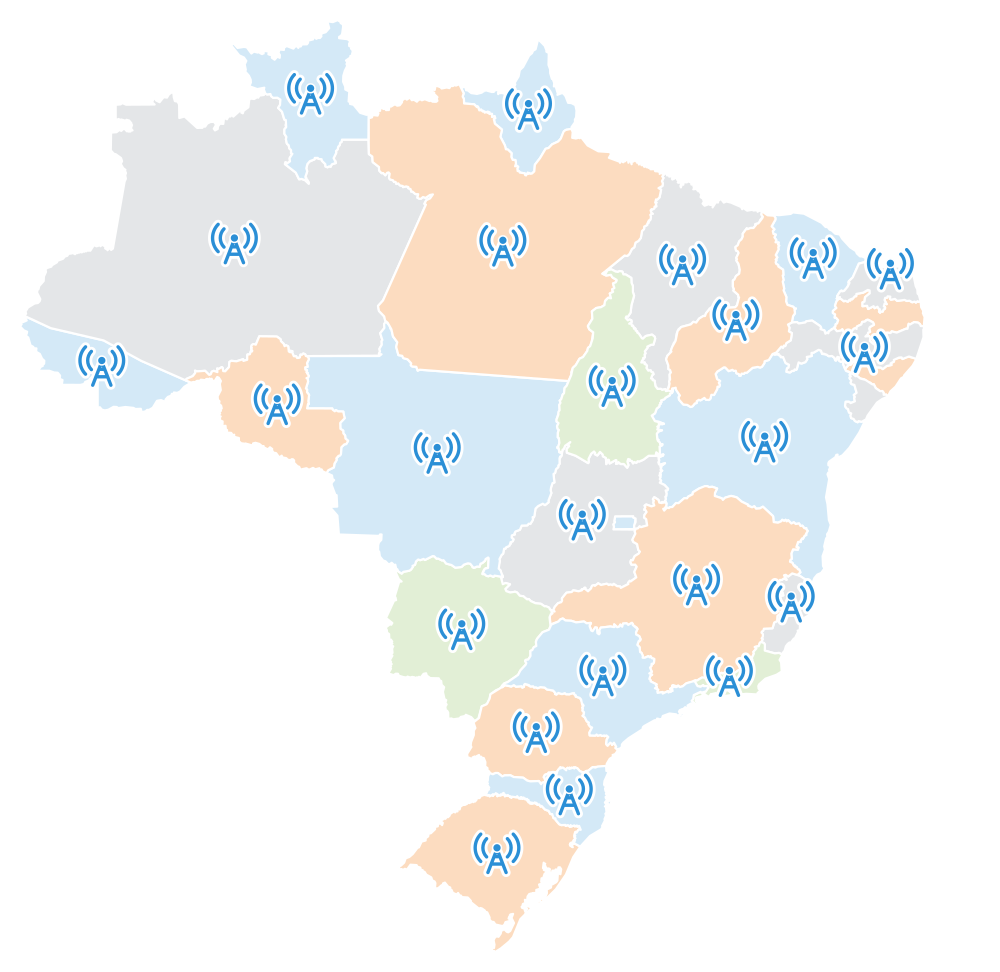
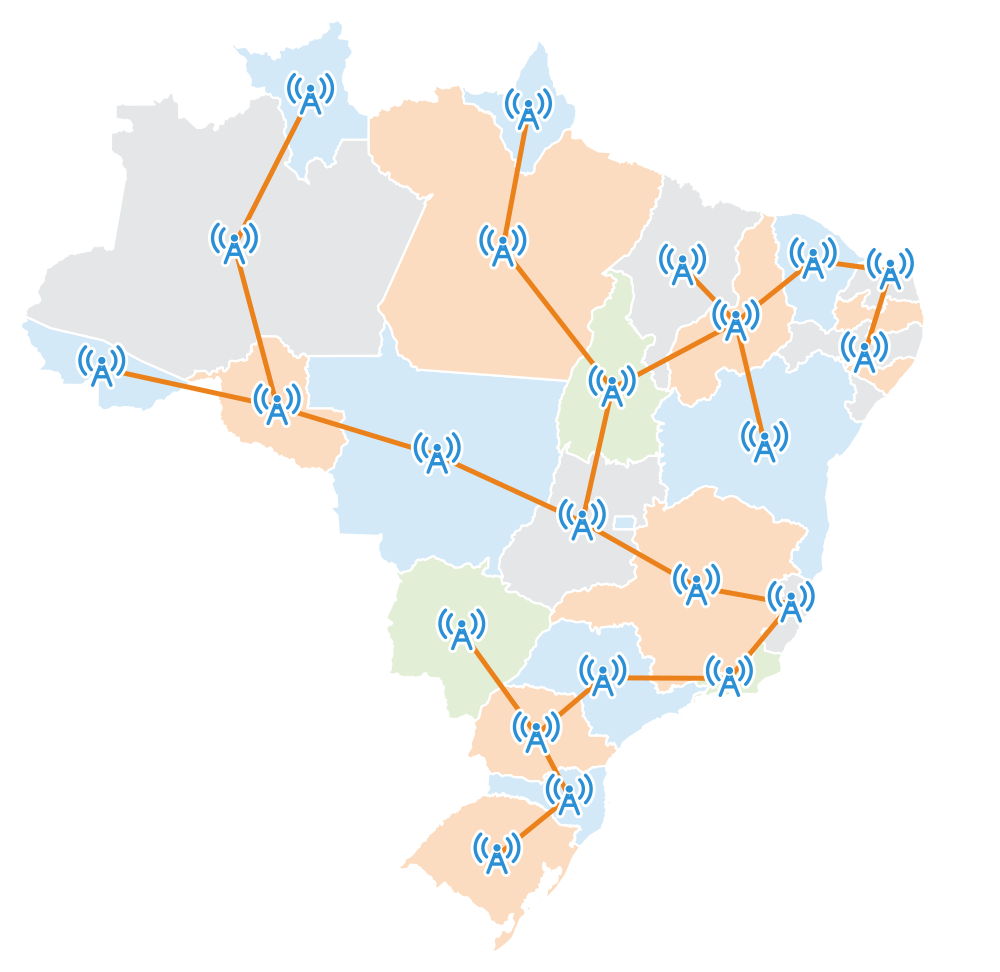

# Árvores Geradoras

## Motivação: Design de Redes

{width=66% fig-align="center"}

## Motivação: Design de Redes

{width=66% fig-align="center"}

## Motivação: Design de Redes

Na situação anterior:

- Temos um **conjunto de torres**.
- Para conectar duas torres, usamos um cabeamento.
- Queremos que todas elas estejam **interconectadas**.

<br>

[P.]{.label-qstn} **Como minimizar o comprimento do cabeamento?**

- Este é um problema de [otimização]{.alert}.
- A entrada pode ser modelada como um **grafo**.

## Árvores Geradoras

> [**Definição:**]{.label-def} Seja $G = (V,E)$ um grafo simples. Um **subgrafo gerador** de $G$ é um grafo $G' = (V',E')$ onde $G' \subseteq G$ e $V' = V$.

. . .

> [**Definição:**]{.label-def} Um subgrafo gerador de $G$ que é uma árvore é chamado uma **árvore geradora de $G$**.

. . .

[**Exemplo:**]{.label-exmp} $G'$, $G''$ e $G'''$ são árvores geradoras distintas de $G$ (arestas da árvore [em verde]{style="color:#3a7a10"}):

```{=html}
<svg viewBox="0 0 860 150" style="display:block; margin:0 auto; width:34em; max-width:100%; height:auto;" xmlns="http://www.w3.org/2000/svg" role="img" aria-label="Grafo G e três árvores geradoras distintas G′, G′′ e G′′′ (arestas da árvore em verde)">
<line x1="80.0" y1="55.0" x2="160.0" y2="55.0" stroke="#555555" stroke-width="2.5"/>
<line x1="40.0" y1="95.0" x2="80.0" y2="135.0" stroke="#555555" stroke-width="2.5"/>
<line x1="40.0" y1="95.0" x2="80.0" y2="55.0" stroke="#555555" stroke-width="2.5"/>
<line x1="120.0" y1="95.0" x2="80.0" y2="55.0" stroke="#555555" stroke-width="2.5"/>
<line x1="120.0" y1="95.0" x2="160.0" y2="55.0" stroke="#555555" stroke-width="2.5"/>
<line x1="120.0" y1="95.0" x2="80.0" y2="135.0" stroke="#555555" stroke-width="2.5"/>
<line x1="120.0" y1="95.0" x2="160.0" y2="135.0" stroke="#555555" stroke-width="2.5"/>
<line x1="200.0" y1="95.0" x2="160.0" y2="55.0" stroke="#555555" stroke-width="2.5"/>
<line x1="200.0" y1="95.0" x2="160.0" y2="135.0" stroke="#555555" stroke-width="2.5"/>
<line x1="80.0" y1="135.0" x2="160.0" y2="135.0" stroke="#555555" stroke-width="2.5"/>
<circle cx="80.0" cy="55.0" r="8" fill="#23373b" stroke="#152224" stroke-width="2"/>
<circle cx="160.0" cy="55.0" r="8" fill="#23373b" stroke="#152224" stroke-width="2"/>
<circle cx="40.0" cy="95.0" r="8" fill="#23373b" stroke="#152224" stroke-width="2"/>
<circle cx="120.0" cy="95.0" r="8" fill="#23373b" stroke="#152224" stroke-width="2"/>
<circle cx="200.0" cy="95.0" r="8" fill="#23373b" stroke="#152224" stroke-width="2"/>
<circle cx="80.0" cy="135.0" r="8" fill="#23373b" stroke="#152224" stroke-width="2"/>
<circle cx="160.0" cy="135.0" r="8" fill="#23373b" stroke="#152224" stroke-width="2"/>
<text x="120.0" y="18.0" font-size="24" text-anchor="middle" dominant-baseline="central" fill="#23373b" font-family="KaTeX_Main, 'Times New Roman', serif"><tspan font-family="KaTeX_Math, 'Times New Roman', serif" font-style="italic">G</tspan><tspan font-family="'Times New Roman', serif"></tspan></text>
<line x1="295.0" y1="55.0" x2="375.0" y2="55.0" stroke="#3a7a10" stroke-width="4"/>
<line x1="255.0" y1="95.0" x2="295.0" y2="135.0" stroke="#d5dade" stroke-width="2" stroke-dasharray="5 4"/>
<line x1="255.0" y1="95.0" x2="295.0" y2="55.0" stroke="#3a7a10" stroke-width="4"/>
<line x1="335.0" y1="95.0" x2="295.0" y2="55.0" stroke="#d5dade" stroke-width="2" stroke-dasharray="5 4"/>
<line x1="335.0" y1="95.0" x2="375.0" y2="55.0" stroke="#3a7a10" stroke-width="4"/>
<line x1="335.0" y1="95.0" x2="295.0" y2="135.0" stroke="#d5dade" stroke-width="2" stroke-dasharray="5 4"/>
<line x1="335.0" y1="95.0" x2="375.0" y2="135.0" stroke="#3a7a10" stroke-width="4"/>
<line x1="415.0" y1="95.0" x2="375.0" y2="55.0" stroke="#d5dade" stroke-width="2" stroke-dasharray="5 4"/>
<line x1="415.0" y1="95.0" x2="375.0" y2="135.0" stroke="#3a7a10" stroke-width="4"/>
<line x1="295.0" y1="135.0" x2="375.0" y2="135.0" stroke="#3a7a10" stroke-width="4"/>
<circle cx="295.0" cy="55.0" r="8" fill="#3a7a10" stroke="#2b5c0c" stroke-width="2"/>
<circle cx="375.0" cy="55.0" r="8" fill="#3a7a10" stroke="#2b5c0c" stroke-width="2"/>
<circle cx="255.0" cy="95.0" r="8" fill="#3a7a10" stroke="#2b5c0c" stroke-width="2"/>
<circle cx="335.0" cy="95.0" r="8" fill="#3a7a10" stroke="#2b5c0c" stroke-width="2"/>
<circle cx="415.0" cy="95.0" r="8" fill="#3a7a10" stroke="#2b5c0c" stroke-width="2"/>
<circle cx="295.0" cy="135.0" r="8" fill="#3a7a10" stroke="#2b5c0c" stroke-width="2"/>
<circle cx="375.0" cy="135.0" r="8" fill="#3a7a10" stroke="#2b5c0c" stroke-width="2"/>
<text x="335.0" y="18.0" font-size="24" text-anchor="middle" dominant-baseline="central" fill="#23373b" font-family="KaTeX_Main, 'Times New Roman', serif"><tspan font-family="KaTeX_Math, 'Times New Roman', serif" font-style="italic">G</tspan><tspan font-family="'Times New Roman', serif">'</tspan></text>
<line x1="510.0" y1="55.0" x2="590.0" y2="55.0" stroke="#d5dade" stroke-width="2" stroke-dasharray="5 4"/>
<line x1="470.0" y1="95.0" x2="510.0" y2="135.0" stroke="#3a7a10" stroke-width="4"/>
<line x1="470.0" y1="95.0" x2="510.0" y2="55.0" stroke="#3a7a10" stroke-width="4"/>
<line x1="550.0" y1="95.0" x2="510.0" y2="55.0" stroke="#d5dade" stroke-width="2" stroke-dasharray="5 4"/>
<line x1="550.0" y1="95.0" x2="590.0" y2="55.0" stroke="#d5dade" stroke-width="2" stroke-dasharray="5 4"/>
<line x1="550.0" y1="95.0" x2="510.0" y2="135.0" stroke="#3a7a10" stroke-width="4"/>
<line x1="550.0" y1="95.0" x2="590.0" y2="135.0" stroke="#3a7a10" stroke-width="4"/>
<line x1="630.0" y1="95.0" x2="590.0" y2="55.0" stroke="#3a7a10" stroke-width="4"/>
<line x1="630.0" y1="95.0" x2="590.0" y2="135.0" stroke="#3a7a10" stroke-width="4"/>
<line x1="510.0" y1="135.0" x2="590.0" y2="135.0" stroke="#d5dade" stroke-width="2" stroke-dasharray="5 4"/>
<circle cx="510.0" cy="55.0" r="8" fill="#3a7a10" stroke="#2b5c0c" stroke-width="2"/>
<circle cx="590.0" cy="55.0" r="8" fill="#3a7a10" stroke="#2b5c0c" stroke-width="2"/>
<circle cx="470.0" cy="95.0" r="8" fill="#3a7a10" stroke="#2b5c0c" stroke-width="2"/>
<circle cx="550.0" cy="95.0" r="8" fill="#3a7a10" stroke="#2b5c0c" stroke-width="2"/>
<circle cx="630.0" cy="95.0" r="8" fill="#3a7a10" stroke="#2b5c0c" stroke-width="2"/>
<circle cx="510.0" cy="135.0" r="8" fill="#3a7a10" stroke="#2b5c0c" stroke-width="2"/>
<circle cx="590.0" cy="135.0" r="8" fill="#3a7a10" stroke="#2b5c0c" stroke-width="2"/>
<text x="550.0" y="18.0" font-size="24" text-anchor="middle" dominant-baseline="central" fill="#23373b" font-family="KaTeX_Main, 'Times New Roman', serif"><tspan font-family="KaTeX_Math, 'Times New Roman', serif" font-style="italic">G</tspan><tspan font-family="'Times New Roman', serif">''</tspan></text>
<line x1="725.0" y1="55.0" x2="805.0" y2="55.0" stroke="#d5dade" stroke-width="2" stroke-dasharray="5 4"/>
<line x1="685.0" y1="95.0" x2="725.0" y2="135.0" stroke="#3a7a10" stroke-width="4"/>
<line x1="685.0" y1="95.0" x2="725.0" y2="55.0" stroke="#3a7a10" stroke-width="4"/>
<line x1="765.0" y1="95.0" x2="725.0" y2="55.0" stroke="#d5dade" stroke-width="2" stroke-dasharray="5 4"/>
<line x1="765.0" y1="95.0" x2="805.0" y2="55.0" stroke="#3a7a10" stroke-width="4"/>
<line x1="765.0" y1="95.0" x2="725.0" y2="135.0" stroke="#3a7a10" stroke-width="4"/>
<line x1="765.0" y1="95.0" x2="805.0" y2="135.0" stroke="#3a7a10" stroke-width="4"/>
<line x1="845.0" y1="95.0" x2="805.0" y2="55.0" stroke="#3a7a10" stroke-width="4"/>
<line x1="845.0" y1="95.0" x2="805.0" y2="135.0" stroke="#d5dade" stroke-width="2" stroke-dasharray="5 4"/>
<line x1="725.0" y1="135.0" x2="805.0" y2="135.0" stroke="#d5dade" stroke-width="2" stroke-dasharray="5 4"/>
<circle cx="725.0" cy="55.0" r="8" fill="#3a7a10" stroke="#2b5c0c" stroke-width="2"/>
<circle cx="805.0" cy="55.0" r="8" fill="#3a7a10" stroke="#2b5c0c" stroke-width="2"/>
<circle cx="685.0" cy="95.0" r="8" fill="#3a7a10" stroke="#2b5c0c" stroke-width="2"/>
<circle cx="765.0" cy="95.0" r="8" fill="#3a7a10" stroke="#2b5c0c" stroke-width="2"/>
<circle cx="845.0" cy="95.0" r="8" fill="#3a7a10" stroke="#2b5c0c" stroke-width="2"/>
<circle cx="725.0" cy="135.0" r="8" fill="#3a7a10" stroke="#2b5c0c" stroke-width="2"/>
<circle cx="805.0" cy="135.0" r="8" fill="#3a7a10" stroke="#2b5c0c" stroke-width="2"/>
<text x="765.0" y="18.0" font-size="24" text-anchor="middle" dominant-baseline="central" fill="#23373b" font-family="KaTeX_Main, 'Times New Roman', serif"><tspan font-family="KaTeX_Math, 'Times New Roman', serif" font-style="italic">G</tspan><tspan font-family="'Times New Roman', serif">'''</tspan></text>
</svg>
```

. . .

[**Nota:**]{.label-rmk} Árvores geradoras também são conhecidas como árvores de extensão, árvores espalhadas ou árvores de espalhamento. Termo em inglês: **spanning tree**.

## Árvores Geradoras em Grafos com Pesos

> [**Definição:**]{.label-def} O **peso** de uma árvore geradora $A = (V,E,w)$ de $G$ (grafo com pesos) é a soma
> $$
> W(A) = \sum_{e \in E} w(e)
> $$

. . .

<br>

> [**Definição:**]{.label-def} Dado um grafo com pesos $G$, uma **árvore geradora mínima (AGM)** é:
> 
> - Uma árvore geradora com peso menor ou igual a todas as demais árvores geradoras de $G$ 
> - Isto é, uma árvore que [minimiza]{.alert} $W$.

## Aplicações de Árvores Geradoras Mínimas

**O problema da Árvore Geradora Mínima tem diversas aplicações:**

- Design de redes de comunicação, computadores, elétricas, hidráulicas, etc.
- Análise de clusters.
- Encontrar redes de trânsito em imagens de satélite.
- Identificação de faces em tempo real.
- Algoritmos aproximados para problemas NP-hard (e.g., caixeiro viajante).
- Protocolo de autoconfiguração para Ethernet para evitar ciclos em redes.
- Dithering.
- $\ldots$

## Aplicações de Árvores Geradoras Mínimas

[**Exemplo:**]{.label-exmp} Conectar diversos computadores com o mínimo de cabos, estações de energia elétrica com o mínimo de fios, etc.

. . .

[**Exercício:**]{.label-excs} Apresente uma AGM para o seguinte grafo:

```{=html}
<svg viewBox="0 -6 520 280" style="display:block; margin:0 auto; width:21em; max-width:100%; height:auto;" xmlns="http://www.w3.org/2000/svg" role="img" aria-label="Grafo com vértices A a G e pesos nas arestas">
<line x1="167.0" y1="35.0" x2="353.0" y2="35.0" stroke="#555555" stroke-width="2.5"/>
<line x1="52.9" y1="118.9" x2="137.1" y2="46.1" stroke="#555555" stroke-width="2.5"/>
<line x1="57.0" y1="130.0" x2="243.0" y2="130.0" stroke="#555555" stroke-width="2.5"/>
<line x1="52.9" y1="141.1" x2="137.1" y2="213.9" stroke="#555555" stroke-width="2.5"/>
<line x1="247.1" y1="118.9" x2="162.9" y2="46.1" stroke="#555555" stroke-width="2.5"/>
<line x1="272.9" y1="118.9" x2="357.1" y2="46.1" stroke="#555555" stroke-width="2.5"/>
<line x1="277.0" y1="130.0" x2="463.0" y2="130.0" stroke="#555555" stroke-width="2.5"/>
<line x1="247.1" y1="141.1" x2="162.9" y2="213.9" stroke="#555555" stroke-width="2.5"/>
<line x1="272.9" y1="141.1" x2="357.1" y2="213.9" stroke="#555555" stroke-width="2.5"/>
<line x1="467.1" y1="118.9" x2="382.9" y2="46.1" stroke="#555555" stroke-width="2.5"/>
<line x1="467.1" y1="141.1" x2="382.9" y2="213.9" stroke="#555555" stroke-width="2.5"/>
<line x1="167.0" y1="225.0" x2="353.0" y2="225.0" stroke="#555555" stroke-width="2.5"/>
<text x="260.0" y="22.0" font-size="18" text-anchor="middle" dominant-baseline="central" fill="#c40000" font-family="KaTeX_Main, 'Times New Roman', serif" stroke="#ffffff" stroke-width="4" paint-order="stroke">1</text>
<text x="86.5" y="72.7" font-size="18" text-anchor="middle" dominant-baseline="central" fill="#c40000" font-family="KaTeX_Main, 'Times New Roman', serif" stroke="#ffffff" stroke-width="4" paint-order="stroke">1</text>
<text x="150.0" y="117.0" font-size="18" text-anchor="middle" dominant-baseline="central" fill="#c40000" font-family="KaTeX_Main, 'Times New Roman', serif" stroke="#ffffff" stroke-width="4" paint-order="stroke">2</text>
<text x="86.5" y="187.3" font-size="18" text-anchor="middle" dominant-baseline="central" fill="#c40000" font-family="KaTeX_Main, 'Times New Roman', serif" stroke="#ffffff" stroke-width="4" paint-order="stroke">3</text>
<text x="213.5" y="72.7" font-size="18" text-anchor="middle" dominant-baseline="central" fill="#c40000" font-family="KaTeX_Main, 'Times New Roman', serif" stroke="#ffffff" stroke-width="4" paint-order="stroke">2</text>
<text x="306.5" y="72.7" font-size="18" text-anchor="middle" dominant-baseline="central" fill="#c40000" font-family="KaTeX_Main, 'Times New Roman', serif" stroke="#ffffff" stroke-width="4" paint-order="stroke">3</text>
<text x="370.0" y="117.0" font-size="18" text-anchor="middle" dominant-baseline="central" fill="#c40000" font-family="KaTeX_Main, 'Times New Roman', serif" stroke="#ffffff" stroke-width="4" paint-order="stroke">5</text>
<text x="213.5" y="187.3" font-size="18" text-anchor="middle" dominant-baseline="central" fill="#c40000" font-family="KaTeX_Main, 'Times New Roman', serif" stroke="#ffffff" stroke-width="4" paint-order="stroke">4</text>
<text x="306.5" y="187.3" font-size="18" text-anchor="middle" dominant-baseline="central" fill="#c40000" font-family="KaTeX_Main, 'Times New Roman', serif" stroke="#ffffff" stroke-width="4" paint-order="stroke">5</text>
<text x="433.5" y="72.7" font-size="18" text-anchor="middle" dominant-baseline="central" fill="#c40000" font-family="KaTeX_Main, 'Times New Roman', serif" stroke="#ffffff" stroke-width="4" paint-order="stroke">4</text>
<text x="433.5" y="187.3" font-size="18" text-anchor="middle" dominant-baseline="central" fill="#c40000" font-family="KaTeX_Main, 'Times New Roman', serif" stroke="#ffffff" stroke-width="4" paint-order="stroke">2</text>
<text x="260.0" y="238.0" font-size="18" text-anchor="middle" dominant-baseline="central" fill="#c40000" font-family="KaTeX_Main, 'Times New Roman', serif" stroke="#ffffff" stroke-width="4" paint-order="stroke">6</text>
<circle cx="150.0" cy="35.0" r="17" fill="#23373b" stroke="#152224" stroke-width="2"/>
<text x="150.0" y="35.0" font-size="16" text-anchor="middle" dominant-baseline="central" fill="#ffffff" font-family="KaTeX_Math, 'Times New Roman', serif" font-style="italic" font-weight="bold">A</text>
<circle cx="370.0" cy="35.0" r="17" fill="#23373b" stroke="#152224" stroke-width="2"/>
<text x="370.0" y="35.0" font-size="16" text-anchor="middle" dominant-baseline="central" fill="#ffffff" font-family="KaTeX_Math, 'Times New Roman', serif" font-style="italic" font-weight="bold">B</text>
<circle cx="40.0" cy="130.0" r="17" fill="#23373b" stroke="#152224" stroke-width="2"/>
<text x="40.0" y="130.0" font-size="16" text-anchor="middle" dominant-baseline="central" fill="#ffffff" font-family="KaTeX_Math, 'Times New Roman', serif" font-style="italic" font-weight="bold">C</text>
<circle cx="260.0" cy="130.0" r="17" fill="#23373b" stroke="#152224" stroke-width="2"/>
<text x="260.0" y="130.0" font-size="16" text-anchor="middle" dominant-baseline="central" fill="#ffffff" font-family="KaTeX_Math, 'Times New Roman', serif" font-style="italic" font-weight="bold">D</text>
<circle cx="480.0" cy="130.0" r="17" fill="#23373b" stroke="#152224" stroke-width="2"/>
<text x="480.0" y="130.0" font-size="16" text-anchor="middle" dominant-baseline="central" fill="#ffffff" font-family="KaTeX_Math, 'Times New Roman', serif" font-style="italic" font-weight="bold">E</text>
<circle cx="150.0" cy="225.0" r="17" fill="#23373b" stroke="#152224" stroke-width="2"/>
<text x="150.0" y="225.0" font-size="16" text-anchor="middle" dominant-baseline="central" fill="#ffffff" font-family="KaTeX_Math, 'Times New Roman', serif" font-style="italic" font-weight="bold">F</text>
<circle cx="370.0" cy="225.0" r="17" fill="#23373b" stroke="#152224" stroke-width="2"/>
<text x="370.0" y="225.0" font-size="16" text-anchor="middle" dominant-baseline="central" fill="#ffffff" font-family="KaTeX_Math, 'Times New Roman', serif" font-style="italic" font-weight="bold">G</text>
</svg>
```

. . .

[**Nota:**]{.label-rmk} Existe AGM para um grafo simples com pesos nas arestas $G$ sss $G$ é **conexo**, e AGMs **não são** necessariamente únicas.

## Propriedades de Árvores Geradoras

> [**Proposição.**]{.label-thm} Dado um grafo $G=(V,E)$ e um subgrafo $G'=(V,T)$ de $G$, com $T\subseteq E$, as seguintes afirmações são equivalentes:

::: {.incremental}
- $G'$ é uma [árvore geradora]{.alert} de $G$.
- $G'$ é acíclico e conectado.
- $G'$ é conectado e tem $|V|-1$ arestas.
- $G'$ é acíclico e tem $|V|-1$ arestas.
- $G'$ é **minimamente conectado**: remover qualquer aresta desconecta o grafo.
- $G'$ é **maximamente acíclico**: adicionar qualquer aresta gera um ciclo.
:::

# Enumeração de Árvores Geradoras

## Enumeração de Árvores

[**Pergunta:**]{.label-qstn} Quantas árvores existem com exatos $n$ vértices?

<br>

[**Nota:**]{.label-rmk} Árvores concretas, não classes de isomorfismo.

. . .

<br>

Podemos começar a contagem com número pequeno de vértices:

. . .

<br>

::: {style="font-size:0.85em;"}
| $|V|$ | 1 | 2 | 3 | 4 | 5 | $\dots$ |
|:-----:|:-:|:-:|:-:|:-:|:-:|:-:|
| **número de árvores** | 1 | 1 | 3 | 16 | 125 | $\dots$ |
:::

Pode-se detectar algum padrão?

## Enumeração de Árvores: Fórmula de Cayley

> [**Teorema:**]{.label-thm} (Cayley, 1889) O número de árvores com $n$ vértices é $n^{n-2}$.

. . .

- Em 1918, Prüfer apresentou uma prova alternativa desse teorema.

. . .

<br>

- A prova de Prüfer é interessante por introduzir uma codificação de árvores conhecida como código de Prüfer.

. . .

<br>

**Ideia:** estabelecer uma bijeção:

::: {style="text-align:center;"}
Árvores com $n$ vértices $\quad \Leftrightarrow \quad$ strings de tamanho $n-2$ sobre alfabeto $\{a_1,\ldots,a_n\}$, onde $a_1 < a_2 < \cdots < a_n$
:::

## Código Prüfer: Codificação

```pseudocode
#| html-line-number: true
#| html-no-end: true

\begin{algorithmic}
\Procedure{CodificarPrufer}{$T$}
  \State \textbf{Entrada:} Árvore $T$ com conjunto de vértices $V \subseteq \mathbb{N}$
  \State \textbf{Saída:} String de tamanho $n-2$ sobre $\{1,\ldots,n\}$, onde $n = |V|$
  \State $a \gets$ novo vetor com posições $1 \ldots n-2$
  \State $i \gets 1$
  \While{$i \le n-2$}
    \State $f \gets$ folha de menor número em $T$
    \State $g \gets$ vértice conectado a $f$
    \State $a[i] \gets g$
    \State $T \gets T - f$
    \State $i \gets i + 1$
  \EndWhile
  \State \textbf{Retorne} $a$
\EndProcedure
\end{algorithmic}
```

## Código Prüfer: Exemplo de Codificação

**Árvore:**

```{=html}
<svg viewBox="0 0 460 140" style="display:block; margin:0 auto; width:15em; max-width:100%; height:auto;" xmlns="http://www.w3.org/2000/svg" role="img" aria-label="Árvore com arestas 2–7, 7–1, 1–4, 4–3, 7–6, 1–8 e 4–5">
<line x1="40.0" y1="40.0" x2="135.0" y2="40.0" stroke="#555555" stroke-width="2.5"/>
<line x1="135.0" y1="40.0" x2="230.0" y2="40.0" stroke="#555555" stroke-width="2.5"/>
<line x1="230.0" y1="40.0" x2="325.0" y2="40.0" stroke="#555555" stroke-width="2.5"/>
<line x1="325.0" y1="40.0" x2="420.0" y2="40.0" stroke="#555555" stroke-width="2.5"/>
<line x1="135.0" y1="40.0" x2="135.0" y2="120.0" stroke="#555555" stroke-width="2.5"/>
<line x1="230.0" y1="40.0" x2="230.0" y2="120.0" stroke="#555555" stroke-width="2.5"/>
<line x1="325.0" y1="40.0" x2="325.0" y2="120.0" stroke="#555555" stroke-width="2.5"/>
<circle cx="40.0" cy="40.0" r="17" fill="#23373b" stroke="#152224" stroke-width="2"/>
<text x="40.0" y="40.0" font-size="16" text-anchor="middle" dominant-baseline="central" fill="#ffffff" font-family="KaTeX_Main, 'Times New Roman', serif" font-weight="bold">2</text>
<circle cx="135.0" cy="40.0" r="17" fill="#23373b" stroke="#152224" stroke-width="2"/>
<text x="135.0" y="40.0" font-size="16" text-anchor="middle" dominant-baseline="central" fill="#ffffff" font-family="KaTeX_Main, 'Times New Roman', serif" font-weight="bold">7</text>
<circle cx="230.0" cy="40.0" r="17" fill="#23373b" stroke="#152224" stroke-width="2"/>
<text x="230.0" y="40.0" font-size="16" text-anchor="middle" dominant-baseline="central" fill="#ffffff" font-family="KaTeX_Main, 'Times New Roman', serif" font-weight="bold">1</text>
<circle cx="325.0" cy="40.0" r="17" fill="#23373b" stroke="#152224" stroke-width="2"/>
<text x="325.0" y="40.0" font-size="16" text-anchor="middle" dominant-baseline="central" fill="#ffffff" font-family="KaTeX_Main, 'Times New Roman', serif" font-weight="bold">4</text>
<circle cx="420.0" cy="40.0" r="17" fill="#23373b" stroke="#152224" stroke-width="2"/>
<text x="420.0" y="40.0" font-size="16" text-anchor="middle" dominant-baseline="central" fill="#ffffff" font-family="KaTeX_Main, 'Times New Roman', serif" font-weight="bold">3</text>
<circle cx="135.0" cy="120.0" r="17" fill="#23373b" stroke="#152224" stroke-width="2"/>
<text x="135.0" y="120.0" font-size="16" text-anchor="middle" dominant-baseline="central" fill="#ffffff" font-family="KaTeX_Main, 'Times New Roman', serif" font-weight="bold">6</text>
<circle cx="230.0" cy="120.0" r="17" fill="#23373b" stroke="#152224" stroke-width="2"/>
<text x="230.0" y="120.0" font-size="16" text-anchor="middle" dominant-baseline="central" fill="#ffffff" font-family="KaTeX_Main, 'Times New Roman', serif" font-weight="bold">8</text>
<circle cx="325.0" cy="120.0" r="17" fill="#23373b" stroke="#152224" stroke-width="2"/>
<text x="325.0" y="120.0" font-size="16" text-anchor="middle" dominant-baseline="central" fill="#ffffff" font-family="KaTeX_Main, 'Times New Roman', serif" font-weight="bold">5</text>
</svg>
```

. . .

**Código Prüfer:** $744171$

. . .

<br>

**Observações**

- O código não faz nenhuma referência às folhas da árvore.
- Todos os nodos não-folha ocorrem no código.
- O primeiro nodo "removido" no processo de codificação é o menor número que não ocorre no código.

## Código Prüfer: Codificação Passo a Passo

::: {style="font-size:0.6em;"}
**Regra:** Em cada passo, removemos a menor folha $f$, registramos seu vizinho $g$ e atualizamos $a[i] \leftarrow g$.

[vermelho]{style="color:#c40000; font-weight:600;"}: folha removida agora. [azul]{style="color:#2e75b6; font-weight:600;"}: vizinho registrado. [cinza]{style="color:#9aa5ad; font-weight:600;"}: já removido.
:::

```{=html}
<svg viewBox="0 0 805 258" style="display:block; margin:0 auto; width:100%; max-width:100%; height:auto;" xmlns="http://www.w3.org/2000/svg" role="img" aria-label="Codificação de Prüfer passo a passo: em cada passo remove-se a menor folha (vermelho) e registra-se o vizinho (azul)">
<g class="fragment" data-fragment-index="1">
<text x="12.0" y="18.0" font-size="16" text-anchor="start" dominant-baseline="central" fill="#23373b" font-family="KaTeX_Main, 'Times New Roman', serif" font-weight="bold">1: <tspan fill="#c40000">2</tspan> <tspan font-weight="normal">→</tspan> <tspan fill="#2e75b6">7</tspan></text>
<line x1="24.0" y1="48.0" x2="72.4" y2="48.0" stroke="#c40000" stroke-width="4"/>
<line x1="72.4" y1="48.0" x2="120.8" y2="48.0" stroke="#555555" stroke-width="2.5"/>
<line x1="120.8" y1="48.0" x2="169.2" y2="48.0" stroke="#555555" stroke-width="2.5"/>
<line x1="169.2" y1="48.0" x2="217.6" y2="48.0" stroke="#555555" stroke-width="2.5"/>
<line x1="72.4" y1="48.0" x2="72.4" y2="98.0" stroke="#555555" stroke-width="2.5"/>
<line x1="120.8" y1="48.0" x2="120.8" y2="98.0" stroke="#555555" stroke-width="2.5"/>
<line x1="169.2" y1="48.0" x2="169.2" y2="98.0" stroke="#555555" stroke-width="2.5"/>
<circle cx="24.0" cy="48.0" r="12" fill="#c40000" stroke="#8f0000" stroke-width="2"/>
<text x="24.0" y="48.0" font-size="14" text-anchor="middle" dominant-baseline="central" fill="#ffffff" font-family="KaTeX_Main, 'Times New Roman', serif" font-weight="bold">2</text>
<circle cx="72.4" cy="48.0" r="12" fill="#2e75b6" stroke="#1f5a8f" stroke-width="2"/>
<text x="72.4" y="48.0" font-size="14" text-anchor="middle" dominant-baseline="central" fill="#ffffff" font-family="KaTeX_Main, 'Times New Roman', serif" font-weight="bold">7</text>
<circle cx="120.8" cy="48.0" r="12" fill="#ffffff" stroke="#23373b" stroke-width="2"/>
<text x="120.8" y="48.0" font-size="14" text-anchor="middle" dominant-baseline="central" fill="#23373b" font-family="KaTeX_Main, 'Times New Roman', serif" font-weight="bold">1</text>
<circle cx="169.2" cy="48.0" r="12" fill="#ffffff" stroke="#23373b" stroke-width="2"/>
<text x="169.2" y="48.0" font-size="14" text-anchor="middle" dominant-baseline="central" fill="#23373b" font-family="KaTeX_Main, 'Times New Roman', serif" font-weight="bold">4</text>
<circle cx="217.6" cy="48.0" r="12" fill="#ffffff" stroke="#23373b" stroke-width="2"/>
<text x="217.6" y="48.0" font-size="14" text-anchor="middle" dominant-baseline="central" fill="#23373b" font-family="KaTeX_Main, 'Times New Roman', serif" font-weight="bold">3</text>
<circle cx="72.4" cy="98.0" r="12" fill="#ffffff" stroke="#23373b" stroke-width="2"/>
<text x="72.4" y="98.0" font-size="14" text-anchor="middle" dominant-baseline="central" fill="#23373b" font-family="KaTeX_Main, 'Times New Roman', serif" font-weight="bold">6</text>
<circle cx="120.8" cy="98.0" r="12" fill="#ffffff" stroke="#23373b" stroke-width="2"/>
<text x="120.8" y="98.0" font-size="14" text-anchor="middle" dominant-baseline="central" fill="#23373b" font-family="KaTeX_Main, 'Times New Roman', serif" font-weight="bold">8</text>
<circle cx="169.2" cy="98.0" r="12" fill="#ffffff" stroke="#23373b" stroke-width="2"/>
<text x="169.2" y="98.0" font-size="14" text-anchor="middle" dominant-baseline="central" fill="#23373b" font-family="KaTeX_Main, 'Times New Roman', serif" font-weight="bold">5</text>
</g>
<g class="fragment" data-fragment-index="2">
<text x="277.0" y="18.0" font-size="16" text-anchor="start" dominant-baseline="central" fill="#23373b" font-family="KaTeX_Main, 'Times New Roman', serif" font-weight="bold">2: <tspan fill="#c40000">3</tspan> <tspan font-weight="normal">→</tspan> <tspan fill="#2e75b6">4</tspan></text>
<line x1="289.0" y1="48.0" x2="337.4" y2="48.0" stroke="#d5dade" stroke-width="2" stroke-dasharray="4 3"/>
<line x1="337.4" y1="48.0" x2="385.8" y2="48.0" stroke="#555555" stroke-width="2.5"/>
<line x1="385.8" y1="48.0" x2="434.2" y2="48.0" stroke="#555555" stroke-width="2.5"/>
<line x1="434.2" y1="48.0" x2="482.6" y2="48.0" stroke="#c40000" stroke-width="4"/>
<line x1="337.4" y1="48.0" x2="337.4" y2="98.0" stroke="#555555" stroke-width="2.5"/>
<line x1="385.8" y1="48.0" x2="385.8" y2="98.0" stroke="#555555" stroke-width="2.5"/>
<line x1="434.2" y1="48.0" x2="434.2" y2="98.0" stroke="#555555" stroke-width="2.5"/>
<circle cx="289.0" cy="48.0" r="12" fill="#ffffff" stroke="#c9d0d4" stroke-width="2"/>
<text x="289.0" y="48.0" font-size="14" text-anchor="middle" dominant-baseline="central" fill="#b5bec3" font-family="KaTeX_Main, 'Times New Roman', serif" font-weight="bold">2</text>
<circle cx="337.4" cy="48.0" r="12" fill="#ffffff" stroke="#23373b" stroke-width="2"/>
<text x="337.4" y="48.0" font-size="14" text-anchor="middle" dominant-baseline="central" fill="#23373b" font-family="KaTeX_Main, 'Times New Roman', serif" font-weight="bold">7</text>
<circle cx="385.8" cy="48.0" r="12" fill="#ffffff" stroke="#23373b" stroke-width="2"/>
<text x="385.8" y="48.0" font-size="14" text-anchor="middle" dominant-baseline="central" fill="#23373b" font-family="KaTeX_Main, 'Times New Roman', serif" font-weight="bold">1</text>
<circle cx="434.2" cy="48.0" r="12" fill="#2e75b6" stroke="#1f5a8f" stroke-width="2"/>
<text x="434.2" y="48.0" font-size="14" text-anchor="middle" dominant-baseline="central" fill="#ffffff" font-family="KaTeX_Main, 'Times New Roman', serif" font-weight="bold">4</text>
<circle cx="482.6" cy="48.0" r="12" fill="#c40000" stroke="#8f0000" stroke-width="2"/>
<text x="482.6" y="48.0" font-size="14" text-anchor="middle" dominant-baseline="central" fill="#ffffff" font-family="KaTeX_Main, 'Times New Roman', serif" font-weight="bold">3</text>
<circle cx="337.4" cy="98.0" r="12" fill="#ffffff" stroke="#23373b" stroke-width="2"/>
<text x="337.4" y="98.0" font-size="14" text-anchor="middle" dominant-baseline="central" fill="#23373b" font-family="KaTeX_Main, 'Times New Roman', serif" font-weight="bold">6</text>
<circle cx="385.8" cy="98.0" r="12" fill="#ffffff" stroke="#23373b" stroke-width="2"/>
<text x="385.8" y="98.0" font-size="14" text-anchor="middle" dominant-baseline="central" fill="#23373b" font-family="KaTeX_Main, 'Times New Roman', serif" font-weight="bold">8</text>
<circle cx="434.2" cy="98.0" r="12" fill="#ffffff" stroke="#23373b" stroke-width="2"/>
<text x="434.2" y="98.0" font-size="14" text-anchor="middle" dominant-baseline="central" fill="#23373b" font-family="KaTeX_Main, 'Times New Roman', serif" font-weight="bold">5</text>
</g>
<g class="fragment" data-fragment-index="3">
<text x="542.0" y="18.0" font-size="16" text-anchor="start" dominant-baseline="central" fill="#23373b" font-family="KaTeX_Main, 'Times New Roman', serif" font-weight="bold">3: <tspan fill="#c40000">5</tspan> <tspan font-weight="normal">→</tspan> <tspan fill="#2e75b6">4</tspan></text>
<line x1="554.0" y1="48.0" x2="602.4" y2="48.0" stroke="#d5dade" stroke-width="2" stroke-dasharray="4 3"/>
<line x1="602.4" y1="48.0" x2="650.8" y2="48.0" stroke="#555555" stroke-width="2.5"/>
<line x1="650.8" y1="48.0" x2="699.2" y2="48.0" stroke="#555555" stroke-width="2.5"/>
<line x1="699.2" y1="48.0" x2="747.6" y2="48.0" stroke="#d5dade" stroke-width="2" stroke-dasharray="4 3"/>
<line x1="602.4" y1="48.0" x2="602.4" y2="98.0" stroke="#555555" stroke-width="2.5"/>
<line x1="650.8" y1="48.0" x2="650.8" y2="98.0" stroke="#555555" stroke-width="2.5"/>
<line x1="699.2" y1="48.0" x2="699.2" y2="98.0" stroke="#c40000" stroke-width="4"/>
<circle cx="554.0" cy="48.0" r="12" fill="#ffffff" stroke="#c9d0d4" stroke-width="2"/>
<text x="554.0" y="48.0" font-size="14" text-anchor="middle" dominant-baseline="central" fill="#b5bec3" font-family="KaTeX_Main, 'Times New Roman', serif" font-weight="bold">2</text>
<circle cx="602.4" cy="48.0" r="12" fill="#ffffff" stroke="#23373b" stroke-width="2"/>
<text x="602.4" y="48.0" font-size="14" text-anchor="middle" dominant-baseline="central" fill="#23373b" font-family="KaTeX_Main, 'Times New Roman', serif" font-weight="bold">7</text>
<circle cx="650.8" cy="48.0" r="12" fill="#ffffff" stroke="#23373b" stroke-width="2"/>
<text x="650.8" y="48.0" font-size="14" text-anchor="middle" dominant-baseline="central" fill="#23373b" font-family="KaTeX_Main, 'Times New Roman', serif" font-weight="bold">1</text>
<circle cx="699.2" cy="48.0" r="12" fill="#2e75b6" stroke="#1f5a8f" stroke-width="2"/>
<text x="699.2" y="48.0" font-size="14" text-anchor="middle" dominant-baseline="central" fill="#ffffff" font-family="KaTeX_Main, 'Times New Roman', serif" font-weight="bold">4</text>
<circle cx="747.6" cy="48.0" r="12" fill="#ffffff" stroke="#c9d0d4" stroke-width="2"/>
<text x="747.6" y="48.0" font-size="14" text-anchor="middle" dominant-baseline="central" fill="#b5bec3" font-family="KaTeX_Main, 'Times New Roman', serif" font-weight="bold">3</text>
<circle cx="602.4" cy="98.0" r="12" fill="#ffffff" stroke="#23373b" stroke-width="2"/>
<text x="602.4" y="98.0" font-size="14" text-anchor="middle" dominant-baseline="central" fill="#23373b" font-family="KaTeX_Main, 'Times New Roman', serif" font-weight="bold">6</text>
<circle cx="650.8" cy="98.0" r="12" fill="#ffffff" stroke="#23373b" stroke-width="2"/>
<text x="650.8" y="98.0" font-size="14" text-anchor="middle" dominant-baseline="central" fill="#23373b" font-family="KaTeX_Main, 'Times New Roman', serif" font-weight="bold">8</text>
<circle cx="699.2" cy="98.0" r="12" fill="#c40000" stroke="#8f0000" stroke-width="2"/>
<text x="699.2" y="98.0" font-size="14" text-anchor="middle" dominant-baseline="central" fill="#ffffff" font-family="KaTeX_Main, 'Times New Roman', serif" font-weight="bold">5</text>
</g>
<g class="fragment" data-fragment-index="4">
<text x="12.0" y="143.0" font-size="16" text-anchor="start" dominant-baseline="central" fill="#23373b" font-family="KaTeX_Main, 'Times New Roman', serif" font-weight="bold">4: <tspan fill="#c40000">4</tspan> <tspan font-weight="normal">→</tspan> <tspan fill="#2e75b6">1</tspan></text>
<line x1="24.0" y1="173.0" x2="72.4" y2="173.0" stroke="#d5dade" stroke-width="2" stroke-dasharray="4 3"/>
<line x1="72.4" y1="173.0" x2="120.8" y2="173.0" stroke="#555555" stroke-width="2.5"/>
<line x1="120.8" y1="173.0" x2="169.2" y2="173.0" stroke="#c40000" stroke-width="4"/>
<line x1="169.2" y1="173.0" x2="217.6" y2="173.0" stroke="#d5dade" stroke-width="2" stroke-dasharray="4 3"/>
<line x1="72.4" y1="173.0" x2="72.4" y2="223.0" stroke="#555555" stroke-width="2.5"/>
<line x1="120.8" y1="173.0" x2="120.8" y2="223.0" stroke="#555555" stroke-width="2.5"/>
<line x1="169.2" y1="173.0" x2="169.2" y2="223.0" stroke="#d5dade" stroke-width="2" stroke-dasharray="4 3"/>
<circle cx="24.0" cy="173.0" r="12" fill="#ffffff" stroke="#c9d0d4" stroke-width="2"/>
<text x="24.0" y="173.0" font-size="14" text-anchor="middle" dominant-baseline="central" fill="#b5bec3" font-family="KaTeX_Main, 'Times New Roman', serif" font-weight="bold">2</text>
<circle cx="72.4" cy="173.0" r="12" fill="#ffffff" stroke="#23373b" stroke-width="2"/>
<text x="72.4" y="173.0" font-size="14" text-anchor="middle" dominant-baseline="central" fill="#23373b" font-family="KaTeX_Main, 'Times New Roman', serif" font-weight="bold">7</text>
<circle cx="120.8" cy="173.0" r="12" fill="#2e75b6" stroke="#1f5a8f" stroke-width="2"/>
<text x="120.8" y="173.0" font-size="14" text-anchor="middle" dominant-baseline="central" fill="#ffffff" font-family="KaTeX_Main, 'Times New Roman', serif" font-weight="bold">1</text>
<circle cx="169.2" cy="173.0" r="12" fill="#c40000" stroke="#8f0000" stroke-width="2"/>
<text x="169.2" y="173.0" font-size="14" text-anchor="middle" dominant-baseline="central" fill="#ffffff" font-family="KaTeX_Main, 'Times New Roman', serif" font-weight="bold">4</text>
<circle cx="217.6" cy="173.0" r="12" fill="#ffffff" stroke="#c9d0d4" stroke-width="2"/>
<text x="217.6" y="173.0" font-size="14" text-anchor="middle" dominant-baseline="central" fill="#b5bec3" font-family="KaTeX_Main, 'Times New Roman', serif" font-weight="bold">3</text>
<circle cx="72.4" cy="223.0" r="12" fill="#ffffff" stroke="#23373b" stroke-width="2"/>
<text x="72.4" y="223.0" font-size="14" text-anchor="middle" dominant-baseline="central" fill="#23373b" font-family="KaTeX_Main, 'Times New Roman', serif" font-weight="bold">6</text>
<circle cx="120.8" cy="223.0" r="12" fill="#ffffff" stroke="#23373b" stroke-width="2"/>
<text x="120.8" y="223.0" font-size="14" text-anchor="middle" dominant-baseline="central" fill="#23373b" font-family="KaTeX_Main, 'Times New Roman', serif" font-weight="bold">8</text>
<circle cx="169.2" cy="223.0" r="12" fill="#ffffff" stroke="#c9d0d4" stroke-width="2"/>
<text x="169.2" y="223.0" font-size="14" text-anchor="middle" dominant-baseline="central" fill="#b5bec3" font-family="KaTeX_Main, 'Times New Roman', serif" font-weight="bold">5</text>
</g>
<g class="fragment" data-fragment-index="5">
<text x="277.0" y="143.0" font-size="16" text-anchor="start" dominant-baseline="central" fill="#23373b" font-family="KaTeX_Main, 'Times New Roman', serif" font-weight="bold">5: <tspan fill="#c40000">6</tspan> <tspan font-weight="normal">→</tspan> <tspan fill="#2e75b6">7</tspan></text>
<line x1="289.0" y1="173.0" x2="337.4" y2="173.0" stroke="#d5dade" stroke-width="2" stroke-dasharray="4 3"/>
<line x1="337.4" y1="173.0" x2="385.8" y2="173.0" stroke="#555555" stroke-width="2.5"/>
<line x1="385.8" y1="173.0" x2="434.2" y2="173.0" stroke="#d5dade" stroke-width="2" stroke-dasharray="4 3"/>
<line x1="434.2" y1="173.0" x2="482.6" y2="173.0" stroke="#d5dade" stroke-width="2" stroke-dasharray="4 3"/>
<line x1="337.4" y1="173.0" x2="337.4" y2="223.0" stroke="#c40000" stroke-width="4"/>
<line x1="385.8" y1="173.0" x2="385.8" y2="223.0" stroke="#555555" stroke-width="2.5"/>
<line x1="434.2" y1="173.0" x2="434.2" y2="223.0" stroke="#d5dade" stroke-width="2" stroke-dasharray="4 3"/>
<circle cx="289.0" cy="173.0" r="12" fill="#ffffff" stroke="#c9d0d4" stroke-width="2"/>
<text x="289.0" y="173.0" font-size="14" text-anchor="middle" dominant-baseline="central" fill="#b5bec3" font-family="KaTeX_Main, 'Times New Roman', serif" font-weight="bold">2</text>
<circle cx="337.4" cy="173.0" r="12" fill="#2e75b6" stroke="#1f5a8f" stroke-width="2"/>
<text x="337.4" y="173.0" font-size="14" text-anchor="middle" dominant-baseline="central" fill="#ffffff" font-family="KaTeX_Main, 'Times New Roman', serif" font-weight="bold">7</text>
<circle cx="385.8" cy="173.0" r="12" fill="#ffffff" stroke="#23373b" stroke-width="2"/>
<text x="385.8" y="173.0" font-size="14" text-anchor="middle" dominant-baseline="central" fill="#23373b" font-family="KaTeX_Main, 'Times New Roman', serif" font-weight="bold">1</text>
<circle cx="434.2" cy="173.0" r="12" fill="#ffffff" stroke="#c9d0d4" stroke-width="2"/>
<text x="434.2" y="173.0" font-size="14" text-anchor="middle" dominant-baseline="central" fill="#b5bec3" font-family="KaTeX_Main, 'Times New Roman', serif" font-weight="bold">4</text>
<circle cx="482.6" cy="173.0" r="12" fill="#ffffff" stroke="#c9d0d4" stroke-width="2"/>
<text x="482.6" y="173.0" font-size="14" text-anchor="middle" dominant-baseline="central" fill="#b5bec3" font-family="KaTeX_Main, 'Times New Roman', serif" font-weight="bold">3</text>
<circle cx="337.4" cy="223.0" r="12" fill="#c40000" stroke="#8f0000" stroke-width="2"/>
<text x="337.4" y="223.0" font-size="14" text-anchor="middle" dominant-baseline="central" fill="#ffffff" font-family="KaTeX_Main, 'Times New Roman', serif" font-weight="bold">6</text>
<circle cx="385.8" cy="223.0" r="12" fill="#ffffff" stroke="#23373b" stroke-width="2"/>
<text x="385.8" y="223.0" font-size="14" text-anchor="middle" dominant-baseline="central" fill="#23373b" font-family="KaTeX_Main, 'Times New Roman', serif" font-weight="bold">8</text>
<circle cx="434.2" cy="223.0" r="12" fill="#ffffff" stroke="#c9d0d4" stroke-width="2"/>
<text x="434.2" y="223.0" font-size="14" text-anchor="middle" dominant-baseline="central" fill="#b5bec3" font-family="KaTeX_Main, 'Times New Roman', serif" font-weight="bold">5</text>
</g>
<g class="fragment" data-fragment-index="6">
<text x="542.0" y="143.0" font-size="16" text-anchor="start" dominant-baseline="central" fill="#23373b" font-family="KaTeX_Main, 'Times New Roman', serif" font-weight="bold">6: <tspan fill="#c40000">7</tspan> <tspan font-weight="normal">→</tspan> <tspan fill="#2e75b6">1</tspan></text>
<line x1="554.0" y1="173.0" x2="602.4" y2="173.0" stroke="#d5dade" stroke-width="2" stroke-dasharray="4 3"/>
<line x1="602.4" y1="173.0" x2="650.8" y2="173.0" stroke="#c40000" stroke-width="4"/>
<line x1="650.8" y1="173.0" x2="699.2" y2="173.0" stroke="#d5dade" stroke-width="2" stroke-dasharray="4 3"/>
<line x1="699.2" y1="173.0" x2="747.6" y2="173.0" stroke="#d5dade" stroke-width="2" stroke-dasharray="4 3"/>
<line x1="602.4" y1="173.0" x2="602.4" y2="223.0" stroke="#d5dade" stroke-width="2" stroke-dasharray="4 3"/>
<line x1="650.8" y1="173.0" x2="650.8" y2="223.0" stroke="#555555" stroke-width="2.5"/>
<line x1="699.2" y1="173.0" x2="699.2" y2="223.0" stroke="#d5dade" stroke-width="2" stroke-dasharray="4 3"/>
<circle cx="554.0" cy="173.0" r="12" fill="#ffffff" stroke="#c9d0d4" stroke-width="2"/>
<text x="554.0" y="173.0" font-size="14" text-anchor="middle" dominant-baseline="central" fill="#b5bec3" font-family="KaTeX_Main, 'Times New Roman', serif" font-weight="bold">2</text>
<circle cx="602.4" cy="173.0" r="12" fill="#c40000" stroke="#8f0000" stroke-width="2"/>
<text x="602.4" y="173.0" font-size="14" text-anchor="middle" dominant-baseline="central" fill="#ffffff" font-family="KaTeX_Main, 'Times New Roman', serif" font-weight="bold">7</text>
<circle cx="650.8" cy="173.0" r="12" fill="#2e75b6" stroke="#1f5a8f" stroke-width="2"/>
<text x="650.8" y="173.0" font-size="14" text-anchor="middle" dominant-baseline="central" fill="#ffffff" font-family="KaTeX_Main, 'Times New Roman', serif" font-weight="bold">1</text>
<circle cx="699.2" cy="173.0" r="12" fill="#ffffff" stroke="#c9d0d4" stroke-width="2"/>
<text x="699.2" y="173.0" font-size="14" text-anchor="middle" dominant-baseline="central" fill="#b5bec3" font-family="KaTeX_Main, 'Times New Roman', serif" font-weight="bold">4</text>
<circle cx="747.6" cy="173.0" r="12" fill="#ffffff" stroke="#c9d0d4" stroke-width="2"/>
<text x="747.6" y="173.0" font-size="14" text-anchor="middle" dominant-baseline="central" fill="#b5bec3" font-family="KaTeX_Main, 'Times New Roman', serif" font-weight="bold">3</text>
<circle cx="602.4" cy="223.0" r="12" fill="#ffffff" stroke="#c9d0d4" stroke-width="2"/>
<text x="602.4" y="223.0" font-size="14" text-anchor="middle" dominant-baseline="central" fill="#b5bec3" font-family="KaTeX_Main, 'Times New Roman', serif" font-weight="bold">6</text>
<circle cx="650.8" cy="223.0" r="12" fill="#ffffff" stroke="#23373b" stroke-width="2"/>
<text x="650.8" y="223.0" font-size="14" text-anchor="middle" dominant-baseline="central" fill="#23373b" font-family="KaTeX_Main, 'Times New Roman', serif" font-weight="bold">8</text>
<circle cx="699.2" cy="223.0" r="12" fill="#ffffff" stroke="#c9d0d4" stroke-width="2"/>
<text x="699.2" y="223.0" font-size="14" text-anchor="middle" dominant-baseline="central" fill="#b5bec3" font-family="KaTeX_Main, 'Times New Roman', serif" font-weight="bold">5</text>
</g>
</svg>
```

:::: {.columns style="display: flex; align-items: center;"}
::: {.column width="62%"}
::: {style="font-size:0.6em;"}
```{=html}
<table style="margin:0 auto; border-collapse:separate; border-spacing:0;">
<thead><tr><th style="border-bottom:2px solid #23373b; padding:0.15em 0.5em; text-align:center; font-weight:600;"><span class="math inline">i</span></th><th style="border-bottom:2px solid #23373b; padding:0.15em 0.5em; text-align:center; font-weight:600;"><span class="math inline">f</span></th><th style="border-bottom:2px solid #23373b; padding:0.15em 0.5em; text-align:center; font-weight:600;"><span class="math inline">g</span></th><th style="border-bottom:2px solid #23373b; padding:0.15em 0.5em; text-align:center; font-weight:600;"><span class="math inline">a \text{ após } a[i]\leftarrow g</span></th><th style="border-bottom:2px solid #23373b; padding:0.15em 0.5em; text-align:center; font-weight:600;"><span class="math inline">\text{novo }i</span></th></tr></thead><tbody>
<tr class="fragment" data-fragment-index="1"><td style="border-bottom:1px solid #dde3e7; padding:0.12em 0.5em; text-align:center;"><span class="math inline">1</span></td><td style="border-bottom:1px solid #dde3e7; padding:0.12em 0.5em; text-align:center;"><span class="math inline">2</span></td><td style="border-bottom:1px solid #dde3e7; padding:0.12em 0.5em; text-align:center;"><span class="math inline">7</span></td><td style="border-bottom:1px solid #dde3e7; padding:0.12em 0.5em; text-align:center;"><span class="math inline">\boxed{7}\ \_ \ \_ \ \_ \ \_ \ \_</span></td><td style="border-bottom:1px solid #dde3e7; padding:0.12em 0.5em; text-align:center;"><span class="math inline">2</span></td></tr>
<tr class="fragment" data-fragment-index="2"><td style="border-bottom:1px solid #dde3e7; padding:0.12em 0.5em; text-align:center;"><span class="math inline">2</span></td><td style="border-bottom:1px solid #dde3e7; padding:0.12em 0.5em; text-align:center;"><span class="math inline">3</span></td><td style="border-bottom:1px solid #dde3e7; padding:0.12em 0.5em; text-align:center;"><span class="math inline">4</span></td><td style="border-bottom:1px solid #dde3e7; padding:0.12em 0.5em; text-align:center;"><span class="math inline">7\ \boxed{4}\ \_ \ \_ \ \_ \ \_</span></td><td style="border-bottom:1px solid #dde3e7; padding:0.12em 0.5em; text-align:center;"><span class="math inline">3</span></td></tr>
<tr class="fragment" data-fragment-index="3"><td style="border-bottom:1px solid #dde3e7; padding:0.12em 0.5em; text-align:center;"><span class="math inline">3</span></td><td style="border-bottom:1px solid #dde3e7; padding:0.12em 0.5em; text-align:center;"><span class="math inline">5</span></td><td style="border-bottom:1px solid #dde3e7; padding:0.12em 0.5em; text-align:center;"><span class="math inline">4</span></td><td style="border-bottom:1px solid #dde3e7; padding:0.12em 0.5em; text-align:center;"><span class="math inline">7\ 4\ \boxed{4}\ \_ \ \_ \ \_</span></td><td style="border-bottom:1px solid #dde3e7; padding:0.12em 0.5em; text-align:center;"><span class="math inline">4</span></td></tr>
<tr class="fragment" data-fragment-index="4"><td style="border-bottom:1px solid #dde3e7; padding:0.12em 0.5em; text-align:center;"><span class="math inline">4</span></td><td style="border-bottom:1px solid #dde3e7; padding:0.12em 0.5em; text-align:center;"><span class="math inline">4</span></td><td style="border-bottom:1px solid #dde3e7; padding:0.12em 0.5em; text-align:center;"><span class="math inline">1</span></td><td style="border-bottom:1px solid #dde3e7; padding:0.12em 0.5em; text-align:center;"><span class="math inline">7\ 4\ 4\ \boxed{1}\ \_ \ \_</span></td><td style="border-bottom:1px solid #dde3e7; padding:0.12em 0.5em; text-align:center;"><span class="math inline">5</span></td></tr>
<tr class="fragment" data-fragment-index="5"><td style="border-bottom:1px solid #dde3e7; padding:0.12em 0.5em; text-align:center;"><span class="math inline">5</span></td><td style="border-bottom:1px solid #dde3e7; padding:0.12em 0.5em; text-align:center;"><span class="math inline">6</span></td><td style="border-bottom:1px solid #dde3e7; padding:0.12em 0.5em; text-align:center;"><span class="math inline">7</span></td><td style="border-bottom:1px solid #dde3e7; padding:0.12em 0.5em; text-align:center;"><span class="math inline">7\ 4\ 4\ 1\ \boxed{7}\ \_</span></td><td style="border-bottom:1px solid #dde3e7; padding:0.12em 0.5em; text-align:center;"><span class="math inline">6</span></td></tr>
<tr class="fragment" data-fragment-index="6"><td style="border-bottom:1px solid #dde3e7; padding:0.12em 0.5em; text-align:center;"><span class="math inline">6</span></td><td style="border-bottom:1px solid #dde3e7; padding:0.12em 0.5em; text-align:center;"><span class="math inline">7</span></td><td style="border-bottom:1px solid #dde3e7; padding:0.12em 0.5em; text-align:center;"><span class="math inline">1</span></td><td style="border-bottom:1px solid #dde3e7; padding:0.12em 0.5em; text-align:center;"><span class="math inline">7\ 4\ 4\ 1\ 7\ \boxed{1}</span></td><td style="border-bottom:1px solid #dde3e7; padding:0.12em 0.5em; text-align:center;"><span class="math inline">7</span></td></tr>
</tbody></table>
```

:::
:::
::: {.column width="38%"}
::: {.fragment fragment-index="6" style="font-size:0.7em;"}
$$
i=7 > n-2=6
\qquad
\text{sobram } 1 \text{ e } 8
$$

$$
\textbf{Código Prüfer final: } 744171
$$
:::
:::
::::

## Código Prüfer: Decodificação

```pseudocode
#| html-line-number: true
#| html-no-end: true

\begin{algorithmic}
\Procedure{DecodificarPrufer}{$s$}
  \State \textbf{Entrada:} String $s$ de tamanho $n-2$ sobre alfabeto $\{1,\ldots,n\}$
  \State \textbf{Saída:} Árvore de $n$ vértices com conjunto de vértices $\{1,\ldots,n\}$
  \State $i \gets 1$
  \State $T \gets$ grafo nulo com vértices numerados de $1$ a $n$
  \While{$i \le n-2$}
    \State $f \gets$ menor número que não ocorre em $s$
    \State $T \gets T \cup \{f,s[i]\}$
    \State $s[i] \gets f$
    \State $i \gets i + 1$
  \EndWhile
  \State $\{f,g\} \gets$ dois números que não ocorrem em $s$
  \State $T \gets (V(T), E(T) \cup \{\{f,g\}\})$
  \State \textbf{Retorne} $T$
\EndProcedure
\end{algorithmic}
```

## Código Prüfer: Decodificação Passo a Passo

::: {style="font-size:0.62em;"}
**Entrada:** $s=744171$ e $n=8$. Em cada passo, $f$ é o menor número que não ocorre em $s$, adicionamos $\{f,s[i]\}$ e substituímos $s[i]\leftarrow f$.

[vermelho]{style="color:#c40000; font-weight:600;"}: aresta adicionada agora. [azul]{style="color:#2e75b6; font-weight:600;"}: $s[i]$. [cinza]{style="color:#9aa5ad; font-weight:600;"}: aresta já adicionada.
:::

```{=html}
<svg viewBox="0 0 1070 258" style="display:block; margin:0 auto; width:100%; max-width:100%; height:auto;" xmlns="http://www.w3.org/2000/svg" role="img" aria-label="Decodificação de Prüfer de 744171 passo a passo: aresta adicionada em vermelho, s[i] em azul, arestas anteriores em cinza">
<g class="fragment" data-fragment-index="1">
<text x="12.0" y="18.0" font-size="16" text-anchor="start" dominant-baseline="central" fill="#23373b" font-family="KaTeX_Main, 'Times New Roman', serif" font-weight="bold">1: <tspan fill="#c40000">2</tspan> <tspan font-weight="normal">–</tspan> <tspan fill="#2e75b6">7</tspan></text>
<line x1="24.0" y1="48.0" x2="72.4" y2="48.0" stroke="#c40000" stroke-width="4"/>
<circle cx="24.0" cy="48.0" r="12" fill="#c40000" stroke="#8f0000" stroke-width="2"/>
<text x="24.0" y="48.0" font-size="14" text-anchor="middle" dominant-baseline="central" fill="#ffffff" font-family="KaTeX_Main, 'Times New Roman', serif" font-weight="bold">2</text>
<circle cx="72.4" cy="48.0" r="12" fill="#2e75b6" stroke="#1f5a8f" stroke-width="2"/>
<text x="72.4" y="48.0" font-size="14" text-anchor="middle" dominant-baseline="central" fill="#ffffff" font-family="KaTeX_Main, 'Times New Roman', serif" font-weight="bold">7</text>
<circle cx="120.8" cy="48.0" r="12" fill="#ffffff" stroke="#23373b" stroke-width="2"/>
<text x="120.8" y="48.0" font-size="14" text-anchor="middle" dominant-baseline="central" fill="#23373b" font-family="KaTeX_Main, 'Times New Roman', serif" font-weight="bold">1</text>
<circle cx="169.2" cy="48.0" r="12" fill="#ffffff" stroke="#23373b" stroke-width="2"/>
<text x="169.2" y="48.0" font-size="14" text-anchor="middle" dominant-baseline="central" fill="#23373b" font-family="KaTeX_Main, 'Times New Roman', serif" font-weight="bold">4</text>
<circle cx="217.6" cy="48.0" r="12" fill="#ffffff" stroke="#23373b" stroke-width="2"/>
<text x="217.6" y="48.0" font-size="14" text-anchor="middle" dominant-baseline="central" fill="#23373b" font-family="KaTeX_Main, 'Times New Roman', serif" font-weight="bold">3</text>
<circle cx="72.4" cy="98.0" r="12" fill="#ffffff" stroke="#23373b" stroke-width="2"/>
<text x="72.4" y="98.0" font-size="14" text-anchor="middle" dominant-baseline="central" fill="#23373b" font-family="KaTeX_Main, 'Times New Roman', serif" font-weight="bold">6</text>
<circle cx="120.8" cy="98.0" r="12" fill="#ffffff" stroke="#23373b" stroke-width="2"/>
<text x="120.8" y="98.0" font-size="14" text-anchor="middle" dominant-baseline="central" fill="#23373b" font-family="KaTeX_Main, 'Times New Roman', serif" font-weight="bold">8</text>
<circle cx="169.2" cy="98.0" r="12" fill="#ffffff" stroke="#23373b" stroke-width="2"/>
<text x="169.2" y="98.0" font-size="14" text-anchor="middle" dominant-baseline="central" fill="#23373b" font-family="KaTeX_Main, 'Times New Roman', serif" font-weight="bold">5</text>
</g>
<g class="fragment" data-fragment-index="2">
<text x="277.0" y="18.0" font-size="16" text-anchor="start" dominant-baseline="central" fill="#23373b" font-family="KaTeX_Main, 'Times New Roman', serif" font-weight="bold">2: <tspan fill="#c40000">3</tspan> <tspan font-weight="normal">–</tspan> <tspan fill="#2e75b6">4</tspan></text>
<line x1="289.0" y1="48.0" x2="337.4" y2="48.0" stroke="#9aa5ad" stroke-width="2.5"/>
<line x1="482.6" y1="48.0" x2="434.2" y2="48.0" stroke="#c40000" stroke-width="4"/>
<circle cx="289.0" cy="48.0" r="12" fill="#ffffff" stroke="#23373b" stroke-width="2"/>
<text x="289.0" y="48.0" font-size="14" text-anchor="middle" dominant-baseline="central" fill="#23373b" font-family="KaTeX_Main, 'Times New Roman', serif" font-weight="bold">2</text>
<circle cx="337.4" cy="48.0" r="12" fill="#ffffff" stroke="#23373b" stroke-width="2"/>
<text x="337.4" y="48.0" font-size="14" text-anchor="middle" dominant-baseline="central" fill="#23373b" font-family="KaTeX_Main, 'Times New Roman', serif" font-weight="bold">7</text>
<circle cx="385.8" cy="48.0" r="12" fill="#ffffff" stroke="#23373b" stroke-width="2"/>
<text x="385.8" y="48.0" font-size="14" text-anchor="middle" dominant-baseline="central" fill="#23373b" font-family="KaTeX_Main, 'Times New Roman', serif" font-weight="bold">1</text>
<circle cx="434.2" cy="48.0" r="12" fill="#2e75b6" stroke="#1f5a8f" stroke-width="2"/>
<text x="434.2" y="48.0" font-size="14" text-anchor="middle" dominant-baseline="central" fill="#ffffff" font-family="KaTeX_Main, 'Times New Roman', serif" font-weight="bold">4</text>
<circle cx="482.6" cy="48.0" r="12" fill="#c40000" stroke="#8f0000" stroke-width="2"/>
<text x="482.6" y="48.0" font-size="14" text-anchor="middle" dominant-baseline="central" fill="#ffffff" font-family="KaTeX_Main, 'Times New Roman', serif" font-weight="bold">3</text>
<circle cx="337.4" cy="98.0" r="12" fill="#ffffff" stroke="#23373b" stroke-width="2"/>
<text x="337.4" y="98.0" font-size="14" text-anchor="middle" dominant-baseline="central" fill="#23373b" font-family="KaTeX_Main, 'Times New Roman', serif" font-weight="bold">6</text>
<circle cx="385.8" cy="98.0" r="12" fill="#ffffff" stroke="#23373b" stroke-width="2"/>
<text x="385.8" y="98.0" font-size="14" text-anchor="middle" dominant-baseline="central" fill="#23373b" font-family="KaTeX_Main, 'Times New Roman', serif" font-weight="bold">8</text>
<circle cx="434.2" cy="98.0" r="12" fill="#ffffff" stroke="#23373b" stroke-width="2"/>
<text x="434.2" y="98.0" font-size="14" text-anchor="middle" dominant-baseline="central" fill="#23373b" font-family="KaTeX_Main, 'Times New Roman', serif" font-weight="bold">5</text>
</g>
<g class="fragment" data-fragment-index="3">
<text x="542.0" y="18.0" font-size="16" text-anchor="start" dominant-baseline="central" fill="#23373b" font-family="KaTeX_Main, 'Times New Roman', serif" font-weight="bold">3: <tspan fill="#c40000">5</tspan> <tspan font-weight="normal">–</tspan> <tspan fill="#2e75b6">4</tspan></text>
<line x1="554.0" y1="48.0" x2="602.4" y2="48.0" stroke="#9aa5ad" stroke-width="2.5"/>
<line x1="747.6" y1="48.0" x2="699.2" y2="48.0" stroke="#9aa5ad" stroke-width="2.5"/>
<line x1="699.2" y1="98.0" x2="699.2" y2="48.0" stroke="#c40000" stroke-width="4"/>
<circle cx="554.0" cy="48.0" r="12" fill="#ffffff" stroke="#23373b" stroke-width="2"/>
<text x="554.0" y="48.0" font-size="14" text-anchor="middle" dominant-baseline="central" fill="#23373b" font-family="KaTeX_Main, 'Times New Roman', serif" font-weight="bold">2</text>
<circle cx="602.4" cy="48.0" r="12" fill="#ffffff" stroke="#23373b" stroke-width="2"/>
<text x="602.4" y="48.0" font-size="14" text-anchor="middle" dominant-baseline="central" fill="#23373b" font-family="KaTeX_Main, 'Times New Roman', serif" font-weight="bold">7</text>
<circle cx="650.8" cy="48.0" r="12" fill="#ffffff" stroke="#23373b" stroke-width="2"/>
<text x="650.8" y="48.0" font-size="14" text-anchor="middle" dominant-baseline="central" fill="#23373b" font-family="KaTeX_Main, 'Times New Roman', serif" font-weight="bold">1</text>
<circle cx="699.2" cy="48.0" r="12" fill="#2e75b6" stroke="#1f5a8f" stroke-width="2"/>
<text x="699.2" y="48.0" font-size="14" text-anchor="middle" dominant-baseline="central" fill="#ffffff" font-family="KaTeX_Main, 'Times New Roman', serif" font-weight="bold">4</text>
<circle cx="747.6" cy="48.0" r="12" fill="#ffffff" stroke="#23373b" stroke-width="2"/>
<text x="747.6" y="48.0" font-size="14" text-anchor="middle" dominant-baseline="central" fill="#23373b" font-family="KaTeX_Main, 'Times New Roman', serif" font-weight="bold">3</text>
<circle cx="602.4" cy="98.0" r="12" fill="#ffffff" stroke="#23373b" stroke-width="2"/>
<text x="602.4" y="98.0" font-size="14" text-anchor="middle" dominant-baseline="central" fill="#23373b" font-family="KaTeX_Main, 'Times New Roman', serif" font-weight="bold">6</text>
<circle cx="650.8" cy="98.0" r="12" fill="#ffffff" stroke="#23373b" stroke-width="2"/>
<text x="650.8" y="98.0" font-size="14" text-anchor="middle" dominant-baseline="central" fill="#23373b" font-family="KaTeX_Main, 'Times New Roman', serif" font-weight="bold">8</text>
<circle cx="699.2" cy="98.0" r="12" fill="#c40000" stroke="#8f0000" stroke-width="2"/>
<text x="699.2" y="98.0" font-size="14" text-anchor="middle" dominant-baseline="central" fill="#ffffff" font-family="KaTeX_Main, 'Times New Roman', serif" font-weight="bold">5</text>
</g>
<g class="fragment" data-fragment-index="4">
<text x="807.0" y="18.0" font-size="16" text-anchor="start" dominant-baseline="central" fill="#23373b" font-family="KaTeX_Main, 'Times New Roman', serif" font-weight="bold">4: <tspan fill="#c40000">4</tspan> <tspan font-weight="normal">–</tspan> <tspan fill="#2e75b6">1</tspan></text>
<line x1="819.0" y1="48.0" x2="867.4" y2="48.0" stroke="#9aa5ad" stroke-width="2.5"/>
<line x1="1012.6" y1="48.0" x2="964.2" y2="48.0" stroke="#9aa5ad" stroke-width="2.5"/>
<line x1="964.2" y1="98.0" x2="964.2" y2="48.0" stroke="#9aa5ad" stroke-width="2.5"/>
<line x1="964.2" y1="48.0" x2="915.8" y2="48.0" stroke="#c40000" stroke-width="4"/>
<circle cx="819.0" cy="48.0" r="12" fill="#ffffff" stroke="#23373b" stroke-width="2"/>
<text x="819.0" y="48.0" font-size="14" text-anchor="middle" dominant-baseline="central" fill="#23373b" font-family="KaTeX_Main, 'Times New Roman', serif" font-weight="bold">2</text>
<circle cx="867.4" cy="48.0" r="12" fill="#ffffff" stroke="#23373b" stroke-width="2"/>
<text x="867.4" y="48.0" font-size="14" text-anchor="middle" dominant-baseline="central" fill="#23373b" font-family="KaTeX_Main, 'Times New Roman', serif" font-weight="bold">7</text>
<circle cx="915.8" cy="48.0" r="12" fill="#2e75b6" stroke="#1f5a8f" stroke-width="2"/>
<text x="915.8" y="48.0" font-size="14" text-anchor="middle" dominant-baseline="central" fill="#ffffff" font-family="KaTeX_Main, 'Times New Roman', serif" font-weight="bold">1</text>
<circle cx="964.2" cy="48.0" r="12" fill="#c40000" stroke="#8f0000" stroke-width="2"/>
<text x="964.2" y="48.0" font-size="14" text-anchor="middle" dominant-baseline="central" fill="#ffffff" font-family="KaTeX_Main, 'Times New Roman', serif" font-weight="bold">4</text>
<circle cx="1012.6" cy="48.0" r="12" fill="#ffffff" stroke="#23373b" stroke-width="2"/>
<text x="1012.6" y="48.0" font-size="14" text-anchor="middle" dominant-baseline="central" fill="#23373b" font-family="KaTeX_Main, 'Times New Roman', serif" font-weight="bold">3</text>
<circle cx="867.4" cy="98.0" r="12" fill="#ffffff" stroke="#23373b" stroke-width="2"/>
<text x="867.4" y="98.0" font-size="14" text-anchor="middle" dominant-baseline="central" fill="#23373b" font-family="KaTeX_Main, 'Times New Roman', serif" font-weight="bold">6</text>
<circle cx="915.8" cy="98.0" r="12" fill="#ffffff" stroke="#23373b" stroke-width="2"/>
<text x="915.8" y="98.0" font-size="14" text-anchor="middle" dominant-baseline="central" fill="#23373b" font-family="KaTeX_Main, 'Times New Roman', serif" font-weight="bold">8</text>
<circle cx="964.2" cy="98.0" r="12" fill="#ffffff" stroke="#23373b" stroke-width="2"/>
<text x="964.2" y="98.0" font-size="14" text-anchor="middle" dominant-baseline="central" fill="#23373b" font-family="KaTeX_Main, 'Times New Roman', serif" font-weight="bold">5</text>
</g>
<g class="fragment" data-fragment-index="5">
<text x="12.0" y="143.0" font-size="16" text-anchor="start" dominant-baseline="central" fill="#23373b" font-family="KaTeX_Main, 'Times New Roman', serif" font-weight="bold">5: <tspan fill="#c40000">6</tspan> <tspan font-weight="normal">–</tspan> <tspan fill="#2e75b6">7</tspan></text>
<line x1="24.0" y1="173.0" x2="72.4" y2="173.0" stroke="#9aa5ad" stroke-width="2.5"/>
<line x1="217.6" y1="173.0" x2="169.2" y2="173.0" stroke="#9aa5ad" stroke-width="2.5"/>
<line x1="169.2" y1="223.0" x2="169.2" y2="173.0" stroke="#9aa5ad" stroke-width="2.5"/>
<line x1="169.2" y1="173.0" x2="120.8" y2="173.0" stroke="#9aa5ad" stroke-width="2.5"/>
<line x1="72.4" y1="223.0" x2="72.4" y2="173.0" stroke="#c40000" stroke-width="4"/>
<circle cx="24.0" cy="173.0" r="12" fill="#ffffff" stroke="#23373b" stroke-width="2"/>
<text x="24.0" y="173.0" font-size="14" text-anchor="middle" dominant-baseline="central" fill="#23373b" font-family="KaTeX_Main, 'Times New Roman', serif" font-weight="bold">2</text>
<circle cx="72.4" cy="173.0" r="12" fill="#2e75b6" stroke="#1f5a8f" stroke-width="2"/>
<text x="72.4" y="173.0" font-size="14" text-anchor="middle" dominant-baseline="central" fill="#ffffff" font-family="KaTeX_Main, 'Times New Roman', serif" font-weight="bold">7</text>
<circle cx="120.8" cy="173.0" r="12" fill="#ffffff" stroke="#23373b" stroke-width="2"/>
<text x="120.8" y="173.0" font-size="14" text-anchor="middle" dominant-baseline="central" fill="#23373b" font-family="KaTeX_Main, 'Times New Roman', serif" font-weight="bold">1</text>
<circle cx="169.2" cy="173.0" r="12" fill="#ffffff" stroke="#23373b" stroke-width="2"/>
<text x="169.2" y="173.0" font-size="14" text-anchor="middle" dominant-baseline="central" fill="#23373b" font-family="KaTeX_Main, 'Times New Roman', serif" font-weight="bold">4</text>
<circle cx="217.6" cy="173.0" r="12" fill="#ffffff" stroke="#23373b" stroke-width="2"/>
<text x="217.6" y="173.0" font-size="14" text-anchor="middle" dominant-baseline="central" fill="#23373b" font-family="KaTeX_Main, 'Times New Roman', serif" font-weight="bold">3</text>
<circle cx="72.4" cy="223.0" r="12" fill="#c40000" stroke="#8f0000" stroke-width="2"/>
<text x="72.4" y="223.0" font-size="14" text-anchor="middle" dominant-baseline="central" fill="#ffffff" font-family="KaTeX_Main, 'Times New Roman', serif" font-weight="bold">6</text>
<circle cx="120.8" cy="223.0" r="12" fill="#ffffff" stroke="#23373b" stroke-width="2"/>
<text x="120.8" y="223.0" font-size="14" text-anchor="middle" dominant-baseline="central" fill="#23373b" font-family="KaTeX_Main, 'Times New Roman', serif" font-weight="bold">8</text>
<circle cx="169.2" cy="223.0" r="12" fill="#ffffff" stroke="#23373b" stroke-width="2"/>
<text x="169.2" y="223.0" font-size="14" text-anchor="middle" dominant-baseline="central" fill="#23373b" font-family="KaTeX_Main, 'Times New Roman', serif" font-weight="bold">5</text>
</g>
<g class="fragment" data-fragment-index="6">
<text x="277.0" y="143.0" font-size="16" text-anchor="start" dominant-baseline="central" fill="#23373b" font-family="KaTeX_Main, 'Times New Roman', serif" font-weight="bold">6: <tspan fill="#c40000">7</tspan> <tspan font-weight="normal">–</tspan> <tspan fill="#2e75b6">1</tspan></text>
<line x1="289.0" y1="173.0" x2="337.4" y2="173.0" stroke="#9aa5ad" stroke-width="2.5"/>
<line x1="482.6" y1="173.0" x2="434.2" y2="173.0" stroke="#9aa5ad" stroke-width="2.5"/>
<line x1="434.2" y1="223.0" x2="434.2" y2="173.0" stroke="#9aa5ad" stroke-width="2.5"/>
<line x1="434.2" y1="173.0" x2="385.8" y2="173.0" stroke="#9aa5ad" stroke-width="2.5"/>
<line x1="337.4" y1="223.0" x2="337.4" y2="173.0" stroke="#9aa5ad" stroke-width="2.5"/>
<line x1="337.4" y1="173.0" x2="385.8" y2="173.0" stroke="#c40000" stroke-width="4"/>
<circle cx="289.0" cy="173.0" r="12" fill="#ffffff" stroke="#23373b" stroke-width="2"/>
<text x="289.0" y="173.0" font-size="14" text-anchor="middle" dominant-baseline="central" fill="#23373b" font-family="KaTeX_Main, 'Times New Roman', serif" font-weight="bold">2</text>
<circle cx="337.4" cy="173.0" r="12" fill="#c40000" stroke="#8f0000" stroke-width="2"/>
<text x="337.4" y="173.0" font-size="14" text-anchor="middle" dominant-baseline="central" fill="#ffffff" font-family="KaTeX_Main, 'Times New Roman', serif" font-weight="bold">7</text>
<circle cx="385.8" cy="173.0" r="12" fill="#2e75b6" stroke="#1f5a8f" stroke-width="2"/>
<text x="385.8" y="173.0" font-size="14" text-anchor="middle" dominant-baseline="central" fill="#ffffff" font-family="KaTeX_Main, 'Times New Roman', serif" font-weight="bold">1</text>
<circle cx="434.2" cy="173.0" r="12" fill="#ffffff" stroke="#23373b" stroke-width="2"/>
<text x="434.2" y="173.0" font-size="14" text-anchor="middle" dominant-baseline="central" fill="#23373b" font-family="KaTeX_Main, 'Times New Roman', serif" font-weight="bold">4</text>
<circle cx="482.6" cy="173.0" r="12" fill="#ffffff" stroke="#23373b" stroke-width="2"/>
<text x="482.6" y="173.0" font-size="14" text-anchor="middle" dominant-baseline="central" fill="#23373b" font-family="KaTeX_Main, 'Times New Roman', serif" font-weight="bold">3</text>
<circle cx="337.4" cy="223.0" r="12" fill="#ffffff" stroke="#23373b" stroke-width="2"/>
<text x="337.4" y="223.0" font-size="14" text-anchor="middle" dominant-baseline="central" fill="#23373b" font-family="KaTeX_Main, 'Times New Roman', serif" font-weight="bold">6</text>
<circle cx="385.8" cy="223.0" r="12" fill="#ffffff" stroke="#23373b" stroke-width="2"/>
<text x="385.8" y="223.0" font-size="14" text-anchor="middle" dominant-baseline="central" fill="#23373b" font-family="KaTeX_Main, 'Times New Roman', serif" font-weight="bold">8</text>
<circle cx="434.2" cy="223.0" r="12" fill="#ffffff" stroke="#23373b" stroke-width="2"/>
<text x="434.2" y="223.0" font-size="14" text-anchor="middle" dominant-baseline="central" fill="#23373b" font-family="KaTeX_Main, 'Times New Roman', serif" font-weight="bold">5</text>
</g>
<g class="fragment" data-fragment-index="7">
<text x="542.0" y="143.0" font-size="16" text-anchor="start" dominant-baseline="central" fill="#23373b" font-family="KaTeX_Main, 'Times New Roman', serif" font-weight="bold">Finalização: adiciona <tspan fill="#c40000">1–8</tspan></text>
<line x1="554.0" y1="173.0" x2="602.4" y2="173.0" stroke="#9aa5ad" stroke-width="2.5"/>
<line x1="747.6" y1="173.0" x2="699.2" y2="173.0" stroke="#9aa5ad" stroke-width="2.5"/>
<line x1="699.2" y1="223.0" x2="699.2" y2="173.0" stroke="#9aa5ad" stroke-width="2.5"/>
<line x1="699.2" y1="173.0" x2="650.8" y2="173.0" stroke="#9aa5ad" stroke-width="2.5"/>
<line x1="602.4" y1="223.0" x2="602.4" y2="173.0" stroke="#9aa5ad" stroke-width="2.5"/>
<line x1="602.4" y1="173.0" x2="650.8" y2="173.0" stroke="#9aa5ad" stroke-width="2.5"/>
<line x1="650.8" y1="173.0" x2="650.8" y2="223.0" stroke="#c40000" stroke-width="4"/>
<circle cx="554.0" cy="173.0" r="12" fill="#ffffff" stroke="#23373b" stroke-width="2"/>
<text x="554.0" y="173.0" font-size="14" text-anchor="middle" dominant-baseline="central" fill="#23373b" font-family="KaTeX_Main, 'Times New Roman', serif" font-weight="bold">2</text>
<circle cx="602.4" cy="173.0" r="12" fill="#ffffff" stroke="#23373b" stroke-width="2"/>
<text x="602.4" y="173.0" font-size="14" text-anchor="middle" dominant-baseline="central" fill="#23373b" font-family="KaTeX_Main, 'Times New Roman', serif" font-weight="bold">7</text>
<circle cx="650.8" cy="173.0" r="12" fill="#c40000" stroke="#8f0000" stroke-width="2"/>
<text x="650.8" y="173.0" font-size="14" text-anchor="middle" dominant-baseline="central" fill="#ffffff" font-family="KaTeX_Main, 'Times New Roman', serif" font-weight="bold">1</text>
<circle cx="699.2" cy="173.0" r="12" fill="#ffffff" stroke="#23373b" stroke-width="2"/>
<text x="699.2" y="173.0" font-size="14" text-anchor="middle" dominant-baseline="central" fill="#23373b" font-family="KaTeX_Main, 'Times New Roman', serif" font-weight="bold">4</text>
<circle cx="747.6" cy="173.0" r="12" fill="#ffffff" stroke="#23373b" stroke-width="2"/>
<text x="747.6" y="173.0" font-size="14" text-anchor="middle" dominant-baseline="central" fill="#23373b" font-family="KaTeX_Main, 'Times New Roman', serif" font-weight="bold">3</text>
<circle cx="602.4" cy="223.0" r="12" fill="#ffffff" stroke="#23373b" stroke-width="2"/>
<text x="602.4" y="223.0" font-size="14" text-anchor="middle" dominant-baseline="central" fill="#23373b" font-family="KaTeX_Main, 'Times New Roman', serif" font-weight="bold">6</text>
<circle cx="650.8" cy="223.0" r="12" fill="#c40000" stroke="#8f0000" stroke-width="2"/>
<text x="650.8" y="223.0" font-size="14" text-anchor="middle" dominant-baseline="central" fill="#ffffff" font-family="KaTeX_Main, 'Times New Roman', serif" font-weight="bold">8</text>
<circle cx="699.2" cy="223.0" r="12" fill="#ffffff" stroke="#23373b" stroke-width="2"/>
<text x="699.2" y="223.0" font-size="14" text-anchor="middle" dominant-baseline="central" fill="#23373b" font-family="KaTeX_Main, 'Times New Roman', serif" font-weight="bold">5</text>
</g>
</svg>
```

:::: {.columns style="display: flex; align-items: center;"}
::: {.column width="60%"}
::: {style="font-size:0.58em;"}
```{=html}
<table style="margin:0 auto; border-collapse:separate; border-spacing:0;">
<thead><tr><th style="border-bottom:2px solid #23373b; padding:0.15em 0.5em; text-align:center; font-weight:600;"><span class="math inline">i</span></th><th style="border-bottom:2px solid #23373b; padding:0.15em 0.5em; text-align:center; font-weight:600;"><span class="math inline">s</span></th><th style="border-bottom:2px solid #23373b; padding:0.15em 0.5em; text-align:center; font-weight:600;"><span class="math inline">f</span></th><th style="border-bottom:2px solid #23373b; padding:0.15em 0.5em; text-align:center; font-weight:600;"><span class="math inline">s[i]</span></th><th style="border-bottom:2px solid #23373b; padding:0.15em 0.5em; text-align:center; font-weight:600;"><span class="math inline">\{f,s[i]\}</span></th><th style="border-bottom:2px solid #23373b; padding:0.15em 0.5em; text-align:center; font-weight:600;"><span class="math inline">s \text{ após}</span></th></tr></thead><tbody>
<tr class="fragment" data-fragment-index="1"><td style="border-bottom:1px solid #dde3e7; padding:0.12em 0.5em; text-align:center;"><span class="math inline">1</span></td><td style="border-bottom:1px solid #dde3e7; padding:0.12em 0.5em; text-align:center;"><span class="math inline">\boxed{7}44171</span></td><td style="border-bottom:1px solid #dde3e7; padding:0.12em 0.5em; text-align:center;"><span class="math inline">2</span></td><td style="border-bottom:1px solid #dde3e7; padding:0.12em 0.5em; text-align:center;"><span class="math inline">7</span></td><td style="border-bottom:1px solid #dde3e7; padding:0.12em 0.5em; text-align:center;"><span class="math inline">\{2,7\}</span></td><td style="border-bottom:1px solid #dde3e7; padding:0.12em 0.5em; text-align:center;"><span class="math inline">\boxed{2}44171</span></td></tr>
<tr class="fragment" data-fragment-index="2"><td style="border-bottom:1px solid #dde3e7; padding:0.12em 0.5em; text-align:center;"><span class="math inline">2</span></td><td style="border-bottom:1px solid #dde3e7; padding:0.12em 0.5em; text-align:center;"><span class="math inline">2\boxed{4}4171</span></td><td style="border-bottom:1px solid #dde3e7; padding:0.12em 0.5em; text-align:center;"><span class="math inline">3</span></td><td style="border-bottom:1px solid #dde3e7; padding:0.12em 0.5em; text-align:center;"><span class="math inline">4</span></td><td style="border-bottom:1px solid #dde3e7; padding:0.12em 0.5em; text-align:center;"><span class="math inline">\{3,4\}</span></td><td style="border-bottom:1px solid #dde3e7; padding:0.12em 0.5em; text-align:center;"><span class="math inline">2\boxed{3}4171</span></td></tr>
<tr class="fragment" data-fragment-index="3"><td style="border-bottom:1px solid #dde3e7; padding:0.12em 0.5em; text-align:center;"><span class="math inline">3</span></td><td style="border-bottom:1px solid #dde3e7; padding:0.12em 0.5em; text-align:center;"><span class="math inline">23\boxed{4}171</span></td><td style="border-bottom:1px solid #dde3e7; padding:0.12em 0.5em; text-align:center;"><span class="math inline">5</span></td><td style="border-bottom:1px solid #dde3e7; padding:0.12em 0.5em; text-align:center;"><span class="math inline">4</span></td><td style="border-bottom:1px solid #dde3e7; padding:0.12em 0.5em; text-align:center;"><span class="math inline">\{5,4\}</span></td><td style="border-bottom:1px solid #dde3e7; padding:0.12em 0.5em; text-align:center;"><span class="math inline">23\boxed{5}171</span></td></tr>
<tr class="fragment" data-fragment-index="4"><td style="border-bottom:1px solid #dde3e7; padding:0.12em 0.5em; text-align:center;"><span class="math inline">4</span></td><td style="border-bottom:1px solid #dde3e7; padding:0.12em 0.5em; text-align:center;"><span class="math inline">235\boxed{1}71</span></td><td style="border-bottom:1px solid #dde3e7; padding:0.12em 0.5em; text-align:center;"><span class="math inline">4</span></td><td style="border-bottom:1px solid #dde3e7; padding:0.12em 0.5em; text-align:center;"><span class="math inline">1</span></td><td style="border-bottom:1px solid #dde3e7; padding:0.12em 0.5em; text-align:center;"><span class="math inline">\{4,1\}</span></td><td style="border-bottom:1px solid #dde3e7; padding:0.12em 0.5em; text-align:center;"><span class="math inline">235\boxed{4}71</span></td></tr>
<tr class="fragment" data-fragment-index="5"><td style="border-bottom:1px solid #dde3e7; padding:0.12em 0.5em; text-align:center;"><span class="math inline">5</span></td><td style="border-bottom:1px solid #dde3e7; padding:0.12em 0.5em; text-align:center;"><span class="math inline">2354\boxed{7}1</span></td><td style="border-bottom:1px solid #dde3e7; padding:0.12em 0.5em; text-align:center;"><span class="math inline">6</span></td><td style="border-bottom:1px solid #dde3e7; padding:0.12em 0.5em; text-align:center;"><span class="math inline">7</span></td><td style="border-bottom:1px solid #dde3e7; padding:0.12em 0.5em; text-align:center;"><span class="math inline">\{6,7\}</span></td><td style="border-bottom:1px solid #dde3e7; padding:0.12em 0.5em; text-align:center;"><span class="math inline">2354\boxed{6}1</span></td></tr>
<tr class="fragment" data-fragment-index="6"><td style="border-bottom:1px solid #dde3e7; padding:0.12em 0.5em; text-align:center;"><span class="math inline">6</span></td><td style="border-bottom:1px solid #dde3e7; padding:0.12em 0.5em; text-align:center;"><span class="math inline">23546\boxed{1}</span></td><td style="border-bottom:1px solid #dde3e7; padding:0.12em 0.5em; text-align:center;"><span class="math inline">7</span></td><td style="border-bottom:1px solid #dde3e7; padding:0.12em 0.5em; text-align:center;"><span class="math inline">1</span></td><td style="border-bottom:1px solid #dde3e7; padding:0.12em 0.5em; text-align:center;"><span class="math inline">\{7,1\}</span></td><td style="border-bottom:1px solid #dde3e7; padding:0.12em 0.5em; text-align:center;"><span class="math inline">23546\boxed{7}</span></td></tr>
</tbody></table>
```
:::
:::
::: {.column width="40%"}
::: {.fragment fragment-index="7" style="font-size:0.58em;"}
$$
i=7 > n-2=6
$$

$$
\text{em } s=235467,\ \text{não ocorrem } 1 \text{ e } 8
$$

$$
T \leftarrow T \cup \{\{1,8\}\}
$$

$$
\begin{array}{l}
\textbf{Árvore reconstruída:}\\
\{2,7\},\{3,4\},\{5,4\},\{4,1\},\\
\{6,7\},\{7,1\},\{1,8\}
\end{array}
$$
:::
:::
::::

## Código Prüfer: Exercício de Decodificação

<br>

<br>

[**Exercício:**]{.label-excs} Decodifique a árvore com 10 vértices (dígitos 1 a 10) representada pela seguinte string:

$$
2, 3, 9, 5, 1, 8, 5, 2
$$

## Código Prüfer: Decodificação do Exercício

::: {style="font-size:0.62em;"}
**Entrada:** $s=2,3,9,5,1,8,5,2$ e $n=10$. Em cada passo, $f$ é o menor número que não ocorre em $s$, adicionamos $\{f,s[i]\}$ e substituímos $s[i]\leftarrow f$.

[vermelho]{style="color:#c40000; font-weight:600;"}: aresta adicionada agora. [azul]{style="color:#2e75b6; font-weight:600;"}: $s[i]$. [cinza]{style="color:#9aa5ad; font-weight:600;"}: aresta já adicionada.
:::

```{=html}
<svg viewBox="0 0 910 344" style="display:block; margin:0 auto; width:100%; max-width:100%; height:auto;" xmlns="http://www.w3.org/2000/svg" role="img" aria-label="Decodificação de Prüfer de 2,3,9,5,1,8,5,2 passo a passo">
<g class="fragment" data-fragment-index="1">
<text x="12.0" y="18.0" font-size="16" text-anchor="start" dominant-baseline="central" fill="#23373b" font-family="KaTeX_Main, 'Times New Roman', serif" font-weight="bold">1: <tspan fill="#c40000">4</tspan> <tspan font-weight="normal">–</tspan> <tspan fill="#2e75b6">2</tspan></text>
<line x1="60.3" y1="94.0" x2="60.3" y2="48.0" stroke="#c40000" stroke-width="4"/>
<circle cx="24.0" cy="48.0" r="12" fill="#ffffff" stroke="#23373b" stroke-width="2"/>
<text x="24.0" y="48.0" font-size="13" text-anchor="middle" dominant-baseline="central" fill="#23373b" font-family="KaTeX_Main, 'Times New Roman', serif" font-weight="bold">10</text>
<circle cx="60.3" cy="48.0" r="12" fill="#2e75b6" stroke="#1f5a8f" stroke-width="2"/>
<text x="60.3" y="48.0" font-size="13" text-anchor="middle" dominant-baseline="central" fill="#ffffff" font-family="KaTeX_Main, 'Times New Roman', serif" font-weight="bold">2</text>
<circle cx="96.6" cy="48.0" r="12" fill="#ffffff" stroke="#23373b" stroke-width="2"/>
<text x="96.6" y="48.0" font-size="13" text-anchor="middle" dominant-baseline="central" fill="#23373b" font-family="KaTeX_Main, 'Times New Roman', serif" font-weight="bold">5</text>
<circle cx="132.9" cy="48.0" r="12" fill="#ffffff" stroke="#23373b" stroke-width="2"/>
<text x="132.9" y="48.0" font-size="13" text-anchor="middle" dominant-baseline="central" fill="#23373b" font-family="KaTeX_Main, 'Times New Roman', serif" font-weight="bold">8</text>
<circle cx="169.2" cy="48.0" r="12" fill="#ffffff" stroke="#23373b" stroke-width="2"/>
<text x="169.2" y="48.0" font-size="13" text-anchor="middle" dominant-baseline="central" fill="#23373b" font-family="KaTeX_Main, 'Times New Roman', serif" font-weight="bold">1</text>
<circle cx="205.5" cy="48.0" r="12" fill="#ffffff" stroke="#23373b" stroke-width="2"/>
<text x="205.5" y="48.0" font-size="13" text-anchor="middle" dominant-baseline="central" fill="#23373b" font-family="KaTeX_Main, 'Times New Roman', serif" font-weight="bold">9</text>
<circle cx="241.8" cy="48.0" r="12" fill="#ffffff" stroke="#23373b" stroke-width="2"/>
<text x="241.8" y="48.0" font-size="13" text-anchor="middle" dominant-baseline="central" fill="#23373b" font-family="KaTeX_Main, 'Times New Roman', serif" font-weight="bold">3</text>
<circle cx="278.1" cy="48.0" r="12" fill="#ffffff" stroke="#23373b" stroke-width="2"/>
<text x="278.1" y="48.0" font-size="13" text-anchor="middle" dominant-baseline="central" fill="#23373b" font-family="KaTeX_Main, 'Times New Roman', serif" font-weight="bold">6</text>
<circle cx="60.3" cy="94.0" r="12" fill="#c40000" stroke="#8f0000" stroke-width="2"/>
<text x="60.3" y="94.0" font-size="13" text-anchor="middle" dominant-baseline="central" fill="#ffffff" font-family="KaTeX_Main, 'Times New Roman', serif" font-weight="bold">4</text>
<circle cx="96.6" cy="94.0" r="12" fill="#ffffff" stroke="#23373b" stroke-width="2"/>
<text x="96.6" y="94.0" font-size="13" text-anchor="middle" dominant-baseline="central" fill="#23373b" font-family="KaTeX_Main, 'Times New Roman', serif" font-weight="bold">7</text>
</g>
<g class="fragment" data-fragment-index="2">
<text x="312.0" y="18.0" font-size="16" text-anchor="start" dominant-baseline="central" fill="#23373b" font-family="KaTeX_Main, 'Times New Roman', serif" font-weight="bold">2: <tspan fill="#c40000">6</tspan> <tspan font-weight="normal">–</tspan> <tspan fill="#2e75b6">3</tspan></text>
<line x1="360.3" y1="94.0" x2="360.3" y2="48.0" stroke="#9aa5ad" stroke-width="2.5"/>
<line x1="578.1" y1="48.0" x2="541.8" y2="48.0" stroke="#c40000" stroke-width="4"/>
<circle cx="324.0" cy="48.0" r="12" fill="#ffffff" stroke="#23373b" stroke-width="2"/>
<text x="324.0" y="48.0" font-size="13" text-anchor="middle" dominant-baseline="central" fill="#23373b" font-family="KaTeX_Main, 'Times New Roman', serif" font-weight="bold">10</text>
<circle cx="360.3" cy="48.0" r="12" fill="#ffffff" stroke="#23373b" stroke-width="2"/>
<text x="360.3" y="48.0" font-size="13" text-anchor="middle" dominant-baseline="central" fill="#23373b" font-family="KaTeX_Main, 'Times New Roman', serif" font-weight="bold">2</text>
<circle cx="396.6" cy="48.0" r="12" fill="#ffffff" stroke="#23373b" stroke-width="2"/>
<text x="396.6" y="48.0" font-size="13" text-anchor="middle" dominant-baseline="central" fill="#23373b" font-family="KaTeX_Main, 'Times New Roman', serif" font-weight="bold">5</text>
<circle cx="432.9" cy="48.0" r="12" fill="#ffffff" stroke="#23373b" stroke-width="2"/>
<text x="432.9" y="48.0" font-size="13" text-anchor="middle" dominant-baseline="central" fill="#23373b" font-family="KaTeX_Main, 'Times New Roman', serif" font-weight="bold">8</text>
<circle cx="469.2" cy="48.0" r="12" fill="#ffffff" stroke="#23373b" stroke-width="2"/>
<text x="469.2" y="48.0" font-size="13" text-anchor="middle" dominant-baseline="central" fill="#23373b" font-family="KaTeX_Main, 'Times New Roman', serif" font-weight="bold">1</text>
<circle cx="505.5" cy="48.0" r="12" fill="#ffffff" stroke="#23373b" stroke-width="2"/>
<text x="505.5" y="48.0" font-size="13" text-anchor="middle" dominant-baseline="central" fill="#23373b" font-family="KaTeX_Main, 'Times New Roman', serif" font-weight="bold">9</text>
<circle cx="541.8" cy="48.0" r="12" fill="#2e75b6" stroke="#1f5a8f" stroke-width="2"/>
<text x="541.8" y="48.0" font-size="13" text-anchor="middle" dominant-baseline="central" fill="#ffffff" font-family="KaTeX_Main, 'Times New Roman', serif" font-weight="bold">3</text>
<circle cx="578.1" cy="48.0" r="12" fill="#c40000" stroke="#8f0000" stroke-width="2"/>
<text x="578.1" y="48.0" font-size="13" text-anchor="middle" dominant-baseline="central" fill="#ffffff" font-family="KaTeX_Main, 'Times New Roman', serif" font-weight="bold">6</text>
<circle cx="360.3" cy="94.0" r="12" fill="#ffffff" stroke="#23373b" stroke-width="2"/>
<text x="360.3" y="94.0" font-size="13" text-anchor="middle" dominant-baseline="central" fill="#23373b" font-family="KaTeX_Main, 'Times New Roman', serif" font-weight="bold">4</text>
<circle cx="396.6" cy="94.0" r="12" fill="#ffffff" stroke="#23373b" stroke-width="2"/>
<text x="396.6" y="94.0" font-size="13" text-anchor="middle" dominant-baseline="central" fill="#23373b" font-family="KaTeX_Main, 'Times New Roman', serif" font-weight="bold">7</text>
</g>
<g class="fragment" data-fragment-index="3">
<text x="612.0" y="18.0" font-size="16" text-anchor="start" dominant-baseline="central" fill="#23373b" font-family="KaTeX_Main, 'Times New Roman', serif" font-weight="bold">3: <tspan fill="#c40000">3</tspan> <tspan font-weight="normal">–</tspan> <tspan fill="#2e75b6">9</tspan></text>
<line x1="660.3" y1="94.0" x2="660.3" y2="48.0" stroke="#9aa5ad" stroke-width="2.5"/>
<line x1="878.1" y1="48.0" x2="841.8" y2="48.0" stroke="#9aa5ad" stroke-width="2.5"/>
<line x1="841.8" y1="48.0" x2="805.5" y2="48.0" stroke="#c40000" stroke-width="4"/>
<circle cx="624.0" cy="48.0" r="12" fill="#ffffff" stroke="#23373b" stroke-width="2"/>
<text x="624.0" y="48.0" font-size="13" text-anchor="middle" dominant-baseline="central" fill="#23373b" font-family="KaTeX_Main, 'Times New Roman', serif" font-weight="bold">10</text>
<circle cx="660.3" cy="48.0" r="12" fill="#ffffff" stroke="#23373b" stroke-width="2"/>
<text x="660.3" y="48.0" font-size="13" text-anchor="middle" dominant-baseline="central" fill="#23373b" font-family="KaTeX_Main, 'Times New Roman', serif" font-weight="bold">2</text>
<circle cx="696.6" cy="48.0" r="12" fill="#ffffff" stroke="#23373b" stroke-width="2"/>
<text x="696.6" y="48.0" font-size="13" text-anchor="middle" dominant-baseline="central" fill="#23373b" font-family="KaTeX_Main, 'Times New Roman', serif" font-weight="bold">5</text>
<circle cx="732.9" cy="48.0" r="12" fill="#ffffff" stroke="#23373b" stroke-width="2"/>
<text x="732.9" y="48.0" font-size="13" text-anchor="middle" dominant-baseline="central" fill="#23373b" font-family="KaTeX_Main, 'Times New Roman', serif" font-weight="bold">8</text>
<circle cx="769.2" cy="48.0" r="12" fill="#ffffff" stroke="#23373b" stroke-width="2"/>
<text x="769.2" y="48.0" font-size="13" text-anchor="middle" dominant-baseline="central" fill="#23373b" font-family="KaTeX_Main, 'Times New Roman', serif" font-weight="bold">1</text>
<circle cx="805.5" cy="48.0" r="12" fill="#2e75b6" stroke="#1f5a8f" stroke-width="2"/>
<text x="805.5" y="48.0" font-size="13" text-anchor="middle" dominant-baseline="central" fill="#ffffff" font-family="KaTeX_Main, 'Times New Roman', serif" font-weight="bold">9</text>
<circle cx="841.8" cy="48.0" r="12" fill="#c40000" stroke="#8f0000" stroke-width="2"/>
<text x="841.8" y="48.0" font-size="13" text-anchor="middle" dominant-baseline="central" fill="#ffffff" font-family="KaTeX_Main, 'Times New Roman', serif" font-weight="bold">3</text>
<circle cx="878.1" cy="48.0" r="12" fill="#ffffff" stroke="#23373b" stroke-width="2"/>
<text x="878.1" y="48.0" font-size="13" text-anchor="middle" dominant-baseline="central" fill="#23373b" font-family="KaTeX_Main, 'Times New Roman', serif" font-weight="bold">6</text>
<circle cx="660.3" cy="94.0" r="12" fill="#ffffff" stroke="#23373b" stroke-width="2"/>
<text x="660.3" y="94.0" font-size="13" text-anchor="middle" dominant-baseline="central" fill="#23373b" font-family="KaTeX_Main, 'Times New Roman', serif" font-weight="bold">4</text>
<circle cx="696.6" cy="94.0" r="12" fill="#ffffff" stroke="#23373b" stroke-width="2"/>
<text x="696.6" y="94.0" font-size="13" text-anchor="middle" dominant-baseline="central" fill="#23373b" font-family="KaTeX_Main, 'Times New Roman', serif" font-weight="bold">7</text>
</g>
<g class="fragment" data-fragment-index="4">
<text x="12.0" y="130.0" font-size="16" text-anchor="start" dominant-baseline="central" fill="#23373b" font-family="KaTeX_Main, 'Times New Roman', serif" font-weight="bold">4: <tspan fill="#c40000">7</tspan> <tspan font-weight="normal">–</tspan> <tspan fill="#2e75b6">5</tspan></text>
<line x1="60.3" y1="206.0" x2="60.3" y2="160.0" stroke="#9aa5ad" stroke-width="2.5"/>
<line x1="278.1" y1="160.0" x2="241.8" y2="160.0" stroke="#9aa5ad" stroke-width="2.5"/>
<line x1="241.8" y1="160.0" x2="205.5" y2="160.0" stroke="#9aa5ad" stroke-width="2.5"/>
<line x1="96.6" y1="206.0" x2="96.6" y2="160.0" stroke="#c40000" stroke-width="4"/>
<circle cx="24.0" cy="160.0" r="12" fill="#ffffff" stroke="#23373b" stroke-width="2"/>
<text x="24.0" y="160.0" font-size="13" text-anchor="middle" dominant-baseline="central" fill="#23373b" font-family="KaTeX_Main, 'Times New Roman', serif" font-weight="bold">10</text>
<circle cx="60.3" cy="160.0" r="12" fill="#ffffff" stroke="#23373b" stroke-width="2"/>
<text x="60.3" y="160.0" font-size="13" text-anchor="middle" dominant-baseline="central" fill="#23373b" font-family="KaTeX_Main, 'Times New Roman', serif" font-weight="bold">2</text>
<circle cx="96.6" cy="160.0" r="12" fill="#2e75b6" stroke="#1f5a8f" stroke-width="2"/>
<text x="96.6" y="160.0" font-size="13" text-anchor="middle" dominant-baseline="central" fill="#ffffff" font-family="KaTeX_Main, 'Times New Roman', serif" font-weight="bold">5</text>
<circle cx="132.9" cy="160.0" r="12" fill="#ffffff" stroke="#23373b" stroke-width="2"/>
<text x="132.9" y="160.0" font-size="13" text-anchor="middle" dominant-baseline="central" fill="#23373b" font-family="KaTeX_Main, 'Times New Roman', serif" font-weight="bold">8</text>
<circle cx="169.2" cy="160.0" r="12" fill="#ffffff" stroke="#23373b" stroke-width="2"/>
<text x="169.2" y="160.0" font-size="13" text-anchor="middle" dominant-baseline="central" fill="#23373b" font-family="KaTeX_Main, 'Times New Roman', serif" font-weight="bold">1</text>
<circle cx="205.5" cy="160.0" r="12" fill="#ffffff" stroke="#23373b" stroke-width="2"/>
<text x="205.5" y="160.0" font-size="13" text-anchor="middle" dominant-baseline="central" fill="#23373b" font-family="KaTeX_Main, 'Times New Roman', serif" font-weight="bold">9</text>
<circle cx="241.8" cy="160.0" r="12" fill="#ffffff" stroke="#23373b" stroke-width="2"/>
<text x="241.8" y="160.0" font-size="13" text-anchor="middle" dominant-baseline="central" fill="#23373b" font-family="KaTeX_Main, 'Times New Roman', serif" font-weight="bold">3</text>
<circle cx="278.1" cy="160.0" r="12" fill="#ffffff" stroke="#23373b" stroke-width="2"/>
<text x="278.1" y="160.0" font-size="13" text-anchor="middle" dominant-baseline="central" fill="#23373b" font-family="KaTeX_Main, 'Times New Roman', serif" font-weight="bold">6</text>
<circle cx="60.3" cy="206.0" r="12" fill="#ffffff" stroke="#23373b" stroke-width="2"/>
<text x="60.3" y="206.0" font-size="13" text-anchor="middle" dominant-baseline="central" fill="#23373b" font-family="KaTeX_Main, 'Times New Roman', serif" font-weight="bold">4</text>
<circle cx="96.6" cy="206.0" r="12" fill="#c40000" stroke="#8f0000" stroke-width="2"/>
<text x="96.6" y="206.0" font-size="13" text-anchor="middle" dominant-baseline="central" fill="#ffffff" font-family="KaTeX_Main, 'Times New Roman', serif" font-weight="bold">7</text>
</g>
<g class="fragment" data-fragment-index="5">
<text x="312.0" y="130.0" font-size="16" text-anchor="start" dominant-baseline="central" fill="#23373b" font-family="KaTeX_Main, 'Times New Roman', serif" font-weight="bold">5: <tspan fill="#c40000">9</tspan> <tspan font-weight="normal">–</tspan> <tspan fill="#2e75b6">1</tspan></text>
<line x1="360.3" y1="206.0" x2="360.3" y2="160.0" stroke="#9aa5ad" stroke-width="2.5"/>
<line x1="578.1" y1="160.0" x2="541.8" y2="160.0" stroke="#9aa5ad" stroke-width="2.5"/>
<line x1="541.8" y1="160.0" x2="505.5" y2="160.0" stroke="#9aa5ad" stroke-width="2.5"/>
<line x1="396.6" y1="206.0" x2="396.6" y2="160.0" stroke="#9aa5ad" stroke-width="2.5"/>
<line x1="505.5" y1="160.0" x2="469.2" y2="160.0" stroke="#c40000" stroke-width="4"/>
<circle cx="324.0" cy="160.0" r="12" fill="#ffffff" stroke="#23373b" stroke-width="2"/>
<text x="324.0" y="160.0" font-size="13" text-anchor="middle" dominant-baseline="central" fill="#23373b" font-family="KaTeX_Main, 'Times New Roman', serif" font-weight="bold">10</text>
<circle cx="360.3" cy="160.0" r="12" fill="#ffffff" stroke="#23373b" stroke-width="2"/>
<text x="360.3" y="160.0" font-size="13" text-anchor="middle" dominant-baseline="central" fill="#23373b" font-family="KaTeX_Main, 'Times New Roman', serif" font-weight="bold">2</text>
<circle cx="396.6" cy="160.0" r="12" fill="#ffffff" stroke="#23373b" stroke-width="2"/>
<text x="396.6" y="160.0" font-size="13" text-anchor="middle" dominant-baseline="central" fill="#23373b" font-family="KaTeX_Main, 'Times New Roman', serif" font-weight="bold">5</text>
<circle cx="432.9" cy="160.0" r="12" fill="#ffffff" stroke="#23373b" stroke-width="2"/>
<text x="432.9" y="160.0" font-size="13" text-anchor="middle" dominant-baseline="central" fill="#23373b" font-family="KaTeX_Main, 'Times New Roman', serif" font-weight="bold">8</text>
<circle cx="469.2" cy="160.0" r="12" fill="#2e75b6" stroke="#1f5a8f" stroke-width="2"/>
<text x="469.2" y="160.0" font-size="13" text-anchor="middle" dominant-baseline="central" fill="#ffffff" font-family="KaTeX_Main, 'Times New Roman', serif" font-weight="bold">1</text>
<circle cx="505.5" cy="160.0" r="12" fill="#c40000" stroke="#8f0000" stroke-width="2"/>
<text x="505.5" y="160.0" font-size="13" text-anchor="middle" dominant-baseline="central" fill="#ffffff" font-family="KaTeX_Main, 'Times New Roman', serif" font-weight="bold">9</text>
<circle cx="541.8" cy="160.0" r="12" fill="#ffffff" stroke="#23373b" stroke-width="2"/>
<text x="541.8" y="160.0" font-size="13" text-anchor="middle" dominant-baseline="central" fill="#23373b" font-family="KaTeX_Main, 'Times New Roman', serif" font-weight="bold">3</text>
<circle cx="578.1" cy="160.0" r="12" fill="#ffffff" stroke="#23373b" stroke-width="2"/>
<text x="578.1" y="160.0" font-size="13" text-anchor="middle" dominant-baseline="central" fill="#23373b" font-family="KaTeX_Main, 'Times New Roman', serif" font-weight="bold">6</text>
<circle cx="360.3" cy="206.0" r="12" fill="#ffffff" stroke="#23373b" stroke-width="2"/>
<text x="360.3" y="206.0" font-size="13" text-anchor="middle" dominant-baseline="central" fill="#23373b" font-family="KaTeX_Main, 'Times New Roman', serif" font-weight="bold">4</text>
<circle cx="396.6" cy="206.0" r="12" fill="#ffffff" stroke="#23373b" stroke-width="2"/>
<text x="396.6" y="206.0" font-size="13" text-anchor="middle" dominant-baseline="central" fill="#23373b" font-family="KaTeX_Main, 'Times New Roman', serif" font-weight="bold">7</text>
</g>
<g class="fragment" data-fragment-index="6">
<text x="612.0" y="130.0" font-size="16" text-anchor="start" dominant-baseline="central" fill="#23373b" font-family="KaTeX_Main, 'Times New Roman', serif" font-weight="bold">6: <tspan fill="#c40000">1</tspan> <tspan font-weight="normal">–</tspan> <tspan fill="#2e75b6">8</tspan></text>
<line x1="660.3" y1="206.0" x2="660.3" y2="160.0" stroke="#9aa5ad" stroke-width="2.5"/>
<line x1="878.1" y1="160.0" x2="841.8" y2="160.0" stroke="#9aa5ad" stroke-width="2.5"/>
<line x1="841.8" y1="160.0" x2="805.5" y2="160.0" stroke="#9aa5ad" stroke-width="2.5"/>
<line x1="696.6" y1="206.0" x2="696.6" y2="160.0" stroke="#9aa5ad" stroke-width="2.5"/>
<line x1="805.5" y1="160.0" x2="769.2" y2="160.0" stroke="#9aa5ad" stroke-width="2.5"/>
<line x1="769.2" y1="160.0" x2="732.9" y2="160.0" stroke="#c40000" stroke-width="4"/>
<circle cx="624.0" cy="160.0" r="12" fill="#ffffff" stroke="#23373b" stroke-width="2"/>
<text x="624.0" y="160.0" font-size="13" text-anchor="middle" dominant-baseline="central" fill="#23373b" font-family="KaTeX_Main, 'Times New Roman', serif" font-weight="bold">10</text>
<circle cx="660.3" cy="160.0" r="12" fill="#ffffff" stroke="#23373b" stroke-width="2"/>
<text x="660.3" y="160.0" font-size="13" text-anchor="middle" dominant-baseline="central" fill="#23373b" font-family="KaTeX_Main, 'Times New Roman', serif" font-weight="bold">2</text>
<circle cx="696.6" cy="160.0" r="12" fill="#ffffff" stroke="#23373b" stroke-width="2"/>
<text x="696.6" y="160.0" font-size="13" text-anchor="middle" dominant-baseline="central" fill="#23373b" font-family="KaTeX_Main, 'Times New Roman', serif" font-weight="bold">5</text>
<circle cx="732.9" cy="160.0" r="12" fill="#2e75b6" stroke="#1f5a8f" stroke-width="2"/>
<text x="732.9" y="160.0" font-size="13" text-anchor="middle" dominant-baseline="central" fill="#ffffff" font-family="KaTeX_Main, 'Times New Roman', serif" font-weight="bold">8</text>
<circle cx="769.2" cy="160.0" r="12" fill="#c40000" stroke="#8f0000" stroke-width="2"/>
<text x="769.2" y="160.0" font-size="13" text-anchor="middle" dominant-baseline="central" fill="#ffffff" font-family="KaTeX_Main, 'Times New Roman', serif" font-weight="bold">1</text>
<circle cx="805.5" cy="160.0" r="12" fill="#ffffff" stroke="#23373b" stroke-width="2"/>
<text x="805.5" y="160.0" font-size="13" text-anchor="middle" dominant-baseline="central" fill="#23373b" font-family="KaTeX_Main, 'Times New Roman', serif" font-weight="bold">9</text>
<circle cx="841.8" cy="160.0" r="12" fill="#ffffff" stroke="#23373b" stroke-width="2"/>
<text x="841.8" y="160.0" font-size="13" text-anchor="middle" dominant-baseline="central" fill="#23373b" font-family="KaTeX_Main, 'Times New Roman', serif" font-weight="bold">3</text>
<circle cx="878.1" cy="160.0" r="12" fill="#ffffff" stroke="#23373b" stroke-width="2"/>
<text x="878.1" y="160.0" font-size="13" text-anchor="middle" dominant-baseline="central" fill="#23373b" font-family="KaTeX_Main, 'Times New Roman', serif" font-weight="bold">6</text>
<circle cx="660.3" cy="206.0" r="12" fill="#ffffff" stroke="#23373b" stroke-width="2"/>
<text x="660.3" y="206.0" font-size="13" text-anchor="middle" dominant-baseline="central" fill="#23373b" font-family="KaTeX_Main, 'Times New Roman', serif" font-weight="bold">4</text>
<circle cx="696.6" cy="206.0" r="12" fill="#ffffff" stroke="#23373b" stroke-width="2"/>
<text x="696.6" y="206.0" font-size="13" text-anchor="middle" dominant-baseline="central" fill="#23373b" font-family="KaTeX_Main, 'Times New Roman', serif" font-weight="bold">7</text>
</g>
<g class="fragment" data-fragment-index="7">
<text x="12.0" y="242.0" font-size="16" text-anchor="start" dominant-baseline="central" fill="#23373b" font-family="KaTeX_Main, 'Times New Roman', serif" font-weight="bold">7: <tspan fill="#c40000">8</tspan> <tspan font-weight="normal">–</tspan> <tspan fill="#2e75b6">5</tspan></text>
<line x1="60.3" y1="318.0" x2="60.3" y2="272.0" stroke="#9aa5ad" stroke-width="2.5"/>
<line x1="278.1" y1="272.0" x2="241.8" y2="272.0" stroke="#9aa5ad" stroke-width="2.5"/>
<line x1="241.8" y1="272.0" x2="205.5" y2="272.0" stroke="#9aa5ad" stroke-width="2.5"/>
<line x1="96.6" y1="318.0" x2="96.6" y2="272.0" stroke="#9aa5ad" stroke-width="2.5"/>
<line x1="205.5" y1="272.0" x2="169.2" y2="272.0" stroke="#9aa5ad" stroke-width="2.5"/>
<line x1="169.2" y1="272.0" x2="132.9" y2="272.0" stroke="#9aa5ad" stroke-width="2.5"/>
<line x1="132.9" y1="272.0" x2="96.6" y2="272.0" stroke="#c40000" stroke-width="4"/>
<circle cx="24.0" cy="272.0" r="12" fill="#ffffff" stroke="#23373b" stroke-width="2"/>
<text x="24.0" y="272.0" font-size="13" text-anchor="middle" dominant-baseline="central" fill="#23373b" font-family="KaTeX_Main, 'Times New Roman', serif" font-weight="bold">10</text>
<circle cx="60.3" cy="272.0" r="12" fill="#ffffff" stroke="#23373b" stroke-width="2"/>
<text x="60.3" y="272.0" font-size="13" text-anchor="middle" dominant-baseline="central" fill="#23373b" font-family="KaTeX_Main, 'Times New Roman', serif" font-weight="bold">2</text>
<circle cx="96.6" cy="272.0" r="12" fill="#2e75b6" stroke="#1f5a8f" stroke-width="2"/>
<text x="96.6" y="272.0" font-size="13" text-anchor="middle" dominant-baseline="central" fill="#ffffff" font-family="KaTeX_Main, 'Times New Roman', serif" font-weight="bold">5</text>
<circle cx="132.9" cy="272.0" r="12" fill="#c40000" stroke="#8f0000" stroke-width="2"/>
<text x="132.9" y="272.0" font-size="13" text-anchor="middle" dominant-baseline="central" fill="#ffffff" font-family="KaTeX_Main, 'Times New Roman', serif" font-weight="bold">8</text>
<circle cx="169.2" cy="272.0" r="12" fill="#ffffff" stroke="#23373b" stroke-width="2"/>
<text x="169.2" y="272.0" font-size="13" text-anchor="middle" dominant-baseline="central" fill="#23373b" font-family="KaTeX_Main, 'Times New Roman', serif" font-weight="bold">1</text>
<circle cx="205.5" cy="272.0" r="12" fill="#ffffff" stroke="#23373b" stroke-width="2"/>
<text x="205.5" y="272.0" font-size="13" text-anchor="middle" dominant-baseline="central" fill="#23373b" font-family="KaTeX_Main, 'Times New Roman', serif" font-weight="bold">9</text>
<circle cx="241.8" cy="272.0" r="12" fill="#ffffff" stroke="#23373b" stroke-width="2"/>
<text x="241.8" y="272.0" font-size="13" text-anchor="middle" dominant-baseline="central" fill="#23373b" font-family="KaTeX_Main, 'Times New Roman', serif" font-weight="bold">3</text>
<circle cx="278.1" cy="272.0" r="12" fill="#ffffff" stroke="#23373b" stroke-width="2"/>
<text x="278.1" y="272.0" font-size="13" text-anchor="middle" dominant-baseline="central" fill="#23373b" font-family="KaTeX_Main, 'Times New Roman', serif" font-weight="bold">6</text>
<circle cx="60.3" cy="318.0" r="12" fill="#ffffff" stroke="#23373b" stroke-width="2"/>
<text x="60.3" y="318.0" font-size="13" text-anchor="middle" dominant-baseline="central" fill="#23373b" font-family="KaTeX_Main, 'Times New Roman', serif" font-weight="bold">4</text>
<circle cx="96.6" cy="318.0" r="12" fill="#ffffff" stroke="#23373b" stroke-width="2"/>
<text x="96.6" y="318.0" font-size="13" text-anchor="middle" dominant-baseline="central" fill="#23373b" font-family="KaTeX_Main, 'Times New Roman', serif" font-weight="bold">7</text>
</g>
<g class="fragment" data-fragment-index="8">
<text x="312.0" y="242.0" font-size="16" text-anchor="start" dominant-baseline="central" fill="#23373b" font-family="KaTeX_Main, 'Times New Roman', serif" font-weight="bold">8: <tspan fill="#c40000">5</tspan> <tspan font-weight="normal">–</tspan> <tspan fill="#2e75b6">2</tspan></text>
<line x1="360.3" y1="318.0" x2="360.3" y2="272.0" stroke="#9aa5ad" stroke-width="2.5"/>
<line x1="578.1" y1="272.0" x2="541.8" y2="272.0" stroke="#9aa5ad" stroke-width="2.5"/>
<line x1="541.8" y1="272.0" x2="505.5" y2="272.0" stroke="#9aa5ad" stroke-width="2.5"/>
<line x1="396.6" y1="318.0" x2="396.6" y2="272.0" stroke="#9aa5ad" stroke-width="2.5"/>
<line x1="505.5" y1="272.0" x2="469.2" y2="272.0" stroke="#9aa5ad" stroke-width="2.5"/>
<line x1="469.2" y1="272.0" x2="432.9" y2="272.0" stroke="#9aa5ad" stroke-width="2.5"/>
<line x1="432.9" y1="272.0" x2="396.6" y2="272.0" stroke="#9aa5ad" stroke-width="2.5"/>
<line x1="396.6" y1="272.0" x2="360.3" y2="272.0" stroke="#c40000" stroke-width="4"/>
<circle cx="324.0" cy="272.0" r="12" fill="#ffffff" stroke="#23373b" stroke-width="2"/>
<text x="324.0" y="272.0" font-size="13" text-anchor="middle" dominant-baseline="central" fill="#23373b" font-family="KaTeX_Main, 'Times New Roman', serif" font-weight="bold">10</text>
<circle cx="360.3" cy="272.0" r="12" fill="#2e75b6" stroke="#1f5a8f" stroke-width="2"/>
<text x="360.3" y="272.0" font-size="13" text-anchor="middle" dominant-baseline="central" fill="#ffffff" font-family="KaTeX_Main, 'Times New Roman', serif" font-weight="bold">2</text>
<circle cx="396.6" cy="272.0" r="12" fill="#c40000" stroke="#8f0000" stroke-width="2"/>
<text x="396.6" y="272.0" font-size="13" text-anchor="middle" dominant-baseline="central" fill="#ffffff" font-family="KaTeX_Main, 'Times New Roman', serif" font-weight="bold">5</text>
<circle cx="432.9" cy="272.0" r="12" fill="#ffffff" stroke="#23373b" stroke-width="2"/>
<text x="432.9" y="272.0" font-size="13" text-anchor="middle" dominant-baseline="central" fill="#23373b" font-family="KaTeX_Main, 'Times New Roman', serif" font-weight="bold">8</text>
<circle cx="469.2" cy="272.0" r="12" fill="#ffffff" stroke="#23373b" stroke-width="2"/>
<text x="469.2" y="272.0" font-size="13" text-anchor="middle" dominant-baseline="central" fill="#23373b" font-family="KaTeX_Main, 'Times New Roman', serif" font-weight="bold">1</text>
<circle cx="505.5" cy="272.0" r="12" fill="#ffffff" stroke="#23373b" stroke-width="2"/>
<text x="505.5" y="272.0" font-size="13" text-anchor="middle" dominant-baseline="central" fill="#23373b" font-family="KaTeX_Main, 'Times New Roman', serif" font-weight="bold">9</text>
<circle cx="541.8" cy="272.0" r="12" fill="#ffffff" stroke="#23373b" stroke-width="2"/>
<text x="541.8" y="272.0" font-size="13" text-anchor="middle" dominant-baseline="central" fill="#23373b" font-family="KaTeX_Main, 'Times New Roman', serif" font-weight="bold">3</text>
<circle cx="578.1" cy="272.0" r="12" fill="#ffffff" stroke="#23373b" stroke-width="2"/>
<text x="578.1" y="272.0" font-size="13" text-anchor="middle" dominant-baseline="central" fill="#23373b" font-family="KaTeX_Main, 'Times New Roman', serif" font-weight="bold">6</text>
<circle cx="360.3" cy="318.0" r="12" fill="#ffffff" stroke="#23373b" stroke-width="2"/>
<text x="360.3" y="318.0" font-size="13" text-anchor="middle" dominant-baseline="central" fill="#23373b" font-family="KaTeX_Main, 'Times New Roman', serif" font-weight="bold">4</text>
<circle cx="396.6" cy="318.0" r="12" fill="#ffffff" stroke="#23373b" stroke-width="2"/>
<text x="396.6" y="318.0" font-size="13" text-anchor="middle" dominant-baseline="central" fill="#23373b" font-family="KaTeX_Main, 'Times New Roman', serif" font-weight="bold">7</text>
</g>
<g class="fragment" data-fragment-index="9">
<text x="612.0" y="242.0" font-size="16" text-anchor="start" dominant-baseline="central" fill="#23373b" font-family="KaTeX_Main, 'Times New Roman', serif" font-weight="bold">Finalização: adiciona <tspan fill="#c40000">2–10</tspan></text>
<line x1="660.3" y1="318.0" x2="660.3" y2="272.0" stroke="#9aa5ad" stroke-width="2.5"/>
<line x1="878.1" y1="272.0" x2="841.8" y2="272.0" stroke="#9aa5ad" stroke-width="2.5"/>
<line x1="841.8" y1="272.0" x2="805.5" y2="272.0" stroke="#9aa5ad" stroke-width="2.5"/>
<line x1="696.6" y1="318.0" x2="696.6" y2="272.0" stroke="#9aa5ad" stroke-width="2.5"/>
<line x1="805.5" y1="272.0" x2="769.2" y2="272.0" stroke="#9aa5ad" stroke-width="2.5"/>
<line x1="769.2" y1="272.0" x2="732.9" y2="272.0" stroke="#9aa5ad" stroke-width="2.5"/>
<line x1="732.9" y1="272.0" x2="696.6" y2="272.0" stroke="#9aa5ad" stroke-width="2.5"/>
<line x1="696.6" y1="272.0" x2="660.3" y2="272.0" stroke="#9aa5ad" stroke-width="2.5"/>
<line x1="660.3" y1="272.0" x2="624.0" y2="272.0" stroke="#c40000" stroke-width="4"/>
<circle cx="624.0" cy="272.0" r="12" fill="#c40000" stroke="#8f0000" stroke-width="2"/>
<text x="624.0" y="272.0" font-size="13" text-anchor="middle" dominant-baseline="central" fill="#ffffff" font-family="KaTeX_Main, 'Times New Roman', serif" font-weight="bold">10</text>
<circle cx="660.3" cy="272.0" r="12" fill="#c40000" stroke="#8f0000" stroke-width="2"/>
<text x="660.3" y="272.0" font-size="13" text-anchor="middle" dominant-baseline="central" fill="#ffffff" font-family="KaTeX_Main, 'Times New Roman', serif" font-weight="bold">2</text>
<circle cx="696.6" cy="272.0" r="12" fill="#ffffff" stroke="#23373b" stroke-width="2"/>
<text x="696.6" y="272.0" font-size="13" text-anchor="middle" dominant-baseline="central" fill="#23373b" font-family="KaTeX_Main, 'Times New Roman', serif" font-weight="bold">5</text>
<circle cx="732.9" cy="272.0" r="12" fill="#ffffff" stroke="#23373b" stroke-width="2"/>
<text x="732.9" y="272.0" font-size="13" text-anchor="middle" dominant-baseline="central" fill="#23373b" font-family="KaTeX_Main, 'Times New Roman', serif" font-weight="bold">8</text>
<circle cx="769.2" cy="272.0" r="12" fill="#ffffff" stroke="#23373b" stroke-width="2"/>
<text x="769.2" y="272.0" font-size="13" text-anchor="middle" dominant-baseline="central" fill="#23373b" font-family="KaTeX_Main, 'Times New Roman', serif" font-weight="bold">1</text>
<circle cx="805.5" cy="272.0" r="12" fill="#ffffff" stroke="#23373b" stroke-width="2"/>
<text x="805.5" y="272.0" font-size="13" text-anchor="middle" dominant-baseline="central" fill="#23373b" font-family="KaTeX_Main, 'Times New Roman', serif" font-weight="bold">9</text>
<circle cx="841.8" cy="272.0" r="12" fill="#ffffff" stroke="#23373b" stroke-width="2"/>
<text x="841.8" y="272.0" font-size="13" text-anchor="middle" dominant-baseline="central" fill="#23373b" font-family="KaTeX_Main, 'Times New Roman', serif" font-weight="bold">3</text>
<circle cx="878.1" cy="272.0" r="12" fill="#ffffff" stroke="#23373b" stroke-width="2"/>
<text x="878.1" y="272.0" font-size="13" text-anchor="middle" dominant-baseline="central" fill="#23373b" font-family="KaTeX_Main, 'Times New Roman', serif" font-weight="bold">6</text>
<circle cx="660.3" cy="318.0" r="12" fill="#ffffff" stroke="#23373b" stroke-width="2"/>
<text x="660.3" y="318.0" font-size="13" text-anchor="middle" dominant-baseline="central" fill="#23373b" font-family="KaTeX_Main, 'Times New Roman', serif" font-weight="bold">4</text>
<circle cx="696.6" cy="318.0" r="12" fill="#ffffff" stroke="#23373b" stroke-width="2"/>
<text x="696.6" y="318.0" font-size="13" text-anchor="middle" dominant-baseline="central" fill="#23373b" font-family="KaTeX_Main, 'Times New Roman', serif" font-weight="bold">7</text>
</g>
</svg>
```

:::: {.columns style="display: flex; align-items: center;"}
::: {.column width="60%"}
::: {style="font-size:0.5em;"}
```{=html}
<table style="margin:0 auto; border-collapse:separate; border-spacing:0;">
<thead><tr><th style="border-bottom:2px solid #23373b; padding:0.15em 0.5em; text-align:center; font-weight:600;"><span class="math inline">i</span></th><th style="border-bottom:2px solid #23373b; padding:0.15em 0.5em; text-align:center; font-weight:600;"><span class="math inline">s</span></th><th style="border-bottom:2px solid #23373b; padding:0.15em 0.5em; text-align:center; font-weight:600;"><span class="math inline">f</span></th><th style="border-bottom:2px solid #23373b; padding:0.15em 0.5em; text-align:center; font-weight:600;"><span class="math inline">s[i]</span></th><th style="border-bottom:2px solid #23373b; padding:0.15em 0.5em; text-align:center; font-weight:600;"><span class="math inline">\{f,s[i]\}</span></th><th style="border-bottom:2px solid #23373b; padding:0.15em 0.5em; text-align:center; font-weight:600;"><span class="math inline">s \text{ após}</span></th></tr></thead><tbody>
<tr class="fragment" data-fragment-index="1"><td style="border-bottom:1px solid #dde3e7; padding:0.12em 0.5em; text-align:center;"><span class="math inline">1</span></td><td style="border-bottom:1px solid #dde3e7; padding:0.12em 0.5em; text-align:center;"><span class="math inline">\boxed{2}3951852</span></td><td style="border-bottom:1px solid #dde3e7; padding:0.12em 0.5em; text-align:center;"><span class="math inline">4</span></td><td style="border-bottom:1px solid #dde3e7; padding:0.12em 0.5em; text-align:center;"><span class="math inline">2</span></td><td style="border-bottom:1px solid #dde3e7; padding:0.12em 0.5em; text-align:center;"><span class="math inline">\{4,2\}</span></td><td style="border-bottom:1px solid #dde3e7; padding:0.12em 0.5em; text-align:center;"><span class="math inline">\boxed{4}3951852</span></td></tr>
<tr class="fragment" data-fragment-index="2"><td style="border-bottom:1px solid #dde3e7; padding:0.12em 0.5em; text-align:center;"><span class="math inline">2</span></td><td style="border-bottom:1px solid #dde3e7; padding:0.12em 0.5em; text-align:center;"><span class="math inline">4\boxed{3}951852</span></td><td style="border-bottom:1px solid #dde3e7; padding:0.12em 0.5em; text-align:center;"><span class="math inline">6</span></td><td style="border-bottom:1px solid #dde3e7; padding:0.12em 0.5em; text-align:center;"><span class="math inline">3</span></td><td style="border-bottom:1px solid #dde3e7; padding:0.12em 0.5em; text-align:center;"><span class="math inline">\{6,3\}</span></td><td style="border-bottom:1px solid #dde3e7; padding:0.12em 0.5em; text-align:center;"><span class="math inline">4\boxed{6}951852</span></td></tr>
<tr class="fragment" data-fragment-index="3"><td style="border-bottom:1px solid #dde3e7; padding:0.12em 0.5em; text-align:center;"><span class="math inline">3</span></td><td style="border-bottom:1px solid #dde3e7; padding:0.12em 0.5em; text-align:center;"><span class="math inline">46\boxed{9}51852</span></td><td style="border-bottom:1px solid #dde3e7; padding:0.12em 0.5em; text-align:center;"><span class="math inline">3</span></td><td style="border-bottom:1px solid #dde3e7; padding:0.12em 0.5em; text-align:center;"><span class="math inline">9</span></td><td style="border-bottom:1px solid #dde3e7; padding:0.12em 0.5em; text-align:center;"><span class="math inline">\{3,9\}</span></td><td style="border-bottom:1px solid #dde3e7; padding:0.12em 0.5em; text-align:center;"><span class="math inline">46\boxed{3}51852</span></td></tr>
<tr class="fragment" data-fragment-index="4"><td style="border-bottom:1px solid #dde3e7; padding:0.12em 0.5em; text-align:center;"><span class="math inline">4</span></td><td style="border-bottom:1px solid #dde3e7; padding:0.12em 0.5em; text-align:center;"><span class="math inline">463\boxed{5}1852</span></td><td style="border-bottom:1px solid #dde3e7; padding:0.12em 0.5em; text-align:center;"><span class="math inline">7</span></td><td style="border-bottom:1px solid #dde3e7; padding:0.12em 0.5em; text-align:center;"><span class="math inline">5</span></td><td style="border-bottom:1px solid #dde3e7; padding:0.12em 0.5em; text-align:center;"><span class="math inline">\{7,5\}</span></td><td style="border-bottom:1px solid #dde3e7; padding:0.12em 0.5em; text-align:center;"><span class="math inline">463\boxed{7}1852</span></td></tr>
<tr class="fragment" data-fragment-index="5"><td style="border-bottom:1px solid #dde3e7; padding:0.12em 0.5em; text-align:center;"><span class="math inline">5</span></td><td style="border-bottom:1px solid #dde3e7; padding:0.12em 0.5em; text-align:center;"><span class="math inline">4637\boxed{1}852</span></td><td style="border-bottom:1px solid #dde3e7; padding:0.12em 0.5em; text-align:center;"><span class="math inline">9</span></td><td style="border-bottom:1px solid #dde3e7; padding:0.12em 0.5em; text-align:center;"><span class="math inline">1</span></td><td style="border-bottom:1px solid #dde3e7; padding:0.12em 0.5em; text-align:center;"><span class="math inline">\{9,1\}</span></td><td style="border-bottom:1px solid #dde3e7; padding:0.12em 0.5em; text-align:center;"><span class="math inline">4637\boxed{9}852</span></td></tr>
<tr class="fragment" data-fragment-index="6"><td style="border-bottom:1px solid #dde3e7; padding:0.12em 0.5em; text-align:center;"><span class="math inline">6</span></td><td style="border-bottom:1px solid #dde3e7; padding:0.12em 0.5em; text-align:center;"><span class="math inline">46379\boxed{8}52</span></td><td style="border-bottom:1px solid #dde3e7; padding:0.12em 0.5em; text-align:center;"><span class="math inline">1</span></td><td style="border-bottom:1px solid #dde3e7; padding:0.12em 0.5em; text-align:center;"><span class="math inline">8</span></td><td style="border-bottom:1px solid #dde3e7; padding:0.12em 0.5em; text-align:center;"><span class="math inline">\{1,8\}</span></td><td style="border-bottom:1px solid #dde3e7; padding:0.12em 0.5em; text-align:center;"><span class="math inline">46379\boxed{1}52</span></td></tr>
<tr class="fragment" data-fragment-index="7"><td style="border-bottom:1px solid #dde3e7; padding:0.12em 0.5em; text-align:center;"><span class="math inline">7</span></td><td style="border-bottom:1px solid #dde3e7; padding:0.12em 0.5em; text-align:center;"><span class="math inline">463791\boxed{5}2</span></td><td style="border-bottom:1px solid #dde3e7; padding:0.12em 0.5em; text-align:center;"><span class="math inline">8</span></td><td style="border-bottom:1px solid #dde3e7; padding:0.12em 0.5em; text-align:center;"><span class="math inline">5</span></td><td style="border-bottom:1px solid #dde3e7; padding:0.12em 0.5em; text-align:center;"><span class="math inline">\{8,5\}</span></td><td style="border-bottom:1px solid #dde3e7; padding:0.12em 0.5em; text-align:center;"><span class="math inline">463791\boxed{8}2</span></td></tr>
<tr class="fragment" data-fragment-index="8"><td style="border-bottom:1px solid #dde3e7; padding:0.12em 0.5em; text-align:center;"><span class="math inline">8</span></td><td style="border-bottom:1px solid #dde3e7; padding:0.12em 0.5em; text-align:center;"><span class="math inline">4637918\boxed{2}</span></td><td style="border-bottom:1px solid #dde3e7; padding:0.12em 0.5em; text-align:center;"><span class="math inline">5</span></td><td style="border-bottom:1px solid #dde3e7; padding:0.12em 0.5em; text-align:center;"><span class="math inline">2</span></td><td style="border-bottom:1px solid #dde3e7; padding:0.12em 0.5em; text-align:center;"><span class="math inline">\{5,2\}</span></td><td style="border-bottom:1px solid #dde3e7; padding:0.12em 0.5em; text-align:center;"><span class="math inline">4637918\boxed{5}</span></td></tr>
</tbody></table>
```
:::
:::
::: {.column width="40%"}
::: {.fragment fragment-index="9" style="font-size:0.5em;"}

$$
\begin{array}{c}
i=9 > n-2=8
\\[0.6ex]
\text{em } s=46379185,\ \text{não ocorrem } 2 \text{ e } 10
\\[0.6ex]
T \leftarrow T \cup \{\{2,10\}\}
\\[0.8ex]
\begin{array}{l}
\textbf{Árvore reconstruída:}\\
\{4,2\},\{6,3\},\{3,9\},\{7,5\},\\
\{9,1\},\{1,8\},\{8,5\},\{5,2\},\{2,10\}
\end{array}
\end{array}
$$
:::
:::
::::

## Código Prüfer: Prova de Bijeção

> [**Afirmação.**]{.label-thm} Para todo conjunto $V$ com $n \ge 2$ vértices e toda string $a \in V^{n-2}$, existe **exatamente uma** árvore $T$ com vértices $V$ e $\text{Prüfer}(T) = a$.

[**Prova:**]{.label-prf} Indução em $n$. Usamos a observação vista antes: as **folhas** de $T$ são exatamente os vértices que **não ocorrem** em $\text{Prüfer}(T)$.

::: {.incremental}
- **Caso base** ($n = 2$, $a$ vazia): a única árvore com $V = \{u, v\}$ é a aresta $\{u, v\}$.
- **Hipótese de indução (HI):** a afirmação vale para todo conjunto com $n - 1$ vértices.
- **Passo** ($n \ge 3$): escreva $a = x\,a'$ e seja $f$ o menor vértice de $V$ que não ocorre em $a$.
  - Toda árvore $T$ com código $a$ tem $f$ como **menor folha**: a codificação remove $f$ e registra seu vizinho, logo $\{f, x\} \in T$, e continua em $T - f$, cujo código é $a'$.
  - Pela HI aplicada a $V \setminus \{f\}$ ($n - 1$ vértices; $a'$ não contém $f$), existe **exatamente uma** árvore $T'$ com código $a'$.
  - Logo $T = T' \cup \{\{f, x\}\}$ é a **única** árvore com código $a$ (e ela tem código $a$, pois $f$ é sua menor folha). $\blacksquare$
:::

## Provando a Fórmula de Cayley

- A prova da bijeção transforma o problema de **contar árvores** em um problema de **contar strings**.

$$
\begin{array}{c}
\{\text{árvores rotuladas com vértices } 1,\ldots,n\}\\[0.4ex]
\Updownarrow\ \text{bijeção de Prüfer}\\[0.4ex]
\{\text{strings } a_1\ldots a_{n-2},\ a_i \in \{1,\ldots,n\}\}
\end{array}
$$

- Como a correspondência é **bijetiva**, os dois conjuntos têm exatamente o [mesmo tamanho]{.alert}.
- Para contar as strings: há $n$ escolhas independentes para cada uma das $n-2$ posições.

$$
\#\{\text{árvores rotuladas}\}
=
\#\{\text{strings de Prüfer}\}
=
\underbrace{n \cdot n \cdots n}_{n-2 \text{ vezes}}
= n^{n-2}
$$

$$
\boxed{\#\{\text{árvores rotuladas com } n \text{ vértices}\}=n^{n-2}}
$$

# Cálculo da Árvore Geradora Mínima

## Cálculo da Árvore Geradora Mínima

**Entrada:** Um grafo não direcionado $G=(V,E)$ e um custo $c_e$ para cada aresta $e\in E$.

. . .

- Assume representação por lista de adjacência.

. . .

<br>

**Saída:** Uma árvore $T=(V,E')$, com $E'\subseteq E$, de [custo mínimo]{.alert} (soma dos custos das arestas em $E'$) que alcança todos os vértices.

. . .

- $T$ não possui ciclos.

. . .

- $T$ é conectado -- contém um caminho entre todo par de vértices.

## AGM e Caminhos Mínimos

[**Atenção:**]{.alert} O problema da árvore geradora mínima e o problema do caminho mínimo são distintos.

$$
T \subseteq G
\qquad\Longrightarrow\qquad
d_T(u,v) \ge d_G(u,v)
$$

. . .

- Todo caminho em $T$ também existe em $G$, mas $G$ pode ter caminhos que não existem em $T$ (pensando nos pesos como distâncias). 
- Assim, uma AGM pode **manter uma distância**, mas também pode [aumentá-la]{.alert}.

:::: {.columns}
::: {.column width="50%"}
::: {style="text-align:center;"}
**Distância preservada**

```{=html}
<svg viewBox="0 0 380 175" style="display:block; margin:0 auto; width:14em; max-width:100%; height:auto;" xmlns="http://www.w3.org/2000/svg" role="img" aria-label="Grafo G triângulo com arestas 1–2 e 2–3 de peso 1 e 1–3 de peso 2; T é a AGM com 1–2 e 2–3">
<line x1="25.0" y1="135.0" x2="90.0" y2="60.0" stroke="#555555" stroke-width="2.5"/>
<line x1="90.0" y1="60.0" x2="155.0" y2="135.0" stroke="#555555" stroke-width="2.5"/>
<line x1="25.0" y1="135.0" x2="155.0" y2="135.0" stroke="#555555" stroke-width="2.5"/>
<text x="90.0" y="155.0" font-size="18" text-anchor="middle" dominant-baseline="central" fill="#c40000" font-family="KaTeX_Main, 'Times New Roman', serif" stroke="#ffffff" stroke-width="4" paint-order="stroke">2</text>
<text x="45.0" y="88.0" font-size="18" text-anchor="middle" dominant-baseline="central" fill="#c40000" font-family="KaTeX_Main, 'Times New Roman', serif" stroke="#ffffff" stroke-width="4" paint-order="stroke">1</text>
<text x="135.0" y="88.0" font-size="18" text-anchor="middle" dominant-baseline="central" fill="#c40000" font-family="KaTeX_Main, 'Times New Roman', serif" stroke="#ffffff" stroke-width="4" paint-order="stroke">1</text>
<circle cx="25.0" cy="135.0" r="15" fill="#23373b" stroke="#152224" stroke-width="2"/>
<text x="25.0" y="135.0" font-size="15" text-anchor="middle" dominant-baseline="central" fill="#ffffff" font-family="KaTeX_Main, 'Times New Roman', serif" font-weight="bold">1</text>
<circle cx="90.0" cy="60.0" r="15" fill="#23373b" stroke="#152224" stroke-width="2"/>
<text x="90.0" y="60.0" font-size="15" text-anchor="middle" dominant-baseline="central" fill="#ffffff" font-family="KaTeX_Main, 'Times New Roman', serif" font-weight="bold">2</text>
<circle cx="155.0" cy="135.0" r="15" fill="#23373b" stroke="#152224" stroke-width="2"/>
<text x="155.0" y="135.0" font-size="15" text-anchor="middle" dominant-baseline="central" fill="#ffffff" font-family="KaTeX_Main, 'Times New Roman', serif" font-weight="bold">3</text>
<text x="90.0" y="22.0" font-size="22" text-anchor="middle" dominant-baseline="central" fill="#23373b" font-family="KaTeX_Main, 'Times New Roman', serif"><tspan font-family="KaTeX_Math, 'Times New Roman', serif" font-style="italic">G</tspan></text>
<line x1="225.0" y1="135.0" x2="290.0" y2="60.0" stroke="#555555" stroke-width="2.5"/>
<line x1="290.0" y1="60.0" x2="355.0" y2="135.0" stroke="#555555" stroke-width="2.5"/>
<text x="245.0" y="88.0" font-size="18" text-anchor="middle" dominant-baseline="central" fill="#c40000" font-family="KaTeX_Main, 'Times New Roman', serif" stroke="#ffffff" stroke-width="4" paint-order="stroke">1</text>
<text x="335.0" y="88.0" font-size="18" text-anchor="middle" dominant-baseline="central" fill="#c40000" font-family="KaTeX_Main, 'Times New Roman', serif" stroke="#ffffff" stroke-width="4" paint-order="stroke">1</text>
<circle cx="225.0" cy="135.0" r="15" fill="#23373b" stroke="#152224" stroke-width="2"/>
<text x="225.0" y="135.0" font-size="15" text-anchor="middle" dominant-baseline="central" fill="#ffffff" font-family="KaTeX_Main, 'Times New Roman', serif" font-weight="bold">1</text>
<circle cx="290.0" cy="60.0" r="15" fill="#23373b" stroke="#152224" stroke-width="2"/>
<text x="290.0" y="60.0" font-size="15" text-anchor="middle" dominant-baseline="central" fill="#ffffff" font-family="KaTeX_Main, 'Times New Roman', serif" font-weight="bold">2</text>
<circle cx="355.0" cy="135.0" r="15" fill="#23373b" stroke="#152224" stroke-width="2"/>
<text x="355.0" y="135.0" font-size="15" text-anchor="middle" dominant-baseline="central" fill="#ffffff" font-family="KaTeX_Main, 'Times New Roman', serif" font-weight="bold">3</text>
<text x="290.0" y="22.0" font-size="22" text-anchor="middle" dominant-baseline="central" fill="#23373b" font-family="KaTeX_Main, 'Times New Roman', serif"><tspan font-family="KaTeX_Math, 'Times New Roman', serif" font-style="italic">T</tspan></text>
</svg>
```

$$
d_G(1,3)=2
\quad
d_T(1,3)=1+1=2
$$
:::
:::
::: {.column width="50%"}
::: {style="text-align:center;"}
**Distância aumentada**

```{=html}
<svg viewBox="0 0 380 175" style="display:block; margin:0 auto; width:14em; max-width:100%; height:auto;" xmlns="http://www.w3.org/2000/svg" role="img" aria-label="Grafo G triângulo com arestas 1–2 e 2–3 de peso 1 e 1–3 de peso 3/2; T é a AGM com 1–2 e 2–3">
<line x1="25.0" y1="135.0" x2="90.0" y2="60.0" stroke="#555555" stroke-width="2.5"/>
<line x1="90.0" y1="60.0" x2="155.0" y2="135.0" stroke="#555555" stroke-width="2.5"/>
<line x1="25.0" y1="135.0" x2="155.0" y2="135.0" stroke="#555555" stroke-width="2.5"/>
<text x="90.0" y="155.0" font-size="18" text-anchor="middle" dominant-baseline="central" fill="#c40000" font-family="KaTeX_Main, 'Times New Roman', serif" stroke="#ffffff" stroke-width="4" paint-order="stroke"><tspan font-size="15">3/2</tspan></text>
<text x="45.0" y="88.0" font-size="18" text-anchor="middle" dominant-baseline="central" fill="#c40000" font-family="KaTeX_Main, 'Times New Roman', serif" stroke="#ffffff" stroke-width="4" paint-order="stroke">1</text>
<text x="135.0" y="88.0" font-size="18" text-anchor="middle" dominant-baseline="central" fill="#c40000" font-family="KaTeX_Main, 'Times New Roman', serif" stroke="#ffffff" stroke-width="4" paint-order="stroke">1</text>
<circle cx="25.0" cy="135.0" r="15" fill="#23373b" stroke="#152224" stroke-width="2"/>
<text x="25.0" y="135.0" font-size="15" text-anchor="middle" dominant-baseline="central" fill="#ffffff" font-family="KaTeX_Main, 'Times New Roman', serif" font-weight="bold">1</text>
<circle cx="90.0" cy="60.0" r="15" fill="#23373b" stroke="#152224" stroke-width="2"/>
<text x="90.0" y="60.0" font-size="15" text-anchor="middle" dominant-baseline="central" fill="#ffffff" font-family="KaTeX_Main, 'Times New Roman', serif" font-weight="bold">2</text>
<circle cx="155.0" cy="135.0" r="15" fill="#23373b" stroke="#152224" stroke-width="2"/>
<text x="155.0" y="135.0" font-size="15" text-anchor="middle" dominant-baseline="central" fill="#ffffff" font-family="KaTeX_Main, 'Times New Roman', serif" font-weight="bold">3</text>
<text x="90.0" y="22.0" font-size="22" text-anchor="middle" dominant-baseline="central" fill="#23373b" font-family="KaTeX_Main, 'Times New Roman', serif"><tspan font-family="KaTeX_Math, 'Times New Roman', serif" font-style="italic">G</tspan></text>
<line x1="225.0" y1="135.0" x2="290.0" y2="60.0" stroke="#555555" stroke-width="2.5"/>
<line x1="290.0" y1="60.0" x2="355.0" y2="135.0" stroke="#555555" stroke-width="2.5"/>
<text x="245.0" y="88.0" font-size="18" text-anchor="middle" dominant-baseline="central" fill="#c40000" font-family="KaTeX_Main, 'Times New Roman', serif" stroke="#ffffff" stroke-width="4" paint-order="stroke">1</text>
<text x="335.0" y="88.0" font-size="18" text-anchor="middle" dominant-baseline="central" fill="#c40000" font-family="KaTeX_Main, 'Times New Roman', serif" stroke="#ffffff" stroke-width="4" paint-order="stroke">1</text>
<circle cx="225.0" cy="135.0" r="15" fill="#23373b" stroke="#152224" stroke-width="2"/>
<text x="225.0" y="135.0" font-size="15" text-anchor="middle" dominant-baseline="central" fill="#ffffff" font-family="KaTeX_Main, 'Times New Roman', serif" font-weight="bold">1</text>
<circle cx="290.0" cy="60.0" r="15" fill="#23373b" stroke="#152224" stroke-width="2"/>
<text x="290.0" y="60.0" font-size="15" text-anchor="middle" dominant-baseline="central" fill="#ffffff" font-family="KaTeX_Main, 'Times New Roman', serif" font-weight="bold">2</text>
<circle cx="355.0" cy="135.0" r="15" fill="#23373b" stroke="#152224" stroke-width="2"/>
<text x="355.0" y="135.0" font-size="15" text-anchor="middle" dominant-baseline="central" fill="#ffffff" font-family="KaTeX_Main, 'Times New Roman', serif" font-weight="bold">3</text>
<text x="290.0" y="22.0" font-size="22" text-anchor="middle" dominant-baseline="central" fill="#23373b" font-family="KaTeX_Main, 'Times New Roman', serif"><tspan font-family="KaTeX_Math, 'Times New Roman', serif" font-style="italic">T</tspan></text>
</svg>
```

$$
d_G(1,3)=\frac{3}{2}
\quad
d_T(1,3)=2
$$
:::
:::
::::

. . .

::: {style="font-size:0.8em;"}
[**Atenção:**]{.alert} Em relação ao grafo original, uma AGM minimiza o custo total de infraestrutura, mas remove redundância; por isso, pode tornar a rede menos robusta a falhas em arestas.
:::

## Árvore Geradora Mínima

**Abordagem Gulosa:** Constrói a solução passo a passo aplicando decisões locais que otimizam algum critério.

. . .

<br>

[**P.**]{.label-qstn} Qual decisão?

::: {.incremental}
1. Adiciona a $T$ a aresta com menor custo que não forma um ciclo.
2. Adiciona a $T$ o vértice que minimiza o custo de conexão.
3. Deleta de $G$ a aresta com maior custo mantendo $G$ conectado.
4. Outras regras.
:::

. . .

<br>

[**P.**]{.label-qstn} Alguma funciona?

# Algoritmo de Prim

## Algoritmo de Prim

```pseudocode
#| html-line-number: true
#| html-no-end: true

\begin{algorithmic}
\Procedure{AlgoritmoPrim}{$G=(V,E)$}
  \State $\textcolor{#2e75b6}{X}=\{s\}$ \Comment{Vértice $s$ escolhido arbitrariamente.}
  \State $\textcolor{#3a7a10}{T}=\emptyset$
  \While{$\textcolor{#2e75b6}{X} \neq V$}
    \State Seja $e=(u,v)$ a aresta com menor custo de $G$ com $u\in \textcolor{#2e75b6}{X}$ e $v \notin \textcolor{#2e75b6}{X}$.
    \State Adiciona $e$ a $\textcolor{#3a7a10}{T}$.
    \State Adiciona $v$ a $\textcolor{#2e75b6}{X}$.
  \EndWhile
  \State \textbf{Retorne} $(\textcolor{#2e75b6}{X},\textcolor{#3a7a10}{T})$
\EndProcedure
\end{algorithmic}
```

<br>

[**Observação:**]{.label-rmk} O loop aumenta o número de vértices alcançados da menor forma possível.

## Algoritmo de Prim: Exemplo de Execução

```{=html}
<p style="font-size:0.65em; margin:0 0 0.3em;">Execução de <code>AlgoritmoPrimHeap</code> no grafo do exercício, a partir de <span class="math inline">s = A</span>. Empates: ordem alfabética.</p>
<div style="display:flex; gap:0.8em; align-items:flex-start;">
<div style="flex:0 0 42%;">
<div class="r-stack" style="width:100%;">
<div style="width:100%;">
<svg viewBox="0 -6 520 280" style="display:block; margin:0 auto; width:100%; max-width:100%; height:auto;" xmlns="http://www.w3.org/2000/svg" role="img" aria-label="Prim, passo 0: X = {}; arestas da árvore em verde, arestas do corte tracejadas em laranja, key (pai) acima dos vértices fora de X">
<rect x="0" y="-6" width="520" height="280" fill="#ffffff"/>
<line x1="167.0" y1="35.0" x2="353.0" y2="35.0" stroke="#555555" stroke-width="2.5"/>
<line x1="52.9" y1="118.9" x2="137.1" y2="46.1" stroke="#555555" stroke-width="2.5"/>
<line x1="57.0" y1="130.0" x2="243.0" y2="130.0" stroke="#555555" stroke-width="2.5"/>
<line x1="52.9" y1="141.1" x2="137.1" y2="213.9" stroke="#555555" stroke-width="2.5"/>
<line x1="247.1" y1="118.9" x2="162.9" y2="46.1" stroke="#555555" stroke-width="2.5"/>
<line x1="272.9" y1="118.9" x2="357.1" y2="46.1" stroke="#555555" stroke-width="2.5"/>
<line x1="277.0" y1="130.0" x2="463.0" y2="130.0" stroke="#555555" stroke-width="2.5"/>
<line x1="247.1" y1="141.1" x2="162.9" y2="213.9" stroke="#555555" stroke-width="2.5"/>
<line x1="272.9" y1="141.1" x2="357.1" y2="213.9" stroke="#555555" stroke-width="2.5"/>
<line x1="467.1" y1="118.9" x2="382.9" y2="46.1" stroke="#555555" stroke-width="2.5"/>
<line x1="467.1" y1="141.1" x2="382.9" y2="213.9" stroke="#555555" stroke-width="2.5"/>
<line x1="167.0" y1="225.0" x2="353.0" y2="225.0" stroke="#555555" stroke-width="2.5"/>
<text x="260.0" y="22.0" font-size="18" text-anchor="middle" dominant-baseline="central" fill="#c40000" font-family="KaTeX_Main, 'Times New Roman', serif" stroke="#ffffff" stroke-width="4" paint-order="stroke">1</text>
<text x="86.5" y="72.7" font-size="18" text-anchor="middle" dominant-baseline="central" fill="#c40000" font-family="KaTeX_Main, 'Times New Roman', serif" stroke="#ffffff" stroke-width="4" paint-order="stroke">1</text>
<text x="150.0" y="117.0" font-size="18" text-anchor="middle" dominant-baseline="central" fill="#c40000" font-family="KaTeX_Main, 'Times New Roman', serif" stroke="#ffffff" stroke-width="4" paint-order="stroke">2</text>
<text x="86.5" y="187.3" font-size="18" text-anchor="middle" dominant-baseline="central" fill="#c40000" font-family="KaTeX_Main, 'Times New Roman', serif" stroke="#ffffff" stroke-width="4" paint-order="stroke">3</text>
<text x="213.5" y="72.7" font-size="18" text-anchor="middle" dominant-baseline="central" fill="#c40000" font-family="KaTeX_Main, 'Times New Roman', serif" stroke="#ffffff" stroke-width="4" paint-order="stroke">2</text>
<text x="306.5" y="72.7" font-size="18" text-anchor="middle" dominant-baseline="central" fill="#c40000" font-family="KaTeX_Main, 'Times New Roman', serif" stroke="#ffffff" stroke-width="4" paint-order="stroke">3</text>
<text x="370.0" y="117.0" font-size="18" text-anchor="middle" dominant-baseline="central" fill="#c40000" font-family="KaTeX_Main, 'Times New Roman', serif" stroke="#ffffff" stroke-width="4" paint-order="stroke">5</text>
<text x="213.5" y="187.3" font-size="18" text-anchor="middle" dominant-baseline="central" fill="#c40000" font-family="KaTeX_Main, 'Times New Roman', serif" stroke="#ffffff" stroke-width="4" paint-order="stroke">4</text>
<text x="306.5" y="187.3" font-size="18" text-anchor="middle" dominant-baseline="central" fill="#c40000" font-family="KaTeX_Main, 'Times New Roman', serif" stroke="#ffffff" stroke-width="4" paint-order="stroke">5</text>
<text x="433.5" y="72.7" font-size="18" text-anchor="middle" dominant-baseline="central" fill="#c40000" font-family="KaTeX_Main, 'Times New Roman', serif" stroke="#ffffff" stroke-width="4" paint-order="stroke">4</text>
<text x="433.5" y="187.3" font-size="18" text-anchor="middle" dominant-baseline="central" fill="#c40000" font-family="KaTeX_Main, 'Times New Roman', serif" stroke="#ffffff" stroke-width="4" paint-order="stroke">2</text>
<text x="260.0" y="238.0" font-size="18" text-anchor="middle" dominant-baseline="central" fill="#c40000" font-family="KaTeX_Main, 'Times New Roman', serif" stroke="#ffffff" stroke-width="4" paint-order="stroke">6</text>
<circle cx="150.0" cy="35.0" r="17" fill="#1565c0" stroke="#0d47a1" stroke-width="2"/>
<text x="150.0" y="35.0" font-size="16" text-anchor="middle" dominant-baseline="central" fill="#ffffff" font-family="KaTeX_Math, 'Times New Roman', serif" font-style="italic" font-weight="bold">A</text>
<text x="150.0" y="5.0" font-size="17" text-anchor="middle" dominant-baseline="central" fill="#7a3a00" font-family="KaTeX_Main, 'Times New Roman', serif" font-weight="600" stroke="#ffffff" stroke-width="4" paint-order="stroke">0</text>
<circle cx="370.0" cy="35.0" r="17" fill="#23373b" stroke="#152224" stroke-width="2"/>
<text x="370.0" y="35.0" font-size="16" text-anchor="middle" dominant-baseline="central" fill="#ffffff" font-family="KaTeX_Math, 'Times New Roman', serif" font-style="italic" font-weight="bold">B</text>
<text x="370.0" y="5.0" font-size="17" text-anchor="middle" dominant-baseline="central" fill="#7a3a00" font-family="KaTeX_Main, 'Times New Roman', serif" font-weight="600" stroke="#ffffff" stroke-width="4" paint-order="stroke">∞</text>
<circle cx="40.0" cy="130.0" r="17" fill="#23373b" stroke="#152224" stroke-width="2"/>
<text x="40.0" y="130.0" font-size="16" text-anchor="middle" dominant-baseline="central" fill="#ffffff" font-family="KaTeX_Math, 'Times New Roman', serif" font-style="italic" font-weight="bold">C</text>
<text x="40.0" y="99.0" font-size="17" text-anchor="middle" dominant-baseline="central" fill="#7a3a00" font-family="KaTeX_Main, 'Times New Roman', serif" font-weight="600" stroke="#ffffff" stroke-width="4" paint-order="stroke">∞</text>
<circle cx="260.0" cy="130.0" r="17" fill="#23373b" stroke="#152224" stroke-width="2"/>
<text x="260.0" y="130.0" font-size="16" text-anchor="middle" dominant-baseline="central" fill="#ffffff" font-family="KaTeX_Math, 'Times New Roman', serif" font-style="italic" font-weight="bold">D</text>
<text x="260.0" y="100.0" font-size="17" text-anchor="middle" dominant-baseline="central" fill="#7a3a00" font-family="KaTeX_Main, 'Times New Roman', serif" font-weight="600" stroke="#ffffff" stroke-width="4" paint-order="stroke">∞</text>
<circle cx="480.0" cy="130.0" r="17" fill="#23373b" stroke="#152224" stroke-width="2"/>
<text x="480.0" y="130.0" font-size="16" text-anchor="middle" dominant-baseline="central" fill="#ffffff" font-family="KaTeX_Math, 'Times New Roman', serif" font-style="italic" font-weight="bold">E</text>
<text x="480.0" y="99.0" font-size="17" text-anchor="middle" dominant-baseline="central" fill="#7a3a00" font-family="KaTeX_Main, 'Times New Roman', serif" font-weight="600" stroke="#ffffff" stroke-width="4" paint-order="stroke">∞</text>
<circle cx="150.0" cy="225.0" r="17" fill="#23373b" stroke="#152224" stroke-width="2"/>
<text x="150.0" y="225.0" font-size="16" text-anchor="middle" dominant-baseline="central" fill="#ffffff" font-family="KaTeX_Math, 'Times New Roman', serif" font-style="italic" font-weight="bold">F</text>
<text x="150.0" y="256.0" font-size="17" text-anchor="middle" dominant-baseline="central" fill="#7a3a00" font-family="KaTeX_Main, 'Times New Roman', serif" font-weight="600" stroke="#ffffff" stroke-width="4" paint-order="stroke">∞</text>
<circle cx="370.0" cy="225.0" r="17" fill="#23373b" stroke="#152224" stroke-width="2"/>
<text x="370.0" y="225.0" font-size="16" text-anchor="middle" dominant-baseline="central" fill="#ffffff" font-family="KaTeX_Math, 'Times New Roman', serif" font-style="italic" font-weight="bold">G</text>
<text x="370.0" y="256.0" font-size="17" text-anchor="middle" dominant-baseline="central" fill="#7a3a00" font-family="KaTeX_Main, 'Times New Roman', serif" font-weight="600" stroke="#ffffff" stroke-width="4" paint-order="stroke">∞</text>
</svg>
</div>
<div class="fragment" data-fragment-index="1" style="width:100%;">
<svg viewBox="0 -6 520 280" style="display:block; margin:0 auto; width:100%; max-width:100%; height:auto;" xmlns="http://www.w3.org/2000/svg" role="img" aria-label="Prim, passo 1: X = {A}; arestas da árvore em verde, arestas do corte tracejadas em laranja, key (pai) acima dos vértices fora de X">
<rect x="0" y="-6" width="520" height="280" fill="#ffffff"/>
<line x1="167.0" y1="35.0" x2="353.0" y2="35.0" stroke="#eb811b" stroke-width="3" stroke-dasharray="8 5"/>
<line x1="52.9" y1="118.9" x2="137.1" y2="46.1" stroke="#eb811b" stroke-width="3" stroke-dasharray="8 5"/>
<line x1="57.0" y1="130.0" x2="243.0" y2="130.0" stroke="#555555" stroke-width="2.5"/>
<line x1="52.9" y1="141.1" x2="137.1" y2="213.9" stroke="#555555" stroke-width="2.5"/>
<line x1="247.1" y1="118.9" x2="162.9" y2="46.1" stroke="#eb811b" stroke-width="3" stroke-dasharray="8 5"/>
<line x1="272.9" y1="118.9" x2="357.1" y2="46.1" stroke="#555555" stroke-width="2.5"/>
<line x1="277.0" y1="130.0" x2="463.0" y2="130.0" stroke="#555555" stroke-width="2.5"/>
<line x1="247.1" y1="141.1" x2="162.9" y2="213.9" stroke="#555555" stroke-width="2.5"/>
<line x1="272.9" y1="141.1" x2="357.1" y2="213.9" stroke="#555555" stroke-width="2.5"/>
<line x1="467.1" y1="118.9" x2="382.9" y2="46.1" stroke="#555555" stroke-width="2.5"/>
<line x1="467.1" y1="141.1" x2="382.9" y2="213.9" stroke="#555555" stroke-width="2.5"/>
<line x1="167.0" y1="225.0" x2="353.0" y2="225.0" stroke="#555555" stroke-width="2.5"/>
<text x="260.0" y="22.0" font-size="18" text-anchor="middle" dominant-baseline="central" fill="#c40000" font-family="KaTeX_Main, 'Times New Roman', serif" stroke="#ffffff" stroke-width="4" paint-order="stroke">1</text>
<text x="86.5" y="72.7" font-size="18" text-anchor="middle" dominant-baseline="central" fill="#c40000" font-family="KaTeX_Main, 'Times New Roman', serif" stroke="#ffffff" stroke-width="4" paint-order="stroke">1</text>
<text x="150.0" y="117.0" font-size="18" text-anchor="middle" dominant-baseline="central" fill="#c40000" font-family="KaTeX_Main, 'Times New Roman', serif" stroke="#ffffff" stroke-width="4" paint-order="stroke">2</text>
<text x="86.5" y="187.3" font-size="18" text-anchor="middle" dominant-baseline="central" fill="#c40000" font-family="KaTeX_Main, 'Times New Roman', serif" stroke="#ffffff" stroke-width="4" paint-order="stroke">3</text>
<text x="213.5" y="72.7" font-size="18" text-anchor="middle" dominant-baseline="central" fill="#c40000" font-family="KaTeX_Main, 'Times New Roman', serif" stroke="#ffffff" stroke-width="4" paint-order="stroke">2</text>
<text x="306.5" y="72.7" font-size="18" text-anchor="middle" dominant-baseline="central" fill="#c40000" font-family="KaTeX_Main, 'Times New Roman', serif" stroke="#ffffff" stroke-width="4" paint-order="stroke">3</text>
<text x="370.0" y="117.0" font-size="18" text-anchor="middle" dominant-baseline="central" fill="#c40000" font-family="KaTeX_Main, 'Times New Roman', serif" stroke="#ffffff" stroke-width="4" paint-order="stroke">5</text>
<text x="213.5" y="187.3" font-size="18" text-anchor="middle" dominant-baseline="central" fill="#c40000" font-family="KaTeX_Main, 'Times New Roman', serif" stroke="#ffffff" stroke-width="4" paint-order="stroke">4</text>
<text x="306.5" y="187.3" font-size="18" text-anchor="middle" dominant-baseline="central" fill="#c40000" font-family="KaTeX_Main, 'Times New Roman', serif" stroke="#ffffff" stroke-width="4" paint-order="stroke">5</text>
<text x="433.5" y="72.7" font-size="18" text-anchor="middle" dominant-baseline="central" fill="#c40000" font-family="KaTeX_Main, 'Times New Roman', serif" stroke="#ffffff" stroke-width="4" paint-order="stroke">4</text>
<text x="433.5" y="187.3" font-size="18" text-anchor="middle" dominant-baseline="central" fill="#c40000" font-family="KaTeX_Main, 'Times New Roman', serif" stroke="#ffffff" stroke-width="4" paint-order="stroke">2</text>
<text x="260.0" y="238.0" font-size="18" text-anchor="middle" dominant-baseline="central" fill="#c40000" font-family="KaTeX_Main, 'Times New Roman', serif" stroke="#ffffff" stroke-width="4" paint-order="stroke">6</text>
<circle cx="150.0" cy="35.0" r="22" fill="none" stroke="#eb811b" stroke-width="4"/>
<circle cx="150.0" cy="35.0" r="17" fill="#2e75b6" stroke="#1f5a8f" stroke-width="2"/>
<text x="150.0" y="35.0" font-size="16" text-anchor="middle" dominant-baseline="central" fill="#ffffff" font-family="KaTeX_Math, 'Times New Roman', serif" font-style="italic" font-weight="bold">A</text>
<circle cx="370.0" cy="35.0" r="17" fill="#23373b" stroke="#152224" stroke-width="2"/>
<text x="370.0" y="35.0" font-size="16" text-anchor="middle" dominant-baseline="central" fill="#ffffff" font-family="KaTeX_Math, 'Times New Roman', serif" font-style="italic" font-weight="bold">B</text>
<text x="370.0" y="5.0" font-size="17" text-anchor="middle" dominant-baseline="central" fill="#7a3a00" font-family="KaTeX_Main, 'Times New Roman', serif" font-weight="600" stroke="#ffffff" stroke-width="4" paint-order="stroke">1 (A)</text>
<circle cx="40.0" cy="130.0" r="17" fill="#23373b" stroke="#152224" stroke-width="2"/>
<text x="40.0" y="130.0" font-size="16" text-anchor="middle" dominant-baseline="central" fill="#ffffff" font-family="KaTeX_Math, 'Times New Roman', serif" font-style="italic" font-weight="bold">C</text>
<text x="40.0" y="99.0" font-size="17" text-anchor="middle" dominant-baseline="central" fill="#7a3a00" font-family="KaTeX_Main, 'Times New Roman', serif" font-weight="600" stroke="#ffffff" stroke-width="4" paint-order="stroke">1 (A)</text>
<circle cx="260.0" cy="130.0" r="17" fill="#23373b" stroke="#152224" stroke-width="2"/>
<text x="260.0" y="130.0" font-size="16" text-anchor="middle" dominant-baseline="central" fill="#ffffff" font-family="KaTeX_Math, 'Times New Roman', serif" font-style="italic" font-weight="bold">D</text>
<text x="260.0" y="100.0" font-size="17" text-anchor="middle" dominant-baseline="central" fill="#7a3a00" font-family="KaTeX_Main, 'Times New Roman', serif" font-weight="600" stroke="#ffffff" stroke-width="4" paint-order="stroke">2 (A)</text>
<circle cx="480.0" cy="130.0" r="17" fill="#23373b" stroke="#152224" stroke-width="2"/>
<text x="480.0" y="130.0" font-size="16" text-anchor="middle" dominant-baseline="central" fill="#ffffff" font-family="KaTeX_Math, 'Times New Roman', serif" font-style="italic" font-weight="bold">E</text>
<text x="480.0" y="99.0" font-size="17" text-anchor="middle" dominant-baseline="central" fill="#7a3a00" font-family="KaTeX_Main, 'Times New Roman', serif" font-weight="600" stroke="#ffffff" stroke-width="4" paint-order="stroke">∞</text>
<circle cx="150.0" cy="225.0" r="17" fill="#23373b" stroke="#152224" stroke-width="2"/>
<text x="150.0" y="225.0" font-size="16" text-anchor="middle" dominant-baseline="central" fill="#ffffff" font-family="KaTeX_Math, 'Times New Roman', serif" font-style="italic" font-weight="bold">F</text>
<text x="150.0" y="256.0" font-size="17" text-anchor="middle" dominant-baseline="central" fill="#7a3a00" font-family="KaTeX_Main, 'Times New Roman', serif" font-weight="600" stroke="#ffffff" stroke-width="4" paint-order="stroke">∞</text>
<circle cx="370.0" cy="225.0" r="17" fill="#23373b" stroke="#152224" stroke-width="2"/>
<text x="370.0" y="225.0" font-size="16" text-anchor="middle" dominant-baseline="central" fill="#ffffff" font-family="KaTeX_Math, 'Times New Roman', serif" font-style="italic" font-weight="bold">G</text>
<text x="370.0" y="256.0" font-size="17" text-anchor="middle" dominant-baseline="central" fill="#7a3a00" font-family="KaTeX_Main, 'Times New Roman', serif" font-weight="600" stroke="#ffffff" stroke-width="4" paint-order="stroke">∞</text>
</svg>
</div>
<div class="fragment" data-fragment-index="2" style="width:100%;">
<svg viewBox="0 -6 520 280" style="display:block; margin:0 auto; width:100%; max-width:100%; height:auto;" xmlns="http://www.w3.org/2000/svg" role="img" aria-label="Prim, passo 2: X = {A, B}; arestas da árvore em verde, arestas do corte tracejadas em laranja, key (pai) acima dos vértices fora de X">
<rect x="0" y="-6" width="520" height="280" fill="#ffffff"/>
<line x1="167.0" y1="35.0" x2="353.0" y2="35.0" stroke="#3a7a10" stroke-width="6"/>
<line x1="52.9" y1="118.9" x2="137.1" y2="46.1" stroke="#eb811b" stroke-width="3" stroke-dasharray="8 5"/>
<line x1="57.0" y1="130.0" x2="243.0" y2="130.0" stroke="#555555" stroke-width="2.5"/>
<line x1="52.9" y1="141.1" x2="137.1" y2="213.9" stroke="#555555" stroke-width="2.5"/>
<line x1="247.1" y1="118.9" x2="162.9" y2="46.1" stroke="#eb811b" stroke-width="3" stroke-dasharray="8 5"/>
<line x1="272.9" y1="118.9" x2="357.1" y2="46.1" stroke="#eb811b" stroke-width="3" stroke-dasharray="8 5"/>
<line x1="277.0" y1="130.0" x2="463.0" y2="130.0" stroke="#555555" stroke-width="2.5"/>
<line x1="247.1" y1="141.1" x2="162.9" y2="213.9" stroke="#555555" stroke-width="2.5"/>
<line x1="272.9" y1="141.1" x2="357.1" y2="213.9" stroke="#555555" stroke-width="2.5"/>
<line x1="467.1" y1="118.9" x2="382.9" y2="46.1" stroke="#eb811b" stroke-width="3" stroke-dasharray="8 5"/>
<line x1="467.1" y1="141.1" x2="382.9" y2="213.9" stroke="#555555" stroke-width="2.5"/>
<line x1="167.0" y1="225.0" x2="353.0" y2="225.0" stroke="#555555" stroke-width="2.5"/>
<text x="260.0" y="22.0" font-size="18" text-anchor="middle" dominant-baseline="central" fill="#c40000" font-family="KaTeX_Main, 'Times New Roman', serif" stroke="#ffffff" stroke-width="4" paint-order="stroke">1</text>
<text x="86.5" y="72.7" font-size="18" text-anchor="middle" dominant-baseline="central" fill="#c40000" font-family="KaTeX_Main, 'Times New Roman', serif" stroke="#ffffff" stroke-width="4" paint-order="stroke">1</text>
<text x="150.0" y="117.0" font-size="18" text-anchor="middle" dominant-baseline="central" fill="#c40000" font-family="KaTeX_Main, 'Times New Roman', serif" stroke="#ffffff" stroke-width="4" paint-order="stroke">2</text>
<text x="86.5" y="187.3" font-size="18" text-anchor="middle" dominant-baseline="central" fill="#c40000" font-family="KaTeX_Main, 'Times New Roman', serif" stroke="#ffffff" stroke-width="4" paint-order="stroke">3</text>
<text x="213.5" y="72.7" font-size="18" text-anchor="middle" dominant-baseline="central" fill="#c40000" font-family="KaTeX_Main, 'Times New Roman', serif" stroke="#ffffff" stroke-width="4" paint-order="stroke">2</text>
<text x="306.5" y="72.7" font-size="18" text-anchor="middle" dominant-baseline="central" fill="#c40000" font-family="KaTeX_Main, 'Times New Roman', serif" stroke="#ffffff" stroke-width="4" paint-order="stroke">3</text>
<text x="370.0" y="117.0" font-size="18" text-anchor="middle" dominant-baseline="central" fill="#c40000" font-family="KaTeX_Main, 'Times New Roman', serif" stroke="#ffffff" stroke-width="4" paint-order="stroke">5</text>
<text x="213.5" y="187.3" font-size="18" text-anchor="middle" dominant-baseline="central" fill="#c40000" font-family="KaTeX_Main, 'Times New Roman', serif" stroke="#ffffff" stroke-width="4" paint-order="stroke">4</text>
<text x="306.5" y="187.3" font-size="18" text-anchor="middle" dominant-baseline="central" fill="#c40000" font-family="KaTeX_Main, 'Times New Roman', serif" stroke="#ffffff" stroke-width="4" paint-order="stroke">5</text>
<text x="433.5" y="72.7" font-size="18" text-anchor="middle" dominant-baseline="central" fill="#c40000" font-family="KaTeX_Main, 'Times New Roman', serif" stroke="#ffffff" stroke-width="4" paint-order="stroke">4</text>
<text x="433.5" y="187.3" font-size="18" text-anchor="middle" dominant-baseline="central" fill="#c40000" font-family="KaTeX_Main, 'Times New Roman', serif" stroke="#ffffff" stroke-width="4" paint-order="stroke">2</text>
<text x="260.0" y="238.0" font-size="18" text-anchor="middle" dominant-baseline="central" fill="#c40000" font-family="KaTeX_Main, 'Times New Roman', serif" stroke="#ffffff" stroke-width="4" paint-order="stroke">6</text>
<circle cx="150.0" cy="35.0" r="17" fill="#2e75b6" stroke="#1f5a8f" stroke-width="2"/>
<text x="150.0" y="35.0" font-size="16" text-anchor="middle" dominant-baseline="central" fill="#ffffff" font-family="KaTeX_Math, 'Times New Roman', serif" font-style="italic" font-weight="bold">A</text>
<circle cx="370.0" cy="35.0" r="22" fill="none" stroke="#eb811b" stroke-width="4"/>
<circle cx="370.0" cy="35.0" r="17" fill="#2e75b6" stroke="#1f5a8f" stroke-width="2"/>
<text x="370.0" y="35.0" font-size="16" text-anchor="middle" dominant-baseline="central" fill="#ffffff" font-family="KaTeX_Math, 'Times New Roman', serif" font-style="italic" font-weight="bold">B</text>
<circle cx="40.0" cy="130.0" r="17" fill="#23373b" stroke="#152224" stroke-width="2"/>
<text x="40.0" y="130.0" font-size="16" text-anchor="middle" dominant-baseline="central" fill="#ffffff" font-family="KaTeX_Math, 'Times New Roman', serif" font-style="italic" font-weight="bold">C</text>
<text x="40.0" y="99.0" font-size="17" text-anchor="middle" dominant-baseline="central" fill="#7a3a00" font-family="KaTeX_Main, 'Times New Roman', serif" font-weight="600" stroke="#ffffff" stroke-width="4" paint-order="stroke">1 (A)</text>
<circle cx="260.0" cy="130.0" r="17" fill="#23373b" stroke="#152224" stroke-width="2"/>
<text x="260.0" y="130.0" font-size="16" text-anchor="middle" dominant-baseline="central" fill="#ffffff" font-family="KaTeX_Math, 'Times New Roman', serif" font-style="italic" font-weight="bold">D</text>
<text x="260.0" y="100.0" font-size="17" text-anchor="middle" dominant-baseline="central" fill="#7a3a00" font-family="KaTeX_Main, 'Times New Roman', serif" font-weight="600" stroke="#ffffff" stroke-width="4" paint-order="stroke">2 (A)</text>
<circle cx="480.0" cy="130.0" r="17" fill="#23373b" stroke="#152224" stroke-width="2"/>
<text x="480.0" y="130.0" font-size="16" text-anchor="middle" dominant-baseline="central" fill="#ffffff" font-family="KaTeX_Math, 'Times New Roman', serif" font-style="italic" font-weight="bold">E</text>
<text x="480.0" y="99.0" font-size="17" text-anchor="middle" dominant-baseline="central" fill="#7a3a00" font-family="KaTeX_Main, 'Times New Roman', serif" font-weight="600" stroke="#ffffff" stroke-width="4" paint-order="stroke">4 (B)</text>
<circle cx="150.0" cy="225.0" r="17" fill="#23373b" stroke="#152224" stroke-width="2"/>
<text x="150.0" y="225.0" font-size="16" text-anchor="middle" dominant-baseline="central" fill="#ffffff" font-family="KaTeX_Math, 'Times New Roman', serif" font-style="italic" font-weight="bold">F</text>
<text x="150.0" y="256.0" font-size="17" text-anchor="middle" dominant-baseline="central" fill="#7a3a00" font-family="KaTeX_Main, 'Times New Roman', serif" font-weight="600" stroke="#ffffff" stroke-width="4" paint-order="stroke">∞</text>
<circle cx="370.0" cy="225.0" r="17" fill="#23373b" stroke="#152224" stroke-width="2"/>
<text x="370.0" y="225.0" font-size="16" text-anchor="middle" dominant-baseline="central" fill="#ffffff" font-family="KaTeX_Math, 'Times New Roman', serif" font-style="italic" font-weight="bold">G</text>
<text x="370.0" y="256.0" font-size="17" text-anchor="middle" dominant-baseline="central" fill="#7a3a00" font-family="KaTeX_Main, 'Times New Roman', serif" font-weight="600" stroke="#ffffff" stroke-width="4" paint-order="stroke">∞</text>
</svg>
</div>
<div class="fragment" data-fragment-index="3" style="width:100%;">
<svg viewBox="0 -6 520 280" style="display:block; margin:0 auto; width:100%; max-width:100%; height:auto;" xmlns="http://www.w3.org/2000/svg" role="img" aria-label="Prim, passo 3: X = {A, B, C}; arestas da árvore em verde, arestas do corte tracejadas em laranja, key (pai) acima dos vértices fora de X">
<rect x="0" y="-6" width="520" height="280" fill="#ffffff"/>
<line x1="167.0" y1="35.0" x2="353.0" y2="35.0" stroke="#3a7a10" stroke-width="6"/>
<line x1="52.9" y1="118.9" x2="137.1" y2="46.1" stroke="#3a7a10" stroke-width="6"/>
<line x1="57.0" y1="130.0" x2="243.0" y2="130.0" stroke="#eb811b" stroke-width="3" stroke-dasharray="8 5"/>
<line x1="52.9" y1="141.1" x2="137.1" y2="213.9" stroke="#eb811b" stroke-width="3" stroke-dasharray="8 5"/>
<line x1="247.1" y1="118.9" x2="162.9" y2="46.1" stroke="#eb811b" stroke-width="3" stroke-dasharray="8 5"/>
<line x1="272.9" y1="118.9" x2="357.1" y2="46.1" stroke="#eb811b" stroke-width="3" stroke-dasharray="8 5"/>
<line x1="277.0" y1="130.0" x2="463.0" y2="130.0" stroke="#555555" stroke-width="2.5"/>
<line x1="247.1" y1="141.1" x2="162.9" y2="213.9" stroke="#555555" stroke-width="2.5"/>
<line x1="272.9" y1="141.1" x2="357.1" y2="213.9" stroke="#555555" stroke-width="2.5"/>
<line x1="467.1" y1="118.9" x2="382.9" y2="46.1" stroke="#eb811b" stroke-width="3" stroke-dasharray="8 5"/>
<line x1="467.1" y1="141.1" x2="382.9" y2="213.9" stroke="#555555" stroke-width="2.5"/>
<line x1="167.0" y1="225.0" x2="353.0" y2="225.0" stroke="#555555" stroke-width="2.5"/>
<text x="260.0" y="22.0" font-size="18" text-anchor="middle" dominant-baseline="central" fill="#c40000" font-family="KaTeX_Main, 'Times New Roman', serif" stroke="#ffffff" stroke-width="4" paint-order="stroke">1</text>
<text x="86.5" y="72.7" font-size="18" text-anchor="middle" dominant-baseline="central" fill="#c40000" font-family="KaTeX_Main, 'Times New Roman', serif" stroke="#ffffff" stroke-width="4" paint-order="stroke">1</text>
<text x="150.0" y="117.0" font-size="18" text-anchor="middle" dominant-baseline="central" fill="#c40000" font-family="KaTeX_Main, 'Times New Roman', serif" stroke="#ffffff" stroke-width="4" paint-order="stroke">2</text>
<text x="86.5" y="187.3" font-size="18" text-anchor="middle" dominant-baseline="central" fill="#c40000" font-family="KaTeX_Main, 'Times New Roman', serif" stroke="#ffffff" stroke-width="4" paint-order="stroke">3</text>
<text x="213.5" y="72.7" font-size="18" text-anchor="middle" dominant-baseline="central" fill="#c40000" font-family="KaTeX_Main, 'Times New Roman', serif" stroke="#ffffff" stroke-width="4" paint-order="stroke">2</text>
<text x="306.5" y="72.7" font-size="18" text-anchor="middle" dominant-baseline="central" fill="#c40000" font-family="KaTeX_Main, 'Times New Roman', serif" stroke="#ffffff" stroke-width="4" paint-order="stroke">3</text>
<text x="370.0" y="117.0" font-size="18" text-anchor="middle" dominant-baseline="central" fill="#c40000" font-family="KaTeX_Main, 'Times New Roman', serif" stroke="#ffffff" stroke-width="4" paint-order="stroke">5</text>
<text x="213.5" y="187.3" font-size="18" text-anchor="middle" dominant-baseline="central" fill="#c40000" font-family="KaTeX_Main, 'Times New Roman', serif" stroke="#ffffff" stroke-width="4" paint-order="stroke">4</text>
<text x="306.5" y="187.3" font-size="18" text-anchor="middle" dominant-baseline="central" fill="#c40000" font-family="KaTeX_Main, 'Times New Roman', serif" stroke="#ffffff" stroke-width="4" paint-order="stroke">5</text>
<text x="433.5" y="72.7" font-size="18" text-anchor="middle" dominant-baseline="central" fill="#c40000" font-family="KaTeX_Main, 'Times New Roman', serif" stroke="#ffffff" stroke-width="4" paint-order="stroke">4</text>
<text x="433.5" y="187.3" font-size="18" text-anchor="middle" dominant-baseline="central" fill="#c40000" font-family="KaTeX_Main, 'Times New Roman', serif" stroke="#ffffff" stroke-width="4" paint-order="stroke">2</text>
<text x="260.0" y="238.0" font-size="18" text-anchor="middle" dominant-baseline="central" fill="#c40000" font-family="KaTeX_Main, 'Times New Roman', serif" stroke="#ffffff" stroke-width="4" paint-order="stroke">6</text>
<circle cx="150.0" cy="35.0" r="17" fill="#2e75b6" stroke="#1f5a8f" stroke-width="2"/>
<text x="150.0" y="35.0" font-size="16" text-anchor="middle" dominant-baseline="central" fill="#ffffff" font-family="KaTeX_Math, 'Times New Roman', serif" font-style="italic" font-weight="bold">A</text>
<circle cx="370.0" cy="35.0" r="17" fill="#2e75b6" stroke="#1f5a8f" stroke-width="2"/>
<text x="370.0" y="35.0" font-size="16" text-anchor="middle" dominant-baseline="central" fill="#ffffff" font-family="KaTeX_Math, 'Times New Roman', serif" font-style="italic" font-weight="bold">B</text>
<circle cx="40.0" cy="130.0" r="22" fill="none" stroke="#eb811b" stroke-width="4"/>
<circle cx="40.0" cy="130.0" r="17" fill="#2e75b6" stroke="#1f5a8f" stroke-width="2"/>
<text x="40.0" y="130.0" font-size="16" text-anchor="middle" dominant-baseline="central" fill="#ffffff" font-family="KaTeX_Math, 'Times New Roman', serif" font-style="italic" font-weight="bold">C</text>
<circle cx="260.0" cy="130.0" r="17" fill="#23373b" stroke="#152224" stroke-width="2"/>
<text x="260.0" y="130.0" font-size="16" text-anchor="middle" dominant-baseline="central" fill="#ffffff" font-family="KaTeX_Math, 'Times New Roman', serif" font-style="italic" font-weight="bold">D</text>
<text x="260.0" y="100.0" font-size="17" text-anchor="middle" dominant-baseline="central" fill="#7a3a00" font-family="KaTeX_Main, 'Times New Roman', serif" font-weight="600" stroke="#ffffff" stroke-width="4" paint-order="stroke">2 (A)</text>
<circle cx="480.0" cy="130.0" r="17" fill="#23373b" stroke="#152224" stroke-width="2"/>
<text x="480.0" y="130.0" font-size="16" text-anchor="middle" dominant-baseline="central" fill="#ffffff" font-family="KaTeX_Math, 'Times New Roman', serif" font-style="italic" font-weight="bold">E</text>
<text x="480.0" y="99.0" font-size="17" text-anchor="middle" dominant-baseline="central" fill="#7a3a00" font-family="KaTeX_Main, 'Times New Roman', serif" font-weight="600" stroke="#ffffff" stroke-width="4" paint-order="stroke">4 (B)</text>
<circle cx="150.0" cy="225.0" r="17" fill="#23373b" stroke="#152224" stroke-width="2"/>
<text x="150.0" y="225.0" font-size="16" text-anchor="middle" dominant-baseline="central" fill="#ffffff" font-family="KaTeX_Math, 'Times New Roman', serif" font-style="italic" font-weight="bold">F</text>
<text x="150.0" y="256.0" font-size="17" text-anchor="middle" dominant-baseline="central" fill="#7a3a00" font-family="KaTeX_Main, 'Times New Roman', serif" font-weight="600" stroke="#ffffff" stroke-width="4" paint-order="stroke">3 (C)</text>
<circle cx="370.0" cy="225.0" r="17" fill="#23373b" stroke="#152224" stroke-width="2"/>
<text x="370.0" y="225.0" font-size="16" text-anchor="middle" dominant-baseline="central" fill="#ffffff" font-family="KaTeX_Math, 'Times New Roman', serif" font-style="italic" font-weight="bold">G</text>
<text x="370.0" y="256.0" font-size="17" text-anchor="middle" dominant-baseline="central" fill="#7a3a00" font-family="KaTeX_Main, 'Times New Roman', serif" font-weight="600" stroke="#ffffff" stroke-width="4" paint-order="stroke">∞</text>
</svg>
</div>
<div class="fragment" data-fragment-index="4" style="width:100%;">
<svg viewBox="0 -6 520 280" style="display:block; margin:0 auto; width:100%; max-width:100%; height:auto;" xmlns="http://www.w3.org/2000/svg" role="img" aria-label="Prim, passo 4: X = {A, B, C, D}; arestas da árvore em verde, arestas do corte tracejadas em laranja, key (pai) acima dos vértices fora de X">
<rect x="0" y="-6" width="520" height="280" fill="#ffffff"/>
<line x1="167.0" y1="35.0" x2="353.0" y2="35.0" stroke="#3a7a10" stroke-width="6"/>
<line x1="52.9" y1="118.9" x2="137.1" y2="46.1" stroke="#3a7a10" stroke-width="6"/>
<line x1="57.0" y1="130.0" x2="243.0" y2="130.0" stroke="#555555" stroke-width="2.5"/>
<line x1="52.9" y1="141.1" x2="137.1" y2="213.9" stroke="#eb811b" stroke-width="3" stroke-dasharray="8 5"/>
<line x1="247.1" y1="118.9" x2="162.9" y2="46.1" stroke="#3a7a10" stroke-width="6"/>
<line x1="272.9" y1="118.9" x2="357.1" y2="46.1" stroke="#555555" stroke-width="2.5"/>
<line x1="277.0" y1="130.0" x2="463.0" y2="130.0" stroke="#eb811b" stroke-width="3" stroke-dasharray="8 5"/>
<line x1="247.1" y1="141.1" x2="162.9" y2="213.9" stroke="#eb811b" stroke-width="3" stroke-dasharray="8 5"/>
<line x1="272.9" y1="141.1" x2="357.1" y2="213.9" stroke="#eb811b" stroke-width="3" stroke-dasharray="8 5"/>
<line x1="467.1" y1="118.9" x2="382.9" y2="46.1" stroke="#eb811b" stroke-width="3" stroke-dasharray="8 5"/>
<line x1="467.1" y1="141.1" x2="382.9" y2="213.9" stroke="#555555" stroke-width="2.5"/>
<line x1="167.0" y1="225.0" x2="353.0" y2="225.0" stroke="#555555" stroke-width="2.5"/>
<text x="260.0" y="22.0" font-size="18" text-anchor="middle" dominant-baseline="central" fill="#c40000" font-family="KaTeX_Main, 'Times New Roman', serif" stroke="#ffffff" stroke-width="4" paint-order="stroke">1</text>
<text x="86.5" y="72.7" font-size="18" text-anchor="middle" dominant-baseline="central" fill="#c40000" font-family="KaTeX_Main, 'Times New Roman', serif" stroke="#ffffff" stroke-width="4" paint-order="stroke">1</text>
<text x="150.0" y="117.0" font-size="18" text-anchor="middle" dominant-baseline="central" fill="#c40000" font-family="KaTeX_Main, 'Times New Roman', serif" stroke="#ffffff" stroke-width="4" paint-order="stroke">2</text>
<text x="86.5" y="187.3" font-size="18" text-anchor="middle" dominant-baseline="central" fill="#c40000" font-family="KaTeX_Main, 'Times New Roman', serif" stroke="#ffffff" stroke-width="4" paint-order="stroke">3</text>
<text x="213.5" y="72.7" font-size="18" text-anchor="middle" dominant-baseline="central" fill="#c40000" font-family="KaTeX_Main, 'Times New Roman', serif" stroke="#ffffff" stroke-width="4" paint-order="stroke">2</text>
<text x="306.5" y="72.7" font-size="18" text-anchor="middle" dominant-baseline="central" fill="#c40000" font-family="KaTeX_Main, 'Times New Roman', serif" stroke="#ffffff" stroke-width="4" paint-order="stroke">3</text>
<text x="370.0" y="117.0" font-size="18" text-anchor="middle" dominant-baseline="central" fill="#c40000" font-family="KaTeX_Main, 'Times New Roman', serif" stroke="#ffffff" stroke-width="4" paint-order="stroke">5</text>
<text x="213.5" y="187.3" font-size="18" text-anchor="middle" dominant-baseline="central" fill="#c40000" font-family="KaTeX_Main, 'Times New Roman', serif" stroke="#ffffff" stroke-width="4" paint-order="stroke">4</text>
<text x="306.5" y="187.3" font-size="18" text-anchor="middle" dominant-baseline="central" fill="#c40000" font-family="KaTeX_Main, 'Times New Roman', serif" stroke="#ffffff" stroke-width="4" paint-order="stroke">5</text>
<text x="433.5" y="72.7" font-size="18" text-anchor="middle" dominant-baseline="central" fill="#c40000" font-family="KaTeX_Main, 'Times New Roman', serif" stroke="#ffffff" stroke-width="4" paint-order="stroke">4</text>
<text x="433.5" y="187.3" font-size="18" text-anchor="middle" dominant-baseline="central" fill="#c40000" font-family="KaTeX_Main, 'Times New Roman', serif" stroke="#ffffff" stroke-width="4" paint-order="stroke">2</text>
<text x="260.0" y="238.0" font-size="18" text-anchor="middle" dominant-baseline="central" fill="#c40000" font-family="KaTeX_Main, 'Times New Roman', serif" stroke="#ffffff" stroke-width="4" paint-order="stroke">6</text>
<circle cx="150.0" cy="35.0" r="17" fill="#2e75b6" stroke="#1f5a8f" stroke-width="2"/>
<text x="150.0" y="35.0" font-size="16" text-anchor="middle" dominant-baseline="central" fill="#ffffff" font-family="KaTeX_Math, 'Times New Roman', serif" font-style="italic" font-weight="bold">A</text>
<circle cx="370.0" cy="35.0" r="17" fill="#2e75b6" stroke="#1f5a8f" stroke-width="2"/>
<text x="370.0" y="35.0" font-size="16" text-anchor="middle" dominant-baseline="central" fill="#ffffff" font-family="KaTeX_Math, 'Times New Roman', serif" font-style="italic" font-weight="bold">B</text>
<circle cx="40.0" cy="130.0" r="17" fill="#2e75b6" stroke="#1f5a8f" stroke-width="2"/>
<text x="40.0" y="130.0" font-size="16" text-anchor="middle" dominant-baseline="central" fill="#ffffff" font-family="KaTeX_Math, 'Times New Roman', serif" font-style="italic" font-weight="bold">C</text>
<circle cx="260.0" cy="130.0" r="22" fill="none" stroke="#eb811b" stroke-width="4"/>
<circle cx="260.0" cy="130.0" r="17" fill="#2e75b6" stroke="#1f5a8f" stroke-width="2"/>
<text x="260.0" y="130.0" font-size="16" text-anchor="middle" dominant-baseline="central" fill="#ffffff" font-family="KaTeX_Math, 'Times New Roman', serif" font-style="italic" font-weight="bold">D</text>
<circle cx="480.0" cy="130.0" r="17" fill="#23373b" stroke="#152224" stroke-width="2"/>
<text x="480.0" y="130.0" font-size="16" text-anchor="middle" dominant-baseline="central" fill="#ffffff" font-family="KaTeX_Math, 'Times New Roman', serif" font-style="italic" font-weight="bold">E</text>
<text x="480.0" y="99.0" font-size="17" text-anchor="middle" dominant-baseline="central" fill="#7a3a00" font-family="KaTeX_Main, 'Times New Roman', serif" font-weight="600" stroke="#ffffff" stroke-width="4" paint-order="stroke">4 (B)</text>
<circle cx="150.0" cy="225.0" r="17" fill="#23373b" stroke="#152224" stroke-width="2"/>
<text x="150.0" y="225.0" font-size="16" text-anchor="middle" dominant-baseline="central" fill="#ffffff" font-family="KaTeX_Math, 'Times New Roman', serif" font-style="italic" font-weight="bold">F</text>
<text x="150.0" y="256.0" font-size="17" text-anchor="middle" dominant-baseline="central" fill="#7a3a00" font-family="KaTeX_Main, 'Times New Roman', serif" font-weight="600" stroke="#ffffff" stroke-width="4" paint-order="stroke">3 (C)</text>
<circle cx="370.0" cy="225.0" r="17" fill="#23373b" stroke="#152224" stroke-width="2"/>
<text x="370.0" y="225.0" font-size="16" text-anchor="middle" dominant-baseline="central" fill="#ffffff" font-family="KaTeX_Math, 'Times New Roman', serif" font-style="italic" font-weight="bold">G</text>
<text x="370.0" y="256.0" font-size="17" text-anchor="middle" dominant-baseline="central" fill="#7a3a00" font-family="KaTeX_Main, 'Times New Roman', serif" font-weight="600" stroke="#ffffff" stroke-width="4" paint-order="stroke">5 (D)</text>
</svg>
</div>
<div class="fragment" data-fragment-index="5" style="width:100%;">
<svg viewBox="0 -6 520 280" style="display:block; margin:0 auto; width:100%; max-width:100%; height:auto;" xmlns="http://www.w3.org/2000/svg" role="img" aria-label="Prim, passo 5: X = {A, B, C, D, F}; arestas da árvore em verde, arestas do corte tracejadas em laranja, key (pai) acima dos vértices fora de X">
<rect x="0" y="-6" width="520" height="280" fill="#ffffff"/>
<line x1="167.0" y1="35.0" x2="353.0" y2="35.0" stroke="#3a7a10" stroke-width="6"/>
<line x1="52.9" y1="118.9" x2="137.1" y2="46.1" stroke="#3a7a10" stroke-width="6"/>
<line x1="57.0" y1="130.0" x2="243.0" y2="130.0" stroke="#555555" stroke-width="2.5"/>
<line x1="52.9" y1="141.1" x2="137.1" y2="213.9" stroke="#3a7a10" stroke-width="6"/>
<line x1="247.1" y1="118.9" x2="162.9" y2="46.1" stroke="#3a7a10" stroke-width="6"/>
<line x1="272.9" y1="118.9" x2="357.1" y2="46.1" stroke="#555555" stroke-width="2.5"/>
<line x1="277.0" y1="130.0" x2="463.0" y2="130.0" stroke="#eb811b" stroke-width="3" stroke-dasharray="8 5"/>
<line x1="247.1" y1="141.1" x2="162.9" y2="213.9" stroke="#555555" stroke-width="2.5"/>
<line x1="272.9" y1="141.1" x2="357.1" y2="213.9" stroke="#eb811b" stroke-width="3" stroke-dasharray="8 5"/>
<line x1="467.1" y1="118.9" x2="382.9" y2="46.1" stroke="#eb811b" stroke-width="3" stroke-dasharray="8 5"/>
<line x1="467.1" y1="141.1" x2="382.9" y2="213.9" stroke="#555555" stroke-width="2.5"/>
<line x1="167.0" y1="225.0" x2="353.0" y2="225.0" stroke="#eb811b" stroke-width="3" stroke-dasharray="8 5"/>
<text x="260.0" y="22.0" font-size="18" text-anchor="middle" dominant-baseline="central" fill="#c40000" font-family="KaTeX_Main, 'Times New Roman', serif" stroke="#ffffff" stroke-width="4" paint-order="stroke">1</text>
<text x="86.5" y="72.7" font-size="18" text-anchor="middle" dominant-baseline="central" fill="#c40000" font-family="KaTeX_Main, 'Times New Roman', serif" stroke="#ffffff" stroke-width="4" paint-order="stroke">1</text>
<text x="150.0" y="117.0" font-size="18" text-anchor="middle" dominant-baseline="central" fill="#c40000" font-family="KaTeX_Main, 'Times New Roman', serif" stroke="#ffffff" stroke-width="4" paint-order="stroke">2</text>
<text x="86.5" y="187.3" font-size="18" text-anchor="middle" dominant-baseline="central" fill="#c40000" font-family="KaTeX_Main, 'Times New Roman', serif" stroke="#ffffff" stroke-width="4" paint-order="stroke">3</text>
<text x="213.5" y="72.7" font-size="18" text-anchor="middle" dominant-baseline="central" fill="#c40000" font-family="KaTeX_Main, 'Times New Roman', serif" stroke="#ffffff" stroke-width="4" paint-order="stroke">2</text>
<text x="306.5" y="72.7" font-size="18" text-anchor="middle" dominant-baseline="central" fill="#c40000" font-family="KaTeX_Main, 'Times New Roman', serif" stroke="#ffffff" stroke-width="4" paint-order="stroke">3</text>
<text x="370.0" y="117.0" font-size="18" text-anchor="middle" dominant-baseline="central" fill="#c40000" font-family="KaTeX_Main, 'Times New Roman', serif" stroke="#ffffff" stroke-width="4" paint-order="stroke">5</text>
<text x="213.5" y="187.3" font-size="18" text-anchor="middle" dominant-baseline="central" fill="#c40000" font-family="KaTeX_Main, 'Times New Roman', serif" stroke="#ffffff" stroke-width="4" paint-order="stroke">4</text>
<text x="306.5" y="187.3" font-size="18" text-anchor="middle" dominant-baseline="central" fill="#c40000" font-family="KaTeX_Main, 'Times New Roman', serif" stroke="#ffffff" stroke-width="4" paint-order="stroke">5</text>
<text x="433.5" y="72.7" font-size="18" text-anchor="middle" dominant-baseline="central" fill="#c40000" font-family="KaTeX_Main, 'Times New Roman', serif" stroke="#ffffff" stroke-width="4" paint-order="stroke">4</text>
<text x="433.5" y="187.3" font-size="18" text-anchor="middle" dominant-baseline="central" fill="#c40000" font-family="KaTeX_Main, 'Times New Roman', serif" stroke="#ffffff" stroke-width="4" paint-order="stroke">2</text>
<text x="260.0" y="238.0" font-size="18" text-anchor="middle" dominant-baseline="central" fill="#c40000" font-family="KaTeX_Main, 'Times New Roman', serif" stroke="#ffffff" stroke-width="4" paint-order="stroke">6</text>
<circle cx="150.0" cy="35.0" r="17" fill="#2e75b6" stroke="#1f5a8f" stroke-width="2"/>
<text x="150.0" y="35.0" font-size="16" text-anchor="middle" dominant-baseline="central" fill="#ffffff" font-family="KaTeX_Math, 'Times New Roman', serif" font-style="italic" font-weight="bold">A</text>
<circle cx="370.0" cy="35.0" r="17" fill="#2e75b6" stroke="#1f5a8f" stroke-width="2"/>
<text x="370.0" y="35.0" font-size="16" text-anchor="middle" dominant-baseline="central" fill="#ffffff" font-family="KaTeX_Math, 'Times New Roman', serif" font-style="italic" font-weight="bold">B</text>
<circle cx="40.0" cy="130.0" r="17" fill="#2e75b6" stroke="#1f5a8f" stroke-width="2"/>
<text x="40.0" y="130.0" font-size="16" text-anchor="middle" dominant-baseline="central" fill="#ffffff" font-family="KaTeX_Math, 'Times New Roman', serif" font-style="italic" font-weight="bold">C</text>
<circle cx="260.0" cy="130.0" r="17" fill="#2e75b6" stroke="#1f5a8f" stroke-width="2"/>
<text x="260.0" y="130.0" font-size="16" text-anchor="middle" dominant-baseline="central" fill="#ffffff" font-family="KaTeX_Math, 'Times New Roman', serif" font-style="italic" font-weight="bold">D</text>
<circle cx="480.0" cy="130.0" r="17" fill="#23373b" stroke="#152224" stroke-width="2"/>
<text x="480.0" y="130.0" font-size="16" text-anchor="middle" dominant-baseline="central" fill="#ffffff" font-family="KaTeX_Math, 'Times New Roman', serif" font-style="italic" font-weight="bold">E</text>
<text x="480.0" y="99.0" font-size="17" text-anchor="middle" dominant-baseline="central" fill="#7a3a00" font-family="KaTeX_Main, 'Times New Roman', serif" font-weight="600" stroke="#ffffff" stroke-width="4" paint-order="stroke">4 (B)</text>
<circle cx="150.0" cy="225.0" r="22" fill="none" stroke="#eb811b" stroke-width="4"/>
<circle cx="150.0" cy="225.0" r="17" fill="#2e75b6" stroke="#1f5a8f" stroke-width="2"/>
<text x="150.0" y="225.0" font-size="16" text-anchor="middle" dominant-baseline="central" fill="#ffffff" font-family="KaTeX_Math, 'Times New Roman', serif" font-style="italic" font-weight="bold">F</text>
<circle cx="370.0" cy="225.0" r="17" fill="#23373b" stroke="#152224" stroke-width="2"/>
<text x="370.0" y="225.0" font-size="16" text-anchor="middle" dominant-baseline="central" fill="#ffffff" font-family="KaTeX_Math, 'Times New Roman', serif" font-style="italic" font-weight="bold">G</text>
<text x="370.0" y="256.0" font-size="17" text-anchor="middle" dominant-baseline="central" fill="#7a3a00" font-family="KaTeX_Main, 'Times New Roman', serif" font-weight="600" stroke="#ffffff" stroke-width="4" paint-order="stroke">5 (D)</text>
</svg>
</div>
<div class="fragment" data-fragment-index="6" style="width:100%;">
<svg viewBox="0 -6 520 280" style="display:block; margin:0 auto; width:100%; max-width:100%; height:auto;" xmlns="http://www.w3.org/2000/svg" role="img" aria-label="Prim, passo 6: X = {A, B, C, D, F, E}; arestas da árvore em verde, arestas do corte tracejadas em laranja, key (pai) acima dos vértices fora de X">
<rect x="0" y="-6" width="520" height="280" fill="#ffffff"/>
<line x1="167.0" y1="35.0" x2="353.0" y2="35.0" stroke="#3a7a10" stroke-width="6"/>
<line x1="52.9" y1="118.9" x2="137.1" y2="46.1" stroke="#3a7a10" stroke-width="6"/>
<line x1="57.0" y1="130.0" x2="243.0" y2="130.0" stroke="#555555" stroke-width="2.5"/>
<line x1="52.9" y1="141.1" x2="137.1" y2="213.9" stroke="#3a7a10" stroke-width="6"/>
<line x1="247.1" y1="118.9" x2="162.9" y2="46.1" stroke="#3a7a10" stroke-width="6"/>
<line x1="272.9" y1="118.9" x2="357.1" y2="46.1" stroke="#555555" stroke-width="2.5"/>
<line x1="277.0" y1="130.0" x2="463.0" y2="130.0" stroke="#555555" stroke-width="2.5"/>
<line x1="247.1" y1="141.1" x2="162.9" y2="213.9" stroke="#555555" stroke-width="2.5"/>
<line x1="272.9" y1="141.1" x2="357.1" y2="213.9" stroke="#eb811b" stroke-width="3" stroke-dasharray="8 5"/>
<line x1="467.1" y1="118.9" x2="382.9" y2="46.1" stroke="#3a7a10" stroke-width="6"/>
<line x1="467.1" y1="141.1" x2="382.9" y2="213.9" stroke="#eb811b" stroke-width="3" stroke-dasharray="8 5"/>
<line x1="167.0" y1="225.0" x2="353.0" y2="225.0" stroke="#eb811b" stroke-width="3" stroke-dasharray="8 5"/>
<text x="260.0" y="22.0" font-size="18" text-anchor="middle" dominant-baseline="central" fill="#c40000" font-family="KaTeX_Main, 'Times New Roman', serif" stroke="#ffffff" stroke-width="4" paint-order="stroke">1</text>
<text x="86.5" y="72.7" font-size="18" text-anchor="middle" dominant-baseline="central" fill="#c40000" font-family="KaTeX_Main, 'Times New Roman', serif" stroke="#ffffff" stroke-width="4" paint-order="stroke">1</text>
<text x="150.0" y="117.0" font-size="18" text-anchor="middle" dominant-baseline="central" fill="#c40000" font-family="KaTeX_Main, 'Times New Roman', serif" stroke="#ffffff" stroke-width="4" paint-order="stroke">2</text>
<text x="86.5" y="187.3" font-size="18" text-anchor="middle" dominant-baseline="central" fill="#c40000" font-family="KaTeX_Main, 'Times New Roman', serif" stroke="#ffffff" stroke-width="4" paint-order="stroke">3</text>
<text x="213.5" y="72.7" font-size="18" text-anchor="middle" dominant-baseline="central" fill="#c40000" font-family="KaTeX_Main, 'Times New Roman', serif" stroke="#ffffff" stroke-width="4" paint-order="stroke">2</text>
<text x="306.5" y="72.7" font-size="18" text-anchor="middle" dominant-baseline="central" fill="#c40000" font-family="KaTeX_Main, 'Times New Roman', serif" stroke="#ffffff" stroke-width="4" paint-order="stroke">3</text>
<text x="370.0" y="117.0" font-size="18" text-anchor="middle" dominant-baseline="central" fill="#c40000" font-family="KaTeX_Main, 'Times New Roman', serif" stroke="#ffffff" stroke-width="4" paint-order="stroke">5</text>
<text x="213.5" y="187.3" font-size="18" text-anchor="middle" dominant-baseline="central" fill="#c40000" font-family="KaTeX_Main, 'Times New Roman', serif" stroke="#ffffff" stroke-width="4" paint-order="stroke">4</text>
<text x="306.5" y="187.3" font-size="18" text-anchor="middle" dominant-baseline="central" fill="#c40000" font-family="KaTeX_Main, 'Times New Roman', serif" stroke="#ffffff" stroke-width="4" paint-order="stroke">5</text>
<text x="433.5" y="72.7" font-size="18" text-anchor="middle" dominant-baseline="central" fill="#c40000" font-family="KaTeX_Main, 'Times New Roman', serif" stroke="#ffffff" stroke-width="4" paint-order="stroke">4</text>
<text x="433.5" y="187.3" font-size="18" text-anchor="middle" dominant-baseline="central" fill="#c40000" font-family="KaTeX_Main, 'Times New Roman', serif" stroke="#ffffff" stroke-width="4" paint-order="stroke">2</text>
<text x="260.0" y="238.0" font-size="18" text-anchor="middle" dominant-baseline="central" fill="#c40000" font-family="KaTeX_Main, 'Times New Roman', serif" stroke="#ffffff" stroke-width="4" paint-order="stroke">6</text>
<circle cx="150.0" cy="35.0" r="17" fill="#2e75b6" stroke="#1f5a8f" stroke-width="2"/>
<text x="150.0" y="35.0" font-size="16" text-anchor="middle" dominant-baseline="central" fill="#ffffff" font-family="KaTeX_Math, 'Times New Roman', serif" font-style="italic" font-weight="bold">A</text>
<circle cx="370.0" cy="35.0" r="17" fill="#2e75b6" stroke="#1f5a8f" stroke-width="2"/>
<text x="370.0" y="35.0" font-size="16" text-anchor="middle" dominant-baseline="central" fill="#ffffff" font-family="KaTeX_Math, 'Times New Roman', serif" font-style="italic" font-weight="bold">B</text>
<circle cx="40.0" cy="130.0" r="17" fill="#2e75b6" stroke="#1f5a8f" stroke-width="2"/>
<text x="40.0" y="130.0" font-size="16" text-anchor="middle" dominant-baseline="central" fill="#ffffff" font-family="KaTeX_Math, 'Times New Roman', serif" font-style="italic" font-weight="bold">C</text>
<circle cx="260.0" cy="130.0" r="17" fill="#2e75b6" stroke="#1f5a8f" stroke-width="2"/>
<text x="260.0" y="130.0" font-size="16" text-anchor="middle" dominant-baseline="central" fill="#ffffff" font-family="KaTeX_Math, 'Times New Roman', serif" font-style="italic" font-weight="bold">D</text>
<circle cx="480.0" cy="130.0" r="22" fill="none" stroke="#eb811b" stroke-width="4"/>
<circle cx="480.0" cy="130.0" r="17" fill="#2e75b6" stroke="#1f5a8f" stroke-width="2"/>
<text x="480.0" y="130.0" font-size="16" text-anchor="middle" dominant-baseline="central" fill="#ffffff" font-family="KaTeX_Math, 'Times New Roman', serif" font-style="italic" font-weight="bold">E</text>
<circle cx="150.0" cy="225.0" r="17" fill="#2e75b6" stroke="#1f5a8f" stroke-width="2"/>
<text x="150.0" y="225.0" font-size="16" text-anchor="middle" dominant-baseline="central" fill="#ffffff" font-family="KaTeX_Math, 'Times New Roman', serif" font-style="italic" font-weight="bold">F</text>
<circle cx="370.0" cy="225.0" r="17" fill="#23373b" stroke="#152224" stroke-width="2"/>
<text x="370.0" y="225.0" font-size="16" text-anchor="middle" dominant-baseline="central" fill="#ffffff" font-family="KaTeX_Math, 'Times New Roman', serif" font-style="italic" font-weight="bold">G</text>
<text x="370.0" y="256.0" font-size="17" text-anchor="middle" dominant-baseline="central" fill="#7a3a00" font-family="KaTeX_Main, 'Times New Roman', serif" font-weight="600" stroke="#ffffff" stroke-width="4" paint-order="stroke">2 (E)</text>
</svg>
</div>
<div class="fragment" data-fragment-index="7" style="width:100%;">
<svg viewBox="0 -6 520 280" style="display:block; margin:0 auto; width:100%; max-width:100%; height:auto;" xmlns="http://www.w3.org/2000/svg" role="img" aria-label="Prim, passo 7: X = {A, B, C, D, F, E, G}; arestas da árvore em verde, arestas do corte tracejadas em laranja, key (pai) acima dos vértices fora de X">
<rect x="0" y="-6" width="520" height="280" fill="#ffffff"/>
<line x1="167.0" y1="35.0" x2="353.0" y2="35.0" stroke="#3a7a10" stroke-width="6"/>
<line x1="52.9" y1="118.9" x2="137.1" y2="46.1" stroke="#3a7a10" stroke-width="6"/>
<line x1="57.0" y1="130.0" x2="243.0" y2="130.0" stroke="#555555" stroke-width="2.5"/>
<line x1="52.9" y1="141.1" x2="137.1" y2="213.9" stroke="#3a7a10" stroke-width="6"/>
<line x1="247.1" y1="118.9" x2="162.9" y2="46.1" stroke="#3a7a10" stroke-width="6"/>
<line x1="272.9" y1="118.9" x2="357.1" y2="46.1" stroke="#555555" stroke-width="2.5"/>
<line x1="277.0" y1="130.0" x2="463.0" y2="130.0" stroke="#555555" stroke-width="2.5"/>
<line x1="247.1" y1="141.1" x2="162.9" y2="213.9" stroke="#555555" stroke-width="2.5"/>
<line x1="272.9" y1="141.1" x2="357.1" y2="213.9" stroke="#555555" stroke-width="2.5"/>
<line x1="467.1" y1="118.9" x2="382.9" y2="46.1" stroke="#3a7a10" stroke-width="6"/>
<line x1="467.1" y1="141.1" x2="382.9" y2="213.9" stroke="#3a7a10" stroke-width="6"/>
<line x1="167.0" y1="225.0" x2="353.0" y2="225.0" stroke="#555555" stroke-width="2.5"/>
<text x="260.0" y="22.0" font-size="18" text-anchor="middle" dominant-baseline="central" fill="#c40000" font-family="KaTeX_Main, 'Times New Roman', serif" stroke="#ffffff" stroke-width="4" paint-order="stroke">1</text>
<text x="86.5" y="72.7" font-size="18" text-anchor="middle" dominant-baseline="central" fill="#c40000" font-family="KaTeX_Main, 'Times New Roman', serif" stroke="#ffffff" stroke-width="4" paint-order="stroke">1</text>
<text x="150.0" y="117.0" font-size="18" text-anchor="middle" dominant-baseline="central" fill="#c40000" font-family="KaTeX_Main, 'Times New Roman', serif" stroke="#ffffff" stroke-width="4" paint-order="stroke">2</text>
<text x="86.5" y="187.3" font-size="18" text-anchor="middle" dominant-baseline="central" fill="#c40000" font-family="KaTeX_Main, 'Times New Roman', serif" stroke="#ffffff" stroke-width="4" paint-order="stroke">3</text>
<text x="213.5" y="72.7" font-size="18" text-anchor="middle" dominant-baseline="central" fill="#c40000" font-family="KaTeX_Main, 'Times New Roman', serif" stroke="#ffffff" stroke-width="4" paint-order="stroke">2</text>
<text x="306.5" y="72.7" font-size="18" text-anchor="middle" dominant-baseline="central" fill="#c40000" font-family="KaTeX_Main, 'Times New Roman', serif" stroke="#ffffff" stroke-width="4" paint-order="stroke">3</text>
<text x="370.0" y="117.0" font-size="18" text-anchor="middle" dominant-baseline="central" fill="#c40000" font-family="KaTeX_Main, 'Times New Roman', serif" stroke="#ffffff" stroke-width="4" paint-order="stroke">5</text>
<text x="213.5" y="187.3" font-size="18" text-anchor="middle" dominant-baseline="central" fill="#c40000" font-family="KaTeX_Main, 'Times New Roman', serif" stroke="#ffffff" stroke-width="4" paint-order="stroke">4</text>
<text x="306.5" y="187.3" font-size="18" text-anchor="middle" dominant-baseline="central" fill="#c40000" font-family="KaTeX_Main, 'Times New Roman', serif" stroke="#ffffff" stroke-width="4" paint-order="stroke">5</text>
<text x="433.5" y="72.7" font-size="18" text-anchor="middle" dominant-baseline="central" fill="#c40000" font-family="KaTeX_Main, 'Times New Roman', serif" stroke="#ffffff" stroke-width="4" paint-order="stroke">4</text>
<text x="433.5" y="187.3" font-size="18" text-anchor="middle" dominant-baseline="central" fill="#c40000" font-family="KaTeX_Main, 'Times New Roman', serif" stroke="#ffffff" stroke-width="4" paint-order="stroke">2</text>
<text x="260.0" y="238.0" font-size="18" text-anchor="middle" dominant-baseline="central" fill="#c40000" font-family="KaTeX_Main, 'Times New Roman', serif" stroke="#ffffff" stroke-width="4" paint-order="stroke">6</text>
<circle cx="150.0" cy="35.0" r="17" fill="#2e75b6" stroke="#1f5a8f" stroke-width="2"/>
<text x="150.0" y="35.0" font-size="16" text-anchor="middle" dominant-baseline="central" fill="#ffffff" font-family="KaTeX_Math, 'Times New Roman', serif" font-style="italic" font-weight="bold">A</text>
<circle cx="370.0" cy="35.0" r="17" fill="#2e75b6" stroke="#1f5a8f" stroke-width="2"/>
<text x="370.0" y="35.0" font-size="16" text-anchor="middle" dominant-baseline="central" fill="#ffffff" font-family="KaTeX_Math, 'Times New Roman', serif" font-style="italic" font-weight="bold">B</text>
<circle cx="40.0" cy="130.0" r="17" fill="#2e75b6" stroke="#1f5a8f" stroke-width="2"/>
<text x="40.0" y="130.0" font-size="16" text-anchor="middle" dominant-baseline="central" fill="#ffffff" font-family="KaTeX_Math, 'Times New Roman', serif" font-style="italic" font-weight="bold">C</text>
<circle cx="260.0" cy="130.0" r="17" fill="#2e75b6" stroke="#1f5a8f" stroke-width="2"/>
<text x="260.0" y="130.0" font-size="16" text-anchor="middle" dominant-baseline="central" fill="#ffffff" font-family="KaTeX_Math, 'Times New Roman', serif" font-style="italic" font-weight="bold">D</text>
<circle cx="480.0" cy="130.0" r="17" fill="#2e75b6" stroke="#1f5a8f" stroke-width="2"/>
<text x="480.0" y="130.0" font-size="16" text-anchor="middle" dominant-baseline="central" fill="#ffffff" font-family="KaTeX_Math, 'Times New Roman', serif" font-style="italic" font-weight="bold">E</text>
<circle cx="150.0" cy="225.0" r="17" fill="#2e75b6" stroke="#1f5a8f" stroke-width="2"/>
<text x="150.0" y="225.0" font-size="16" text-anchor="middle" dominant-baseline="central" fill="#ffffff" font-family="KaTeX_Math, 'Times New Roman', serif" font-style="italic" font-weight="bold">F</text>
<circle cx="370.0" cy="225.0" r="22" fill="none" stroke="#eb811b" stroke-width="4"/>
<circle cx="370.0" cy="225.0" r="17" fill="#2e75b6" stroke="#1f5a8f" stroke-width="2"/>
<text x="370.0" y="225.0" font-size="16" text-anchor="middle" dominant-baseline="central" fill="#ffffff" font-family="KaTeX_Math, 'Times New Roman', serif" font-style="italic" font-weight="bold">G</text>
</svg>
</div>
</div>
<div style="font-size:0.55em; margin-top:0.4em; line-height:1.5;"><span style="display:inline-block; width:0.8em; height:0.8em; border-radius:50%; background:#2e75b6; border:2px solid #1f5a8f; vertical-align:middle; "></span> <span class="math inline">\textcolor{#2e75b6}{X}</span> (extraídos) &nbsp; <span style="display:inline-block; width:0.8em; height:0.8em; border-radius:50%; background:#2e75b6; border:2px solid #1f5a8f; vertical-align:middle; box-shadow:0 0 0 3px #eb811b;"></span> <span class="math inline">u</span> atual &nbsp; <span style="display:inline-block; width:1.6em; border-top:4px solid #3a7a10; vertical-align:middle;"></span> <span class="math inline">\textcolor{#3a7a10}{T}</span> &nbsp; <span style="display:inline-block; width:1.6em; border-top:3px dashed #eb811b; vertical-align:middle;"></span> arestas do corte <span class="math inline">(X, V-X)</span> &nbsp; <span style="color:#7a3a00; font-weight:600;">key (pai)</span> fora de <span class="math inline">X</span></div>
</div>
<div style="flex:1;">
<table style="width:100%; border-collapse:collapse; font-size:0.6em;"><thead><tr><th style="border-bottom:2px solid #23373b; padding:0.2em 0.35em; text-align:left;">#</th><th style="border-bottom:2px solid #23373b; padding:0.2em 0.35em; text-align:left;"><span style="font-variant:small-caps;">ExtraiMin</span></th><th style="border-bottom:2px solid #23373b; padding:0.2em 0.35em; text-align:left;">aresta em <span class="math inline">\textcolor{#3a7a10}{T}</span></th><th style="border-bottom:2px solid #23373b; padding:0.2em 0.35em; text-align:left;"><span class="math inline">\text{key}</span> atualizadas (<span class="math inline">\text{pai}</span>)</th><th style="border-bottom:2px solid #23373b; padding:0.2em 0.35em; text-align:left;"><span class="math inline">W(\textcolor{#3a7a10}{T})</span></th></tr></thead><tbody>
<tr><td style="border-bottom:1px solid #dde3e7; padding:0.2em 0.35em;">0</td><td style="border-bottom:1px solid #dde3e7; padding:0.2em 0.35em;">—</td><td style="border-bottom:1px solid #dde3e7; padding:0.2em 0.35em;">—</td><td style="border-bottom:1px solid #dde3e7; padding:0.2em 0.35em;"><span class="math inline">\text{key}[A]=0</span>; demais <span class="math inline">\infty</span></td><td style="border-bottom:1px solid #dde3e7; padding:0.2em 0.35em;">0</td></tr>
<tr class="fragment" data-fragment-index="1"><td style="border-bottom:1px solid #dde3e7; padding:0.2em 0.35em;">1</td><td style="border-bottom:1px solid #dde3e7; padding:0.2em 0.35em;"><span class="math inline">(0, A)</span></td><td style="border-bottom:1px solid #dde3e7; padding:0.2em 0.35em;">—</td><td style="border-bottom:1px solid #dde3e7; padding:0.2em 0.35em;"><span class="math inline">\text{key}[B]=1</span> (A), <span class="math inline">\text{key}[C]=1</span> (A), <span class="math inline">\text{key}[D]=2</span> (A)</td><td style="border-bottom:1px solid #dde3e7; padding:0.2em 0.35em;">0</td></tr>
<tr class="fragment" data-fragment-index="2"><td style="border-bottom:1px solid #dde3e7; padding:0.2em 0.35em;">2</td><td style="border-bottom:1px solid #dde3e7; padding:0.2em 0.35em;"><span class="math inline">(1, B)</span></td><td style="border-bottom:1px solid #dde3e7; padding:0.2em 0.35em;"><span style="color:#3a7a10; font-weight:600;">A–B</span></td><td style="border-bottom:1px solid #dde3e7; padding:0.2em 0.35em;"><span class="math inline">\text{key}[E]=4</span> (B)</td><td style="border-bottom:1px solid #dde3e7; padding:0.2em 0.35em;">1</td></tr>
<tr class="fragment" data-fragment-index="3"><td style="border-bottom:1px solid #dde3e7; padding:0.2em 0.35em;">3</td><td style="border-bottom:1px solid #dde3e7; padding:0.2em 0.35em;"><span class="math inline">(1, C)</span></td><td style="border-bottom:1px solid #dde3e7; padding:0.2em 0.35em;"><span style="color:#3a7a10; font-weight:600;">A–C</span></td><td style="border-bottom:1px solid #dde3e7; padding:0.2em 0.35em;"><span class="math inline">\text{key}[F]=3</span> (C)</td><td style="border-bottom:1px solid #dde3e7; padding:0.2em 0.35em;">2</td></tr>
<tr class="fragment" data-fragment-index="4"><td style="border-bottom:1px solid #dde3e7; padding:0.2em 0.35em;">4</td><td style="border-bottom:1px solid #dde3e7; padding:0.2em 0.35em;"><span class="math inline">(2, D)</span></td><td style="border-bottom:1px solid #dde3e7; padding:0.2em 0.35em;"><span style="color:#3a7a10; font-weight:600;">A–D</span></td><td style="border-bottom:1px solid #dde3e7; padding:0.2em 0.35em;"><span class="math inline">\text{key}[G]=5</span> (D)</td><td style="border-bottom:1px solid #dde3e7; padding:0.2em 0.35em;">4</td></tr>
<tr class="fragment" data-fragment-index="5"><td style="border-bottom:1px solid #dde3e7; padding:0.2em 0.35em;">5</td><td style="border-bottom:1px solid #dde3e7; padding:0.2em 0.35em;"><span class="math inline">(3, F)</span></td><td style="border-bottom:1px solid #dde3e7; padding:0.2em 0.35em;"><span style="color:#3a7a10; font-weight:600;">C–F</span></td><td style="border-bottom:1px solid #dde3e7; padding:0.2em 0.35em;">nenhuma</td><td style="border-bottom:1px solid #dde3e7; padding:0.2em 0.35em;">7</td></tr>
<tr class="fragment" data-fragment-index="6"><td style="border-bottom:1px solid #dde3e7; padding:0.2em 0.35em;">6</td><td style="border-bottom:1px solid #dde3e7; padding:0.2em 0.35em;"><span class="math inline">(4, E)</span></td><td style="border-bottom:1px solid #dde3e7; padding:0.2em 0.35em;"><span style="color:#3a7a10; font-weight:600;">B–E</span></td><td style="border-bottom:1px solid #dde3e7; padding:0.2em 0.35em;"><span class="math inline">\text{key}[G]=2</span> (E)</td><td style="border-bottom:1px solid #dde3e7; padding:0.2em 0.35em;">11</td></tr>
<tr class="fragment" data-fragment-index="7"><td style="border-bottom:1px solid #dde3e7; padding:0.2em 0.35em;">7</td><td style="border-bottom:1px solid #dde3e7; padding:0.2em 0.35em;"><span class="math inline">(2, G)</span></td><td style="border-bottom:1px solid #dde3e7; padding:0.2em 0.35em;"><span style="color:#3a7a10; font-weight:600;">E–G</span></td><td style="border-bottom:1px solid #dde3e7; padding:0.2em 0.35em;">nenhuma</td><td style="border-bottom:1px solid #dde3e7; padding:0.2em 0.35em;">13</td></tr>
</tbody></table>
<div class="fragment" data-fragment-index="8" style="font-size:0.6em; margin-top:0.5em;"><strong>Fim:</strong> <span class="math inline">H</span> vazio. AGM com peso <span class="math inline">W(\textcolor{#3a7a10}{T}) = 13</span>.</div>
</div>
</div>
```

## Visualização do Algoritmo de Prim

```{=html}
<iframe id="prim-viz" src="https://lucasalegre.github.io/mst-visualizer/?algo=prim" title="Visualização do algoritmo de Prim" style="display:block; width:100%; height:595px; border:1px solid #dde3e7; border-radius:8px;" allow="fullscreen" allowfullscreen></iframe>
<div style="display:flex; justify-content:space-between; align-items:center; margin-top:0.35em; font-size:0.6em;">
  <span><a href="https://lucasalegre.github.io/mst-visualizer/?algo=prim" target="_blank" data-preview-link="false">lucasalegre.github.io/mst-visualizer</a> &nbsp;·&nbsp; <a href="https://visualgo.net/en/mst" target="_blank" data-preview-link="false">visualgo.net/en/mst</a></span>
  <button type="button" onclick="const f = document.getElementById('prim-viz'); (f.requestFullscreen || f.webkitRequestFullscreen).call(f);" style="font: inherit; padding: 0.25em 0.8em; border: 1px solid #2e75b6; border-radius: 6px; background: #2e75b6; color: #fff; cursor: pointer;">⛶ Tela cheia</button>
</div>
```

## Algoritmo de Prim: Implementação em Python

<br>

Implementação do algoritmo de Prim (e de Kruskal) em Python:

- [github.com/BrunoGrisci/projeto-e-analise-de-algoritmos/.../arvore_geradora_minima.ipynb](https://github.com/BrunoGrisci/projeto-e-analise-de-algoritmos/blob/main/paa1/arvore_geradora_minima.ipynb){data-preview-link="false"}

<br>

Veremos uma implementação eficiente, usando *heaps*, ao final da aula.

# Corretude do Algoritmo de Prim

## Corretude do Algoritmo de Prim

> [**Teorema.**]{.label-thm} O algoritmo de Prim computa uma MST.

. . .

**Parte $1$:** Computa uma árvore geradora $T^*$.

- Fatos básicos sobre grafos em árvores geradoras.

. . .

**Parte $2$:** $T^*$ é uma MST.

- Propriedade do corte: a aresta de menor custo entre as duas partições de um corte deve **necessariamente** fazer parte de uma AGM do grafo.

. . .

**Depois:** Implementação eficiente usando heaps.

## Corretude do Algoritmo de Prim: Ilustração

```{=html}
<svg viewBox="0 0 520 310" style="display:block; margin:0 auto; width:24em; max-width:100%; height:auto;" xmlns="http://www.w3.org/2000/svg" role="img" aria-label="Corte entre X = {a, b, c} e V menos X = {d, e}; a aresta b–d de peso 3, em vermelho, é a escolha gulosa">
<rect x="20" y="30" width="262" height="260" rx="36" fill="#e3eef8" stroke="#2e75b6" stroke-width="2"/>
<rect x="318" y="30" width="182" height="260" rx="36" fill="#f5f7f9" stroke="#9aa5ad" stroke-width="2"/>
<path d="M300,20 C286,121.0 314,199.0 300,300" fill="none" stroke="#b31313" stroke-width="3" stroke-dasharray="10 7"/>
<text x="42.0" y="60.0" font-size="26" text-anchor="start" dominant-baseline="central" fill="#2e75b6" font-family="KaTeX_Main, 'Times New Roman', serif"><tspan font-family="KaTeX_Math, 'Times New Roman', serif" font-style="italic">X</tspan></text>
<text x="478.0" y="60.0" font-size="24" text-anchor="end" dominant-baseline="central" fill="#23373b" font-family="KaTeX_Main, 'Times New Roman', serif"><tspan font-family="KaTeX_Math, 'Times New Roman', serif" font-style="italic">V</tspan> ∖ <tspan font-family="KaTeX_Math, 'Times New Roman', serif" font-style="italic">X</tspan></text>
<line x1="96.4" y1="150.3" x2="173.6" y2="104.7" stroke="#555555" stroke-width="4"/>
<line x1="95.7" y1="170.7" x2="174.3" y2="224.3" stroke="#555555" stroke-width="4"/>
<line x1="209.0" y1="235.9" x2="391.0" y2="244.1" stroke="#555555" stroke-width="4"/>
<line x1="190.0" y1="114.0" x2="190.0" y2="216.0" stroke="#555555" stroke-width="2"/>
<line x1="410.0" y1="124.0" x2="410.0" y2="226.0" stroke="#555555" stroke-width="2"/>
<line x1="209.0" y1="95.9" x2="391.0" y2="104.1" stroke="#c40000" stroke-width="5"/>
<text x="127.4" y="114.6" font-size="20" text-anchor="middle" dominant-baseline="central" fill="#c40000" font-family="KaTeX_Main, 'Times New Roman', serif" stroke="#ffffff" stroke-width="4" paint-order="stroke">2</text>
<text x="126.5" y="209.9" font-size="20" text-anchor="middle" dominant-baseline="central" fill="#c40000" font-family="KaTeX_Main, 'Times New Roman', serif" stroke="#ffffff" stroke-width="4" paint-order="stroke">1</text>
<text x="255.3" y="253.0" font-size="20" text-anchor="middle" dominant-baseline="central" fill="#c40000" font-family="KaTeX_Main, 'Times New Roman', serif" stroke="#ffffff" stroke-width="4" paint-order="stroke">4</text>
<text x="205.0" y="165.0" font-size="20" text-anchor="middle" dominant-baseline="central" fill="#c40000" font-family="KaTeX_Main, 'Times New Roman', serif" stroke="#ffffff" stroke-width="4" paint-order="stroke">5</text>
<text x="425.0" y="175.0" font-size="20" text-anchor="middle" dominant-baseline="central" fill="#c40000" font-family="KaTeX_Main, 'Times New Roman', serif" stroke="#ffffff" stroke-width="4" paint-order="stroke">2</text>
<text x="256.7" y="83.0" font-size="20" text-anchor="middle" dominant-baseline="central" fill="#c40000" font-family="KaTeX_Main, 'Times New Roman', serif" stroke="#ffffff" stroke-width="4" paint-order="stroke">3</text>
<circle cx="80.0" cy="160.0" r="19" fill="#2e75b6" stroke="#1f5a8f" stroke-width="2"/>
<text x="80.0" y="160.0" font-size="19" text-anchor="middle" dominant-baseline="central" fill="#ffffff" font-family="KaTeX_Math, 'Times New Roman', serif" font-style="italic" font-weight="bold">a</text>
<circle cx="190.0" cy="95.0" r="19" fill="#2e75b6" stroke="#1f5a8f" stroke-width="2"/>
<text x="190.0" y="95.0" font-size="19" text-anchor="middle" dominant-baseline="central" fill="#ffffff" font-family="KaTeX_Math, 'Times New Roman', serif" font-style="italic" font-weight="bold">b</text>
<circle cx="190.0" cy="235.0" r="19" fill="#2e75b6" stroke="#1f5a8f" stroke-width="2"/>
<text x="190.0" y="235.0" font-size="19" text-anchor="middle" dominant-baseline="central" fill="#ffffff" font-family="KaTeX_Math, 'Times New Roman', serif" font-style="italic" font-weight="bold">c</text>
<circle cx="410.0" cy="105.0" r="19" fill="#ffffff" stroke="#23373b" stroke-width="2"/>
<text x="410.0" y="105.0" font-size="19" text-anchor="middle" dominant-baseline="central" fill="#23373b" font-family="KaTeX_Math, 'Times New Roman', serif" font-style="italic" font-weight="bold">d</text>
<circle cx="410.0" cy="245.0" r="19" fill="#ffffff" stroke="#23373b" stroke-width="2"/>
<text x="410.0" y="245.0" font-size="19" text-anchor="middle" dominant-baseline="central" fill="#23373b" font-family="KaTeX_Math, 'Times New Roman', serif" font-style="italic" font-weight="bold">e</text>
</svg>
```

::: {style="text-align:center; font-size:0.8em;"}
A aresta [vermelha]{style="color:#c40000"} representa a escolha gulosa segura em um corte.
:::

## Corte

> [**Definição:**]{.label-def} Um [corte]{.alert} de um grafo $G=(V,E)$ é uma partição de $V$ em dois conjuntos não vazios.

:::: {.columns style="display: flex; align-items: center;"}
::: {.column width="45%"}
[**Exemplo:**]{.label-exmp} corte $(A,B)$ com
$$
A=\{1,2\},\qquad B=\{3,4,5\}.
$$
As arestas em [vermelho]{style="color:#c40000"} cruzam o corte.
:::
::: {.column width="55%"}
```{=html}
<svg viewBox="0 0 410 310" style="display:block; margin:0 auto; width:14em; max-width:100%; height:auto;" xmlns="http://www.w3.org/2000/svg" role="img" aria-label="Corte (A, B) com A = {1, 2} e B = {3, 4, 5}; as arestas 1–3, 1–4, 2–4 e 2–5, em vermelho, cruzam o corte">
<rect x="20" y="25" width="162" height="265" rx="30" fill="#e3eef8" stroke="#2e75b6" stroke-width="2"/>
<rect x="218" y="25" width="172" height="265" rx="30" fill="#f5f7f9" stroke="#9aa5ad" stroke-width="2"/>
<path d="M200,15 C186,117.75 214,197.25 200,300" fill="none" stroke="#b31313" stroke-width="3" stroke-dasharray="10 7"/>
<text x="42.0" y="55.0" font-size="26" text-anchor="start" dominant-baseline="central" fill="#2e75b6" font-family="KaTeX_Main, 'Times New Roman', serif"><tspan font-family="KaTeX_Math, 'Times New Roman', serif" font-style="italic">A</tspan></text>
<text x="368.0" y="55.0" font-size="24" text-anchor="end" dominant-baseline="central" fill="#23373b" font-family="KaTeX_Main, 'Times New Roman', serif"><tspan font-family="KaTeX_Math, 'Times New Roman', serif" font-style="italic">B</tspan></text>
<line x1="75.0" y1="104.0" x2="75.0" y2="196.0" stroke="#555555" stroke-width="2.5"/>
<line x1="330.0" y1="89.0" x2="330.0" y2="141.0" stroke="#555555" stroke-width="2.5"/>
<line x1="330.0" y1="179.0" x2="330.0" y2="231.0" stroke="#555555" stroke-width="2.5"/>
<line x1="94.0" y1="83.9" x2="311.0" y2="71.1" stroke="#c40000" stroke-width="4"/>
<line x1="93.2" y1="90.4" x2="311.8" y2="154.6" stroke="#c40000" stroke-width="4"/>
<line x1="93.6" y1="211.0" x2="311.4" y2="164.0" stroke="#c40000" stroke-width="4"/>
<line x1="93.8" y1="217.6" x2="311.2" y2="247.4" stroke="#c40000" stroke-width="4"/>
<circle cx="75.0" cy="85.0" r="19" fill="#2e75b6" stroke="#1f5a8f" stroke-width="2"/>
<text x="75.0" y="85.0" font-size="19" text-anchor="middle" dominant-baseline="central" fill="#ffffff" font-family="KaTeX_Math, 'Times New Roman', serif" font-style="italic" font-weight="bold">1</text>
<circle cx="75.0" cy="215.0" r="19" fill="#2e75b6" stroke="#1f5a8f" stroke-width="2"/>
<text x="75.0" y="215.0" font-size="19" text-anchor="middle" dominant-baseline="central" fill="#ffffff" font-family="KaTeX_Math, 'Times New Roman', serif" font-style="italic" font-weight="bold">2</text>
<circle cx="330.0" cy="70.0" r="19" fill="#ffffff" stroke="#23373b" stroke-width="2"/>
<text x="330.0" y="70.0" font-size="19" text-anchor="middle" dominant-baseline="central" fill="#23373b" font-family="KaTeX_Math, 'Times New Roman', serif" font-style="italic" font-weight="bold">3</text>
<circle cx="330.0" cy="160.0" r="19" fill="#ffffff" stroke="#23373b" stroke-width="2"/>
<text x="330.0" y="160.0" font-size="19" text-anchor="middle" dominant-baseline="central" fill="#23373b" font-family="KaTeX_Math, 'Times New Roman', serif" font-style="italic" font-weight="bold">4</text>
<circle cx="330.0" cy="250.0" r="19" fill="#ffffff" stroke="#23373b" stroke-width="2"/>
<text x="330.0" y="250.0" font-size="19" text-anchor="middle" dominant-baseline="central" fill="#23373b" font-family="KaTeX_Math, 'Times New Roman', serif" font-style="italic" font-weight="bold">5</text>
</svg>
```
:::
::::

. . .

[**P.**]{.label-qstn} Quantos cortes um grafo com $n$ vértices possui? [$2^n-2$ (todos os subconjuntos exceto $\emptyset$ e $V$).]{.fragment}

## Lema do Corte Vazio

> [**Lema do Corte Vazio.**]{.label-lem} Um grafo é [não]{.alert} conectado $\iff$ $\exists$ $corte(A,B)$ [sem]{.alert} arestas que cruzam o corte.

. . .

[**Prova.**]{.label-prf}

- ($\rightarrow$) Assume RHS. Escolhe qualquer $u\in A$ e $v\in B$. Já que não existe uma aresta que $cruza(A,B)$ então não existe um caminho entre $u,v$ em $G$. Assim, $G$ não é conectado.

. . .

- ($\leftarrow$) Assume LHS. Não existe caminho entre $u$ -- $v$.

. . .

  - $A=\{$Vértices alcançáveis em $G$ a partir de $u\}$.

. . .

  - $B=\{G-A\}$.

. . .

  - Nenhuma aresta cruza $corte(A,B)$ senão $A$ seria maior. $\blacksquare$

## Lema do Corte Vazio: Ilustração

```{=html}
<svg viewBox="0 0 550 300" style="display:block; margin:0 auto; width:23em; max-width:100%; height:auto;" xmlns="http://www.w3.org/2000/svg" role="img" aria-label="Dois grupos de vértices A e B sem nenhuma aresta cruzando o corte">
<rect x="20" y="25" width="242" height="260" rx="30" fill="#e3eef8" stroke="#2e75b6" stroke-width="2"/>
<rect x="298" y="25" width="232" height="260" rx="30" fill="#f5f7f9" stroke="#9aa5ad" stroke-width="2"/>
<path d="M280,15 C266,116.0 294,194.0 280,295" fill="none" stroke="#b31313" stroke-width="3" stroke-dasharray="10 7"/>
<text x="42.0" y="55.0" font-size="26" text-anchor="start" dominant-baseline="central" fill="#2e75b6" font-family="KaTeX_Main, 'Times New Roman', serif"><tspan font-family="KaTeX_Math, 'Times New Roman', serif" font-style="italic">A</tspan></text>
<text x="508.0" y="55.0" font-size="24" text-anchor="end" dominant-baseline="central" fill="#23373b" font-family="KaTeX_Main, 'Times New Roman', serif"><tspan font-family="KaTeX_Math, 'Times New Roman', serif" font-style="italic">B</tspan></text>
<line x1="94.6" y1="88.7" x2="165.4" y2="131.3" stroke="#555555" stroke-width="2.5"/>
<line x1="169.6" y1="153.4" x2="120.4" y2="216.6" stroke="#555555" stroke-width="2.5"/>
<line x1="106.7" y1="213.3" x2="83.3" y2="96.7" stroke="#555555" stroke-width="2.5"/>
<line x1="394.1" y1="89.4" x2="455.9" y2="130.6" stroke="#555555" stroke-width="2.5"/>
<line x1="461.7" y1="154.9" x2="428.3" y2="215.1" stroke="#555555" stroke-width="2.5"/>
<circle cx="80.0" cy="80.0" r="17" fill="#2e75b6" stroke="#1f5a8f" stroke-width="2"/>
<circle cx="180.0" cy="140.0" r="17" fill="#2e75b6" stroke="#1f5a8f" stroke-width="2"/>
<circle cx="110.0" cy="230.0" r="17" fill="#2e75b6" stroke="#1f5a8f" stroke-width="2"/>
<circle cx="380.0" cy="80.0" r="17" fill="#ffffff" stroke="#23373b" stroke-width="2"/>
<circle cx="470.0" cy="140.0" r="17" fill="#ffffff" stroke="#23373b" stroke-width="2"/>
<circle cx="420.0" cy="230.0" r="17" fill="#ffffff" stroke="#23373b" stroke-width="2"/>
</svg>
```

::: {style="text-align:center; font-size:0.8em;"}
Sem arestas cruzando $(A,B)$, o grafo é desconexo.
:::

## Lema do Cruzamento-Duplo e Lema do Corte Solitário

> [**Lema do Cruzamento-Duplo.**]{.label-lem} Suponha que um ciclo $C\subseteq E$ tem uma aresta cruzando o $corte(A,B)$. Então?
>
> - Alguma outra aresta também cruza o $corte(A,B)$.

. . .

<br>

> [**Lema do Corte Solitário.**]{.label-lem} Se $e$ é a única aresta que cruza algum $corte(A,B)$. Então?
>
> - Aresta $e$ não pertence a nenhum ciclo.

## Lema do Cruzamento-Duplo: Ilustração

```{=html}
<svg viewBox="0 0 530 310" style="display:block; margin:0 auto; width:23em; max-width:100%; height:auto;" xmlns="http://www.w3.org/2000/svg" role="img" aria-label="Ciclo de seis vértices que cruza o corte (A, B) por duas arestas, em vermelho">
<rect x="20" y="20" width="227" height="270" rx="30" fill="#e3eef8" stroke="#2e75b6" stroke-width="2"/>
<rect x="283" y="20" width="227" height="270" rx="30" fill="#f5f7f9" stroke="#9aa5ad" stroke-width="2"/>
<path d="M265,10 C251,114.5 279,195.5 265,300" fill="none" stroke="#b31313" stroke-width="3" stroke-dasharray="10 7"/>
<text x="42.0" y="50.0" font-size="26" text-anchor="start" dominant-baseline="central" fill="#2e75b6" font-family="KaTeX_Main, 'Times New Roman', serif"><tspan font-family="KaTeX_Math, 'Times New Roman', serif" font-style="italic">A</tspan></text>
<text x="488.0" y="50.0" font-size="24" text-anchor="end" dominant-baseline="central" fill="#23373b" font-family="KaTeX_Main, 'Times New Roman', serif"><tspan font-family="KaTeX_Math, 'Times New Roman', serif" font-style="italic">B</tspan></text>
<line x1="82.0" y1="143.0" x2="148.0" y2="77.0" stroke="#555555" stroke-width="3"/>
<line x1="177.0" y1="65.0" x2="353.0" y2="65.0" stroke="#c40000" stroke-width="5"/>
<line x1="382.0" y1="77.0" x2="448.0" y2="143.0" stroke="#555555" stroke-width="3"/>
<line x1="448.0" y1="167.0" x2="382.0" y2="233.0" stroke="#555555" stroke-width="3"/>
<line x1="353.0" y1="245.0" x2="177.0" y2="245.0" stroke="#c40000" stroke-width="5"/>
<line x1="148.0" y1="233.0" x2="82.0" y2="167.0" stroke="#555555" stroke-width="3"/>
<circle cx="70.0" cy="155.0" r="17" fill="#2e75b6" stroke="#1f5a8f" stroke-width="2"/>
<circle cx="160.0" cy="65.0" r="17" fill="#2e75b6" stroke="#1f5a8f" stroke-width="2"/>
<circle cx="370.0" cy="65.0" r="17" fill="#ffffff" stroke="#23373b" stroke-width="2"/>
<circle cx="460.0" cy="155.0" r="17" fill="#ffffff" stroke="#23373b" stroke-width="2"/>
<circle cx="370.0" cy="245.0" r="17" fill="#ffffff" stroke="#23373b" stroke-width="2"/>
<circle cx="160.0" cy="245.0" r="17" fill="#2e75b6" stroke="#1f5a8f" stroke-width="2"/>
</svg>
```

::: {style="text-align:center; font-size:0.8em;"}
Um ciclo que cruza um corte precisa cruzar novamente para retornar.
:::

## Lema do Corte Solitário: Ilustração

```{=html}
<svg viewBox="0 0 550 300" style="display:block; margin:0 auto; width:23em; max-width:100%; height:auto;" xmlns="http://www.w3.org/2000/svg" role="img" aria-label="A aresta e, em vermelho, é a única que cruza o corte (A, B)">
<rect x="20" y="25" width="242" height="260" rx="30" fill="#e3eef8" stroke="#2e75b6" stroke-width="2"/>
<rect x="298" y="25" width="232" height="260" rx="30" fill="#f5f7f9" stroke="#9aa5ad" stroke-width="2"/>
<path d="M280,15 C266,116.0 294,194.0 280,295" fill="none" stroke="#b31313" stroke-width="3" stroke-dasharray="10 7"/>
<text x="42.0" y="55.0" font-size="26" text-anchor="start" dominant-baseline="central" fill="#2e75b6" font-family="KaTeX_Main, 'Times New Roman', serif"><tspan font-family="KaTeX_Math, 'Times New Roman', serif" font-style="italic">A</tspan></text>
<text x="508.0" y="55.0" font-size="24" text-anchor="end" dominant-baseline="central" fill="#23373b" font-family="KaTeX_Main, 'Times New Roman', serif"><tspan font-family="KaTeX_Math, 'Times New Roman', serif" font-style="italic">B</tspan></text>
<line x1="93.7" y1="85.0" x2="176.3" y2="145.0" stroke="#555555" stroke-width="2.5"/>
<line x1="176.3" y1="165.0" x2="93.7" y2="225.0" stroke="#555555" stroke-width="2.5"/>
<line x1="402.7" y1="86.3" x2="467.3" y2="143.7" stroke="#555555" stroke-width="2.5"/>
<line x1="467.3" y1="166.3" x2="402.7" y2="223.7" stroke="#555555" stroke-width="2.5"/>
<line x1="390.0" y1="218.0" x2="390.0" y2="92.0" stroke="#555555" stroke-width="2.5"/>
<line x1="207.0" y1="155.0" x2="463.0" y2="155.0" stroke="#c40000" stroke-width="5"/>
<text x="245.0" y="138.0" font-size="26" text-anchor="middle" dominant-baseline="central" fill="#c40000" font-family="KaTeX_Main, 'Times New Roman', serif" stroke="#ffffff" stroke-width="4" paint-order="stroke"><tspan font-family="KaTeX_Math, 'Times New Roman', serif" font-style="italic">e</tspan></text>
<circle cx="80.0" cy="75.0" r="17" fill="#2e75b6" stroke="#1f5a8f" stroke-width="2"/>
<circle cx="190.0" cy="155.0" r="17" fill="#2e75b6" stroke="#1f5a8f" stroke-width="2"/>
<circle cx="80.0" cy="235.0" r="17" fill="#2e75b6" stroke="#1f5a8f" stroke-width="2"/>
<circle cx="390.0" cy="75.0" r="17" fill="#ffffff" stroke="#23373b" stroke-width="2"/>
<circle cx="480.0" cy="155.0" r="17" fill="#ffffff" stroke="#23373b" stroke-width="2"/>
<circle cx="390.0" cy="235.0" r="17" fill="#ffffff" stroke="#23373b" stroke-width="2"/>
</svg>
```

::: {style="text-align:center; font-size:0.8em;"}
Se $e$ é a única aresta de cruzamento, então $e$ não pode estar em ciclo.
:::

## Corretude do Algoritmo de Prim

> [**Afirmação.**]{.label-lem} O algoritmo de Prim computa uma **árvore geradora**.

[**Prova.**]{.label-prf} O algoritmo mantém o conjunto de arestas $T$ que alcança todos os vértices em $X$.

. . .

O algoritmo gera $T$ que alcança todos os vértices no término.

- Caso contrário não existe aresta que cruza o $corte(X,V-X)$ e, pelo **Lema do Corte Vazio**, o grafo é não conectado.

. . .

Nenhum ciclo é criado em $T$.

::: {.incremental}
- Considere uma iteração do algoritmo com atuais conjuntos $X$ e $T$.
- Suponha que a aresta $e$ é adicionada. O que pode ser dito sobre $e$?
- A aresta $e$ é a primeira a cruzar $(X,V-X)$ que é adicionada a $T$. Assim, pelo **Lema do Corte Solitário** não cria um ciclo. $\blacksquare$
:::

## Corretude do Algoritmo de Prim

> [**Teorema.**]{.label-thm} O algoritmo de Prim computa uma árvore geradora [mínima]{.alert}.

. . .

<br>

[**P.**]{.label-qstn} Quando é seguro adicionar uma aresta a $T$?

. . .

<br>

> [**Propriedade do Corte.**]{.label-thm}
>
> - Considere uma aresta $e$ de $G$.
> - Suponha que existe um $corte(A,B)$ tal que $e$ é a aresta de menor custo de $G$ que o corta.
> - Então $e$ pertence à árvore geradora [mínima]{.alert} de $G$.

## Corretude do Algoritmo de Prim: Ilustração do Teorema

```{=html}
<svg viewBox="0 0 520 320" style="display:block; margin:0 auto; width:23em; max-width:100%; height:auto;" xmlns="http://www.w3.org/2000/svg" role="img" aria-label="Corte entre X = {x, y} e V menos X = {u, v}; a menor aresta que cruza o corte, y–u de peso 3, está em vermelho">
<rect x="20" y="25" width="252" height="275" rx="30" fill="#e3eef8" stroke="#2e75b6" stroke-width="2"/>
<rect x="308" y="25" width="192" height="275" rx="30" fill="#f5f7f9" stroke="#9aa5ad" stroke-width="2"/>
<path d="M290,15 C276,121.25 304,203.75 290,310" fill="none" stroke="#b31313" stroke-width="3" stroke-dasharray="10 7"/>
<text x="42.0" y="55.0" font-size="26" text-anchor="start" dominant-baseline="central" fill="#2e75b6" font-family="KaTeX_Main, 'Times New Roman', serif"><tspan font-family="KaTeX_Math, 'Times New Roman', serif" font-style="italic">X</tspan></text>
<text x="478.0" y="55.0" font-size="24" text-anchor="end" dominant-baseline="central" fill="#23373b" font-family="KaTeX_Main, 'Times New Roman', serif"><tspan font-family="KaTeX_Math, 'Times New Roman', serif" font-style="italic">V</tspan> ∖ <tspan font-family="KaTeX_Math, 'Times New Roman', serif" font-style="italic">X</tspan></text>
<line x1="108.0" y1="194.0" x2="402.0" y2="96.0" stroke="#555555" stroke-width="2.5"/>
<line x1="189.0" y1="94.6" x2="401.0" y2="90.4" stroke="#c40000" stroke-width="5"/>
<line x1="108.8" y1="202.8" x2="401.2" y2="247.2" stroke="#555555" stroke-width="2.5"/>
<line x1="186.1" y1="105.0" x2="403.9" y2="240.0" stroke="#555555" stroke-width="2.5"/>
<text x="193.4" y="180.3" font-size="20" text-anchor="middle" dominant-baseline="central" fill="#c40000" font-family="KaTeX_Main, 'Times New Roman', serif" stroke="#ffffff" stroke-width="4" paint-order="stroke">8</text>
<text x="244.7" y="77.5" font-size="20" text-anchor="middle" dominant-baseline="central" fill="#c40000" font-family="KaTeX_Main, 'Times New Roman', serif" stroke="#ffffff" stroke-width="4" paint-order="stroke">3</text>
<text x="186.9" y="228.8" font-size="20" text-anchor="middle" dominant-baseline="central" fill="#c40000" font-family="KaTeX_Main, 'Times New Roman', serif" stroke="#ffffff" stroke-width="4" paint-order="stroke">5</text>
<text x="364.9" y="199.4" font-size="20" text-anchor="middle" dominant-baseline="central" fill="#c40000" font-family="KaTeX_Main, 'Times New Roman', serif" stroke="#ffffff" stroke-width="4" paint-order="stroke">6</text>
<circle cx="90.0" cy="200.0" r="19" fill="#2e75b6" stroke="#1f5a8f" stroke-width="2"/>
<text x="90.0" y="200.0" font-size="19" text-anchor="middle" dominant-baseline="central" fill="#ffffff" font-family="KaTeX_Math, 'Times New Roman', serif" font-style="italic" font-weight="bold">x</text>
<circle cx="170.0" cy="95.0" r="19" fill="#2e75b6" stroke="#1f5a8f" stroke-width="2"/>
<text x="170.0" y="95.0" font-size="19" text-anchor="middle" dominant-baseline="central" fill="#ffffff" font-family="KaTeX_Math, 'Times New Roman', serif" font-style="italic" font-weight="bold">y</text>
<circle cx="420.0" cy="90.0" r="19" fill="#ffffff" stroke="#23373b" stroke-width="2"/>
<text x="420.0" y="90.0" font-size="19" text-anchor="middle" dominant-baseline="central" fill="#23373b" font-family="KaTeX_Math, 'Times New Roman', serif" font-style="italic" font-weight="bold">u</text>
<circle cx="420.0" cy="250.0" r="19" fill="#ffffff" stroke="#23373b" stroke-width="2"/>
<text x="420.0" y="250.0" font-size="19" text-anchor="middle" dominant-baseline="central" fill="#23373b" font-family="KaTeX_Math, 'Times New Roman', serif" font-style="italic" font-weight="bold">v</text>
</svg>
```

::: {style="text-align:center; font-size:0.8em;"}
A menor aresta que cruza o corte é segura para estender a AGM.
:::

## Corretude do Algoritmo de Prim

> [**Teorema.**]{.label-thm} Propriedade do Corte $\rightarrow$ O algoritmo de Prim computa uma árvore geradora [mínima]{.alert}.

. . .

[**Prova.**]{.label-prf} O algoritmo de Prim retorna uma árvore geradora $T$.

. . .

<br>

Toda aresta $e$ adicionada pelo algoritmo é a menor aresta que cruza $(X,V-X)$ e assim é justificada pela **Propriedade do Corte**.

. . .

<br>

Já que $T$ é uma árvore geradora então $T$ é uma árvore geradora [mínima]{.alert}. $\blacksquare$

# Propriedade do Corte

## Propriedade do Corte

> [**Propriedade do Corte.**]{.label-thm} Considere uma aresta $e$ de $G$. Suponha que existe um $corte(A,B)$ tal que $e$ é a aresta de menor custo de $G$ que o corta. Então $e$ pertence à árvore geradora [mínima]{.alert} de $G$.

. . .

**Plano:**

- Prova por contradição usando o argumento da troca.

. . .

- Suponha que existe uma aresta $e$ que possui o menor custo das arestas que cruzam um $corte(A,B)$, e a aresta $e$ não faz parte da árvore geradora [mínima]{.alert} $T^*$.

. . .

- Troca $e$ por outra aresta em $T^*$ e obtém uma árvore geradora com custo ainda menor. Uma contradição.

## Propriedade do Corte: Ilustração

```{=html}
<svg viewBox="0 0 620 305" style="display:block; margin:0 auto; width:22em; max-width:100%; height:auto;" xmlns="http://www.w3.org/2000/svg" role="img" aria-label="Corte (A, B): a aresta e, em vermelho, e a aresta e′, em cinza, cruzam o mesmo corte; linhas tracejadas completam o ciclo">
<rect x="20" y="30" width="272" height="265" rx="30" fill="#e3eef8" stroke="#2e75b6" stroke-width="2"/>
<rect x="328" y="30" width="272" height="265" rx="30" fill="#f5f7f9" stroke="#9aa5ad" stroke-width="2"/>
<path d="M310,20 C296,122.75 324,202.25 310,305" fill="none" stroke="#b31313" stroke-width="3" stroke-dasharray="10 7"/>
<text x="42.0" y="60.0" font-size="26" text-anchor="start" dominant-baseline="central" fill="#2e75b6" font-family="KaTeX_Main, 'Times New Roman', serif"><tspan font-family="KaTeX_Math, 'Times New Roman', serif" font-style="italic">A</tspan></text>
<text x="578.0" y="60.0" font-size="24" text-anchor="end" dominant-baseline="central" fill="#23373b" font-family="KaTeX_Main, 'Times New Roman', serif"><tspan font-family="KaTeX_Math, 'Times New Roman', serif" font-style="italic">B</tspan></text>
<text x="310.0" y="12.0" font-size="19" text-anchor="middle" dominant-baseline="central" fill="#b31313" font-family="KaTeX_Main, 'Times New Roman', serif" font-weight="600">Corte (<tspan font-family="KaTeX_Math, 'Times New Roman', serif" font-style="italic">A</tspan>, <tspan font-family="KaTeX_Math, 'Times New Roman', serif" font-style="italic">B</tspan>)</text>
<line x1="102.2" y1="89.6" x2="152.8" y2="150.4" stroke="#555555" stroke-width="3" stroke-dasharray="6 4"/>
<line x1="152.8" y1="179.6" x2="102.2" y2="240.4" stroke="#555555" stroke-width="2.5"/>
<line x1="462.2" y1="89.6" x2="512.8" y2="150.4" stroke="#555555" stroke-width="3" stroke-dasharray="6 4"/>
<line x1="512.8" y1="179.6" x2="462.2" y2="240.4" stroke="#555555" stroke-width="2.5"/>
<line x1="108.6" y1="78.8" x2="506.4" y2="161.2" stroke="#c40000" stroke-width="5"/>
<line x1="183.1" y1="159.3" x2="431.9" y2="80.7" stroke="#9aa5ad" stroke-width="5"/>
<text x="215.0" y="84.0" font-size="26" text-anchor="middle" dominant-baseline="central" fill="#c40000" font-family="KaTeX_Main, 'Times New Roman', serif" stroke="#ffffff" stroke-width="4" paint-order="stroke"><tspan font-family="KaTeX_Math, 'Times New Roman', serif" font-style="italic">e</tspan></text>
<text x="225.0" y="168.0" font-size="26" text-anchor="middle" dominant-baseline="central" fill="#6b777d" font-family="KaTeX_Main, 'Times New Roman', serif" stroke="#ffffff" stroke-width="4" paint-order="stroke"><tspan font-family="KaTeX_Math, 'Times New Roman', serif" font-style="italic">e</tspan><tspan font-family="'DejaVu Serif', 'Times New Roman', serif" font-size="22" dy="-6">′</tspan></text>
<circle cx="90.0" cy="75.0" r="19" fill="#2e75b6" stroke="#1f5a8f" stroke-width="2"/>
<text x="90.0" y="75.0" font-size="19" text-anchor="middle" dominant-baseline="central" fill="#ffffff" font-family="KaTeX_Math, 'Times New Roman', serif" font-style="italic" font-weight="bold">a</text>
<circle cx="165.0" cy="165.0" r="19" fill="#2e75b6" stroke="#1f5a8f" stroke-width="2"/>
<text x="165.0" y="165.0" font-size="19" text-anchor="middle" dominant-baseline="central" fill="#ffffff" font-family="KaTeX_Math, 'Times New Roman', serif" font-style="italic" font-weight="bold">b</text>
<circle cx="90.0" cy="255.0" r="19" fill="#2e75b6" stroke="#1f5a8f" stroke-width="2"/>
<text x="90.0" y="255.0" font-size="19" text-anchor="middle" dominant-baseline="central" fill="#ffffff" font-family="KaTeX_Math, 'Times New Roman', serif" font-style="italic" font-weight="bold">c</text>
<circle cx="450.0" cy="75.0" r="19" fill="#ffffff" stroke="#23373b" stroke-width="2"/>
<text x="450.0" y="75.0" font-size="19" text-anchor="middle" dominant-baseline="central" fill="#23373b" font-family="KaTeX_Math, 'Times New Roman', serif" font-style="italic" font-weight="bold">u</text>
<circle cx="525.0" cy="165.0" r="19" fill="#ffffff" stroke="#23373b" stroke-width="2"/>
<text x="525.0" y="165.0" font-size="19" text-anchor="middle" dominant-baseline="central" fill="#23373b" font-family="KaTeX_Math, 'Times New Roman', serif" font-style="italic" font-weight="bold">v</text>
<circle cx="450.0" cy="255.0" r="19" fill="#ffffff" stroke="#23373b" stroke-width="2"/>
<text x="450.0" y="255.0" font-size="19" text-anchor="middle" dominant-baseline="central" fill="#23373b" font-family="KaTeX_Math, 'Times New Roman', serif" font-style="italic" font-weight="bold">w</text>
</svg>
```

::: {style="text-align:center; font-size:0.8em;"}
$T = T^* \cup \{\textcolor{#c40000}{e}\} - \{\textcolor{#6b777d}{e'}\}$: $\textcolor{#c40000}{e}$ e $\textcolor{#6b777d}{e'}$ conectam o mesmo corte $(\textcolor{#2e75b6}{A},\textcolor{#23373b}{B})$
:::

::: {.incremental style="font-size:0.8em;"}
- Seja $C$ o ciclo criado ao adicionar a aresta $\textcolor{#c40000}{e}$ a uma árvore geradora mínima $T^*$.
- Pelo Lema do Cruzamento-Duplo, existe outra aresta $\textcolor{#6b777d}{e'} \in C$, com $\textcolor{#c40000}{e} \neq \textcolor{#6b777d}{e'}$ e $\textcolor{#6b777d}{e'} \in T^*$, que cruza $(\textcolor{#2e75b6}{A},\textcolor{#23373b}{B})$.
- Definimos $T = T^* \cup \{\textcolor{#c40000}{e}\} - \{\textcolor{#6b777d}{e'}\}$.
- Então $T$ ainda é uma árvore geradora e, como $c_{\textcolor{#c40000}{e}} < c_{\textcolor{#6b777d}{e'}}$, seu custo é menor que o de $T^*$, uma [contradição]{.alert}.
:::

## Propriedade do Corte

> [**Propriedade do Corte.**]{.label-thm} Considere uma aresta $\textcolor{#c40000}{e}$ de $G$. Suponha que existe um $corte(\textcolor{#2e75b6}{A},\textcolor{#23373b}{B})$ tal que $\textcolor{#c40000}{e}$ é a aresta de menor custo de $G$ que o corta. Então $\textcolor{#c40000}{e}$ pertence à árvore geradora [mínima]{.alert} de $G$.

. . .

**Objetivo:** Encontrar uma aresta $\textcolor{#6b777d}{e'}$ tal que a troca por $\textcolor{#c40000}{e}$ gere uma árvore geradora de $G$.

. . .

[**P.**]{.label-qstn} Como? [Seja $C$ o ciclo criado por adicionar $\textcolor{#c40000}{e}$ a $T^*$.]{.fragment}

. . .

Pelo **Lema do Cruzamento-Duplo** alguma outra aresta $\textcolor{#6b777d}{e'}$ em $C$ com $\textcolor{#c40000}{e}\neq \textcolor{#6b777d}{e'}$ e $\textcolor{#6b777d}{e'}\in T^*$ cruza $(\textcolor{#2e75b6}{A},\textcolor{#23373b}{B})$.

. . .

$T=T^*\cup \{\textcolor{#c40000}{e}\}-\{\textcolor{#6b777d}{e'}\}$ é uma árvore geradora.

. . .

Assim, como $c_{\textcolor{#c40000}{e}} < c_{\textcolor{#6b777d}{e'}}$, $T$ tem um custo menor que $T^*$, uma contradição. $\blacksquare$

# Análise do Algoritmo de Prim

## Análise do Algoritmo de Prim

```pseudocode
#| html-line-number: true
#| html-no-end: true

\begin{algorithmic}
\Procedure{AlgoritmoPrim}{$G=(V,E)$}
  \State $\textcolor{#2e75b6}{X}=\{s\}$ \Comment{Vértice $s$ escolhido arbitrariamente.}
  \State $\textcolor{#3a7a10}{T}=\emptyset$
  \While{$\textcolor{#2e75b6}{X} \neq V$}
    \State Seja $e=(u,v)$ a aresta com menor custo de $G$ com $u\in \textcolor{#2e75b6}{X}$ e $v \notin \textcolor{#2e75b6}{X}$.
    \State Adiciona $e$ a $\textcolor{#3a7a10}{T}$.
    \State Adiciona $v$ a $\textcolor{#2e75b6}{X}$.
  \EndWhile
  \State \textbf{Retorne} $(\textcolor{#2e75b6}{X},\textcolor{#3a7a10}{T})$
\EndProcedure
\end{algorithmic}
```

. . .

[**P.**]{.label-qstn} Tempo de execução?

. . .

- $O(n)$ iterações.
- $O(m)$ por iteração.
- Total $O(mn)$.

## Análise do Algoritmo de Prim

**Heap:** Insere e extrai mínimo em tempo $O(\log k)$, onde $k$ é o número de elementos no heap.

. . .

<br>

**Ideia:** Uso de [heap]{.alert} com as **arestas candidatas** a entrar na árvore.

- $H$ guarda triplas $(c, v, u)$: a aresta $(u, v)$ de custo $c = w(u, v)$, com $u \in \textcolor{#2e75b6}{X}$.
- Quando $v$ entra em $\textcolor{#2e75b6}{X}$, inserimos em $H$ as arestas de $v$ para vértices **fora** de $\textcolor{#2e75b6}{X}$.
- Se a tripla extraída tem $v \in \textcolor{#2e75b6}{X}$, ela é **obsoleta** (a aresta formaria um ciclo) e é descartada.

<br>

[**P.**]{.label-qstn} Operação? [Só `Insert` e `ExtractMin`: não precisamos de `DecreaseKey` (mesma ideia do Dijkstra com *heap* da aula 18).]{.fragment}

## Análise do Algoritmo de Prim

::: {.pc-md}
```pseudocode
#| html-line-number: true
#| html-no-end: true

\begin{algorithmic}
\Procedure{PrimHeap}{$G=(V,E), s$}
  \State \textbf{Entrada:} Grafo conexo $G=(V,E)$ em listas de adjacência, custos $w(u,v)$ e vértice inicial $s$
  \State \textbf{Saída:} AGM $\textcolor{#3a7a10}{T}$
  \State $\textcolor{#2e75b6}{X} \gets \emptyset$, $\textcolor{#3a7a10}{T} \gets \emptyset$
  \State $H \gets$ heap contendo apenas a tripla $(0, s, \bot)$
  \While{$H$ não está vazio}
    \State $(c, v, u) \gets \text{ExtractMin}(H)$ \Comment{aresta $(u, v)$ de custo $c$}
    \If{$v \in \textcolor{#2e75b6}{X}$}
      \State \textbf{continue} \Comment{tripla obsoleta: $v$ já está na árvore}
    \EndIf
    \State Adicione $v$ a $\textcolor{#2e75b6}{X}$
    \If{$u \neq \bot$}
      \State $\textcolor{#3a7a10}{T} \gets \textcolor{#3a7a10}{T} \cup \{(u, v)\}$
      \If{$|\textcolor{#3a7a10}{T}| = |V| - 1$}
        \State \textbf{Retorne} $\textcolor{#3a7a10}{T}$ \Comment{árvore completa}
      \EndIf
    \EndIf
    \For{cada aresta $(v, x) \in E$ com $x \notin \textcolor{#2e75b6}{X}$}
      \State $\text{Insert}(H, (w(v, x), x, v))$
    \EndFor
  \EndWhile
  \State \textbf{Retorne} $\textcolor{#3a7a10}{T}$
\EndProcedure
\end{algorithmic}
```
:::

## Análise do Algoritmo de Prim

> **Responsabilidade por Arestas**
>
> Uma aresta $\{v, x\}$ é inserida em $H$ (linha 15) **no máximo uma vez**: quando a primeira de suas pontas entra em $\textcolor{#2e75b6}{X}$. Quando a outra ponta entrar, a primeira já estará em $\textcolor{#2e75b6}{X}$.
>
> - No máximo $m + 1$ triplas no heap, contando $(0, s, \bot)$;
> - Cada tripla é extraída no máximo uma vez: no máximo $m + 1$ chamadas de `ExtractMin` (linha 6), incluindo as obsoletas descartadas (linhas 7 e 8).

> **Complexidade Total**
>
> $$
> \text{Operações de heap: } O(m) \qquad \text{Custo por operação: } O(\log m) = O(\log n)
> $$
> $$
> \text{pois } m \le n^2 \Rightarrow \log m \le 2 \log n
> $$
> $$
> \Rightarrow \text{Tempo total: } \boxed{O(m \log n)}
> $$

A parada antecipada ao completar $|V| - 1$ arestas (linhas 12 e 13) ajuda na prática, mas não muda o pior caso.

# Implementação em Python

## Implementação em Python

```pyodide
from typing import Dict, List, Tuple
import heapq

# Grafo do exemplo da aula (vértices A a G): lista de adjacência com pares (vizinho, peso)
G1 = {
    'A': [('B', 1), ('C', 1), ('D', 2)],
    'B': [('A', 1), ('D', 3), ('E', 4)],
    'C': [('A', 1), ('D', 2), ('F', 3)],
    'D': [('A', 2), ('B', 3), ('C', 2), ('E', 5), ('F', 4), ('G', 5)],
    'E': [('B', 4), ('D', 5), ('G', 2)],
    'F': [('C', 3), ('D', 4), ('G', 6)],
    'G': [('D', 5), ('E', 2), ('F', 6)],
}

def prim(graph: Dict[str, List[Tuple[str, int]]], start: str) -> Tuple[int, List[Tuple[str, str, int]]]:
    """Algoritmo de Prim para encontrar a árvore geradora mínima de um grafo valorado.

    Complexidade: O(|E| log |V|), onde |E| é o número de arestas e |V| é o número de vértices no grafo.
    
    Args:
        graph: Grafo valorado representado como um dicionário de adjacências.
        start: Nodo inicial para começar a construção da árvore geradora mínima.
    
    Returns:
        O custo total da árvore geradora mínima e uma lista de arestas (u, v, peso) que compõem a árvore geradora mínima.
    """
    mst_edges = []  # Lista para armazenar as arestas da árvore geradora mínima
    visited = {v : False for v in graph.keys()}  # Dicionário para marcar os nodos visitados
    min_heap = [(0, start, None)]  # Min-heap para selecionar a próxima aresta de menor peso
    custo = 0  # Variável para acumular o custo total da árvore geradora mínima
    num_edges = 0  # Contador para o número de arestas adicionadas à árvore geradora mínima

    while min_heap:
        weight, current_node, parent = heapq.heappop(min_heap)

        if visited[current_node]:
            continue
        
        visited[current_node] = True

        if parent is not None:
            mst_edges.append((parent, current_node, weight))
            custo += weight
            num_edges += 1

            if num_edges == len(graph.keys()) - 1:  # Se já temos |V| - 1 arestas, a árvore geradora mínima está completa
                break
        
        for neighbor, edge_weight in graph[current_node]:
            if not visited[neighbor]:
                heapq.heappush(min_heap, (edge_weight, neighbor, current_node))

    return custo, mst_edges

prim(G1, 'A')
```

Ver também: [arvore_geradora_minima.ipynb](https://github.com/BrunoGrisci/projeto-e-analise-de-algoritmos/blob/main/paa1/arvore_geradora_minima.ipynb){data-preview-link="false"}

## Próxima Aula

- Vimos o problema da **árvore geradora mínima**, a **propriedade do corte** e o **algoritmo de Prim**, com complexidade $O(m \log n)$ usando *heaps*.
- Na próxima aula, veremos o **algoritmo de Kruskal** e a estrutura de dados **Union-Find**.

#

::: {style="text-align: center; margin-top: 15vh;"}
[?]{style="font-size: 5em; color: #d10000; font-weight: 700;"}
:::
