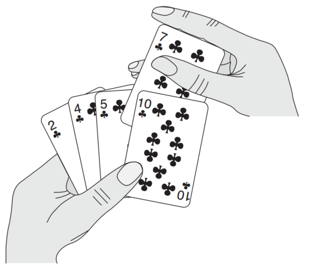

## Programa

- Correção de algoritmos
- Problema da Ordenação de Vetores
- Algoritmos Iterativos de Ordenação
- Algoritmos Recursivos de Ordenação
- Cálculo do Maior Divisor Comum

# Correção de algoritmos

##

"Uma demonstração de correção convincente será impossível enquanto o mecanismo seja visto como uma caixa preta, nossa única esperança é não considerar um mecanismo como uma caixa preta."

<br>

*Edsger W. Dijkstra.*  
*"Notes On Structured Programming", 1970*

## Introdução

::: {.incremental}
- *Def.* Um *algoritmo* é qualquer *procedimento computacional bem definido* que recebe um conjunto de valores como **entrada** e produz um conjunto de valores como **saída**.

- *Ferramenta:* Um algoritmo pode ser visto como uma ferramenta para resolver um problema.

- *Def.* Um algoritmo [resolve um problema]{style="color: red;"} se para toda entrada:
  - Ele [pára]{style="color: red;"}.
  - Retorna a saída [correta]{style="color: red;"}.

- *P.* Um algoritmo que não pára é útil?
- *P.* Um algoritmo incorreto é útil?
:::

## Correção de Algoritmos

::: {.incremental}
- Como discutido, um *algoritmo* é uma sequência de passos para a resolução de um *problema* ou *cálculo* de uma quantidade.
- Um *algoritmo* está *correto* quando a sua respectiva saída corresponde à solução ou quantidade esperada para todas as possíveis entradas.
- Exemplo de [algoritmo (incorreto)]{style="color: red;"} para calcular números primos
$$f(n) = n^2 + n + 41$$
(gera números primos somente enquanto $n < 40$)
- Antes de pensarmos no *custo do algoritmo*, é importante confirmar que ele *realmente* resolve o problema!
:::

## Testando a correção de algoritmos

::: {.incremental}
- Determinar a **correção** de algoritmos/programas pode depender muito da descrição do mesmo e de seu estilo.
- Uma primeira forma de aferir correção é **testar** o algoritmo para diversas entradas.
- Contudo, testes podem aferir a [presença de erros]{style="color: red;"}, mas não a [ausência]{style="color: red;"} dos mesmos (a menos que cubram todas as possíveis entradas - o que normalmente é impossível por questão de infinitude)
- Dessa forma, **provas** de correção são necessárias para garantir que algoritmos estejam corretos em relação ao problema que visam resolver.
:::

## Provando a correção de algoritmos

Algumas técnicas importantes para provar a correção de algoritmos:

::: {.incremental}
- Manipulação de identidades matemáticas e algébricas
- Técnicas de dedução da **lógica formal** (dedução direta, redução ao absurdo, contraposição, etc.)
- Técnicas envolvendo **recursão** e **indução matemática**
- Determinação de pré-condições, pós-condições, e aferição de **invariantes de laços**
:::

. . .

Além da resposta do algoritmo estar correta, é também necessário estipular a **garantia de terminação** do algoritmo (i.e. variantes para laços)

## Correção dos algoritmos vistos previamente

**Multiplicação de inteiros (Karatsuba)**:

- Correção baseada nas seguintes identidades algébricas
$$
\begin{array}{rl}
1234 \times 5678 & = (12 \cdot 10^2 + 34)(56 \cdot 10^2 + 78)\\
 & = (12\times56) \cdot 10^4 + (12\times78 + 34\times56)\cdot 10^2 + (34\times78) \\
(12+34)(56+78) & = (12\times56)+(12\times78)+(34\times56)+(34\times78) \\
\end{array}
$$

. . .

**Emparelhamento estável (Gale-Shapley)**:

- Correção baseada em um raciocínio por contradição (se a resposta do algoritmo não for um emparelhamento estável, é possível deduzir uma contradição lógica)

# Problema da Ordenação de Vetores

## Ordenação de Vetores

*Entrada.* Uma sequência de $k$ números $\langle a_1,a_2, \dots, a_k \rangle$.

<br>

*Objetivo.* Encontrar a permutação $\langle a_1',a_2', \dots, a_k' \rangle$ em que $a_1' \leq a_2' \leq \dots \leq a_k'$.

. . .

<br>

*Instância:* $\langle 31,41,59,26,41,58 \rangle$

- Satisfaz todas as restrições que impostas pela definição do problema.

<br>

*Solução.* $\langle 26, 31, 41, 41, 58, 59 \rangle$.

# Algoritmos Iterativos de Ordenação

## Ordenação por Inserção

Funciona da forma que um humano organiza uma mão jogando cartas:

:::: columns
::: {.column width="60%"}
::: {.incremental}
- Inicia com a mão da esquerda vazia e com as cartas viradas para baixo na mesa.
- Remove uma carta de cada vez e insere na posição correta na mão esquerda.
- Para encontrar a posição correta da carta, compara com as cartas que já estão na mão esquerda.
- **Invariante:** Em todo momento todas as cartas na mão esquerda estão ordenadas.
:::
:::
::: {.column width="35%"}
{width=100%}
:::
::::

## Visualização

<https://visualgo.net/en/sorting>

## Ordenação por Inserção (InsertionSort)

```pseudocode
#| html-line-number: true
#| html-no-end: true

\begin{algorithmic}
\Procedure{InsertionSort}{$A$}
  \State $n \gets \text{length}(A)$
  \For{$j \gets 2$ \To $n$}
    \State $\text{key} \gets A[j]$
    \State $i \gets j - 1$
    \While{$i > 0$ \textbf{ and } $A[i] > \text{key}$}
      \State $A[i + 1] \gets A[i]$
      \State $i \gets i - 1$
    \EndWhile
    \State $A[i+1] \gets \text{key}$
  \EndFor
\EndProcedure
\end{algorithmic}
```

**Obs:** nos pseudocódigos de todos os algoritmos desta aula, assumimos indexação de 1 a n (para vetores de tamanho n)

## Corretude

*Def.* Uma execução de um algoritmo é uma [sequência]{style="color: red;"} de estados com a propriedade de que:

- Tem um estado inicial; e
- Se $q$ e $r$ são estados consecutivos na [sequência]{style="color: red;"}, então $q \longrightarrow r$.

. . .

*Def.* Um estado é [alcançável]{style="color: red;"} se aparece em alguma execução.

. . .

*Def.* Uma [invariante]{style="color: red;"} é uma propriedade ${\color{green!50!black}P}$ para estados.

- Tal que se ${\color{green!50!black}P}(q)$, o estado $q$ possui a propriedade ${\color{green!50!black}P}$; e
- $q \longrightarrow r$; então
- ${\color{green!50!black}P}(r)$, o estado $r$ possui a propriedade ${\color{green!50!black}P}$.

. . .

*Principio da Invariante.* Se o estado inicial possui a invariante, então **todos os estados alcançáveis possuem a invariante**.

## Princípio da Invariante {.t}

<br>

*Item 1.* Define a propriedade.

. . .

*Item 2.* Prova que a propriedade se mantém para $q \longrightarrow r$.

. . .

*Item 3.* Prova que a propriedade se mantém para qualquer estado alcançável.

. . .

- Prova por indução.
- Caso Base.
- Passo de Indução.
- Assume $P(n)$ prova $P(n+1)$.

. . .

*Item 4.* Prova que o algoritmo termina.

. . .

*Item 5.* Conclui que o algoritmo resolve o problema.

## Corretude: InsertionSort

<br>

*$Ordenado(q)$.* A subsequência representada pelo estado $q$ de $j-1$ números $\langle a_1', a_2', \dots, a_{j-1}'\rangle$ obedece a restrição de que $a_1' \leq a_2' \leq \dots \leq a_{j-1}'$.

. . .

*Lema 1.* Para qualquer transição $q \longrightarrow r$, do algoritmo de Ordenação por Inserção, se $Ordenado(q)$ então $Ordenado(r)$.

. . .

*Prova.* A demonstração do lema segue da construção do loop while.

. . .

Durante a execução do loop, o algoritmo move para a direita $A[j - 1]$, $A[j - 2]$, $A[j - 3]$, e assim por diante, até que a posição correta de *key* é encontrada.

. . .

Nesse ponto $key$ é colocada na posição correta e a subsequência está ordenada.

$\blacksquare$

## InsertionSort: terminação

<br>

*Lema 2.* O algoritmo de Ordenação por Inserção termina.

. . .

*Prova.* O loop externo termina quando $j > n$, isso ocorre quando $j > A.length$ e $j$ é apenas incrementado durante o algoritmo.

$\blacksquare$

. . .

*Corolário.* O algoritmo de Ordenação por Inserção resolve o problema de ordenação.

. . .

*Prova.* Pelo *Lema 2*, sabemos que agoritmo termina depois de $n$ iterações. Pelo *Teorema 1* sabemos que toda subsequência alcançada pelo algoritmo está ordenada, como na iteração $n+1$ a subsequência corresponde a todo o vetor, então podemos concluir que o algoritmo resolve o problema.

$\blacksquare$

## Princípio da Invariante {.t}

<br>

*Item 1.* Define a propriedade.

. . .

*Item 2.* Prova que a propriedade se mantém para $q \longrightarrow r$.

. . .

*Item 3.* Prova que a propriedade se mantém para qualquer estado alcançável.

. . .

- Prova por indução.
- Caso Base.
- Passo de Indução.
- Assume $P(n)$ prova $P(n+1)$.

. . .

*Item 4.* Prova que o algoritmo termina.

. . .

*Item 5.* Conclui que o algoritmo resolve o problema.

## Princípio da Invariante: criador

:::: columns
::: {.column width="28%"}
{width=100%}
:::
::: {.column width="70%"}
::: {.incremental}
- Formulado por Robert W. Floyd na Carnegie-Mellon University em 1967.
- Jovem prodígio que nunca concluiu o doutorado.
- Principio simples e amplamente aplicável.
- Professor em Stanford e Prêmio Turing em $1978$.
- Robert W Floyd, por Donald E. Knuth: <http://oldwww.acm.org/pubs/membernet/stories/floyd.pdf>.
:::
:::
::::

## Ordenação por seleção (SelectionSort)

```pseudocode
#| html-line-number: true
#| html-no-end: true

\begin{algorithmic}
\Procedure{SelectionSort}{$A$}
  \State $n \gets \text{length}(A)$
  \For{$i \gets 1$ \To $n$}
    \State $m \gets i$
    \For{$j \gets i$ \To $n$}
      \If{$A[j] < A[m]$}
        \State $m \gets j$
      \EndIf
    \EndFor
    \State $\text{Swap}(A, i, m)$
  \EndFor
\EndProcedure
\end{algorithmic}
```

```pseudocode
#| html-line-number: true
#| html-no-end: true

\begin{algorithmic}
\Procedure{Swap}{$A, x, y$}
  \State $tmp \gets A[x]$
  \State $A[x] \gets A[y]$
  \State $A[y] \gets tmp$
\EndProcedure
\end{algorithmic}
```

## SelectionSort: Correção e Terminação

Qual a intuição por trás da construção do **SelectionSort?**

<br>

Determine:

1. O invariante do corpo do laço
2. O respectivo argumento de terminação

## SelectionSort: Correção e Terminação (Resolução)

::: {.incremental}
- **Invariante do laço:** No início de cada iteração $i$ (do laço externo), o subvetor $A[1 \dots i-1]$ contém os $i-1$ menores elementos do vetor original, e encontra-se **ordenado**.
- **Terminação:** O laço externo termina após $i = n$. Neste ponto, o subvetor $A[1 \dots n]$ conterá os $n$ menores elementos, significando que logo todo o vetor $A$ está **ordenado**. $\blacksquare$
:::

## BubbleSort

```pseudocode
#| html-line-number: true
#| html-no-end: true

\begin{algorithmic}
\Procedure{BubbleSort}{$A$}
  \State $n \gets \text{length}(A)$
  \For{$i \gets 1$ \To $n-1$}
    \For{$j \gets 1$ \To $n-i$}
      \If{$A[j] > A[j+1]$}
        \State $\text{Swap}(A, j, j+1)$
      \EndIf
    \EndFor
  \EndFor
\EndProcedure
\end{algorithmic}
```

## BubbleSort: Correção e Terminação

Qual a intuição por trás da construção do **BubbleSort?**

<br>

Determine:

1. O invariante do corpo do laço
2. O respectivo argumento de terminação

## BubbleSort: Correção e Terminação (Resolução)

::: {.incremental}
- **Invariante do laço:** No início da iteração $i$ do laço externo ($1 \le i \le n-1$), os $i-1$ maiores elementos do vetor original já estão em suas posições finais, ocupando exatamente as posições
$$A[n-(i-1)+1], A[n-(i-1)+2], \dots, A[n],$$
isto é, o subvetor
$$A[n-i+2 \dots n],$$
e esses elementos estão **ordenados**.

- **Terminação:** O laço externo executa para $i=1,2,\dots,n-1$. Quando ele termina, os $n-1$ maiores elementos estão em suas posições finais ($A[2],\dots,A[n]$). O único elemento restante ocupa $A[1]$, portanto todo o vetor $A$ está **ordenado**. $\blacksquare$
:::

# Algoritmos Recursivos de Ordenação

## MergeSort

**MergeSort** é um dos mais famosos e eficientes algoritmos de ordenação baseado em comparações.

<br>

A sua ideia fundamental é uma rotina que une **duas listas ordenadas** em uma **lista maior ordenada** (merge).

<br>

O algoritmo divide a entrada ao meio até chegar ao caso base (vetor de tamanho 1 -- trivialmente ordenado), e após recombina os vetores ordenados.

## MergeSort: ideia principal

```pseudocode
#| html-line-number: true
#| html-no-end: true

\begin{algorithmic}
\Procedure{MergeSort}{$A$}
  \If{$\text{length}(A) < 2$}
    \Return $A$
  \Else
    \State $r_1 \gets \text{MergeSort}(\text{FirstHalf}(A))$
    \State $r_2 \gets \text{MergeSort}(\text{SecondHalf}(A))$
    \Return $\text{Merge}(r_1, r_2)$
  \EndIf
\EndProcedure
\end{algorithmic}
```

<br>

No pseudocódigo acima, as rotinas $\text{FirstHalf}$ e $\text{SecondHalf}$ extraem a primeira e segunda metade do vetor, respectivamente, e $\text{Merge}$ une dois vetores ordenados em um único vetor ordenado.

<br>

Implementações eficientes de **MergeSort** requerem o uso de um vetor auxiliar e manipulação de índices (para que os cortes tenham custo constante).

## MergeSort: main (eficiente)

```pseudocode
#| html-line-number: true
#| html-no-end: true

\begin{algorithmic}
\Procedure{MergeSort}{$A, \textit{start}, \textit{end}$}
  \If{$\textit{start} < \textit{end}$}
    \State $\textit{mid} \gets \lfloor (\textit{start} + \textit{end}) / 2 \rfloor$
    \State $\text{MergeSort}(A, \textit{start}, \textit{mid})$
    \State $\text{MergeSort}(A, \textit{mid}+1, \textit{end})$
    \State $\text{Merge}(A, \textit{start}, \textit{mid}, \textit{end})$
  \EndIf
\EndProcedure
\end{algorithmic}
```

<br>

Observações:

- $\textit{start}$ e $\textit{end}$ representam os índices de início e fim da parte do vetor a ser ordenado.
- para ordenar o vetor inteiro, necessário chamar $\text{MergeSort}(1, \text{length}(A))$

## MergeSort: merge (eficiente)

:::: columns
::: {.column width="48%"}
```pseudocode
#| html-line-number: true
#| html-no-end: true

\begin{algorithmic}
\Procedure{Merge}{$A, \textit{start}, \textit{mid}, \textit{end}$}
  \For{$i \gets \textit{start}$ \To $\textit{end}$}
    \State $\textit{Aux}[i] \gets A[i]$
  \EndFor
  \State $i \gets \textit{start}$
  \State $j \gets \textit{mid}+1$
  \State $k \gets \textit{start}$
  \While{$i \leq \textit{mid}$ \textbf{ and } $j \leq \textit{end}$}
    \If{$\textit{Aux}[i] < \textit{Aux}[j]$}
      \State $A[k] \gets \textit{Aux}[i]$
      \State $i \gets i+1$
    \Else
      \State $A[k] \gets \textit{Aux}[j]$
      \State $j \gets j+1$
    \EndIf
    \State $k \gets k+1$
  \EndWhile
  \While{$i \leq \textit{mid}$}
    \State $A[k] \gets \textit{Aux}[i]$
    \State $i \gets i+1$
    \State $k \gets k+1$
  \EndWhile
  \While{$j \leq \textit{end}$}
    \State $A[k] \gets \textit{Aux}[j]$
    \State $j \gets j+1$
    \State $k \gets k+1$
  \EndWhile
\EndProcedure
\end{algorithmic}
```
:::
::: {.column width="48%"}
Observações:

- Há um vetor auxiliar $\textit{Aux}$ que recebe a porção do vetor a ser ordenada (linhas 1-2), contendo os dois subvetores já ordenados (de $\textit{start}$ a $\textit{mid}$, e de $\textit{mid}+1$ a $\textit{end}$)
- $i$ aponta para o início do primeiro subvetor ordenado em $\textit{Aux}$ (inicia com $\textit{start}$)
- $j$ aponta para o início do segundo subvetor ordenado em $\textit{Aux}$ (inicia com $\textit{mid}+1$)
- $k$ aponta para a posição onde os elementos dos dois subvetores serão inseridos em $A$ (inicia com $\textit{start}$)
- o laço das linhas 6-12 compara o menor de cada subvetor, inserindo na posição correta do vetor de saída (e atualizando os índices)
- o laço das linhas 13-16 e 17-20 copiam os elementos de um dos subvetores quando o outro subvetor já terminou.
:::
::::

## MergeSort: Correção e Terminação

Para determinar a correção do **MergeSort** utilizamos **indução estrutural em sequências de números**.

- determinar que o algoritmo é correto para os casos-base (onde a recursão não é chamada)
- assumindo que chamadas do algoritmo sobre **sequências menores** que a atual provêm a resposta correta, provar que a saída calculada para a sequência atual é **correta**.

## QuickSort

**QuickSort** é outro algoritmo famoso e bastante utilizado.

<br>

- **Pivô:** escolha de um elemento arbitrário da sequência.
- **Particionamento:** formação de dois subvetores (elementos $\le$ pivô e elementos $>$ pivô).
- **Recursão:** ordenação recursiva dos subvetores utilizando o próprio algoritmo.
- **Desempenho:** caso médio similar ao **MergeSort**; pior caso com custo $O(n^2)$.
- **Espaço:** não requer alocação de memória adicional.

## QuickSort: Ideia Principal

```pseudocode
#| html-line-number: true
#| html-no-end: true

\begin{algorithmic}
\Procedure{QuickSort}{$A$}
  \If{$\text{length}(A) < 2$}
    \Return $A$
  \Else
    \State $p \gets \text{ExtraiPivo}(A)$
    \State $m_1 \gets \text{QuickSort}(\text{MenoresOuIguais}(A, p))$
    \State $m_2 \gets \text{QuickSort}(\text{Maiores}(A, p))$
    \Return $m_1 \mathbin{+\!\!+} \langle p \rangle \mathbin{+\!\!+} m_2$
  \EndIf
\EndProcedure
\end{algorithmic}
```

::: {.incremental}
- No pseudocódigo acima, a operação $+\!\!+$ significa concatenação de vetores e $\langle p \rangle$ um vetor unitário contendo $p$.

<br>

- Similarmente ao **MergeSort**, implementações eficientes de **QuickSort** requerem a minimização da movimentação de dados por meio do uso de índices e reaproveitamento do espaço do próprio vetor sendo ordenado.
:::

## QuickSort: main (eficiente)

```pseudocode
#| html-line-number: true
#| html-no-end: true

\begin{algorithmic}
\Procedure{QuickSort}{$A, \textit{start}, \textit{end}$}
  \If{$\textit{start} < \textit{end}$}
    \State $p \gets \text{Partition}(A, \textit{start}, \textit{end})$
    \State $\text{QuickSort}(A, \textit{start}, p-1)$
    \State $\text{QuickSort}(A, p+1, \textit{end})$
  \EndIf
\EndProcedure
\end{algorithmic}
```

Observações:

- a rotina $\text{Partition}$ executa ao mesmo tempo a *extração do pivô* e o particionamento dos demais valores, devolvendo o índice $p$ do pivô. Os elementos anteriores à $p$ são menores que o pivô, e os posteriores à $p$, maiores.
- para ordenar todo o vetor, a chamada inicial é $\text{QuickSort}(1, \text{length}(A))$

## QuickSort: partition (eficiente)

:::: columns
::: {.column width="48%"}

<br><br>

```pseudocode
#| html-line-number: true
#| html-no-end: true

\begin{algorithmic}
\Procedure{Partition}{$A, \textit{start}, \textit{end}$}
  \State $x \gets A[\textit{end}]$
  \State $i \gets \textit{start} - 1$
  \For{$j \gets \textit{start}$ \To $\textit{end}-1$}
    \If{$A[j] \leq x$}
      \State $i \gets i + 1$
      \State $\text{Swap}(A, i, j)$
    \EndIf
  \EndFor
  \State $\text{Swap}(A, i+1, \textit{end})$
  \Return $i+1$
\EndProcedure
\end{algorithmic}
```
:::
::: {.column width="48%"}
::: {.incremental}
Observações:

- $x$ é o pivô (aqui extraído da última posição)
- $i$ é o índice do **último** valor menor ou igual a $x$
- o laço 3-6 faz $j$ percorrer todo vetor do início ao fim (excluindo $\textit{end}$). Se encontra um valor menor ou igual a $x$, o joga para o início por meio de uma troca e ajusta o índice $i$
- ao final, faz uma troca para posicionar o pivô após $i$ e devolve o seu índice
:::
:::
::::

## QuickSort: Correção e Terminação

Tal qual no caso do **MergeSort**, utilizamos **indução** para demonstrar a correção do **QuickSort**.

<br>

Determine:

1. argumentos para a correção do QuickSort
2. argumentos para a terminação do QuickSort

# Cálculo do Maior Divisor Comum

## Maior Divisor Comum

Dados dois números naturais $a$ e $b$, dizemos que $a$ é um **divisor** de $b$ se **existir** um natural $k$ tal que
$$a \times k = b$$

. . .

*Notação:* denotamos $a \mid b$ para indicar que $a$ é divisor de $b$, e $a \nmid b$ quando não é.

<br>

*Exemplos:*

:::: columns
::: {.column width="33%"}
- $0\mid 0$
- $5\mid 0$
- $1\mid 1$
:::
::: {.column width="33%"}
- $2\mid 4$
- $3\mid 3$
- $3\mid 15$
:::
::: {.column width="33%"}
- $3\nmid 4$
- $0 \nmid 1$
- $2\nmid 5$
:::
::::

## Divisores de um Número

Para $n>0$, podemos calcular **todos os seus divisores** testando a divisibilidade dos números de $1$ a $n$:

*Exemplo:*  
divisores(0) = $\{ 0, 1, 2, 3, 4, \ldots \}$  
divisores(1) = $\{ 1 \}$  
divisores(2) = $\{ 1, 2 \}$  
divisores(10) = $\{ 1, 2, 5, 10 \}$  
divisores(12) = $\{ 1, 2, 3, 4, 6, 12 \}$  
divisores(15) = $\{ 1, 3, 5, 15 \}$  
divisores(11) = $\{ 1, 11 \}$  

<br>

*Observação* $1$ e $n$ são sempre divisores de $n$. Quando um número tem *exatamente* dois divisores, dizemos que ele é [primo]{style="color: red;"}.

## Maior Divisor Comum

Dados dois números $a$ e $b$, definimos o [maior divisor comum]{style="color: red;"} $MDC(a,b)$ como o maior $x$ tal que $(x\mid a)$ e $(x \mid b)$.

<br>

*Exemplos:*  
Já que  
~~divisores(10) = $\{ 1, 2, \mathbf{5}, 10 \}$~~  
~~divisores(15) = $\{ 1, 3, \mathbf{5}, 15 \}$~~  
temos MDC(10,15) = 5  
MDC(10,9) = 1  
MDC(10,36) = 2  
MDC(0,5) = 5  

<br>

Quando $MDC(a,b) = 1$, dizemos que $a$ e $b$ são [primos entre si]{style="color: red;"}.

## Máximo divisor comum: algoritmo trivial

```pseudocode
#| html-line-number: true
#| html-no-end: true

\begin{algorithmic}
\Procedure{MDC1}{$a, b$}
  \State $\textit{mdc} \gets 1$
  \For{$x \gets 1$ \To $\min(a,b)$}
    \If{$(x \mid a)$ \textbf{ and } $(x \mid b)$}
      \State $\textit{mdc} \gets x$
    \EndIf
  \EndFor
  \Return $\textit{mdc}$
\EndProcedure
\end{algorithmic}
```

Determine:

- correção de MDC1
- terminação de MDC1

Sobre o desempenho de MDC: quantos passos esse algoritmo executa (no melhor e no pior caso)?

## Máximo divisor comum: algoritmo trivial melhorado

```pseudocode
#| html-line-number: true
#| html-no-end: true

\begin{algorithmic}
\Procedure{MDC2}{$a, b$}
  \State $x \gets \min(a,b)$
  \While{$x > 0$}
    \If{$(x \mid a)$ \textbf{ and } $(x \mid b)$}
      \Return $x$
    \EndIf
    \State $x \gets x - 1$
  \EndWhile
\EndProcedure
\end{algorithmic}
```

Determine:

- correção de MDC2
- terminação de MDC2

Sobre o desempenho de MDC2: quantos passos esse algoritmo executa (no melhor e no pior caso)?

## Algoritmo de Euclides para MDC

O Algoritmo de Euclides é um método eficiente para cálculo do MDC de dois números.

<br>

Um dos mais antigos algoritmos da história ainda em uso, foi descrito no livro **Os Elementos** de Euclides (por volta de 300 A.C.).

<br>

A sua primeira formulação foi baseada na seguinte observação, assumindo $a>b$:

$$MDC(a,b) = MDC(a-b,b)$$

*Pergunta:* você consegue justificar por que a identidade acima vale?

## Identidade fundamental (1)

Vamos mostrar que, se $a>b$, temos $MDC(a,b) = MDC(a-b,b)$.

Para isso, assumimos $x = MDC(a,b)$ e precisamos mostrar duas coisas:

- $(x \mid a-b)$ ($x$ é divisor comum de $a-b$ e $b$)
- se $(y \mid b)$ e $(y \mid a-b)$, então $x\geq y$ ($x$ é o maior deles)

. . .

*Lema 1:* $(x \mid a-b)$  
Prova:

. . .

1. como $(x \mid a)$, temos $x \cdot k_1 = a$ (para algum $k_1$)
2. como $(x \mid b)$, temos $x \cdot k_2 = b$ (para algum $k_2$)
3. logo, $(a-b) = (x \cdot k_1 - x \cdot k_2) = x \cdot (k_2-k_1)$
4. portanto, $(x \mid a-b)$ (observe que $k_2-k_1>0$ pois $a>b$). $\square$

## Identidade fundamental (2)

Assuma $x = MDC(a,b)$

<br>

*Lema 2:* se $(y \mid b)$ e $(y \mid a-b)$, então $x \geq y$

Prova:

. . .

1. premissa 1 é $(y \mid b)$, isto é, $y \cdot c_1 = b$
2. premissa 2 é $(y \mid a-b)$, isto é, $y \cdot c_2 = a-b$
3. note que $a = b + (a-b) = y \cdot c_1 + y \cdot c_2 = y*(c_1 + c_2)$.
4. logo, $(y \mid a)$.
5. como $(y \mid b)$ e $(y \mid a)$, temos $x \geq y$ pela definição de $MDC(a,b)$ $\square$

## Algoritmo de Euclides (primeira versão)

```pseudocode
#| html-line-number: true
#| html-no-end: true

\begin{algorithmic}
\Procedure{Euclides1}{$a, b$}
  \While{$a \neq 0$ \textbf{ and } $b \neq 0$}
    \If{$a \geq b$}
      \State $(a, b) \gets (a-b, b)$
    \Else
      \State $(a, b) \gets (b-a, a)$
    \EndIf
  \EndWhile
  \If{$a = 0$}
    \Return $b$
  \Else
    \Return $a$
  \EndIf
\EndProcedure
\end{algorithmic}
```

<br>

*Demonstração do algoritmo no computador.*

<br>

*Pergunta:* podemos fazer melhor?

## Acelerando o algoritmo

Considere a execução da primeira versão do algoritmo de Euclides para os valores 45 e 12:

:::: columns
::: {.column width="48%"}
45 12  
33 12

. . .

21 12

. . .

9 12 ~~$\gets$ olhe aqui!~~

. . .

3 9

. . .

6 3

. . .

3 3

. . .

3 0

. . .

MDC = 3
:::
::: {.column width="48%"}
. . .

O valor 9 corresponde ao **resto da divisão de 45 por 12**, pois é o momento onde a subtração sucessiva do primeiro pelo segundo para (e a partir daí os números trocam de posição).

. . .

Se o resto da divisão é 0, sabemos que $MDC(0,n) = n$ (para $n>0$).

<br>

Podemos usar o resto da divisão do maior pelo menor para pular passos e ter um algoritmo mais eficiente!
:::
::::

## Algoritmo de Euclides (versão otimizada)

```pseudocode
#| html-line-number: true
#| html-no-end: true

\begin{algorithmic}
\Procedure{Euclides2}{$a, b$}
  \While{$a \neq 0$ \textbf{ and } $b \neq 0$}
    \If{$a \geq b$}
      \State $(a, b) \gets (b, a \bmod b)$
    \Else
      \State $(a, b) \gets (a, b \bmod a)$
    \EndIf
  \EndWhile
  \If{$a = 0$}
    \Return $b$
  \Else
    \Return $a$
  \EndIf
\EndProcedure
\end{algorithmic}
```

<br>

*Demonstração do algoritmo no computador.*

## Execução da versão otimizada

Execução da segunda versão do algoritmo de Euclides para os valores 45 e 12:

:::: columns
::: {.column width="48%"}
<br>

45 12  
12 9  
9 3  
3 0  
MDC = 3
:::
::: {.column width="48%"}
<br>

Determine:

- correção de **Euclides2**
- terminação de **Euclides2**
:::
::::

Foi provado em 1844 por Gabriel Lamé que o número de passos requeridos para calcular **Euclides2(a,b)** é menor que $5n$, sendo $n$ o número de dígitos decimais de $\min(a,b)$.

## Algoritmo de Euclides (otimizado, versão recursiva)

```pseudocode
#| html-line-number: true
#| html-no-end: true

\begin{algorithmic}
\Procedure{Euclides3}{$a, b$}
  \If{$b = 0$}
    \Return $a$
  \Else
    \Return $\text{Euclides3}(b, a \bmod b)$
  \EndIf
\EndProcedure
\end{algorithmic}
```

<br>

**Observação:** Ao chamar $\text{Euclides3}(a,b)$ com $a<b$, o algoritmo acaba chamando $\text{Euclides3}(b,a)$ pois $a\bmod b=a$. Desta forma, garantidamente o segundo argumento se torna o menor dos dois e alcançará o valor $0$ primeiro.

## Aplicações do algoritmo de Euclides (otimizado)

::: {.incremental}
1. simplificar uma fração $\frac{a}{b}$ dividindo o numerador e o denominador por $MDC(a,b)$:

$$\frac{45}{12} = \frac{45 \div 3}{12 \div 3} = \frac{15}{4}$$

<br>

2. calcular o MMC (mínimo múltiplo comum) de dois números, dado que

$MMC(a,b) = (a \times b) \div MDC(a,b)$

$$MMC(45,12) = (45 \times 12) / 3 = 180$$

<br>

3. além de diversas aplicações em teoria dos números e criptografia $\ldots$
:::

#

::: {style="text-align: center; margin-top: 15vh;"}
[?]{style="font-size: 5em; color: #d10000; font-weight: 700;"}
:::
