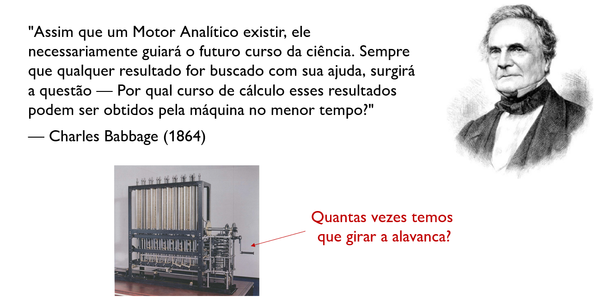
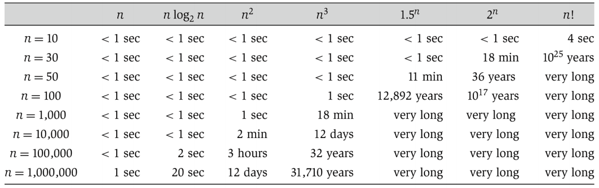
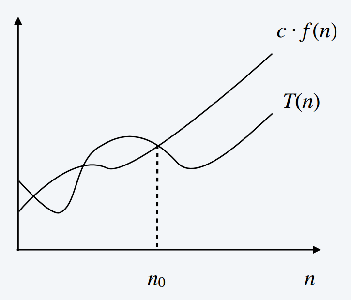

# Medindo o Custo de Algoritmos

## Como Medir o Custo de um Algoritmo?

Quando analisamos algoritmos, precisamos de uma métrica de **custo**.

Mas **o que** exatamente devemos medir?

. . .

**Possíveis Medidas:**

::: {.incremental}
- Tempo de execução (*ms, segundos, minutos, dias, anos*)
- Espaço utilizado na memória (*bits, KB, MB, GB, TB*)
- Consumo de energia (*kWh*)
- Custos financeiros (\$, R\$, £, ¥)
- Outros recursos (rede, *hardware* especializado, etc.)
:::

. . .

[**P:**]{.label-qstn} Qual dessas medidas é a mais relevante para analisar algoritmos?

## Modelo de Computação

> [**Modelo RAM (Random Access Machine):**]{.label-def}

::: {.incremental}
- Vamos assumir um computador genérico, que executa operações em sequência, sem paralelismo.
- E se o processador tem uma instrução para ordenação? Ordenação $O(1)$? **Não realístico.**
- Exponenciação é operação de tempo constante?
  - Pode ser implementado com *shift-right/shift-left*.
  - Vamos assumir que $2^k$ tem tempo constante para $k$ pequeno.
- Não vamos considerar hierarquia de memória.
:::

## Modelo RAM (Random Access Machine)


> [**Obs.**]{.label-rmk} Em geral é desnecessário definir o custo de cada instrução, assumimos um [custo constante]{.red} para qualquer instrução.

. . .

> [**Def.**]{.label-def} Toda operação simples leva tempo constante:
>
>  - Adição, subtração, multiplicação, divisão, $\dots$
>  - Movimentos de dados (acesso e escrita na memória).
>  - Controle condicional.

. . .

> [**Obs.**]{.label-rmk} Operações complexas não levam tempo constante:
>
>  - *Loops*.
>  - Chamadas a sub-rotinas como ordenação.

## Análise de Algoritmos

[**P:**]{.label-qstn} Como analisar o tempo de execução de um algoritmo?

<br>

. . .


> [**Obs.**]{.label-rmk} O tempo requerido por um algoritmo depende da **entrada**:
>
>  - Ordenar 100.000 números leva mais tempo que ordenar 3 números.

. . .

<br>
Precisamos levar o [tamanho da entrada]{.red} em consideração.

## Análise de Algoritmos: Tamanho da Entrada

> [**Tamanho da Entrada:**]{.label-def}
>
>  - Depende do problema a ser estudado.
>  - Geralmente o número de itens na entrada (números).
>  - Multiplicar dois números inteiros: número de bits.
>  - Pode ser descrito por mais de um número: grafos ($V$ e $E$).

. . .

[**P:**]{.label-qstn} Qual o tamanho da entrada de um Cubo Mágico?

## Análise de Algoritmos: Tempo de Execução

> [**Def. (Tempo de Execução):**]{.label-def} Para uma entrada específica, é o número de instruções primitivas (*steps*) executadas.

. . .

Instruções independentes de máquina:

- Cada linha $i$ custa tempo constante $\textcolor{red}{c_i}$.
- Uma linha que custa $\textcolor{red}{c_i}$ e é executada $n$ vezes vai contribuir $\textcolor{red}{c_i} \cdot n$.

. . .

> $T(n) =$ número de instruções executadas para entrada de tamanho $n$.

## Laços (Loops)

O teste do laço é executado uma vez a mais que o conteúdo do bloco:

<br>

```pseudocode
#| html-line-number: true
#| html-no-end: true

\begin{algorithmic}
\Procedure{Zera-Vetor}{$A, n$}
  \For{$j \gets 1$ \To $n$} \Comment{Executa $n + 1$ vezes}
    \State $A[j] \gets 0$ \Comment{Executa $n$ vezes}
  \EndFor
\EndProcedure
\end{algorithmic}
```

<br>

```pseudocode
#| html-line-number: true
#| html-no-end: true

\begin{algorithmic}
\Procedure{Exemplo-While}{$j$}
  \While{$j > 0$} \Comment{Executa $X + 1$ vezes}
    \State $j \gets \dots$ \Comment{Executa $X$ vezes}
  \EndWhile
\EndProcedure
\end{algorithmic}
```

# Análise do Insertion Sort

## Ordenação por Inserção (Insertion Sort)

:::: columns
::: {.column width="53%"}

```pseudocode
#| html-line-number: true
#| html-no-end: true

\begin{algorithmic}
\Procedure{InsertionSort}{$A$}
  \For{$j \gets 2$ \To $\text{length}(A)$}
    \State $key \gets A[j]$
    \State \Comment{Insere $A[j]$ em $A[1 \dots j-1]$}
    \State $i \gets j-1$
    \While{$i > 0$ \And $A[i] > key$}
      \State $A[i+1] \gets A[i]$
      \State $i \gets i-1$
    \EndWhile
    \State $A[i+1] \gets key$
  \EndFor
\EndProcedure
\end{algorithmic}
```

:::
::: {.column width="47%"}

<table>
<thead>
<tr>
<th><strong>Linha</strong></th>
<th><strong>Custo</strong></th>
<th><strong>Repetições</strong></th>
</tr>
</thead>
<tbody>
<tr class="fragment">
<td>1.</td>
<td>$\textcolor{red}{c_1}$</td>
<td>$n$</td>
</tr>
<tr class="fragment">
<td>2.</td>
<td>$\textcolor{red}{c_2}$</td>
<td>$n-1$</td>
</tr>
<tr class="fragment">
<td>3.</td>
<td>$0$</td>
<td>$n-1$</td>
</tr>
<tr class="fragment">
<td>4.</td>
<td>$\textcolor{red}{c_4}$</td>
<td>$n-1$</td>
</tr>
<tr class="fragment">
<td>5.</td>
<td>$\textcolor{red}{c_5}$</td>
<td>$\sum_{j=2}^n t_j$</td>
</tr>
<tr class="fragment">
<td>6.</td>
<td>$\textcolor{red}{c_6}$</td>
<td>$\sum_{j=2}^n (t_j - 1)$</td>
</tr>
<tr class="fragment">
<td>7.</td>
<td>$\textcolor{red}{c_7}$</td>
<td>$\sum_{j=2}^n (t_j - 1)$</td>
</tr>
<tr class="fragment">
<td>8.</td>
<td>$\textcolor{red}{c_8}$</td>
<td>$n-1$</td>
</tr>
</tbody>
</table>

:::
::::

. . .

$t_j$: nº de repetições do laço da linha 5 para aquele valor de $j$.

## Ordenação por Inserção (Insertion Sort)

Somando todos os custos:

$$T(n) = \textcolor{red}{c_1} n + \textcolor{red}{c_2}(n-1) + 0(n-1) + \textcolor{red}{c_4}(n-1) + \textcolor{red}{c_5} \sum_{j=2}^n t_j + \\ \textcolor{red}{c_6} \sum_{j=2}^n (t_j - 1) + \textcolor{red}{c_7} \sum_{j=2}^n (t_j - 1) + \textcolor{red}{c_8}(n-1)$$

<br>

> [**Problema:**]{.red} Como nos livramos de $t_j$? O valor de $t_j$ para cada $j$ depende da sequência de entrada, que não temos como saber *a priori*.

. . .

> [**Solução:**]{.label-def} Podemos analisar o [melhor]{style="color: green;"} e o [pior]{.red} caso! Isto é, podemos inferir limites inferiores e limites superiores para $t_j$.

## Ordenação por Inserção (Insertion Sort)

::: {.incremental}
- **Melhor Caso:** $t_j = 1$
- $A[i] \le key$
- Sequência já ordenada!
:::

. . .

$$
\begin{align*}
T(n) &= \textcolor{red}{c_1} n + \textcolor{red}{c_2}(n-1) + 0(n-1) + \textcolor{red}{c_4}(n-1) + \textcolor{red}{c_5} \sum_{j=2}^n t_j + \\
     &\quad \textcolor{red}{c_6} \sum_{j=2}^n (t_j - 1) + \textcolor{red}{c_7} \sum_{j=2}^n (t_j - 1) + \textcolor{red}{c_8}(n-1)
\end{align*}
$$

## Ordenação por Inserção (Insertion Sort)

- **Melhor Caso:** $t_j = 1$
- Sequência já ordenada! $A[i] \le key$

$$
\begin{align*}
T(n) &= \textcolor{red}{c_1} n + \textcolor{red}{c_2}(n-1) + 0(n-1) + \textcolor{red}{c_4}(n-1) + \textcolor{red}{c_5} \sum_{j=2}^n 1 + \\ 
     &\textcolor{red}{c_6} \sum_{j=2}^n (1 - 1) + \textcolor{red}{c_7} \sum_{j=2}^n (1 - 1) + \textcolor{red}{c_8}(n-1)\\
     &= \textcolor{red}{c_1} n + \textcolor{red}{c_2}(n-1) + \textcolor{red}{c_4}(n-1) + \textcolor{red}{c_5}(n-1) + \textcolor{red}{c_8}(n-1) \\
     &= (\textcolor{red}{c_1} + \textcolor{red}{c_2} + \textcolor{red}{c_4} + \textcolor{red}{c_5} + \textcolor{red}{c_8})n - (\textcolor{red}{c_2} + \textcolor{red}{c_4} + \textcolor{red}{c_5} + \textcolor{red}{c_8}) \\
     &= \textcolor{#7c3aed}{a} \cdot n + \textcolor{#7c3aed}{b}
\end{align*} 
$$

. . .

Lembrando que $\sum_{j=2}^{n} 1 = n - 1$.

> [**Melhor Caso:**]{.label-def} **Função linear** em $n$.

## Ordenação por Inserção (Insertion Sort)

::: {.incremental}
- **Pior Caso:** $t_j = j$
- $A[i] > key$ **sempre**
- Sequência ordenada em [ordem reversa!]{.red}
:::

. . .

$$\sum_{j=2}^n j = \frac{n(n+1)}{2} - 1 \quad \text{e} \quad \sum_{j=2}^n (j-1) = \frac{n(n-1)}{2}$$

. . .

$$
\begin{align*}
T(n) &= \textcolor{red}{c_1} n + \textcolor{red}{c_2} (n-1) + \textcolor{red}{c_4} (n-1) + \textcolor{red}{c_5} \left(\frac{n(n+1)}{2}-1\right) + \\ 
     &=\textcolor{red}{c_6} \left(\frac{n(n-1)}{2}\right) + \textcolor{red}{c_7} \left(\frac{n(n-1)}{2}\right) + \textcolor{red}{c_8} (n-1) \\
     &= \left( \frac{\textcolor{red}{c_5}}{2} + \frac{\textcolor{red}{c_6}}{2} + \frac{\textcolor{red}{c_7}}{2} \right) n^2 + \left( \textcolor{red}{c_1} + \textcolor{red}{c_2} + \textcolor{red}{c_4} + \frac{\textcolor{red}{c_5}}{2} - \frac{\textcolor{red}{c_6}}{2} - \frac{\textcolor{red}{c_7}}{2} + \textcolor{red}{c_8} \right) n  - (\textcolor{red}{c_2} + \textcolor{red}{c_4} + \textcolor{red}{c_5} + \textcolor{red}{c_8})\\
     &= \textcolor{#7c3aed}{a} n^2 + \textcolor{#7c3aed}{b} n + \textcolor{#7c3aed}{c}
\end{align*}
$$

## Ordenação por Inserção (Insertion Sort)

**Pior Caso:** $t_j = j$

. . .

> [**Pior Caso:**]{.alert} **Função quadrática** em $n$.

. . .

::: {.incremental}
- $\textcolor{#7c3aed}{a}$, $\textcolor{#7c3aed}{b}$ e $\textcolor{#7c3aed}{c}$ dependem do custo das instruções ($\textcolor{red}{c_i}$).
- $T(n) = n^2$?
- Não é igual, mas cresce como $n^2$.
- $T(n) \sim n^2$ (**ordem de crescimento**).
:::

# Análise de Algoritmos

## Análise de Algoritmos

[**P:**]{.label-qstn} Por que o pior caso?

. . .

> [**Obs.**]{.label-rmk} Nós em geral nos preocupamos em encontrar o tempo de execução do [pior caso]{.red}:
>
>  - O maior tempo de execução para **qualquer entrada** de tamanho $n$.
>  - O pior caso dá uma garantia para **qualquer entrada**.
>  - Para alguns algoritmos o pior caso ocorre com frequência:
>    - Exemplo: busca de um item não presente em um vetor.

. . .

[**P:**]{.label-qstn} Alternativas ao pior caso?

## Análise de Algoritmos

[**P:**]{.label-qstn} Qual é o caso médio do algoritmo de Ordenação por Inserção?

. . .

> [**Obs.**]{.label-rmk} Para ordenar um vetor ordenado randomicamente com elementos distintos:
>
>  - Em média $A[j]$ é menor que metade dos elementos em $A[1 \dots j-1]$.
>  - Assim, o algoritmo deve comparar o elemento com metade dos elementos até encontrar a posição de $key$.

. . .

> [**Obs.**]{.label-rmk} Então $t_j = \frac{j}{2}$, isso é aproximadamente metade do pior caso, mas ainda é uma [função quadrática]{.red}.

. . .

[**P:**]{.label-qstn} Quais instâncias aparecem no mundo real?

## Busca em Vetor Não Ordenado

No nosso caso, abstraímos com unidades constantes de computação.

```pseudocode
#| html-line-number: true
#| html-no-end: true

\begin{algorithmic}
\Procedure{Busca-Linear}{$x,\ A[1..n]$}
  \For{$i \gets 1$ \To $n$}
    \If{$A[i] = x$}
      \Return $i$
    \EndIf
  \EndFor
  \Return \textsc{Não-Encontrado}
\EndProcedure
\end{algorithmic}
```

*Passos unitários contados:*

- leitura de $A[i]$
- comparação $A[i]{=}x$
- incremento de $i$
- **return**

> [**Obs.**]{.label-rmk} Nessa disciplina, também iremos considerar unidades constantes de armazenamento para analisar a complexidade de espaço.

## Busca em Vetor Não Ordenado

```pseudocode
#| html-line-number: true
#| html-no-end: true

\begin{algorithmic}
\Procedure{Busca-Linear}{$x,\ A[1..n]$}
  \For{$i \gets 1$ \To $n$}
    \If{$A[i] = x$}
      \Return $i$
    \EndIf
  \EndFor
  \Return \textsc{Não-Encontrado}
\EndProcedure
\end{algorithmic}
```

<br>

**Exemplo:** Procurar $x=23$ em $A[1..10]$

| Índice | 1 | 2 | 3 | 4 | 5 | 6 | 7 | 8 | 9 | 10 |
|--------|---|---|---|---|---|---|---|---|---|---|
| Valor  | 42 | 7 | 85 | 13 | 66 | 90 | **23** | 5 | 77 | 31 |

## Busca em Vetor Não Ordenado

```pseudocode
#| html-line-number: true
#| html-no-end: true

\begin{algorithmic}
\Procedure{Busca-Linear}{$x,\ A[1..n]$}
  \For{$i \gets 1$ \To $n$}
    \If{$A[i] = x$}
      \Return $i$
    \EndIf
  \EndFor
  \Return \textsc{Não-Encontrado}
\EndProcedure
\end{algorithmic}
```

<br>


**Exemplo:** Procurar $x=42$ em $A[1..10]$

| Índice | 1 | 2 | 3 | 4 | 5 | 6 | 7 | 8 | 9 | 10 |
|--------|---|---|---|---|---|---|---|---|---|---|
| Valor  | **42** | 7 | 85 | 13 | 66 | 90 | 23 | 5 | 77 | 31 |

## Busca em Vetor Não Ordenado

```pseudocode
#| html-line-number: true
#| html-no-end: true

\begin{algorithmic}
\Procedure{Busca-Linear}{$x,\ A[1..n]$}
  \For{$i \gets 1$ \To $n$}
    \If{$A[i] = x$}
      \Return $i$
    \EndIf
  \EndFor
  \Return \textsc{Não-Encontrado}
\EndProcedure
\end{algorithmic}
```

<br>


**Exemplo:** Procurar $x=15$ em $A[1..10]$

| Índice | 1 | 2 | 3 | 4 | 5 | 6 | 7 | 8 | 9 | 10 |
|--------|---|---|---|---|---|---|---|---|---|---|
| Valor  | 42 | 7 | 85 | 13 | 66 | 90 | 23 | 5 | 77 | 31 |

## Qual Caso Devemos Considerar?

- **Melhor Caso:** quando encontramos o elemento logo na primeira comparação.

- **Pior Caso:** quando precisamos examinar todos os elementos do vetor.

- **Caso Médio:** quando o elemento pode aparecer em qualquer posição com igual probabilidade.

. . .

[**P:**]{.label-qstn} Qual desses casos é o mais relevante para analisar algoritmos em teoria da computação?

## Análise de Pior Caso

::: {.incremental}
- Procuramos um limite superior para o **tempo de execução máximo** de um algoritmo em entradas de tamanho $N$.
- Pode parecer drástico, mas na prática a análise de [pior caso]{.red} costuma refletir bem a eficiência real.
- Alternativa: análise de caso médio (entradas "aleatórias"), [porém]{.red}:
  - Difícil definir uma distribuição de entradas realista.
  - Resultados dependem mais do modelo de aleatoriedade do que do algoritmo.
- Análise de [pior caso]{.red} é a **abordagem padrão** na teoria de algoritmos.
:::

> **Benchmark** inicial: comparação com **busca força bruta** sobre todo o espaço de soluções.


## Busca em Vetor Não Ordenado

[**P:**]{.label-qstn} Qual o [pior caso]{.red}?

```pseudocode
#| html-line-number: true
#| html-no-end: true

\begin{algorithmic}
\Procedure{Busca-Linear}{$x,\ A[1..n]$}
  \For{$i \gets 1$ \To $n$}
    \If{$A[i] = x$}
      \Return $i$
    \EndIf
  \EndFor
  \Return \textsc{Não-Encontrado}
\EndProcedure
\end{algorithmic}
```

$T(n) = 3n + 1$

## Bubble Sort

[**P:**]{.label-qstn} Qual o [pior caso]{.red}?

```pseudocode
#| html-line-number: true
#| html-no-end: true

\begin{algorithmic}
\Procedure{Troca}{$A, x, y$}
  \State $tmp \gets A[x]$
  \State $A[x] \gets A[y]$
  \State $A[y] \gets tmp$
\EndProcedure
\end{algorithmic}
```

$T(n) = 2 + 2 + 1 = 5$

```pseudocode
#| html-line-number: true
#| html-no-end: true

\begin{algorithmic}
\Procedure{BubbleSort}{$A$}
  \State $n \gets \text{length}(A)$
  \For{$i \gets 1$ \To $n-1$}
    \For{$j \gets 1$ \To $n-i$}
      \If{$A[j] > A[j+1]$}
        \State \Call{Troca}{$A, j, j+1$}
      \EndIf
    \EndFor
  \EndFor
\EndProcedure
\end{algorithmic}
```

$T(n) = (n-1)(n-1)(1+5) = 6n^2 - 12n + 6$

## Ordem de Crescimento

> [**Obs.**]{.label-rmk} Focar a análise nas características importantes.

<br>

- Considerar apenas os termos de **maior ordem** da fórmula.
- Remover os termos de menor ordem.
- Ignorar os coeficientes (constantes).

## Um Pensamento Moderno

{width=100%}

## Tempos de Execução

> [**Eficiência:**]{.label-def} Diferentes algoritmos para resolver o mesmo problema podem diferir dramaticamente em sua eficiência.

**Problema de Ordenação:** Uma sequência de $n=10.000.000$ números.

. . .

[**Algoritmo A:**]{style="color: orange;"} $T(n) = 2n^2$.

. . .

[**Algoritmo B:**]{style="color: blue;"} $T(n) = 50n \log n$.

. . .

Constantes $\textcolor{red}{c_1}=2$ e $\textcolor{red}{c_2}=50$ não dependem de $n$.

. . .

[**P:**]{.label-qstn} Qual será a diferença de eficiência dos dois algoritmos?

## Tempos de Execução

**Computador 1:** Executa $10$ bilhões de instruções por segundo.

[**A-1:**]{style="color: orange;"} $\dfrac{2 \cdot (10^7)^2 \text{ instruções}}{10^{10} \text{ instruções/segundo}} = 20.000 \text{ segundos } (5{,}5 \text{ horas})$.

<br>

[**B-1:**]{style="color: blue;"} $\dfrac{50 \cdot (10^7) \cdot \log(10^7) \text{ instruções}}{10^{10} \text{ instruções/segundo}} = 1{,}16 \text{ segundos}$.

. . .

<br>

**Computador 2:** Executa $10$ milhões de instruções por segundo.

[**A-2:**]{style="color: orange;"} $\dfrac{2 \cdot (10^7)^2 \text{ instruções}}{10^{7} \text{ instruções/segundo}} = 20.000.000 \text{ segundos } (231 \text{ dias})$.

<br>

[**B-2:**]{style="color: blue;"} $\dfrac{50 \cdot (10^7) \cdot \log(10^7) \text{ instruções}}{10^{7} \text{ instruções/segundo}} = 1.163 \text{ segundos } (\approx 19 \text{ minutos})$.

## Tempos de Execução

{width=100%}

Tempo de execução para diferentes algoritmos em entradas de tamanho crescente em um computador executando um milhão de instruções por segundo. Em casos com tempo $\geq 10^{25}$ anos substituído por *very long*. Para referência, a idade estimada do universo é de aproximadamente $4 \times 10^{17}$ [segundos]{.red}.

## Eficiência: Força Bruta

**Espaço de Busca:**

::: {.incremental}
- Os problemas que vamos estudar possuem **natureza discreta**.
- Eles envolvem uma **busca implícita** sobre um grande conjunto de **possibilidades combinatórias**.
- Com o objetivo de encontrar uma **solução** que satisfaz um conjunto de condições.
- Para muitos problemas existirá a opção de realizar uma **busca por força bruta** checando todas as soluções.
:::

. . .

[**P:**]{.label-qstn} Exemplo?

. . .

> [**Obs.**]{.label-rmk} Em geral, nós consideramos o algoritmo mais eficiente se seu tempo de execução no [pior caso]{.red} tem *ordem de crescimento menor* (tese de Cobham-Edmonds).

[**P:**]{.label-qstn} Uma definição para um algoritmo eficiente?

## Eficiência: Polinomial

> [**Def.**]{.label-def} Nós dizemos que um algoritmo é **eficiente** se tem tempo de execução **polinomial**.

. . .

[**P:**]{.label-qstn} E se for $n^{100}$ vs. $1.001^{n}$?

**Justificativa:**

- Funciona na prática.
- Normalmente, algoritmos têm baixas constantes e baixos expoentes.
- Desenvolver um algoritmo polinomial em geral envolve entender alguma estrutura fundamental do espaço de busca do problema.

. . .

**Exexceptions:**

- Simplex vs. Método do Elipsoide.
- Busca Heurística.

# Análise Assintótica

## Intuição

> [**Ideia:**]{.label-def} Suprimir fatores constantes e termos de baixa ordem.

<br>

- Independente de máquina.
- Foco em grandes entradas.
- Descreve o crescimento de funções.
- Descreve o comportamento de funções [no limite]{.red}.

<br>

. . .

**Exemplo:** $8n^3 + 50n + 86$ cresce como $n^3$.

<br>

. . .

**Terminologia:** O algoritmo tem tempo de execução $O(n^3)$, onde $n$ é o tamanho da entrada.

## Intuição

**Problema:** O vetor $A$ contém o número $t$?

```pseudocode
#| html-line-number: true
#| html-no-end: true

\begin{algorithmic}
\Procedure{Busca}{$A, n, t$}
  \For{$i \gets 1$ \To $n$}
    \If{$A[i] = t$}
      \Return \textbf{true}
    \EndIf
  \EndFor
  \Return \textbf{false}
\EndProcedure
\end{algorithmic}
```

<br>

[**P:**]{.label-qstn} Qual é o tempo de execução?  
[**P:**]{.label-qstn} Quanto espaço é usado?

## Intuição

**Problema:** O vetor $A$ contém o número $t$?

```pseudocode
#| html-line-number: true
#| html-no-end: true

\begin{algorithmic}
\Procedure{Busca}{$A, n, t$}
  \For{$i \gets 1$ \To $n$}
    \If{$A[i] = t$}
      \Return \textbf{true}
    \EndIf
  \EndFor
  \Return \textbf{false}
\EndProcedure
\end{algorithmic}
```

<br>

[**P:**]{.label-qstn} Qual é o tempo de execução? $O(n)$

## Intuição

**Problema:** O vetor $A$ ou o vetor $B$ contém o número $t$?

```pseudocode
#| html-line-number: true
#| html-no-end: true

\begin{algorithmic}
\Procedure{Busca-Dupla}{$A, B, n, t$}
  \For{$i \gets 1$ \To $n$}
    \If{$A[i] = t$}
      \Return \textbf{true}
    \EndIf
  \EndFor
  \For{$i \gets 1$ \To $n$}
    \If{$B[i] = t$}
      \Return \textbf{true}
    \EndIf
  \EndFor
  \Return \textbf{false}
\EndProcedure
\end{algorithmic}
```

[**P:**]{.label-qstn} Qual é o tempo de execução?

## Intuição

**Problema:** O vetor $A$ ou o vetor $B$ contém o número $t$?

```pseudocode
#| html-line-number: true
#| html-no-end: true

\begin{algorithmic}
\Procedure{Busca-Dupla}{$A, B, n, t$}
  \For{$i \gets 1$ \To $n$}
    \If{$A[i] = t$}
      \Return \textbf{true}
    \EndIf
  \EndFor
  \For{$i \gets 1$ \To $n$}
    \If{$B[i] = t$}
      \Return \textbf{true}
    \EndIf
  \EndFor
  \Return \textbf{false}
\EndProcedure
\end{algorithmic}
```

[**P:**]{.label-qstn} Qual é o tempo de execução? $O(n)$

## Intuição

**Problema:** O vetor $A$ e o vetor $B$ contêm um número em comum?

```pseudocode
#| html-line-number: true
#| html-no-end: true

\begin{algorithmic}
\Procedure{Busca-Comum}{$A, B, n$}
  \For{$i \gets 1$ \To $n$}
    \For{$j \gets 1$ \To $n$}
      \If{$A[i] = B[j]$}
        \Return \textbf{true}
      \EndIf
    \EndFor
  \EndFor
  \Return \textbf{false}
\EndProcedure
\end{algorithmic}
```

[**P:**]{.label-qstn} Qual é o tempo de execução?

## Intuição

**Problema:** O vetor $A$ e o vetor $B$ contêm um número em comum?

```pseudocode
#| html-line-number: true
#| html-no-end: true

\begin{algorithmic}
\Procedure{Busca-Comum}{$A, B, n$}
  \For{$i \gets 1$ \To $n$}
    \For{$j \gets 1$ \To $n$}
      \If{$A[i] = B[j]$}
        \Return \textbf{true}
      \EndIf
    \EndFor
  \EndFor
  \Return \textbf{false}
\EndProcedure
\end{algorithmic}
```

[**P:**]{.label-qstn} Qual é o tempo de execução? $O(n^2)$

## Intuição

**Problema:** O vetor $A$ tem um elemento duplicado?

```pseudocode
#| html-line-number: true
#| html-no-end: true

\begin{algorithmic}
\Procedure{Verifica-Duplicatas}{$A, n$}
  \For{$i \gets 1$ \To $n$}
    \For{$j \gets i+1$ \To $n$}
      \If{$A[i] = A[j]$}
        \Return \textbf{true}
      \EndIf
    \EndFor
  \EndFor
  \Return \textbf{false}
\EndProcedure
\end{algorithmic}
```

[**P:**]{.label-qstn} Qual é o tempo de execução? $O(n^2)$

## Notação Big $O$ -- Limitante Superior

> [**Def.**]{.label-def} $T(n)$ é $O(f(n))$ se e somente se **existe** uma constante $\textcolor{red}{c} > 0$ e um $\textcolor{#2e7d32}{n_0} \geq 0$ tal que $T(n) \leq \textcolor{red}{c} \cdot f(n)$ **para todo** $n \geq \textcolor{#2e7d32}{n_0}$.

:::: columns
::: {.column width="55%"}

**Exemplo:** $T(n) = 32n^2 + 17n + 1$

::: {.incremental}
- $T(n)$ é $O(n^2)$.
- $T(n)$ é $O(n^3)$.
- $T(n)$ [não]{.red} é $O(n)$.
- $T(n)$ [não]{.red} é $O(n\log(n))$.
- **Uso:** Ordenação por Inserção é $O(n^2)$.
:::

> [**Obs.**]{.label-rmk} $\textcolor{red}{c}$ e $\textcolor{#2e7d32}{n_0}$ não podem depender de $n$.

:::
::: {.column width="45%"}

{width="90%"}

:::
::::

## Notação Big $O$ -- Limitante Superior

> [**Def.**]{.label-def} $T(n)$ é $O(f(n))$ se e somente se **existe** uma constante $\textcolor{red}{c} > 0$ e um $\textcolor{#2e7d32}{n_0} \geq 0$ tal que $T(n) \leq \textcolor{red}{c} \cdot f(n)$ **para todo** $n \geq \textcolor{#2e7d32}{n_0}$.

```{=html}
<div id="bigo-widget" style="border: 1px solid #cbd5e1; border-radius: 8px; background: #f8fafc; padding: 10px; font-size: 0.72em; color: #1e293b;">
  <div style="font-weight: 700; color: #1e3a8a; margin-bottom: 6px; font-size: 1.05em; text-align: center;">
    Demonstração Interativa Big-O
  </div>
  
  <div style="display: flex; flex-direction: column; gap: 6px; margin-bottom: 8px;">
    <div>
      <label style="font-weight: 600; display: block; margin-bottom: 2px;">Função T(n) e candidato f(n):</label>
      <select id="bigo-preset" style="width: 100%; padding: 4px; font-size: 0.9em; border-radius: 4px; border: 1px solid #94a3b8; background: #ffffff;">
        <option value="quad1">T(n) = 32n² + 17n + 1  |  f(n) = n²  [O(n²)]</option>
        <option value="quad2">T(n) = 6n² - 12n + 6  |  f(n) = n²  [O(n²)]</option>
        <option value="linear">T(n) = 3n + 1  |  f(n) = n  [O(n)]</option>
        <option value="invalid">T(n) = 32n² + 17n + 1  |  f(n) = n  [Não é O(n)]</option>
      </select>
    </div>

    <div style="display: flex; gap: 10px; justify-content: space-between; align-items: center;">
      <div style="flex: 1;">
        <label style="font-weight: 600; color: #d32f2f;">Constante c = <span id="bigo-c-val">50</span></label>
        <input type="range" id="bigo-c-slider" min="1" max="100" value="50" style="width: 100%; accent-color: #d32f2f;">
      </div>
      <div style="flex: 1;">
        <label style="font-weight: 600; color: #e65100;">Limiar n₀ = <span id="bigo-n0-val">1</span></label>
        <input type="range" id="bigo-n0-slider" min="0" max="25" value="1" style="width: 100%; accent-color: #e65100;">
      </div>
    </div>
  </div>

  <canvas id="bigo-canvas" style="width: 100%; height: 260px; background: #ffffff; border: 1px solid #cbd5e1; border-radius: 6px; display: block;"></canvas>

  <div id="bigo-status" style="margin-top: 8px; padding: 5px 8px; border-radius: 4px; text-align: center; font-weight: 600; font-size: 0.9em; background: #dcfce7; color: #15803d; border: 1px solid #86efac;">
    ✓ T(n) ≤ c · f(n) para todo n ≥ n₀
  </div>
</div>

<script>
(function() {
  function initBigOWidget() {
    var presetSelect = document.getElementById('bigo-preset');
    var cSlider = document.getElementById('bigo-c-slider');
    var n0Slider = document.getElementById('bigo-n0-slider');
    var cVal = document.getElementById('bigo-c-val');
    var n0Val = document.getElementById('bigo-n0-val');
    var canvas = document.getElementById('bigo-canvas');
    var statusDiv = document.getElementById('bigo-status');

    if (!canvas || !presetSelect) return;
    var ctx = canvas.getContext('2d');

    var presets = {
      quad1: {
        T: function(n) { return 32 * n * n + 17 * n + 1; },
        f: function(n) { return n * n; },
        defaultC: 50,
        defaultN0: 1,
        maxN: 15
      },
      quad2: {
        T: function(n) { return 6 * n * n - 12 * n + 6; },
        f: function(n) { return n * n; },
        defaultC: 6,
        defaultN0: 1,
        maxN: 15
      },
      linear: {
        T: function(n) { return 3 * n + 1; },
        f: function(n) { return n; },
        defaultC: 4,
        defaultN0: 1,
        maxN: 15
      },
      invalid: {
        T: function(n) { return 32 * n * n + 17 * n + 1; },
        f: function(n) { return n; },
        defaultC: 50,
        defaultN0: 1,
        maxN: 15
      }
    };

    function update() {
      var key = presetSelect.value;
      var p = presets[key];
      var c = parseFloat(cSlider.value);
      var n0 = parseFloat(n0Slider.value);

      cVal.textContent = c;
      n0Val.textContent = n0;

      var isValid = true;
      var testPoints = 50;
      for (var i = 0; i <= testPoints; i++) {
        var nTest = n0 + (i / testPoints) * (p.maxN - n0);
        if (p.T(nTest) > c * p.f(nTest) + 1e-5) {
          isValid = false;
          break;
        }
      }

      if (isValid) {
        statusDiv.style.background = '#dcfce7';
        statusDiv.style.color = '#15803d';
        statusDiv.style.borderColor = '#86efac';
        statusDiv.innerHTML = '✓ T(n) ≤ ' + c + ' · f(n) para todo n ≥ ' + n0;
      } else {
        statusDiv.style.background = '#fee2e2';
        statusDiv.style.color = '#b91c1c';
        statusDiv.style.borderColor = '#fca5a5';
        statusDiv.innerHTML = '✗ Inválido: T(n) > ' + c + ' · f(n) em algum ponto para n ≥ ' + n0;
      }

      draw(p, c, n0);
    }

    function draw(p, c, n0) {
      var dpr = window.devicePixelRatio || 1;
      var container = canvas.parentElement || canvas;
      var rect = canvas.getBoundingClientRect();
      var w = rect.width || container.clientWidth || 340;
      var h = rect.height || 260;
      if (w <= 0) w = 340;
      if (h <= 0) h = 260;

      canvas.width = w * dpr;
      canvas.height = h * dpr;
      ctx.save();
      ctx.scale(dpr, dpr);

      ctx.clearRect(0, 0, w, h);

      var margin = { top: 25, right: 30, bottom: 32, left: 52 };
      var pw = w - margin.left - margin.right;
      var ph = h - margin.top - margin.bottom;

      var maxN = p.maxN;
      var maxY = 0;
      for (var i = 0; i <= 40; i++) {
        var nVal = (i / 40) * maxN;
        maxY = Math.max(maxY, p.T(nVal), c * p.f(nVal));
      }
      maxY = (maxY * 1.1) || 10;

      function getX(n) {
        return margin.left + (n / maxN) * pw;
      }
      function getY(val) {
        return margin.top + ph - (val / maxY) * ph;
      }

      // Shaded region n >= n0
      var xN0 = getX(n0);
      if (xN0 < margin.left + pw) {
        ctx.fillStyle = 'rgba(226, 232, 240, 0.55)';
        ctx.fillRect(Math.max(xN0, margin.left), margin.top, margin.left + pw - Math.max(xN0, margin.left), ph);
      }

      // Grid lines
      ctx.strokeStyle = '#f1f5f9';
      ctx.lineWidth = 1;
      var yTicks = [0, maxY * 0.25, maxY * 0.5, maxY * 0.75, maxY];
      for (var gt = 0; gt < yTicks.length; gt++) {
        var gyPos = getY(yTicks[gt]);
        ctx.beginPath();
        ctx.moveTo(margin.left, gyPos);
        ctx.lineTo(margin.left + pw, gyPos);
        ctx.stroke();
      }

      // Axes
      ctx.strokeStyle = '#94a3b8';
      ctx.lineWidth = 1.2;
      ctx.beginPath();
      ctx.moveTo(margin.left, margin.top);
      ctx.lineTo(margin.left, margin.top + ph);
      ctx.lineTo(margin.left + pw, margin.top + ph);
      ctx.stroke();

      // Axis labels
      ctx.fillStyle = '#475569';
      ctx.font = 'bold 11px sans-serif';
      ctx.textAlign = 'center';
      ctx.fillText('n', margin.left + pw + 15, margin.top + ph + 4);
      ctx.textAlign = 'right';
      ctx.fillText('Custo', margin.left - 5, margin.top - 10);

      // X Axis values & ticks
      ctx.font = '10px sans-serif';
      ctx.fillStyle = '#64748b';
      ctx.textAlign = 'center';
      var xSteps = [0, 3, 6, 9, 12, 15];
      for (var xi = 0; xi < xSteps.length; xi++) {
        var tx = xSteps[xi];
        if (tx <= maxN) {
          var xPos = getX(tx);
          ctx.beginPath();
          ctx.moveTo(xPos, margin.top + ph);
          ctx.lineTo(xPos, margin.top + ph + 4);
          ctx.stroke();
          ctx.fillText(tx, xPos, margin.top + ph + 16);
        }
      }

      // Y Axis values & ticks
      ctx.textAlign = 'right';
      for (var yi = 0; yi < yTicks.length; yi++) {
        var valY = yTicks[yi];
        var yPos = getY(valY);
        ctx.beginPath();
        ctx.moveTo(margin.left - 4, yPos);
        ctx.lineTo(margin.left, yPos);
        ctx.stroke();
        var labelStr = Math.round(valY).toString();
        if (valY >= 1000) {
          labelStr = (valY / 1000).toFixed(1).replace('.0', '') + 'k';
        }
        ctx.fillText(labelStr, margin.left - 7, yPos + 3);
      }

      // T(n) curve (Blue)
      ctx.strokeStyle = '#1e3a8a';
      ctx.lineWidth = 2.5;
      ctx.beginPath();
      for (var j = 0; j <= 100; j++) {
        var nCurr = (j / 100) * maxN;
        var x = getX(nCurr);
        var y = getY(p.T(nCurr));
        if (j === 0) ctx.moveTo(x, y);
        else ctx.lineTo(x, y);
      }
      ctx.stroke();

      // c*f(n) curve (Red)
      ctx.strokeStyle = '#d32f2f';
      ctx.lineWidth = 2.5;
      ctx.beginPath();
      for (var k = 0; k <= 100; k++) {
        var nCurrF = (k / 100) * maxN;
        var xF = getX(nCurrF);
        var yF = getY(c * p.f(nCurrF));
        if (k === 0) ctx.moveTo(xF, yF);
        else ctx.lineTo(xF, yF);
      }
      ctx.stroke();

      // Line at n0
      if (xN0 >= margin.left && xN0 <= margin.left + pw) {
        ctx.strokeStyle = '#e65100';
        ctx.lineWidth = 1.5;
        ctx.setLineDash([4, 4]);
        ctx.beginPath();
        ctx.moveTo(xN0, margin.top);
        ctx.lineTo(xN0, margin.top + ph);
        ctx.stroke();
        ctx.setLineDash([]);

        ctx.fillStyle = '#e65100';
        ctx.font = 'bold 11px sans-serif';
        ctx.textAlign = 'center';
        ctx.fillText('n₀=' + n0, xN0, margin.top + ph + 28);
      }

      // Legend
      ctx.font = 'bold 11px sans-serif';
      ctx.textAlign = 'left';
      ctx.fillStyle = '#1e3a8a';
      ctx.fillText('— T(n)', margin.left + 10, margin.top + 12);
      ctx.fillStyle = '#d32f2f';
      ctx.fillText('— c·f(n)', margin.left + 75, margin.top + 12);

      ctx.restore();
    }

    presetSelect.addEventListener('change', function() {
      var p = presets[presetSelect.value];
      cSlider.value = p.defaultC;
      n0Slider.value = p.defaultN0;
      update();
    });

    cSlider.addEventListener('input', update);
    n0Slider.addEventListener('input', update);

    update();
    setTimeout(update, 100);
    setTimeout(update, 500);

    window.addEventListener('resize', update);
    if (typeof ResizeObserver !== 'undefined') {
      new ResizeObserver(update).observe(canvas.parentElement || canvas);
    }
    if (typeof Reveal !== 'undefined') {
      Reveal.on('ready', update);
      Reveal.on('slidechanged', update);
    }
  }

  if (document.readyState === 'loading') {
    document.addEventListener('DOMContentLoaded', initBigOWidget);
  } else {
    initBigOWidget();
  }
})();
</script>
```


## Busca em Vetor Não Ordenado

```pseudocode
#| html-line-number: true
#| html-no-end: true

\begin{algorithmic}
\Procedure{Busca-Linear}{$x,\ A[1..n]$}
  \For{$i \gets 1$ \To $n$}
    \If{$A[i] = x$}
      \Return $i$
    \EndIf
  \EndFor
  \Return \textsc{Não-Encontrado}
\EndProcedure
\end{algorithmic}
```

$T(n) = 3n + 1$

<br>

$T(n)$ é $O(n)$: $\textcolor{red}{c} = 4$ e $\textcolor{#2e7d32}{n_0} = 1$, $\textcolor{red}{c} = 3{,}5$ e $\textcolor{#2e7d32}{n_0} = 2$, $\dots$

$T(n)$ é $O(n^2)$, $O(n^3)$, $\dots$

<https://www.geogebra.org/classic/czf4djzt>

## Bubble Sort

```pseudocode
#| html-line-number: true
#| html-no-end: true

\begin{algorithmic}
\Procedure{BubbleSort}{$A$}
  \State $n \gets \text{length}(A)$
  \For{$i \gets 1$ \To $n-1$}
    \For{$j \gets 1$ \To $n-i$}
      \If{$A[j] > A[j+1]$}
        \State \Call{Troca}{$A, j, j+1$}
      \EndIf
    \EndFor
  \EndFor
\EndProcedure
\end{algorithmic}
```

$T(n) = (n-1)(n-1)(1+5) = 6n^2 - 12n + 6$

<br>

$T(n)$ é $O(n^2)$: $\textcolor{red}{c} = 6$ e $\textcolor{#2e7d32}{n_0} = 0$, $\dots$

$T(n)$ é $O(n^3)$, $O(n^4)$, $\dots$

$T(n)$ [não]{.red} é $O(n)$.

<https://www.geogebra.org/classic/h2f2scrd>

## Notação Big $O$: Polinômios

> [**Def.**]{.label-def} $T(n)$ é $O(f(n))$ se e somente se existe uma constante $\textcolor{red}{c} > 0$ e um $\textcolor{#2e7d32}{n_0}$ tal que $T(n) \leq \textcolor{red}{c} \cdot f(n)$ para todo $n \geq \textcolor{#2e7d32}{n_0}$.


> [**Afirmação.**]{.label-thm} Se $T(n) = a_{\textcolor{orange}{k}} n^{\textcolor{orange}{k}} + \dots + a_1 n^1 + a_0$ então $T(n) = O(n^{\textcolor{orange}{k}})$.

. . .

> [**Prova.**]{.label-prf} Escolha $\textcolor{#2e7d32}{n_0}=1$ e $\textcolor{red}{c}=|a_{\textcolor{orange}{k}}|+\dots+|a_1|+|a_0|$.

. . .

Nós temos que mostrar que $\forall n \geq \textcolor{#2e7d32}{n_0}, T(n) \leq \textcolor{red}{c} \cdot n^{\textcolor{orange}{k}}$.

. . .

$T(n) \leq |a_{\textcolor{orange}{k}}|n^{\textcolor{orange}{k}}+\dots+|a_1|n^1+|a_0|n^{0}$.

. . .

$T(n) \leq |a_{\textcolor{orange}{k}}|n^{\textcolor{orange}{k}}+\dots+|a_1|n^{\textcolor{orange}{k}}+|a_0|n^{\textcolor{orange}{k}}$.

. . .

$T(n) \leq (|a_{\textcolor{orange}{k}}| + \dots + |a_1| + |a_0|)n^{\textcolor{orange}{k}}$.

. . .

$T(n) \leq \textcolor{red}{c} \cdot n^{\textcolor{orange}{k}}$ $\blacksquare$

<https://www.geogebra.org/classic/dhycydkx>

#

::: {style="text-align: center; margin-top: 15vh;"}
[?]{style="font-size: 5em; color: #d10000; font-weight: 700;"}
:::
