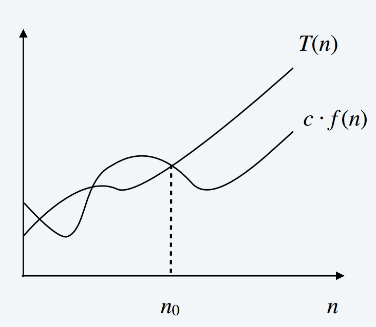
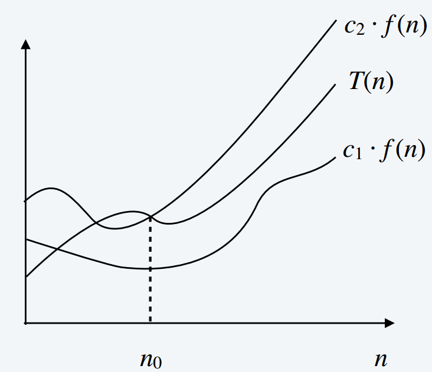
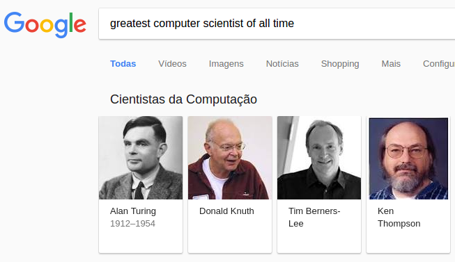
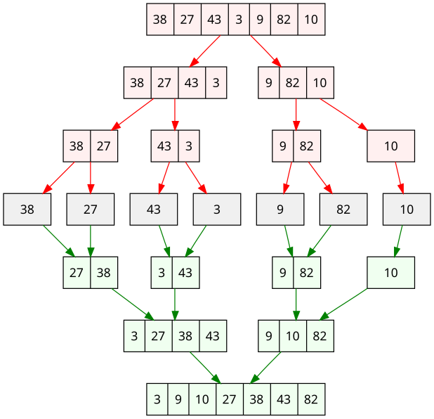
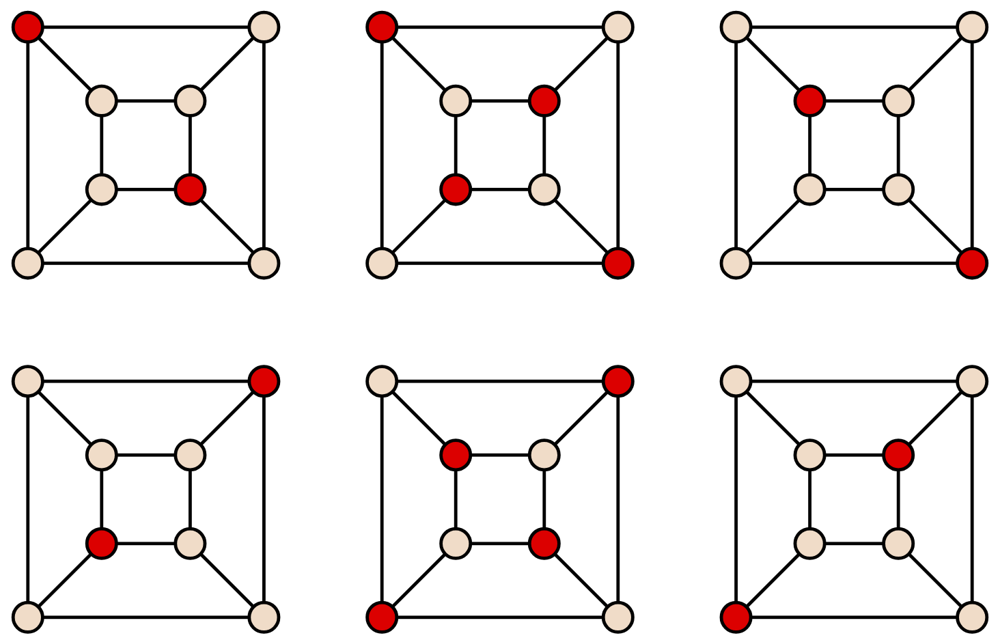

# Análise Assintótica

## Intuição

**Ideia:** Suprimir fatores constantes e termos de baixa ordem.

<br>

- Independente de máquina.
- Foco em grandes entradas.
- Descreve o crescimento de funções.
- Descreve o comportamento de funções [no limite]{.red}.

<br>

. . .

**Exemplo:** $8n^3 + 50n + 86$ cresce como $n^3$.

<br>

. . .

**Terminologia:** O algoritmo tem tempo de execução $O(n^3)$, onde $n$ é o tamanho da entrada.

## Intuição

**Problema:** O vetor $A$ contém o número $t$?

```pseudocode
#| html-line-number: true
#| html-no-end: true

\begin{algorithmic}
\Procedure{Busca}{$A, n, t$}
  \For{$i \gets 1$ \To $n$}
    \If{$A[i] = t$}
      \Return \textbf{true}
    \EndIf
  \EndFor
  \Return \textbf{false}
\EndProcedure
\end{algorithmic}
```

<br>

[**P:**]{.label-qstn} Qual é o tempo de execução?  
[**P:**]{.label-qstn} Quanto espaço é usado?

## Intuição

**Problema:** O vetor $A$ contém o número $t$?

```pseudocode
#| html-line-number: true
#| html-no-end: true

\begin{algorithmic}
\Procedure{Busca}{$A, n, t$}
  \For{$i \gets 1$ \To $n$}
    \If{$A[i] = t$}
      \Return \textbf{true}
    \EndIf
  \EndFor
  \Return \textbf{false}
\EndProcedure
\end{algorithmic}
```

<br>

[**P:**]{.label-qstn} Qual é o tempo de execução? $O(n)$

## Intuição

**Problema:** O vetor $A$ ou o vetor $B$ contém o número $t$?

```pseudocode
#| html-line-number: true
#| html-no-end: true

\begin{algorithmic}
\Procedure{Busca-Dupla}{$A, B, n, t$}
  \For{$i \gets 1$ \To $n$}
    \If{$A[i] = t$}
      \Return \textbf{true}
    \EndIf
  \EndFor
  \For{$i \gets 1$ \To $n$}
    \If{$B[i] = t$}
      \Return \textbf{true}
    \EndIf
  \EndFor
  \Return \textbf{false}
\EndProcedure
\end{algorithmic}
```

<br>

[**P:**]{.label-qstn} Qual é o tempo de execução?

## Intuição

**Problema:** O vetor $A$ ou o vetor $B$ contém o número $t$?

```pseudocode
#| html-line-number: true
#| html-no-end: true

\begin{algorithmic}
\Procedure{Busca-Dupla}{$A, B, n, t$}
  \For{$i \gets 1$ \To $n$}
    \If{$A[i] = t$}
      \Return \textbf{true}
    \EndIf
  \EndFor
  \For{$i \gets 1$ \To $n$}
    \If{$B[i] = t$}
      \Return \textbf{true}
    \EndIf
  \EndFor
  \Return \textbf{false}
\EndProcedure
\end{algorithmic}
```

<br>

[**P:**]{.label-qstn} Qual é o tempo de execução? $O(n)$

## Intuição

**Problema:** O vetor $A$ e o vetor $B$ contêm um número em comum?

```pseudocode
#| html-line-number: true
#| html-no-end: true

\begin{algorithmic}
\Procedure{Busca-Comum}{$A, B, n$}
  \For{$i \gets 1$ \To $n$}
    \For{$j \gets 1$ \To $n$}
      \If{$A[i] = B[j]$}
        \Return \textbf{true}
      \EndIf
    \EndFor
  \EndFor
  \Return \textbf{false}
\EndProcedure
\end{algorithmic}
```

<br>

[**P:**]{.label-qstn} Qual é o tempo de execução?

## Intuição

**Problema:** O vetor $A$ e o vetor $B$ contêm um número em comum?

```pseudocode
#| html-line-number: true
#| html-no-end: true

\begin{algorithmic}
\Procedure{Busca-Comum}{$A, B, n$}
  \For{$i \gets 1$ \To $n$}
    \For{$j \gets 1$ \To $n$}
      \If{$A[i] = B[j]$}
        \Return \textbf{true}
      \EndIf
    \EndFor
  \EndFor
  \Return \textbf{false}
\EndProcedure
\end{algorithmic}
```

<br>

[**P:**]{.label-qstn} Qual é o tempo de execução? $O(n^2)$

## Intuição

**Problema:** O vetor $A$ tem um elemento duplicado?

```pseudocode
#| html-line-number: true
#| html-no-end: true

\begin{algorithmic}
\Procedure{Verifica-Duplicatas}{$A, n$}
  \For{$i \gets 1$ \To $n$}
    \For{$j \gets i+1$ \To $n$}
      \If{$A[i] = A[j]$}
        \Return \textbf{true}
      \EndIf
    \EndFor
  \EndFor
  \Return \textbf{false}
\EndProcedure
\end{algorithmic}
```

<br>

[**P:**]{.label-qstn} Qual é o tempo de execução?

## Intuição

**Problema:** O vetor $A$ tem um elemento duplicado?

```pseudocode
#| html-line-number: true
#| html-no-end: true

\begin{algorithmic}
\Procedure{Verifica-Duplicatas}{$A, n$}
  \For{$i \gets 1$ \To $n$}
    \For{$j \gets i+1$ \To $n$}
      \If{$A[i] = A[j]$}
        \Return \textbf{true}
      \EndIf
    \EndFor
  \EndFor
  \Return \textbf{false}
\EndProcedure
\end{algorithmic}
```

<br>

[**P:**]{.label-qstn} Qual é o tempo de execução? $O(n^2)$

## Análise de Algoritmos

> “Análise de algoritmos usualmente significa: atribuir uma expressão Big $O$ para o tempo de execução. (Claro, Big $\Theta$ seria muito melhor.)”
>
> --- Ian Parberry. *“Problems on Algorithms”*, 1994, p. 59.

# Notação Big $O$ -- Limitante Superior

## Notação Big $O$ -- Limitante Superior

> [**Def.**]{.label-def} Seja $T(n)$ uma função em $n=1, 2, 3, \dots$ (em geral o pior tempo de execução de um algoritmo).

. . .

[**P:**]{.label-qstn} Quando $T(n)$ é $O(f(n))$?

. . .

[**R:**]{.label-def} Se eventualmente (para $n$ suficientemente grande), $T(n)$ é limitado por cima por $f(n)$ multiplicada por uma constante.

## Notação Big $O$ -- Limitante Superior

> [**Def.**]{.label-def} $T(n)$ é $O(f(n))$ se e somente se **existe** uma constante $\textcolor{red}{c} > 0$ e um $\textcolor{#2e7d32}{n_0} \geq 0$ tal que $T(n) \leq \textcolor{red}{c} \cdot f(n)$ **para todo** $n \geq \textcolor{#2e7d32}{n_0}$.

:::: columns
::: {.column width="55%"}

**Exemplo:** $T(n) = 32n^2 + 17n + 1$

::: {.incremental}
- $T(n)$ é $O(n^2)$.
- $T(n)$ é $O(n^3)$.
- $T(n)$ [não]{.red} é $O(n)$.
- $T(n)$ [não]{.red} é $O(n\log(n))$.
- **Uso:** Ordenação por Inserção é $O(n^2)$.
:::

> [**Obs.**]{.label-rmk} $\textcolor{red}{c}$ e $\textcolor{#2e7d32}{n_0}$ não podem depender de $n$.

:::
::: {.column width="45%"}

{width="90%"}

:::
::::

## Busca em Vetor Não Ordenado

```pseudocode
#| html-line-number: true
#| html-no-end: true

\begin{algorithmic}
\Procedure{Busca-Linear}{$x, A, n$}
  \For{$i \gets 1$ \To $n$}
    \If{$A[i] = x$}
      \Return $i$
    \EndIf
  \EndFor
  \Return \textsc{Não-Encontrado}
\EndProcedure
\end{algorithmic}
```

$T(n) = 3n + 1$

<br>

. . .

$T(n)$ é $O(n)$: $\textcolor{red}{c} = 4$ e $\textcolor{#2e7d32}{n_0} = 1$, $\textcolor{red}{c} = 3{,}5$ e $\textcolor{#2e7d32}{n_0} = 2$, $\dots$

. . .

$T(n)$ é $O(n^2)$, $O(n^3)$, $\dots$

<br> 

<https://www.geogebra.org/classic/czf4djzt>

## BubbleSort

```pseudocode
#| html-line-number: true
#| html-no-end: true

\begin{algorithmic}
\Procedure{BubbleSort}{$A$}
  \State $n \gets \text{length}(A)$
  \For{$i \gets 1$ \To $n-1$}
    \For{$j \gets 1$ \To $n-i$}
      \If{$A[j] > A[j+1]$}
        \State \Call{Troca}{$A, j, j+1$}
      \EndIf
    \EndFor
  \EndFor
\EndProcedure
\end{algorithmic}
```

:::{.incremental}
- Laço externo executa $O(n)$ vezes.
- Para cada iteração do laço externo, o laço interno executa $O(n)$ vezes.
- Então, o total de execuções do laço interno é $O(n^2)$ ($n \cdot n = n^2$).
- Cada iteração do laço interno custa $O(1)$.
- Logo, Ordenação por Bubble Sort é $\mathcal{O}(n^2)$.
:::

. . .

$T(n)$ é $O(n^2)$: $\textcolor{red}{c} = 6$ e $\textcolor{#2e7d32}{n_0} = 0$, $\dots$

. . .

$T(n)$ é $O(n^3)$, $O(n^4)$, $\dots$

. . .

$T(n)$ [não]{.red} é $O(n)$: <https://www.geogebra.org/classic/h2f2scrd>


## Notação Big $O$: Polinômios

> [**Def.**]{.label-def} $T(n)$ é $O(f(n))$ se e somente se **existe** uma constante $\textcolor{red}{c} > 0$ e um $\textcolor{#2e7d32}{n_0}$ tal que $T(n) \leq \textcolor{red}{c} \cdot f(n)$ **para todo** $n \geq \textcolor{#2e7d32}{n_0}$.


> [**Afirmação.**]{.label-thm} Se $T(n) = a_{\textcolor{orange}{k}}n^{\textcolor{orange}{k}}+\dots+a_1n^1+a_0$ então $T(n) = O(n^{\textcolor{orange}{k}})$.

. . .

> [**Prova.**]{.label-prf} Escolha $\textcolor{#2e7d32}{n_0}=1$ e $\textcolor{red}{c}=|a_{\textcolor{orange}{k}}|+\dots+|a_1|+|a_0|$.

. . .

Nós temos que mostrar que $\forall n \geq \textcolor{#2e7d32}{n_0}, T(n) \leq \textcolor{red}{c} \cdot n^{\textcolor{orange}{k}}$.

. . .

$T(n) \leq |a_{\textcolor{orange}{k}}|n^{\textcolor{orange}{k}}+\dots+|a_1|n^1+|a_0|$.

. . .

$T(n) \leq |a_{\textcolor{orange}{k}}|n^{\textcolor{orange}{k}}+\dots+|a_1|n^{\textcolor{orange}{k}}+|a_0| n^{\textcolor{orange}{k}}$.

. . .

$T(n) \leq (|a_{\textcolor{orange}{k}}| + \dots + |a_1| + |a_0|) n^{\textcolor{orange}{k}}$.

. . .

$T(n) \leq \textcolor{red}{c} \cdot n^{\textcolor{orange}{k}}$ $\blacksquare$

<https://www.geogebra.org/classic/dhycydkx>

## Notação Big $O$: Polinômios

> [**Def.**]{.label-def} $T(n)$ é $O(f(n))$ se e somente se **existe** uma constante $\textcolor{red}{c} > 0$ e um $\textcolor{#2e7d32}{n_0}$ tal que $T(n) \leq \textcolor{red}{c} \cdot f(n)$ **para todo** $n \geq \textcolor{#2e7d32}{n_0}$.


> [**Afirmação.**]{.label-thm} **Para todo** $\textcolor{orange}{k} \geq 1$, $n^{\textcolor{orange}{k}}$ [não]{.red} é $O(n^{\textcolor{orange}{k}-1})$.

. . .

> [**Prova.**]{.label-prf} Prova por contradição. Suponha que $n^{\textcolor{orange}{k}} = O(n^{\textcolor{orange}{k}-1})$.

. . .

Então **existem** $\textcolor{red}{c}, \textcolor{#2e7d32}{n_0}$ tal que $n^{\textcolor{orange}{k}} \leq \textcolor{red}{c} \cdot n^{\textcolor{orange}{k}-1}, \forall n \geq \textcolor{#2e7d32}{n_0}$.

. . .

Mas dividindo ambos os lados por $n^{\textcolor{orange}{k}-1}$:

. . .

$\dfrac{n^{\textcolor{orange}{k}}}{n^{\textcolor{orange}{k}-1}} \leq \dfrac{\textcolor{red}{c} \cdot n^{\textcolor{orange}{k}-1}}{n^{\textcolor{orange}{k}-1}}, \forall n \geq \textcolor{#2e7d32}{n_0}$

. . .

$n \leq \textcolor{red}{c}, \forall n \geq \textcolor{#2e7d32}{n_0}$.

O que é uma contradição (pois $\textcolor{red}{c}$ é uma constante). $\blacksquare$

## Notação Big $O$

**Sinal de Igual:** $O(f(n))$ é um **conjunto de funções**, mas comumente escrevemos $T(n) = O(f(n))$ em vez de $T(n) \in O(f(n))$.

<br>

- O **domínio** de $f(n)$ em geral são os **números naturais**.

<br>

- OK abusar, mas não usar incorretamente.

# Notação Big $\Omega$ (Omega) -- Limitante Inferior

## Notação Big $\Omega$ (Omega) -- Limitante Inferior

> [**Def.**]{.label-def} $T(n)$ é $\Omega(f(n))$ se e somente se **existe** uma constante $\textcolor{red}{c} > 0$ e um $\textcolor{#2e7d32}{n_0} \geq 0$ tal que $T(n) \geq \textcolor{red}{c} \cdot f(n)$ **para todo** $n \geq \textcolor{#2e7d32}{n_0}$.

<br>

:::: columns
::: {.column width="35%"}

{width="90%"}

:::
::: {.column width="65%"}

**Exemplo:** $T(n) = 32n^2 + 17n + 1.$

::: {.incremental}
- $T(n)$ é $\Omega(n^2)$.
- $T(n)$ é $\Omega(n)$.
- $T(n)$ [não]{.red} é $\Omega(n^3)$.
- $T(n)$ [não]{.red} é $\Omega(n^3\log(n))$.
:::

:::
::::

. . .

**Uso:** Ordenação por Inserção é $\Omega(n)$.

# Notação Big $\Theta$ (Theta) -- Limites Precisos

## Notação Big $\Theta$ (Theta) -- Limites Precisos

> [**Def.**]{.label-def} $T(n)$ é $\Theta(f(n))$ se e somente se **existem** constantes $\textcolor{red}{c_1}, \textcolor{red}{c_2} > 0$ e um $\textcolor{#2e7d32}{n_0} \geq 0$ tal que $\textcolor{red}{c_1} \cdot f(n) \leq T(n) \leq \textcolor{red}{c_2} \cdot f(n)$ **para todo** $n \geq \textcolor{#2e7d32}{n_0}$.

<br>

:::: columns
::: {.column width="35%"}

{width="90%"}

:::
::: {.column width="65%"}

**Exemplo:** $T(n) = 32n^2 + 17n + 1.$

::: {.incremental}
- $T(n)$ é $O(n^2)$.
- $T(n)$ é $\Omega(n^2)$.
- $T(n)$ é $\Theta(n^2)$.
- $T(n)$ [não]{.red} é $\Theta(n^3)$.
- $T(n)$ [não]{.red} é $\Theta(n)$.
:::

:::
::::

. . .

**Uso:** BubbleSort é $\Theta(n^2)$.

## Notação Big $\Theta$ (Theta) -- Limites Precisos

> [**Def.**]{.label-def} $T(n)$ é $\Theta(f(n))$ se e somente se $T(n) = O(f(n))$ [e]{.red} $T(n) = \Omega(f(n))$.

<br>

::: {style="text-align: center;"}
{width="45%"}
:::

## Análise Assintótica

**Exemplo:** Seja $T(n) = \frac{1}{2}n^2 + 3n$. Quais dos seguintes é verdadeiro (apresente constantes e $n_0$)?

. . .

- $T(n) = O(n)$?
- $T(n) = \Omega(n)$?
- $T(n) = O(n^3)$?
- $T(n) = \Theta(n^2)$?

## Visualização Interativa: $O$, $\Omega$ e $\Theta$

```{=html}
<div id="asym-widget" style="border: 1px solid #cbd5e1; border-radius: 8px; background: #f8fafc; padding: 6px 10px; font-size: 0.72em; color: #1e293b;">
  <div style="font-weight: 700; color: #1e3a8a; margin-bottom: 4px; font-size: 1.05em; text-align: center;">
    Demonstração Interativa: Comparação de Big O, Omega e Theta
  </div>

  <div style="display: flex; gap: 8px; margin-bottom: 4px; flex-wrap: wrap;">
    <div style="flex: 1; min-width: 130px;">
      <label style="font-weight: 600; display: block; margin-bottom: 1px;">Notação / Limitante:</label>
      <select id="asym-mode" style="width: 100%; padding: 2px; font-size: 0.9em; border-radius: 4px; border: 1px solid #94a3b8; background: #ffffff;">
        <option value="theta">Big-Theta  [ c₁·f(n) ≤ T(n) ≤ c₂·f(n) ]</option>
        <option value="bigo">Big-O  [ T(n) ≤ c·f(n) ]</option>
        <option value="omega">Big-Omega  [ T(n) ≥ c·f(n) ]</option>
      </select>
    </div>
    <div style="flex: 1.3; min-width: 170px;">
      <label style="font-weight: 600; display: block; margin-bottom: 1px;">Exemplos Pré-definidos:</label>
      <select id="asym-preset" style="width: 100%; padding: 2px; font-size: 0.9em; border-radius: 4px; border: 1px solid #94a3b8; background: #ffffff;">
        <option value="ex1">T(n) = 0.5n² + 3n | f(n) = n²  (Exemplo da aula)</option>
        <option value="ex2">T(n) = 32n² + 17n + 1 | f(n) = n²</option>
        <option value="ex3">T(n) = 6n² - 12n + 6 | f(n) = n²</option>
        <option value="ex4">T(n) = 3n + 1 | f(n) = n</option>
        <option value="ex5">T(n) = 50n log2(n) | f(n) = n log2(n)</option>
        <option value="ex_fail">T(n) = 0.5n² + 3n | f(n) = n  (Não é O(n))</option>
        <option value="custom">Personalizado (digite ao lado)</option>
      </select>
    </div>
    <div style="flex: 1; min-width: 120px;">
      <label style="font-weight: 600; display: block; margin-bottom: 1px; color: #1e3a8a;">Função T(n):</label>
      <input type="text" id="asym-tn-input" value="0.5*n^2 + 3*n" style="width: 100%; padding: 2px; font-size: 0.9em; border-radius: 4px; border: 1px solid #94a3b8; background: #ffffff;">
    </div>
    <div style="flex: 1; min-width: 120px;">
      <label style="font-weight: 600; display: block; margin-bottom: 1px; color: #475569;">Função f(n):</label>
      <input type="text" id="asym-fn-input" value="n^2" style="width: 100%; padding: 2px; font-size: 0.9em; border-radius: 4px; border: 1px solid #94a3b8; background: #ffffff;">
    </div>
  </div>

  <div style="display: flex; gap: 10px; margin-bottom: 4px; flex-wrap: wrap; background: #ffffff; padding: 2px 8px; border-radius: 4px; border: 1px solid #e2e8f0; align-items: center; justify-content: center; font-size: 0.95em;">
    <div style="font-weight: 600; color: #475569; font-size: 0.85em;">Fórmula Renderizada:</div>
    <div style="color: #1e3a8a; font-weight: 600;" id="math-tn-preview">T(n) = 0.5n² + 3n</div>
    <div style="color: #cbd5e1; font-weight: bold;">|</div>
    <div style="color: #475569; font-weight: 600;" id="math-fn-preview">f(n) = n²</div>
  </div>

  <div style="display: flex; gap: 10px; margin-bottom: 4px; flex-wrap: wrap; align-items: center;">
    <div id="c1-box" style="flex: 1; min-width: 110px;">
      <label style="font-weight: 600; color: #16a34a;"><span id="c1-label">Constante c₁</span> = <span id="asym-c1-val">0.5</span></label>
      <input type="range" id="asym-c1-slider" min="0.1" max="10" step="0.1" value="0.5" style="width: 100%; accent-color: #16a34a;">
    </div>
    <div id="c2-box" style="flex: 1; min-width: 110px;">
      <label style="font-weight: 600; color: #d32f2f;">Constante c₂ = <span id="asym-c2-val">4</span></label>
      <input type="range" id="asym-c2-slider" min="0.1" max="50" step="0.5" value="4" style="width: 100%; accent-color: #d32f2f;">
    </div>
    <div style="flex: 1; min-width: 110px;">
      <label style="font-weight: 600; color: #e65100;">Limiar n₀ = <span id="asym-n0-val">1</span></label>
      <input type="range" id="asym-n0-slider" min="0" max="25" step="1" value="1" style="width: 100%; accent-color: #e65100;">
    </div>
    <div style="flex: 1; min-width: 110px;">
      <label style="font-weight: 600; color: #475569;">Eixo N<sub>max</sub> = <span id="asym-maxN-val">15</span></label>
      <input type="range" id="asym-maxN-slider" min="10" max="200" step="5" value="15" style="width: 100%; accent-color: #475569;">
    </div>
  </div>

  <canvas id="asym-canvas" style="width: 100%; height: 340px; background: #ffffff; border: 1px solid #cbd5e1; border-radius: 6px; display: block;"></canvas>

  <div id="asym-status" style="margin-top: 4px; padding: 3px 6px; border-radius: 4px; text-align: center; font-weight: 600; font-size: 0.85em; background: #dcfce7; color: #15803d; border: 1px solid #86efac;">
    ✓ Notação válida
  </div>
</div>

<script>
(function() {
  function initAsymWidget() {
    var modeSelect = document.getElementById('asym-mode');
    var presetSelect = document.getElementById('asym-preset');
    var tnInput = document.getElementById('asym-tn-input');
    var fnInput = document.getElementById('asym-fn-input');

    var c1Slider = document.getElementById('asym-c1-slider');
    var c2Slider = document.getElementById('asym-c2-slider');
    var n0Slider = document.getElementById('asym-n0-slider');
    var maxNSlider = document.getElementById('asym-maxN-slider');

    var c1Val = document.getElementById('asym-c1-val');
    var c2Val = document.getElementById('asym-c2-val');
    var n0Val = document.getElementById('asym-n0-val');
    var maxNVal = document.getElementById('asym-maxN-val');

    var c1Box = document.getElementById('c1-box');
    var c2Box = document.getElementById('c2-box');
    var c1Label = document.getElementById('c1-label');

    var canvas = document.getElementById('asym-canvas');
    var statusDiv = document.getElementById('asym-status');

    if (!canvas || !modeSelect) return;
    var ctx = canvas.getContext('2d');

    var presets = {
      ex1: { tn: "0.5*n^2 + 3*n", fn: "n^2", c1: 0.5, c2: 4, n0: 1, maxN: 15 },
      ex2: { tn: "32*n^2 + 17*n + 1", fn: "n^2", c1: 32, c2: 50, n0: 1, maxN: 15 },
      ex3: { tn: "6*n^2 - 12*n + 6", fn: "n^2", c1: 1, c2: 6, n0: 1, maxN: 15 },
      ex4: { tn: "3*n + 1", fn: "n", c1: 3, c2: 4, n0: 1, maxN: 15 },
      ex5: { tn: "50*n*log2(n)", fn: "n*log2(n)", c1: 10, c2: 50, n0: 2, maxN: 20 },
      ex_fail: { tn: "0.5*n^2 + 3*n", fn: "n", c1: 1, c2: 10, n0: 1, maxN: 15 }
    };

    function parseMath(str) {
      if (!str || !str.trim()) return null;
      try {
        var expr = str.trim()
          .replace(/(\d+)\s*([a-zA-Z])/g, '$1*$2')
          .replace(/(\d+)\s*\(/g, '$1*(')
          .replace(/\)\s*(\d+|[a-zA-Z])/g, ')*$1')
          .replace(/\^/g, '**')
          .replace(/\blogger\b|\blog2\b|\blog\b/gi, 'Math.log2')
          .replace(/\bln\b/gi, 'Math.log')
          .replace(/\bsqrt\b/gi, 'Math.sqrt')
          .replace(/\babs\b/gi, 'Math.abs');
        
        var fn = new Function('n', 'try { var r = (' + expr + '); return (typeof r === "number" && !isNaN(r)) ? r : NaN; } catch(e) { return NaN; }');
        if (isNaN(fn(2))) return null;
        return fn;
      } catch (e) {
        return null;
      }
    }

    function formatLatex(str) {
      if (!str) return "";
      return str.trim()
        .replace(/(\d+)\s*\*?\s*([a-zA-Z])/g, '$1 $2')
        .replace(/\*/g, ' ')
        .replace(/\^(\d+|[a-zA-Z]+)/g, '^{$1}')
        .replace(/\blogger\b|\blog2\b|\blog\b/gi, '\\log_2 ')
        .replace(/\bln\b/gi, '\\ln ')
        .replace(/\bsqrt\(([^)]+)\)/gi, '\\sqrt{$1}');
    }

    function formatHtmlPretty(str) {
      if (!str) return "";
      return str.trim()
        .replace(/\*/g, '·')
        .replace(/\^(\d+|[a-zA-Z]+)/g, '<sup>$1</sup>')
        .replace(/log2/gi, 'log₂')
        .replace(/sqrt\(([^)]+)\)/gi, '√($1)');
    }

    function renderMathPreview() {
      var rawT = tnInput.value;
      var rawF = fnInput.value;
      var previewT = document.getElementById('math-tn-preview');
      var previewF = document.getElementById('math-fn-preview');
      if (previewT && previewF) {
        var texT = "T(n) = " + formatLatex(rawT);
        var texF = "f(n) = " + formatLatex(rawF);
        if (window.katex) {
          try {
            katex.render(texT, previewT, { throwOnError: false });
            katex.render(texF, previewF, { throwOnError: false });
            return;
          } catch(e) {}
        }
        previewT.innerHTML = "T(n) = " + formatHtmlPretty(rawT);
        previewF.innerHTML = "f(n) = " + formatHtmlPretty(rawF);
      }
    }

    presetSelect.addEventListener('change', function() {
      var val = presetSelect.value;
      if (val !== 'custom' && presets[val]) {
        var p = presets[val];
        tnInput.value = p.tn;
        fnInput.value = p.fn;
        c1Slider.value = p.c1;
        c2Slider.value = p.c2;
        n0Slider.value = p.n0;
        if (p.maxN) maxNSlider.value = p.maxN;
        update();
      }
    });

    modeSelect.addEventListener('change', updateUI);
    tnInput.addEventListener('input', function() { presetSelect.value = 'custom'; update(); });
    fnInput.addEventListener('input', function() { presetSelect.value = 'custom'; update(); });
    c1Slider.addEventListener('input', update);
    c2Slider.addEventListener('input', update);
    n0Slider.addEventListener('input', update);
    maxNSlider.addEventListener('input', update);

    function updateUI() {
      var mode = modeSelect.value;
      if (mode === 'theta') {
        c1Box.style.display = 'block';
        c2Box.style.display = 'block';
        c1Label.textContent = 'Constante c₁';
      } else if (mode === 'bigo') {
        c1Box.style.display = 'none';
        c2Box.style.display = 'block';
      } else if (mode === 'omega') {
        c1Box.style.display = 'block';
        c2Box.style.display = 'none';
        c1Label.textContent = 'Constante c';
      }
      update();
    }

    function update() {
      renderMathPreview();

      var mode = modeSelect.value;
      var c1 = parseFloat(c1Slider.value);
      var c2 = parseFloat(c2Slider.value);
      var n0 = parseFloat(n0Slider.value);
      var maxN = parseFloat(maxNSlider.value);

      c1Val.textContent = c1;
      c2Val.textContent = c2;
      n0Val.textContent = n0;
      maxNVal.textContent = maxN;

      var fnT = parseMath(tnInput.value);
      var fnF = parseMath(fnInput.value);

      if (!fnT || !fnF) {
        statusDiv.style.background = '#fee2e2';
        statusDiv.style.color = '#b91c1c';
        statusDiv.style.borderColor = '#fca5a5';
        statusDiv.innerHTML = '⚠ Expressão matemática inválida. Ex: 0.5*n^2 + 3*n';
        draw(null, null, mode, c1, c2, n0, maxN, null);
        return;
      }

      var isValid = true;
      var failPoint = null;
      var N_CHECK = 5000;
      var totalCheckPoints = 200;

      for (var i = 0; i <= totalCheckPoints; i++) {
        var nTest;
        if (i <= 100) {
          nTest = n0 + (i / 100) * (maxN - n0);
        } else {
          var ratio = (i - 100) / 100;
          nTest = maxN + Math.pow(ratio, 2.5) * (N_CHECK - maxN);
        }

        if (nTest < n0) continue;

        var valT = fnT(nTest);
        var valF = fnF(nTest);

        if (isNaN(valT) || isNaN(valF)) { isValid = false; failPoint = nTest; break; }

        var failedHere = false;
        if (mode === 'bigo') {
          if (valT > c2 * valF + 1e-5) failedHere = true;
        } else if (mode === 'omega') {
          if (valT < c1 * valF - 1e-5) failedHere = true;
        } else if (mode === 'theta') {
          if (valT < c1 * valF - 1e-5 || valT > c2 * valF + 1e-5) failedHere = true;
        }

        if (failedHere) {
          isValid = false;
          failPoint = nTest;
          break;
        }
      }

      if (isValid) {
        statusDiv.style.background = '#dcfce7';
        statusDiv.style.color = '#15803d';
        statusDiv.style.borderColor = '#86efac';
        var texStatus = "";
        if (mode === 'bigo') {
          texStatus = 'T(n) \\le ' + c2 + ' \\cdot f(n) \\quad \\forall n \\ge ' + n0;
        } else if (mode === 'omega') {
          texStatus = 'T(n) \\ge ' + c1 + ' \\cdot f(n) \\quad \\forall n \\ge ' + n0;
        } else {
          texStatus = c1 + ' \\cdot f(n) \\le T(n) \\le ' + c2 + ' \\cdot f(n) \\quad \\forall n \\ge ' + n0;
        }

        if (window.katex) {
          statusDiv.innerHTML = '✓ Válido: <span id="katex-status-tex"></span>';
          var texEl = document.getElementById('katex-status-tex');
          if (texEl) katex.render(texStatus, texEl, { throwOnError: false });
        } else {
          statusDiv.innerHTML = '✓ Válido: ' + formatHtmlPretty(mode === 'bigo' ? 'T(n) ≤ ' + c2 + '·f(n) (n ≥ ' + n0 + ')' : mode === 'omega' ? 'T(n) ≥ ' + c1 + '·f(n) (n ≥ ' + n0 + ')' : c1 + '·f(n) ≤ T(n) ≤ ' + c2 + '·f(n) (n ≥ ' + n0 + ')');
        }
      } else {
        statusDiv.style.background = '#fee2e2';
        statusDiv.style.color = '#b91c1c';
        statusDiv.style.borderColor = '#fca5a5';
        var roundedFail = Math.round(failPoint * 10) / 10;

        if (failPoint <= maxN) {
          if (mode === 'bigo') {
            statusDiv.innerHTML = '✗ Inválido: T(n) > c·f(n) em n ≈ ' + roundedFail + ' (cruzamento no gráfico)';
          } else if (mode === 'omega') {
            statusDiv.innerHTML = '✗ Inválido: T(n) < c·f(n) em n ≈ ' + roundedFail + ' (cruzamento no gráfico)';
          } else {
            statusDiv.innerHTML = '✗ Inválido: Cota de Big-Theta violada em n ≈ ' + roundedFail + ' (cruzamento no gráfico)';
          }
        } else {
          if (mode === 'bigo') {
            statusDiv.innerHTML = '✗ Inválido assintoticamente: T(n) ultrapassa c·f(n) em n ≈ ' + roundedFail + ' (fora do gráfico! Aumente N<sub>max</sub>)';
          } else if (mode === 'omega') {
            statusDiv.innerHTML = '✗ Inválido assintoticamente: T(n) fica abaixo de c·f(n) em n ≈ ' + roundedFail + ' (fora do gráfico! Aumente N<sub>max</sub>)';
          } else {
            statusDiv.innerHTML = '✗ Inválido assintoticamente: Cota violada em n ≈ ' + roundedFail + ' (fora do gráfico! Aumente N<sub>max</sub>)';
          }
        }
      }

      draw(fnT, fnF, mode, c1, c2, n0, maxN, failPoint);
    }

    function draw(fnT, fnF, mode, c1, c2, n0, maxN, failPoint) {
      var dpr = window.devicePixelRatio || 1;
      var container = canvas.parentElement || canvas;
      var rect = canvas.getBoundingClientRect();
      var w = rect.width || container.clientWidth || 340;
      var h = rect.height || 340;
      if (w <= 0) w = 340;
      if (h <= 0) h = 340;

      canvas.width = w * dpr;
      canvas.height = h * dpr;
      ctx.save();
      ctx.scale(dpr, dpr);
      ctx.clearRect(0, 0, w, h);

      var margin = { top: 25, right: 30, bottom: 32, left: 52 };
      var pw = w - margin.left - margin.right;
      var ph = h - margin.top - margin.bottom;

      if (!fnT || !fnF) {
        ctx.fillStyle = '#94a3b8';
        ctx.font = '14px sans-serif';
        ctx.textAlign = 'center';
        ctx.fillText('Digite expressões válidas para visualizar o gráfico', w / 2, h / 2);
        ctx.restore();
        return;
      }

      var maxY = 0;
      for (var i = 0; i <= 40; i++) {
        var nVal = (i / 40) * maxN;
        var tV = fnT(nVal) || 0;
        var fV = fnF(nVal) || 0;
        if (mode === 'bigo') maxY = Math.max(maxY, tV, c2 * fV);
        else if (mode === 'omega') maxY = Math.max(maxY, tV, c1 * fV);
        else maxY = Math.max(maxY, tV, c1 * fV, c2 * fV);
      }
      maxY = (maxY * 1.15) || 10;

      function getX(n) { return margin.left + (n / maxN) * pw; }
      function getY(val) { return margin.top + ph - (val / maxY) * ph; }

      var xN0 = getX(n0);
      if (xN0 < margin.left + pw) {
        ctx.fillStyle = 'rgba(226, 232, 240, 0.55)';
        ctx.fillRect(Math.max(xN0, margin.left), margin.top, margin.left + pw - Math.max(xN0, margin.left), ph);
      }

      ctx.strokeStyle = '#f1f5f9';
      ctx.lineWidth = 1;
      var yTicks = [0, maxY * 0.25, maxY * 0.5, maxY * 0.75, maxY];
      for (var gt = 0; gt < yTicks.length; gt++) {
        var gyPos = getY(yTicks[gt]);
        ctx.beginPath();
        ctx.moveTo(margin.left, gyPos);
        ctx.lineTo(margin.left + pw, gyPos);
        ctx.stroke();
      }

      ctx.strokeStyle = '#94a3b8';
      ctx.lineWidth = 1.2;
      ctx.beginPath();
      ctx.moveTo(margin.left, margin.top);
      ctx.lineTo(margin.left, margin.top + ph);
      ctx.lineTo(margin.left + pw, margin.top + ph);
      ctx.stroke();

      ctx.fillStyle = '#475569';
      ctx.font = 'bold 11px sans-serif';
      ctx.textAlign = 'center';
      ctx.fillText('n', margin.left + pw + 15, margin.top + ph + 4);
      ctx.textAlign = 'right';
      ctx.fillText('Custo', margin.left - 5, margin.top - 10);

      ctx.font = '10px sans-serif';
      ctx.fillStyle = '#64748b';
      ctx.textAlign = 'center';
      var xSteps = [0, Math.round(maxN * 0.2), Math.round(maxN * 0.4), Math.round(maxN * 0.6), Math.round(maxN * 0.8), maxN];
      for (var xi = 0; xi < xSteps.length; xi++) {
        var tx = xSteps[xi];
        var xPos = getX(tx);
        ctx.beginPath();
        ctx.moveTo(xPos, margin.top + ph);
        ctx.lineTo(xPos, margin.top + ph + 4);
        ctx.stroke();
        ctx.fillText(tx, xPos, margin.top + ph + 16);
      }

      ctx.textAlign = 'right';
      for (var yi = 0; yi < yTicks.length; yi++) {
        var valY = yTicks[yi];
        var yPos = getY(valY);
        ctx.beginPath();
        ctx.moveTo(margin.left - 4, yPos);
        ctx.lineTo(margin.left, yPos);
        ctx.stroke();
        var labelStr = Math.round(valY).toString();
        if (valY >= 1000) labelStr = (valY / 1000).toFixed(1).replace('.0', '') + 'k';
        ctx.fillText(labelStr, margin.left - 7, yPos + 3);
      }

      if (mode === 'omega' || mode === 'theta') {
        ctx.strokeStyle = '#16a34a';
        ctx.lineWidth = 2.2;
        ctx.beginPath();
        for (var k1 = 0; k1 <= 100; k1++) {
          var nCurr1 = (k1 / 100) * maxN;
          var xF1 = getX(nCurr1);
          var yF1 = getY(c1 * fnF(nCurr1));
          if (k1 === 0) ctx.moveTo(xF1, yF1);
          else ctx.lineTo(xF1, yF1);
        }
        ctx.stroke();
      }

      if (mode === 'bigo' || mode === 'theta') {
        ctx.strokeStyle = '#dc2626';
        ctx.lineWidth = 2.2;
        ctx.beginPath();
        for (var k2 = 0; k2 <= 100; k2++) {
          var nCurr2 = (k2 / 100) * maxN;
          var xF2 = getX(nCurr2);
          var yF2 = getY(c2 * fnF(nCurr2));
          if (k2 === 0) ctx.moveTo(xF2, yF2);
          else ctx.lineTo(xF2, yF2);
        }
        ctx.stroke();
      }

      ctx.strokeStyle = '#1e3a8a';
      ctx.lineWidth = 2.8;
      ctx.beginPath();
      for (var j = 0; j <= 100; j++) {
        var nCurr = (j / 100) * maxN;
        var x = getX(nCurr);
        var y = getY(fnT(nCurr));
        if (j === 0) ctx.moveTo(x, y);
        else ctx.lineTo(x, y);
      }
      ctx.stroke();

      // Highlight failPoint if visible on canvas
      if (failPoint !== null && failPoint >= n0 && failPoint <= maxN) {
        var xFail = getX(failPoint);
        var yFail = getY(fnT(failPoint));

        ctx.fillStyle = '#dc2626';
        ctx.beginPath();
        ctx.arc(xFail, yFail, 6, 0, 2 * Math.PI);
        ctx.fill();
        ctx.strokeStyle = '#ffffff';
        ctx.lineWidth = 2;
        ctx.stroke();

        ctx.fillStyle = '#dc2626';
        ctx.font = 'bold 11px sans-serif';
        ctx.textAlign = 'left';
        ctx.fillText(' ✗ falha em n≈' + Math.round(failPoint * 10) / 10, xFail + 6, yFail - 6);
      }

      if (xN0 >= margin.left && xN0 <= margin.left + pw) {
        ctx.strokeStyle = '#e65100';
        ctx.lineWidth = 1.8;
        ctx.setLineDash([4, 4]);
        ctx.beginPath();
        ctx.moveTo(xN0, margin.top);
        ctx.lineTo(xN0, margin.top + ph);
        ctx.stroke();
        ctx.setLineDash([]);

        ctx.fillStyle = '#e65100';
        ctx.font = 'bold 11px sans-serif';
        ctx.textAlign = 'center';
        ctx.fillText('n₀=' + n0, xN0, margin.top + ph + 28);
      }

      ctx.font = '11px sans-serif';
      ctx.textAlign = 'left';
      var legX = margin.left + 10;
      var legY = margin.top + 15;

      ctx.fillStyle = '#1e3a8a';
      ctx.fillRect(legX, legY - 8, 12, 3);
      ctx.fillText('T(n)', legX + 16, legY);

      if (mode === 'bigo' || mode === 'theta') {
        legX += 55;
        ctx.fillStyle = '#dc2626';
        ctx.fillRect(legX, legY - 8, 12, 3);
        ctx.fillText(mode === 'theta' ? 'c₂·f(n)' : 'c·f(n)', legX + 16, legY);
      }

      if (mode === 'omega' || mode === 'theta') {
        legX += 65;
        ctx.fillStyle = '#16a34a';
        ctx.fillRect(legX, legY - 8, 12, 3);
        ctx.fillText(mode === 'theta' ? 'c₁·f(n)' : 'c·f(n)', legX + 16, legY);
      }

      ctx.restore();
    }

    updateUI();
  }

  if (document.readyState === 'loading') {
    document.addEventListener('DOMContentLoaded', initAsymWidget);
  } else {
    initAsymWidget();
  }
})();
</script>
```

## Análise Assintótica

**Exemplo:** Seja $T(n) = \frac{1}{2}n^2 + 3n$. Quais dos seguintes é verdadeiro (apresente constantes e $n_0$)?

<br>

- $T(n)$ [não]{.red} é $O(n)$.
- $T(n) = \Omega(n)$, $\textcolor{#2e7d32}{n_0}=1, \textcolor{red}{c}=\frac{1}{2}$.
- $T(n) = O(n^3)$, $\textcolor{#2e7d32}{n_0}=1, \textcolor{red}{c}=4$.
- $T(n) = \Theta(n^2)$, $\textcolor{#2e7d32}{n_0}=1, \textcolor{red}{c_1}=\frac{1}{2}, \textcolor{red}{c_2}=4$.

# Limites Estritos

## Limites Estritos

- Além das notações $O$, $\Omega$ e $\Theta$, existem duas notações para representar **limites estritos**.

- Essas duas notações, todavia, são raramente encontradas na literatura de computação.

- Nos próximos slides, apresentamos a notação $o$ e $\omega$ para completude, porém, [não as utilizaremos nesta disciplina]{.red}.

## Notação Pequeno $o$ -- Limitante Superior Estrito

> [**Def.**]{.label-def} $T(n)$ é $o(f(n))$ se e somente se **para toda** constante $\textcolor{red}{c} > 0$ **existe** uma constante $\textcolor{#2e7d32}{n_0} > 0$ tal que $T(n) < \textcolor{red}{c} \cdot f(n)$ **para todo** $n \geq \textcolor{#2e7d32}{n_0}$.

<br>

**Exemplo:** $T(n) = 32n^2 + 17n + 1.$

- $T(n)$ é $o(n^3)$.
- $T(n)$ [não]{.red} é $o(n^2)$.

<br>

**Uso:** BubbleSort é $o(n^3)$, mas [não]{.red} é $o(n^2)$.

## Notação Pequeno $\omega$ (Omega) -- Limitante Inferior Estrito

> [**Def.**]{.label-def} $T(n)$ é $\omega(f(n))$ se e somente se **para toda** constante $\textcolor{red}{c} > 0$ **existe** uma constante $\textcolor{#2e7d32}{n_0} > 0$ tal que $T(n) > \textcolor{red}{c} \cdot f(n)$ **para todo** $n \geq \textcolor{#2e7d32}{n_0}$.

<br>

**Exemplo:** $T(n) = 32n^2 + 17n + 1.$

- $T(n)$ é $\omega(n)$.
- $T(n)$ [não]{.red} é $\omega(n^2)$.

<br>

**Uso:** BubbleSort é $\omega(n)$.

# Resumo das Notações Assintóticas

## Resumo das Notações Assintóticas

:::{.incremental}
- $\textcolor{blue}{f}(n) = O(\textcolor{orange}{g}(n)) \approx \textcolor{blue}{f}(n) \leq \textcolor{orange}{g}(n)$
  - $\textcolor{blue}{f}$ cresce [no máximo tão rápido]{.red} quanto $\textcolor{orange}{g}$, é um limitante superior.
- $\textcolor{blue}{f}(n) = \Omega(\textcolor{orange}{g}(n)) \approx \textcolor{blue}{f}(n) \geq \textcolor{orange}{g}(n)$
  - $\textcolor{blue}{f}$ cresce [no mínimo tão rápido]{.red} quanto $\textcolor{orange}{g}$, é um limitante inferior.
- $\textcolor{blue}{f}(n) = \Theta(\textcolor{orange}{g}(n)) \approx \textcolor{blue}{f}(n) = \textcolor{orange}{g}(n)$
  - $\textcolor{blue}{f}$ cresce [tão rápido]{.red} quanto $\textcolor{orange}{g}$, é um limitante preciso.
- $\textcolor{blue}{f}(n) = o(\textcolor{orange}{g}(n)) \approx \textcolor{blue}{f}(n) < \textcolor{orange}{g}(n)$
  - $\textcolor{blue}{f}$ cresce [mais devagar]{.red} que $\textcolor{orange}{g}$, é um limitante superior estrito.
- $\textcolor{blue}{f}(n) = \omega(\textcolor{orange}{g}(n)) \approx \textcolor{blue}{f}(n) > \textcolor{orange}{g}(n)$
  - $\textcolor{blue}{f}$ cresce [mais rápido]{.red} que $\textcolor{orange}{g}$, é um limitante inferior estrito.
:::

# Definições Alternativas (Limites)

## Definições Alternativas (Limites)

$\textcolor{blue}{f}(n) = O(\textcolor{orange}{g}(n)) \iff \lim_{n\to\infty} \dfrac{\textcolor{blue}{f}(n)}{\textcolor{orange}{g}(n)} < \infty$

<br>

. . .

$\textcolor{blue}{f}(n) = \Omega(\textcolor{orange}{g}(n)) \iff \lim_{n\to\infty} \dfrac{\textcolor{blue}{f}(n)}{\textcolor{orange}{g}(n)} > 0$

<br>

. . .

$\textcolor{blue}{f}(n) = \Theta(\textcolor{orange}{g}(n)) \iff \lim_{n\to\infty} \dfrac{\textcolor{blue}{f}(n)}{\textcolor{orange}{g}(n)} = \textcolor{red}{c} > 0$

<br>

. . .

$\textcolor{blue}{f}(n) = o(\textcolor{orange}{g}(n)) \iff \lim_{n\to\infty} \dfrac{\textcolor{blue}{f}(n)}{\textcolor{orange}{g}(n)} = 0$

<br>

. . .


$\textcolor{blue}{f}(n) = \omega(\textcolor{orange}{g}(n)) \iff \lim_{n\to\infty} \dfrac{\textcolor{blue}{f}(n)}{\textcolor{orange}{g}(n)} = \infty$

# História

## Quem Culpar?

> “Well, I think I have beat this issue to death, knowing of no other arguments pro or con the introduction of $\Theta$ and $\Omega$. On the basis of the issues discussed here, I propose that members of SIGACT, and editors of computer science and mathematics journals, adopt the $O, \Theta, \Omega$ notations as defined above, unless a better alternative can be found reasonably soon.”
>
> --- *“Big Omicron and Big Omega and Big Theta”*, SIGACT News, 1976.

## Quem Culpar?

**Donald Knuth:**

:::: columns
::: {.column width="35%"}

{width="90%"}

:::
::: {.column width="65%"}

::: {.incremental}
- Professor emérito da Universidade de Stanford.
- É o autor do livro *The Art of Computer Programming*: *American Scientist has included this work among “100 or so Books that shaped a Century of Science”*.
- Prêmio Turing em 1974.
- Análise de Algoritmos e $\LaTeX$.
:::

:::
::::

::: {style="text-align: center;"}
{width="50%"}
:::

# Relações Assintóticas

## Transitividade

> [**Def. (Transitividade):**]{.label-def} Se $\textcolor{blue}{f}(n) = O(\textcolor{orange}{g}(n))$ e $\textcolor{orange}{g}(n) = O(\textcolor{#0284c7}{h}(n))$ então $\textcolor{blue}{f}(n) = O(\textcolor{#0284c7}{h}(n))$.

. . .

> [**Prova.**]{.label-prf} É dado que:
> 
::: {.incremental}
- $\textcolor{blue}{f}(n) \leq c' \textcolor{orange}{g}(n)$ **para todo** $n \geq n_0'$ e 
- $\textcolor{orange}{g}(n) \leq c'' \textcolor{#0284c7}{h}(n)$ **para todo** $n \geq n_0''$.
- Considere $n_0 = \max(n_0', n_0'')$, então nós temos que 
- $\textcolor{blue}{f}(n) \leq c' \textcolor{orange}{g}(n) \leq c' c'' \textcolor{#0284c7}{h}(n)$.
- Logo, $\textcolor{blue}{f}(n) \leq c' c'' \textcolor{#0284c7}{h}(n)$ e 
- $\textcolor{blue}{f}(n) = O(\textcolor{#0284c7}{h}(n))$. $\blacksquare$
:::

## Transitividade

> [**Def. (Transitividade):**]{.label-def} Se $\textcolor{blue}{f}(n) = \Omega(\textcolor{orange}{g}(n))$ e $\textcolor{orange}{g}(n) = \Omega(\textcolor{#0284c7}{h}(n))$ então $\textcolor{blue}{f}(n) = \Omega(\textcolor{#0284c7}{h}(n))$.

. . .

<br>

[**P:**]{.label-qstn} O que podemos concluir?

. . .

<br>

> Se $\textcolor{blue}{f}(n) = \Theta(\textcolor{orange}{g}(n))$ e $\textcolor{orange}{g}(n) = \Theta(\textcolor{#0284c7}{h}(n))$ então $\textcolor{blue}{f}(n) = \Theta(\textcolor{#0284c7}{h}(n))$.

## Transitividade

::: {.incremental}
- Se $\textcolor{blue}{f}(n) = \Theta(\textcolor{orange}{g}(n))$ e $\textcolor{orange}{g}(n) = \Theta(\textcolor{#0284c7}{h}(n))$ então $\textcolor{blue}{f}(n) = \Theta(\textcolor{#0284c7}{h}(n))$.
- Se $\textcolor{blue}{f}(n) = \Omega(\textcolor{orange}{g}(n))$ e $\textcolor{orange}{g}(n) = \Omega(\textcolor{#0284c7}{h}(n))$ então $\textcolor{blue}{f}(n) = \Omega(\textcolor{#0284c7}{h}(n))$.
- Se $\textcolor{blue}{f}(n) = O(\textcolor{orange}{g}(n))$ e $\textcolor{orange}{g}(n) = O(\textcolor{#0284c7}{h}(n))$ então $\textcolor{blue}{f}(n) = O(\textcolor{#0284c7}{h}(n))$.
- Se $\textcolor{blue}{f}(n) = o(\textcolor{orange}{g}(n))$ e $\textcolor{orange}{g}(n) = o(\textcolor{#0284c7}{h}(n))$ então $\textcolor{blue}{f}(n) = o(\textcolor{#0284c7}{h}(n))$.
- Se $\textcolor{blue}{f}(n) = \omega(\textcolor{orange}{g}(n))$ e $\textcolor{orange}{g}(n) = \omega(\textcolor{#0284c7}{h}(n))$ então $\textcolor{blue}{f}(n) = \omega(\textcolor{#0284c7}{h}(n))$.
:::

## Reflexividade

::: {.incremental}
- $\textcolor{blue}{f}(n) = \Theta(\textcolor{blue}{f}(n))$.
- $\textcolor{blue}{f}(n) = \Omega(\textcolor{blue}{f}(n))$.
- $\textcolor{blue}{f}(n) = O(\textcolor{blue}{f}(n))$.
- $\textcolor{blue}{f}(n) = o(\textcolor{blue}{f}(n))$?  [Não]{.red}.
- $\textcolor{blue}{f}(n) = \omega(\textcolor{blue}{f}(n))$?  [Não]{.red}.
:::

## Simetria e Simetria Transposta

::: {.incremental}
- $\textcolor{blue}{f}(n) = \Theta(\textcolor{orange}{g}(n))$ se e somente se $\textcolor{orange}{g}(n) = \Theta(\textcolor{blue}{f}(n))$.
- $\textcolor{blue}{f}(n) = O(\textcolor{orange}{g}(n))$ se e somente se $\textcolor{orange}{g}(n) = \Omega(\textcolor{blue}{f}(n))$.
- $\textcolor{blue}{f}(n) = o(\textcolor{orange}{g}(n))$ se e somente se $\textcolor{orange}{g}(n) = \omega(\textcolor{blue}{f}(n))$.
:::

. . .

> [**Prova ($\textcolor{blue}{f}(n) = O(\textcolor{orange}{g}(n)) \iff \textcolor{orange}{g}(n) = \Omega(\textcolor{blue}{f}(n))$):**]{.label-prf}
> 
::: {.incremental}
- $\textcolor{blue}{f}(n) = O(\textcolor{orange}{g}(n)) \iff \exists \textcolor{red}{c} > 0, \textcolor{#2e7d32}{n_0} \geq 0$ tal que $\textcolor{blue}{f}(n) \leq \textcolor{red}{c} \cdot \textcolor{orange}{g}(n)$ **para todo** $n \geq \textcolor{#2e7d32}{n_0}$.
- Dividindo por $\textcolor{red}{c}$: 
- $\textcolor{orange}{g}(n) \geq \frac{1}{\textcolor{red}{c}} \cdot \textcolor{blue}{f}(n)$ **para todo** $n \geq \textcolor{#2e7d32}{n_0}$.
- Escolhendo $c' = \frac{1}{\textcolor{red}{c}} > 0$, temos por definição que $\textcolor{orange}{g}(n) = \Omega(\textcolor{blue}{f}(n))$. $\blacksquare$
:::


## Soma de Funções

> [**Def. (Soma de Funções):**]{.label-def} Se $\textcolor{blue}{f}(n) = O(\textcolor{#0284c7}{h}(n))$ e $\textcolor{orange}{g}(n) = O(\textcolor{#0284c7}{h}(n))$ então $\textcolor{blue}{f}(n) + \textcolor{orange}{g}(n) = O(\textcolor{#0284c7}{h}(n))$.

. . .

> [**Prova.**]{.label-prf} É dado que:
> 
::: {.incremental}
- $\textcolor{blue}{f}(n) \leq c' \textcolor{#0284c7}{h}(n)$ **para todo** $n \geq n_0'$ e 
- $\textcolor{orange}{g}(n) \leq c'' \textcolor{#0284c7}{h}(n)$ **para todo** $n \geq n_0''$.
- Considere $n_0 = \max(n_0', n_0'')$, então nós temos que
- $\textcolor{blue}{f}(n) + \textcolor{orange}{g}(n) \leq c' \textcolor{#0284c7}{h}(n) + c'' \textcolor{#0284c7}{h}(n) = (c' + c'') \textcolor{#0284c7}{h}(n)$.
- Logo, $\textcolor{blue}{f}(n) + \textcolor{orange}{g}(n) = O(\textcolor{#0284c7}{h}(n))$. $\blacksquare$
:::

## Soma de Funções

> [**Def. (Soma de Funções):**]{.label-def} Seja $\textcolor{orange}{k}$ uma constante, $\textcolor{blue}{f}_1(n), \textcolor{blue}{f}_2(n), \dots, \textcolor{blue}{f}_{\textcolor{orange}{k}}(n)$ e $\textcolor{#0284c7}{h}(n)$ funções tal que $\forall i$, $\textcolor{blue}{f}_i(n) = O(\textcolor{#0284c7}{h}(n))$. Então $\textcolor{blue}{f}_1(n) + \textcolor{blue}{f}_2(n) + \dots + \textcolor{blue}{f}_{\textcolor{orange}{k}}(n) = O(\textcolor{#0284c7}{h}(n))$.

. . .

**Consequência:**

::: {.incremental}
- Para um algoritmo com duas partes onde é fácil mostrar que uma das partes possui o maior custo.
- Assintoticamente o custo do algoritmo é o custo da parte de maior custo.
- Exemplo: Condicional.
:::

## Soma de Funções

> [**Def. (Soma de Funções):**]{.label-def} Sejam $\textcolor{blue}{f}(n)$ e $\textcolor{orange}{g}(n)$ duas funções tal que $\textcolor{orange}{g}(n) = O(\textcolor{blue}{f}(n))$. Então $\textcolor{blue}{f}(n) + \textcolor{orange}{g}(n) = \Theta(\textcolor{blue}{f}(n))$.

. . .

> [**Prova.**]{.label-prf}
> 
::: {.incremental}
- Temos que $\textcolor{blue}{f}(n) + \textcolor{orange}{g}(n) \geq \textcolor{blue}{f}(n)$,
- Logo, $\textcolor{blue}{f}(n) + \textcolor{orange}{g}(n) = \Omega(\textcolor{blue}{f}(n))$.
- Já que $\textcolor{orange}{g}(n) = O(\textcolor{blue}{f}(n))$ e $\textcolor{blue}{f}(n) = O(\textcolor{blue}{f}(n))$, então 
- $\textcolor{blue}{f}(n) + \textcolor{orange}{g}(n) = O(\textcolor{blue}{f}(n))$.
- Logo, $\textcolor{blue}{f}(n) + \textcolor{orange}{g}(n) = \Theta(\textcolor{blue}{f}(n))$. $\blacksquare$
:::

# Propriedades Assintóticas de Funções

## Polinômios

> [**Def.**]{.label-def} $f(n) = a_{\textcolor{orange}{k}} n^{\textcolor{orange}{k}} + \dots + a_1 n^1 + a_0$ para algum $\textcolor{orange}{k} > 0$ com $a_{\textcolor{orange}{k}} > 0$.

<br>

**Algoritmos Polinomiais:**

- $O(n^2)$ e $O(n^3)$.
- $O(n^{\textcolor{orange}{k}})$ onde $\textcolor{orange}{k}$ [não]{.red} é inteiro.
- $O(n^{1{,}59})$ e $O(\sqrt{n})$.
- $O(n\log(n))$.

## Logaritmos

> [**Def.**]{.label-def} $\log_{\textcolor{blue}{b}} n$ é o número $x$ tal que $\textcolor{blue}{b}^x = n$.

<br>

- $\textcolor{red}{a} = \textcolor{blue}{b}^{\log_{\textcolor{blue}{b}}\textcolor{red}{a}}$
- $\log_c(\textcolor{red}{a}\textcolor{blue}{b}) = \log_c\textcolor{red}{a} + \log_c\textcolor{blue}{b}$
- $\log_{\textcolor{blue}{b}}\textcolor{red}{a}^n = n\log_{\textcolor{blue}{b}}\textcolor{red}{a}$
- $\log_{\textcolor{blue}{b}}\textcolor{red}{a} = \dfrac{\log_c\textcolor{red}{a}}{\log_c\textcolor{blue}{b}}$
- $\log_{\textcolor{blue}{b}}(1/\textcolor{red}{a}) = -\log_{\textcolor{blue}{b}}\textcolor{red}{a}$
- $\log_{\textcolor{blue}{b}}\textcolor{red}{a} = \dfrac{1}{\log_{\textcolor{red}{a}}\textcolor{blue}{b}}$
- $\textcolor{red}{a}^{\log_{\textcolor{blue}{b}}c} = c^{\log_{\textcolor{blue}{b}}\textcolor{red}{a}}$

## Logaritmos {.small}

> [**Afirmação.**]{.label-thm} **Para todo** $b > 1$ e todo $\textcolor{orange}{k} > 0$, nós temos que $\log_{\textcolor{blue}{b}} n = o(n^{\textcolor{orange}{k}})$ (portanto $\log_{\textcolor{blue}{b}} n \neq \Theta(n^{\textcolor{orange}{k}})$).

. . .

> [**Prova.**]{.label-prf}
>
> $$\lim_{n\to\infty} \frac{\log_{\textcolor{blue}{b}} n}{n^{\textcolor{orange}{k}}} = 0$$

. . .

**Intuição:**

::: {.incremental}
- Escrevemos $\log_{\textcolor{blue}{b}} n = \dfrac{\ln n}{\ln \textcolor{blue}{b}}$.
- O limite se torna: $\lim_{n\to\infty} \dfrac{\ln n}{\ln \textcolor{blue}{b} \cdot n^{\textcolor{orange}{k}}}$.
- Como $\ln \textcolor{blue}{b}$ é uma constante que independe de $n$, podemos fatorá-lo para fora do limite.
- O limite é do tipo $\infty/\infty$, então podemos aplicar a regra de L’Hôpital.
- Derivando numerador e denominador: $\lim_{n\to\infty} \dfrac{1/n}{\textcolor{orange}{k} n^{\textcolor{orange}{k}-1}} = \lim_{n\to\infty} \dfrac{1}{\textcolor{orange}{k} n^{\textcolor{orange}{k}}} = 0$. $\blacksquare$
:::

## Logaritmos

> [**Def.**]{.label-def} $\log_{\textcolor{blue}{b}} n$ é o número $x$ tal que $\textcolor{blue}{b}^x = n$.

<br>

> [**Obs.**]{.label-rmk} A base do logaritmo não importa.

. . .

> [**Afirmação.**]{.label-thm} $\log_{\textcolor{red}{a}} n = \Theta(\log_{\textcolor{blue}{b}} n)$.

. . .

> [**Prova.**]{.label-prf}
> 
::: {.incremental}
- $\log_{\textcolor{red}{a}} n = \dfrac{\log_{\textcolor{blue}{b}} n}{\log_{\textcolor{blue}{b}} \textcolor{red}{a}}$
- $\log_{\textcolor{red}{a}} n = \dfrac{1}{\log_{\textcolor{blue}{b}} \textcolor{red}{a}} \cdot \log_{\textcolor{blue}{b}} n$
- $\dfrac{1}{\log_{\textcolor{blue}{b}} \textcolor{red}{a}}$ é uma constante maior que zero que independe de $n$. $\blacksquare$
:::

## Exponenciais

> [**Def.**]{.label-def} $f(n) = \textcolor{blue}{r}^n$ com $\textcolor{blue}{r} > 1$.

<br>

> [**Afirmação.**]{.label-thm} **Para todo** $\textcolor{blue}{r} > 1$ e todo $\textcolor{orange}{k} > 0$, nós temos que $n^{\textcolor{orange}{k}} = o(\textcolor{blue}{r}^n)$.

. . .

> [**Prova.**]{.label-prf}
> $$\lim_{n\to\infty} \frac{n^{\textcolor{orange}{k}}}{\textcolor{blue}{r}^n} = 0$$

*Intuição:* O denominador cresce mais rapidamente.

::: {.incremental}
- Como o limite é do tipo $\infty/\infty$, aplicamos a regra de L’Hôpital.
- Derivando o numerador $\textcolor{orange}{k}$ vezes, obtemos uma constante $\textcolor{orange}{k}!$.
- Derivando o denominador $\textcolor{orange}{k}$ vezes, ainda teremos um termo exponencial $(\ln \textcolor{blue}{r})^{\textcolor{orange}{k}} \cdot \textcolor{blue}{r}^n$. $\blacksquare$
:::

## Exponenciais

> [**Def.**]{.label-def} $f(n) = \textcolor{blue}{r}^n$ com $\textcolor{blue}{r} > 1$.

<br>

- $\textcolor{blue}{r}^0 = 1$
- $\textcolor{blue}{r}^1 = \textcolor{blue}{r}$
- $\textcolor{blue}{r}^{-1} = \dfrac{1}{\textcolor{blue}{r}}$
- $(\textcolor{blue}{r}^m)^n = (\textcolor{blue}{r}^n)^m$
- $(\textcolor{blue}{r}^m)^n = \textcolor{blue}{r}^{nm}$
- $\textcolor{blue}{r}^m \cdot \textcolor{blue}{r}^n = \textcolor{blue}{r}^{n+m}$

## Exponenciais

> [**Obs.**]{.label-rmk} A base da exponencial importa.


> [**Afirmação.**]{.label-thm} Para $\textcolor{blue}{r} > \textcolor{orange}{s}$, $\textcolor{blue}{r}^n \neq \Theta(\textcolor{orange}{s}^n)$.

. . .

> [**Prova.**]{.label-prf} Suponha, para obter contradição, que $\textcolor{blue}{r}^n = \Theta(\textcolor{orange}{s}^n)$. Então **existem** constantes $\textcolor{red}{c_1}, \textcolor{red}{c_2} > 0$ e $n_0$ tais que:
> $$\textcolor{red}{c_1} \textcolor{orange}{s}^n \leq \textcolor{blue}{r}^n \leq \textcolor{red}{c_2} \textcolor{orange}{s}^n \quad \text{para todo } n \geq n_0.$$

. . .

Em particular, teríamos a cota superior $\textcolor{blue}{r}^n \leq \textcolor{red}{c_2} \textcolor{orange}{s}^n$, isto é, $\left(\dfrac{\textcolor{blue}{r}}{\textcolor{orange}{s}}\right)^n \leq \textcolor{red}{c_2} \quad \text{para todo } n \geq n_0$.

. . .

Mas como $\dfrac{\textcolor{blue}{r}}{\textcolor{orange}{s}} > 1$, temos $\left(\dfrac{\textcolor{blue}{r}}{\textcolor{orange}{s}}\right)^n \to \infty$ quando $n \to \infty$, o que contradiz a existência de tal $\textcolor{red}{c_2}$ independente de $n$. Logo, $\textcolor{blue}{r}^n \notin O(\textcolor{orange}{s}^n)$ e $\textcolor{blue}{r}^n \neq \Theta(\textcolor{orange}{s}^n)$. $\blacksquare$

## Fatoriais {.small}

> [**Obs.**]{.label-rmk} Fatoriais crescem mais rapidamente que exponenciais de base fixa.

> [**Afirmação.**]{.label-thm} **Para todo** $\textcolor{blue}{r} > 0$, $\textcolor{blue}{r}^n = o(n!)$ (então $n! \notin O(\textcolor{blue}{r}^n)$).

. . .

> [**Prova.**]{.label-prf} Para $n \geq 2$:
> $$n! = \prod_{\textcolor{orange}{k}=1}^n \textcolor{orange}{k} \geq \prod_{\textcolor{orange}{k}=\lceil n/2 \rceil + 1}^n \textcolor{orange}{k} \geq \left(\frac{n}{2}\right)^{n/2}.$$

. . .

Logo, $0 \leq \dfrac{\textcolor{blue}{r}^n}{n!} \leq \dfrac{\textcolor{blue}{r}^n}{\left(\frac{n}{2}\right)^{n/2}} = \left(\dfrac{\textcolor{blue}{r}}{\sqrt{n/2}}\right)^n$.

. . .

Como $\textcolor{blue}{r}$ é constante e $\sqrt{n/2} \to \infty$, **existe** $n_0$ tal que $\dfrac{\textcolor{blue}{r}}{\sqrt{n/2}} < 1$ **para todo** $n \geq n_0$, e então $\lim_{n\to\infty} \left(\dfrac{\textcolor{blue}{r}}{\sqrt{n/2}}\right)^n = 0$.
Portanto, $\lim_{n\to\infty} \dfrac{\textcolor{blue}{r}^n}{n!} = 0$, isto é, $\textcolor{blue}{r}^n = o(n!)$. $\blacksquare$

# Principais Classes Assintóticas

## Constante -- $O(1)$

```pseudocode
#| html-line-number: true
#| html-no-end: true

\begin{algorithmic}
\Procedure{Troca}{$A, x, y$}
  \State $tmp \gets A[x]$
  \State $A[x] \gets A[y]$
  \State $A[y] \gets tmp$
\EndProcedure
\end{algorithmic}
```

<br>

**Outros exemplos:** deletar elemento de um vetor indexado, *pop* de uma pilha, $\dots$

## Sublinear -- $O(\log n)$

$A$ é um vetor ordenado de tamanho $n$.

```pseudocode
#| html-line-number: true
#| html-no-end: true

\begin{algorithmic}
\Procedure{Busca-Binaria}{$A, n, T$}
  \State $L \gets 0$
  \State $R \gets n-1$
  \While{$L \leq R$}
    \State $m \gets L + \lfloor (R - L)/2 \rfloor$
    \If{$A[m] < T$}
      \State $L \gets m + 1$
    \ElsIf{$A[m] > T$}
      \State $R \gets m - 1$
    \Else
      \Return $m$
    \EndIf
  \EndWhile
  \Return \textsc{Não-Encontrado}
\EndProcedure
\end{algorithmic}
```

## Por que a Busca Binária é $O(\log n)$?

::: {.incremental}
- A cada passo, o vetor é dividido ao meio.
- Restam $\frac{n}{2}$ elementos, depois $\frac{n}{4}$, depois $\frac{n}{8}$, e assim por diante.
- O processo termina quando sobra apenas 1 elemento.
:::

. . .

$$n \;\to\; \frac{n}{2} \;\to\; \frac{n}{4} \;\to\; \frac{n}{8} \;\to\; \dots \;\to\; 1$$

. . .

*Quantas divisões?* Seja $\textcolor{orange}{k}$ o número de passos. Temos:

$$\frac{n}{2^{\textcolor{orange}{k}}} = 1 \;\;\;\Rightarrow\;\;\; \textcolor{orange}{k} = \log_2 n.$$


## Linear -- $O(n)$

:::: columns
::: {.column width="50%"}

```pseudocode
#| html-line-number: true
#| html-no-end: true

\begin{algorithmic}
\Procedure{Merge}{$A, start, mid, end$}
  \For{$i \gets start$ \To $end$}
    \State $Aux[i] \gets A[i]$
  \EndFor
  \State $i \gets start$; $j \gets mid+1$; $k \gets start$
  \While{$i \leq mid$ \And $j \leq end$}
    \If{$Aux[i] < Aux[j]$}
      \State $A[k] \gets Aux[i]$; $i \gets i+1$
    \Else
      \State $A[k] \gets Aux[j]$; $j \gets j+1$
    \EndIf
    \State $k \gets k+1$
  \EndWhile
  \While{$i \leq mid$}
    \State $A[k] \gets Aux[i]$; $i \gets i+1$; $k \gets k+1$
  \EndWhile
  \While{$j \leq end$}
    \State $A[k] \gets Aux[j]$; $j \gets j+1$; $k \gets k+1$
  \EndWhile
\EndProcedure
\end{algorithmic}
```

:::
::: {.column width="50%"}

- Há um vetor auxiliar $Aux$ que recebe a porção do vetor a ser ordenada.
- $i$ aponta para o início do primeiro subvetor.
- $j$ aponta para o início do segundo subvetor.
- $k$ aponta para a posição de saída em $A$.
- O laço principal compara os elementos dos dois subvetores e insere em ordem.

:::
::::

<br>

*Outro exemplo:* encontrar o máximo de um vetor.

## $O(n \log n)$

```pseudocode
#| html-line-number: true
#| html-no-end: true

\begin{algorithmic}
\Procedure{MergeSort}{$A, start, end$}
  \If{$start < end$}
    \State $mid \gets \lfloor (start + end)/2 \rfloor$
    \State \Call{MergeSort}{$A, start, mid$}
    \State \Call{MergeSort}{$A, mid+1, end$}
    \State \Call{Intercala}{$A, start, mid, end$}
  \EndIf
\EndProcedure
\end{algorithmic}
```

<br>

**Observações:**

- $start$ e $end$ representam os índices de início e fim da parte do vetor a ser ordenada.
- Para ordenar o vetor inteiro: `MergeSort(A, 1, length(A))`.

## Complexidade de Tempo do MergeSort (pior caso)

- Em cada nível da recursão, o vetor de tamanho $n$ é dividido em duas partes de tamanho $\approx n/2$.
- O custo de intercalar dois subvetores de tamanho total $n$ é $O(n)$.
- A profundidade da recursão é $\log_2 n$ (pois a cada passo dividimos ao meio).
- Assim, em cada um dos $\log_2 n$ níveis, o custo é $O(n)$.

## Complexidade de Tempo do MergeSort (pior caso)

::: {style="text-align: center;"}
{width="60%"}
:::

## Quadrática -- $O(n^2)$ {.small}

```pseudocode
#| html-line-number: true
#| html-no-end: true

\begin{algorithmic}
\Procedure{Gale-Shapley}{$H, E$}
\State Inicialize $S \gets \emptyset$, e todos os hospitais e estudantes como livres
\While{existe um hospital livre $h$ que ainda não propôs a todo estudante}
    \State Escolha um tal hospital $h$
    \State Seja $e$ o estudante de maior preferência de $h$ ao qual $h$ ainda não propôs
    \If{$e$ está livre}
        \State $S \gets S \cup \{(h, e)\}$
    \Else
        \State $e$ está atualmente emparelhado com $h'$
        \If{$e$ prefere $h'$ a $h$}
            \State $h$ continua livre
        \Else
            \State $S \gets S \setminus \{(h', e)\}$
            \State $S \gets S \cup \{(h, e)\}$
            \State $h'$ fica livre
        \EndIf
    \EndIf
\EndWhile
\Return $S$
\EndProcedure
\end{algorithmic}
```

**Nota:** depende de estruturas de dados adequadas.

**Outros exemplos:** InsertionSort, BubbleSort, QuickSort*, encontrar o par de pontos mais próximos por força bruta.

## Cúbica -- $O(n^3)$

**Problema:** Dados $S_1, S_2, \dots, S_n \subseteq \{1, 2, \dots, n\}$, decidir se [existe]{.red} um par $(S_i, S_j)$ disjunto (sem elementos em comum).

```pseudocode
#| html-line-number: true
#| html-no-end: true

\begin{algorithmic}
\Procedure{Existe-Par-Disjunto}{$S_1, \dots, S_n$}
  \For{$i \gets 1$ \To $n$}
    \For{$j \gets 1$ \To $n$}
      \If{$i \neq j$}
        \State $encontrouComum \gets \textbf{false}$
        \For{\textbf{cada elemento} $p$ \textbf{de} $S_i$}
          \If{$p \in S_j$}
            \State $encontrouComum \gets \textbf{true}$; \textbf{break}
          \EndIf
        \EndFor
        \If{$\neg encontrouComum$}
          \Return \textbf{true}
        \EndIf
      \EndIf
    \EndFor
  \EndFor
  \Return \textbf{false}
\EndProcedure
\end{algorithmic}
```

**Nota:** [Existem]{.red} algoritmos que melhoram o tempo de execução $O(n^3)$ para este problema, mas são bastante complexos.

## Exponenciais

- Encontrar o conjunto independente máximo de um grafo: $O(2^n)$

::: {style="text-align: center;"}
{width="75%"}
:::

- Encontrar uma solução exata para o problema do caixeiro-viajante: $O(n!)$

<https://en.wikipedia.org/wiki/Travelling_salesman_problem#/media/File:Bruteforce.gif>

## Prêmio Millennium

Encontrar um **algoritmo polinomial** para o problema do caixeiro-viajante vale **1 milhão de dólares!**

```{=html}
<iframe width="100%" height="100%" src="https://pt.wikipedia.org/wiki/Problemas_do_Pr%C3%A9mio_Millennium
" title="Prêmio Millennium"></iframe>
```


#

::: {style="text-align: center; margin-top: 15vh;"}
[?]{style="font-size: 5em; color: #d10000; font-weight: 700;"}
:::
