# Introdução

## Grafos

<div id="grafo-intro-medio" style="width: 760px; height: 500px; margin: 20px auto 0 auto; position: relative;"></div>
<script>
(() => {
  const container = document.getElementById("grafo-intro-medio");
  if (!container || typeof cytoscape === "undefined") return;
  const cy = cytoscape({
    container,
    elements: [
      { data: { id: "1", label: "1" }, position: { x: 100, y: 140 } },
      { data: { id: "2", label: "2" }, position: { x: 190, y: 70 } },
      { data: { id: "3", label: "3" }, position: { x: 230, y: 190 } },
      { data: { id: "4", label: "4" }, position: { x: 120, y: 270 } },
      { data: { id: "5", label: "5" }, position: { x: 220, y: 350 } },
      { data: { id: "6", label: "6" }, position: { x: 130, y: 420 } },
      { data: { id: "7", label: "7" }, position: { x: 340, y: 150 } },
      { data: { id: "8", label: "8" }, position: { x: 370, y: 320 } },
      { data: { id: "9", label: "9" }, position: { x: 460, y: 230 } },
      { data: { id: "10", label: "10" }, position: { x: 570, y: 120 } },
      { data: { id: "11", label: "11" }, position: { x: 670, y: 90 } },
      { data: { id: "12", label: "12" }, position: { x: 570, y: 350 } },
      { data: { id: "13", label: "13" }, position: { x: 680, y: 240 } },
      { data: { id: "14", label: "14" }, position: { x: 660, y: 400 } },

      { data: { source: "1", target: "2" } },
      { data: { source: "1", target: "4" } },
      { data: { source: "2", target: "3" } },
      { data: { source: "2", target: "4" } },
      { data: { source: "3", target: "4" } },
      { data: { source: "3", target: "5" } },
      { data: { source: "4", target: "5" } },
      { data: { source: "4", target: "6" } },
      { data: { source: "5", target: "6" } },
      { data: { source: "2", target: "7" } },
      { data: { source: "3", target: "7" } },
      { data: { source: "5", target: "8" } },
      { data: { source: "6", target: "8" } },
      { data: { source: "7", target: "8" } },
      { data: { source: "7", target: "9" } },
      { data: { source: "8", target: "9" } },
      { data: { source: "7", target: "10" } },
      { data: { source: "8", target: "12" } },
      { data: { source: "9", target: "10" } },
      { data: { source: "9", target: "12" } },
      { data: { source: "9", target: "13" } },
      { data: { source: "10", target: "11" } },
      { data: { source: "10", target: "13" } },
      { data: { source: "11", target: "13" } },
      { data: { source: "12", target: "13" } },
      { data: { source: "12", target: "14" } },
      { data: { source: "13", target: "14" } }
    ],
    style: [
      {
        selector: "node",
        style: {
          label: "data(label)",
          width: 34,
          height: 34,
          "background-color": "#23373b",
          color: "#ffffff",
          "font-size": 15,
          "font-weight": "bold",
          "text-valign": "center",
          "text-halign": "center",
          "border-width": 2,
          "border-color": "#152224"
        }
      },
      {
        selector: "edge",
        style: {
          width: 2.5,
          "line-color": "#555555",
          "curve-style": "straight"
        }
      }
    ],
    layout: { name: "preset" },
    userZoomingEnabled: false,
    userPanningEnabled: false,
    boxSelectionEnabled: false,
    autoungrabify: false
  });
})();
</script>

## Grafos: Cubo

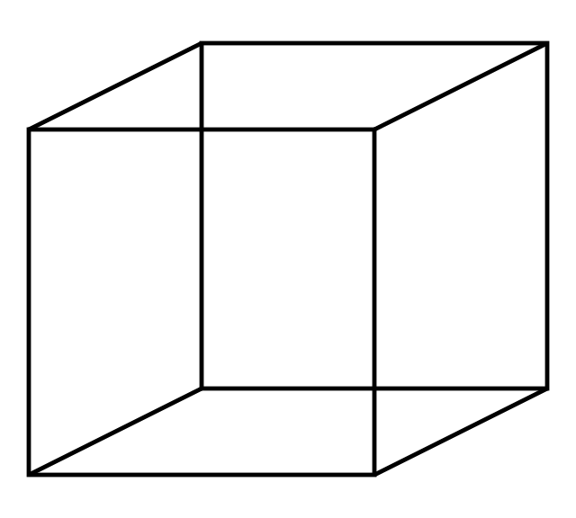{width=75% fig-align="center"}

## Grafos: Máquina de Turing

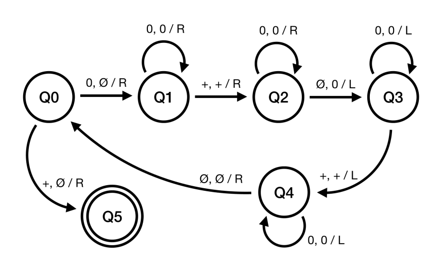{width=75% fig-align="center"}

## Grafos: Organização de Computadores

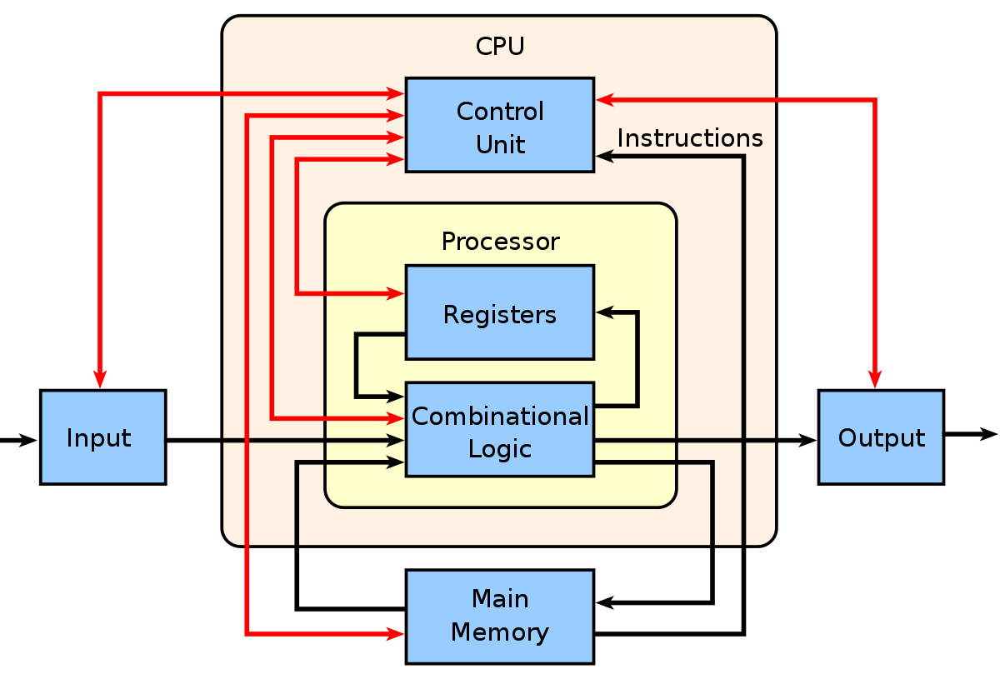{width=75% fig-align="center"}

## Grafos: Local Area Network

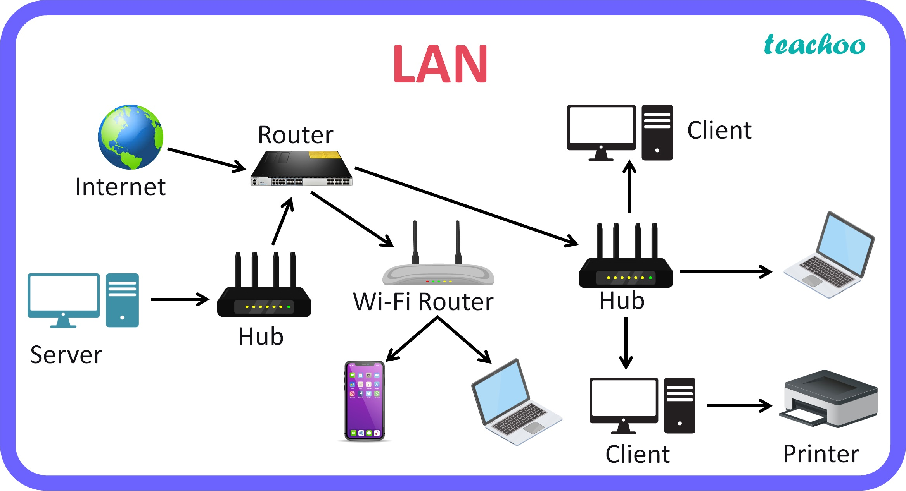{width=75% fig-align="center"}

## Grafos: Deep Learning

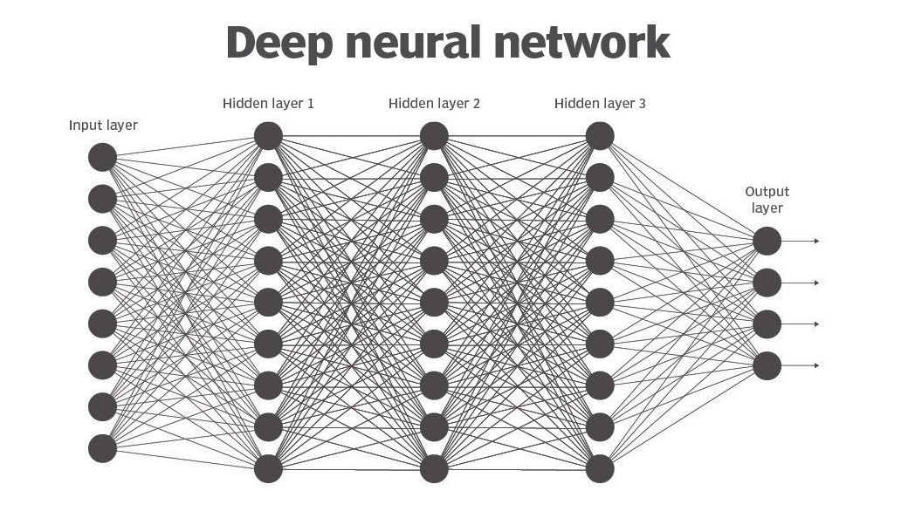{width=75% fig-align="center"}

## Grafos: Graph Neural Network

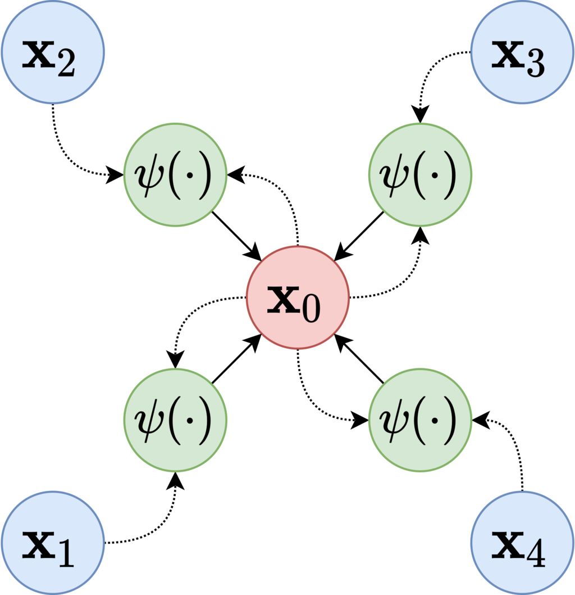{width=60% fig-align="center"}

## Grafos: Sistema Nervoso

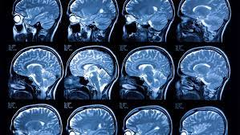{width=75% fig-align="center"}

## Grafos: Rede de Genes

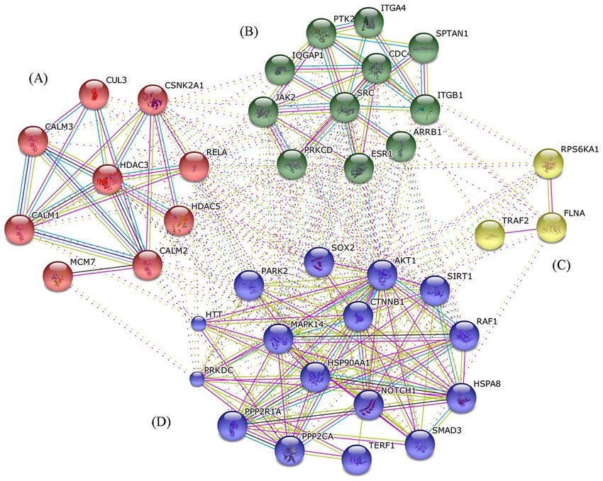{width=75% fig-align="center"}

## Grafos: Filogenia

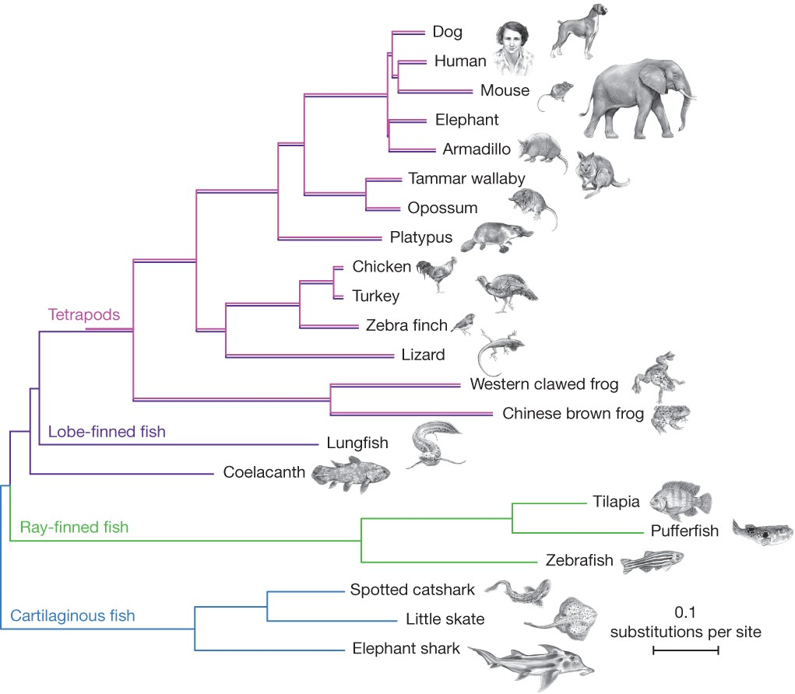{width=75% fig-align="center"}

## Grafos: Cadeia Alimentar

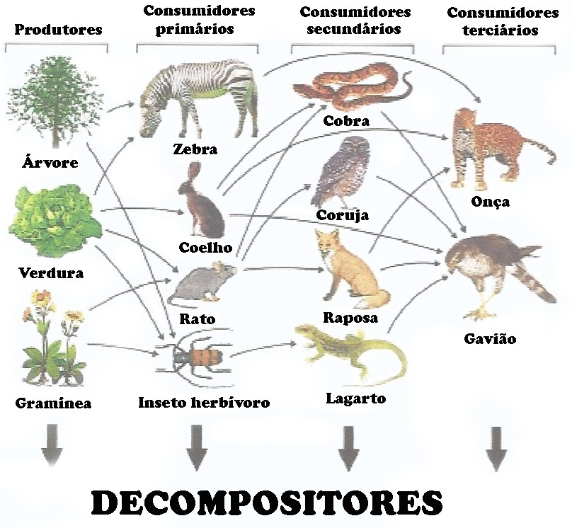{width=70% fig-align="center"}

## Grafos: Rede Social

{width=75% fig-align="center"}

## Grafos: Rede de Citações

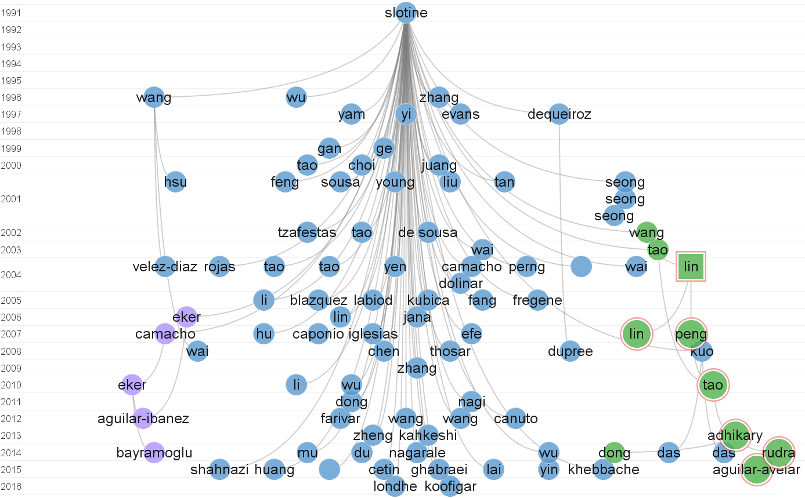{width=75% fig-align="center"}

## Grafos: Personagens

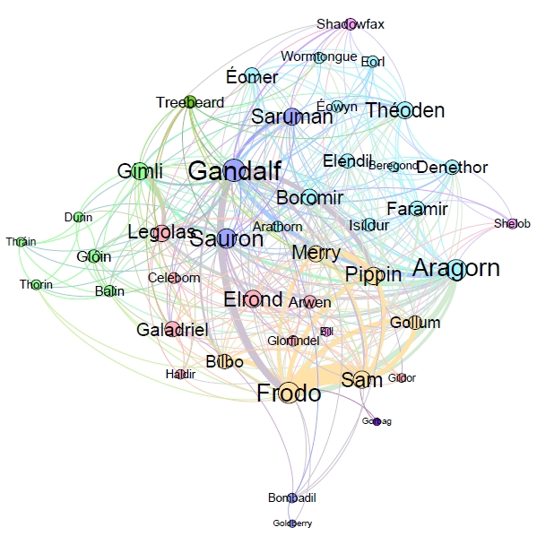{width=65% fig-align="center"}

[I will be there for you: six friends in a clique](https://arxiv.org/abs/1804.04408){.small}

## Grafos: Rodovias

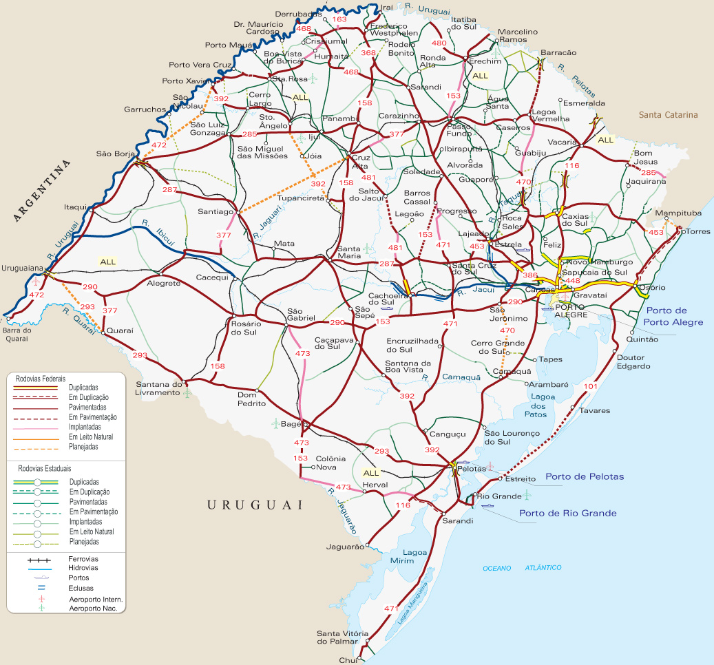{width=70% fig-align="center"}

## Grafos: Rotas Aéreas

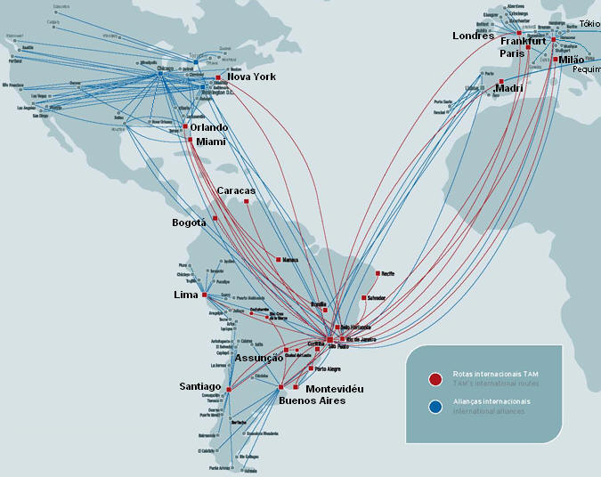{width=65% fig-align="center"}

## Grafos: Cabos Submarinos

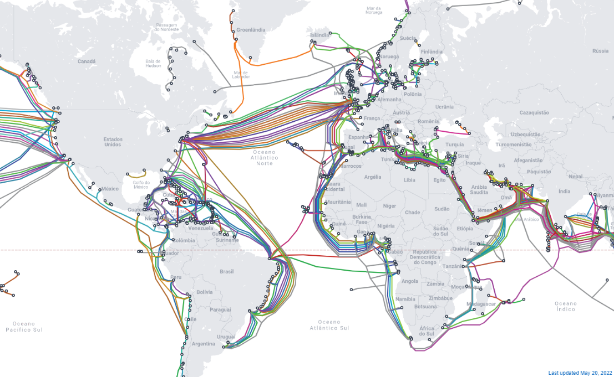{width=100% fig-align="center"}

## Grafos: Mundo

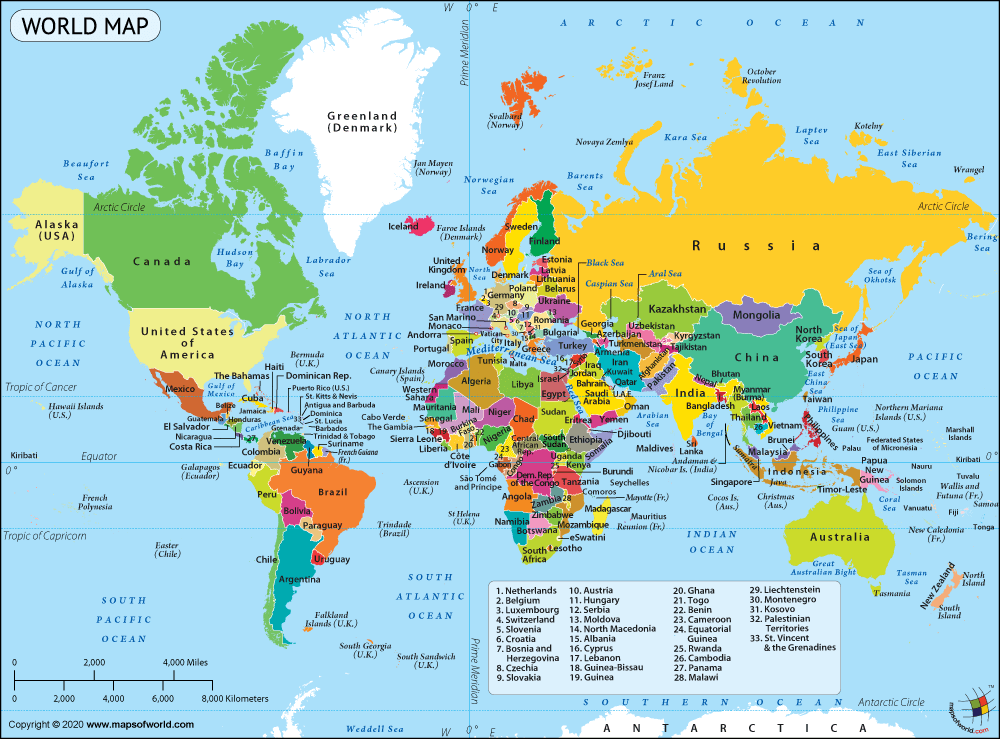{width=100% fig-align="center"}

## Grafos

{width=50% fig-align="center"}

## Leonhard Euler (1707--1783)

{width=100% fig-align="center"}

## As Sete Pontes de Königsberg (1736)

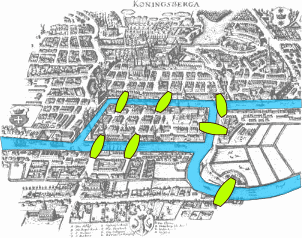{width=100% fig-align="center"}

[Wikipedia](https://pt.wikipedia.org/wiki/Sete_pontes_de_K%C3%B6nigsberg)

# Grafos Simples

## Grafos Simples

> [**Definição:**]{.label-def} Um **grafo simples** é uma tupla $(V,E)$ onde:
>
> - $V$ é um conjunto não-vazio de vértices.
> - $E$ é um conjunto de subconjuntos de $V$ com exatos dois elementos (chamados arestas).

. . .

[**Exemplo:**]{.label-exmp} 

$G_1 = (\{A,B,C,D,E,F\}, \{\{A,B\}, \{B,D\}, \{B,E\}, \{D,E\}, \{E,F\}\})$

. . .

- Grafos são comumente *desenhados* como diagramas onde **vértices** são **pontos** e **arestas** são **linhas** conectando dois vértices distintos.

<div style="display: flex; justify-content: center; align-items: center; gap: 24px; margin-top: 15px;">
  <div style="font-size: 1.3em; font-weight: bold;">$G_1 =$</div>
  <div id="grafo-g1-simples" style="width: 300px; height: 180px; position: relative;"></div>
</div>
<script>
(() => {
  const container = document.getElementById("grafo-g1-simples");
  if (!container || typeof cytoscape === "undefined") return;
  cytoscape({
    container,
    elements: [
      { data: { id: "A", label: "A" }, position: { x: 40, y: 40 } },
      { data: { id: "B", label: "B" }, position: { x: 150, y: 40 } },
      { data: { id: "C", label: "C" }, position: { x: 260, y: 40 } },
      { data: { id: "D", label: "D" }, position: { x: 40, y: 140 } },
      { data: { id: "E", label: "E" }, position: { x: 150, y: 140 } },
      { data: { id: "F", label: "F" }, position: { x: 260, y: 140 } },

      { data: { id: "eAB", source: "A", target: "B" } },
      { data: { id: "eBD", source: "B", target: "D" } },
      { data: { id: "eBE", source: "B", target: "E" } },
      { data: { id: "eDE", source: "D", target: "E" } },
      { data: { id: "eEF", source: "E", target: "F" } }
    ],
    style: [
      {
        selector: "node",
        style: {
          label: "data(label)",
          width: 30,
          height: 30,
          "background-color": "#23373b",
          color: "#ffffff",
          "font-size": 13,
          "font-weight": "bold",
          "text-valign": "center",
          "text-halign": "center",
          "border-width": 2,
          "border-color": "#1a2a2d"
        }
      },
      {
        selector: "edge",
        style: {
          width: 2.5,
          "line-color": "#555555",
          "curve-style": "straight"
        }
      }
    ],
    layout: { name: "preset" },
    userZoomingEnabled: false,
    userPanningEnabled: false
  });
})();
</script>

## Representação Gráfica

> [**Nota:**]{.label-rmk} Um mesmo grafo pode ser **desenhado** de muitas formas diferentes.

<br>

Contudo, o jeito de desenhá-lo não o modifica, visto que o grafo é uma estrutura algébrica que representa somente conexão entre nodos.

<br>

[**Exemplo:**]{.label-exmp}

<div style="display: flex; justify-content: center; align-items: center; gap: 24px; margin-top: 15px;">
  <div id="grafo-repr1" style="width: 300px; height: 180px; position: relative;"></div>
  <div style="font-size: 2.2em; font-weight: bold; color: #555;">=</div>
  <div id="grafo-repr2" style="width: 300px; height: 180px; position: relative;"></div>
</div>
<script>
(() => {
  const container1 = document.getElementById("grafo-repr1");
  if (container1 && typeof cytoscape !== "undefined") {
    cytoscape({
      container: container1,
      elements: [
        { data: { id: "A", label: "A" }, position: { x: 40, y: 40 } },
        { data: { id: "B", label: "B" }, position: { x: 150, y: 40 } },
        { data: { id: "C", label: "C" }, position: { x: 260, y: 40 } },
        { data: { id: "D", label: "D" }, position: { x: 40, y: 140 } },
        { data: { id: "E", label: "E" }, position: { x: 150, y: 140 } },
        { data: { id: "F", label: "F" }, position: { x: 260, y: 140 } },

        { data: { id: "eAB", source: "A", target: "B" } },
        { data: { id: "eBD", source: "B", target: "D" } },
        { data: { id: "eBE", source: "B", target: "E" } },
        { data: { id: "eDE", source: "D", target: "E" } },
        { data: { id: "eEF", source: "E", target: "F" } }
      ],
      style: [
        {
          selector: "node",
          style: {
            label: "data(label)",
            width: 30,
            height: 30,
            "background-color": "#23373b",
            color: "#ffffff",
            "font-size": 13,
            "font-weight": "bold",
            "text-valign": "center",
            "text-halign": "center",
            "border-width": 2,
            "border-color": "#1a2a2d"
          }
        },
        {
          selector: "edge",
          style: {
            width: 2.5,
            "line-color": "#555555",
            "curve-style": "straight"
          }
        }
      ],
      layout: { name: "preset" },
      userZoomingEnabled: false,
      userPanningEnabled: false
    });
  }

  const container2 = document.getElementById("grafo-repr2");
  if (container2 && typeof cytoscape !== "undefined") {
    cytoscape({
      container: container2,
      elements: [
        { data: { id: "D", label: "D" }, position: { x: 40, y: 40 } },
        { data: { id: "B", label: "B" }, position: { x: 150, y: 40 } },
        { data: { id: "F", label: "F" }, position: { x: 260, y: 40 } },
        { data: { id: "E", label: "E" }, position: { x: 80, y: 140 } },
        { data: { id: "A", label: "A" }, position: { x: 170, y: 140 } },
        { data: { id: "C", label: "C" }, position: { x: 260, y: 140 } },

        { data: { id: "eAB", source: "A", target: "B" } },
        { data: { id: "eBD", source: "B", target: "D" } },
        { data: { id: "eBE", source: "B", target: "E" } },
        { data: { id: "eDE", source: "D", target: "E" } },
        { data: { id: "eEF", source: "E", target: "F" } }
      ],
      style: [
        {
          selector: "node",
          style: {
            label: "data(label)",
            width: 30,
            height: 30,
            "background-color": "#23373b",
            color: "#ffffff",
            "font-size": 13,
            "font-weight": "bold",
            "text-valign": "center",
            "text-halign": "center",
            "border-width": 2,
            "border-color": "#1a2a2d"
          }
        },
        {
          selector: "edge",
          style: {
            width: 2.5,
            "line-color": "#555555",
            "curve-style": "straight"
          }
        }
      ],
      layout: { name: "preset" },
      userZoomingEnabled: false,
      userPanningEnabled: false
    });
  }
})();
</script>

## Grafos Simples: Contagem Básica

- Considere um conjunto $V$ de tamanho $n$.

<br>

. . .

[**Pergunta:**]{.label-qstn} Se formos construir um grafo simples usando os elementos de $V$ como nodos, qual o [número máximo de arestas]{.red} que podemos inserir?

. . .

> [**Resposta:**]{.label-ansr} Uma **aresta para cada par distinto de nodos**, ou seja, o número de possíveis pares de nodos (sem considerar ordem entre eles).

$$\binom{n}{2} = \frac{n!}{(n-2)! \cdot 2!} = \frac{1}{2}n^2 - \frac{1}{2}n$$

## Grafos Simples: Contagem Básica

- Considere um conjunto $V$ de tamanho $n$.

<br>

. . .

[**Pergunta:**]{.label-qstn} Quantos **grafos distintos** podemos construir sobre o conjunto de vértices $V$?

. . .

> [**Resposta:**]{.label-ansr} Considerando que todos os nodos sempre estarão presentes, o que diferenciará os grafos será quais arestas estão presentes. Cada aresta pode ou não existir no grafo (duas opções), e temos **$\binom{n}{2}$ possíveis arestas**.
>
> $$2 \times 2 \times 2 \times \dots = 2^{\binom{n}{2}} = 2^{\frac{1}{2}n^2 - \frac{1}{2}n}$$

## Grafos Simples: Contagem Básica

<br>

| $n$ | $1$ | $2$ | $3$ | $4$ | $5$ | $6$ | $7$ | $8$ |
|:---|:---:|:---:|:---:|:---:|:---:|:---:|:---:|:---:|
| Máximo de arestas | $0$ | $1$ | $3$ | $6$ | $10$ | $15$ | $21$ | $28$ |
| Grafos simples possíveis | $1$ | $2$ | $8$ | $64$ | $1.024$ | $32.768$ | $2.097.152$ | $268.435.456$ |

# Relações de Incidência e Adjacência

## Relação de Incidência

> [**Definição:**]{.label-def} **Relação de incidência** de $G$ (sobre $E \times V$) relaciona **arestas** com os **vértices** que elas conectam.

. . .

> [**Definição:**]{.label-def} **Matriz de incidência**: representação matricial da **relação de incidência** de um grafo simples.

. . .

[**Exemplo:**]{.label-exmp} Matriz de incidência de $G_1$:

:::: {.columns style="display: flex; align-items: center;"}
::: {.column width="55%"}
$$
\begin{array}{c|cccccc}
 & A & B & C & D & E & F \\ 
\hline  
\{A,B\} & 1 & 1 & 0 & 0 & 0 & 0 \\ 
\{B,D\} & 0 & 1 & 0 & 1 & 0 & 0 \\ 
\{B,E\} & 0 & 1 & 0 & 0 & 1 & 0 \\
\{D,E\} & 0 & 0 & 0 & 1 & 1 & 0 \\ 
\{E,F\} & 0 & 0 & 0 & 0 & 1 & 1
\end{array} 
$$
:::
::: {.column width="45%"}
<div id="grafo-g1-incidencia" style="width: 320px; height: 180px; margin: 0 auto; position: relative;"></div>
<script>
(() => {
  const container = document.getElementById("grafo-g1-incidencia");
  if (!container || typeof cytoscape === "undefined") return;
  const cy = cytoscape({
    container,
    elements: [
      { data: { id: "A", label: "A" }, position: { x: 50, y: 45 } },
      { data: { id: "B", label: "B" }, position: { x: 150, y: 45 } },
      { data: { id: "C", label: "C" }, position: { x: 260, y: 45 } },
      { data: { id: "D", label: "D" }, position: { x: 40, y: 165 } },
      { data: { id: "E", label: "E" }, position: { x: 150, y: 165 } },
      { data: { id: "F", label: "F" }, position: { x: 260, y: 165 } },

      { data: { id: "eAB", source: "A", target: "B" } },
      { data: { id: "eBD", source: "B", target: "D" } },
      { data: { id: "eBE", source: "B", target: "E" } },
      { data: { id: "eDE", source: "D", target: "E" } },
      { data: { id: "eEF", source: "E", target: "F" } }
    ],
    style: [
      {
        selector: "node",
        style: {
          label: "data(label)",
          width: 30,
          height: 30,
          "background-color": "#23373b",
          color: "#ffffff",
          "font-size": 13,
          "font-weight": "bold",
          "text-valign": "center",
          "text-halign": "center",
          "border-width": 2,
          "border-color": "#1a2a2d"
        }
      },
      {
        selector: "edge",
        style: {
          width: 2.5,
          "line-color": "#555555",
          "curve-style": "straight"
        }
      }
    ],
    layout: { name: "preset" },
    userZoomingEnabled: false,
    userPanningEnabled: false
  });
})();
</script>
:::
::::

## Relação de Adjacência (Vértices)

> [**Definição:**]{.label-def} **Relação de adjacência de vértices** de $G$ (sobre $V\times V$) relaciona vértices conectados por arestas.

. . .

> [**Definição:**]{.label-def} **Matriz de adjacência de vértices**: representação matricial da relação de adjacência de um grafo simples.

. . .

[**Exemplo:**]{.label-exmp} Matriz de adjacência (vértices) de $G_1$:

:::: {.columns style="display: flex; align-items: center;"}
::: {.column width="55%"}
$$
\begin{array}{l|cccccc}
  & A & B & C & D & E & F \\
\hline 
A & 0 & 1 & 0 & 0 & 0 & 0 \\
B & 1 & 0 & 0 & 1 & 1 & 0 \\
C & 0 & 0 & 0 & 0 & 0 & 0 \\
D & 0 & 1 & 0 & 0 & 1 & 0 \\
E & 0 & 1 & 0 & 1 & 0 & 1 \\
F & 0 & 0 & 0 & 0 & 1 & 0 \\
\end{array}
$$
:::
::: {.column width="45%"}
<div id="grafo-g1-adj-vertices" style="width: 300px; height: 180px; margin: 0 auto; position: relative;"></div>
<script>
(() => {
  const container = document.getElementById("grafo-g1-adj-vertices");
  if (!container || typeof cytoscape === "undefined") return;
  cytoscape({
    container,
    elements: [
      { data: { id: "A", label: "A" }, position: { x: 40, y: 45 } },
      { data: { id: "B", label: "B" }, position: { x: 150, y: 45 } },
      { data: { id: "C", label: "C" }, position: { x: 260, y: 45 } },
      { data: { id: "D", label: "D" }, position: { x: 40, y: 165 } },
      { data: { id: "E", label: "E" }, position: { x: 150, y: 165 } },
      { data: { id: "F", label: "F" }, position: { x: 260, y: 165 } },

      { data: { id: "eAB", source: "A", target: "B" } },
      { data: { id: "eBD", source: "B", target: "D" } },
      { data: { id: "eBE", source: "B", target: "E" } },
      { data: { id: "eDE", source: "D", target: "E" } },
      { data: { id: "eEF", source: "E", target: "F" } }
    ],
    style: [
      {
        selector: "node",
        style: {
          label: "data(label)",
          width: 30,
          height: 30,
          "background-color": "#23373b",
          color: "#ffffff",
          "font-size": 13,
          "font-weight": "bold",
          "text-valign": "center",
          "text-halign": "center",
          "border-width": 2,
          "border-color": "#1a2a2d"
        }
      },
      {
        selector: "edge",
        style: {
          width: 2.5,
          "line-color": "#555555",
          "curve-style": "straight"
        }
      }
    ],
    layout: { name: "preset" },
    userZoomingEnabled: false,
    userPanningEnabled: false
  });
})();
</script>
:::
::::

## Relação de Adjacência (Arestas)

> [**Definição:**]{.label-def} **Relação de adjacência de arestas** de $G$ (sobre $E\times E$) relaciona arestas que incidem sobre um único vértice comum.

. . .

> [**Definição:**]{.label-def} **Matriz de adjacência**: representação matricial da relação de adjacência.

. . .

[**Exemplo:**]{.label-exmp} Matriz de adjacência (arestas) de $G_1$:

:::: {.columns style="display: flex; align-items: center;"}
::: {.column width="67%"}
$$
\footnotesize
\begin{array}{c|ccccc}
        & \{A,B\} & \{B,D\} & \{B,E\} & \{D,E\} & \{E,F\} \\ 
\hline  
\{A,B\} & 0       & 1       & 1       & 0       & 0  \\ 
\{B,D\} & 1       & 0       & 1       & 1       & 0  \\ 
\{B,E\} & 1       & 1       & 0       & 1       & 1  \\ 
\{D,E\} & 0       & 1       & 1       & 0       & 1  \\ 
\{E,F\} & 0       & 0       & 1       & 1       & 0 
\end{array} 
$$
:::
::: {.column width="33%"}
<div id="grafo-g1-adj-arestas" style="width: 270px; height: 170px; margin: 0 auto; position: relative;"></div>
<script>
(() => {
  const container = document.getElementById("grafo-g1-adj-arestas");
  if (!container || typeof cytoscape === "undefined") return;
  cytoscape({
    container,
    elements: [
      { data: { id: "A", label: "A" }, position: { x: 35, y: 35 } },
      { data: { id: "B", label: "B" }, position: { x: 135, y: 35 } },
      { data: { id: "C", label: "C" }, position: { x: 235, y: 35 } },
      { data: { id: "D", label: "D" }, position: { x: 35, y: 135 } },
      { data: { id: "E", label: "E" }, position: { x: 135, y: 135 } },
      { data: { id: "F", label: "F" }, position: { x: 235, y: 135 } },

      { data: { id: "eAB", source: "A", target: "B" } },
      { data: { id: "eBD", source: "B", target: "D" } },
      { data: { id: "eBE", source: "B", target: "E" } },
      { data: { id: "eDE", source: "D", target: "E" } },
      { data: { id: "eEF", source: "E", target: "F" } }
    ],
    style: [
      {
        selector: "node",
        style: {
          label: "data(label)",
          width: 30,
          height: 30,
          "background-color": "#23373b",
          color: "#ffffff",
          "font-size": 13,
          "font-weight": "bold",
          "text-valign": "center",
          "text-halign": "center",
          "border-width": 2,
          "border-color": "#1a2a2d"
        }
      },
      {
        selector: "edge",
        style: {
          width: 2.5,
          "line-color": "#555555",
          "curve-style": "straight"
        }
      }
    ],
    layout: { name: "preset" },
    userZoomingEnabled: false,
    userPanningEnabled: false
  });
})();
</script>
:::
::::

## Propriedades da Relação de Adjacência

Uma **relação de adjacência** $R$ sobre $U \times U$ é:

- **Irreflexiva:**

>  $$\forall a \in U, \quad (a,a) \notin R$$

. . .

- **Simétrica:**

>  $$\forall a,b \in U, \quad (a,b) \in R \Rightarrow (b,a) \in R$$

. . .

> [**Nota:**]{.label-rmk} $U$ pode ser $V$ (nodos) ou $E$ (arestas) de um **grafo simples**.

## Armazenamento de Grafos em Memória

Grafos simples podem ser armazenados de várias formas em computadores:

- **Matriz de incidência**
- **Matriz de adjacência de vértices**
- **Lista encadeada de incidência/adjacência**

# Representações de Grafos em Memória

## Lista de Adjacência {.scrollable .live-code-slide}

* Em **Python**, representamos grafos através de **dicionários de listas de adjacência**:
  - **Vértice ($u \in V$):** chave do dicionário (qualquer tipo *hashable*, ex: `str`, `int`).
  - **Vizinhos ($\text{Adj}(u)$):** lista de vértices conectados a $u$.
  - **Invariante:** todo vértice referenciado nas listas de adjacência deve ser uma chave válida do dicionário.

```{pyodide}
from typing import Dict, List, Tuple

# Definição dos tipos
Node = str
Graph = dict[Node, list[Node]]

# Exemplo de grafo não-direcionado
g : Graph = {
    'A': ['B'],
    'B': ['A', 'D', 'E'],
    'C': [],
    'D': ['B', 'E'],
    'E': ['B', 'D', 'F'],
    'F': ['E'],
}

print("Vértices :", list(g.keys()))
print("Vizinhos de B:", g['B'])
```

## Exemplo: Grafo em Python

:::: columns
::: {.column width="45%"}
Matriz de adjacência:

$$
\begin{array}{l|cccccc}
  & A & B & C & D & E & F \\
\hline 
A & 0 & 1 & 0 & 0 & 0 & 0 \\
B & 1 & 0 & 0 & 1 & 1 & 0 \\
C & 0 & 0 & 0 & 0 & 0 & 0 \\
D & 0 & 1 & 0 & 0 & 1 & 0 \\
E & 0 & 1 & 0 & 1 & 0 & 1 \\
F & 0 & 0 & 0 & 0 & 1 & 0 \\
\end{array}
$$
:::

::: {.column width="55%"}
Código Python (dicionário de adjacências):

```python
g1 = {
    'A': ['B'],
    'B': ['A', 'D', 'E'],
    'C': [],
    'D': ['B', 'E'],
    'E': ['B', 'D', 'F'],
    'F': ['E'],
}
```
:::
::::

# Análise de Complexidade

## Algoritmos e Análise

- Grafos em Python (ver o repositório da disciplina):
[graph_example.ipynb](https://github.com/BrunoGrisci/projeto-e-analise-de-algoritmos/blob/main/paa1/graph_example.ipynb)

<br>

[**Pergunta:**]{.label-qstn} Qual a complexidade de encontrar o tamanho de uma lista com $n$ elementos?

. . .

[**Resposta:**]{.label-ansr} $O(n)$ ou $O(1)$ se o tamanho atual da lista sempre for guardado junto dela.

<br>

- [Python TimeComplexity](https://wiki.python.org/moin/TimeComplexity)
- [Complexity of len with regard to sets and lists](https://www.geeksforgeeks.org/python/complexity-of-len-with-regard-to-sets-and-lists/)

## Complexidade: Matriz vs. Lista de Adjacência

Seja $n = |V|$ e $m = |E|$.

. . .

| **Operação** | **Matriz** | **Lista** |
|:---|:---:|:---:|
| Espaço | $O(n^2)$ | $O(n + m)$ |
| Verificar aresta $(u,v)$ | $O(1)$ | $O(\deg(u))$ |
| Listar vizinhos de $v$ | $O(n)$ | $O(\deg(v))$ |
| Inserir aresta | $O(1)$ | $O(1)$ |
| Remover aresta | $O(1)$ | $O(\deg(u))$ |

## Quando Usar Cada Representação?

**Matriz de adjacência:**

- Grafo **denso** ($m \approx n^2$): 
  - o custo de espaço $O(n^2)$ é aceitável.
- Consultas de adjacência frequentes: verificar $(u,v) \in E$ em $O(1)$.

. . .

**Lista de adjacência:**

- Grafo **esparso** ($m \ll n^2$): economia de espaço $O(n+m)$.
- Algoritmos que percorrem vizinhos de cada vértice (BFS, DFS, ...): 
  - custo $O(\deg(v))$ por vértice é ótimo.

. . .

> [**Nota:**]{.label-rmk} A maioria dos grafos do mundo real é *esparsa* $\Rightarrow$ listas de adjacência são a representação padrão.


# Subgrafos

## Subgrafo

> [**Definição:**]{.label-def} Dois grafos $G = (V,E)$ e $G'=(V',E')$ são **iguais** sss $V = V'$ e $E = E'$.

. . .

> [**Definição:**]{.label-def} Um grafo $G = (V,E)$ é **subgrafo** de $G'=(V',E')$, escrito $G \subseteq G'$, sss $V \subseteq V'$ e $E \subseteq E'$. O grafo $G'$ é chamado **sobregrafo** de $G$.

. . .

> [**Definição:**]{.label-def} Um grafo $G$ é **subgrafo próprio** de $G'$, escrito $G \subset G'$, sss $G \subseteq G'$ e $G \neq G'$.

. . .

[**Exemplo:**]{.label-exmp}

<div style="display: flex; justify-content: center; align-items: center; gap: 24px; margin-top: 15px;">
  <div id="grafo-sub1" style="width: 300px; height: 180px; position: relative;"></div>
  <div style="font-size: 2.2em; font-weight: bold; color: #555;">&sub;</div>
  <div id="grafo-sub2" style="width: 300px; height: 180px; position: relative;"></div>
</div>
<script>
(() => {
  const c1 = document.getElementById("grafo-sub1");
  if (c1 && typeof cytoscape !== "undefined") {
    cytoscape({
      container: c1,
      elements: [
        { data: { id: "A", label: "A" }, position: { x: 40,  y: 40  } },
        { data: { id: "B", label: "B" }, position: { x: 150, y: 40  } },
        { data: { id: "D", label: "D" }, position: { x: 40,  y: 140 } },
        { data: { id: "E", label: "E" }, position: { x: 150, y: 140 } },
        { data: { id: "eAB", source: "A", target: "B" } }
      ],
      style: [
        { selector: "node", style: { label: "data(label)", width: 30, height: 30, "background-color": "#23373b", color: "#ffffff", "font-size": 13, "font-weight": "bold", "text-valign": "center", "text-halign": "center", "border-width": 2, "border-color": "#1a2a2d" } },
        { selector: "edge", style: { width: 2.5, "line-color": "#555555", "curve-style": "straight" } }
      ],
      layout: { name: "preset" },
      userZoomingEnabled: false,
      userPanningEnabled: false
    });
  }
  const c2 = document.getElementById("grafo-sub2");
  if (c2 && typeof cytoscape !== "undefined") {
    cytoscape({
      container: c2,
      elements: [
        { data: { id: "A", label: "A" }, position: { x: 40,  y: 40  } },
        { data: { id: "B", label: "B" }, position: { x: 150, y: 40  } },
        { data: { id: "C", label: "C" }, position: { x: 260, y: 40  } },
        { data: { id: "D", label: "D" }, position: { x: 40,  y: 140 } },
        { data: { id: "E", label: "E" }, position: { x: 150, y: 140 } },
        { data: { id: "F", label: "F" }, position: { x: 260, y: 140 } },
        { data: { id: "eAB", source: "A", target: "B" } },
        { data: { id: "eBD", source: "B", target: "D" } },
        { data: { id: "eBE", source: "B", target: "E" } },
        { data: { id: "eDE", source: "D", target: "E" } },
        { data: { id: "eEF", source: "E", target: "F" } }
      ],
      style: [
        { selector: "node", style: { label: "data(label)", width: 30, height: 30, "background-color": "#23373b", color: "#ffffff", "font-size": 13, "font-weight": "bold", "text-valign": "center", "text-halign": "center", "border-width": 2, "border-color": "#1a2a2d" } },
        { selector: "edge", style: { width: 2.5, "line-color": "#555555", "curve-style": "straight" } }
      ],
      layout: { name: "preset" },
      userZoomingEnabled: false,
      userPanningEnabled: false
    });
  }
})();
</script>

## Subgrafo Induzido

> [**Definição:**]{.label-def} Seja $G = (V,E)$ um grafo e $V' \subseteq V$ um subconjunto de vértices de $G$. O **subgrafo $G'$ induzido por $V'$** é definido por:
> $$G' = (V', \{\{a,b\} \mid \{a,b\} \in E \land a \in V' \land b \in V'\})$$

**Intuição:** O subgrafo induzido por um conjunto de vértices contém todas (e somente) as arestas do grafo original sobre os vértices selecionados.

<br>

[**Exemplo:**]{.label-exmp} Para $G$ com $V' = \{A,B,C,E\}$:

<div style="display: flex; justify-content: center; align-items: center; gap: 24px; margin-top: 15px;">
  <div id="grafo-induzido1" style="width: 300px; height: 180px; position: relative;"></div>
  <div style="font-size: 2.2em; font-weight: bold; color: #555;">&rArr;</div>
  <div id="grafo-induzido2" style="width: 300px; height: 180px; position: relative;"></div>
</div>
<script>
(() => {
  const c1 = document.getElementById("grafo-induzido1");
  if (c1 && typeof cytoscape !== "undefined") {
    cytoscape({
      container: c1,
      elements: [
        { data: { id: "A", label: "A" }, position: { x: 40,  y: 40  } },
        { data: { id: "B", label: "B" }, position: { x: 150, y: 40  } },
        { data: { id: "C", label: "C" }, position: { x: 260, y: 40  } },
        { data: { id: "D", label: "D" }, position: { x: 40,  y: 140 } },
        { data: { id: "E", label: "E" }, position: { x: 150, y: 140 } },
        { data: { id: "F", label: "F" }, position: { x: 260, y: 140 } },
        { data: { id: "eAB", source: "A", target: "B" } },
        { data: { id: "eBD", source: "B", target: "D" } },
        { data: { id: "eBE", source: "B", target: "E" } },
        { data: { id: "eDE", source: "D", target: "E" } },
        { data: { id: "eEF", source: "E", target: "F" } }
      ],
      style: [
        { selector: "node", style: { label: "data(label)", width: 30, height: 30, "background-color": "#23373b", color: "#ffffff", "font-size": 13, "font-weight": "bold", "text-valign": "center", "text-halign": "center", "border-width": 2, "border-color": "#1a2a2d" } },
        { selector: "edge", style: { width: 2.5, "line-color": "#555555", "curve-style": "straight" } }
      ],
      layout: { name: "preset" },
      userZoomingEnabled: false,
      userPanningEnabled: false
    });
  }
  const c2 = document.getElementById("grafo-induzido2");
  if (c2 && typeof cytoscape !== "undefined") {
    cytoscape({
      container: c2,
      elements: [
        { data: { id: "A", label: "A" }, position: { x: 40,  y: 40  } },
        { data: { id: "B", label: "B" }, position: { x: 150, y: 40  } },
        { data: { id: "C", label: "C" }, position: { x: 260, y: 40  } },
        { data: { id: "E", label: "E" }, position: { x: 150, y: 140 } },
        { data: { id: "eAB", source: "A", target: "B" } },
        { data: { id: "eBE", source: "B", target: "E" } }
      ],
      style: [
        { selector: "node", style: { label: "data(label)", width: 30, height: 30, "background-color": "#2e75b6", color: "#ffffff", "font-size": 13, "font-weight": "bold", "text-valign": "center", "text-halign": "center", "border-width": 2, "border-color": "#1b4f72" } },
        { selector: "edge", style: { width: 2.5, "line-color": "#2e75b6", "curve-style": "straight" } }
      ],
      layout: { name: "preset" },
      userZoomingEnabled: false,
      userPanningEnabled: false
    });
  }
})();
</script>

# Graus

## Graus

{width=100% fig-align="center"}

## Grau de um Nodo

> [**Definição:**]{.label-def} O **grau** de um nodo $n$, escrito $\deg(n)$, é o **número de arestas** que incidem sobre $n$.

[**Exemplo:**]{.label-exmp}

:::: {.columns style="display: flex; align-items: center;"}
::: {.column width="50%"}
<div id="grafo-g1-grau" style="width: 300px; height: 180px; margin: 0 auto; position: relative;"></div>
<script>
(() => {
  const container = document.getElementById("grafo-g1-grau");
  if (!container || typeof cytoscape === "undefined") return;
  cytoscape({
    container,
    elements: [
      { data: { id: "A", label: "A" }, position: { x: 40, y: 40 } },
      { data: { id: "B", label: "B" }, position: { x: 150, y: 40 } },
      { data: { id: "C", label: "C" }, position: { x: 260, y: 40 } },
      { data: { id: "D", label: "D" }, position: { x: 40, y: 140 } },
      { data: { id: "E", label: "E" }, position: { x: 150, y: 140 } },
      { data: { id: "F", label: "F" }, position: { x: 260, y: 140 } },

      { data: { id: "eAB", source: "A", target: "B" } },
      { data: { id: "eBD", source: "B", target: "D" } },
      { data: { id: "eBE", source: "B", target: "E" } },
      { data: { id: "eDE", source: "D", target: "E" } },
      { data: { id: "eEF", source: "E", target: "F" } }
    ],
    style: [
      {
        selector: "node",
        style: {
          label: "data(label)",
          width: 30,
          height: 30,
          "background-color": "#23373b",
          color: "#ffffff",
          "font-size": 13,
          "font-weight": "bold",
          "text-valign": "center",
          "text-halign": "center",
          "border-width": 2,
          "border-color": "#1a2a2d"
        }
      },
      {
        selector: "edge",
        style: {
          width: 2.5,
          "line-color": "#555555",
          "curve-style": "straight"
        }
      }
    ],
    layout: { name: "preset" },
    userZoomingEnabled: false,
    userPanningEnabled: false
  });
})();
</script>
:::
::: {.column width="50%"}
- $\deg(A) = 1$
- $\deg(B) = 3$
- $\deg(C) = 0$
- $\deg(D) = 2$
- $\deg(E) = 3$
- $\deg(F) = 1$
:::
::::

> [**Nota:**]{.label-rmk} $\deg(n)$ é definido somente quando o número de arestas incidentes sobre $n$ é finito.

## Grau de um Nodo e Matriz de Incidência

Em um grafo simples, podemos calcular o grau de um nodo somando a coluna correspondente ao nodo na matriz de incidência.

[**Exemplo:**]{.label-exmp}

:::: {.columns style="display: flex; align-items: center;"}
::: {.column width="55%"}
$$
\begin{array}{c|cccccc}
 & A & B & C & D & E & F \\ 
\hline  
\{A,B\} & 1 & 1 & 0 & 0 & 0 & 0 \\ 
\{B,D\} & 0 & 1 & 0 & 1 & 0 & 0 \\ 
\{B,E\} & 0 & 1 & 0 & 0 & 1 & 0 \\ 
\{D,E\} & 0 & 0 & 0 & 1 & 1 & 0 \\ 
\{E,F\} & 0 & 0 & 0 & 0 & 1 & 1 \\
\hline
\hline
\deg     & 1 & 3 & 0 & 2 & 3 & 1 \\
\end{array} 
$$
:::
::: {.column width="45%"}
<div id="grafo-g1-grau-matriz" style="width: 300px; height: 180px; margin: 0 auto; position: relative;"></div>
<script>
(() => {
  const container = document.getElementById("grafo-g1-grau-matriz");
  if (!container || typeof cytoscape === "undefined") return;
  cytoscape({
    container,
    elements: [
      { data: { id: "A", label: "A" }, position: { x: 40, y: 40 } },
      { data: { id: "B", label: "B" }, position: { x: 150, y: 40 } },
      { data: { id: "C", label: "C" }, position: { x: 260, y: 40 } },
      { data: { id: "D", label: "D" }, position: { x: 40, y: 140 } },
      { data: { id: "E", label: "E" }, position: { x: 150, y: 140 } },
      { data: { id: "F", label: "F" }, position: { x: 260, y: 140 } },

      { data: { id: "eAB", source: "A", target: "B" } },
      { data: { id: "eBD", source: "B", target: "D" } },
      { data: { id: "eBE", source: "B", target: "E" } },
      { data: { id: "eDE", source: "D", target: "E" } },
      { data: { id: "eEF", source: "E", target: "F" } }
    ],
    style: [
      {
        selector: "node",
        style: {
          label: "data(label)",
          width: 30,
          height: 30,
          "background-color": "#23373b",
          color: "#ffffff",
          "font-size": 13,
          "font-weight": "bold",
          "text-valign": "center",
          "text-halign": "center",
          "border-width": 2,
          "border-color": "#1a2a2d"
        }
      },
      {
        selector: "edge",
        style: {
          width: 2.5,
          "line-color": "#555555",
          "curve-style": "straight"
        }
      }
    ],
    layout: { name: "preset" },
    userZoomingEnabled: false,
    userPanningEnabled: false
  });
})();
</script>
:::
::::


> [**Lema:**]{.label-lem} *(Handshaking Lemma)* Em um grafo simples $G=(V,E)$:
> $$\sum_{v \in V} \deg(v) = 2 |E|$$

> [**Demonstração:**]{.label-prf} Soma total da matriz de incidência por linhas vs. por colunas.

## Calculando Graus: Matriz vs. Lista de Adjacência

**Grau de um único nodo $v$:**

- **Matriz:** percorre a linha $v$ inteira $\Rightarrow O(n)$.
- **Lista:** comprimento da lista de $v \Rightarrow O(\deg(v))$ ou $O(1)$ dependendo da implementação.

. . .

**Graus de *todos* os nodos:**

- **Matriz:** percorre todas as $n$ linhas de tamanho $n \Rightarrow O(n^2)$.
- **Lista:** percorre todas as listas, cujo tamanho total é $2m \Rightarrow O(n + m)$ ou $O(n)$ dependendo da implementação.

. . .

| **Operação** | **Matriz** | **Lista** |
|:---|:---:|:---:|
| $\deg(v)$ de um nodo | $O(n)$ | $O(\deg(v))$ |
| $\deg(v)$ de todos | $O(n^2)$ | $O(n + m)$ |

## Graus de um Grafo

> [**Definição:**]{.label-def} O **grau mínimo** de um grafo $G$, denotado $\delta(G)$, é o [menor grau]{.red} de nodo do grafo.

. . .

> [**Definição:**]{.label-def} O **grau máximo** de um grafo $G$, denotado $\Delta(G)$, é o [maior grau]{.red} de nodo do grafo.

. . .

> [**Definição:**]{.label-def} Um grafo é **$k$-regular**, ou simplesmente regular, quando $\delta(G) = \Delta(G) = k$ (**todos os nodos têm o mesmo grau** $k$).

## Graus de um Grafo: Exemplos

:::: {.columns style="display: flex; align-items: center;"}
::: {.column width="50%"}
<div style="display: flex; align-items: center; justify-content: center; gap: 10px;">
  <span style="font-weight: bold; font-size: 1.1em;">$G_1 =$</span>
  <div id="grafo-ex-g1" style="width: 220px; height: 110px; position: relative;"></div>
</div>
<script>
(() => {
  const container = document.getElementById("grafo-ex-g1");
  if (!container || typeof cytoscape === "undefined") return;
  cytoscape({
    container,
    elements: [
      { data: { id: "A", label: "A" }, position: { x: 25, y: 25 } },
      { data: { id: "B", label: "B" }, position: { x: 110, y: 25 } },
      { data: { id: "C", label: "C" }, position: { x: 195, y: 25 } },
      { data: { id: "D", label: "D" }, position: { x: 25, y: 85 } },
      { data: { id: "E", label: "E" }, position: { x: 110, y: 85 } },
      { data: { id: "F", label: "F" }, position: { x: 195, y: 85 } },

      { data: { id: "eAB", source: "A", target: "B" } },
      { data: { id: "eBD", source: "B", target: "D" } },
      { data: { id: "eBE", source: "B", target: "E" } },
      { data: { id: "eDE", source: "D", target: "E" } },
      { data: { id: "eEF", source: "E", target: "F" } }
    ],
    style: [
      {
        selector: "node",
        style: {
          label: "data(label)",
          width: 22,
          height: 22,
          "background-color": "#23373b",
          color: "#ffffff",
          "font-size": 11,
          "font-weight": "bold",
          "text-valign": "center",
          "text-halign": "center",
          "border-width": 2,
          "border-color": "#1a2a2d"
        }
      },
      {
        selector: "edge",
        style: {
          width: 2,
          "line-color": "#555555",
          "curve-style": "straight"
        }
      }
    ],
    layout: { name: "preset" },
    userZoomingEnabled: false,
    userPanningEnabled: false
  });
})();
</script>
:::
::: {.column width="50%" .incremental}
- $\delta(G_1) = 0$
- $\Delta(G_1) = 3$
- $G_1$ não é regular
:::
::::

. . .

:::: {.columns style="display: flex; align-items: center;"}
::: {.column width="50%"}
<div style="display: flex; align-items: center; justify-content: center; gap: 10px;">
  <span style="font-weight: bold; font-size: 1.1em;">$G_2 =$</span>
  <div id="grafo-ex-g2" style="width: 160px; height: 110px; position: relative;"></div>
</div>
<script>
(() => {
  const container = document.getElementById("grafo-ex-g2");
  if (!container || typeof cytoscape === "undefined") return;
  cytoscape({
    container,
    elements: [
      { data: { id: "A", label: "A" }, position: { x: 35, y: 20 } },
      { data: { id: "B", label: "B" }, position: { x: 125, y: 20 } },
      { data: { id: "D", label: "D" }, position: { x: 35, y: 55 } },
      { data: { id: "E", label: "E" }, position: { x: 125, y: 55 } },
      { data: { id: "C", label: "C" }, position: { x: 35, y: 90 } },
      { data: { id: "F", label: "F" }, position: { x: 125, y: 90 } },

      { data: { id: "eAB", source: "A", target: "B" } },
      { data: { id: "eDE", source: "D", target: "E" } },
      { data: { id: "eCF", source: "C", target: "F" } }
    ],
    style: [
      {
        selector: "node",
        style: {
          label: "data(label)",
          width: 22,
          height: 22,
          "background-color": "#23373b",
          color: "#ffffff",
          "font-size": 11,
          "font-weight": "bold",
          "text-valign": "center",
          "text-halign": "center",
          "border-width": 2,
          "border-color": "#1a2a2d"
        }
      },
      {
        selector: "edge",
        style: {
          width: 2,
          "line-color": "#555555",
          "curve-style": "straight"
        }
      }
    ],
    layout: { name: "preset" },
    userZoomingEnabled: false,
    userPanningEnabled: false
  });
})();
</script>
:::
::: {.column width="50%" .incremental}
- $\delta(G_2) = 1$
- $\Delta(G_2) = 1$
- $G_2$ é 1-regular
:::
::::

. . .

:::: {.columns style="display: flex; align-items: center;"}
::: {.column width="50%"}
<div style="display: flex; align-items: center; justify-content: center; gap: 10px;">
  <span style="font-weight: bold; font-size: 1.1em;">$G_3 =$</span>
  <div id="grafo-ex-g3" style="width: 180px; height: 120px; position: relative;"></div>
</div>
<script>
(() => {
  const container = document.getElementById("grafo-ex-g3");
  if (!container || typeof cytoscape === "undefined") return;
  cytoscape({
    container,
    elements: [
      // Outer square
      { data: { id: "1", label: "1" }, position: { x: 20, y: 15 } },
      { data: { id: "2", label: "2" }, position: { x: 160, y: 15 } },
      { data: { id: "3", label: "3" }, position: { x: 20, y: 105 } },
      { data: { id: "4", label: "4" }, position: { x: 160, y: 105 } },

      // Inner square
      { data: { id: "5", label: "5" }, position: { x: 55, y: 40 } },
      { data: { id: "6", label: "6" }, position: { x: 125, y: 40 } },
      { data: { id: "7", label: "7" }, position: { x: 55, y: 80 } },
      { data: { id: "8", label: "8" }, position: { x: 125, y: 80 } },

      // Outer square edges
      { data: { id: "e12", source: "1", target: "2" } },
      { data: { id: "e24", source: "2", target: "4" } },
      { data: { id: "e43", source: "4", target: "3" } },
      { data: { id: "e31", source: "3", target: "1" } },

      // Inner square edges
      { data: { id: "e56", source: "5", target: "6" } },
      { data: { id: "e68", source: "6", target: "8" } },
      { data: { id: "e87", source: "8", target: "7" } },
      { data: { id: "e75", source: "7", target: "5" } },

      // Connecting edges (hypercube)
      { data: { id: "e15", source: "1", target: "5" } },
      { data: { id: "e26", source: "2", target: "6" } },
      { data: { id: "e37", source: "3", target: "7" } },
      { data: { id: "e48", source: "4", target: "8" } }
    ],
    style: [
      {
        selector: "node",
        style: {
          label: "data(label)",
          width: 20,
          height: 20,
          "background-color": "#23373b",
          color: "#ffffff",
          "font-size": 10,
          "font-weight": "bold",
          "text-valign": "center",
          "text-halign": "center",
          "border-width": 2,
          "border-color": "#1a2a2d"
        }
      },
      {
        selector: "edge",
        style: {
          width: 2,
          "line-color": "#555555",
          "curve-style": "straight"
        }
      }
    ],
    layout: { name: "preset" },
    userZoomingEnabled: false,
    userPanningEnabled: false
  });
})();
</script>
:::
::: {.column width="50%" .incremental}
- $\delta(G_3) = 3$
- $\Delta(G_3) = 3$
- $G_3$ é 3-regular
:::
::::

#

::: {style="text-align: center; margin-top: 15vh;"}
[?]{style="font-size: 5em; color: #d10000; font-weight: 700;"}
:::

